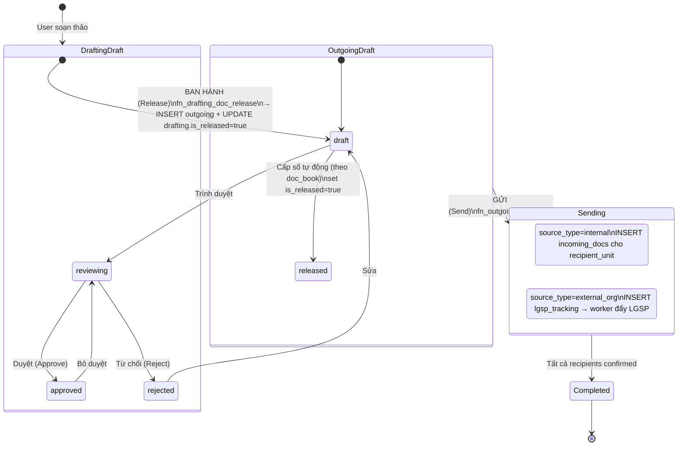
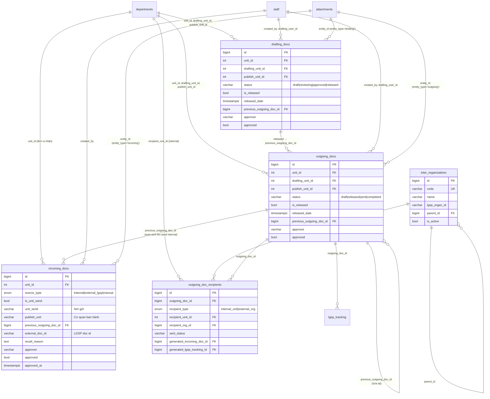

# DESIGN.md — Data Model v3.0

> **PURPOSE**: Thiết kế chi tiết schema data model v3.0. Phase 16 sẽ implement theo design này (rebuild master schema, reset DB clean). User MUST review + approve trước khi run Phase 16.

## Mục lục

1. [Audit Schema v2.0 vs Source .NET cũ — GAP Analysis](#1-audit-schema-v20-vs-source-net-cũ--gap-analysis)
2. [Schema v3.0 — `incoming_docs`](#2-schema-v30--incoming_docs)
3. [Schema v3.0 — `outgoing_docs`](#3-schema-v30--outgoing_docs)
4. [Schema v3.0 — `drafting_docs`](#4-schema-v30--drafting_docs)
5. [Schema v3.0 — Bảng mới: `outgoing_doc_recipients` + `inter_organizations`](#5-schema-v30--bảng-mới)
6. [Tables/Columns DROPPED in v3.0](#6-tablescolumns-dropped-in-v30)
7. [Lifecycle Workflow (Drafting → Ban hành → Gửi)](#7-lifecycle-workflow-drafting--ban-hành--gửi)
8. [Stored Procedure Signatures — Preview cho Phase 17](#8-stored-procedure-signatures--preview-cho-phase-17)
9. [ERD Diagram](#9-erd-diagram)
10. [Breaking Change Impact Analysis](#10-breaking-change-impact-analysis)
11. [Migration Strategy v2.0 → v3.0](#11-migration-strategy-v20--v30)
12. [Approval Gate](#12-approval-gate)

---

## 1. Audit Schema v2.0 vs Source .NET cũ — GAP Analysis

### 1.1 Bảng `incoming_docs` — Gap

| Field | Source .NET cũ (`IncomingDoc.cs`) | Schema v2.0 hiện tại | Schema v3.0 mới | Lý do thay đổi |
|-------|-----------------------------------|----------------------|------------------|-----------------|
| `id` | `Id` BIGINT PK | ✓ Có | ✓ Giữ nguyên | — |
| `unit_id` | `UnitId` | ✓ Có | ✓ Giữ nguyên | Đơn vị nhận |
| `publish_unit` | `PublishUnit` text | ✓ Có VARCHAR(500) | ✓ Giữ nguyên | Cơ quan ban hành (text gốc) |
| `unit_send` | `UnitSend` text | ✗ **THIẾU** | ✓ **THÊM** VARCHAR(500) | Nơi gửi (có thể khác publish_unit) |
| `is_unit_send` | `IsUnitSend` bool | ✗ **THIẾU** | ✓ **THÊM** BOOLEAN | true=gửi từ đơn vị nội bộ trong tỉnh |
| `source_type` | (derived từ `IsInterDoc` + `IsUnitSend`) | ✗ **THIẾU** | ✓ **THÊM** ENUM('internal','external_lgsp','manual') | Phân loại nguồn rõ ràng cho UI filter |
| `previous_outgoing_doc_id` | `PreviousIncomingDocId`/`PreviousOutgoingDocId` | ✗ **THIẾU** | ✓ **THÊM** BIGINT FK | Trace ngược về outgoing gốc |
| `external_doc_id` | `ID_VBLIENTHONG` | ✗ **THIẾU** (ở `inter_incoming_docs`) | ✓ **THÊM** VARCHAR(200) | LGSP doc id để dedupe |
| `recall_reason` | (recall flow) | ✗ **THIẾU** (ở `inter_incoming_docs`) | ✓ **THÊM** TEXT | Recall LGSP merge từ inter_incoming_docs |
| `recall_requested_at` | (recall flow) | ✗ **THIẾU** | ✓ **THÊM** TIMESTAMPTZ | Recall LGSP |
| `recall_response` | (recall flow) | ✗ **THIẾU** | ✓ **THÊM** TEXT | Recall LGSP response |
| `recall_responded_at` | (recall flow) | ✗ **THIẾU** | ✓ **THÊM** TIMESTAMPTZ | Recall LGSP |
| `status_before_recall` | (recall flow) | ✗ **THIẾU** | ✓ **THÊM** VARCHAR(50) | Recall LGSP rollback |
| `approver` | `Approver` text | ✓ Có VARCHAR(200) | ✓ Mở rộng → 255 | Khớp standard length |
| `approved` | `Approved` bool | ✓ Có | ✓ Giữ nguyên | 1 cấp duyệt |
| `approved_at` | (không có timestamp) | ✗ **THIẾU** | ✓ **THÊM** TIMESTAMPTZ | Audit purpose |
| `is_handling` | `IsHandling` bool | ✓ Có | ✗ **DROP** | Không sử dụng v2.0 |
| `is_inter_doc` | `IsInterDoc` bool | ✓ Có | ✗ **DROP** | Thay bằng `source_type` |
| `inter_doc_id` | `Id_VBLIENTHONG` int | ✓ Có | ✗ **DROP** | Thay bằng `external_doc_id` |
| `move_announcement` | `MoveAnnouncement` bool | ✗ THIẾU (đã từng có ở .NET) | ✗ KHÔNG THÊM | Không cần |
| `received_date`, `notation`, `document_code`, `abstract`, `publish_date`, `signer`, `sign_date`, `doc_book_id`, `doc_type_id`, `doc_field_id`, `secret_id`, `urgent_id`, `number`, `recipients`, `expired_date`, `created_by/at`, `updated_by/at`, `extra_fields`, `department_id`, `rejected_by`, `rejection_reason` | ✓ Có (giữ nguyên) | ✓ Có | ✓ Giữ nguyên | — |

**Tổng: 12 thay đổi cho `incoming_docs` (8 thêm, 3 drop, 1 mở rộng).**

### 1.2 Bảng `outgoing_docs` — Gap

| Field | Source .NET cũ | Schema v2.0 | Schema v3.0 mới | Lý do |
|-------|----------------|-------------|------------------|-------|
| `drafting_unit_id` | `DraftingUnitId` | ✓ Có | ✓ Giữ nguyên | Đơn vị soạn thảo |
| `publish_unit_id` | `PublishUnitId` int FK | ✓ Có | ✓ Giữ nguyên | Cơ quan ban hành (FK departments) |
| `is_released` | (derived từ `Number` cấp) | ✗ **THIẾU** | ✓ **THÊM** BOOLEAN DEFAULT FALSE | Tách bước Ban hành (cấp số) khỏi Gửi |
| `released_date` | `ReleasedDate`/`PublishDate` | ✗ **THIẾU** (chỉ có `publish_date`) | ✓ **THÊM** TIMESTAMPTZ | Timestamp action ban hành |
| `previous_outgoing_doc_id` | `PreviousOutgoingDocId` | ✗ **THIẾU** | ✓ **THÊM** BIGINT FK self | Sửa lại sau khi ban hành |
| `approver` | `Approver` text | ✓ Có | ✓ Mở rộng → 255 | Standard length |
| `approved` | `Approved` bool | ✓ Có | ✓ Giữ nguyên | 1 cấp duyệt |
| `approved_at` | (không có) | ✗ **THIẾU** | ✓ **THÊM** TIMESTAMPTZ | Audit purpose |
| `status` | (derived) | ✗ **THIẾU** | ✓ **THÊM** VARCHAR(50) DEFAULT 'draft' | Lifecycle: draft→released→sent→completed |
| `is_inter_doc` | `IsInterDoc` | ✓ Có | ✗ **DROP** | Recipient phân loại bằng `outgoing_doc_recipients.recipient_type` |
| `inter_doc_id` | `InterDocId` | ✓ Có | ✗ **DROP** | Tracking qua `lgsp_tracking` table |
| `is_handling` | `IsHandling` | ✓ Có | ✗ **DROP** | Không sử dụng |
| Tất cả cột khác (giữ nguyên) | — | ✓ Có | ✓ Giữ nguyên | — |

**Tổng: 9 thay đổi cho `outgoing_docs` (5 thêm, 3 drop, 1 mở rộng).**

### 1.3 Bảng `drafting_docs` — Gap

| Field | Source .NET cũ | Schema v2.0 | Schema v3.0 mới | Lý do |
|-------|----------------|-------------|------------------|-------|
| `is_released` | `IsReleased` bool | ✓ **ĐÃ CÓ** | ✓ Giữ nguyên + dùng đúng | Track drafting → outgoing |
| `released_date` | `ReleasedDate` | ✓ **ĐÃ CÓ** | ✓ Giữ nguyên | — |
| `previous_outgoing_doc_id` | `PreviousOutgoingDocId` | ✗ **THIẾU** | ✓ **THÊM** BIGINT FK | Khi sửa drafting đã release |
| `approver`, `approved` | ✓ Có | ✓ Có | ✓ Giữ nguyên | 1 cấp duyệt |
| `approved_at` | (không có) | ✗ **THIẾU** | ✓ **THÊM** TIMESTAMPTZ | Audit |
| `status` | (derived) | ✗ **THIẾU** | ✓ **THÊM** VARCHAR(50) DEFAULT 'draft' | Lifecycle: draft→reviewing→approved→released |
| Tất cả cột khác | — | ✓ Có | ✓ Giữ nguyên | — |

**Tổng: 3 thay đổi cho `drafting_docs` (3 thêm).**

### 1.4 Tổng GAP

- **24 cột THÊM** mới khắp 3 bảng
- **6 cột DROP** (legacy không dùng: is_handling, is_inter_doc, inter_doc_id, move_announcement)
- **3 cột MỞ RỘNG** (approver VARCHAR 200 → 255)
- **2 bảng MỚI**: `outgoing_doc_recipients`, `inter_organizations`
- **2 bảng DROP**: `inter_incoming_docs`, `attachment_inter_incoming_docs`
- **1 bảng RENAME**: `lgsp_organizations` → `inter_organizations` (data migrate)

---

## 2. Schema v3.0 — `incoming_docs`

```sql
-- DROP existing
DROP TABLE IF EXISTS edoc.incoming_docs CASCADE;

-- CREATE TYPE source_type ENUM (idempotent guard)
DO $$ BEGIN
  CREATE TYPE edoc.doc_source_type AS ENUM ('internal', 'external_lgsp', 'manual');
EXCEPTION
  WHEN duplicate_object THEN NULL;
END $$;

CREATE TABLE edoc.incoming_docs (
  id                          BIGSERIAL PRIMARY KEY,
  unit_id                     INTEGER NOT NULL REFERENCES public.departments(id) ON DELETE RESTRICT,
  department_id               INTEGER NULL REFERENCES public.departments(id) ON DELETE SET NULL,

  -- Identity
  number                      INTEGER NULL,
  notation                    VARCHAR(100) NULL,
  document_code               VARCHAR(100) NULL,
  abstract                    TEXT NULL,

  -- v3.0 NEW: Source classification
  source_type                 edoc.doc_source_type NOT NULL DEFAULT 'manual',
  is_unit_send                BOOLEAN NOT NULL DEFAULT FALSE,
  unit_send                   VARCHAR(500) NULL,
  previous_outgoing_doc_id    BIGINT NULL REFERENCES edoc.outgoing_docs(id) ON DELETE SET NULL,
  external_doc_id             VARCHAR(200) NULL,

  -- Cơ quan ban hành (text gốc, có thể không phải đơn vị trong hệ thống)
  publish_unit                VARCHAR(500) NULL,
  publish_date                TIMESTAMPTZ NULL,
  signer                      VARCHAR(200) NULL,
  sign_date                   TIMESTAMPTZ NULL,

  -- Categorization
  doc_book_id                 INTEGER NULL REFERENCES public.doc_books(id) ON DELETE SET NULL,
  doc_type_id                 INTEGER NULL REFERENCES public.doc_types(id) ON DELETE SET NULL,
  doc_field_id                INTEGER NULL REFERENCES public.doc_fields(id) ON DELETE SET NULL,
  secret_id                   SMALLINT NULL DEFAULT 1,
  urgent_id                   SMALLINT NULL DEFAULT 1,

  -- Receipt info
  received_date               TIMESTAMPTZ NULL,
  received_paper_date         TIMESTAMPTZ NULL,
  is_received_paper           BOOLEAN NULL DEFAULT FALSE,
  number_paper                INTEGER NULL DEFAULT 1,
  number_copies               INTEGER NULL DEFAULT 1,
  expired_date                TIMESTAMPTZ NULL,

  -- Recipients (text list — nội bộ phân phối)
  recipients                  TEXT NULL,
  sents                       TEXT NULL,

  -- v3.0 NEW: Approval (1 cấp boolean như source cũ)
  approver                    VARCHAR(255) NULL,
  approved                    BOOLEAN NULL DEFAULT FALSE,
  approved_at                 TIMESTAMPTZ NULL,

  -- v3.0 NEW: Recall flow LGSP (gộp từ inter_incoming_docs)
  recall_reason               TEXT NULL,
  recall_requested_at         TIMESTAMPTZ NULL,
  recall_response             TEXT NULL,
  recall_responded_at         TIMESTAMPTZ NULL,
  status_before_recall        VARCHAR(50) NULL,

  -- Rejection
  rejected_by                 INTEGER NULL REFERENCES public.staff(id) ON DELETE SET NULL,
  rejection_reason            TEXT NULL,

  -- Misc
  archive_status              BOOLEAN NULL DEFAULT FALSE,
  extra_fields                JSONB NULL DEFAULT '{}',

  -- Audit
  created_by                  INTEGER NOT NULL REFERENCES public.staff(id) ON DELETE RESTRICT,
  created_at                  TIMESTAMPTZ NULL DEFAULT NOW(),
  updated_by                  INTEGER NULL,
  updated_at                  TIMESTAMPTZ NULL DEFAULT NOW(),

  -- v3.0 DROPPED: is_handling, is_inter_doc, inter_doc_id (legacy)
  CONSTRAINT chk_incoming_external_doc_id_required
    CHECK (source_type != 'external_lgsp' OR external_doc_id IS NOT NULL)
);

-- Indexes
CREATE INDEX idx_incoming_docs_unit ON edoc.incoming_docs(unit_id, received_date DESC);
CREATE INDEX idx_incoming_docs_notation ON edoc.incoming_docs(notation);
CREATE INDEX idx_incoming_docs_number ON edoc.incoming_docs(unit_id, number);
CREATE INDEX idx_incoming_docs_search ON edoc.incoming_docs USING gin(abstract gin_trgm_ops);
CREATE INDEX idx_incoming_docs_department ON edoc.incoming_docs(department_id);
-- v3.0 NEW indexes:
CREATE INDEX idx_incoming_docs_source_type ON edoc.incoming_docs(source_type, status); -- filter UI
CREATE INDEX idx_incoming_docs_previous_outgoing ON edoc.incoming_docs(previous_outgoing_doc_id) WHERE previous_outgoing_doc_id IS NOT NULL;
CREATE UNIQUE INDEX idx_incoming_docs_external_dedupe ON edoc.incoming_docs(external_doc_id) WHERE external_doc_id IS NOT NULL AND source_type = 'external_lgsp';

-- Comments
COMMENT ON COLUMN edoc.incoming_docs.source_type IS 'internal=gửi từ đơn vị nội bộ trong tỉnh; external_lgsp=nhận qua LGSP; manual=nhập tay/scan';
COMMENT ON COLUMN edoc.incoming_docs.is_unit_send IS 'true=unit_send là đơn vị nội bộ; false=ngoài tỉnh hoặc nhập tay';
COMMENT ON COLUMN edoc.incoming_docs.unit_send IS 'Tên đơn vị/cơ quan GỬI văn bản đến (có thể khác publish_unit)';
COMMENT ON COLUMN edoc.incoming_docs.publish_unit IS 'Cơ quan BAN HÀNH (ai ký gốc), text vì có thể là cơ quan ngoài hệ thống';
COMMENT ON COLUMN edoc.incoming_docs.previous_outgoing_doc_id IS 'Trace ngược về outgoing_docs gốc khi source_type=internal';
COMMENT ON COLUMN edoc.incoming_docs.external_doc_id IS 'LGSP doc id (chỉ khi source_type=external_lgsp), dùng dedupe khi worker pull';
```

---

## 3. Schema v3.0 — `outgoing_docs`

```sql
DROP TABLE IF EXISTS edoc.outgoing_docs CASCADE;

CREATE TABLE edoc.outgoing_docs (
  id                          BIGSERIAL PRIMARY KEY,
  unit_id                     INTEGER NOT NULL REFERENCES public.departments(id) ON DELETE RESTRICT,
  department_id               INTEGER NULL REFERENCES public.departments(id) ON DELETE SET NULL,

  -- Identity
  number                      INTEGER NULL,
  sub_number                  VARCHAR(20) NULL,
  notation                    VARCHAR(100) NULL,
  document_code               VARCHAR(100) NULL,
  abstract                    TEXT NULL,

  -- Đơn vị soạn thảo + Cơ quan ban hành (TÁCH RIÊNG)
  drafting_unit_id            INTEGER NULL REFERENCES public.departments(id) ON DELETE SET NULL,
  drafting_user_id            INTEGER NULL REFERENCES public.staff(id) ON DELETE SET NULL,
  publish_unit_id             INTEGER NULL REFERENCES public.departments(id) ON DELETE SET NULL,
  publish_date                TIMESTAMPTZ NULL,

  -- Signer
  signer                      VARCHAR(200) NULL,
  sign_date                   TIMESTAMPTZ NULL,
  expired_date                TIMESTAMPTZ NULL,

  -- v3.0 NEW: Lifecycle status + Released tracking
  status                      VARCHAR(50) NOT NULL DEFAULT 'draft',
  is_released                 BOOLEAN NOT NULL DEFAULT FALSE,
  released_date               TIMESTAMPTZ NULL,
  previous_outgoing_doc_id    BIGINT NULL REFERENCES edoc.outgoing_docs(id) ON DELETE SET NULL,

  -- Categorization
  number_paper                INTEGER NULL DEFAULT 1,
  number_copies               INTEGER NULL DEFAULT 1,
  secret_id                   SMALLINT NULL DEFAULT 1,
  urgent_id                   SMALLINT NULL DEFAULT 1,
  doc_book_id                 INTEGER NULL REFERENCES public.doc_books(id) ON DELETE SET NULL,
  doc_type_id                 INTEGER NULL REFERENCES public.doc_types(id) ON DELETE SET NULL,
  doc_field_id                INTEGER NULL REFERENCES public.doc_fields(id) ON DELETE SET NULL,

  -- Recipients (giữ text legacy + bảng mới outgoing_doc_recipients)
  recipients                  TEXT NULL,

  -- v3.0 NEW: Approval (1 cấp boolean như source cũ)
  approver                    VARCHAR(255) NULL,
  approved                    BOOLEAN NULL DEFAULT FALSE,
  approved_at                 TIMESTAMPTZ NULL,

  -- Receipt + Misc
  received_date               TIMESTAMPTZ NULL,
  archive_status              BOOLEAN NULL DEFAULT FALSE,
  is_digital_signed           SMALLINT NULL DEFAULT 0,
  extra_fields                JSONB NULL DEFAULT '{}',

  -- Rejection
  rejected_by                 INTEGER NULL REFERENCES public.staff(id) ON DELETE SET NULL,
  rejection_reason            TEXT NULL,

  -- Audit
  created_by                  INTEGER NOT NULL REFERENCES public.staff(id) ON DELETE RESTRICT,
  created_at                  TIMESTAMPTZ NULL DEFAULT NOW(),
  updated_by                  INTEGER NULL,
  updated_at                  TIMESTAMPTZ NULL DEFAULT NOW(),

  -- v3.0 DROPPED: is_inter_doc, inter_doc_id, is_handling

  CONSTRAINT chk_outgoing_status_valid
    CHECK (status IN ('draft', 'reviewing', 'released', 'sent', 'completed', 'rejected'))
);

-- Indexes
CREATE INDEX idx_outgoing_docs_unit ON edoc.outgoing_docs(unit_id, received_date DESC);
CREATE INDEX idx_outgoing_docs_search ON edoc.outgoing_docs USING gin(abstract gin_trgm_ops);
CREATE INDEX idx_outgoing_docs_department ON edoc.outgoing_docs(department_id);
-- v3.0 NEW indexes:
CREATE INDEX idx_outgoing_docs_status ON edoc.outgoing_docs(unit_id, status, is_released);
CREATE INDEX idx_outgoing_docs_publish_unit ON edoc.outgoing_docs(publish_unit_id);
CREATE INDEX idx_outgoing_docs_drafting_unit ON edoc.outgoing_docs(drafting_unit_id);
CREATE INDEX idx_outgoing_docs_previous ON edoc.outgoing_docs(previous_outgoing_doc_id) WHERE previous_outgoing_doc_id IS NOT NULL;

COMMENT ON COLUMN edoc.outgoing_docs.status IS 'Lifecycle: draft → reviewing → released (đã ban hành) → sent (đã gửi recipients) → completed';
COMMENT ON COLUMN edoc.outgoing_docs.is_released IS 'true=đã Ban hành (cấp số, set released_date); false=chưa ban hành';
COMMENT ON COLUMN edoc.outgoing_docs.drafting_unit_id IS 'Phòng ban SOẠN THẢO (có thể khác publish_unit_id, VD: Phòng KT soạn cho Sở TC ký)';
COMMENT ON COLUMN edoc.outgoing_docs.publish_unit_id IS 'Cơ quan BAN HÀNH (ai ký, có quyền ban hành chính thức)';
```

---

## 4. Schema v3.0 — `drafting_docs`

```sql
DROP TABLE IF EXISTS edoc.drafting_docs CASCADE;

CREATE TABLE edoc.drafting_docs (
  id                          BIGSERIAL PRIMARY KEY,
  unit_id                     INTEGER NOT NULL REFERENCES public.departments(id) ON DELETE RESTRICT,
  department_id               INTEGER NULL REFERENCES public.departments(id) ON DELETE SET NULL,

  -- Identity
  number                      INTEGER NULL,
  sub_number                  VARCHAR(20) NULL,
  notation                    VARCHAR(100) NULL,
  document_code               VARCHAR(100) NULL,
  abstract                    TEXT NULL,

  -- Đơn vị soạn thảo + Cơ quan ban hành (giống outgoing_docs)
  drafting_unit_id            INTEGER NULL REFERENCES public.departments(id) ON DELETE SET NULL,
  drafting_user_id            INTEGER NULL REFERENCES public.staff(id) ON DELETE SET NULL,
  publish_unit_id             INTEGER NULL REFERENCES public.departments(id) ON DELETE SET NULL,
  publish_date                TIMESTAMPTZ NULL,

  -- Signer (dự kiến)
  signer                      VARCHAR(200) NULL,
  sign_date                   TIMESTAMPTZ NULL,
  expired_date                TIMESTAMPTZ NULL,

  -- v3.0 NEW: Status lifecycle (giữ is_released + released_date đã có v2.0)
  status                      VARCHAR(50) NOT NULL DEFAULT 'draft',
  is_released                 BOOLEAN NULL DEFAULT FALSE,
  released_date               TIMESTAMPTZ NULL,
  previous_outgoing_doc_id    BIGINT NULL REFERENCES edoc.outgoing_docs(id) ON DELETE SET NULL,

  -- Categorization
  number_paper                INTEGER NULL DEFAULT 1,
  number_copies               INTEGER NULL DEFAULT 1,
  secret_id                   SMALLINT NULL DEFAULT 1,
  urgent_id                   SMALLINT NULL DEFAULT 1,
  doc_book_id                 INTEGER NULL REFERENCES public.doc_books(id) ON DELETE SET NULL,
  doc_type_id                 INTEGER NULL REFERENCES public.doc_types(id) ON DELETE SET NULL,
  doc_field_id                INTEGER NULL REFERENCES public.doc_fields(id) ON DELETE SET NULL,

  -- Recipients dự kiến (text + bảng outgoing_doc_recipients sau release)
  recipients                  TEXT NULL,

  -- v3.0 NEW: Approval
  approver                    VARCHAR(255) NULL,
  approved                    BOOLEAN NULL DEFAULT FALSE,
  approved_at                 TIMESTAMPTZ NULL,

  -- Receipt + Misc
  received_date               TIMESTAMPTZ NULL,
  reject_reason               TEXT NULL,
  extra_fields                JSONB NULL DEFAULT '{}',

  -- Rejection
  rejected_by                 INTEGER NULL REFERENCES public.staff(id) ON DELETE SET NULL,
  rejection_reason            TEXT NULL,

  -- Audit
  created_by                  INTEGER NOT NULL REFERENCES public.staff(id) ON DELETE RESTRICT,
  created_at                  TIMESTAMPTZ NULL DEFAULT NOW(),
  updated_by                  INTEGER NULL,
  updated_at                  TIMESTAMPTZ NULL DEFAULT NOW(),

  CONSTRAINT chk_drafting_status_valid
    CHECK (status IN ('draft', 'reviewing', 'approved', 'released', 'rejected'))
);

CREATE INDEX idx_drafting_docs_unit ON edoc.drafting_docs(unit_id, received_date DESC);
CREATE INDEX idx_drafting_docs_search ON edoc.drafting_docs USING gin(abstract gin_trgm_ops);
CREATE INDEX idx_drafting_docs_department ON edoc.drafting_docs(department_id);
CREATE INDEX idx_drafting_docs_status ON edoc.drafting_docs(unit_id, status, is_released);
CREATE INDEX idx_drafting_docs_previous ON edoc.drafting_docs(previous_outgoing_doc_id) WHERE previous_outgoing_doc_id IS NOT NULL;

COMMENT ON COLUMN edoc.drafting_docs.status IS 'draft → reviewing → approved (sẵn sàng release) → released (đã thành Outgoing)';
COMMENT ON COLUMN edoc.drafting_docs.is_released IS 'true=đã Release thành Outgoing, không sửa nữa (trừ tạo Outgoing mới)';
```

---

## 5. Schema v3.0 — Bảng mới

### 5.1 `outgoing_doc_recipients` (Multi-recipient picker)

```sql
DROP TABLE IF EXISTS edoc.outgoing_doc_recipients CASCADE;

DO $$ BEGIN
  CREATE TYPE edoc.recipient_type_enum AS ENUM ('internal_unit', 'external_org');
EXCEPTION WHEN duplicate_object THEN NULL; END $$;

CREATE TABLE edoc.outgoing_doc_recipients (
  id                  BIGSERIAL PRIMARY KEY,
  outgoing_doc_id     BIGINT NOT NULL REFERENCES edoc.outgoing_docs(id) ON DELETE CASCADE,
  recipient_type      edoc.recipient_type_enum NOT NULL,
  recipient_unit_id   INTEGER NULL REFERENCES public.departments(id) ON DELETE RESTRICT,
  recipient_org_id    BIGINT NULL REFERENCES edoc.inter_organizations(id) ON DELETE RESTRICT,

  -- Send tracking
  sent_at             TIMESTAMPTZ NULL,
  sent_status         VARCHAR(20) NOT NULL DEFAULT 'pending',
  error_message       TEXT NULL,

  -- Generated incoming/lgsp_tracking reference (sau khi send thành công)
  generated_incoming_doc_id BIGINT NULL REFERENCES edoc.incoming_docs(id) ON DELETE SET NULL,
  generated_lgsp_tracking_id BIGINT NULL REFERENCES edoc.lgsp_tracking(id) ON DELETE SET NULL,

  created_at          TIMESTAMPTZ NOT NULL DEFAULT NOW(),

  CONSTRAINT chk_recipient_xor CHECK (
    (recipient_type = 'internal_unit' AND recipient_unit_id IS NOT NULL AND recipient_org_id IS NULL) OR
    (recipient_type = 'external_org'  AND recipient_org_id  IS NOT NULL AND recipient_unit_id IS NULL)
  ),
  CONSTRAINT chk_recipient_sent_status
    CHECK (sent_status IN ('pending', 'sent', 'failed'))
);

CREATE INDEX idx_outgoing_recipients_doc ON edoc.outgoing_doc_recipients(outgoing_doc_id);
CREATE INDEX idx_outgoing_recipients_pending ON edoc.outgoing_doc_recipients(sent_status, recipient_type) WHERE sent_status = 'pending';
CREATE INDEX idx_outgoing_recipients_unit ON edoc.outgoing_doc_recipients(recipient_unit_id) WHERE recipient_unit_id IS NOT NULL;
CREATE INDEX idx_outgoing_recipients_org ON edoc.outgoing_doc_recipients(recipient_org_id) WHERE recipient_org_id IS NOT NULL;

COMMENT ON TABLE edoc.outgoing_doc_recipients IS 'Multi-recipient cho mỗi outgoing_doc. Phân loại internal_unit (đơn vị nội bộ tỉnh) vs external_org (cơ quan LGSP ngoài).';
COMMENT ON COLUMN edoc.outgoing_doc_recipients.generated_incoming_doc_id IS 'Sau khi send: nếu internal_unit → incoming_docs.id auto-sinh';
COMMENT ON COLUMN edoc.outgoing_doc_recipients.generated_lgsp_tracking_id IS 'Sau khi send: nếu external_org → lgsp_tracking.id để worker đẩy LGSP';
```

### 5.2 `inter_organizations` (Danh mục cơ quan LGSP — rename từ lgsp_organizations)

```sql
-- Migrate data từ lgsp_organizations trước khi DROP
-- (Phase 16 implementation)

DROP TABLE IF EXISTS edoc.inter_organizations CASCADE;

CREATE TABLE edoc.inter_organizations (
  id              BIGSERIAL PRIMARY KEY,
  code            VARCHAR(50) NOT NULL,
  name            VARCHAR(500) NOT NULL,
  lgsp_organ_id   VARCHAR(100) NULL,
  parent_id       BIGINT NULL REFERENCES edoc.inter_organizations(id) ON DELETE SET NULL,
  address         VARCHAR(500) NULL,
  email           VARCHAR(200) NULL,
  phone           VARCHAR(50) NULL,
  is_active       BOOLEAN NOT NULL DEFAULT TRUE,
  synced_at       TIMESTAMPTZ NULL,
  created_at      TIMESTAMPTZ NOT NULL DEFAULT NOW(),
  updated_at      TIMESTAMPTZ NOT NULL DEFAULT NOW(),

  CONSTRAINT uq_inter_org_code UNIQUE (code)
);

CREATE INDEX idx_inter_org_lgsp_id ON edoc.inter_organizations(lgsp_organ_id) WHERE lgsp_organ_id IS NOT NULL;
CREATE INDEX idx_inter_org_parent ON edoc.inter_organizations(parent_id);
CREATE INDEX idx_inter_org_active ON edoc.inter_organizations(is_active) WHERE is_active = TRUE;

COMMENT ON TABLE edoc.inter_organizations IS 'Danh mục cơ quan ngoài tỉnh dùng cho LGSP. Rename từ lgsp_organizations v2.0.';
```

---

## 6. Tables/Columns DROPPED in v3.0

### 6.1 Tables to DROP

| Table | Lý do | Data migration |
|-------|-------|----------------|
| `edoc.inter_incoming_docs` | Gộp vào `incoming_docs` với `source_type='external_lgsp'` | KHÔNG migrate (reset DB clean) — Phase 16 chỉ DROP |
| `edoc.attachment_inter_incoming_docs` | Gộp vào `attachments` polymorphic với `entity_type='incoming'` | KHÔNG migrate |
| `edoc.lgsp_organizations` | Rename thành `inter_organizations` | Phase 16 sẽ INSERT seed mới (8 cơ quan demo) |

### 6.2 Stored Procedures to DROP (cùng với inter_incoming_docs)

- `fn_inter_incoming_create`
- `fn_inter_incoming_get_by_id`
- `fn_inter_incoming_get_list`
- `fn_inter_incoming_receive`
- `fn_inter_incoming_complete`
- `fn_inter_incoming_return`
- `fn_attachment_inter_incoming_create`
- `fn_attachment_inter_incoming_delete`
- `fn_attachment_inter_incoming_get_list`

→ Các SP này được REPLACE bằng `fn_incoming_doc_*` chuẩn (đã có sẵn) + filter `WHERE source_type='external_lgsp'`.

### 6.3 Columns to DROP từ 3 bảng core

| Table | Column | Lý do |
|-------|--------|-------|
| incoming_docs | `is_handling` | Legacy, không sử dụng |
| incoming_docs | `is_inter_doc` | Thay bằng `source_type='external_lgsp'` |
| incoming_docs | `inter_doc_id` | Thay bằng `external_doc_id` |
| outgoing_docs | `is_handling` | Legacy |
| outgoing_docs | `is_inter_doc` | Recipient phân loại bằng `outgoing_doc_recipients.recipient_type` |
| outgoing_docs | `inter_doc_id` | Tracking qua `lgsp_tracking` |

---

## 7. Lifecycle Workflow (Drafting → Ban hành → Gửi)



### 7.1 Status values cho mỗi bảng

**`drafting_docs.status`:**
| Value | Mô tả | Action chuyển |
|-------|-------|---------------|
| `'draft'` | Đang soạn | User edit + save |
| `'reviewing'` | Trình duyệt | Click "Trình duyệt" |
| `'approved'` | Đã duyệt (sẵn sàng ban hành) | `approved=true` + click "Duyệt" |
| `'released'` | Đã ban hành (đã thành Outgoing) | `is_released=true` |
| `'rejected'` | Bị từ chối | Click "Từ chối" |

**`outgoing_docs.status`:**
| Value | Mô tả | Action chuyển |
|-------|-------|---------------|
| `'draft'` | Mới tạo, chưa ban hành | INSERT từ Drafting Release |
| `'reviewing'` | Đang trình duyệt thêm (optional) | — |
| `'released'` | Đã ban hành (cấp số), chưa gửi | `fn_outgoing_doc_release` |
| `'sent'` | Đã gửi cho recipients | `fn_outgoing_doc_send` |
| `'completed'` | Tất cả recipients confirmed | Manual hoặc auto |

**`incoming_docs.status`** (giữ nguyên v2.0 — không thay đổi):
| Value | Mô tả |
|-------|-------|
| `'pending'` | Mới nhận, chưa xử lý |
| `'received'` | Đã tiếp nhận |
| `'completed'` | Đã hoàn thành |
| `'returned'` | Đã trả lại |
| `'recall_requested'` | Yêu cầu thu hồi (chỉ external_lgsp) |
| `'recalled'` | Đã thu hồi (chỉ external_lgsp) |

### 7.2 Rules transition (CHECK constraint + SP validation)

1. **Drafting `approved=true` mới được Release** → SP `fn_drafting_doc_release` validate
2. **Outgoing `is_released=true` mới được Send** → SP `fn_outgoing_doc_send` validate
3. **Sửa Drafting đã `is_released=true`** → tạo Drafting MỚI với `previous_outgoing_doc_id` trỏ về Outgoing cũ (giữ lịch sử)

---

## 8. Stored Procedure Signatures — Preview cho Phase 17

> **Note:** Phase 15 chỉ preview signatures. Implementation chi tiết ở Phase 17.

### 8.1 `fn_drafting_doc_approve`

```sql
CREATE OR REPLACE FUNCTION edoc.fn_drafting_doc_approve(
  p_drafting_doc_id BIGINT,
  p_user_id         INTEGER,
  p_approver_name   VARCHAR(255)
) RETURNS TABLE(
  success BOOLEAN,
  message TEXT
)
```

**Mô tả:** Set `approved=true` + `approver=tên user` + `approved_at=NOW()` cho drafting. Validate quyền user (phải là creator hoặc role approver). Audit log.

### 8.2 `fn_drafting_doc_unapprove`

```sql
CREATE OR REPLACE FUNCTION edoc.fn_drafting_doc_unapprove(
  p_drafting_doc_id BIGINT,
  p_user_id         INTEGER
) RETURNS TABLE(
  success BOOLEAN,
  message TEXT
)
```

**Mô tả:** Bỏ duyệt: set `approved=false` + clear `approver` + `approved_at=NULL`. Chỉ cho phép khi `is_released=false`.

### 8.3 `fn_drafting_doc_release` (đã có v2.0, mở rộng)

```sql
CREATE OR REPLACE FUNCTION edoc.fn_drafting_doc_release(
  p_drafting_doc_id BIGINT,
  p_user_id         INTEGER,
  p_doc_book_id     INTEGER  -- để cấp số tự động
) RETURNS TABLE(
  success           BOOLEAN,
  message           TEXT,
  outgoing_doc_id   BIGINT,
  number            INTEGER
)
```

**Mô tả:** Validate `approved=true`. INSERT outgoing_docs (copy fields từ drafting). Cấp số tự động từ `doc_book.next_number`. Set `drafting.is_released=true` + `released_date=NOW()`. Outgoing có `status='draft'`, `is_released=true`, `released_date=NOW()`.

### 8.4 `fn_outgoing_doc_release` (NEW — chuyển status sau khi đã có Outgoing)

```sql
CREATE OR REPLACE FUNCTION edoc.fn_outgoing_doc_release(
  p_outgoing_doc_id BIGINT,
  p_user_id         INTEGER
) RETURNS TABLE(
  success BOOLEAN,
  message TEXT,
  number  INTEGER
)
```

**Mô tả:** Trong trường hợp Outgoing được tạo trực tiếp (không qua Drafting), gọi SP này để Ban hành: cấp số + `is_released=true` + `status='released'`. Validate `approved=true`.

### 8.5 `fn_outgoing_doc_send` (NEW — quan trọng nhất)

```sql
CREATE OR REPLACE FUNCTION edoc.fn_outgoing_doc_send(
  p_outgoing_doc_id BIGINT,
  p_user_id         INTEGER
) RETURNS TABLE(
  success         BOOLEAN,
  message         TEXT,
  internal_count  INTEGER,  -- số incoming_docs auto-sinh
  external_count  INTEGER,  -- số lgsp_tracking auto-tạo
  failed_count    INTEGER
)
```

**Mô tả:**
1. Validate `is_released=true` + `status IN ('released', 'sent')`
2. Loop qua `outgoing_doc_recipients` của outgoing này:
   - Nếu `recipient_type='internal_unit'`:
     - INSERT vào `incoming_docs` với:
       - `unit_id = recipient_unit_id`
       - `source_type='internal'`
       - `is_unit_send=true`, `unit_send=` tên đơn vị gửi (từ outgoing.unit_id department.name)
       - `publish_unit=` tên publish_unit_id department
       - `previous_outgoing_doc_id = p_outgoing_doc_id`
       - `notation`, `document_code`, `abstract`, `signer`, `sign_date`, etc. copy từ outgoing
       - `status='pending'`, `received_date=NOW()`
     - UPDATE `outgoing_doc_recipients`: `sent_status='sent'`, `sent_at=NOW()`, `generated_incoming_doc_id`
   - Nếu `recipient_type='external_org'`:
     - INSERT vào `lgsp_tracking` với:
       - `outgoing_doc_id`, `direction='send'`, `dest_org_code`, `status='pending'`
     - UPDATE `outgoing_doc_recipients`: `sent_status='pending'`, `generated_lgsp_tracking_id`
3. Set `outgoing.status='sent'` nếu tất cả recipients đã sent (internal) hoặc enqueued (external)
4. Audit log

### 8.6 `fn_outgoing_doc_recipients_create` (Bulk insert recipients)

```sql
CREATE OR REPLACE FUNCTION edoc.fn_outgoing_doc_recipients_create(
  p_outgoing_doc_id BIGINT,
  p_recipients      JSONB  -- array of {type, unit_id|org_id}
) RETURNS INTEGER  -- count inserted
```

**Mô tả:** Bulk INSERT `outgoing_doc_recipients` từ JSONB array. Validate recipient_type + xor constraint. Trả về số rows inserted.

### 8.7 SP migration LGSP (Phase 18 sẽ implement chi tiết)

- `fn_inter_organizations_sync` — sync danh mục cơ quan từ LGSP API
- `fn_lgsp_receive_to_incoming` — worker job pull LGSP → INSERT incoming_docs với `source_type='external_lgsp'`

---

## 9. ERD Diagram



---

## 10. Breaking Change Impact Analysis

| Module | Affected Tables/SPs | Risk Level | Mitigation Plan |
|--------|---------------------|-----------|-----------------|
| **HSCV (Hồ sơ công việc)** | `handling_docs`, `attachment_handling_docs`. SP `fn_handling_doc_*` join với incoming/outgoing/drafting | 🟡 Medium | (1) Verify FK liên kết qua `handling_docs.incoming_doc_id` vẫn ổn (incoming_docs vẫn có id PK). (2) SP `fn_handling_doc_get_list` filter theo `is_handling` → cột này bị DROP → phải sửa SP để dùng status mới hoặc filter qua handling_docs trực tiếp. (3) Phase 17 sẽ check + update SP. |
| **Ký số v2.0** | `attachments` polymorphic (`entity_type ∈ {incoming, outgoing, drafting, handling}`), `sign_transactions` | 🟢 Low | `entity_type` enum không thay đổi. Attachment `entity_id` trỏ về incoming_docs/outgoing_docs/drafting_docs.id — PK không đổi → an toàn. Phase 16 chỉ verify với psql `\d attachments`. |
| **Dashboard widgets** | `fn_dashboard_stats_*` (count incoming/outgoing/drafting) | 🔴 High | (1) SP đếm `incoming_docs WHERE is_inter_doc=true` cho widget LGSP → sửa thành `WHERE source_type='external_lgsp'`. (2) Widget mới: count theo `source_type` (3 columns). (3) Phase 19 update SP. |
| **Báo cáo Excel export** | `reports/*.repository.ts` query columns explicit | 🟡 Medium | (1) Verify `is_handling`, `is_inter_doc`, `inter_doc_id` không có trong export columns (grep code). (2) Có thể cần thêm `source_type` vào export "Báo cáo VB đến". |
| **Frontend pages** | `/van-ban-den`, `/van-ban-di`, `/van-ban-du-thao`, `/van-ban-lien-thong` | 🔴 High | Phase 19 rewrite toàn bộ form 3 màn + bỏ menu `/van-ban-lien-thong`. Phase 20 regression test. |
| **Phân quyền + RBAC** | Role permissions trên `incoming_docs` / `outgoing_docs` / `drafting_docs` / `inter_incoming_docs` | 🟡 Medium | Sau khi DROP `inter_incoming_docs`, các permission record cũ bị mất. Phase 16 seed lại role permissions cho 3 bảng (không cần inter_incoming nữa). |
| **API endpoints** | `/van-ban-lien-thong/*` routes (Phase 6 v1.0) | 🔴 High | Phase 19 sẽ remove routes này, gộp vào `/van-ban-den`. Cần keep tạm với 410 Gone redirect cho an toàn? **Recommended:** xoá hẳn vì user approved reset clean. |
| **Worker LGSP** (mock) | `workers/src/index.ts` lgsp-receive job | 🟡 Medium | Worker hiện tại INSERT vào `inter_incoming_docs` → Phase 18 sẽ rewrite INSERT vào `incoming_docs` với `source_type='external_lgsp'`. |
| **MongoDB audit logs** | (chưa dùng nhiều) | 🟢 Low | Không dependency với schema. |
| **Background jobs / cron** | (không có) | 🟢 Low | — |

### 10.1 Tổng risk

- **High risk modules (3):** Dashboard widgets, Frontend pages, API endpoints liên thông
- **Medium risk modules (4):** HSCV, Báo cáo Excel, RBAC, Worker LGSP
- **Low risk modules (3):** Ký số, MongoDB audit, Background jobs

**Phase 20 Regression checklist:**
1. Login + thấy dashboard không vỡ
2. Vào HSCV → mở 1 HSCV bất kỳ → tab "Văn bản đến" hiển thị đúng
3. Vào ký số 4 tab → Cần ký liệt kê đúng
4. Export Excel báo cáo VB đến/đi không lỗi
5. Vào `/van-ban-den` → filter source_type → 3 nhóm hiển thị
6. Tạo Drafting → Duyệt → Ban hành → Outgoing có số → Gửi → Sở khác thấy ở VB đến
7. Worker LGSP polling không crash

---

## 11. Migration Strategy v2.0 → v3.0

### 11.1 Bước 1: Bump master schema file

```bash
# Phase 16 sẽ:
mv e_office_app_new/database/schema/000_schema_v2.0.sql \
   e_office_app_new/database/archive/v2.0-finalized/000_schema_v2.0.sql

# Tạo file mới
touch e_office_app_new/database/schema/000_schema_v3.0.sql
```

### 11.2 Bước 2: Update reference paths trong scripts

- `deploy/reset-db-windows.ps1` — đổi reference `000_schema_v2.0.sql` → `000_schema_v3.0.sql`
- `deploy/deploy-windows.ps1` — same
- `deploy/update-windows.ps1` — same
- `deploy/README.md` — update path documentation

### 11.3 Bước 3: Reset DB clean (user approved D-2026-04-23)

```powershell
# Phase 16 chạy:
.\deploy\reset-db-windows.ps1
# → Drop schemas (edoc, esto, cont, iso, public)
# → Apply init/01_create_schemas.sql
# → Apply schema/000_schema_v3.0.sql (NEW)
# → Apply seed/001_required_data.sql
# → Apply seed/002_demo_data.sql (updated cho schema mới)
```

### 11.4 Bước 4: Verify

```sql
-- Verify SP count
SELECT count(*) FROM pg_proc
  WHERE pronamespace IN ('public'::regnamespace, 'edoc'::regnamespace)
    AND proname LIKE 'fn_%';
-- Phase 16 expect: ≥ 350 SPs (bỏ 9 SPs inter_incoming + thêm SPs mới release/send)

-- Verify NO SP overload
SELECT count(*) FROM (
  SELECT n.nspname, p.proname, count(*)
  FROM pg_proc p JOIN pg_namespace n ON n.oid = p.pronamespace
  WHERE n.nspname IN ('public','edoc') AND p.proname LIKE 'fn_%'
  GROUP BY 1,2 HAVING count(*) > 1
) t;
-- Expect: 0

-- Verify new tables
\d edoc.outgoing_doc_recipients
\d edoc.inter_organizations
\d edoc.incoming_docs   -- check source_type column

-- Verify dropped tables
\dt edoc.inter_incoming_docs   -- expect: not found
```

### 11.5 Bước 5: Update CLAUDE.md DB Migration Strategy section

- Bump version reference từ "v2.0" sang "v3.0"
- Update file paths
- Note: keep `archive/v2.0-finalized/` cho rollback nếu cần

---

## 12. Approval Gate

> ⚠️ **STOP — DESIGN.md cần USER REVIEW + APPROVE trước khi chạy Phase 16.**

**Phase 16 sẽ:**
1. RESET DB CLEAN (drop tất cả data hiện có ở `qlvb_dev`)
2. Bump master schema file
3. Apply schema mới
4. Seed 001 + 002 (với schema v3.0)
5. Re-create dev test data

**Phase 16 KHÔNG có rollback tự động** — nếu sai design ở Phase 15, sẽ phải làm lại.

### Checklist user review trước khi approve:

- [ ] **Section 1 (GAP analysis)** — đồng ý 24 cột thêm + 6 cột drop
- [ ] **Section 2 (incoming_docs)** — schema mới khớp nghiệp vụ thực tế (3 trường publish_unit/unit_send/recipients rõ ràng)
- [ ] **Section 3 (outgoing_docs)** — `is_released`/`released_date`/`status` lifecycle đúng
- [ ] **Section 4 (drafting_docs)** — giữ `is_released` đã có v2.0, thêm `status` + `previous_outgoing_doc_id`
- [ ] **Section 5 (recipients + inter_organizations)** — schema 2 bảng mới phù hợp
- [ ] **Section 6 (dropped)** — đồng ý DROP `inter_incoming_docs` + 3 cột legacy
- [ ] **Section 7 (lifecycle)** — sơ đồ trạng thái + 6 status drafting + 6 status outgoing
- [ ] **Section 8 (SP signatures)** — 7 SPs preview cho Phase 17
- [ ] **Section 9 (ERD)** — diagram thể hiện đúng relationships
- [ ] **Section 10 (Breaking change)** — 10 modules + risk levels + mitigation plan đủ
- [ ] **Section 11 (Migration)** — 5 bước reset DB clean phù hợp

### Sau khi approve:

```
User: "Approved Phase 15 design — proceed Phase 16"

→ /gsd-execute-phase 16   (Phase 16 sẽ implement schema theo design này)
```

### Nếu có sửa:

```
User: "Edit section X — sửa column Y thành Z"

→ Em sẽ update DESIGN.md inline + commit
→ User re-review
```

---

*Phase 15 — Design Document v3.0*
*Created: 2026-04-23*
*Status: Ready for user review and approval*
