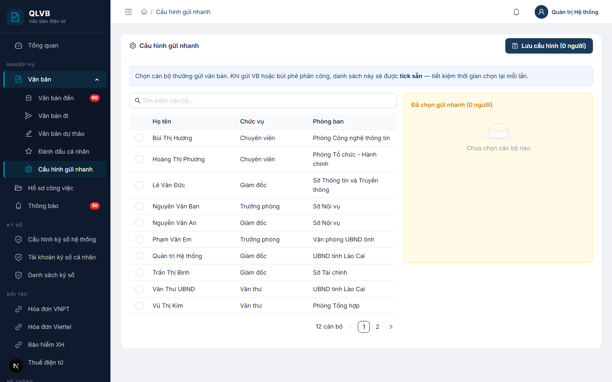
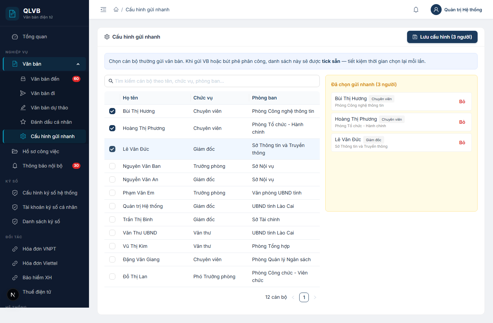

# Hướng dẫn sử dụng: Màn hình Cấu hình gửi nhanh

Tài liệu này mô tả đầy đủ các chức năng có trong màn hình **Cấu hình gửi nhanh** (đường dẫn `/cau-hinh-gui-nhanh`) của hệ thống Quản lý văn bản điện tử (e-Office), giúp người dùng hiểu rõ cách sử dụng và quy trình nghiệp vụ.

---

## 1. Giới thiệu

Trong công việc hằng ngày, mỗi cán bộ thường xuyên gửi văn bản hoặc phân công xử lý cho **một nhóm cố định người nhận** — ví dụ lãnh đạo trực tiếp, các chuyên viên cùng phòng, hoặc các đầu mối phối hợp. Nếu mỗi lần gửi đều phải mở danh bạ và tick lại từng người thì rất mất thời gian, dễ sót.

Màn hình **Cấu hình gửi nhanh** cho phép mỗi người **chọn sẵn** một danh sách cán bộ thường xuyên gửi tới. Sau khi đã lưu, mỗi khi mở màn hình **gửi văn bản** hoặc **bút phê phân công xử lý**, các cán bộ trong danh sách này sẽ được **tự động tick sẵn** để người dùng chỉ cần điều chỉnh thêm bớt thay vì chọn lại từ đầu.

Đây là **cấu hình cá nhân** — chỉ chính người dùng đăng nhập mới nhìn thấy và sử dụng cấu hình của mình. Việc thêm bớt người nhận mặc định của tài khoản này **không** ảnh hưởng tới tài khoản khác.

---

## 2. Bố cục màn hình

Màn hình được thiết kế dạng một thẻ (card) duy nhất, gồm các khu vực sau:

- **Phần đầu trang (tiêu đề thẻ)**:
  - Bên trái: biểu tượng bánh răng kèm tiêu đề **"Cấu hình gửi nhanh"**.
  - Bên phải: nút **Lưu cấu hình (N người)** màu xanh navy — N là số cán bộ đang được chọn ở thời điểm hiện tại.
- **Khung gợi ý (nền xanh nhạt)**: Hiển thị nội dung *"Chọn cán bộ thường gửi văn bản. Khi gửi VB hoặc bút phê phân công, danh sách này sẽ được tick sẵn — tiết kiệm thời gian chọn lại mỗi lần."*
- **Cột trái — Danh sách toàn bộ cán bộ**:
  - Ô **Tìm kiếm cán bộ theo tên, chức vụ, phòng ban...** ở phía trên — gõ vào để tìm trên toàn bộ danh sách cán bộ của hệ thống (xem mục 7.5).
  - Bảng dữ liệu liệt kê cán bộ, mỗi dòng có ô đánh dấu (checkbox) để chọn / bỏ chọn.
  - Phân trang **20 dòng / trang**, dưới chân bảng hiển thị tổng số cán bộ (ví dụ *"35 cán bộ"*).
- **Cột phải — Đã chọn gửi nhanh**:
  - Khung nền vàng nhạt, tiêu đề **"Đã chọn gửi nhanh (N người)"**.
  - Bên trong là danh sách rút gọn các cán bộ đã được tick từ cột trái, mỗi dòng có nút **Bỏ** màu đỏ để loại nhanh.
  - Khi chưa chọn ai, khung này hiển thị thông báo *"Chưa chọn cán bộ nào"*.

---

## 3. Các cột trong bảng danh sách cán bộ (cột trái)

| Tên cột | Mô tả |
|---|---|
| (cột đầu — ô đánh dấu) | Ô **checkbox** — tick để thêm cán bộ vào danh sách gửi nhanh, bỏ tick để loại ra. Trạng thái tick được đồng bộ ngay với cột phải. |
| **Họ tên** | Họ và tên đầy đủ của cán bộ. |
| **Chức vụ** | Chức vụ của cán bộ (ví dụ: Giám đốc, Phó phòng, Chuyên viên). Nếu chưa có chức vụ, hiển thị dấu gạch ngang `—`. |
| **Phòng ban** | Tên phòng ban / đơn vị mà cán bộ đang công tác. Nếu chưa có, hiển thị dấu gạch ngang `—`. |

---

## 4. Khu vực "Đã chọn gửi nhanh" (cột phải)

Mỗi dòng trong khung này tương ứng với một cán bộ đã được tick ở cột trái, hiển thị:

- **Họ tên** (in đậm) ở dòng trên.
- **Nhãn chức vụ** (nếu có) đặt cạnh họ tên dạng thẻ nhỏ (tag).
- **Tên phòng ban** in nhỏ, màu xám phía dưới.
- **Nút Bỏ** màu đỏ ở góc phải mỗi dòng — bấm để loại cán bộ này ra khỏi danh sách (tương đương bỏ tick ở cột trái).

> **Lưu ý**: Mọi thay đổi ở cột này (bấm **Bỏ**) hay ở cột trái (tick / bỏ tick) đều **chỉ là chỉnh sửa tạm trên màn hình** — chưa được lưu vào hệ thống cho tới khi bấm nút **Lưu cấu hình** ở góc trên bên phải (xem mục 5).

---

## 5. Các nút chức năng

| Nút | Vị trí | Tác dụng |
|---|---|---|
| **Lưu cấu hình (N người)** | Góc trên bên phải thẻ | Lưu danh sách cán bộ đang được chọn vào hệ thống. Sau khi lưu thành công, hệ thống thông báo nội dung *"Đã lưu N người nhận"*. Số `N` trong nhãn nút cập nhật theo thời gian thực mỗi khi tick / bỏ tick. |
| **Ô tìm kiếm cán bộ...** | Đầu cột trái, phía trên bảng | Lọc nhanh các cán bộ trong bảng theo từ khóa nhập. Tìm theo **Họ tên**, **Chức vụ** hoặc **Phòng ban** (không phân biệt chữ hoa, chữ thường). Có nút xóa nhanh để xóa từ khóa và hiển thị lại toàn bộ. |
| **Ô đánh dấu (checkbox)** | Cột đầu mỗi dòng bảng cán bộ | Tick để thêm cán bộ vào danh sách gửi nhanh, bỏ tick để loại ra. |
| **Bỏ** (nút chữ đỏ) | Mỗi dòng trong khung "Đã chọn gửi nhanh" | Loại cán bộ ra khỏi danh sách đã chọn. Tương đương việc bỏ tick ở bảng cột trái. |

---

## 6. Quy trình thao tác

### 6.1. Lần đầu thiết lập danh sách gửi nhanh

1. Vào menu **Văn bản > Cấu hình gửi nhanh**.
2. Chờ hệ thống tải xong danh sách cán bộ (cột trái).
3. (Tùy chọn) Gõ một phần tên / chức vụ / phòng ban vào ô **Tìm kiếm cán bộ...** để thu hẹp danh sách.
4. Tick chọn các cán bộ muốn đưa vào nhóm gửi nhanh — họ sẽ xuất hiện ngay trong khung **Đã chọn gửi nhanh** ở cột phải. Số đếm trên nút **Lưu cấu hình (N người)** cập nhật ngay.
5. Bấm **Lưu cấu hình (N người)** ở góc trên bên phải.
6. Hệ thống hiển thị thông báo **"Đã lưu N người nhận"**. Cấu hình đã được ghi nhận.

### 6.2. Cập nhật (thêm / bớt) cán bộ trong danh sách

1. Mở lại màn hình **Cấu hình gửi nhanh**. Hệ thống tự động tick sẵn các cán bộ đã lưu trước đó ở cột trái và liệt kê họ trong khung "Đã chọn gửi nhanh" bên phải.
2. **Để thêm**: tick thêm cán bộ ở cột trái (có thể dùng ô tìm kiếm).
3. **Để bớt**: bỏ tick ở cột trái **hoặc** bấm nút **Bỏ** màu đỏ trong khung bên phải.
4. Bấm **Lưu cấu hình** để ghi nhận lại.

> **Quan trọng**: Mỗi lần lưu, hệ thống **ghi đè toàn bộ** danh sách cũ bằng danh sách mới đang chọn — không có khái niệm "cộng dồn". Nếu chỉ tick thêm 1 người mới, các người đã có vẫn cần tiếp tục được tick để giữ trong danh sách.

### 6.3. Xóa toàn bộ danh sách gửi nhanh

1. Bỏ tick toàn bộ ở cột trái (hoặc bấm **Bỏ** lần lượt cho từng người ở cột phải) cho tới khi nút trên đầu hiển thị **Lưu cấu hình (0 người)**.
2. Bấm **Lưu cấu hình**.
3. Hệ thống thông báo **"Đã lưu 0 người nhận"** — danh sách gửi nhanh đã được làm trống.

### 6.4. Sử dụng danh sách gửi nhanh khi xử lý văn bản

Sau khi đã lưu cấu hình, mỗi khi người dùng:

- Mở **chi tiết một văn bản đến** và thực hiện thao tác **bút phê phân công xử lý** (giao việc cho cán bộ),

thì hệ thống sẽ **tự động tick sẵn** các cán bộ đã có trong cấu hình gửi nhanh. Người dùng chỉ cần điều chỉnh thêm / bớt cho phù hợp với từng văn bản cụ thể, không phải chọn lại từ đầu.

---

## 7. Lưu ý / Ràng buộc nghiệp vụ

### 7.1. Phạm vi cá nhân — không chia sẻ

Cấu hình gửi nhanh được lưu **gắn với tài khoản đăng nhập hiện tại**. Hai cán bộ khác nhau, dù cùng phòng ban, sẽ có hai cấu hình hoàn toàn riêng biệt. Người dùng không thể xem hay chỉnh sửa cấu hình của người khác.

### 7.2. "Tick sẵn" chứ không "tự động gửi"

Hệ thống chỉ làm thao tác **gợi ý sẵn** — người dùng vẫn phải mở màn hình gửi văn bản / bút phê và bấm xác nhận thì văn bản mới thực sự được gửi đi. Cấu hình này **không** tự động gửi văn bản tới các cán bộ trong danh sách.

### 7.3. Loại cấu hình hiện tại

Toàn bộ phần mềm hiện chỉ sử dụng **đúng một loại cấu hình gửi nhanh duy nhất** — loại `doc` — dùng chung cho hai tình huống: gửi văn bản và phân công / chuyển xử lý văn bản. Cụ thể, ngoài chính màn hình **Cấu hình gửi nhanh** này, chỉ có thêm màn hình **Văn bản đến — chi tiết** đọc lại danh sách `doc` đã lưu để tick sẵn người nhận khi giao việc. Không có loại nào khác được phần mềm gọi đến. Cấu trúc dữ liệu vẫn cho phép mở rộng thêm các loại tương lai (ví dụ: cấu hình gửi nhanh cho lịch họp, cho thông báo nội bộ...), nhưng đến phiên bản hiện tại chưa có giao diện kích hoạt — khi cần, sẽ bổ sung sau.

### 7.4. Lưu là "ghi đè", không phải "thêm vào"

Mỗi lần bấm **Lưu cấu hình**, hệ thống xóa toàn bộ danh sách cũ rồi ghi danh sách mới đang hiển thị trên màn hình. Vì vậy:

- Nếu mở màn hình rồi bỏ tick nhầm và bấm **Lưu cấu hình**, các cán bộ bị bỏ tick sẽ thực sự bị loại khỏi cấu hình.
- Nếu chưa muốn lưu, có thể chuyển sang menu khác — các thay đổi tạm thời sẽ bị bỏ qua, cấu hình cũ vẫn còn nguyên.

### 7.5. Tìm kiếm và phân trang phía máy chủ

Bảng cột trái hiển thị **20 cán bộ mỗi trang**, có thanh phân trang ở cuối bảng. Ô **Tìm kiếm cán bộ** lọc **trực tiếp ở máy chủ** — gõ một phần tên / chức vụ / phòng ban, hệ thống sẽ tìm trên **toàn bộ danh sách cán bộ của hệ thống** (không bị giới hạn theo trang). Hệ thống có cơ chế **chống dội** (debounce) khoảng 0,35 giây — chỉ thực sự tìm khi người dùng dừng gõ, tránh gửi yêu cầu liên tục.

> Cấu hình **đã chọn** (cột phải) được lưu tách riêng — khi đổi từ khóa tìm kiếm hoặc chuyển sang trang khác, danh sách "Đã chọn" **không bị mất** mà giữ nguyên đến khi bấm **Lưu cấu hình** hoặc thoát khỏi trang.

### 7.6. Bảng tổng hợp các thông báo của hệ thống

| Tình huống | Thông báo |
|---|---|
| Lưu cấu hình thành công | Đã lưu N người nhận |
| Lưu thành công (mặc định khi backend không trả thông báo riêng) | Đã lưu cấu hình gửi nhanh |
| Lỗi khi tải dữ liệu (cán bộ hoặc cấu hình hiện tại) | Lỗi tải dữ liệu |
| Lỗi khi lưu cấu hình | Lỗi lưu |
| Danh sách người nhận gửi lên không hợp lệ | Danh sách người nhận không hợp lệ |
| Bảng cán bộ trống sau khi tìm kiếm | Không tìm thấy cán bộ |
| Khung "Đã chọn" trống — chưa tick ai | Chưa chọn cán bộ nào |

---

*Tài liệu được biên soạn dựa trên hệ thống thực tế đang triển khai. Mọi thắc mắc vui lòng liên hệ với đội phát triển để được hỗ trợ.*
