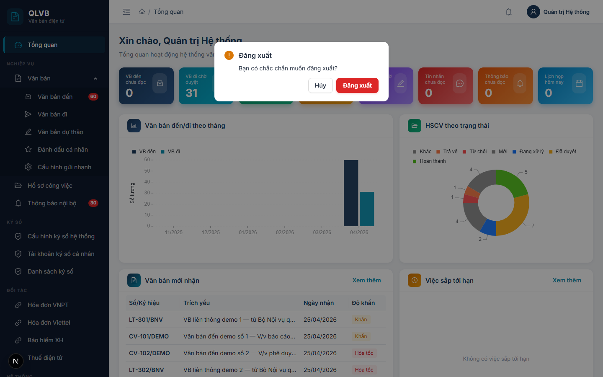

# Đăng nhập và Thông tin cá nhân

## 1. Giới thiệu

Hai màn hình thuộc nhóm xác thực và thông tin cá nhân là điểm bắt đầu của mọi phiên làm việc trên hệ thống Quản lý văn bản điện tử (e-Office). **Mọi cán bộ, công chức** đều sử dụng:

- Màn hình **Đăng nhập** (`/login`) — cửa ngõ duy nhất để truy cập hệ thống. Tài khoản (tên đăng nhập + mật khẩu) do Quản trị viên cấp, gắn với một bản ghi nhân sự thuộc một đơn vị, phòng ban, chức vụ và một hoặc nhiều vai trò.
- Màn hình **Thông tin cá nhân** (`/thong-tin-ca-nhan`) — nơi người dùng tự xem thông tin tài khoản và đổi mật khẩu của mình.

Sau khi đăng nhập thành công, hệ thống tự đưa người dùng đến màn hình **Tổng quan (Dashboard)**. Mỗi lần đăng nhập (cả thành công và thất bại) đều được ghi nhật ký kèm địa chỉ truy cập và trình duyệt sử dụng phục vụ tra cứu khi cần.

## 2. Quy trình thao tác và ràng buộc nghiệp vụ

**Quy trình đăng nhập đầu phiên làm việc:**
1. Mở trình duyệt, truy cập đường dẫn của hệ thống. Nếu chưa đăng nhập, hệ thống tự đưa về `/login`.
2. Nhập tên đăng nhập và mật khẩu được cấp.
3. Tùy chọn bỏ tích **Ghi nhớ đăng nhập** nếu đang dùng máy chung.
4. Bấm **Đăng nhập**. Hệ thống xác thực và chuyển đến trang **Tổng quan**.
5. Khi để trình duyệt không thao tác trong thời gian dài, phiên có thể hết hạn — hệ thống tự đưa về `/login`.

**Quy trình đổi mật khẩu định kỳ:**
1. Bấm vào ảnh đại diện ở góc trên bên phải, chọn **Thông tin cá nhân**.
2. Tab **Đổi mật khẩu** đã được mở sẵn ở cột phải.
3. Nhập mật khẩu hiện tại, mật khẩu mới và xác nhận lại mật khẩu mới.
4. Bấm **Đổi mật khẩu** để hoàn tất.

**Quy trình đăng xuất:**
1. Bấm vào ảnh đại diện ở góc trên bên phải, chọn **Đăng xuất**.
2. Xác nhận trong hộp thoại hiển thị.
3. Hệ thống đóng phiên đăng nhập và đưa về `/login`.

**Ràng buộc nghiệp vụ:**

- **Phạm vi tự sửa của người dùng**: chỉ tự đổi được mật khẩu. Các thông tin khác (họ tên, email, số điện thoại, ảnh đại diện, chức vụ, phòng ban, đơn vị, vai trò) chỉ Quản trị viên sửa được ở màn hình **Quản trị > Người dùng**.
- **Trạng thái tài khoản**: tài khoản bị **khóa** hoặc **xóa** không đăng nhập được. Cần liên hệ Quản trị viên để mở khóa hoặc cấp lại.
- **Quên mật khẩu**: hệ thống **không có** chức năng tự khôi phục mật khẩu. Người dùng cần liên hệ Quản trị viên để được đặt lại mật khẩu về mặc định **Admin@123**, sau đó tự đổi mật khẩu mới ở màn hình Thông tin cá nhân.
- **Quy tắc mật khẩu mới**: tối thiểu 6 ký tự, bắt buộc chứa cả chữ hoa, chữ thường và chữ số. Mật khẩu mới không được trùng với mật khẩu hiện tại.
- **Cấu hình tài khoản ký số** với nhà cung cấp (SmartCA VNPT, MySign Viettel...) đã được tách sang menu **Ký số > Tài khoản ký số cá nhân**, không nằm ở màn hình Thông tin cá nhân.

## 3. Các màn hình chức năng

### 3.1. Màn hình Đăng nhập

#### Bố cục màn hình

Màn hình chia làm hai cột ngang trên cùng một trang:

- **Cột trái — Giới thiệu hệ thống**: logo dạng biểu tượng tài liệu được bảo vệ, tiêu đề **"Quản lý Văn bản"**, dòng mô tả *"Hệ thống quản lý văn bản điện tử — Chuyển đổi số doanh nghiệp"* và ba dòng tính năng nổi bật: Bảo mật, Liên thông, Cộng tác.
- **Cột phải — Khung nhập thông tin đăng nhập**: tiêu đề **"Đăng nhập"**, dòng mô tả ngắn, hai ô nhập (Tên đăng nhập và Mật khẩu), ô tích **Ghi nhớ đăng nhập**, nút **Đăng nhập** lớn màu xanh navy. Dòng *"Phiên bản 2.0 · Chuyển đổi số Doanh nghiệp"* ở chân trang.

Trên thiết bị di động, hai cột tự xếp chồng dọc.

#### Các nút chức năng

| Nút | Vị trí | Khi nào hiển thị | Tác dụng |
|---|---|---|---|
| **Đăng nhập** | Cuối khung bên phải | Luôn | Xác thực tài khoản. Trong khi xử lý, nút chuyển sang trạng thái đang quay (loading) và bị khóa. Có thể dùng phím `Enter` thay thế. |
| **Hiện/ẩn mật khẩu** (con mắt) | Bên trong ô Mật khẩu | Luôn | Bật/tắt hiển thị mật khẩu đang nhập. |

#### Các trường nhập

| Tên trường | Bắt buộc | Mô tả & ràng buộc |
|---|---|---|
| **Tên đăng nhập** | Có | Tên đăng nhập do Quản trị viên cấp. Để trống và bấm Đăng nhập sẽ hiển thị thông báo *"Vui lòng nhập tên đăng nhập"*. |
| **Mật khẩu** | Có | Mật khẩu của tài khoản. Nhập dạng ẩn (chấm tròn). Để trống và bấm Đăng nhập sẽ hiển thị thông báo *"Vui lòng nhập mật khẩu"*. |
| **Ghi nhớ đăng nhập** | Không | Tích chọn để duy trì phiên đăng nhập lâu hơn cho lần truy cập kế tiếp. Mặc định đã tích. Bỏ tích nếu đang dùng máy dùng chung. |

#### Thông báo của hệ thống

| Tình huống | Thông báo |
|---|---|
| Để trống ô Tên đăng nhập | Vui lòng nhập tên đăng nhập |
| Để trống ô Mật khẩu | Vui lòng nhập mật khẩu |
| Bấm Đăng nhập khi cả hai ô để trống (lỗi máy chủ) | Vui lòng nhập tên đăng nhập và mật khẩu |
| Tên đăng nhập không tồn tại | Tên đăng nhập hoặc mật khẩu không đúng |
| Mật khẩu sai | Tên đăng nhập hoặc mật khẩu không đúng |
| Tài khoản đã bị Quản trị viên xóa | Tài khoản đã bị xóa |
| Tài khoản đang bị khóa | Tài khoản đã bị khóa |
| Đăng nhập thành công | Đăng nhập thành công |
| Lỗi không xác định khác | Đăng nhập thất bại |

### 3.2. Màn hình Thông tin cá nhân

#### Bố cục màn hình

- **Phần đầu trang**: tiêu đề **"Thông tin cá nhân"** và dòng mô tả *"Xem thông tin tài khoản, đổi mật khẩu và quản lý ảnh chữ ký"*.
- **Cột trái — Thẻ thông tin tài khoản (chỉ xem)**:
  - Banner đầu thẻ: ảnh đại diện 72px, họ và tên (chữ to, đậm), tên đăng nhập kèm ký hiệu `@`, nhãn chức vụ (xanh teal) và nhãn **Quản trị viên** (vàng) nếu có.
  - Bảng 7 dòng thông tin: Họ và tên, Tên đăng nhập, Email, Số điện thoại, Chức vụ, Phòng ban, Đơn vị. Trường chưa có dữ liệu hiển thị chữ xám *"Chưa cập nhật"*.
- **Cột phải — Khung tác vụ**: thẻ chứa duy nhất tab **Đổi mật khẩu** (biểu tượng ổ khóa), mở sẵn.

Trên thiết bị di động, hai cột tự xếp chồng dọc — thẻ thông tin nằm trên, khung Đổi mật khẩu nằm dưới.

#### Các nút chức năng

| Nút | Vị trí | Khi nào hiển thị | Tác dụng |
|---|---|---|---|
| **Đổi mật khẩu** | Cuối form ở cột phải | Luôn | Gửi yêu cầu đổi mật khẩu sau khi đã điền đủ ba ô nhập. Trong khi xử lý, nút chuyển sang trạng thái loading. |

#### Các trường hiển thị (cột trái — chỉ xem)

| Tên trường | Mô tả |
|---|---|
| Ảnh đại diện | Ảnh đại diện của tài khoản. Nếu chưa có sẽ hiển thị biểu tượng người mặc định. |
| Họ và tên | Họ tên đầy đủ. Hiển thị cả ở banner và trong bảng. |
| Tên đăng nhập | Username dùng để đăng nhập. |
| Email | Địa chỉ email. Trống → *"Chưa cập nhật"*. |
| Số điện thoại | Số điện thoại liên hệ. Trống → *"Chưa cập nhật"*. |
| Chức vụ | Chức vụ trong cơ quan. Trống → *"Chưa cập nhật"*. |
| Phòng ban | Phòng ban đang công tác. Trống → *"Chưa cập nhật"*. |
| Đơn vị | Đơn vị cấp lớn (Sở, Ban, Ngành, Tổng công ty) chứa phòng ban. Trống → *"Chưa cập nhật"*. |
| Nhãn Chức vụ (banner) | Nhãn xanh teal. Hiển thị nếu tài khoản có chức vụ. |
| Nhãn Quản trị viên (banner) | Nhãn vàng. Hiển thị nếu tài khoản có quyền quản trị hệ thống. |

#### Các trường nhập (cột phải — Tab Đổi mật khẩu)

| Tên trường | Bắt buộc | Mô tả & ràng buộc |
|---|---|---|
| **Mật khẩu hiện tại** | Có | Mật khẩu đang dùng để đăng nhập. Nhập dạng ẩn. Sai → *"Mật khẩu hiện tại không đúng"*. |
| **Mật khẩu mới** | Có | Mật khẩu mới muốn đặt. Tối thiểu 6 ký tự, bắt buộc chứa chữ hoa, chữ thường và chữ số. Không được trùng với mật khẩu hiện tại. |
| **Xác nhận mật khẩu mới** | Có | Nhập lại đúng mật khẩu mới. Khác với ô Mật khẩu mới → *"Mật khẩu xác nhận không khớp"* hiển thị ngay dưới ô. |

#### Thông báo của hệ thống

| Tình huống | Thông báo |
|---|---|
| Để trống ô Mật khẩu hiện tại | Nhập mật khẩu hiện tại |
| Để trống ô Mật khẩu mới | Nhập mật khẩu mới |
| Mật khẩu mới ngắn hơn 6 ký tự | Tối thiểu 6 ký tự |
| Mật khẩu mới không có đủ chữ hoa / chữ thường / số | Phải chứa chữ hoa, chữ thường và số |
| Để trống ô Xác nhận mật khẩu mới | Xác nhận mật khẩu mới |
| Xác nhận mật khẩu khác mật khẩu mới | Mật khẩu xác nhận không khớp |
| Mật khẩu mới trùng mật khẩu hiện tại | Mật khẩu mới không được trùng với mật khẩu hiện tại |
| Mật khẩu hiện tại nhập sai | Mật khẩu hiện tại không đúng |
| Mật khẩu mới không thỏa quy tắc (chiều dài / chữ hoa / chữ thường / số) khi máy chủ kiểm tra | Mật khẩu mới phải có ít nhất 6 ký tự, chứa chữ hoa, chữ thường và số |
| Đổi mật khẩu thành công | Đổi mật khẩu thành công |
| Lỗi máy chủ không xác định | Lỗi đổi mật khẩu |

### 3.3. Hộp xác nhận Đăng xuất

#### Bố cục màn hình

Hộp thoại nhỏ ở giữa màn hình, hiển thị câu hỏi *"Bạn có chắc chắn muốn đăng xuất?"* và hai nút thao tác. Hộp thoại được mở khi người dùng bấm vào ảnh đại diện ở góc trên bên phải và chọn **Đăng xuất** trong menu thả xuống.

#### Các nút chức năng

| Nút | Vị trí | Khi nào hiển thị | Tác dụng |
|---|---|---|---|
| **Đăng xuất** (màu đỏ) | Bên phải hộp thoại | Luôn | Đóng phiên đăng nhập, xóa thông tin tài khoản khỏi trình duyệt và đưa về `/login`. |
| **Hủy** | Bên trái hộp thoại | Luôn | Đóng hộp thoại, giữ nguyên phiên đang đăng nhập. |

#### Thông báo của hệ thống

| Tình huống | Thông báo |
|---|---|
| Đăng xuất thành công | Đăng xuất thành công |
