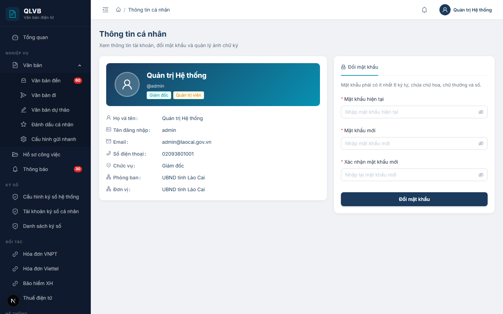

# Hướng dẫn sử dụng: Đăng nhập và Thông tin cá nhân

Tài liệu này mô tả đầy đủ hai màn hình thuộc nhóm xác thực và thông tin cá nhân của hệ thống Quản lý văn bản điện tử (e-Office): màn hình **Đăng nhập** (đường dẫn `/login`) và màn hình **Thông tin cá nhân** (đường dẫn `/thong-tin-ca-nhan`). Hai màn hình này gắn liền với mỗi cán bộ, công chức trong quá trình sử dụng hệ thống — đăng nhập là bước đầu mỗi phiên làm việc, còn Thông tin cá nhân là nơi cập nhật mật khẩu và ảnh chữ ký để phục vụ ký số văn bản.

---

# PHẦN 1 — MÀN HÌNH ĐĂNG NHẬP

## 1. Giới thiệu

Màn hình **Đăng nhập** là cửa ngõ duy nhất để truy cập vào hệ thống e-Office. Mỗi cán bộ được cấp một tài khoản riêng (tên đăng nhập + mật khẩu) tương ứng với một bản ghi nhân sự trong hệ thống — gắn với đơn vị, phòng ban, chức vụ và các vai trò (quyền) đã được Quản trị viên cấu hình sẵn.

Hệ thống chỉ cho phép thực hiện bất kỳ nghiệp vụ nào (tra cứu văn bản, đánh dấu, soạn thảo, ký số, duyệt...) sau khi người dùng đã đăng nhập thành công. Sau khi đăng nhập, hệ thống tự động chuyển vào trang **Bảng điều khiển (Dashboard)** — nơi tổng hợp công việc cần xử lý của người dùng.

Mỗi lần đăng nhập, hệ thống ghi nhận lại nhật ký (thời gian, địa chỉ truy cập, trình duyệt) phục vụ tra cứu khi cần.

---

## 2. Bố cục màn hình

Màn hình được chia thành 2 phần ngang trên một trang:

- **Phần bên trái — Giới thiệu hệ thống**:
  - Logo hệ thống (biểu tượng tài liệu được bảo vệ).
  - Tiêu đề **"Quản lý Văn bản"** và dòng mô tả *"Hệ thống quản lý văn bản điện tử — Chuyển đổi số doanh nghiệp"*.
  - Ba dòng giới thiệu tính năng nổi bật:
    - **Bảo mật** — Ký số điện tử, mã hóa dữ liệu.
    - **Liên thông** — Tích hợp LGSP quốc gia.
    - **Cộng tác** — Quản lý hồ sơ công việc realtime.
- **Phần bên phải — Khung nhập thông tin đăng nhập**:
  - Tiêu đề **"Đăng nhập"** và dòng mô tả *"Nhập thông tin tài khoản để truy cập hệ thống"*.
  - Ô nhập **Tên đăng nhập** (kèm biểu tượng người dùng).
  - Ô nhập **Mật khẩu** (kèm biểu tượng ổ khóa, có nút bật/tắt hiển thị mật khẩu).
  - Ô **Ghi nhớ đăng nhập** (mặc định đã tích chọn).
  - Nút **Đăng nhập** (nút lớn, màu xanh navy).
  - Dòng phiên bản ở chân trang: *"Phiên bản 2.0 · Chuyển đổi số Doanh nghiệp"*.

> **Lưu ý**: Màn hình **không có** chức năng *Quên mật khẩu* trên giao diện. Khi người dùng quên mật khẩu, cần liên hệ Quản trị viên để cấp lại.

---

## 3. Các trường nhập trên form đăng nhập

| Tên trường | Bắt buộc | Mô tả & ràng buộc |
|---|---|---|
| **Tên đăng nhập** | Có | Tên đăng nhập (username) đã được cấp. Phân biệt chữ hoa / chữ thường tùy cấu hình. Nếu để trống và bấm Đăng nhập, hệ thống báo *"Vui lòng nhập tên đăng nhập"*. |
| **Mật khẩu** | Có | Mật khẩu của tài khoản. Nhập dạng ẩn (chấm tròn). Có thể bấm biểu tượng con mắt ở cuối ô để hiển thị tạm. Nếu để trống và bấm Đăng nhập, hệ thống báo *"Vui lòng nhập mật khẩu"*. |
| **Ghi nhớ đăng nhập** | Không | Khi tích chọn (mặc định), hệ thống duy trì phiên đăng nhập lâu hơn để lần sau quay lại không phải đăng nhập ngay. Bỏ tích nếu đăng nhập trên máy dùng chung. |

---

## 4. Quy trình đăng nhập

1. Mở trình duyệt, truy cập đường dẫn của hệ thống — hệ thống tự đưa về trang `/login`.
2. Nhập **Tên đăng nhập** vào ô đầu tiên.
3. Nhập **Mật khẩu** vào ô thứ hai.
4. (Tùy chọn) Bỏ tích **Ghi nhớ đăng nhập** nếu đang dùng máy chung.
5. Bấm nút **Đăng nhập** (hoặc nhấn phím `Enter`).
6. Trong khi hệ thống xử lý, nút **Đăng nhập** chuyển sang trạng thái đang quay (loading) và bị khóa, không bấm được lần thứ hai.
7. Nếu thành công: hệ thống hiển thị thông báo **"Đăng nhập thành công"** và tự chuyển sang trang **Bảng điều khiển** (`/dashboard`).
8. Nếu thất bại: hệ thống hiển thị thông báo lỗi tương ứng (xem mục 5), người dùng vẫn ở lại màn hình đăng nhập để nhập lại.

> **Lưu ý**: Sau khi đăng nhập, nếu để trình duyệt không thao tác trong thời gian dài, hệ thống có thể yêu cầu đăng nhập lại do phiên đã hết hạn. Khi đó hệ thống tự đưa về màn hình `/login`.

---

## 5. Các thông báo của hệ thống khi đăng nhập

| Tình huống | Thông báo |
|---|---|
| Để trống ô Tên đăng nhập | Vui lòng nhập tên đăng nhập |
| Để trống ô Mật khẩu | Vui lòng nhập mật khẩu |
| Bấm Đăng nhập khi cả hai ô để trống (lỗi từ máy chủ) | Vui lòng nhập tên đăng nhập và mật khẩu |
| Tên đăng nhập không tồn tại | Tên đăng nhập hoặc mật khẩu không đúng |
| Mật khẩu sai | Tên đăng nhập hoặc mật khẩu không đúng |
| Tài khoản đã bị Quản trị viên xóa | Tài khoản đã bị xóa |
| Tài khoản đang ở trạng thái bị khóa | Tài khoản đã bị khóa |
| Đăng nhập thành công | Đăng nhập thành công |
| Lỗi không xác định khác từ máy chủ | Đăng nhập thất bại |

> **Lưu ý về bảo mật**: Khi sai mật khẩu, hệ thống hiển thị thông báo chung *"Tên đăng nhập hoặc mật khẩu không đúng"* (không nói rõ sai cái nào) để tránh bị dò mật khẩu. Mỗi lần đăng nhập (kể cả thất bại) đều được ghi nhật ký kèm địa chỉ truy cập và trình duyệt sử dụng.

---

# PHẦN 2 — MÀN HÌNH THÔNG TIN CÁ NHÂN

## 6. Giới thiệu

Màn hình **Thông tin cá nhân** (đường dẫn `/thong-tin-ca-nhan`) là nơi mỗi cán bộ tự quản lý tài khoản của mình. Tại đây người dùng có thể:

- Xem lại các thông tin chính của tài khoản: họ tên, tên đăng nhập, email, số điện thoại, chức vụ, phòng ban, đơn vị, vai trò (quản trị viên hay không).
- **Đổi mật khẩu** đăng nhập của chính mình.
- **Tải lên ảnh chữ ký** (ảnh PNG) — ảnh này sẽ được hệ thống chèn lên văn bản PDF khi người dùng ký số.

Các thông tin về **họ tên, đơn vị, phòng ban, chức vụ, vai trò** chỉ có thể được sửa bởi **Quản trị viên** ở màn hình **Quản trị > Người dùng**, không sửa được trên màn hình này.

Việc cấu hình **tài khoản ký số** với nhà cung cấp (SmartCA VNPT, MySign Viettel...) đã được tách sang một mục riêng — menu **Ký số → Tài khoản ký số cá nhân**. Trên màn hình này chỉ còn quản lý **ảnh chữ ký** dùng để in lên PDF.

---

## 7. Bố cục màn hình

Màn hình được chia thành 2 cột chính:

- **Phần đầu trang**: Tiêu đề **"Thông tin cá nhân"** kèm dòng mô tả *"Xem thông tin tài khoản, đổi mật khẩu và quản lý ảnh chữ ký"*.
- **Cột trái — Thông tin tài khoản (chỉ xem)**:
  - Phần đầu thẻ (banner): ảnh đại diện kích thước lớn, họ và tên (chữ to, đậm), tên đăng nhập (kèm ký hiệu `@`), nhãn chức vụ (xanh teal), nhãn **Quản trị viên** (vàng) nếu có.
  - Bảng thông tin gồm 7 dòng: Họ và tên, Tên đăng nhập, Email, Số điện thoại, Chức vụ, Phòng ban, Đơn vị. Các trường chưa có dữ liệu hiển thị chữ xám *"Chưa cập nhật"*.
- **Cột phải — Khung tác vụ**: thẻ chứa tab điều hướng:
  - Tab **Đổi mật khẩu** (biểu tượng ổ khóa) — mặc định mở sẵn.

> **Lưu ý**: Tab *Ảnh chữ ký* trước đây đã được chuyển sang một trang riêng (menu **Ký số → Tài khoản ký số cá nhân**). Trên trang Thông tin cá nhân hiện tại chỉ còn tab **Đổi mật khẩu**.

---

## 8. Các thông tin hiển thị (chỉ xem) ở cột trái

| Thông tin | Mô tả |
|---|---|
| **Ảnh đại diện** | Ảnh đại diện của tài khoản. Nếu chưa có sẽ hiển thị biểu tượng người mặc định. |
| **Họ và tên** | Họ tên đầy đủ — hiển thị cả ở banner đầu thẻ và trong bảng bên dưới. |
| **Tên đăng nhập** | Username dùng để đăng nhập hệ thống. |
| **Email** | Địa chỉ email của tài khoản. Nếu chưa có hiển thị *"Chưa cập nhật"*. |
| **Số điện thoại** | Số điện thoại liên hệ. Nếu chưa có hiển thị *"Chưa cập nhật"*. |
| **Chức vụ** | Chức vụ trong cơ quan (ví dụ: Chuyên viên, Phó Trưởng phòng...). |
| **Phòng ban** | Phòng ban đang công tác. |
| **Đơn vị** | Đơn vị (cấp lớn — Sở, Ban, Ngành, Tổng công ty) chứa phòng ban. |
| **Nhãn chức vụ** | Nhãn xanh teal hiển thị bên dưới tên ở banner. |
| **Nhãn Quản trị viên** | Nhãn vàng hiển thị nếu tài khoản có quyền quản trị hệ thống. |

> **Lưu ý**: Người dùng **không tự sửa được** các thông tin trên (gồm họ tên, email, số điện thoại, ảnh đại diện, chức vụ, phòng ban, đơn vị, vai trò). Mọi thay đổi phải do **Quản trị viên** thực hiện ở màn hình **Quản trị > Người dùng**. Người dùng cần cập nhật email/số điện thoại liên hệ với Quản trị viên để được hỗ trợ.

---

## 9. Các trường nhập trên Tab Đổi mật khẩu

| Tên trường | Bắt buộc | Mô tả & ràng buộc |
|---|---|---|
| **Mật khẩu hiện tại** | Có | Mật khẩu đang sử dụng để đăng nhập. Nhập dạng ẩn. Nếu sai, hệ thống báo *"Mật khẩu hiện tại không đúng"*. |
| **Mật khẩu mới** | Có | Mật khẩu mới muốn đặt. Yêu cầu: **tối thiểu 6 ký tự** và **bắt buộc chứa cả chữ hoa, chữ thường và số**. Không được trùng với mật khẩu hiện tại. |
| **Xác nhận mật khẩu mới** | Có | Nhập lại đúng mật khẩu mới. Nếu khác với ô **Mật khẩu mới**, hệ thống báo *"Mật khẩu xác nhận không khớp"* ngay dưới ô. |

Nút **Đổi mật khẩu** nằm ở cuối form (lớn, màu xanh navy, full chiều rộng cột phải).

---

## 10. Quy trình đổi mật khẩu

1. Đăng nhập vào hệ thống → bấm vào **ảnh đại diện** ở góc trên bên phải → chọn **Thông tin cá nhân** trong menu (hoặc truy cập trực tiếp `/thong-tin-ca-nhan`).
2. Tab **Đổi mật khẩu** mặc định đã được mở sẵn ở cột bên phải.
3. Đọc dòng nhắc *"Mật khẩu phải có ít nhất 6 ký tự, chứa chữ hoa, chữ thường và số."*
4. Nhập **Mật khẩu hiện tại** (mật khẩu đang dùng).
5. Nhập **Mật khẩu mới** đáp ứng quy tắc:
   - Ít nhất 6 ký tự.
   - Có ít nhất 1 chữ hoa (`A-Z`).
   - Có ít nhất 1 chữ thường (`a-z`).
   - Có ít nhất 1 chữ số (`0-9`).
   - Khác với mật khẩu hiện tại.
6. Nhập **Xác nhận mật khẩu mới** giống hệt ô **Mật khẩu mới**.
7. Bấm nút **Đổi mật khẩu**.
8. Nếu hợp lệ: hệ thống thông báo **"Đổi mật khẩu thành công"** và xóa sạch nội dung 3 ô. Lần đăng nhập kế tiếp sẽ phải dùng mật khẩu mới.
9. Nếu không hợp lệ: hệ thống hiển thị thông báo lỗi tương ứng dưới ô tương ứng hoặc dạng thông báo nhanh phía trên màn hình (xem bảng ở mục 14).

> **Khuyến nghị bảo mật**:
> - Đổi mật khẩu định kỳ (3–6 tháng/lần).
> - Không dùng mật khẩu dễ đoán (`123456`, ngày sinh, tên...).
> - Không dùng chung một mật khẩu trên nhiều hệ thống.
> - Sau khi đổi mật khẩu trên máy chính, các thiết bị khác đã ghi nhớ đăng nhập sẽ không bị ảnh hưởng ngay, nhưng phiên cũ sẽ hết hạn dần — nên đăng xuất chủ động trên các thiết bị không sử dụng.

---

## 11. Quy trình cập nhật thông tin cá nhân

Trên màn hình **Thông tin cá nhân**, người dùng **không tự sửa** được các trường dữ liệu (họ tên, email, số điện thoại, ảnh đại diện, chức vụ, phòng ban...).

Nếu cần cập nhật các thông tin này:

1. Liên hệ **Quản trị viên** của đơn vị (hoặc bộ phận phụ trách hệ thống e-Office).
2. Cung cấp các nội dung cần sửa và lý do (ví dụ: thay số điện thoại liên hệ, đổi email công vụ, chuyển phòng ban...).
3. Quản trị viên thực hiện cập nhật trên màn hình **Quản trị > Người dùng**.
4. Sau khi Quản trị viên lưu thay đổi, người dùng tải lại trang `/thong-tin-ca-nhan` hoặc đăng nhập lại để thấy thông tin mới.

---

## 12. Quy trình cập nhật ảnh chữ ký

Ảnh chữ ký là ảnh dạng PNG (nền trong suốt, kích thước khuyến nghị 150×150 điểm ảnh), được hệ thống chèn lên trang văn bản PDF tại vị trí ký khi người dùng thực hiện ký số.

Hiện tại, việc tải lên ảnh chữ ký được thực hiện trên trang riêng:

1. Trên thanh menu, vào **Ký số → Tài khoản ký số cá nhân**.
2. Trong tab quản lý ảnh chữ ký, bấm **Chọn file PNG**.
3. Chọn ảnh chữ ký có dạng `.png`, kích thước tối đa **2 MB**.
4. Sau khi chọn xong, bấm nút **Lưu ảnh chữ ký**.
5. Nếu thành công: hệ thống thông báo **"Đã cập nhật ảnh chữ ký"** và hiển thị ảnh chữ ký hiện tại (khung viền nét đứt).
6. Nếu sai định dạng / quá dung lượng: hệ thống báo lỗi tương ứng (xem mục 14).

> **Lưu ý**: Ảnh chữ ký PNG **không phải** là chữ ký số — nó chỉ là hình ảnh hiển thị trên văn bản. Việc xác thực giá trị pháp lý của chữ ký vẫn dựa vào **tài khoản ký số** (SmartCA, MySign...) cấu hình ở mục **Ký số → Tài khoản ký số cá nhân**.

---

## 13. Quy trình đăng xuất

1. Ở góc trên bên phải màn hình (bất kỳ trang nào sau khi đã đăng nhập), bấm vào **ảnh đại diện** để mở menu thả xuống.
2. Menu hiển thị 2 mục:
   - **Thông tin cá nhân** — chuyển đến trang `/thong-tin-ca-nhan`.
   - **Đăng xuất** (chữ đỏ).
3. Bấm **Đăng xuất**.
4. Hệ thống hiển thị hộp xác nhận với câu hỏi *"Bạn có chắc chắn muốn đăng xuất?"*.
5. Bấm nút **Đăng xuất** (màu đỏ) để xác nhận, hoặc bấm **Hủy** để hủy bỏ.
6. Sau khi xác nhận, hệ thống đóng phiên đăng nhập, xóa thông tin tài khoản khỏi trình duyệt và tự động chuyển về màn hình `/login`.

> **Lưu ý**: Khi sử dụng máy dùng chung (máy ở phòng họp, máy của đồng nghiệp...), **luôn đăng xuất** sau khi dùng xong để tránh người khác mượn được phiên đăng nhập của mình.

---

## 14. Lưu ý / Ràng buộc nghiệp vụ và bảng tổng hợp thông báo

### 14.1. Quy tắc mật khẩu

Mật khẩu mới khi đổi mật khẩu **phải** thỏa cả 4 điều kiện sau:

1. Có **tối thiểu 6 ký tự**.
2. Có **ít nhất 1 chữ hoa** (`A` đến `Z`).
3. Có **ít nhất 1 chữ thường** (`a` đến `z`).
4. Có **ít nhất 1 chữ số** (`0` đến `9`).

Đồng thời mật khẩu mới phải **khác** mật khẩu hiện tại và ô **Xác nhận mật khẩu mới** phải khớp tuyệt đối với ô **Mật khẩu mới**.

### 14.2. Trạng thái tài khoản — khóa, xóa

- Khi tài khoản bị **khóa** (do Quản trị viên đặt) → người dùng không đăng nhập được, hệ thống báo *"Tài khoản đã bị khóa"*. Cần liên hệ Quản trị viên để mở khóa.
- Khi tài khoản bị **xóa** → cũng không đăng nhập được, hệ thống báo *"Tài khoản đã bị xóa"*. Tài khoản đã xóa không thể tự khôi phục từ phía người dùng.

### 14.3. Phiên đăng nhập tự hết hạn

Vì lý do bảo mật, mỗi phiên đăng nhập có thời hạn nhất định. Khi phiên hết hạn, hệ thống tự đăng xuất và đưa về màn hình `/login`. Nếu đã tích **Ghi nhớ đăng nhập**, hệ thống có thể tự gia hạn phiên trong giới hạn cho phép — ngược lại sẽ yêu cầu đăng nhập lại sớm hơn.

### 14.4. Quên mật khẩu

Hệ thống hiện chưa cung cấp chức năng **Quên mật khẩu** trên giao diện đăng nhập. Khi quên mật khẩu, người dùng cần:

1. Liên hệ **Quản trị viên** đơn vị.
2. Quản trị viên cấp lại mật khẩu mới ở màn hình **Quản trị > Người dùng** (chức năng *Đặt lại mật khẩu*).
3. Người dùng đăng nhập bằng mật khẩu được cấp, sau đó vào **Thông tin cá nhân → Đổi mật khẩu** để đặt mật khẩu của riêng mình.

### 14.5. Phạm vi thay đổi thông tin

| Thông tin | Người dùng tự sửa | Quản trị viên sửa |
|---|---|---|
| Mật khẩu | Có (Thông tin cá nhân → Đổi mật khẩu) | Có (cấp lại / đặt lại) |
| Ảnh chữ ký PNG | Có (Ký số → Tài khoản ký số cá nhân) | — |
| Tài khoản ký số (SmartCA, MySign...) | Có (Ký số → Tài khoản ký số cá nhân) | — |
| Họ và tên | Không | Có |
| Email | Không | Có |
| Số điện thoại | Không | Có |
| Ảnh đại diện | Không | Có |
| Chức vụ | Không | Có |
| Phòng ban / Đơn vị | Không | Có |
| Vai trò (Quản trị viên / nhóm quyền) | Không | Có |
| Khóa / Mở khóa tài khoản | Không | Có |

### 14.6. Bảng tổng hợp các thông báo của hệ thống

| Tình huống | Thông báo |
|---|---|
| **Đăng nhập** | |
| Để trống ô Tên đăng nhập | Vui lòng nhập tên đăng nhập |
| Để trống ô Mật khẩu | Vui lòng nhập mật khẩu |
| Cả hai ô để trống (báo từ máy chủ) | Vui lòng nhập tên đăng nhập và mật khẩu |
| Tên đăng nhập hoặc mật khẩu sai | Tên đăng nhập hoặc mật khẩu không đúng |
| Tài khoản đã bị xóa | Tài khoản đã bị xóa |
| Tài khoản bị khóa | Tài khoản đã bị khóa |
| Đăng nhập thành công | Đăng nhập thành công |
| Lỗi không xác định khi đăng nhập | Đăng nhập thất bại |
| **Đổi mật khẩu** | |
| Để trống Mật khẩu hiện tại | Nhập mật khẩu hiện tại |
| Để trống Mật khẩu mới | Nhập mật khẩu mới |
| Mật khẩu mới ngắn hơn 6 ký tự | Tối thiểu 6 ký tự |
| Mật khẩu mới thiếu chữ hoa / chữ thường / số | Phải chứa chữ hoa, chữ thường và số |
| Để trống ô Xác nhận | Xác nhận mật khẩu mới |
| Xác nhận không khớp với mật khẩu mới | Mật khẩu xác nhận không khớp |
| Sai mật khẩu hiện tại | Mật khẩu hiện tại không đúng |
| Mật khẩu mới trùng mật khẩu hiện tại | Mật khẩu mới không được trùng với mật khẩu hiện tại |
| Mật khẩu mới không đáp ứng quy tắc (báo từ máy chủ) | Mật khẩu mới phải có ít nhất 6 ký tự, chứa chữ hoa, chữ thường và số |
| Thiếu một trong hai mật khẩu (báo từ máy chủ) | Mật khẩu cũ và mật khẩu mới là bắt buộc |
| Đổi mật khẩu thành công | Đổi mật khẩu thành công |
| Lỗi máy chủ khi đổi mật khẩu | Lỗi đổi mật khẩu |
| **Đăng xuất** | |
| Hộp xác nhận đăng xuất | Bạn có chắc chắn muốn đăng xuất? |
| Đăng xuất thành công | Đăng xuất thành công |
| **Ảnh chữ ký** | |
| Chưa chọn file mà bấm Lưu | Vui lòng chọn ảnh chữ ký mới |
| Chọn file không phải PNG | Chỉ chấp nhận file PNG |
| File vượt quá 2MB | Kích thước ảnh tối đa 2MB |
| Lưu thành công | Đã cập nhật ảnh chữ ký |
| Lỗi không xác định khi lưu | Lưu thất bại / Có lỗi xảy ra, vui lòng thử lại |

---

*Tài liệu được biên soạn dựa trên hệ thống thực tế đang triển khai. Mọi thắc mắc vui lòng liên hệ với đội phát triển để được hỗ trợ.*
