# Hướng dẫn sử dụng — Hệ thống Quản lý văn bản điện tử (e-Office)

Bộ tài liệu này mô tả đầy đủ các chức năng của hệ thống Quản lý văn bản điện tử (e-Office) phiên bản hiện hành, dành cho người dùng cuối là cán bộ, công chức và lãnh đạo trong các cơ quan, đơn vị.

---

## 1. Giới thiệu chung

**e-Office** là hệ thống quản lý văn bản điện tử dùng cho cơ quan nhà nước cấp tỉnh (ví dụ: tỉnh Lào Cai) và doanh nghiệp nhà nước. Hệ thống cho phép toàn bộ nhân sự quản lý văn bản đến / đi / dự thảo, hồ sơ công việc, ký số điện tử, liên thông LGSP, tích hợp với các nhà cung cấp hóa đơn điện tử và các dịch vụ công khác.

**Các giá trị cốt lõi:**
- Số hóa toàn bộ luồng văn bản hành chính theo Nghị định 30/2020/NĐ-CP
- Ký số điện tử trực tiếp trong hệ thống (kết nối VNPT SmartCA, Viettel MySign)
- Phân quyền nhiều cấp theo đơn vị, chức vụ và vai trò
- Truy cập mọi nơi qua trình duyệt — không cần cài đặt phần mềm

---

## 2. Đăng nhập hệ thống

Mở trình duyệt, truy cập địa chỉ hệ thống do quản trị cấp. Đăng nhập bằng **Tên đăng nhập** và **Mật khẩu** được cấp.

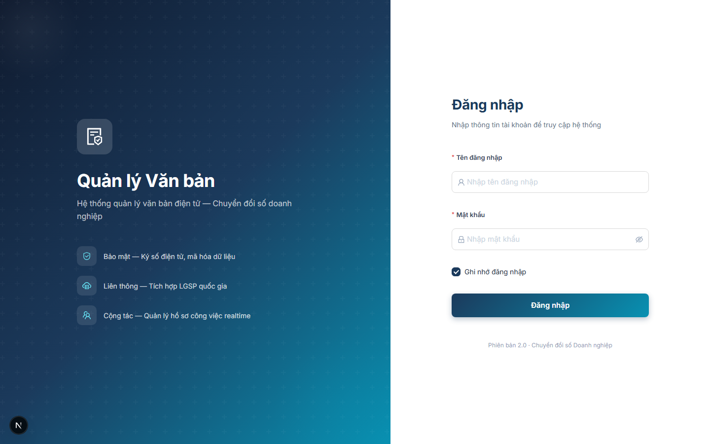

Sau khi đăng nhập thành công, hệ thống tự động chuyển đến **Trang Tổng quan**.

Chi tiết: xem mục [Đăng nhập và Thông tin cá nhân](HDSD_dang_nhap_va_thong_tin_ca_nhan.md).

---

## 3. Bố cục giao diện chung

Sau khi đăng nhập, giao diện hệ thống gồm 3 phần chính:

- **Thanh điều hướng bên trái (sidebar)**: chứa toàn bộ menu các chức năng. Có thể thu gọn / mở rộng bằng nút ba gạch ở góc trên bên trái.
- **Thanh tiêu đề (header)**: chứa biểu tượng chuông thông báo, ảnh đại diện và menu tài khoản (xem thông tin cá nhân, đăng xuất).
- **Khu vực nội dung chính**: hiển thị nội dung của chức năng đang chọn.

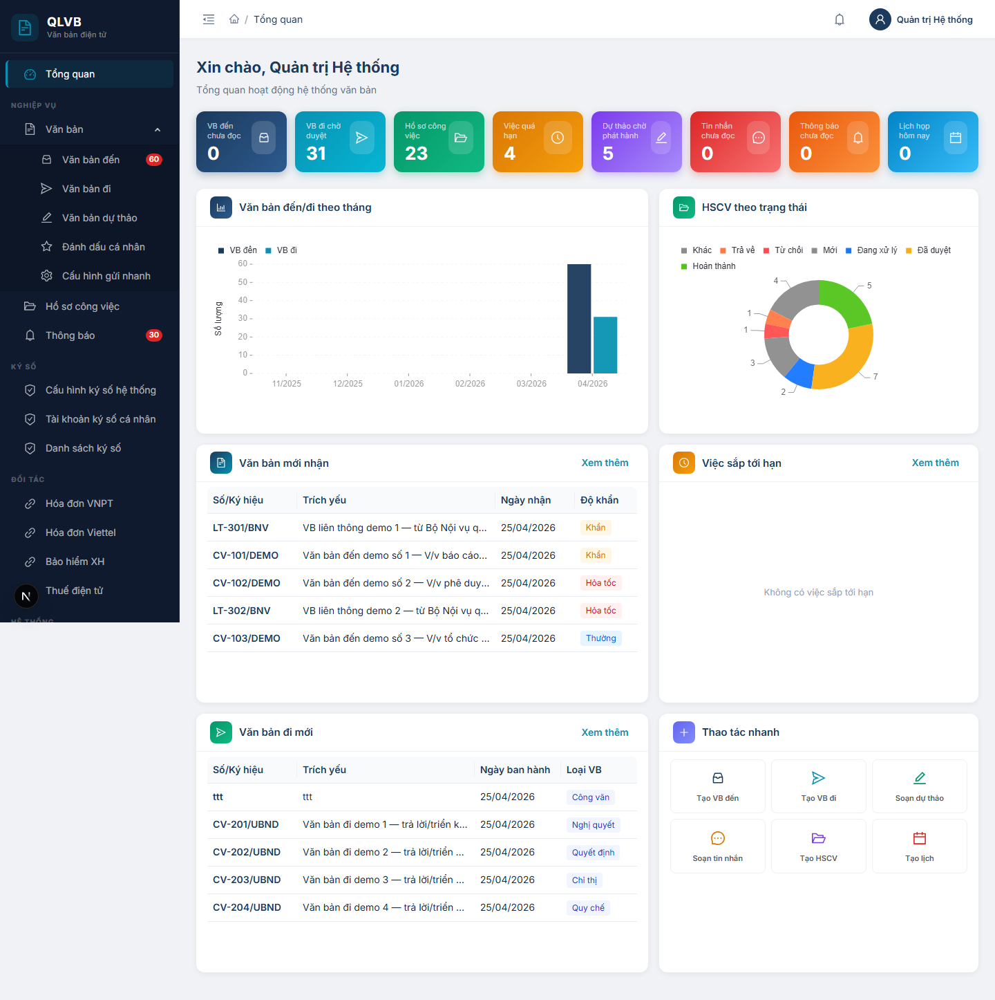

---

## 4. Vai trò người dùng

Hệ thống phân biệt 4 vai trò chính, mỗi vai trò có phạm vi chức năng khác nhau:

| Vai trò | Mô tả ngắn |
|---|---|
| **Quản trị hệ thống** | Cấu hình toàn bộ hệ thống — đơn vị, người dùng, danh mục, ký số, liên thông |
| **Văn thư** | Tiếp nhận văn bản đến, vào sổ, phát hành văn bản đi |
| **Lãnh đạo** (Ban Lãnh đạo / Chỉ đạo điều hành) | Phê duyệt, ký số, phân công xử lý văn bản và hồ sơ công việc |
| **Cán bộ thường** | Soạn dự thảo, xử lý văn bản được giao, theo dõi hồ sơ công việc |

Một người dùng có thể được gán **nhiều vai trò** cùng lúc; quyền hạn sẽ là tập hợp của tất cả các vai trò.

---

## 5. Mục lục các chức năng

### 5.1. Tổng quan và cá nhân

| # | Chức năng | Tài liệu |
|---|---|---|
| 1 | Đăng nhập + Thông tin cá nhân | [HDSD_dang_nhap_va_thong_tin_ca_nhan.md](HDSD_dang_nhap_va_thong_tin_ca_nhan.md) |
| 2 | Trang Tổng quan (Dashboard) | [HDSD_dashboard.md](HDSD_dashboard.md) |
| 3 | Thông báo (chuông + danh sách) | [HDSD_thong_bao.md](HDSD_thong_bao.md) |

### 5.2. Văn bản

| # | Chức năng | Tài liệu |
|---|---|---|
| 4 | Văn bản đến (danh sách + chi tiết) | [HDSD_van_ban_den.md](HDSD_van_ban_den.md) |
| 5 | Văn bản đi (danh sách + chi tiết) | [HDSD_van_ban_di.md](HDSD_van_ban_di.md) |
| 6 | Văn bản dự thảo (danh sách + chi tiết) | [HDSD_van_ban_du_thao.md](HDSD_van_ban_du_thao.md) |
| 7 | Đánh dấu cá nhân | [HDSD_van_ban_danh_dau.md](HDSD_van_ban_danh_dau.md) |
| 8 | Cấu hình gửi nhanh | [HDSD_cau_hinh_gui_nhanh.md](HDSD_cau_hinh_gui_nhanh.md) |

### 5.3. Hồ sơ công việc

| # | Chức năng | Tài liệu |
|---|---|---|
| 9 | Hồ sơ công việc — Danh sách | [HDSD_ho_so_cong_viec_danh_sach.md](HDSD_ho_so_cong_viec_danh_sach.md) |
| 10 | Hồ sơ công việc — Chi tiết | [HDSD_ho_so_cong_viec_chi_tiet.md](HDSD_ho_so_cong_viec_chi_tiet.md) |
| 11 | Hồ sơ công việc — Báo cáo | [HDSD_ho_so_cong_viec_bao_cao.md](HDSD_ho_so_cong_viec_bao_cao.md) |

### 5.4. Ký số

| # | Chức năng | Tài liệu |
|---|---|---|
| 12 | Cấu hình ký số hệ thống *(quản trị)* | [HDSD_ky_so_cau_hinh.md](HDSD_ky_so_cau_hinh.md) |
| 13 | Tài khoản ký số cá nhân | [HDSD_ky_so_tai_khoan.md](HDSD_ky_so_tai_khoan.md) |
| 14 | Danh sách ký số | [HDSD_ky_so_danh_sach.md](HDSD_ky_so_danh_sach.md) |

### 5.5. Quản trị hệ thống *(chỉ Quản trị hệ thống)*

| # | Chức năng | Tài liệu |
|---|---|---|
| 15 | Đơn vị — cơ cấu tổ chức | [HDSD_quan_tri_don_vi.md](HDSD_quan_tri_don_vi.md) |
| 16 | Chức vụ | [HDSD_quan_tri_chuc_vu.md](HDSD_quan_tri_chuc_vu.md) |
| 17 | Người dùng | [HDSD_quan_tri_nguoi_dung.md](HDSD_quan_tri_nguoi_dung.md) |
| 18 | Nhóm quyền | [HDSD_quan_tri_nhom_quyen.md](HDSD_quan_tri_nhom_quyen.md) |

### 5.6. Danh mục *(chỉ Quản trị hệ thống)*

| # | Chức năng | Tài liệu |
|---|---|---|
| 19 | Sổ văn bản | [HDSD_quan_tri_so_van_ban.md](HDSD_quan_tri_so_van_ban.md) |
| 20 | Loại văn bản | [HDSD_quan_tri_loai_van_ban.md](HDSD_quan_tri_loai_van_ban.md) |
| 21 | Lĩnh vực | [HDSD_quan_tri_linh_vuc.md](HDSD_quan_tri_linh_vuc.md) |
| 22 | Người ký | [HDSD_quan_tri_nguoi_ky.md](HDSD_quan_tri_nguoi_ky.md) |

---

## 6. Quy ước trong tài liệu

- **Chữ in đậm** trong dấu nháy hoặc trên ô vuông — tên các nút bấm, tên các ô nhập, tên các trạng thái.
- *Chữ in nghiêng trong dấu nháy* — thông báo do hệ thống hiển thị.
- Bảng "**Tên trường — Bắt buộc — Mô tả & ràng buộc**" — liệt kê tất cả các ô nhập trong cửa sổ Thêm / Sửa.
- Bảng "**Nút — Vị trí — Khi nào hiển thị — Tác dụng**" — liệt kê tất cả các nút có trên màn hình.
- Bảng "**Tình huống — Thông báo**" ở cuối mỗi tài liệu — liệt kê đầy đủ các thông báo hệ thống có thể hiện ra.
- Hình minh họa được đặt ở thư mục `screenshots/` đi kèm.

---

## 7. Liên hệ hỗ trợ

Mọi thắc mắc, góp ý hoặc yêu cầu hỗ trợ vui lòng liên hệ với đội phát triển hệ thống.

*Tài liệu được biên soạn dựa trên hệ thống thực tế đang triển khai (phiên bản 2.0). Mọi mô tả về chức năng, ô nhập, nút bấm và thông báo đều đối chiếu trực tiếp với mã nguồn hiện hành.*


\newpage

# Phần I — Chi tiết các chức năng

## Hướng dẫn sử dụng: Đăng nhập và Thông tin cá nhân

Tài liệu này mô tả đầy đủ hai màn hình thuộc nhóm xác thực và thông tin cá nhân của hệ thống Quản lý văn bản điện tử (e-Office): màn hình **Đăng nhập** (đường dẫn `/login`) và màn hình **Thông tin cá nhân** (đường dẫn `/thong-tin-ca-nhan`). Hai màn hình này gắn liền với mỗi cán bộ, công chức trong quá trình sử dụng hệ thống — đăng nhập là bước đầu mỗi phiên làm việc, còn Thông tin cá nhân là nơi cập nhật mật khẩu và ảnh chữ ký để phục vụ ký số văn bản.

---

## PHẦN 1 — MÀN HÌNH ĐĂNG NHẬP

### 1. Giới thiệu

Màn hình **Đăng nhập** là cửa ngõ duy nhất để truy cập vào hệ thống e-Office. Mỗi cán bộ được cấp một tài khoản riêng (tên đăng nhập + mật khẩu) tương ứng với một bản ghi nhân sự trong hệ thống — gắn với đơn vị, phòng ban, chức vụ và các vai trò (quyền) đã được Quản trị viên cấu hình sẵn.

Hệ thống chỉ cho phép thực hiện bất kỳ nghiệp vụ nào (tra cứu văn bản, đánh dấu, soạn thảo, ký số, duyệt...) sau khi người dùng đã đăng nhập thành công. Sau khi đăng nhập, hệ thống tự động chuyển vào trang **Bảng điều khiển (Dashboard)** — nơi tổng hợp công việc cần xử lý của người dùng.

Mỗi lần đăng nhập, hệ thống ghi nhận lại nhật ký (thời gian, địa chỉ truy cập, trình duyệt) phục vụ tra cứu khi cần.

---

### 2. Bố cục màn hình

*[Hình minh họa: Màn hình Đăng nhập]*

Màn hình được chia thành 2 phần ngang trên một trang:

- **Phần bên trái — Giới thiệu hệ thống**:
  - Logo hệ thống (biểu tượng tài liệu được bảo vệ).
  - Tiêu đề **"Quản lý Văn bản"** và dòng mô tả *"Hệ thống quản lý văn bản điện tử — Chuyển đổi số doanh nghiệp"*.
  - Ba dòng giới thiệu tính năng nổi bật:
    - **Bảo mật** — Ký số điện tử, mã hóa dữ liệu.
    - **Liên thông** — Tích hợp LGSP quốc gia.
    - **Cộng tác** — Quản lý hồ sơ công việc realtime.
- **Phần bên phải — Khung nhập thông tin đăng nhập**:
  - Tiêu đề **"Đăng nhập"** và dòng mô tả *"Nhập thông tin tài khoản để truy cập hệ thống"*.
  - Ô nhập **Tên đăng nhập** (kèm biểu tượng người dùng).
  - Ô nhập **Mật khẩu** (kèm biểu tượng ổ khóa, có nút bật/tắt hiển thị mật khẩu).
  - Ô **Ghi nhớ đăng nhập** (mặc định đã tích chọn).
  - Nút **Đăng nhập** (nút lớn, màu xanh navy).
  - Dòng phiên bản ở chân trang: *"Phiên bản 2.0 · Chuyển đổi số Doanh nghiệp"*.

> **Lưu ý**: Màn hình **không có** chức năng *Quên mật khẩu* trên giao diện. Khi người dùng quên mật khẩu, cần liên hệ Quản trị viên để cấp lại.

---

### 3. Các trường nhập trên form đăng nhập

| Tên trường | Bắt buộc | Mô tả & ràng buộc |
|---|---|---|
| **Tên đăng nhập** | Có | Tên đăng nhập (username) đã được cấp. Phân biệt chữ hoa / chữ thường tùy cấu hình. Nếu để trống và bấm Đăng nhập, hệ thống báo *"Vui lòng nhập tên đăng nhập"*. |
| **Mật khẩu** | Có | Mật khẩu của tài khoản. Nhập dạng ẩn (chấm tròn). Có thể bấm biểu tượng con mắt ở cuối ô để hiển thị tạm. Nếu để trống và bấm Đăng nhập, hệ thống báo *"Vui lòng nhập mật khẩu"*. |
| **Ghi nhớ đăng nhập** | Không | Khi tích chọn (mặc định), hệ thống duy trì phiên đăng nhập lâu hơn để lần sau quay lại không phải đăng nhập ngay. Bỏ tích nếu đăng nhập trên máy dùng chung. |

---

### 4. Quy trình đăng nhập

1. Mở trình duyệt, truy cập đường dẫn của hệ thống — hệ thống tự đưa về trang `/login`.
2. Nhập **Tên đăng nhập** vào ô đầu tiên.
3. Nhập **Mật khẩu** vào ô thứ hai.
4. (Tùy chọn) Bỏ tích **Ghi nhớ đăng nhập** nếu đang dùng máy chung.
5. Bấm nút **Đăng nhập** (hoặc nhấn phím `Enter`).
6. Trong khi hệ thống xử lý, nút **Đăng nhập** chuyển sang trạng thái đang quay (loading) và bị khóa, không bấm được lần thứ hai.
7. Nếu thành công: hệ thống hiển thị thông báo **"Đăng nhập thành công"** và tự chuyển sang trang **Bảng điều khiển** (`/dashboard`).
8. Nếu thất bại: hệ thống hiển thị thông báo lỗi tương ứng (xem mục 5), người dùng vẫn ở lại màn hình đăng nhập để nhập lại.

> **Lưu ý**: Sau khi đăng nhập, nếu để trình duyệt không thao tác trong thời gian dài, hệ thống có thể yêu cầu đăng nhập lại do phiên đã hết hạn. Khi đó hệ thống tự đưa về màn hình `/login`.

---

### 5. Các thông báo của hệ thống khi đăng nhập

| Tình huống | Thông báo |
|---|---|
| Để trống ô Tên đăng nhập | Vui lòng nhập tên đăng nhập |
| Để trống ô Mật khẩu | Vui lòng nhập mật khẩu |
| Bấm Đăng nhập khi cả hai ô để trống (lỗi từ máy chủ) | Vui lòng nhập tên đăng nhập và mật khẩu |
| Tên đăng nhập không tồn tại | Tên đăng nhập hoặc mật khẩu không đúng |
| Mật khẩu sai | Tên đăng nhập hoặc mật khẩu không đúng |
| Tài khoản đã bị Quản trị viên xóa | Tài khoản đã bị xóa |
| Tài khoản đang ở trạng thái bị khóa | Tài khoản đã bị khóa |
| Đăng nhập thành công | Đăng nhập thành công |
| Lỗi không xác định khác từ máy chủ | Đăng nhập thất bại |

> **Lưu ý về bảo mật**: Khi sai mật khẩu, hệ thống hiển thị thông báo chung *"Tên đăng nhập hoặc mật khẩu không đúng"* (không nói rõ sai cái nào) để tránh bị dò mật khẩu. Mỗi lần đăng nhập (kể cả thất bại) đều được ghi nhật ký kèm địa chỉ truy cập và trình duyệt sử dụng.

---

## PHẦN 2 — MÀN HÌNH THÔNG TIN CÁ NHÂN

### 6. Giới thiệu

Màn hình **Thông tin cá nhân** (đường dẫn `/thong-tin-ca-nhan`) là nơi mỗi cán bộ tự quản lý tài khoản của mình. Tại đây người dùng có thể:

- Xem lại các thông tin chính của tài khoản: họ tên, tên đăng nhập, email, số điện thoại, chức vụ, phòng ban, đơn vị, vai trò (quản trị viên hay không).
- **Đổi mật khẩu** đăng nhập của chính mình.
- **Tải lên ảnh chữ ký** (ảnh PNG) — ảnh này sẽ được hệ thống chèn lên văn bản PDF khi người dùng ký số.

Các thông tin về **họ tên, đơn vị, phòng ban, chức vụ, vai trò** chỉ có thể được sửa bởi **Quản trị viên** ở màn hình **Quản trị > Người dùng**, không sửa được trên màn hình này.

Việc cấu hình **tài khoản ký số** với nhà cung cấp (SmartCA VNPT, MySign Viettel...) đã được tách sang một mục riêng — menu **Ký số → Tài khoản ký số cá nhân**. Trên màn hình này chỉ còn quản lý **ảnh chữ ký** dùng để in lên PDF.

---

### 7. Bố cục màn hình


Màn hình được chia thành 2 cột chính:

- **Phần đầu trang**: Tiêu đề **"Thông tin cá nhân"** kèm dòng mô tả *"Xem thông tin tài khoản, đổi mật khẩu và quản lý ảnh chữ ký"*.
- **Cột trái — Thông tin tài khoản (chỉ xem)**:
  - Phần đầu thẻ (banner): ảnh đại diện kích thước lớn, họ và tên (chữ to, đậm), tên đăng nhập (kèm ký hiệu `@`), nhãn chức vụ (xanh teal), nhãn **Quản trị viên** (vàng) nếu có.
  - Bảng thông tin gồm 7 dòng: Họ và tên, Tên đăng nhập, Email, Số điện thoại, Chức vụ, Phòng ban, Đơn vị. Các trường chưa có dữ liệu hiển thị chữ xám *"Chưa cập nhật"*.
- **Cột phải — Khung tác vụ**: thẻ chứa tab điều hướng:
  - Tab **Đổi mật khẩu** (biểu tượng ổ khóa) — mặc định mở sẵn.

> **Lưu ý**: Tab *Ảnh chữ ký* trước đây đã được chuyển sang một trang riêng (menu **Ký số → Tài khoản ký số cá nhân**). Trên trang Thông tin cá nhân hiện tại chỉ còn tab **Đổi mật khẩu**.

---

### 8. Các thông tin hiển thị (chỉ xem) ở cột trái

| Thông tin | Mô tả |
|---|---|
| **Ảnh đại diện** | Ảnh đại diện của tài khoản. Nếu chưa có sẽ hiển thị biểu tượng người mặc định. |
| **Họ và tên** | Họ tên đầy đủ — hiển thị cả ở banner đầu thẻ và trong bảng bên dưới. |
| **Tên đăng nhập** | Username dùng để đăng nhập hệ thống. |
| **Email** | Địa chỉ email của tài khoản. Nếu chưa có hiển thị *"Chưa cập nhật"*. |
| **Số điện thoại** | Số điện thoại liên hệ. Nếu chưa có hiển thị *"Chưa cập nhật"*. |
| **Chức vụ** | Chức vụ trong cơ quan (ví dụ: Chuyên viên, Phó Trưởng phòng...). |
| **Phòng ban** | Phòng ban đang công tác. |
| **Đơn vị** | Đơn vị (cấp lớn — Sở, Ban, Ngành, Tổng công ty) chứa phòng ban. |
| **Nhãn chức vụ** | Nhãn xanh teal hiển thị bên dưới tên ở banner. |
| **Nhãn Quản trị viên** | Nhãn vàng hiển thị nếu tài khoản có quyền quản trị hệ thống. |

> **Lưu ý**: Người dùng **không tự sửa được** các thông tin trên (gồm họ tên, email, số điện thoại, ảnh đại diện, chức vụ, phòng ban, đơn vị, vai trò). Mọi thay đổi phải do **Quản trị viên** thực hiện ở màn hình **Quản trị > Người dùng**. Người dùng cần cập nhật email/số điện thoại liên hệ với Quản trị viên để được hỗ trợ.

---

### 9. Các trường nhập trên Tab Đổi mật khẩu

*[Hình minh họa: Tab Đổi mật khẩu]*

| Tên trường | Bắt buộc | Mô tả & ràng buộc |
|---|---|---|
| **Mật khẩu hiện tại** | Có | Mật khẩu đang sử dụng để đăng nhập. Nhập dạng ẩn. Nếu sai, hệ thống báo *"Mật khẩu hiện tại không đúng"*. |
| **Mật khẩu mới** | Có | Mật khẩu mới muốn đặt. Yêu cầu: **tối thiểu 6 ký tự** và **bắt buộc chứa cả chữ hoa, chữ thường và số**. Không được trùng với mật khẩu hiện tại. |
| **Xác nhận mật khẩu mới** | Có | Nhập lại đúng mật khẩu mới. Nếu khác với ô **Mật khẩu mới**, hệ thống báo *"Mật khẩu xác nhận không khớp"* ngay dưới ô. |

Nút **Đổi mật khẩu** nằm ở cuối form (lớn, màu xanh navy, full chiều rộng cột phải).

---

### 10. Quy trình đổi mật khẩu

1. Đăng nhập vào hệ thống → bấm vào **ảnh đại diện** ở góc trên bên phải → chọn **Thông tin cá nhân** trong menu (hoặc truy cập trực tiếp `/thong-tin-ca-nhan`).
2. Tab **Đổi mật khẩu** mặc định đã được mở sẵn ở cột bên phải.
3. Đọc dòng nhắc *"Mật khẩu phải có ít nhất 6 ký tự, chứa chữ hoa, chữ thường và số."*
4. Nhập **Mật khẩu hiện tại** (mật khẩu đang dùng).
5. Nhập **Mật khẩu mới** đáp ứng quy tắc:
   - Ít nhất 6 ký tự.
   - Có ít nhất 1 chữ hoa (`A-Z`).
   - Có ít nhất 1 chữ thường (`a-z`).
   - Có ít nhất 1 chữ số (`0-9`).
   - Khác với mật khẩu hiện tại.
6. Nhập **Xác nhận mật khẩu mới** giống hệt ô **Mật khẩu mới**.
7. Bấm nút **Đổi mật khẩu**.
8. Nếu hợp lệ: hệ thống thông báo **"Đổi mật khẩu thành công"** và xóa sạch nội dung 3 ô. Lần đăng nhập kế tiếp sẽ phải dùng mật khẩu mới.
9. Nếu không hợp lệ: hệ thống hiển thị thông báo lỗi tương ứng dưới ô tương ứng hoặc dạng thông báo nhanh phía trên màn hình (xem bảng ở mục 14).

> **Khuyến nghị bảo mật**:
> - Đổi mật khẩu định kỳ (3–6 tháng/lần).
> - Không dùng mật khẩu dễ đoán (`123456`, ngày sinh, tên...).
> - Không dùng chung một mật khẩu trên nhiều hệ thống.
> - Sau khi đổi mật khẩu trên máy chính, các thiết bị khác đã ghi nhớ đăng nhập sẽ không bị ảnh hưởng ngay, nhưng phiên cũ sẽ hết hạn dần — nên đăng xuất chủ động trên các thiết bị không sử dụng.

---

### 11. Quy trình cập nhật thông tin cá nhân

Trên màn hình **Thông tin cá nhân**, người dùng **không tự sửa** được các trường dữ liệu (họ tên, email, số điện thoại, ảnh đại diện, chức vụ, phòng ban...).

Nếu cần cập nhật các thông tin này:

1. Liên hệ **Quản trị viên** của đơn vị (hoặc bộ phận phụ trách hệ thống e-Office).
2. Cung cấp các nội dung cần sửa và lý do (ví dụ: thay số điện thoại liên hệ, đổi email công vụ, chuyển phòng ban...).
3. Quản trị viên thực hiện cập nhật trên màn hình **Quản trị > Người dùng**.
4. Sau khi Quản trị viên lưu thay đổi, người dùng tải lại trang `/thong-tin-ca-nhan` hoặc đăng nhập lại để thấy thông tin mới.

---

### 12. Quy trình cập nhật ảnh chữ ký

Ảnh chữ ký là ảnh dạng PNG (nền trong suốt, kích thước khuyến nghị 150×150 điểm ảnh), được hệ thống chèn lên trang văn bản PDF tại vị trí ký khi người dùng thực hiện ký số.

Hiện tại, việc tải lên ảnh chữ ký được thực hiện trên trang riêng:

1. Trên thanh menu, vào **Ký số → Tài khoản ký số cá nhân**.
2. Trong tab quản lý ảnh chữ ký, bấm **Chọn file PNG**.
3. Chọn ảnh chữ ký có dạng `.png`, kích thước tối đa **2 MB**.
4. Sau khi chọn xong, bấm nút **Lưu ảnh chữ ký**.
5. Nếu thành công: hệ thống thông báo **"Đã cập nhật ảnh chữ ký"** và hiển thị ảnh chữ ký hiện tại (khung viền nét đứt).
6. Nếu sai định dạng / quá dung lượng: hệ thống báo lỗi tương ứng (xem mục 14).

> **Lưu ý**: Ảnh chữ ký PNG **không phải** là chữ ký số — nó chỉ là hình ảnh hiển thị trên văn bản. Việc xác thực giá trị pháp lý của chữ ký vẫn dựa vào **tài khoản ký số** (SmartCA, MySign...) cấu hình ở mục **Ký số → Tài khoản ký số cá nhân**.

---

### 13. Quy trình đăng xuất

1. Ở góc trên bên phải màn hình (bất kỳ trang nào sau khi đã đăng nhập), bấm vào **ảnh đại diện** để mở menu thả xuống.
2. Menu hiển thị 2 mục:
   - **Thông tin cá nhân** — chuyển đến trang `/thong-tin-ca-nhan`.
   - **Đăng xuất** (chữ đỏ).
3. Bấm **Đăng xuất**.
4. Hệ thống hiển thị hộp xác nhận với câu hỏi *"Bạn có chắc chắn muốn đăng xuất?"*.
5. Bấm nút **Đăng xuất** (màu đỏ) để xác nhận, hoặc bấm **Hủy** để hủy bỏ.
6. Sau khi xác nhận, hệ thống đóng phiên đăng nhập, xóa thông tin tài khoản khỏi trình duyệt và tự động chuyển về màn hình `/login`.

> **Lưu ý**: Khi sử dụng máy dùng chung (máy ở phòng họp, máy của đồng nghiệp...), **luôn đăng xuất** sau khi dùng xong để tránh người khác mượn được phiên đăng nhập của mình.

---

### 14. Lưu ý / Ràng buộc nghiệp vụ và bảng tổng hợp thông báo

#### 14.1. Quy tắc mật khẩu

Mật khẩu mới khi đổi mật khẩu **phải** thỏa cả 4 điều kiện sau:

1. Có **tối thiểu 6 ký tự**.
2. Có **ít nhất 1 chữ hoa** (`A` đến `Z`).
3. Có **ít nhất 1 chữ thường** (`a` đến `z`).
4. Có **ít nhất 1 chữ số** (`0` đến `9`).

Đồng thời mật khẩu mới phải **khác** mật khẩu hiện tại và ô **Xác nhận mật khẩu mới** phải khớp tuyệt đối với ô **Mật khẩu mới**.

#### 14.2. Trạng thái tài khoản — khóa, xóa

- Khi tài khoản bị **khóa** (do Quản trị viên đặt) → người dùng không đăng nhập được, hệ thống báo *"Tài khoản đã bị khóa"*. Cần liên hệ Quản trị viên để mở khóa.
- Khi tài khoản bị **xóa** → cũng không đăng nhập được, hệ thống báo *"Tài khoản đã bị xóa"*. Tài khoản đã xóa không thể tự khôi phục từ phía người dùng.

#### 14.3. Phiên đăng nhập tự hết hạn

Vì lý do bảo mật, mỗi phiên đăng nhập có thời hạn nhất định. Khi phiên hết hạn, hệ thống tự đăng xuất và đưa về màn hình `/login`. Nếu đã tích **Ghi nhớ đăng nhập**, hệ thống có thể tự gia hạn phiên trong giới hạn cho phép — ngược lại sẽ yêu cầu đăng nhập lại sớm hơn.

#### 14.4. Quên mật khẩu

Hệ thống hiện chưa cung cấp chức năng **Quên mật khẩu** trên giao diện đăng nhập. Khi quên mật khẩu, người dùng cần:

1. Liên hệ **Quản trị viên** đơn vị.
2. Quản trị viên cấp lại mật khẩu mới ở màn hình **Quản trị > Người dùng** (chức năng *Đặt lại mật khẩu*).
3. Người dùng đăng nhập bằng mật khẩu được cấp, sau đó vào **Thông tin cá nhân → Đổi mật khẩu** để đặt mật khẩu của riêng mình.

#### 14.5. Phạm vi thay đổi thông tin

| Thông tin | Người dùng tự sửa | Quản trị viên sửa |
|---|---|---|
| Mật khẩu | Có (Thông tin cá nhân → Đổi mật khẩu) | Có (cấp lại / đặt lại) |
| Ảnh chữ ký PNG | Có (Ký số → Tài khoản ký số cá nhân) | — |
| Tài khoản ký số (SmartCA, MySign...) | Có (Ký số → Tài khoản ký số cá nhân) | — |
| Họ và tên | Không | Có |
| Email | Không | Có |
| Số điện thoại | Không | Có |
| Ảnh đại diện | Không | Có |
| Chức vụ | Không | Có |
| Phòng ban / Đơn vị | Không | Có |
| Vai trò (Quản trị viên / nhóm quyền) | Không | Có |
| Khóa / Mở khóa tài khoản | Không | Có |

#### 14.6. Bảng tổng hợp các thông báo của hệ thống

| Tình huống | Thông báo |
|---|---|
| **Đăng nhập** | |
| Để trống ô Tên đăng nhập | Vui lòng nhập tên đăng nhập |
| Để trống ô Mật khẩu | Vui lòng nhập mật khẩu |
| Cả hai ô để trống (báo từ máy chủ) | Vui lòng nhập tên đăng nhập và mật khẩu |
| Tên đăng nhập hoặc mật khẩu sai | Tên đăng nhập hoặc mật khẩu không đúng |
| Tài khoản đã bị xóa | Tài khoản đã bị xóa |
| Tài khoản bị khóa | Tài khoản đã bị khóa |
| Đăng nhập thành công | Đăng nhập thành công |
| Lỗi không xác định khi đăng nhập | Đăng nhập thất bại |
| **Đổi mật khẩu** | |
| Để trống Mật khẩu hiện tại | Nhập mật khẩu hiện tại |
| Để trống Mật khẩu mới | Nhập mật khẩu mới |
| Mật khẩu mới ngắn hơn 6 ký tự | Tối thiểu 6 ký tự |
| Mật khẩu mới thiếu chữ hoa / chữ thường / số | Phải chứa chữ hoa, chữ thường và số |
| Để trống ô Xác nhận | Xác nhận mật khẩu mới |
| Xác nhận không khớp với mật khẩu mới | Mật khẩu xác nhận không khớp |
| Sai mật khẩu hiện tại | Mật khẩu hiện tại không đúng |
| Mật khẩu mới trùng mật khẩu hiện tại | Mật khẩu mới không được trùng với mật khẩu hiện tại |
| Mật khẩu mới không đáp ứng quy tắc (báo từ máy chủ) | Mật khẩu mới phải có ít nhất 6 ký tự, chứa chữ hoa, chữ thường và số |
| Thiếu một trong hai mật khẩu (báo từ máy chủ) | Mật khẩu cũ và mật khẩu mới là bắt buộc |
| Đổi mật khẩu thành công | Đổi mật khẩu thành công |
| Lỗi máy chủ khi đổi mật khẩu | Lỗi đổi mật khẩu |
| **Đăng xuất** | |
| Hộp xác nhận đăng xuất | Bạn có chắc chắn muốn đăng xuất? |
| Đăng xuất thành công | Đăng xuất thành công |
| **Ảnh chữ ký** | |
| Chưa chọn file mà bấm Lưu | Vui lòng chọn ảnh chữ ký mới |
| Chọn file không phải PNG | Chỉ chấp nhận file PNG |
| File vượt quá 2MB | Kích thước ảnh tối đa 2MB |
| Lưu thành công | Đã cập nhật ảnh chữ ký |
| Lỗi không xác định khi lưu | Lưu thất bại / Có lỗi xảy ra, vui lòng thử lại |

---

*Tài liệu được biên soạn dựa trên hệ thống thực tế đang triển khai. Mọi thắc mắc vui lòng liên hệ với đội phát triển để được hỗ trợ.*


\newpage

## Hướng dẫn sử dụng: Màn hình Tổng quan (Dashboard)

Tài liệu này mô tả màn hình **Tổng quan** — màn hình đầu tiên người dùng nhìn thấy ngay sau khi đăng nhập vào hệ thống Quản lý văn bản điện tử (e-Office).

---

### 1. Giới thiệu

Màn hình **Tổng quan** đóng vai trò là **trang chủ** của toàn bộ hệ thống. Mục đích chính là:

- Cung cấp một cái nhìn nhanh về khối lượng công việc đang chờ xử lý của người dùng (văn bản đến chưa đọc, hồ sơ công việc, dự thảo, tin nhắn, lịch họp...).
- Hiển thị xu hướng văn bản đến/đi theo tháng và phân bố hồ sơ công việc theo trạng thái dưới dạng biểu đồ.
- Liệt kê các văn bản và đầu việc mới nhất để người dùng truy cập trực tiếp, không cần vào từng phân hệ riêng.
- Cho phép tạo nhanh các loại văn bản, hồ sơ, lịch chỉ với một cú bấm.

Dữ liệu trên màn hình này **phụ thuộc vào vai trò người dùng**:

- **Quản trị hệ thống**: thấy số liệu tổng hợp toàn hệ thống.
- **Người dùng thông thường**: chỉ thấy số liệu thuộc phòng ban / đơn vị mình (kể cả các phòng ban con thuộc nhánh tổ chức của mình), kèm theo các văn bản được giao trực tiếp cho cá nhân.

---

### 2. Bố cục màn hình


Màn hình được chia thành 4 khu vực, xếp dọc từ trên xuống:

- **Phần đầu trang**: Lời chào *"Xin chào, [Họ tên người dùng]"* và dòng mô tả ngắn *"Tổng quan hoạt động hệ thống văn bản"*.
- **Khu vực 1 — Hàng thẻ thống kê**: 8 thẻ thống kê màu sắc khác nhau, hiển thị các chỉ số chính (xem mục 3). Bấm vào mỗi thẻ sẽ chuyển đến màn hình tương ứng.
- **Khu vực 2 — Biểu đồ thống kê**: 2 biểu đồ trên cùng một hàng:
  - Biểu đồ cột "Văn bản đến/đi theo tháng" (chiếm phần lớn bên trái).
  - Biểu đồ tròn "HSCV theo trạng thái" (bên phải).
- **Khu vực 3 — Văn bản đến mới + Việc sắp tới hạn**:
  - Bảng "Văn bản mới nhận" (bên trái) — 5 văn bản đến mới nhất.
  - Khung "Việc sắp tới hạn" (bên phải) — danh sách hồ sơ công việc gần tới hạn.
- **Khu vực 4 — Văn bản đi mới + Thao tác nhanh**:
  - Bảng "Văn bản đi mới" (bên trái) — 5 văn bản đi mới nhất.
  - Lưới các nút "Thao tác nhanh" (bên phải) — 6 nút tạo nhanh.

Trên thiết bị di động, các khu vực sẽ tự động xếp dọc một cột để dễ thao tác.

---

### 3. Các thẻ thống kê

Mỗi thẻ thống kê là một hình chữ nhật màu, hiển thị **tên chỉ số** ở dòng trên và **giá trị số** to ở dòng dưới. Bấm vào thẻ để chuyển đến màn hình chi tiết tương ứng.

| Thẻ thống kê | Ý nghĩa | Khi bấm sẽ chuyển đến |
|---|---|---|
| **VB đến chưa đọc** | Số văn bản đến chưa được người dùng (hoặc phòng ban / đơn vị) đọc. | Văn bản đến |
| **VB đi chờ duyệt** | Số văn bản đi đang trong trạng thái chờ lãnh đạo duyệt. | Văn bản đi |
| **Hồ sơ công việc** | Tổng số hồ sơ công việc thuộc phạm vi của người dùng. | Hồ sơ công việc |
| **Việc quá hạn** | Số hồ sơ công việc đã quá hạn xử lý. | Hồ sơ công việc |
| **Dự thảo chờ phát hành** | Số văn bản dự thảo đã được duyệt nhưng chưa phát hành (chưa thành văn bản đi). | Văn bản dự thảo |
| **Tin nhắn chưa đọc** | Số tin nhắn nội bộ gửi đến cá nhân chưa đọc. | Tin nhắn |
| **Thông báo chưa đọc** | Số thông báo (hệ thống / đơn vị) chưa đọc. | Thông báo |
| **Lịch họp hôm nay** | Số cuộc họp / sự kiện sử dụng phòng họp diễn ra trong ngày hôm nay. | Lịch cơ quan |

> **Phạm vi dữ liệu**: Với người dùng thường, bốn thẻ đầu (VB đến / VB đi / HSCV / Việc quá hạn) tính theo phòng ban — đơn vị của người dùng (bao gồm cả các phòng ban con). Với quản trị viên, các thẻ này tính trên toàn hệ thống. Thẻ "Tin nhắn chưa đọc" luôn tính theo cá nhân người đang đăng nhập.

---

### 4. Các biểu đồ thống kê

| Biểu đồ | Loại | Nội dung | Dữ liệu hiển thị |
|---|---|---|---|
| **Văn bản đến/đi theo tháng** | Biểu đồ cột nhóm (grouped bar) | Mỗi tháng có 2 cột — một cột cho **VB đến** (màu xanh navy) và một cột cho **VB đi** (màu xanh teal). | 6 tháng gần nhất, theo tháng / năm (định dạng `MM/YYYY`). Trục ngang là tháng, trục dọc là số lượng. |
| **HSCV theo trạng thái** | Biểu đồ tròn (donut) | Phân bố hồ sơ công việc theo các trạng thái: Mới, Đang xử lý, Chờ duyệt, Đã duyệt, Hoàn thành, Từ chối, Trả về. | Tổng tất cả HSCV thuộc phạm vi người dùng. Mỗi lát bánh là một trạng thái, kèm số lượng. Khi không có dữ liệu, hiển thị dòng *"Chưa có dữ liệu"*. |

Rê chuột lên các phần của biểu đồ để xem chi tiết số liệu (tooltip).

---

### 5. Bảng "Văn bản mới nhận" và "Văn bản đi mới"

Hai bảng nhỏ nằm ở khu vực 3 và 4, mỗi bảng hiển thị **tối đa 5 dòng** — văn bản mới nhất theo ngày nhận / ngày ban hành.

#### 5.1. Bảng "Văn bản mới nhận"

| Cột | Mô tả |
|---|---|
| **Số/Ký hiệu** | Số văn bản đến (in đậm, màu xanh navy). Nếu không có hiển thị dấu gạch ngang `—`. |
| **Trích yếu** | Trích yếu nội dung văn bản. Nếu quá dài sẽ tự động cắt và hiện đầy đủ khi rê chuột. |
| **Ngày nhận** | Ngày tiếp nhận văn bản, định dạng `DD/MM/YYYY`. |
| **Độ khẩn** | Nhãn màu hiển thị độ khẩn của văn bản. Quy ước màu: **đỏ** cho mức "Hỏa tốc", **cam** cho "Khẩn", **xanh** cho các mức còn lại. |

Nếu chưa có dữ liệu, bảng hiển thị thông báo *"Chưa có văn bản mới"*.

Bấm nút **Xem thêm** ở góc phải bảng để chuyển sang màn hình **Văn bản đến** đầy đủ.

#### 5.2. Bảng "Văn bản đi mới"

| Cột | Mô tả |
|---|---|
| **Số/Ký hiệu** | Số văn bản đi (in đậm, màu xanh navy). |
| **Trích yếu** | Trích yếu nội dung văn bản, có cắt ngắn khi quá dài. |
| **Ngày ban hành** | Ngày ban hành văn bản, định dạng `DD/MM/YYYY`. |
| **Loại VB** | Nhãn xanh hiển thị loại văn bản (ví dụ: Công văn, Quyết định, Thông báo...). |

Nếu chưa có dữ liệu, hiển thị *"Chưa có văn bản đi mới"*.

Bấm **Xem thêm** để chuyển sang màn hình **Văn bản đi**.

---

### 6. Khung "Việc sắp tới hạn"

Khung này nằm bên phải khu vực 3, hiển thị danh sách **hồ sơ công việc** mà người dùng sắp phải hoàn thành. Mỗi dòng gồm:

- **Tiêu đề việc**: in đậm, màu xanh navy.
- **Nhãn trạng thái**: màu sắc theo quy ước:

  | Trạng thái | Màu nhãn |
  |---|---|
  | Hoàn thành | Xanh lá |
  | Từ chối / Trả về | Đỏ |
  | Đang xử lý / Chờ duyệt | Xanh dương (processing) |
  | Đã duyệt | Vàng cảnh báo |
  | Mới (và các trạng thái khác) | Xám mặc định |

- **Thanh tiến độ**: hiển thị phần trăm hoàn thành công việc, màu xanh teal.
- **Hạn xử lý**: ngày hạn ở góc phải, định dạng `DD/MM`. Nếu không có hạn hiển thị `—`.

Khi không có việc sắp tới hạn, khung hiển thị *"Không có việc sắp tới hạn"*.

Bấm **Xem thêm** để chuyển sang màn hình **Hồ sơ công việc**.

---

### 7. Khung "Thao tác nhanh"

Lưới 6 nút nằm bên phải khu vực 4, dùng để **tạo nhanh** các đối tượng nghiệp vụ thường gặp.

| Nút | Tác dụng |
|---|---|
| **Tạo VB đến** | Chuyển đến màn hình Văn bản đến để tạo mới. |
| **Tạo VB đi** | Chuyển đến màn hình Văn bản đi để tạo mới. |
| **Soạn dự thảo** | Chuyển đến màn hình Văn bản dự thảo. |
| **Soạn tin nhắn** | Chuyển đến màn hình Tin nhắn. |
| **Tạo HSCV** | Chuyển đến màn hình Hồ sơ công việc. |
| **Tạo lịch** | Chuyển đến màn hình Lịch cá nhân. |

> **Lưu ý**: Các nút này chỉ điều hướng đến đúng phân hệ — việc tạo mới sẽ thực hiện tiếp tại màn hình đích (bấm thêm nút "Thêm" trên màn hình đó).

---

### 8. Cách dùng dashboard hằng ngày

Quy trình khuyến nghị khi mở màn hình Tổng quan đầu giờ làm việc:

1. **Quan sát hàng thẻ thống kê** — tập trung vào các thẻ đang có số > 0, đặc biệt:
   - **VB đến chưa đọc** > 0 → bấm vào thẻ để vào danh sách văn bản đến và xử lý.
   - **Việc quá hạn** > 0 → bấm vào thẻ để vào hồ sơ công việc, xử lý ngay các việc đã quá hạn.
   - **VB đi chờ duyệt** > 0 (với lãnh đạo) → bấm vào thẻ để duyệt văn bản đi.
2. **Liếc qua biểu đồ** — kiểm tra xu hướng văn bản tháng này so với các tháng trước, phân bố HSCV để biết khối lượng việc đang dồn ở trạng thái nào.
3. **Xem khung "Việc sắp tới hạn"** — sắp xếp ưu tiên xử lý theo ngày hạn.
4. **Xem các văn bản mới nhất** ở 2 bảng để kiểm tra có văn bản nào quan trọng vừa đến không.
5. **Sử dụng khung "Thao tác nhanh"** khi cần tạo mới một loại văn bản / hồ sơ ngay.

---

### 9. Lưu ý / Ràng buộc

#### 9.1. Phạm vi dữ liệu phụ thuộc vai trò

Dữ liệu trên dashboard được tự động lọc theo phòng ban / đơn vị của người đăng nhập:

- **Tài khoản quản trị (admin)**: nhìn thấy số liệu **toàn hệ thống** ở tất cả các thẻ và biểu đồ.
- **Người dùng thường**: chỉ thấy số liệu thuộc **đơn vị / phòng ban của mình** (bao gồm cả các phòng ban con thuộc nhánh tổ chức). Riêng bảng "Văn bản mới nhận" còn hiển thị thêm các văn bản được phân công trực tiếp cho cá nhân (kể cả khi văn bản đó thuộc phòng ban khác).

#### 9.2. Dữ liệu được làm mới khi nào?

Dashboard **không tự động làm mới theo thời gian thực**. Số liệu được lấy **một lần** khi mở màn hình. Để cập nhật, người dùng cần:

- Tải lại trang (phím tắt `F5` hoặc `Ctrl+R`), hoặc
- Bấm chuyển sang một màn hình khác rồi quay lại Tổng quan từ thanh điều hướng bên trái.

#### 9.3. Khi nào số liệu hiển thị bằng 0?

- Người dùng chưa có hoạt động trong phạm vi tương ứng (ví dụ: phòng ban chưa nhận văn bản nào).
- Lỗi tải dữ liệu — khi đó các thẻ vẫn hiển thị giá trị `0` thay vì báo lỗi (để không cản trở thao tác).
- Riêng các bảng và biểu đồ sẽ hiển thị thông báo *"Chưa có dữ liệu"* / *"Chưa có văn bản mới"* / *"Không có việc sắp tới hạn"* khi rỗng.

#### 9.4. Định dạng ngày tháng

Toàn bộ ngày trên dashboard sử dụng định dạng Việt Nam:

- Ngày đầy đủ: `DD/MM/YYYY` (ví dụ: `25/04/2026`).
- Ngày rút gọn (cột "Hạn" trong khung Việc sắp tới hạn): `DD/MM`.

#### 9.5. Tương tác trên thẻ thống kê

Mọi thẻ ở khu vực 1 đều có thể bấm vào — con trỏ chuột sẽ chuyển sang dạng "bàn tay" khi rê qua. Thẻ có hiệu ứng nổi nhẹ (hover) để báo hiệu là phần tử có thể bấm.

---

*Tài liệu được biên soạn dựa trên hệ thống thực tế đang triển khai. Mọi thắc mắc vui lòng liên hệ với đội phát triển để được hỗ trợ.*


\newpage

## Hướng dẫn sử dụng: Thông báo

Tài liệu này mô tả đầy đủ cách sử dụng tính năng **Thông báo** của hệ thống Quản lý văn bản điện tử (e-Office), bao gồm hai nơi truy cập: **chuông thông báo trên thanh đầu trang** và **trang Thông báo** (đường dẫn `/thong-bao`).

---

### 1. Giới thiệu

Trong quá trình làm việc, mỗi cán bộ thường nhận được nhiều loại thông tin từ hệ thống: kết quả ký số, các thông báo nội bộ do quản trị viên gửi đến đơn vị… Để tránh phải mở từng màn hình kiểm tra, hệ thống tập trung tất cả các loại thông báo này vào một chỗ và **báo ngay cho người dùng** bằng huy hiệu số trên biểu tượng chuông ở góc trên bên phải.

Tính năng **Thông báo** có hai nơi truy cập, hoạt động bổ sung cho nhau:

- **Chuông thông báo trên thanh đầu trang** — biểu tượng chuông kèm số đếm chưa đọc, có ở mọi màn hình. Mở ra danh sách rút gọn (10 thông báo gần nhất) để xem nhanh.
- **Trang Thông báo** (`/thong-bao`) — danh sách đầy đủ, có phân trang và lọc theo trạng thái đã đọc / chưa đọc; truy cập từ menu bên trái mục **Thông báo**.

Hai khu vực này hiển thị **hai nguồn thông báo khác nhau** (xem mục 4), tuy đều là "thông báo" nhưng được lưu riêng để phục vụ hai mục đích khác nhau:

- Chuông tập trung **các thông báo cá nhân** (gắn với riêng một tài khoản — ví dụ: "Ký số thành công cho file của bạn").
- Trang `/thong-bao` hiển thị **các thông báo theo đơn vị** (do quản trị viên hoặc văn thư đơn vị gửi tới toàn bộ nhân sự cùng đơn vị — ví dụ thông báo nội bộ).

Việc đánh dấu đã đọc hay chưa đọc là **của riêng từng tài khoản**, không ảnh hưởng đến người khác cùng đơn vị.

---

### 2. Bố cục Chuông trên thanh đầu trang

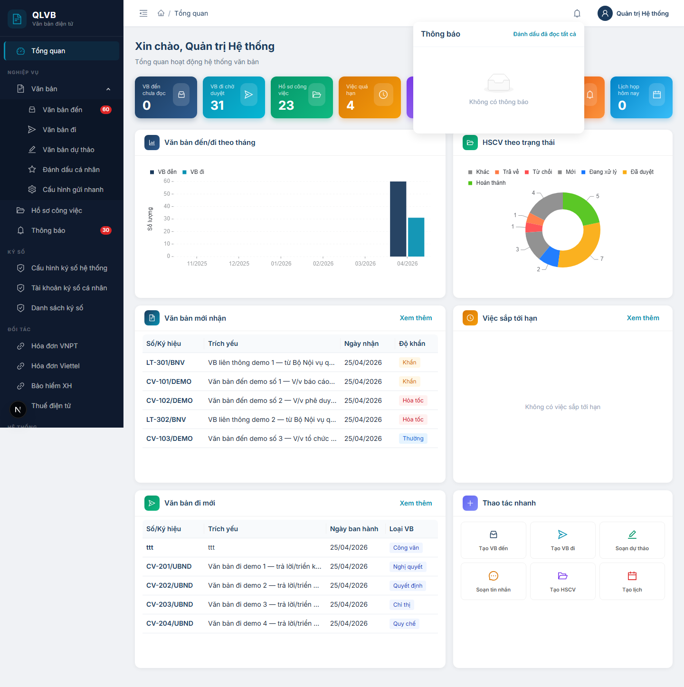

Chuông thông báo nằm ở **góc trên bên phải mọi màn hình**, kế bên ảnh đại diện người dùng, gồm:

- **Biểu tượng chuông** (BellOutlined).
- **Huy hiệu số** màu đỏ ở góc phải trên của chuông — hiển thị số thông báo **chưa đọc**. Nếu vượt quá 99, hiển thị **99+**. Khi không có thông báo chưa đọc, huy hiệu ẩn đi.

Bấm vào biểu tượng chuông sẽ mở **bảng thả xuống (dropdown)** với cấu trúc:

- **Phần đầu**: tiêu đề **"Thông báo"** ở bên trái, nút **"Đánh dấu đã đọc tất cả"** ở bên phải (nút này bị mờ đi khi không có thông báo chưa đọc).
- **Phần thân**: tối đa **10 thông báo gần nhất**, sắp xếp theo thời gian — mới nhất lên đầu.
  - Mỗi thông báo gồm: biểu tượng (xem mục 4), **tiêu đề** (in đậm nếu chưa đọc), **mô tả ngắn**, và **thời điểm tương đối** (ví dụ *"3 phút trước"*, *"2 giờ trước"*).
  - Thông báo **chưa đọc** có nền sáng nổi bật hơn so với thông báo đã đọc.
- Khi chưa có thông báo nào, hiển thị thông báo *"Không có thông báo"*.

Bấm vào một dòng thông báo trong bảng thả xuống sẽ:

1. Đánh dấu thông báo đó là đã đọc (huy hiệu số trên chuông giảm đi 1).
2. Đóng bảng thả xuống.
3. **Mở thẳng tới màn hình liên quan** (ví dụ: thông báo ký số → mở tab "Đã ký" trong màn hình **Danh sách giao dịch ký số**).

> **Lưu ý**: Khi có sự kiện mới (ví dụ vừa ký xong một văn bản) hệ thống sẽ **tự động cập nhật** số trên huy hiệu và hiển thị **thông báo nổi (toast)** ở góc trên bên phải trong khoảng 3 giây — không cần tải lại trang.

---

### 3. Bố cục Trang Thông báo (`/thong-bao`)


Truy cập từ menu bên trái → bấm mục **Thông báo** (biểu tượng chuông). Nếu trên menu có số đếm in đậm bên cạnh chữ "Thông báo", đó là số thông báo chưa đọc của trang này (theo nguồn đơn vị).

Bố cục màn hình gồm:

- **Phần đầu trang**:
  - Tiêu đề **"Thông báo"** kèm biểu tượng chuông và dòng mô tả ngắn *"Quản lý và theo dõi các thông báo hệ thống"*.
  - **Nút "Đánh dấu đã đọc tất cả"** — đánh dấu toàn bộ thông báo đang còn chưa đọc thành đã đọc.
  - **Nút "Tạo thông báo"** (màu xanh) — chỉ hiển thị với tài khoản **Quản trị**. Người dùng thường không thấy nút này.
- **Thanh phân loại (tab)**:
  - **Tất cả** — hiển thị toàn bộ thông báo của đơn vị, bất kể đã đọc hay chưa.
  - **Chưa đọc** — chỉ thông báo còn chưa đọc.
  - **Đã đọc** — chỉ thông báo đã được đánh dấu đã đọc.
- **Danh sách thông báo**:
  - Mỗi thông báo gồm: biểu tượng chuông tròn, **tiêu đề** (in đậm nếu chưa đọc, kèm chấm xanh nhỏ ở đầu dòng), **thời gian** dạng `DD/MM/YYYY HH:mm` ở bên phải, **nội dung** rút gọn 2 dòng phía dưới.
  - Bấm vào dòng thông báo còn chưa đọc → đánh dấu thành đã đọc; chấm xanh và in đậm sẽ biến mất.
- **Phân trang**: 20 thông báo / trang. Phân trang chỉ hiển thị khi tổng số thông báo vượt quá 20.
- **Khi danh sách trống**: hiển thị biểu tượng chuông xám lớn cùng dòng chữ *"Chưa có thông báo"* và *"Hệ thống sẽ thông báo khi có văn bản mới hoặc việc được giao."*

---

### 4. Các loại thông báo

Hệ thống phân biệt **hai nguồn thông báo** với hai vùng hiển thị khác nhau:

| Nguồn | Hiển thị ở đâu | Khi nào hệ thống tạo | Bấm vào dẫn đến đâu |
|---|---|---|---|
| **Ký số thành công** (`sign_completed`) | Chuông thông báo trên thanh đầu trang | Sau khi giao dịch ký số của chính người dùng kết thúc thành công (do hệ thống ký số nền — `signing-poll.worker`) | **Danh sách giao dịch ký số** → tab **Đã ký**. Đường dẫn: `/ky-so/danh-sach?tab=completed` |
| **Ký số thất bại / hết hạn / đã hủy** (`sign_failed`) | Chuông thông báo trên thanh đầu trang | Khi giao dịch ký số của chính người dùng bị **thất bại**, **hết hạn** (không xác nhận trong 3 phút) hoặc **bị hủy** | **Danh sách giao dịch ký số** → tab **Thất bại**. Đường dẫn: `/ky-so/danh-sach?tab=failed` |
| **Thông báo nội bộ đơn vị** | Trang **Thông báo** (`/thong-bao`) | Quản trị viên hoặc cán bộ có quyền **bấm "Tạo thông báo"** trên trang này (xem mục 6.4) | Không có đường dẫn — chỉ hiển thị nội dung và đánh dấu đã đọc tại chỗ |

> **Phân biệt**:
>
> - Thông báo **ký số** là **của riêng từng người** — chỉ chính người yêu cầu ký mới thấy.
> - Thông báo **nội bộ đơn vị** dùng chung cho toàn bộ cán bộ thuộc cùng một **đơn vị** (cấp đơn vị cha — Sở, Ban, Ngành) — ai cùng đơn vị đều thấy và mỗi người tự đánh dấu đã đọc cho riêng mình.

> **Phạm vi thông báo qua chuông tại phiên bản hiện tại**: chuông trên thanh đầu trang **chỉ phát thông báo cá nhân cho hai sự kiện liên quan tới ký số** — *Ký số thành công* và *Ký số thất bại / hết hạn / đã hủy*. Các sự kiện nghiệp vụ khác (giao việc, có văn bản đến mới, được phân công xử lý, ý kiến chỉ đạo, thay đổi trạng thái hồ sơ công việc…) **chưa được nối vào chuông** ở phiên bản này — nếu cần biết, người dùng vẫn phải vào thẳng các màn hình tương ứng (Văn bản đến, Bút phê, Hồ sơ công việc…) để theo dõi.

---

### 5. Các nút và thao tác

| Nút / Thao tác | Vị trí | Khi nào hiển thị | Tác dụng |
|---|---|---|---|
| **Biểu tượng chuông** | Góc trên bên phải mọi màn hình | Luôn hiển thị | Bật / tắt bảng thả xuống thông báo. |
| **Huy hiệu số (badge) trên chuông** | Trên biểu tượng chuông | Khi có thông báo chưa đọc | Hiển thị số thông báo cá nhân chưa đọc (tối đa hiển thị **99+**). |
| **Đánh dấu đã đọc tất cả** (trong bảng thả xuống) | Phần đầu của bảng thả xuống | Luôn hiển thị; mờ đi nếu không có thông báo chưa đọc | Đánh dấu toàn bộ thông báo cá nhân thành đã đọc. Huy hiệu trên chuông trở về 0. |
| **Bấm vào một dòng thông báo** (trong bảng thả xuống) | Trong bảng thả xuống | Luôn hiển thị | Đánh dấu dòng đó là đã đọc, đóng bảng và **chuyển tới màn hình liên quan** (nếu thông báo có gắn đường dẫn). |
| **Mục "Thông báo" trong menu bên trái** | Menu chính bên trái | Luôn hiển thị | Mở **trang Thông báo** (`/thong-bao`). |
| **Tab Tất cả / Chưa đọc / Đã đọc** | Phần đầu trang Thông báo | Luôn hiển thị | Lọc danh sách hiển thị bên dưới theo trạng thái đọc. |
| **Đánh dấu đã đọc tất cả** (trang Thông báo) | Góc trên bên phải trang Thông báo | Luôn hiển thị | Đánh dấu toàn bộ thông báo đơn vị còn chưa đọc thành đã đọc. Hệ thống báo **"Đã đánh dấu tất cả là đã đọc"**. |
| **Tạo thông báo** (trang Thông báo) | Góc trên bên phải trang Thông báo | **Chỉ Quản trị viên** (admin) | Mở cửa sổ phụ để tạo thông báo nội bộ mới gửi cho toàn đơn vị. |
| **Bấm vào một dòng thông báo** (trang Thông báo) | Bất kỳ dòng nào trong danh sách | Luôn hiển thị | Đánh dấu dòng đó là đã đọc (chấm xanh và in đậm biến mất). |
| **Nút Hủy** (cửa sổ Tạo thông báo) | Góc trên bên phải cửa sổ phụ | Trong cửa sổ Tạo thông báo | Đóng cửa sổ, không lưu. |
| **Nút Tạo thông báo** (trong cửa sổ phụ) | Góc trên bên phải cửa sổ phụ | Trong cửa sổ Tạo thông báo | Lưu và phát hành thông báo cho đơn vị. |

---

### 6. Quy trình thao tác

#### 6.1. Xem nhanh thông báo cá nhân qua chuông

1. Trên thanh đầu trang, để ý **huy hiệu số** trên biểu tượng chuông — đó là số thông báo chưa đọc.
2. Bấm vào **biểu tượng chuông**.
3. Bảng thả xuống mở ra với 10 thông báo gần nhất. Các thông báo chưa đọc có **tiêu đề in đậm** và nền nổi bật hơn.
4. Đọc nhanh tiêu đề, mô tả ngắn và thời gian *"x phút/giờ/ngày trước"* để nắm tình hình.

#### 6.2. Mở chi tiết một thông báo cá nhân

1. Trong bảng thả xuống của chuông, **bấm vào dòng thông báo** muốn xem.
2. Hệ thống đồng thời thực hiện 3 việc:
   - Đánh dấu thông báo đó là đã đọc.
   - Giảm huy hiệu trên chuông đi 1.
   - Chuyển sang màn hình liên quan (ví dụ: thông báo ký số sẽ mở **Danh sách giao dịch ký số**).
3. Tại màn hình liên quan, có thể xem chi tiết và thực hiện thao tác tiếp theo (xem file đã ký, kiểm tra lý do thất bại…).

#### 6.3. Đánh dấu đã đọc tất cả

**Cách 1 — từ chuông**:

1. Bấm vào biểu tượng chuông.
2. Bấm **"Đánh dấu đã đọc tất cả"** ở phần đầu bảng thả xuống.
3. Toàn bộ thông báo trong danh sách trở thành đã đọc, huy hiệu trên chuông biến mất.

**Cách 2 — từ trang Thông báo**:

1. Vào menu bên trái → **Thông báo**.
2. Bấm nút **"Đánh dấu đã đọc tất cả"** ở góc trên bên phải.
3. Hệ thống thông báo **"Đã đánh dấu tất cả là đã đọc"**, danh sách cập nhật ngay.

> Hai nút này hoạt động trên **hai nguồn dữ liệu khác nhau**: nút trên chuông áp dụng cho thông báo cá nhân (ký số), nút trên trang `/thong-bao` áp dụng cho thông báo đơn vị. Cần thực hiện cả hai nếu muốn xóa hết huy hiệu chưa đọc ở cả hai nơi.

#### 6.4. Tạo thông báo nội bộ (chỉ Quản trị viên)

*[Hình minh họa: Cửa sổ Tạo thông báo mới]*

1. Vào menu bên trái → **Thông báo**.
2. Bấm nút **Tạo thông báo** (màu xanh) ở góc trên bên phải. Cửa sổ phụ mở ra từ bên phải.
3. Trong cửa sổ, điền:
   - **Tiêu đề** (bắt buộc) — tối đa **300 ký tự**, có hiển thị số ký tự đã nhập.
   - **Nội dung** (bắt buộc) — vùng văn bản 6 dòng, tối đa **5.000 ký tự**, có hiển thị số ký tự đã nhập.
4. Bấm **Tạo thông báo**. Hệ thống thông báo **"Tạo thông báo thành công"** và đóng cửa sổ. Danh sách tự động tải lại — thông báo vừa tạo xuất hiện ở đầu danh sách.
5. Nếu bấm **Hủy** thì đóng cửa sổ và không lưu.

> Thông báo này được phát hành cho **toàn bộ cán bộ cùng đơn vị (đơn vị cha)** với người tạo. Mỗi người sẽ thấy thông báo trong trang Thông báo của mình ở trạng thái chưa đọc; sau khi bấm vào / đánh dấu đã đọc thì thông báo trở thành đã đọc **chỉ với riêng người đó**.

#### 6.5. Lọc thông báo trên trang Thông báo

1. Vào trang **Thông báo**.
2. Bấm tab tương ứng:
   - **Tất cả** — toàn bộ.
   - **Chưa đọc** — chỉ thông báo chưa đọc.
   - **Đã đọc** — chỉ thông báo đã đọc.
3. Danh sách bên dưới được lọc lại ngay. Trang số quay về 1 mỗi khi đổi tab.

---

### 7. Lưu ý / Ràng buộc nghiệp vụ

#### 7.1. Hai vùng thông báo độc lập

Chuông trên thanh đầu trang và trang `/thong-bao` đọc **hai nguồn dữ liệu khác nhau**:

- **Chuông** → các thông báo cá nhân (kết quả ký số…).
- **Trang `/thong-bao`** → các thông báo nội bộ đơn vị do người có quyền tạo thủ công.

Vì vậy, nếu chỉ vào trang `/thong-bao` và đánh dấu đã đọc tất cả, **huy hiệu trên chuông không bị giảm**. Ngược lại, đánh dấu đã đọc trong chuông cũng không ảnh hưởng đến danh sách trên trang `/thong-bao`.

#### 7.2. Tự động cập nhật khi có thông báo mới

Khi có sự kiện mới (kết thúc một giao dịch ký số…), hệ thống đồng thời:

1. **Lưu lại** thông báo vào hệ thống — kể cả khi người dùng đang ngoại tuyến cũng thấy được khi đăng nhập lại.
2. **Tự động cập nhật** số trên huy hiệu của chuông và (nếu đang mở bảng thả xuống) làm mới danh sách.
3. **Hiển thị thông báo nổi (toast)** trong khoảng 3 giây ở góc trên bên phải, kèm tiêu đề và mô tả ngắn.

Người dùng không cần làm mới (F5) để thấy thông báo mới.

#### 7.3. Phạm vi cá nhân của trạng thái đọc

Mỗi thông báo có một trạng thái **đã đọc / chưa đọc** **riêng cho từng tài khoản**. Người này đánh dấu đã đọc không ảnh hưởng đến người khác — kể cả khi cùng nhận một thông báo nội bộ đơn vị.

#### 7.4. Quyền tạo thông báo nội bộ

Nút **Tạo thông báo** trên trang `/thong-bao` chỉ hiển thị với tài khoản có vai trò **Quản trị**. Người dùng thường không thấy nút này và không tự tạo được. Nếu cần phát hành thông báo cho đơn vị, liên hệ với cán bộ phụ trách hoặc văn thư.

#### 7.5. Giới hạn ký tự khi tạo thông báo

- **Tiêu đề**: tối đa **300 ký tự**, không được để trống.
- **Nội dung**: tối đa **5.000 ký tự**, không được để trống.

Nếu để trống một trong hai, hệ thống báo **"Vui lòng nhập tiêu đề"** hoặc **"Vui lòng nhập nội dung"** ngay dưới ô tương ứng.

#### 7.6. Hiển thị tối đa 10 trong chuông, 20 trong trang

- Bảng thả xuống của chuông chỉ hiển thị **10 thông báo cá nhân gần nhất**. Thông báo cá nhân (ký số) cũ hơn 10 mục **không có giao diện để xem lại** — chuông không có nút "Xem tất cả" và cũng không có trang riêng cho danh sách thông báo cá nhân. Trang `/thong-bao` (mở từ menu **Thông báo**) chỉ hiển thị **thông báo nội bộ đơn vị**, **không** liệt kê thông báo ký số. Vì vậy: khi cần tra cứu lịch sử các giao dịch ký số đã xảy ra, hãy vào thẳng **Ký số > Danh sách giao dịch** và lọc theo tab **Đã ký** / **Thất bại** thay vì tìm trên chuông.
- Trang `/thong-bao` hiển thị **20 thông báo / trang** với phân trang đầy đủ.

#### 7.7. Bảng tổng hợp các thông báo của hệ thống

| Tình huống | Thông báo |
|---|---|
| Đánh dấu đã đọc tất cả (trang Thông báo) | Đã đánh dấu tất cả là đã đọc |
| Đánh dấu đã đọc tất cả (trang Thông báo) — thất bại | Thao tác thất bại. Vui lòng thử lại. |
| Tạo thông báo thành công (trang Thông báo) | Tạo thông báo thành công |
| Tạo thông báo (trang Thông báo) — thất bại | Tạo thông báo thất bại. Vui lòng thử lại. |
| Tạo thông báo (trang Thông báo) — bỏ trống tiêu đề | Vui lòng nhập tiêu đề |
| Tạo thông báo (trang Thông báo) — bỏ trống nội dung | Vui lòng nhập nội dung |
| Tạo thông báo (trang Thông báo) — tiêu đề rỗng phía máy chủ | Tiêu đề thông báo là bắt buộc |
| Tạo thông báo (trang Thông báo) — tiêu đề quá 300 ký tự | Tiêu đề không được vượt quá 300 ký tự |
| Tạo thông báo (trang Thông báo) — nội dung rỗng phía máy chủ | Nội dung thông báo là bắt buộc |
| Toast nổi khi ký số thành công (chuông) | **Ký số thành công** — Giao dịch #N đã hoàn tất |
| Toast nổi khi ký số thất bại (chuông) | **Ký số thất bại** — chi tiết lý do |
| Toast nổi khi ký số hết hạn (chuông) | **Ký số hết hạn** — chi tiết lý do |
| Toast nổi khi ký số bị hủy (chuông) | **Đã hủy ký số** — chi tiết lý do |
| Tiêu đề thông báo bell — ký số thành công | Ký số thành công: *(tên file)* |
| Tiêu đề thông báo bell — ký số thất bại | Ký số thất bại |
| Tiêu đề thông báo bell — ký số hết hạn | Ký số hết hạn |
| Bảng thả xuống chuông — không có thông báo | Không có thông báo |
| Trang Thông báo — danh sách rỗng | Chưa có thông báo / Hệ thống sẽ thông báo khi có văn bản mới hoặc việc được giao. |
| Đánh dấu một thông báo (chuông) — không tìm thấy / không phải của mình | Thông báo không tồn tại hoặc không thuộc về bạn |

---

*Tài liệu được biên soạn dựa trên hệ thống thực tế đang triển khai. Mọi thắc mắc vui lòng liên hệ với đội phát triển để được hỗ trợ.*


\newpage

## Hướng dẫn sử dụng: Văn bản đến

Tài liệu này mô tả đầy đủ các chức năng của hai màn hình **Danh sách Văn bản đến** và **Chi tiết Văn bản đến** trong hệ thống Quản lý văn bản điện tử (e-Office), giúp người dùng nắm vững cách tiếp nhận, vào sổ, phân công và xử lý một văn bản đến đúng quy trình của cơ quan nhà nước.

---

### 1. Giới thiệu

**Văn bản đến** là toàn bộ giấy tờ, công văn, công điện, quyết định... mà cơ quan nhận được từ bên ngoài (cơ quan cấp trên, cơ quan ngang cấp, cơ quan cấp dưới, doanh nghiệp, công dân) hoặc từ nội bộ (đơn vị khác trong tỉnh gửi qua liên thông LGSP, đơn vị nội bộ gửi văn bản đi). Đây là **module cốt lõi**, là điểm bắt đầu của hầu hết mọi quy trình hành chính trong cơ quan.

Vòng đời tổng quan của một văn bản đến gồm 4 chặng chính:

1. **Tiếp nhận và vào sổ** — Văn thư nhập thông tin văn bản, hệ thống cấp số đến tự động.
2. **Lãnh đạo duyệt và bút phê** — Lãnh đạo xem xét, ghi ý kiến chỉ đạo, có thể phân công ngay.
3. **Phân công xử lý** — Lãnh đạo gửi văn bản tới các cán bộ phối hợp, hoặc tạo Hồ sơ công việc (HSCV) giao việc cho người phụ trách kèm hạn xử lý.
4. **Theo dõi xử lý và lưu trữ** — Cán bộ xử lý đọc, xử lý, báo cáo qua HSCV; cuối cùng văn bản được chuyển vào kho lưu trữ.

Hệ thống hỗ trợ ba **nguồn văn bản đến** khác nhau:

- **Nhập tay (manual)**: Văn thư tự nhập từ văn bản giấy hoặc file đính kèm — đây là trường hợp phổ biến nhất.
- **Nội bộ (internal)**: Văn bản tự động sinh ra khi một đơn vị trong cùng tỉnh phát hành văn bản đi gửi tới đơn vị mình.
- **Liên thông LGSP (external_lgsp)**: Văn bản nhận qua trục liên thông Chính phủ điện tử.

Văn bản đến nguồn **internal** và **external_lgsp** không được sửa nội dung gốc — chỉ tiếp nhận, phân công xử lý hoặc chuyển lại.

---

### 2. Bố cục màn hình Danh sách

*[Hình minh họa: Màn hình Danh sách Văn bản đến]*

Màn hình Danh sách được chia thành các phần:

- **Phần đầu trang**: Tiêu đề "Văn bản đến" kèm biểu tượng. Bên phải có thanh nút công cụ: **Đánh dấu đã đọc** (chỉ hiện khi có dòng tích chọn), **Xuất Excel**, **In**, **Thêm mới**.
- **Hàng bộ lọc**: Ô tìm kiếm trích yếu/ký hiệu, ô chọn Phòng ban (chỉ Quản trị thấy), ô chọn Sổ văn bản, ô chọn Loại văn bản, ô chọn Độ khẩn, dải ngày, nút **Xóa bộ lọc**.
- **Bảng dữ liệu**: Hiển thị danh sách văn bản đến với các cột mô tả ở mục 3. Các dòng **chưa đọc** được tô đậm để dễ phân biệt.
- **Cửa sổ phụ (Drawer)**: **Thêm văn bản đến** / **Sửa văn bản đến** mở từ bên phải khi bấm Thêm mới hoặc Sửa.

---

### 3. Các cột trong Bảng danh sách

| Tên cột | Mô tả |
|---|---|
| **Số đến** | Số thứ tự vào sổ, hệ thống tự cấp theo sổ và năm. Dòng chưa đọc — số đến in đậm. |
| **Ngày đến** | Ngày văn thư tiếp nhận văn bản (định dạng `DD/MM/YYYY`). |
| **Số ký hiệu** | Số/ký hiệu văn bản gốc do cơ quan ban hành đặt (VD: `123/UBND-VP`). |
| **Trích yếu** | Tóm tắt nội dung văn bản. Bấm vào trích yếu để mở **Chi tiết**. Nếu văn bản được đồng nghiệp gửi cho mình, có nhãn nhỏ **"Gửi cho tôi"** kèm tooltip "Do [tên người] gửi lúc [thời gian]". |
| **CQ ban hành** | Cơ quan ban hành văn bản (đơn vị cấp văn bản). |
| **Loại VB** | Loại văn bản (Công văn, Quyết định, Báo cáo...). |
| **Độ khẩn** | Nhãn màu cam **Khẩn** hoặc đỏ **Hỏa tốc**. Nếu là **Thường** thì bỏ trống cột. |
| **Trạng thái** | **Đã duyệt** (xanh lá), **Chờ duyệt** (vàng), **Từ chối** (đỏ). |
| (cột thao tác) | Nút **ba chấm dọc** mở menu các lệnh tùy theo quyền và trạng thái: Xem chi tiết, Sửa, Duyệt, Hủy duyệt, Thu hồi, Xóa. |

---

### 4. Bộ lọc và thanh công cụ

#### 4.1. Các bộ lọc (hàng phía trên bảng)

| Bộ lọc | Mô tả |
|---|---|
| **Tìm kiếm trích yếu, ký hiệu...** | Ô gõ từ khóa, tìm trong các trường: trích yếu, số ký hiệu, cơ quan ban hành, người ký, mã văn bản. |
| **Phòng ban** (chỉ Quản trị) | Chọn phòng ban để xem văn bản đến của đơn vị/phòng ban đó (TreeSelect dạng cây). |
| **Sổ văn bản** | Chọn 1 sổ văn bản đến để lọc. |
| **Loại văn bản** | Chọn 1 loại văn bản (Công văn, Báo cáo...) để lọc. |
| **Độ khẩn** | Lọc theo **Thường / Khẩn / Hỏa tốc**. |
| **Khoảng ngày** (Từ ngày — Đến ngày) | Lọc theo ngày đến. |
| **Xóa bộ lọc** (biểu tượng mũi tên xoay) | Đặt lại tất cả ô lọc về rỗng và trở về trang 1. |

> Khi đổi bất kỳ bộ lọc nào, danh sách tự động chuyển về trang 1 và tải lại. Số lượng tổng hiển thị ở góc dưới bảng dạng *"Tổng [N] văn bản"*.

#### 4.2. Thanh nút công cụ (góc trên bên phải)

| Nút | Khi nào hiển thị | Tác dụng |
|---|---|---|
| **Đánh dấu đã đọc (N)** | Khi có ít nhất 1 dòng được tích chọn ở cột đầu | Đánh dấu hàng loạt các văn bản đã chọn là đã đọc, cập nhật badge "chưa đọc" trên thanh điều hướng. |
| **Xuất Excel** | Luôn hiển thị | Tải xuống file `.xlsx` chứa danh sách văn bản theo bộ lọc đang áp dụng (tối đa 10.000 dòng). Tên file: `VanBanDen_YYYYMMDD.xlsx`. |
| **In** | Luôn hiển thị | Mở hộp thoại in của trình duyệt với danh sách văn bản đến hiện tại. |
| **Thêm mới** | Luôn hiển thị (kiểm tra quyền ở backend) | Mở **Drawer Thêm văn bản đến** để văn thư nhập văn bản mới. |

---

### 5. Drawer Thêm / Sửa Văn bản đến

*[Hình minh họa: Drawer Thêm văn bản đến]*

Khi bấm **Thêm mới** hoặc chọn **Sửa** từ menu, hệ thống mở Drawer rộng 800px ở bên phải. Tiêu đề là *"Thêm văn bản đến"* hoặc *"Sửa văn bản đến"*. Nút **Hủy** và **Tạo mới** / **Cập nhật** ở góc trên bên phải.

Các trường nhập liệu:

| Tên trường | Bắt buộc | Mô tả & ràng buộc |
|---|---|---|
| **Sổ văn bản** | Có | Chọn từ danh sách sổ văn bản đến. Khi chọn xong (chỉ ở chế độ Thêm), hệ thống tự gợi ý **Số đến** kế tiếp. |
| **Số đến** | Không (auto) | Số nguyên ≥ 1. Để trống — hệ thống tự cấp số kế tiếp theo công thức: số lớn nhất hiện có trong sổ + 1, theo năm hiện tại. |
| **Số phụ** | Không | Mã ngắn cho văn bản phụ (VD: `a`, `b`, `c`). Tối đa 20 ký tự. |
| **Ngày đến** | Có | Mặc định là hôm nay. Định dạng `DD/MM/YYYY`. |
| **Ký hiệu** | Không | Số/ký hiệu trên văn bản gốc (VD: `123/UBND-VP`). Tối đa 100 ký tự. |
| **Cơ quan ban hành** | Không | Có thể chọn từ danh sách đơn vị nội bộ (cây phẳng) hoặc gõ tự do tên cơ quan. |
| **Trích yếu nội dung** | Có | Tóm tắt nội dung văn bản. Tối đa 2000 ký tự, có đếm ký tự. |
| **Loại văn bản** | Không | Chọn từ danh sách (Công văn, Quyết định, Báo cáo...). |
| **Lĩnh vực** | Không | Chọn từ danh sách lĩnh vực. |
| **Người ký** | Không | Họ tên người ký bên cơ quan ban hành. Tối đa 200 ký tự. |
| **Ngày ký** | Không | Ngày ký trên văn bản gốc. |
| **Ngày ban hành** | Không | Ngày văn bản được phát hành chính thức. |
| **Hạn xử lý** | Không | Ngày phải hoàn thành xử lý văn bản. Khi quá hạn, ở Chi tiết sẽ có nhãn đỏ **"Quá hạn"**. |
| **Độ mật** | Không | **Thường / Mật / Tối mật / Tuyệt mật**. Mặc định: Thường. |
| **Độ khẩn** | Không | **Thường / Khẩn / Hỏa tốc**. Mặc định: Thường. |
| **Số tờ** | Không | Số nguyên ≥ 0. Mặc định: 1. |
| **Số bản** | Không | Số nguyên ≥ 0. Mặc định: 1. |
| **Bản giấy** | Không | **Chưa nhận** / **Đã nhận** — đánh dấu khi văn thư đã nhận được bản giấy đối chiếu. |
| **Mã văn bản (số CV gốc bên gửi)** | Không | Mã định danh văn bản từ phía cơ quan ban hành (nếu có). Tối đa 100 ký tự. |
| **Nơi gửi** | Có (khi tự nhập) | Cơ quan/đơn vị đã gửi văn bản này tới. Có thể chọn từ danh sách (đơn vị nội bộ + cơ quan ngoài LGSP) hoặc gõ tên tự do. |

Khi để trống **Trích yếu nội dung**, hệ thống báo *"Trích yếu nội dung không được để trống"*. Khi để trống **Sổ văn bản**, hệ thống báo *"Sổ văn bản là bắt buộc"*. Khi sửa văn bản đã duyệt, hệ thống báo *"Không thể sửa văn bản đã được duyệt"* — phải Hủy duyệt trước.

> **Lưu ý nguồn**: Drawer Sửa chỉ hoạt động cho văn bản nguồn **Nhập tay**. Nếu cố sửa văn bản nguồn **internal** hoặc **LGSP**, hệ thống báo: *"Văn bản đến từ đơn vị nội bộ không được sửa nội dung gốc. Chỉ có thể tiếp nhận / phân công xử lý / từ chối."*

---

### 6. Các trạng thái của Văn bản đến

Mỗi văn bản đến tại một thời điểm sẽ ở một trong các trạng thái sau:

| Trạng thái | Ý nghĩa |
|---|---|
| **Chờ duyệt** | Văn bản vừa được vào sổ, lãnh đạo chưa duyệt. Văn thư còn được phép sửa nội dung. |
| **Đã duyệt** | Lãnh đạo đã duyệt. Có thể bút phê, gửi cho cán bộ xử lý, giao việc, gửi liên thông LGSP. |
| **Từ chối** | Văn bản đã bị **chuyển lại** kèm lý do (sau khi đã được duyệt và phân công). Có thể duyệt lại để xử lý tiếp. |
| **Đã lưu trữ** *(ẩn ở Phase hiện tại)* | Đã chuyển vào kho lưu trữ — không thao tác tiếp được. |

Ngoài ra, văn bản còn có 2 thuộc tính phụ ảnh hưởng đến hành động:

- **Đã nhận bản giấy** (`is_received_paper`) — đối chiếu bản cứng đã nhận hay chưa.
- **Là văn bản liên thông** (`is_inter_doc`) — văn bản đến từ tỉnh khác qua LGSP, có nút **Nhận bàn giao** / **Chuyển lại** riêng.

Thanh công cụ trên màn hình **Chi tiết** sẽ **hiển thị khác nhau tùy theo trạng thái và quyền của người dùng** — chỉ các nút phù hợp mới được hiện ra (xem mục 9).

---

### 7. Bố cục màn hình Chi tiết

*[Hình minh họa: Màn hình Chi tiết Văn bản đến]*

Màn hình chi tiết được mở khi bấm vào trích yếu hoặc chọn **Xem chi tiết** từ menu. Bố cục gồm:

- **Thanh đầu trang (Header bar)**: Nút mũi tên quay lại, dòng "Số đến: [N] — [Ký hiệu]", dòng phụ "[Cơ quan ban hành] • Ngày đến: [ngày]", các nhãn trạng thái + độ khẩn + độ mật, các nút thao tác (xem mục 9). Nếu văn bản đã bị từ chối, hiển thị thêm hộp đỏ "Lý do từ chối: ...".
- **Cột trái (rộng ~2/3)**:
  - **Trích yếu nội dung** (khung viền trái màu xanh teal).
  - **Thông tin văn bản** — đầy đủ trường (xem mục 8.1).
  - **Tài liệu đính kèm** — danh sách file (xem mục 8.2).
  - **Ý kiến bút phê** — danh sách ý kiến lãnh đạo + ô nhập bút phê mới (xem mục 8.3).
- **Cột phải (rộng ~1/3)**:
  - **Phân công xử lý** — danh sách cán bộ đã được gửi văn bản (xem mục 8.4).
  - **Lịch sử xử lý** — Timeline các sự kiện (xem mục 8.5).

---

### 8. Nội dung chi tiết các phần

#### 8.1. Phần "Thông tin văn bản"

Hiển thị toàn bộ trường của văn bản theo nhóm 2 cột:

- **Số đến** — số đã vào sổ.
- **Ngày đến** — định dạng `DD/MM/YYYY`.
- **Số ký hiệu** — in màu xanh teal.
- **Sổ văn bản** — tên sổ.
- **Cơ quan ban hành** (chiếm cả 2 cột).
- **Loại văn bản**, **Lĩnh vực**.
- **Người ký**, **Ngày ký**.
- **Hạn xử lý** — chữ đỏ kèm nhãn **"Quá hạn"** nếu đã quá hạn so với hôm nay.
- **Nơi nhận** — danh sách đơn vị nhận (đối với văn bản đến nguồn nội bộ — tự fill từ văn bản đi gốc).
- **Người duyệt** — họ tên + nhãn xanh thời điểm duyệt.
- **Nguồn** — nhãn:
  - **Nội bộ** (xanh dương) — kèm tên đơn vị gửi.
  - **LGSP** (xanh lá) — kèm mã văn bản ngoài.
  - **Nhập tay** (xám) — văn bản văn thư tự nhập.
- **Độ mật**, **Độ khẩn** — nhãn màu.
- **Số tờ / Số bản**.
- **Bản giấy** — nhãn xanh **"Đã nhận"** hoặc xám **"Chưa nhận"**.
- **Người nhập** + **Thời gian tạo** (phần đáy có gạch ngăn).

#### 8.2. Phần "Tài liệu đính kèm"

Mỗi file hiển thị: biểu tượng theo loại file (PDF, Word, Excel, ảnh...), tên file, dung lượng, thời gian tải lên, nhãn **"Đã ký số"** (xanh) nếu đã ký.

Thao tác trên mỗi file:

- **Tải xuống** (biểu tượng tải về) — luôn có. Hệ thống stream file qua backend (không lộ link MinIO).
- **Ký số** — chỉ hiển thị khi file **chưa được ký số**.
- **Xác thực** — chỉ hiển thị khi file **đã ký số**. Nếu hợp lệ — hộp xanh "Chữ ký hợp lệ" kèm tên người ký + thời gian; nếu chưa ký — hộp vàng "Chưa ký số".
- **Xóa file** (chỉ khi văn bản chưa duyệt) — Popconfirm "Xóa file?" trước khi xóa.

Ở góc phải tiêu đề có nút **"Thêm file"** (chỉ khi văn bản **chưa duyệt**) — chọn file để tải lên. Định dạng cho phép: PDF, Word, Excel, ảnh. Dung lượng tối đa 50 MB/file. Nếu chưa chọn file mà bấm tải lên, hệ thống báo *"Vui lòng chọn file"*.

#### 8.3. Phần "Ý kiến bút phê"

Mỗi ý kiến hiển thị: ảnh đại diện, tên + chức vụ người bút phê, nội dung bút phê, thời gian. Nền xanh nhạt, viền trái xanh lá để dễ nhận biết. Người tự bút phê có nút xóa **Popconfirm "Xóa bút phê?"**.

Khi văn bản **đã duyệt**, dưới danh sách bút phê hiện ra ô nhập:

- Ô vùng văn bản 2 dòng *"Nhập nội dung bút phê..."*.
- Ô tích **"Phân công giải quyết"** — khi tích, mở thêm:
  - **Cán bộ xử lý** (chọn nhiều) — danh sách nạp sẵn từ "Cấu hình gửi nhanh" của người dùng.
  - **Hạn giải quyết** — chọn ngày.
- Nút **"Gửi bút phê"** (khi không tích phân công) hoặc **"Bút phê & Phân công"** (khi có tích).

Nếu để trống nội dung mà bấm gửi, hệ thống báo *"Nội dung bút phê không được để trống"*. Nếu tích Phân công nhưng không chọn cán bộ, báo *"Vui lòng chọn cán bộ phân công"*. Khi gửi thành công kèm phân công, hệ thống báo: *"Bút phê thành công, đã phân công [N] cán bộ"*.

#### 8.4. Phần "Phân công xử lý"

Hiển thị số lượng cán bộ đã được gửi văn bản: *"Phân công xử lý ([N])"*. Mỗi dòng:

- Avatar có dấu chấm trạng thái (xanh — đã đọc, xám — chưa đọc).
- Họ tên cán bộ — chức vụ • phòng ban.
- Trạng thái đọc: **"Đã đọc lúc HH:mm DD/MM"** (xanh) hoặc **"Chưa đọc"** (vàng).

Khi chưa có ai được phân công: *"Chưa phân công cho phòng/cá nhân nào xử lý"*.

#### 8.5. Phần "Lịch sử xử lý"

Timeline các sự kiện đã xảy ra trên văn bản, theo thứ tự mới nhất trên đầu:

| Loại sự kiện | Nội dung hiển thị | Màu chấm |
|---|---|---|
| **Tạo văn bản** | "Tạo văn bản đến, số đến: [N]" | Xanh dương |
| **Duyệt** | "Duyệt văn bản" | Xanh lá |
| **Gửi cho cán bộ** | "Nhận văn bản" | Xanh ngọc |
| **Bút phê** | Nội dung bút phê | Cam |

Khi chưa có sự kiện nào — hiển thị *"Chưa có lịch sử"*.

---

### 9. Các nút hành động theo trạng thái và quyền

Thanh công cụ trên đầu màn hình Chi tiết có các nút sau, **hiển thị tùy theo trạng thái + quyền của người dùng**.

#### 9.1. Nút luôn hiển thị (mọi trạng thái)

| Nút | Tác dụng |
|---|---|
| **Mũi tên quay lại** | Trở về Danh sách văn bản đến. |
| **Ngôi sao** (đánh dấu cá nhân) | Bật/tắt đánh dấu — văn bản sẽ xuất hiện ở mục **Văn bản đánh dấu** của tôi. Khi đã đánh dấu, sao chuyển vàng. |
| **Giao việc** (xanh teal) | Mở Drawer **Giao việc** — tạo HSCV mới gắn văn bản này, cử người phụ trách + hạn xử lý (xem mục 10.2). |
| **Thêm vào HSCV** | Mở Modal — chọn HSCV sẵn có để thêm văn bản vào (xem mục 10.3). |

#### 9.2. Khi văn bản **Chờ duyệt**

| Nút | Hiển thị khi | Tác dụng |
|---|---|---|
| **Sửa** | Người dùng có quyền sửa **VÀ** nguồn = Nhập tay | Mở Drawer Sửa văn bản đến (chuyển sang trang Danh sách rồi mở Drawer kèm `?edit=ID`). |
| **Duyệt** (chính, xanh dương) | Người dùng có quyền duyệt | Bấm — duyệt ngay (không cần xác nhận). Hệ thống báo *"Duyệt văn bản thành công"*. |
| **Thu hồi** (trong menu ba chấm) | Đã có người được gửi VB **VÀ** có quyền thu hồi | Mở hộp xác nhận đỏ — xóa tất cả người nhận và đặt lại trạng thái Chờ duyệt. |
| **Xóa văn bản** (trong menu ba chấm, đỏ) | Có quyền sửa | Mở hộp xác nhận. **Không xóa được nếu văn bản đã duyệt.** |

#### 9.3. Khi văn bản **Đã duyệt**

| Nút | Hiển thị khi | Tác dụng |
|---|---|---|
| **Gửi** (chính, xanh dương) | Có quyền gửi | Mở Modal **Gửi văn bản** — chọn danh sách cán bộ nhận (xem mục 10.1). |
| **Bút phê** | Luôn hiển thị | Cuộn xuống và đặt con trỏ vào ô nhập bút phê. |
| **Gửi liên thông** (xanh lá) | Văn bản đã duyệt | Mở Modal — chọn các đơn vị LGSP để gửi văn bản qua trục liên thông (xem mục 10.5). |
| **Nhận bản giấy** (trong menu ba chấm) | Chưa nhận bản giấy **VÀ** có quyền duyệt | Đánh dấu đã nhận đối chiếu bản cứng. Hệ thống báo *"Đã xác nhận nhận bản giấy"*. |
| **Hủy duyệt** (trong menu ba chấm, đỏ) | Có quyền duyệt | Hủy duyệt. **Không hủy được nếu đã gửi cho cán bộ** — phải Thu hồi trước. |
| **Thu hồi** (trong menu ba chấm) | Có quyền thu hồi | Xóa tất cả người nhận (trừ chính mình) và đặt lại trạng thái chưa duyệt. |

#### 9.4. Khi văn bản là **Liên thông** (`is_inter_doc = true`)

| Nút | Tác dụng |
|---|---|
| **Nhận bàn giao** (xanh lá) | Popconfirm "Nhận bàn giao văn bản? Bạn có chắc chắn nhận bàn giao văn bản này?". Bấm Xác nhận — hệ thống ghi nhận đã nhận. |
| **Chuyển lại** | Mở Modal **Lý do chuyển lại** — bắt buộc nhập lý do (≥10 ký tự) để gửi trả lại văn bản (xem mục 10.4). |

#### 9.5. Quy tắc quyền hạn

Quyền các nút được tính theo công thức sau (khi không phải Quản trị):

- **canEdit (Sửa, Xóa, Tải/Xóa file)** = là người tạo VB **HOẶC** cùng đơn vị + được đánh dấu *"Xử lý văn bản"*.
- **canApprove (Duyệt, Hủy duyệt, Nhận bản giấy, Giao việc, Thêm vào HSCV, Gửi liên thông, Chuyển lưu trữ)** = cùng đơn vị + có chức vụ **Lãnh đạo**.
- **canSend (Gửi cho cán bộ)** = là người tạo VB **HOẶC** cùng đơn vị + Lãnh đạo.
- **canRetract (Thu hồi, Chuyển lại)** = cùng đơn vị + Lãnh đạo.

Quản trị có toàn quyền. Trường hợp đặc biệt: cán bộ **được giao** văn bản (có trong danh sách người nhận) và có chức vụ **Lãnh đạo** — được mở rộng quyền `canApprove`, `canSend`, `canRetract` để xử lý trong phạm vi mình.

---

### 10. Các Drawer / Modal phụ — chi tiết

#### 10.1. Modal Gửi văn bản

*[Hình minh họa: Modal Gửi văn bản]*

Mở khi bấm **Gửi**. Tiêu đề *"Gửi văn bản"*.

- Ô tích **Chọn tất cả** ở phía trên.
- Danh sách cán bộ gom theo **phòng ban**. Mỗi cán bộ có ô tích kèm họ tên + chức vụ.
- Hệ thống chỉ liệt kê cán bộ thuộc đơn vị mình hoặc các phòng trực thuộc, **chưa bị khóa**.
- Nút **OK** ghi *"Gửi (N)"* — N là số người đã chọn.
- Khi không chọn ai, hệ thống báo *"Chọn ít nhất một người nhận"*.
- Sau khi gửi thành công, hệ thống hiển thị *"Đã gửi cho [N] người nhận"* và cập nhật phần "Phân công xử lý" + "Lịch sử".

#### 10.2. Drawer Giao việc (tạo HSCV)

Mở khi bấm **Giao việc** (xanh teal). Tiêu đề *"Giao việc"*. Drawer rộng 720px.

| Trường | Bắt buộc | Mô tả |
|---|---|---|
| **Tên hồ sơ** | Có | Tên HSCV — mặc định lấy từ trích yếu của VB. Tối đa 200 ký tự. |
| **Hạn xử lý** | Có | Mặc định lấy từ Hạn xử lý của VB (nếu có). |
| **Người phụ trách** | Có (≥1) | Chọn nhiều cán bộ — người đầu tiên là **người phụ trách chính**. |
| **Ghi chú** | Không | Tối đa 500 ký tự, có đếm. |

Bấm **Tạo và giao việc** — hệ thống tạo HSCV mới, gắn văn bản hiện tại vào HSCV và phân công cán bộ. Báo: *"Giao việc thành công"*.

#### 10.3. Modal Thêm vào HSCV

Mở khi bấm **Thêm vào HSCV**. Tiêu đề *"Thêm vào hồ sơ công việc"*.

- Ô chọn HSCV — danh sách các HSCV của đơn vị, kèm trạng thái: **(Mới)**, **(Đang xử lý)**, **(Trình duyệt)**.
- Khi chưa chọn HSCV mà bấm OK, hệ thống báo *"Vui lòng chọn hồ sơ công việc"*.
- Sau khi thêm thành công, hệ thống báo *"Đã thêm vào hồ sơ công việc"*.

#### 10.4. Modal Chuyển lại (chỉ VB liên thông)

Mở khi bấm **Chuyển lại** (chỉ với VB `is_inter_doc`). Tiêu đề *"Lý do chuyển lại"*.

- Ô **Lý do chuyển lại** — bắt buộc, tối đa 500 ký tự, có đếm.
- Quy tắc: lý do phải có **ít nhất 10 ký tự**.
  - Để trống — báo *"Lý do chuyển lại là bắt buộc"* (frontend) hoặc *"Lý do chuyển lại không được để trống"* (SP).
  - Dưới 10 ký tự — báo *"Lý do chuyển lại phải có ít nhất 10 ký tự"*.

Bấm **Chuyển lại** — hệ thống lưu lý do dưới dạng bút phê *"[Chuyển lại] [lý do]"*, đặt văn bản về Chờ duyệt và báo *"Chuyển lại văn bản thành công"*.

#### 10.5. Modal Gửi liên thông LGSP

Mở khi bấm **Gửi liên thông** (chỉ khi VB đã duyệt). Tiêu đề *"Gửi liên thông LGSP"*.

- Ô chọn nhiều đơn vị nhận — danh sách các cơ quan trên trục LGSP.
- Khi không chọn đơn vị nào, báo *"Vui lòng chọn ít nhất một đơn vị"*.
- Sau khi gửi, báo *"Đã gửi liên thông cho [N] đơn vị"*.

#### 10.6. Drawer Chuyển lưu trữ *(tạm ẩn)*

Phase hiện tại tạm ẩn. Khi bật lại, mở khi bấm **Chuyển lưu trữ** (chỉ VB đã duyệt, chưa lưu trữ). Các trường: Kho lưu trữ (bắt buộc), Phông lưu trữ (bắt buộc), Mục lục hồ sơ, Ký hiệu hồ sơ, Thứ tự VB, Ngôn ngữ, Định dạng, Bút tích, Từ khóa, Mức độ tin cậy, Bản gốc.

---

### 11. Quy trình nghiệp vụ chính

#### 11.1. Văn thư tiếp nhận và vào sổ văn bản đến

1. Văn thư bấm **Thêm mới** ở Danh sách.
2. Drawer mở ra, văn thư:
   - Chọn **Sổ văn bản** — hệ thống tự gợi ý **Số đến**.
   - Nhập **Trích yếu nội dung** (bắt buộc).
   - Nhập các thông tin còn lại từ văn bản giấy: ký hiệu, cơ quan ban hành, người ký, ngày ký, độ khẩn, độ mật...
3. Bấm **Tạo mới** — hệ thống báo *"Tạo văn bản đến thành công"*.
4. Văn bản xuất hiện ở Danh sách với trạng thái **Chờ duyệt**.
5. Văn thư mở Chi tiết — bấm **Thêm file** để tải lên file scan/file đính kèm gốc.
6. (Tùy chọn) Khi nhận đối chiếu bản giấy — vào menu ba chấm bấm **Nhận bản giấy**.

#### 11.2. Lãnh đạo duyệt và bút phê

1. Lãnh đạo vào Chi tiết một văn bản **Chờ duyệt**.
2. Đọc thông tin + tải file đính kèm để xem.
3. Bấm **Duyệt** — văn bản chuyển sang **Đã duyệt**.
4. Cuộn xuống ô **Ý kiến bút phê** — nhập nội dung chỉ đạo.
5. (Tùy chọn) Tích **"Phân công giải quyết"** — chọn cán bộ + Hạn giải quyết.
6. Bấm **Bút phê & Phân công** (hoặc **Gửi bút phê**) — văn bản được gửi tới cán bộ chỉ định kèm ý kiến chỉ đạo.

#### 11.3. Lãnh đạo giao việc qua HSCV

Khi nội dung văn bản cần phối hợp nhiều cán bộ + theo dõi tiến độ chi tiết hơn:

1. Lãnh đạo bấm **Giao việc** ở header.
2. Drawer Giao việc mở:
   - Tên hồ sơ (mặc định = trích yếu).
   - Hạn xử lý (mặc định = Hạn xử lý của VB).
   - Chọn 1 hoặc nhiều **Người phụ trách** (người đầu = phụ trách chính).
   - Ghi chú (tùy chọn).
3. Bấm **Tạo và giao việc** — hệ thống tạo HSCV mới, gắn VB này vào và phân công cán bộ.
4. Cán bộ nhận thấy HSCV trong danh sách HSCV của mình.

#### 11.4. Cán bộ xử lý văn bản

1. Cán bộ thấy văn bản mới (đậm, có nhãn *"Gửi cho tôi"*) ở Danh sách.
2. Bấm vào trích yếu để mở Chi tiết — hệ thống tự đánh dấu **đã đọc**.
3. Tải file đính kèm về xử lý.
4. Nếu được giao việc qua HSCV — vào HSCV để cập nhật tiến độ, trao đổi ý kiến.
5. Trường hợp văn bản gửi nhầm hoặc không thuộc thẩm quyền (chỉ với VB liên thông):
   - Bấm **Chuyển lại**, nhập lý do (≥10 ký tự).
   - Bấm **Chuyển lại** — văn bản trở về Chờ duyệt với bút phê *"[Chuyển lại] [lý do]"*.

#### 11.5. Văn thư rà soát và lưu trữ

1. Văn thư rà soát các văn bản đã đánh dấu **Đã nhận bản giấy** + **Đã duyệt**.
2. Khi đến kỳ lưu trữ — bấm **Chuyển lưu trữ** (khi tính năng bật), nhập thông tin lưu trữ.
3. Văn bản chuyển sang trạng thái **Đã lưu trữ** — không thao tác tiếp được.

#### 11.6. Liên thông LGSP — gửi và nhận

**Gửi đi**: Sau khi duyệt — bấm **Gửi liên thông**, chọn đơn vị nhận trên trục LGSP, bấm **Gửi liên thông**. Hệ thống gọi API LGSP đẩy văn bản sang.

**Nhận về**: Văn bản từ tỉnh khác tự động chui vào Danh sách với nguồn **LGSP**. Nếu là văn bản liên thông cần xác nhận, sẽ có nút **Nhận bàn giao** — Popconfirm xác nhận, bấm Xác nhận để ghi nhận.

---

### 12. Sơ đồ vòng đời văn bản đến

```
┌───────────────────────────────────────────────────────────┐
│  NGUỒN: Nhập tay / Nội bộ / LGSP                          │
└──────────────────────┬────────────────────────────────────┘
                       │
                       ▼
                ┌──────────────┐
                │  Chờ duyệt   │  ◄── Văn thư tạo (vào sổ)
                └──────┬───────┘
                       │
   ┌───────────────────┼───────────────────┐
   │                   │                   │
   │ (Sửa/Xóa)         │ (Lãnh đạo Duyệt)  │ (Hủy duyệt)
   │                   ▼                   │
   │            ┌──────────────┐           │
   │            │   Đã duyệt   │ ──────────┘
   │            └──────┬───────┘
   │                   │
   │     ┌─────────────┼──────────────┐
   │     │             │              │
   │  (Gửi cho      (Bút phê +    (Gửi liên
   │  cán bộ)      Phân công)    thông LGSP)
   │     │             │              │
   │     ▼             ▼              ▼
   │  ┌───────────────────────────────────┐
   │  │  Cán bộ xử lý / HSCV / LGSP gửi   │
   │  └────────────┬──────────────────────┘
   │               │
   │     ┌─────────┴─────────┐
   │     │                   │
   │  (Thu hồi)         (Chuyển lại
   │     │              — VB liên thông)
   │     ▼                   │
   │  Chờ duyệt              ▼
   │     │              (về Chờ duyệt
   │     │               + bút phê lý do)
   │     │
   │     ▼
   └─►  (Chuyển lưu trữ — khi tính năng bật)
         │
         ▼
   ┌──────────────┐
   │  Đã lưu trữ  │  (không thao tác tiếp)
   └──────────────┘
```

---

### 13. Lưu ý / Ràng buộc nghiệp vụ

#### 13.1. Số đến tự động — theo sổ và năm

Hệ thống cấp **Số đến** dựa trên công thức:

> *Số đến mới = MAX(số đến trong cùng sổ, cùng đơn vị, cùng năm hiện tại) + 1*

Đầu năm, số bắt đầu lại từ **1** cho mỗi sổ. Văn thư có thể chỉnh tay số đến trong Drawer Thêm — nhưng hệ thống không kiểm tra trùng nội bộ; nếu trùng sẽ gây nhầm lẫn về sổ — không nên làm.

#### 13.2. Nguồn văn bản và quyền sửa

Văn bản có 3 nguồn — chỉ nguồn **Nhập tay (manual)** mới được sửa nội dung gốc:

- **Nội bộ (internal)**: Tự sinh từ văn bản đi của Sở/đơn vị khác — không được sửa, chỉ phân công xử lý.
- **LGSP (external_lgsp)**: Nhận qua trục liên thông — không được sửa, chỉ tiếp nhận hoặc chuyển lại.

Khi cố sửa văn bản ngoài Nhập tay, hệ thống chặn với thông báo: *"Văn bản đến từ đơn vị nội bộ không được sửa nội dung gốc. Chỉ có thể tiếp nhận / phân công xử lý / từ chối."* (hoặc *"...từ LGSP..."* tùy nguồn).

#### 13.3. Không xóa được văn bản đã duyệt

Khi xóa một văn bản đã duyệt, hệ thống báo *"Không thể xóa văn bản đã được duyệt"*. Phải **Hủy duyệt** trước. Tuy nhiên không hủy duyệt được nếu văn bản đã được gửi cho cán bộ — phải **Thu hồi** trước.

#### 13.4. Thu hồi — xóa người nhận, đặt lại Chờ duyệt

Khi bấm **Thu hồi**:

- Hệ thống xóa tất cả người nhận (giữ lại chính người thu hồi).
- Đặt lại trạng thái **Chờ duyệt** (không còn duyệt).
- Báo: *"Thu hồi thành công — đã xóa [N] người nhận"*.

Sau khi thu hồi, văn bản có thể được sửa lại, sau đó duyệt lại và gửi lại nếu cần.

#### 13.5. "Gửi cho tôi" — đồng nghiệp gửi thay

Khi một cán bộ nhận được văn bản do người khác chuyển tới (qua chức năng Gửi hoặc Bút phê & Phân công), ở Danh sách văn bản đó hiển thị nhãn **"Gửi cho tôi"** kèm tooltip: *"Do [tên người gửi] gửi lúc [thời gian]"*. Giúp cán bộ phân biệt văn bản chính mình tiếp nhận với văn bản được giao.

#### 13.6. Đánh dấu đã đọc tự động

Khi mở Chi tiết một văn bản, hệ thống **tự đánh dấu đã đọc** cho người dùng hiện tại. Văn bản chuyển từ chữ in đậm sang in thường ở Danh sách. Có thể đánh dấu hàng loạt qua nút **Đánh dấu đã đọc (N)** ở Danh sách (chọn nhiều dòng trước).

#### 13.7. Hạn xử lý quá hạn

Khi **Hạn xử lý** đã qua so với hôm nay, ở Chi tiết hiển thị nhãn đỏ **"Quá hạn"** bên cạnh ngày hạn. Đây là dấu hiệu để lãnh đạo đôn đốc cán bộ xử lý.

#### 13.8. Bảng tổng hợp các thông báo của hệ thống

| Tình huống | Thông báo |
|---|---|
| Tạo VB thành công | Tạo văn bản đến thành công |
| Sửa VB thành công | Cập nhật văn bản đến thành công |
| Xóa VB thành công | Xóa văn bản đến thành công |
| Để trống Trích yếu | Trích yếu nội dung không được để trống |
| Để trống Sổ văn bản | Sổ văn bản là bắt buộc |
| Sửa VB đã duyệt | Không thể sửa văn bản đã được duyệt |
| Xóa VB đã duyệt | Không thể xóa văn bản đã được duyệt |
| VB đến không tồn tại | Không tìm thấy văn bản đến |
| Sửa VB nguồn nội bộ/LGSP | Văn bản đến từ đơn vị nội bộ không được sửa nội dung gốc. Chỉ có thể tiếp nhận / phân công xử lý / từ chối. |
| Không có quyền sửa | Không có quyền sửa văn bản đến này |
| Không có quyền duyệt | Không có quyền duyệt văn bản đến này |
| Không có quyền hủy duyệt | Không có quyền hủy duyệt văn bản đến này |
| Không có quyền gửi | Không có quyền gửi văn bản đến này |
| Không có quyền thu hồi | Không có quyền thu hồi văn bản đến này |
| Không có quyền giao việc | Không có quyền giao xử lý văn bản đến này |
| Không có quyền thêm vào HSCV | Không có quyền thêm vào hồ sơ công việc |
| Không có quyền gửi liên thông | Không có quyền gửi liên thông văn bản đến này |
| Không có quyền nhận bản giấy | Không có quyền xác nhận nhận bản giấy |
| Không có quyền chuyển lại | Không có quyền chuyển lại văn bản đến này |
| Duyệt thành công | Duyệt văn bản thành công |
| Hủy duyệt VB chưa duyệt | Văn bản chưa được duyệt, không thể hủy duyệt |
| Hủy duyệt thành công | Hủy duyệt văn bản thành công |
| Hủy duyệt khi đã gửi | Không thể hủy duyệt: văn bản đã được gửi cho cán bộ |
| Gửi cán bộ — VB chưa duyệt | Văn bản chưa được duyệt, không thể gửi |
| Gửi cán bộ — chưa chọn người | Vui lòng chọn ít nhất một người nhận |
| Gửi cán bộ thành công | Đã gửi cho [N] người nhận |
| Thu hồi thành công | Thu hồi thành công — đã xóa [N] người nhận |
| Nhận bản giấy thành công | Đã xác nhận nhận bản giấy |
| Nhận bàn giao thành công | Nhận bàn giao thành công |
| Chuyển lại — lý do trống | Lý do chuyển lại không được để trống / Lý do chuyển lại là bắt buộc |
| Chuyển lại — lý do dưới 10 ký tự | Lý do chuyển lại phải có ít nhất 10 ký tự |
| Chuyển lại thành công | Chuyển lại văn bản thành công |
| Bút phê — nội dung trống | Nội dung bút phê không được để trống |
| Bút phê + phân công thành công | Bút phê thành công, đã phân công [N] cán bộ |
| Thêm bút phê thành công | Thêm bút phê thành công |
| Đánh dấu đã đọc thành công | Đã đánh dấu đọc thành công |
| Giao việc — chưa nhập tên hồ sơ | Tên hồ sơ công việc là bắt buộc |
| Giao việc — chưa chọn người | Vui lòng chọn ít nhất một người thực hiện |
| Giao việc thành công | Tạo hồ sơ công việc thành công / Giao việc thành công |
| Thêm vào HSCV — chưa chọn | Vui lòng chọn hồ sơ công việc |
| Gửi liên thông — chưa chọn đơn vị | Vui lòng chọn ít nhất một đơn vị |
| Gửi liên thông thành công | Đã gửi liên thông cho [N] đơn vị |
| Upload file — chưa chọn | Vui lòng chọn file |
| Lỗi tải danh sách | Lỗi tải danh sách văn bản đến |

---

*Tài liệu được biên soạn dựa trên hệ thống thực tế đang triển khai. Mọi thắc mắc vui lòng liên hệ với đội phát triển để được hỗ trợ.*


\newpage

## Hướng dẫn sử dụng: Văn bản đi

Tài liệu này mô tả đầy đủ các chức năng có trong hai màn hình **Văn bản đi (Danh sách)** và **Văn bản đi (Chi tiết)** của hệ thống Quản lý văn bản điện tử (e-Office), giúp người dùng hiểu rõ cách sử dụng và quy trình nghiệp vụ.

---

### 1. Giới thiệu

**Văn bản đi** là toàn bộ các văn bản do cơ quan / đơn vị soạn thảo, ban hành và gửi đến các đơn vị, cá nhân khác — bao gồm gửi nội bộ trong hệ thống và gửi ra ngoài qua trục liên thông LGSP. Đây là một trong ba luồng nghiệp vụ cốt lõi của hệ thống e-Office (cùng với Văn bản đến và Hồ sơ công việc).

Vòng đời điển hình của một văn bản đi gồm các giai đoạn:

1. **Soạn thảo** — cán bộ chuyên môn nhập thông tin văn bản, đính kèm file, chọn nơi nhận (đơn vị nội bộ + cơ quan ngoài qua LGSP).
2. **Trình duyệt** — văn bản đang ở trạng thái "Chờ duyệt", chờ lãnh đạo xem xét.
3. **Lãnh đạo phê duyệt** — bấm Duyệt (đồng ý) / Từ chối (kèm lý do).
4. **Ban hành** — văn thư cấp số văn bản chính thức theo sổ và đặt văn bản ở trạng thái **Đã ban hành**.
5. **Gửi** — hệ thống tự động sinh "Văn bản đến" cho từng đơn vị nội bộ và đẩy lên LGSP cho từng cơ quan ngoài.
6. **Theo dõi** — văn thư xem trạng thái nhận của từng nơi nhận (đã nhận / đang chờ / lỗi LGSP).
7. **Thu hồi (nếu cần)** — xóa toàn bộ người nhận và đặt văn bản về trạng thái chưa duyệt khi phát hiện sai sót.

Cùng văn bản đó, có thể được dùng để **giao việc** (tạo hồ sơ công việc xử lý nội dung văn bản) hoặc **thêm vào một hồ sơ công việc** đã tồn tại để gắn nó vào tập hồ sơ liên quan.

---

### 2. Bố cục màn hình Danh sách

*[Hình minh họa: Màn hình danh sách Văn bản đi]*

Màn hình **Văn bản đi** (đường dẫn `/van-ban-di`) gồm 4 phần chính:

- **Thanh tiêu đề** — biểu tượng máy bay giấy + chữ "Văn bản đi" ở góc trên bên trái thẻ dữ liệu, các nút thao tác chung ở góc trên bên phải:
  - **Đánh dấu đã đọc (N)** — chỉ hiện khi đã tích chọn tối thiểu 1 dòng.
  - **Xuất Excel** — tải file `VanBanDi_yyyy-mm-dd.xlsx` chứa danh sách hiện tại.
  - **In** — in danh sách thẳng từ trình duyệt.
  - **Thêm mới** — mở cửa sổ soạn văn bản đi mới.
- **Thanh bộ lọc** — bộ lọc nhanh (xem mục 4).
- **Bảng danh sách** — các văn bản đi (xem mục 3).
- **Cửa sổ phụ (Drawer)** — soạn / sửa văn bản đi mở từ bên phải khi bấm Thêm mới hoặc Sửa.

---

### 3. Các cột trong Bảng Văn bản đi

| Tên cột | Mô tả |
|---|---|
| **Ô chọn** | Tích chọn để đánh dấu đã đọc hàng loạt. |
| **Số đi** | Số đăng ký của văn bản trong sổ. In đậm nếu chưa đọc, in thường nếu đã đọc. |
| **Số phụ** | Số phụ (nếu có) — ví dụ `a`, `b`, `c`. |
| **Ngày đề** | Ngày văn bản (format `DD/MM/YYYY`). |
| **Ký hiệu** | Số ký hiệu văn bản — ví dụ `123/UBND-VP`. |
| **Trích yếu** | Nội dung tóm tắt văn bản (đường dẫn — bấm vào sẽ mở Chi tiết). Nếu văn bản được "Gửi cho tôi" (cá nhân là người nhận), sẽ hiện thẻ vàng cam **📩 Gửi cho tôi** kèm tooltip cho biết ai gửi và vào lúc nào. |
| **Đơn vị soạn** | Tên phòng ban / đơn vị soạn thảo. |
| **Nơi nhận** | Tổng hợp các đơn vị / cơ quan nhận, ngăn cách bởi dấu `;`. |
| **Loại VB** | Tên loại văn bản (ví dụ Công văn, Quyết định). |
| **Trạng thái** | Thẻ màu tương ứng — **Đã duyệt** (xanh lá), **Từ chối** (đỏ), **Chờ duyệt** (vàng). |
| (cột thao tác) | Nút **ba chấm dọc** mở menu các lệnh — Xem chi tiết, Sửa, Duyệt, Từ chối, Hủy duyệt, Thu hồi, Xóa (các lệnh chỉ hiển thị nếu trạng thái cho phép và quyền hiện có). |

Mỗi trang mặc định **20 dòng**. Có thể chuyển 10 / 50 / 100 dòng / trang tại thanh phân trang dưới bảng.

---

### 4. Bộ lọc nhanh phía trên bảng

| Bộ lọc | Hành vi |
|---|---|
| **Tìm kiếm** | Ô tìm kiếm theo trích yếu, ký hiệu — bấm Enter để áp dụng. |
| **Phòng ban** (chỉ Quản trị) | Lọc theo phòng ban — chỉ tài khoản admin có cây phòng ban. |
| **Sổ văn bản** | Lọc theo Sổ đăng ký văn bản đi (ví dụ Sổ đi 2026, Sổ Quyết định 2026...). |
| **Loại văn bản** | Lọc theo loại văn bản (Công văn, Quyết định, Báo cáo...). |
| **Độ khẩn** | Lọc theo độ khẩn — Thường / Khẩn / Hỏa tốc. |
| **Khoảng ngày** | Khoảng ngày đề — chọn "Từ ngày", "Đến ngày" theo lịch. |
| **Nút Tải lại** (mũi tên tròn) | Xóa toàn bộ bộ lọc, đưa danh sách về mặc định. |

---

### 5. Các trạng thái của Văn bản đi

Một văn bản đi tại một thời điểm sẽ ở một trong các trạng thái dưới đây — quyết định màu thẻ, các nút có thể bấm và việc cấp số / gửi:

| Trạng thái | Ý nghĩa | Thẻ hiển thị |
|---|---|---|
| **Chờ duyệt** | Văn bản vừa soạn xong, lãnh đạo chưa duyệt. | Vàng (gold) |
| **Đã duyệt** | Lãnh đạo đã đồng ý nội dung văn bản. | Xanh lá (success) |
| **Đã ban hành** | Sau khi duyệt, văn thư đã cấp số chính thức. Hiển thị thêm thẻ tím "Đã ban hành" + thời điểm. | Tím (purple) |
| **Đã gửi** (`status = 'sent'`) | Hệ thống đã sinh Văn bản đến cho các đơn vị nội bộ và đẩy LGSP cho cơ quan ngoài. | Mặc dù không có thẻ riêng, nhóm nút thay đổi sang chế độ chỉ đọc + Thu hồi. |
| **Từ chối** | Lãnh đạo không đồng ý — kèm lý do từ chối hiển thị ở banner đỏ ngay bên dưới tiêu đề. | Đỏ (error) |

Các thẻ phụ luôn hiển thị bên cạnh trạng thái chính:

| Thẻ phụ | Khi nào hiển thị |
|---|---|
| **Khẩn** (cam) / **Hỏa tốc** (đỏ) | Khi độ khẩn khác Thường. |
| **Mật / Tối mật / Tuyệt mật** | Khi độ mật khác Thường. |
| **Đã ký số** (xanh lá) | Khi văn bản đã có file đính kèm được ký số. |
| **Liên thông** (xanh dương) / **Nội bộ** | Văn bản đã được gửi qua LGSP hay chỉ nội bộ. |
| **Quá hạn** (đỏ) | Khi hạn xử lý đã quá ngày hiện tại. |

---

### 6. Cửa sổ Soạn / Sửa văn bản đi

*[Hình minh họa: Cửa sổ Thêm văn bản đi]*

Khi bấm **Thêm mới** hoặc menu **Sửa** trên một dòng, hệ thống mở một cửa sổ rộng 720 px từ bên phải. Tiêu đề là "Thêm văn bản đi" (mới) hoặc "Sửa văn bản đi" (chỉnh sửa). Nút **Tạo mới** / **Cập nhật** + **Hủy** ở góc trên bên phải.

#### 6.1. Các trường nhập

| Tên trường | Bắt buộc | Mô tả & ràng buộc |
|---|---|---|
| **Sổ văn bản** | Có | Chọn sổ đi (lọc theo `type_id = 2` — sổ đi). Khi chọn xong, ô **Số đi** tự động điền số kế tiếp lấy từ máy chủ. |
| **Số đi** | Tự sinh | Số nguyên ≥ 1. Hệ thống đề xuất sẵn số kế tiếp; có thể sửa thủ công nếu cần. |
| **Số phụ** | Không | Tối đa 20 ký tự. Dùng khi cần đánh số phụ a, b, c. |
| **Ngày đề** | Không | Mặc định ngày hiện tại. Định dạng `DD/MM/YYYY`. |
| **Ký hiệu** | Không | Tối đa 100 ký tự. Ví dụ `123/UBND-VP`. |
| **Mã văn bản** | Không | Mã định danh nội bộ (tối đa 100 ký tự). |
| **Trích yếu nội dung** | Có | Bắt buộc. Tối đa 2000 ký tự, có hiển thị bộ đếm. Bỏ trống → "Trích yếu nội dung không được để trống". |
| **Đơn vị soạn thảo** | Có | Mặc định là phòng ban của người đang đăng nhập. Khi đổi, danh sách "Người soạn thảo" cũng được tải lại. |
| **Người soạn thảo** | Có | Lọc theo đơn vị soạn vừa chọn. Mặc định là tài khoản đang đăng nhập. |
| **Đơn vị ban hành** | Không | Đơn vị đứng tên ban hành (thường là đơn vị cấp trên trực tiếp của đơn vị soạn). |
| **Người ký** | Không | Họ tên người ký (tối đa 200 ký tự). |
| **Loại văn bản** | Không | Chọn từ danh mục (Công văn, Quyết định...). |
| **Lĩnh vực** | Không | Chọn từ danh mục lĩnh vực. |
| **Độ mật** | Có | Mặc định **Thường**. Các giá trị: Thường, Mật, Tối mật, Tuyệt mật. |
| **Độ khẩn** | Có | Mặc định **Thường**. Các giá trị: Thường, Khẩn, Hỏa tốc. |
| **Ngày ký** | Không | Định dạng `DD/MM/YYYY`. |
| **Ngày ban hành** | Không | Định dạng `DD/MM/YYYY`. |
| **Hạn xử lý** | Không | Định dạng `DD/MM/YYYY`. Khi quá hạn, hiển thị thẻ đỏ "Quá hạn" trên màn chi tiết. |
| **Số tờ / Số bản** | Không | Mặc định mỗi ô là 1, không âm. |
| **Đơn vị nhận (nội bộ — trong hệ thống)** | Không | Chọn nhiều đơn vị từ danh sách phòng ban / đơn vị nội bộ. Ghi chú: "Khi 'Gửi', mỗi đơn vị tự nhận được Văn bản đến". Tự loại trừ chính đơn vị đang đăng nhập. |
| **Cơ quan nhận (ngoài — qua LGSP)** | Không | Chọn nhiều cơ quan ngoài tỉnh từ danh mục cơ quan liên thông. Ghi chú: "Khi 'Gửi', văn bản được đẩy lên LGSP để gửi đến các cơ quan này". |

> **Lưu ý**: Nếu không chọn bất kỳ đơn vị / cơ quan nhận nào ở bước này, hệ thống vẫn cho phép tạo. Khi bấm **Gửi** ở màn chi tiết, hệ thống sẽ mở cửa sổ phụ cho người dùng chọn đơn vị nhận trước khi gửi.

#### 6.2. Nút Tạo mới / Cập nhật / Hủy

| Nút | Tác dụng |
|---|---|
| **Tạo mới** | Tạo văn bản đi mới. Khi thành công: thông báo "Tạo văn bản đi thành công", lưu danh sách nơi nhận, đóng cửa sổ và làm tươi danh sách. |
| **Cập nhật** | Lưu thay đổi. Khi thành công: thông báo "Cập nhật thành công". **Không sửa được nếu văn bản đã duyệt** — báo lỗi "Không thể sửa văn bản đã được duyệt". |
| **Hủy** | Đóng cửa sổ, không lưu thay đổi. |

---

### 7. Bố cục màn hình Chi tiết

*[Hình minh họa: Màn hình chi tiết Văn bản đi]*

Khi bấm trích yếu trên bảng (hoặc menu **Xem chi tiết**), hệ thống mở trang chi tiết tại đường dẫn `/van-ban-di/<id>`. Trang gồm 3 phần lớn:

- **Thanh tiêu đề (Header)** — đỉnh trang, gồm:
  - Nút **Quay lại** (mũi tên trái).
  - Dòng "Số đi: N — Ký hiệu" + dòng phụ "Đơn vị soạn • Ngày ban hành".
  - Các thẻ trạng thái (Chờ duyệt / Đã duyệt / Từ chối, Khẩn, Hỏa tốc, Mật, Đã ban hành, Đã ký số, Liên thông).
  - Banner đỏ hiển thị **Lý do từ chối** (chỉ khi văn bản bị từ chối và có lý do).
  - Thanh nút thao tác (xem mục 9).
- **Cột trái** — thông tin nội dung:
  - Trích yếu nội dung (banner xanh nhạt).
  - Khối "Thông tin văn bản" — đầy đủ trường (xem mục 8.1).
  - Khối "Tài liệu đính kèm" (xem mục 8.4).
- **Cột phải** — theo dõi & lịch sử:
  - "Đơn vị / Cơ quan nhận" — danh sách `outgoing_doc_recipients` kèm trạng thái gửi (xem mục 8.2).
  - "Người nhận" — danh sách cá nhân nhận trực tiếp (xem mục 8.3).
  - "Ý kiến lãnh đạo" — kèm ô gửi ý kiến mới.
  - "Lịch sử xử lý" — timeline các sự kiện.

---

### 8. Các khối thông tin trong màn Chi tiết

#### 8.1. Khối "Thông tin văn bản"

Hiển thị đầy đủ các trường đã nhập ở cửa sổ Soạn / Sửa, gồm:

- **Số đi**, **Ngày ban hành**, **Số ký hiệu** (chữ xanh teal), **Sổ văn bản**.
- **Đơn vị soạn**, **Người soạn**, **Đơn vị phát hành**.
- **Loại văn bản**, **Lĩnh vực**, **Người ký**, **Ngày ký**.
- **Hạn xử lý** — chữ đỏ + thẻ "Quá hạn" nếu đã trễ.
- **Nơi nhận** — chuỗi tổng hợp các đơn vị / cơ quan nhận. Khi chưa có nơi nhận và văn bản chưa ban hành, có thẻ vàng cảnh báo: *"Chưa chọn đơn vị nhận chính thức — sẽ yêu cầu chọn khi Gửi"*.
- **Người duyệt** — kèm thẻ thời điểm duyệt (xanh lá).
- **Trạng thái phát hành** — thẻ tím "Đã ban hành <thời điểm>" hoặc thẻ xám "Chưa ban hành".
- **Độ mật** + **Độ khẩn**.
- **Số tờ / Số bản**, **Ký số**, **Liên thông**.
- **Người nhập** + **Thời gian tạo**.

#### 8.2. Khối "Đơn vị / Cơ quan nhận" (cột phải)

Chỉ hiển thị khi có ít nhất một nơi nhận. Mỗi dòng là một nơi nhận, gồm:

- **Thẻ "Nội bộ"** (xanh dương) — đơn vị trong hệ thống.
- **Thẻ "LGSP"** (xanh lá) — cơ quan ngoài qua LGSP, kèm mã định danh trong ngoặc.
- **Trạng thái gửi**:
  - Đơn vị nội bộ đã nhận: ✓ "Đã nhận lúc HH:mm DD/MM" (xanh).
  - Cơ quan LGSP gửi thành công: ✓ "LGSP đã gửi (#mã 12 ký tự đầu...)".
  - LGSP lỗi: ✗ "Lỗi: <thông điệp>" (đỏ).
  - LGSP đang chờ: ⏳ "Đang chờ worker đẩy LGSP" (vàng).
  - Chưa gửi: ⏳ "Chưa gửi" (vàng).

#### 8.3. Khối "Người nhận" (cột phải)

Chỉ hiển thị khi có cá nhân là người nhận trực tiếp (chức năng Gửi cho cá nhân). Mỗi dòng là một cán bộ, gồm:

- **Avatar** + **Tên** + **Chức vụ** + **Phòng ban**.
- **Trạng thái đọc** — "Đã đọc lúc HH:mm DD/MM" (xanh) hoặc "Chưa đọc" (vàng).

#### 8.4. Khối "Tài liệu đính kèm" (cột trái)

- Số file ở tiêu đề: "Tài liệu đính kèm (N)".
- Mỗi dòng file: biểu tượng (PDF / Word / Excel / ảnh / khác), tên file, kích thước, thời gian tải lên.
- Các nút bên phải mỗi file:
  - **Ký số** (chỉ hiện khi file chưa ký số — mở luồng ký qua hook `useSigning`).
  - Thẻ **Đã ký số** (xanh lá) — thay nút Ký số khi file đã ký.
  - Nút **Tải xuống** — tải file qua proxy backend (đảm bảo tên file tiếng Việt).
  - Nút **Xóa** (đỏ) — chỉ hiện khi văn bản chưa duyệt; có hộp xác nhận.
- Nút **Thêm file** ở góc trên — chỉ hiện khi văn bản chưa duyệt. Kéo thả hoặc bấm chọn file để tải lên.

#### 8.5. Khối "Ý kiến lãnh đạo" (cột phải)

- Liệt kê các ý kiến đã ghi nhận, mỗi ý kiến hiển thị tên + chức vụ + nội dung + thời gian (nền vàng nhạt).
- Người gửi ý kiến có thể xóa ý kiến của chính mình.
- Ô nhập ở dưới + nút **Gửi ý kiến** — không cho gửi ý kiến trống.

#### 8.6. Khối "Lịch sử xử lý" (cột phải)

Timeline (đường dọc) các sự kiện:

- **Tạo văn bản** (xanh dương) — "Tạo văn bản đi, số: N".
- **Đã duyệt** (xanh lá) — "Duyệt văn bản đi".
- **Đã gửi** (xanh ngọc) — "Nhận văn bản" (1 dòng cho mỗi cá nhân nhận).
- **Ý kiến lãnh đạo** (cam).

Mỗi dòng có tên cán bộ + thời điểm `DD/MM/YYYY HH:mm`.

---

### 9. Các nút thao tác theo từng trạng thái

Thanh nút thao tác trên Header chỉ hiển thị các nút phù hợp với trạng thái + quyền của người dùng. Quyền (`canEdit`, `canApprove`, `canRelease`, `canSend`, `canRetract`) được tính sẵn ở backend dựa theo:

- Người soạn thảo (drafting_user_id) hoặc người tạo bản ghi (created_by) → là **chủ sở hữu** văn bản.
- Cùng đơn vị (theo cây phòng ban) hay không.
- Quyền (right) gắn với vai trò của tài khoản.

#### 9.1. Khi văn bản ở trạng thái **Chờ duyệt**

| Nút | Khi nào hiển thị | Tác dụng |
|---|---|---|
| **Đánh dấu / Bỏ đánh dấu** (sao) | Luôn | Đánh dấu văn bản cá nhân để dễ truy cập. |
| **Giao việc** | Có quyền duyệt | Mở Drawer "Giao việc" — tạo Hồ sơ công việc mới gắn với văn bản này, chọn người phụ trách, ngày bắt đầu, hạn hoàn thành, ghi chú. |
| **Thêm vào HSCV** | Có quyền duyệt | Mở Modal — chọn một Hồ sơ công việc đã tồn tại để gắn văn bản vào đó. |
| **Sửa** | Có quyền sửa | Mở Drawer Sửa văn bản — quay lại màn Danh sách với tham số `?edit=<id>`. |
| **Duyệt** | Có quyền duyệt | Đặt văn bản về Đã duyệt. Thông báo "Duyệt văn bản đi thành công". |
| (Menu ba chấm) **Từ chối** | Có quyền duyệt và chưa từng bị từ chối | Mở hộp xác nhận có ô nhập "Lý do từ chối (không bắt buộc)". |
| (Menu ba chấm) **Xóa văn bản** | Có quyền sửa | Hộp xác nhận; chỉ xóa được khi văn bản chưa duyệt. |

#### 9.2. Khi văn bản ở trạng thái **Đã duyệt** nhưng **Chưa ban hành**

| Nút | Khi nào hiển thị | Tác dụng |
|---|---|---|
| **Ban hành** (tím) | Có quyền ban hành | Cấp số chính thức, đặt cờ `is_released = TRUE`. Báo "Ban hành thành công". |
| **Ban hành & Gửi** (xanh lá) | Có quyền ban hành + gửi | Ban hành rồi gửi luôn trong cùng một thao tác. Nếu chưa có nơi nhận, mở Modal chọn đơn vị nhận trước. |
| (Menu ba chấm) **Hủy duyệt** | Có quyền duyệt | Đặt lại văn bản về Chờ duyệt. **Không hủy được nếu văn bản đã được gửi cho cán bộ** — báo "Không thể hủy duyệt: văn bản đã được gửi cho cán bộ". |

#### 9.3. Khi văn bản ở trạng thái **Đã ban hành** nhưng **Chưa gửi**

| Nút | Khi nào hiển thị | Tác dụng |
|---|---|---|
| **Gửi** (xanh teal) | Có quyền gửi | Đẩy văn bản đến các nơi nhận đã lưu — sinh "Văn bản đến" cho mỗi đơn vị nội bộ + đẩy LGSP cho mỗi cơ quan ngoài. Nếu **chưa có nơi nhận**, mở Modal "Gửi nội bộ — chọn đơn vị nhận" để chọn trước. |
| (Menu ba chấm) **Thu hồi** | Có quyền thu hồi và đã có người nhận | Mở hộp xác nhận: "Thu hồi sẽ xóa tất cả người nhận và đặt lại trạng thái chưa duyệt. Bạn chắc chắn?" |

#### 9.4. Khi văn bản ở trạng thái **Đã gửi** (`status = 'sent'`)

| Nút | Khi nào hiển thị | Tác dụng |
|---|---|---|
| (Menu ba chấm) **Thu hồi** | Có quyền thu hồi và đã có người nhận | Như mục 9.3. |

Các thao tác khác chỉ ở chế độ đọc.

---

### 10. Quy trình nghiệp vụ chính

#### 10.1. Soạn và trình một văn bản đi mới

1. Trên màn Danh sách, bấm **Thêm mới**.
2. Chọn **Sổ văn bản** — số đi sẽ tự đề xuất.
3. Nhập **Trích yếu nội dung** (bắt buộc).
4. Điền các thông tin còn lại — đơn vị soạn, người soạn, người ký, độ khẩn, độ mật...
5. Tại mục **Đơn vị nhận (nội bộ)** và/hoặc **Cơ quan nhận (ngoài qua LGSP)**, chọn các nơi sẽ gửi tới.
6. Bấm **Tạo mới** → "Tạo văn bản đi thành công".
7. Mở Chi tiết, vào khối **Tài liệu đính kèm**, bấm **Thêm file** để tải file văn bản (PDF, Word, ảnh...).

#### 10.2. Lãnh đạo duyệt / từ chối

1. Lãnh đạo mở văn bản ở trạng thái Chờ duyệt.
2. Đọc trích yếu, mở file đính kèm để xem nội dung.
3. Nếu **đồng ý**: bấm **Duyệt** → văn bản chuyển sang **Đã duyệt**.
4. Nếu **không đồng ý**: bấm **Từ chối** ở menu ba chấm → nhập lý do (tùy chọn) → văn bản chuyển sang **Từ chối**, banner đỏ hiển thị lý do.

#### 10.3. Văn thư ban hành và gửi

1. Sau khi văn bản **Đã duyệt**, văn thư mở chi tiết.
2. Có 2 cách xử lý:
   - **Tách bước**: bấm **Ban hành** → văn bản được cấp số + chuyển sang Đã ban hành. Sau đó bấm **Gửi** để đẩy đi.
   - **Gộp 1 bước**: bấm **Ban hành & Gửi** → hệ thống thực hiện tuần tự cả 2 thao tác.
3. Nếu chưa có nơi nhận, hệ thống mở **Modal "Gửi nội bộ — chọn đơn vị nhận"** liệt kê toàn bộ đơn vị (loại trừ đơn vị đang phát hành). Tích chọn các đơn vị nhận → bấm **Gửi (N đơn vị)** → hệ thống lưu nơi nhận + sinh "Văn bản đến" cho từng đơn vị + đẩy LGSP cho cơ quan ngoài (nếu có).
4. Sau khi gửi, kiểm tra khối **Đơn vị / Cơ quan nhận** để xem trạng thái thực gửi của từng nơi.

#### 10.4. Thu hồi văn bản đã gửi

1. Khi phát hiện sai sót sau khi đã gửi, bấm **Menu ba chấm → Thu hồi**.
2. Xác nhận trong hộp thoại "Thu hồi sẽ xóa tất cả người nhận và đặt lại trạng thái chưa duyệt".
3. Sau thu hồi: toàn bộ người nhận bị xóa, văn bản về **Chưa duyệt**, có thể sửa lại và phát hành lần nữa.

#### 10.5. Giao việc / Thêm vào hồ sơ công việc

- **Giao việc**: bấm **Giao việc** → tạo Hồ sơ công việc mới với người phụ trách + hạn xử lý → văn bản đi được gắn vào HSCV mới đó.
- **Thêm vào HSCV**: bấm **Thêm vào HSCV** → chọn HSCV đã tồn tại từ Modal → văn bản được liên kết vào HSCV đã chọn.

#### 10.6. Ký số file đính kèm

1. Mở Chi tiết, đến khối **Tài liệu đính kèm**.
2. Bên cạnh mỗi file, nút **Ký số** (xanh dương) sẽ hiện nếu file chưa ký.
3. Bấm Ký số → mở Modal ký theo luồng `useSigning` (kèm chữ ký, lý do mặc định "Phê duyệt VB đi số N/Ký hiệu", địa điểm là tên đơn vị soạn).
4. Sau khi ký xong, file có thẻ **Đã ký số** (xanh lá).

---

### 11. Sơ đồ vòng đời văn bản đi

```
                 ┌──────────────┐
                 │ Cán bộ soạn  │
                 │ (Thêm mới)   │
                 └──────┬───────┘
                        │ tạo
                        ▼
                  ┌───────────┐
                  │ Chờ duyệt │◄───────────┐
                  └─────┬─────┘            │
                        │                  │ Hủy duyệt
        ┌───────────────┼──────────┐       │ (chưa gửi)
        │ Duyệt         │          │       │
        ▼               │          ▼       │
  ┌───────────┐         │     ┌─────────┐  │
  │ Đã duyệt  │         │     │ Từ chối │  │
  └─────┬─────┘         │     └─────────┘  │
        │ Ban hành      │                  │
        ▼               │                  │
  ┌──────────────┐      │                  │
  │ Đã ban hành  │──────┘                  │
  │ (cấp số)     │                         │
  └──────┬───────┘                         │
         │ Gửi                             │
         ▼                                 │
  ┌───────────┐         Thu hồi            │
  │  Đã gửi   │─────────────────────────────┘
  │ (sent)    │   (xóa người nhận, reset duyệt)
  └───────────┘
```

Các nhánh phụ:
- **Từ chối** có thể chuyển ngược về **Chờ duyệt** (cán bộ sửa nội dung và trình lại — văn bản bị từ chối đặt cờ `approved = FALSE`).
- **Đã duyệt** có thể bị **Hủy duyệt** đưa về Chờ duyệt — chỉ khi chưa gửi.
- **Ban hành** và **Gửi** có thể được gộp chung qua nút **Ban hành & Gửi** ở 1 click.

---

### 12. Lưu ý / Ràng buộc nghiệp vụ

#### 12.1. Quy tắc cấp số

- Số đi đề xuất tự động bằng số lớn nhất hiện có trong sổ + 1 — tính theo đơn vị (`unit_id`) và sổ (`doc_book_id`) trong năm hiện tại.
- Có thể nhập số thủ công, nhưng nếu trùng số đã tồn tại trong cùng sổ + năm, hệ thống báo lỗi khi tạo / sửa.
- **Khi ban hành**: nếu văn bản chưa có số (`number IS NULL`), hệ thống sẽ tự cấp số kế tiếp dựa trên các văn bản đã ban hành (`is_released = TRUE`) trong cùng sổ.

#### 12.2. Trạng thái và quyền

- Chỉ **người soạn (drafting_user_id)** hoặc **người tạo bản ghi (created_by)** được coi là chủ sở hữu của văn bản.
- Quyền **Sửa** chỉ dành cho chủ sở hữu (hoặc admin / cùng đơn vị có quyền cao hơn).
- Quyền **Duyệt / Từ chối / Hủy duyệt** dành cho lãnh đạo có quyền duyệt văn bản đi của đơn vị tương ứng.
- Quyền **Ban hành** và **Gửi** thường dành cho văn thư đơn vị.
- Quyền **Thu hồi** dành cho người có quyền gửi và áp dụng cho văn bản đã gửi.

#### 12.3. Không sửa được khi đã duyệt

Văn bản đã duyệt KHÔNG cho phép sửa nội dung — phải **Hủy duyệt** trước (nếu chưa gửi). Hệ thống báo:

> *"Không thể sửa văn bản đã được duyệt"*

Tương tự, không xóa được văn bản đã duyệt:

> *"Không thể xóa văn bản đã được duyệt"*

#### 12.4. Không hủy duyệt được khi đã gửi

Sau khi văn bản đã được gửi cho cán bộ (có ít nhất 1 dòng `user_outgoing_docs`), không cho hủy duyệt nữa — phải dùng chức năng **Thu hồi** thay thế:

> *"Không thể hủy duyệt: văn bản đã được gửi cho cán bộ"*

#### 12.5. Phải duyệt trước khi gửi

Cố gắng gửi văn bản chưa duyệt sẽ bị từ chối:

> *"Văn bản chưa được duyệt, không thể gửi"*

Cố gắng gửi văn bản đã duyệt nhưng chưa ban hành cũng bị từ chối:

> *"Văn bản chưa ban hành, không thể gửi"*

#### 12.6. Phải có nơi nhận

Khi bấm **Gửi** mà chưa có dòng nào trong `outgoing_doc_recipients`:

> *"Chưa có nơi nhận"*

Frontend bắt sẵn tình huống này và mở Modal cho người dùng chọn đơn vị nhận thay vì hiển thị lỗi.

#### 12.7. Liên thông LGSP

- Hệ thống không gửi LGSP đồng bộ — chỉ tạo bản ghi `lgsp_tracking` ở trạng thái `pending`, sau đó worker nền sẽ đẩy lên trục LGSP và cập nhật trạng thái thành `success` / `error`.
- Trạng thái LGSP thực tế hiển thị ngay trong khối "Đơn vị / Cơ quan nhận" ở cột phải — không cần mở màn riêng.
- Mỗi cơ quan ngoài tỉnh trong danh mục **Cơ quan liên thông** đều có mã (`code`) — dùng làm `dest_org_code` khi đẩy LGSP.

#### 12.8. File đính kèm

- Chỉ tải lên / xóa được khi văn bản **chưa duyệt**.
- Sau khi văn bản đã duyệt, file đính kèm là cố định — chỉ còn xem, tải xuống và ký số.
- File ký số là file PDF — sau khi ký, có thẻ **Đã ký số** màu xanh.
- Tải xuống file qua proxy backend (`/dinh-kem/<id>/download`) — không trả presigned URL ra ngoài để bảo mật.

#### 12.9. Số phụ và mã văn bản

- **Số phụ** chỉ là chuỗi định danh phụ (a, b, c) — dùng khi cần phân biệt nhiều văn bản cùng số đi gốc.
- **Mã văn bản** là mã định danh nội bộ của tổ chức (nếu có quy định riêng) — không trùng với "Số ký hiệu".

#### 12.10. Bảng tổng hợp các thông báo của hệ thống

| Tình huống | Thông báo |
|---|---|
| Tạo văn bản thành công | Tạo văn bản đi thành công |
| Cập nhật văn bản thành công | Cập nhật văn bản đi thành công / Cập nhật thành công |
| Xóa văn bản thành công | Xóa văn bản đi thành công / Đã xóa |
| Duyệt thành công | Duyệt văn bản đi thành công / Duyệt thành công |
| Hủy duyệt thành công | Hủy duyệt thành công |
| Từ chối thành công | Đã từ chối văn bản đi / Đã từ chối |
| Thu hồi thành công | Thu hồi thành công — đã xóa N người nhận / Thu hồi thành công |
| Ban hành thành công | Ban hành thành công |
| Gửi thành công | Đã gửi: N đơn vị nội bộ, M cơ quan ngoài LGSP |
| Trích yếu để trống | Trích yếu nội dung không được để trống / Trích yếu nội dung là bắt buộc |
| Sổ văn bản để trống | Sổ văn bản là bắt buộc |
| Tên hồ sơ công việc khi giao việc để trống | Tên hồ sơ công việc là bắt buộc |
| Ý kiến lãnh đạo trống | Nội dung ý kiến là bắt buộc |
| Đánh dấu đã đọc thành công | Đã đánh dấu đọc thành công / Đã đánh dấu đọc |
| Tải file thành công | Tải lên thành công |
| Sửa văn bản đã duyệt | Không thể sửa văn bản đã được duyệt |
| Xóa văn bản đã duyệt | Không thể xóa văn bản đã được duyệt |
| Hủy duyệt khi đã gửi | Không thể hủy duyệt: văn bản đã được gửi cho cán bộ |
| Văn bản chưa duyệt → gửi | Văn bản chưa được duyệt, không thể gửi |
| Văn bản chưa ban hành → gửi | Văn bản chưa ban hành, không thể gửi |
| Văn bản đã ban hành rồi → ban hành lại | Văn bản đã ban hành trước đó / Van ban da ban hanh truoc do |
| Gửi mà chưa chọn người | Vui lòng chọn ít nhất một người nhận |
| Gửi mà chưa có nơi nhận | Chưa có nơi nhận |
| Không tìm thấy văn bản | Không tìm thấy văn bản đi |
| Không có quyền sửa | Không có quyền sửa văn bản đi này |
| Không có quyền duyệt | Không có quyền duyệt văn bản đi này |
| Không có quyền ban hành | Không có quyền ban hành văn bản đi này |
| Không có quyền gửi | Không có quyền gửi văn bản đi này |
| Không có quyền thu hồi | Không có quyền thu hồi văn bản đi này |
| Không có quyền giao việc | Không có quyền giao xử lý văn bản đi này |
| Không có quyền thêm vào HSCV | Không có quyền thêm vào hồ sơ công việc |
| Lỗi tải danh sách | Lỗi tải danh sách văn bản đi |
| Lỗi xuất Excel | Lỗi xuất Excel |

---

*Tài liệu được biên soạn dựa trên hệ thống thực tế đang triển khai. Mọi thắc mắc vui lòng liên hệ với đội phát triển để được hỗ trợ.*


\newpage

## Hướng dẫn sử dụng: Văn bản dự thảo

Tài liệu này mô tả đầy đủ các chức năng có trong màn hình **Văn bản dự thảo** của hệ thống Quản lý văn bản điện tử (e-Office), giúp người dùng hiểu rõ cách sử dụng và quy trình nghiệp vụ.

---

### 1. Giới thiệu

**Văn bản dự thảo** là văn bản đang trong giai đoạn **soạn thảo nội bộ** — đã được biên tập, có thể đã được gắn file đính kèm, đã được gửi cho lãnh đạo cho ý kiến, nhưng **chưa được phát hành chính thức** ra bên ngoài. Khi nội dung dự thảo đã được lãnh đạo duyệt và phát hành, hệ thống sẽ **tự động tạo một Văn bản đi tương ứng** (kèm theo các file đính kèm), từ đó văn bản mới chính thức bước vào luồng phát hành ra ngoài đơn vị.

Vòng đời điển hình của một văn bản dự thảo gồm các bước chính:

1. **Soạn thảo** — Cán bộ soạn thảo nhập thông tin văn bản, đính kèm file, ghi chú nơi nhận.
2. **Trình duyệt / Gửi cho lãnh đạo** — Cán bộ gửi văn bản dự thảo cho lãnh đạo (hoặc đồng nghiệp) để xem xét.
3. **Cho ý kiến** — Lãnh đạo có thể ghi ý kiến, yêu cầu chỉnh sửa.
4. **Duyệt / Từ chối** — Lãnh đạo bấm **Duyệt** (đồng ý) hoặc **Từ chối** (kèm lý do). Có thể **Hủy duyệt** để mở khóa cho cán bộ sửa lại.
5. **Ký số** (tùy chọn) — Lãnh đạo có thể ký số trực tiếp lên file PDF đính kèm trước khi phát hành.
6. **Phát hành** — Sau khi đã duyệt, lãnh đạo bấm **Phát hành** để tạo văn bản đi chính thức.
7. **Thu hồi** (khi cần) — Trước khi phát hành, có thể thu hồi để xóa người nhận và trở về trạng thái chưa duyệt.

Mọi cán bộ trong đơn vị đều có thể truy cập màn hình Văn bản dự thảo, nhưng các nút thao tác (Sửa, Duyệt, Phát hành, Gửi…) chỉ hiển thị tùy theo **vai trò** (cán bộ soạn / cán bộ xử lý / lãnh đạo) và **trạng thái** hiện tại của văn bản.

---

### 2. Bố cục màn hình Danh sách


Màn hình danh sách được chia thành các phần sau:

- **Phần đầu trang**: Tiêu đề "Văn bản dự thảo" cùng cụm 3 nút bên phải:
  - **Xuất Excel** — tải danh sách hiện tại theo bộ lọc đang chọn về file `.xlsx`.
  - **In** — kích hoạt hộp thoại in của trình duyệt (in danh sách dạng bảng đơn giản).
  - **Thêm mới** (nút màu xanh navy, biểu tượng dấu cộng) — mở cửa sổ tạo dự thảo mới.
- **Thanh bộ lọc** (ngay dưới tiêu đề): Ô tìm kiếm và các bộ lọc nhanh.
- **Bảng danh sách văn bản dự thảo**: Mỗi dòng là một văn bản, có nút thao tác **ba chấm dọc** ở cột cuối.
- **Cửa sổ phụ (Drawer)** — mở từ bên phải khi bấm **Thêm mới** hoặc **Sửa**.
- **Hộp xác nhận (Modal)** — mở khi thực hiện các thao tác Duyệt, Từ chối, Phát hành, Thu hồi, Xóa.

---

### 3. Bộ lọc và ô tìm kiếm

| Bộ lọc | Vị trí | Mô tả |
|---|---|---|
| **Tìm kiếm** | Đầu thanh bộ lọc | Ô tìm kiếm theo trích yếu, ký hiệu, người ký, nơi nhận. Bấm Enter hoặc biểu tượng kính lúp để áp dụng. Có nút xóa nhanh. |
| **Phòng ban** | (chỉ Quản trị viên) | Ô chọn dạng cây, lọc văn bản theo phòng ban. Có ô tìm kiếm trong cây. |
| **Sổ văn bản** | Thanh bộ lọc | Lọc theo sổ văn bản dự thảo (loại sổ = 3). |
| **Loại văn bản** | Thanh bộ lọc | Lọc theo loại văn bản (Quyết định, Công văn, Tờ trình…). |
| **Trạng thái** | Thanh bộ lọc | Hai giá trị: **Đã phát hành** / **Chưa phát hành**. |
| **Độ khẩn** | Thanh bộ lọc | Thường / Khẩn / Hỏa tốc. |
| **Khoảng ngày** | Thanh bộ lọc | Chọn khoảng ngày soạn (Từ ngày — Đến ngày), định dạng `DD/MM/YYYY`. |
| **Xóa bộ lọc** (biểu tượng vòng tròn quay) | Cuối thanh bộ lọc | Đặt lại tất cả bộ lọc và ô tìm kiếm về trạng thái mặc định. |

> Khi đổi bất kỳ bộ lọc nào, bảng tự động tải lại và quay về trang 1.

---

### 4. Các cột trong Bảng danh sách

| Cột | Mô tả |
|---|---|
| **Số** | Số văn bản (số đăng ký theo sổ). Hiển thị in đậm. |
| **Số phụ** | Số phụ kèm theo (`a`, `b`, `bis`…) nếu có. |
| **Ký hiệu** | Ký hiệu văn bản (VD: `123/UBND-VP`). |
| **Trích yếu** | Tóm tắt nội dung văn bản. Bấm vào trích yếu để mở chi tiết. Nếu văn bản đã được người khác **gửi cho mình**, có thêm nhãn `Gửi cho tôi` màu vàng kèm tooltip "Do … gửi lúc …". Dòng văn bản chưa đọc dành cho người nhận sẽ có vạch màu cam ở mép trái. |
| **Đơn vị soạn** | Tên đơn vị / phòng ban soạn văn bản. |
| **Người soạn** | Tên cán bộ trực tiếp soạn văn bản. |
| **Loại VB** | Loại văn bản. |
| **Trạng thái** | Một trong 4 nhãn: **Đã phát hành** (xanh lá), **Đã duyệt** (xanh dương), **Từ chối** (đỏ), **Dự thảo** (vàng). Xem chi tiết ở mục 5. |
| (cột thao tác) | Nút **ba chấm dọc** mở menu các lệnh tương ứng với trạng thái + quyền của người dùng (xem mục 9). |

Phía dưới bảng có dòng tổng "Tổng N văn bản" và bộ chuyển trang. Có thể chọn 10 / 20 / 50 / 100 văn bản trên một trang.

---

### 5. Bảng trạng thái

Trạng thái văn bản dự thảo được tính từ **3 cờ** trên bản ghi: `approved` (đã duyệt), `is_released` (đã phát hành), và `rejected_by` (có bị từ chối hay không). Cụ thể:

| Nhãn trạng thái | Màu nhãn | Ý nghĩa |
|---|---|---|
| **Dự thảo** | vàng | Mới tạo, chưa được duyệt, chưa bị từ chối — đang trong quá trình soạn thảo / chờ trình duyệt. |
| **Từ chối** | đỏ | Lãnh đạo đã từ chối. Cán bộ có thể tiếp tục sửa và trình lại; khi duyệt lại, cờ từ chối sẽ được xóa. |
| **Đã duyệt** | xanh dương | Lãnh đạo đã duyệt, văn bản đang chờ phát hành (hoặc chờ ký số). |
| **Đã phát hành** | xanh lá | Đã phát hành ra văn bản đi. Văn bản trở thành **chỉ đọc** — không sửa, không xóa, không thu hồi được nữa. |

Ngoài ra, ở phần đầu trang chi tiết có thể xuất hiện thêm các nhãn phụ:

- **Khẩn** / **Hỏa tốc** (cam / đỏ) — khi độ khẩn lớn hơn "Thường".
- **Mật** / **Tối mật** / **Tuyệt mật** (cam / đỏ / volcano) — khi độ mật lớn hơn "Thường".
- **Quá hạn** (đỏ) — khi đã qua "Hạn xử lý" mà chưa phát hành.

---

### 6. Bố cục màn hình Chi tiết


Màn hình chi tiết được chia làm 3 phần:

- **Thanh tiêu đề (Header)** — phía trên cùng:
  - Nút **mũi tên trái** quay về danh sách.
  - Dòng tiêu đề "Số: [số]/[số phụ] — [ký hiệu]" và dòng phụ "[Đơn vị soạn] • Người soạn: …".
  - Các nhãn trạng thái và nhãn độ khẩn / độ mật (nếu có).
  - Nếu đang ở trạng thái **Từ chối**, một dải đỏ ngay dưới hiển thị **lý do từ chối**.
  - **Cụm nút thao tác** bên phải: nút **ngôi sao** (đánh dấu cá nhân) + các nút theo trạng thái (xem mục 9).
- **Cột trái** — chứa 3 thẻ thông tin xếp dọc:
  - **Trích yếu nội dung** (viền teal bên trái).
  - **Thông tin văn bản dự thảo** (block thông tin chi tiết — xem mục 7.1).
  - **Tài liệu đính kèm** — danh sách file kèm các nút Tải lên / Tải xuống / Ký số / Xóa (xem mục 7.2).
- **Cột phải** — chứa 3 thẻ thông tin xếp dọc:
  - **Người nhận** — danh sách cán bộ đã được gửi văn bản (xem mục 7.3).
  - **Ý kiến lãnh đạo** — danh sách ý kiến và ô gửi ý kiến mới (xem mục 7.4).
  - **Lịch sử xử lý** — timeline các sự kiện trên văn bản (xem mục 7.5).

---

### 7. Các thẻ thông tin trên màn hình Chi tiết

#### 7.1. Thẻ "Thông tin văn bản dự thảo"

Hiển thị các thuộc tính của văn bản dạng nhãn–giá trị, gồm:

- **Số văn bản** (kèm số phụ nếu có), **Số ký hiệu**.
- **Sổ văn bản**, **Loại văn bản**.
- **Đơn vị soạn**, **Người soạn**, **Đơn vị phát hành**.
- **Lĩnh vực**, **Ngày ban hành**.
- **Người ký**, **Ngày ký**.
- **Hạn xử lý** (chữ đỏ + nhãn **Quá hạn** nếu đã trễ), **Nơi nhận**, **Người duyệt** (kèm thời điểm duyệt nếu đã duyệt).
- **Lý do từ chối** (chỉ hiển thị khi văn bản bị từ chối).
- **Độ mật**, **Độ khẩn** (dạng nhãn).
- **Số tờ / Số bản**, **Trạng thái phát hành** (nhãn "Đã phát hành — [ngày]" hoặc "Chưa phát hành").
- Phần dưới cùng: **Người nhập** và **Thời gian tạo**.

> Các trường có giá trị rỗng được hiển thị bằng dấu `—`.

#### 7.2. Thẻ "Tài liệu đính kèm"

Hiển thị danh sách file đính kèm của văn bản dự thảo. Tiêu đề thẻ kèm số lượng — VD: "Tài liệu đính kèm (3)".

**Mỗi file** gồm: biểu tượng theo định dạng (PDF / Word / Excel / Ảnh / khác), tên file, kích cỡ, thời gian tải lên. Bên phải có các nút:

- **Đã ký số** (nhãn xanh, có dấu tick) — hiển thị khi file đã được ký số.
- **Ký số** (nút xanh có viền) — hiển thị khi file **chưa** được ký số. Bấm để mở cửa sổ ký số (sử dụng dịch vụ ký số đã cấu hình sẵn). Cửa sổ tự gửi sẵn lý do "Phê duyệt VB dự thảo số [số]/[ký hiệu]" và vị trí ký theo đơn vị soạn.
- **Tải xuống** (biểu tượng mũi tên xuống).
- **Xóa** (biểu tượng thùng rác, màu đỏ) — chỉ hiển thị khi văn bản **chưa phát hành** và người dùng có quyền sửa. Có hộp xác nhận trước khi xóa.

**Nút "Thêm file"** ở góc trên bên phải thẻ — chỉ hiển thị khi văn bản **chưa phát hành** và người dùng có quyền sửa. Bấm để chọn file từ máy. Sau khi tải lên thành công, hệ thống thông báo "Tải lên thành công".

#### 7.3. Thẻ "Người nhận"

Hiển thị danh sách cán bộ đã được **gửi** văn bản dự thảo này (qua chức năng "Gửi" — xem mục 9). Tiêu đề thẻ kèm số lượng — VD: "Người nhận (5)".

Mỗi người nhận hiển thị: ảnh đại diện, **họ tên**, **chức vụ • phòng ban**, và trạng thái đọc:

- **Đã đọc lúc HH:mm DD/MM** (xanh lá) — nếu đã mở văn bản.
- **Chưa đọc** (cam) — nếu chưa mở.

Nếu chưa gửi cho ai, hiển thị "Chưa gửi cho ai".

#### 7.4. Thẻ "Ý kiến lãnh đạo"

Nơi các cán bộ (đặc biệt là lãnh đạo) ghi **ý kiến** lên văn bản dự thảo. Tiêu đề thẻ kèm số lượng ý kiến.

- Mỗi ý kiến hiển thị trên nền vàng nhạt, gồm: tên người gửi (kèm chức vụ nếu có), nội dung, thời gian.
- Người tự gửi ý kiến của mình thấy nút **xóa** (thùng rác) ở góc — bấm có hộp xác nhận "Xóa ý kiến?" trước khi thực sự xóa.
- Phía dưới có ô **Nhập ý kiến…** và nút **Gửi ý kiến** (mặc định bị mờ, chỉ kích hoạt khi có nội dung).

> Trong giao diện cũ tài liệu có lúc dùng từ "Ý kiến / Comments" — trên hệ thống hiện tại nhãn chính thức là **Ý kiến lãnh đạo**.

#### 7.5. Thẻ "Lịch sử xử lý"

Timeline (cột thời gian) các sự kiện trên văn bản, mỗi điểm có màu khác nhau theo loại sự kiện:

| Loại sự kiện | Mô tả | Màu chấm |
|---|---|---|
| **created** | Tạo văn bản dự thảo, kèm số văn bản | xanh dương |
| **approved** | Duyệt văn bản dự thảo | xanh lá |
| **sent** | Nhận văn bản (xuất hiện cho mỗi người nhận) | xanh ngọc (cyan) |
| **released** | Phát hành thành văn bản đi | tím |
| **rejected** | Từ chối | đỏ |
| (khác) | Sự kiện khác | xám |

Mỗi sự kiện hiển thị: nội dung mô tả, tên người thực hiện, thời điểm (`DD/MM/YYYY HH:mm`). Sắp xếp theo thời gian giảm dần (mới nhất ở trên).

---

### 8. Nhãn "Đánh dấu cá nhân" (ngôi sao)

Nút **ngôi sao** ở thanh tiêu đề chi tiết cho phép cán bộ tự đánh dấu một văn bản dự thảo cần chú ý. Bấm một lần để **đánh dấu** (sao chuyển vàng), bấm lần nữa để **bỏ đánh dấu**. Đây là nhãn cá nhân — chỉ chính người đánh dấu thấy. Có thể xem lại danh sách văn bản đã đánh dấu trong mục **Văn bản đã đánh dấu** (tham khảo HDSD riêng cho mục đó).

---

### 9. Các nút thao tác theo trạng thái

Cụm nút thao tác trên thanh tiêu đề (và trong menu **ba chấm dọc** trên dòng bảng danh sách) **hiển thị khác nhau theo trạng thái** kết hợp với **quyền** của người dùng. Một nút được phép hiện ra khi và chỉ khi cả 2 điều kiện đều đúng.

#### 9.1. Quyền (do hệ thống tự tính)

Hệ thống tính 5 quyền cho mỗi văn bản, dựa trên: **vai trò Quản trị viên**, **người soạn của văn bản**, **đơn vị**, và **chức vụ** (`is_leader` — lãnh đạo, `is_handle_document` — cán bộ xử lý văn bản):

| Quyền | Khi nào có |
|---|---|
| **canEdit** (sửa) | Là Quản trị viên, **HOẶC** là người soạn của văn bản, **HOẶC** cùng đơn vị và là cán bộ xử lý văn bản. |
| **canApprove** (duyệt / từ chối / hủy duyệt) | Là Quản trị viên, **HOẶC** cùng đơn vị và là lãnh đạo. |
| **canRelease** (phát hành) | Là Quản trị viên, **HOẶC** cùng đơn vị và là lãnh đạo. |
| **canSend** (gửi cho người khác) | Là Quản trị viên, **HOẶC** là người soạn, **HOẶC** cùng đơn vị và là lãnh đạo. |
| **canRetract** (thu hồi) | Là Quản trị viên, **HOẶC** cùng đơn vị và là lãnh đạo. |

> "Cùng đơn vị" được tính theo **đơn vị cấp cao nhất (đơn vị tổ chức)** mà người dùng và văn bản thuộc về — không phải theo phòng ban. Vì vậy lãnh đạo của một Sở có thể thao tác trên văn bản của các phòng ban thuộc Sở đó.

#### 9.2. Bảng nút theo trạng thái — màn Chi tiết

Khi văn bản **chưa duyệt và chưa phát hành** (Dự thảo / Từ chối):

| Nút | Khi nào hiển thị | Tác dụng |
|---|---|---|
| **Sửa** (biểu tượng bút) | Có quyền `canEdit` | Quay về danh sách và mở Drawer sửa với dữ liệu hiện có. |
| **Duyệt** (nút xanh, dấu tick) | Có quyền `canApprove` | Mở hộp xác nhận "Duyệt văn bản dự thảo …?". Xác nhận → đặt cờ `approved=TRUE`, ghi tên người duyệt + thời điểm, xóa cờ từ chối nếu đang có. |
| **Từ chối** (trong menu ba chấm, nhãn đỏ) | Có quyền `canApprove` và văn bản chưa bị từ chối | Mở Modal "Từ chối văn bản dự thảo" — cho phép nhập **lý do** (không bắt buộc). Lưu cờ từ chối và lý do. |
| **Xóa văn bản** (trong menu ba chấm, nhãn đỏ) | Có quyền `canEdit` | Mở hộp xác nhận "Xóa văn bản dự thảo này?". Xác nhận → xóa hẳn văn bản và quay về danh sách. |

Khi văn bản **đã duyệt nhưng chưa phát hành**:

| Nút | Khi nào hiển thị | Tác dụng |
|---|---|---|
| **Phát hành** (nút xanh lá, biểu tượng tên lửa) | Có quyền `canRelease` | Mở hộp xác nhận "Phát hành văn bản …?" kèm cảnh báo "Sau khi phát hành sẽ không thể sửa hoặc xóa". Xác nhận → tạo văn bản đi mới, copy đính kèm, đánh dấu dự thảo `is_released=TRUE`. Hệ thống hiển thị thông báo "Phát hành thành công, đã tạo văn bản đi #..." kèm 2 nút: **Xem văn bản đi** (chuyển trang) hoặc **Ở lại trang này**. |
| **Gửi** (nút xanh, biểu tượng máy bay giấy) | Có quyền `canSend` | Mở Modal "Gửi văn bản dự thảo" — danh sách cán bộ trong đơn vị (gom nhóm theo phòng ban). Tích chọn nhiều người, có hộp **Chọn tất cả**. Bấm **Gửi (N)** để gửi. |
| **Hủy duyệt** (trong menu ba chấm) | Có quyền `canApprove` | Mở hộp xác nhận. Xác nhận → đặt `approved=FALSE`, xóa người duyệt — văn bản trở lại trạng thái Dự thảo để có thể sửa lại. |
| **Thu hồi** (trong menu ba chấm) | Có quyền `canRetract` | Mở hộp xác nhận "Thu hồi sẽ xóa tất cả người nhận và đặt lại trạng thái chưa duyệt. Bạn chắc chắn?". Xác nhận → xóa toàn bộ bản ghi gửi và đặt lại `approved=FALSE`. |

Khi văn bản **đã phát hành**:

- Không còn nút thao tác — chỉ hiển thị nhãn xanh "**Đã phát hành ngày DD/MM/YYYY**" thay cho cụm nút.

#### 9.3. Bảng nút theo trạng thái — màn Danh sách (menu ba chấm)

Trên dòng bảng danh sách, menu ba chấm gom các thao tác tương đương vào dạng danh sách. Trình tự xuất hiện:

1. **Xem chi tiết** (luôn có) — mở chi tiết văn bản.
2. **Sửa** — khi `canEdit` + văn bản chưa duyệt + chưa phát hành.
3. **Duyệt** — khi `canApprove` + văn bản chưa duyệt + chưa phát hành.
4. **Từ chối** — cùng điều kiện với Duyệt, và văn bản chưa bị từ chối.
5. **Phát hành** — khi `canRelease` + đã duyệt + chưa phát hành.
6. **Hủy duyệt** — khi `canApprove` + đã duyệt + chưa phát hành.
7. **Thu hồi** — khi `canRetract` + đã duyệt + chưa phát hành.
8. **Xóa** (nhãn đỏ, nằm cuối, có vạch ngăn cách phía trên) — khi `canEdit` + văn bản chưa duyệt + chưa phát hành.

> Nếu văn bản đã phát hành, chỉ còn lệnh **Xem chi tiết** trong menu.

---

### 10. Cửa sổ Thêm mới / Sửa văn bản dự thảo

Bấm **Thêm mới** ở danh sách (hoặc **Sửa** trên một văn bản) để mở Drawer phía bên phải. Tiêu đề Drawer thay đổi theo ngữ cảnh: "Thêm văn bản dự thảo" hoặc "Sửa văn bản dự thảo".

*[Hình minh họa: Cửa sổ Thêm mới văn bản dự thảo]*

Drawer chứa các trường sau:

| Trường | Bắt buộc | Mô tả |
|---|---|---|
| **Sổ văn bản** | Có | Chọn sổ văn bản dự thảo. Khi chọn xong, hệ thống tự đề xuất **Số** kế tiếp theo sổ (số lớn nhất trong sổ + 1). |
| **Số** | Không | Số văn bản (nguyên ≥ 1). Có thể sửa lại nếu cần. |
| **Số phụ** | Không | Số phụ kèm theo (`a`, `b`, `bis`…). Tối đa 20 ký tự. |
| **Ký hiệu** | Không | Ký hiệu văn bản, VD `123/UBND-VP`. Tối đa 100 ký tự. |
| **Mã văn bản** | Không | Mã nội bộ (nếu có). Tối đa 100 ký tự. |
| **Ngày soạn** | Không | Mặc định là ngày hôm nay khi tạo mới. Định dạng `DD/MM/YYYY`. |
| **Trích yếu nội dung** | Có | Vùng văn bản nhiều dòng. Tối đa 2000 ký tự, có hiển thị bộ đếm. |
| **Đơn vị soạn thảo** | Có | Chọn đơn vị / phòng ban. Khi chọn xong, ô "Người soạn thảo" sẽ tải lại danh sách nhân viên thuộc đơn vị đó. Mặc định là phòng ban / đơn vị của người tạo. |
| **Người soạn thảo** | Có | Chọn người trực tiếp soạn. Khóa khi chưa chọn đơn vị. Mặc định là người tạo. |
| **Đơn vị ban hành** | Không | Đơn vị sẽ đứng tên ban hành văn bản. |
| **Loại văn bản** | Không | Chọn từ danh mục Loại văn bản. |
| **Lĩnh vực** | Không | Chọn từ danh mục Lĩnh vực. |
| **Người ký** | Không | Họ tên người ký dạng văn bản. Tối đa 200 ký tự. |
| **Ngày ký** | Không | Định dạng `DD/MM/YYYY`. |
| **Ngày ban hành** | Không | Định dạng `DD/MM/YYYY`. |
| **Hạn xử lý** | Không | Định dạng `DD/MM/YYYY`. Khi quá hạn, chi tiết văn bản hiển thị nhãn **Quá hạn** màu đỏ. |
| **Độ mật** | Có (mặc định) | Thường / Mật / Tối mật / Tuyệt mật. Mặc định **Thường**. |
| **Độ khẩn** | Có (mặc định) | Thường / Khẩn / Hỏa tốc. Mặc định **Thường**. |
| **Số tờ** | Không | Số nguyên ≥ 0. Mặc định 1. |
| **Số bản** | Không | Số nguyên ≥ 0. Mặc định 1. |
| **Nơi nhận** | Không | Vùng văn bản nhiều dòng, tối đa 2000 ký tự. **Đây chỉ là mô tả dạng chữ.** Sau khi phát hành thành VB đi, nơi nhận chính thức (đơn vị nhận) sẽ được chọn lại trên màn hình **Văn bản đi**. |

**Nút hành động** ở góc trên bên phải Drawer:

- **Hủy** — đóng Drawer, không lưu thay đổi.
- **Tạo mới** / **Cập nhật** — lưu dữ liệu. Nhãn nút thay đổi theo ngữ cảnh Thêm hay Sửa.

> **Lưu ý**: Sau khi đã được duyệt hoặc đã phát hành, văn bản không thể sửa nữa — hệ thống sẽ trả lỗi "Không thể sửa văn bản đã được duyệt" hoặc "Không thể sửa văn bản đã phát hành".

---

### 11. Quy trình thao tác chính

#### 11.1. Soạn thảo và trình duyệt

1. Vào **Văn bản dự thảo** → bấm **Thêm mới**.
2. Chọn **Sổ văn bản** (hệ thống tự gợi ý **Số** kế tiếp). Nhập **Trích yếu** (bắt buộc), **Đơn vị soạn**, **Người soạn**, và các thông tin khác.
3. Bấm **Tạo mới**. Hệ thống thông báo "Tạo văn bản dự thảo thành công" và đóng Drawer.
4. Mở chi tiết văn bản vừa tạo. Trong thẻ **Tài liệu đính kèm**, bấm **Thêm file** để tải file Word/PDF nội dung dự thảo lên.
5. Bấm **Gửi** (nếu có quyền) → mở Modal **Gửi văn bản dự thảo** → chọn lãnh đạo (và các đồng nghiệp cần xem) → bấm **Gửi**.
6. Người nhận sẽ thấy văn bản trong danh sách của họ với nhãn **Gửi cho tôi**.

#### 11.2. Lãnh đạo cho ý kiến / duyệt / từ chối

1. Lãnh đạo mở văn bản, đọc nội dung và file đính kèm.
2. (Tùy chọn) Trong thẻ **Ý kiến lãnh đạo**, nhập nội dung góp ý → bấm **Gửi ý kiến**.
3. Quyết định:
   - **Đồng ý** → bấm **Duyệt** trên thanh tiêu đề. Hệ thống ghi tên người duyệt + thời điểm, xóa cờ từ chối nếu có. Trạng thái chuyển sang **Đã duyệt**.
   - **Không đồng ý** → mở menu ba chấm → **Từ chối** → nhập lý do (không bắt buộc) → bấm **Từ chối**. Trạng thái chuyển sang **Từ chối**, cán bộ vẫn có thể sửa lại và trình duyệt lần nữa.

#### 11.3. Hủy duyệt để cán bộ chỉnh sửa

Nếu sau khi đã duyệt mà phát hiện cần sửa lại, lãnh đạo bấm **Hủy duyệt** (trong menu ba chấm phụ trên thanh tiêu đề). Văn bản trở lại trạng thái Dự thảo, cán bộ soạn có thể sửa và trình lại.

#### 11.4. Ký số file đính kèm (tùy chọn)

Trong thẻ **Tài liệu đính kèm**, bên cạnh mỗi file PDF chưa ký, có nút **Ký số**. Bấm để mở cửa sổ ký số (hệ thống đã điền sẵn lý do "Phê duyệt VB dự thảo số …" và vị trí ký theo đơn vị soạn). Sau khi ký thành công, file được gắn nhãn **Đã ký số** màu xanh.

#### 11.5. Phát hành thành Văn bản đi

1. Khi văn bản đã ở trạng thái **Đã duyệt**, lãnh đạo (hoặc Quản trị viên) bấm **Phát hành** trên thanh tiêu đề.
2. Hệ thống mở hộp xác nhận với cảnh báo: "*Phát hành văn bản …? Sau khi phát hành sẽ không thể sửa hoặc xóa.*"
3. Bấm **Phát hành**.
4. Hệ thống tạo một **Văn bản đi** mới với nội dung sao chép từ dự thảo, copy luôn các file đính kèm, đánh dấu dự thảo `Đã phát hành` (kèm ngày phát hành).
5. Hộp thông báo "**Phát hành thành công** — Đã tạo văn bản đi #N từ dự thảo này" hiện ra với 2 lựa chọn:
   - **Xem văn bản đi** — chuyển sang chi tiết văn bản đi vừa tạo.
   - **Ở lại trang này** — vẫn ở chi tiết dự thảo.

> Sau bước này, dự thảo trở thành **chỉ đọc**. Mọi việc tiếp theo (chọn đơn vị nhận, gửi đi liên thông…) thực hiện trên màn **Văn bản đi**.

#### 11.6. Thu hồi (trước khi phát hành)

Nếu sau khi đã duyệt và đã gửi cho một số người nhận, nhưng cần dừng và sửa lại, lãnh đạo bấm **Thu hồi** (trong menu ba chấm phụ). Hệ thống xóa **toàn bộ** bản ghi gửi (danh sách "Người nhận" trống) và đặt lại `approved=FALSE`. Văn bản trở về trạng thái Dự thảo.

> Không thu hồi được khi văn bản đã được phát hành — lỗi "Không thể thu hồi — văn bản đã phát hành".

#### 11.7. Xóa văn bản dự thảo

Mở menu ba chấm → **Xóa**. Hộp xác nhận hiện ra. Sau khi xác nhận, văn bản và toàn bộ liên kết bị xóa khỏi hệ thống. Chỉ thực hiện được khi văn bản chưa duyệt và chưa phát hành — và người dùng có quyền `canEdit`.

---

### 12. Sơ đồ vòng đời

```
                ┌─────────────┐
                │   Dự thảo   │ ◄─────────────────┐
                └──────┬──────┘                   │
                       │                          │
            ┌──────────┼──────────┐               │
            │          │          │               │
       (Duyệt)    (Từ chối)    (Sửa)              │
            │          │          │               │
            ▼          ▼          ▼               │
     ┌────────────┐ ┌──────┐  ┌─────────┐         │
     │  Đã duyệt  │ │Từ    │  │  Dự     │         │
     │            │ │chối  │  │  thảo   │         │
     └─────┬──────┘ └──┬───┘  └────┬────┘         │
           │           │           │              │
           │       (Sửa &           │              │
           │        Duyệt          │              │
           │        lại)           │              │
   ┌───────┼─────────┐ │           │              │
   │       │         │ │           │              │
(Phát   (Hủy      (Thu  │           │              │
hành)   duyệt)    hồi)  │           │              │
   │       │         │ │           │              │
   ▼       ▼         ▼ ▼           ▼              │
┌──────┐  ─┘─────────┘─┘───────────┘              │
│ Đã   │                                          │
│ phát │      (Hủy duyệt / Thu hồi —              │
│ hành │       trở về Dự thảo)──────────────────┘
└──────┘
   (chỉ đọc, sinh ra Văn bản đi #N)
```

> **Đã phát hành** là trạng thái cuối — không có nút nào đưa văn bản trở lại Dự thảo. Mọi xử lý tiếp theo nằm trên Văn bản đi.

---

### 13. Lưu ý / Ràng buộc nghiệp vụ

#### 13.1. Sửa / Xóa chỉ trước khi duyệt và phát hành

- Sau khi đã **Duyệt**, hệ thống không cho sửa nữa (lỗi "Không thể sửa văn bản đã được duyệt"). Nếu cần sửa, dùng **Hủy duyệt** trước.
- Sau khi đã **Phát hành**, hệ thống không cho sửa, không cho xóa, không cho thu hồi (lỗi "Không thể thu hồi — văn bản đã phát hành").

#### 13.2. Phát hành chỉ thực hiện khi đã duyệt

Phát hành yêu cầu cờ `approved=TRUE`. Nếu chưa duyệt, hệ thống báo "**Văn bản chưa được duyệt, không thể phát hành**".

#### 13.3. Gửi yêu cầu đã duyệt

Chức năng **Gửi** (cho cán bộ trong đơn vị) chỉ hoạt động khi văn bản đã được duyệt — báo "**Văn bản chưa được duyệt, không thể gửi**" nếu chưa.

#### 13.4. Trùng người nhận khi gửi

Khi gửi cùng một văn bản nhiều lần cho cùng một người, hệ thống chỉ ghi nhận một bản ghi (không tạo bản trùng). Thông báo trả về "**Đã gửi cho N người nhận**" trong đó N là số người nhận **mới**.

#### 13.5. Phạm vi danh sách

- Người dùng thường chỉ thấy văn bản dự thảo của **đơn vị tổ chức** mà mình thuộc về.
- Quản trị viên thấy tất cả, có thêm bộ lọc **Phòng ban** dạng cây.

#### 13.6. Định dạng và giới hạn dữ liệu

- **Trích yếu**: tối đa 2000 ký tự, **bắt buộc**.
- **Nơi nhận**: tối đa 2000 ký tự, mô tả dạng chữ (không phải danh sách định danh).
- **Số tờ**, **Số bản**: số nguyên ≥ 0, mặc định 1.
- **Sổ văn bản**: bắt buộc khi tạo và khi sửa.

#### 13.7. Bảng tổng hợp các thông báo của hệ thống

| Tình huống | Thông báo |
|---|---|
| Tạo dự thảo thành công | Tạo văn bản dự thảo thành công |
| Cập nhật thành công | Cập nhật thành công |
| Xóa thành công | Đã xóa |
| Để trống Trích yếu | Trích yếu nội dung là bắt buộc / Bắt buộc nhập trích yếu |
| Để trống Sổ văn bản | Sổ văn bản là bắt buộc / Bắt buộc chọn sổ văn bản |
| Sửa văn bản đã duyệt | Không thể sửa văn bản đã được duyệt |
| Sửa văn bản đã phát hành | Không thể sửa văn bản đã phát hành |
| Duyệt thành công | Duyệt thành công |
| Hủy duyệt thành công | Hủy duyệt thành công |
| Hủy duyệt khi đã phát hành | Không thể hủy duyệt: văn bản đã phát hành |
| Từ chối thành công | Đã từ chối văn bản dự thảo |
| Phát hành khi chưa duyệt | Văn bản chưa được duyệt, không thể phát hành |
| Phát hành lần 2 | Văn bản đã được phát hành trước đó |
| Phát hành thành công | Phát hành thành công, đã tạo văn bản đi |
| Gửi khi chưa duyệt | Văn bản chưa được duyệt, không thể gửi |
| Gửi không chọn ai | Vui lòng chọn ít nhất một người nhận / Chọn ít nhất một người nhận |
| Gửi thành công | Đã gửi cho N người nhận |
| Thu hồi thành công | Thu hồi thành công — đã xóa N người nhận |
| Thu hồi khi đã phát hành | Không thể thu hồi — văn bản đã phát hành |
| Tải lên file thành công | Tải lên thành công |
| Không có quyền sửa | Không có quyền sửa văn bản này |
| Không có quyền duyệt | Không có quyền duyệt văn bản này |
| Không có quyền phát hành | Không có quyền phát hành văn bản này |
| Không có quyền thu hồi | Không có quyền thu hồi văn bản này |
| Không có quyền gửi | Không có quyền gửi văn bản này |
| Không tìm thấy văn bản | Không tìm thấy văn bản dự thảo |
| Lỗi tải danh sách | Lỗi tải danh sách văn bản dự thảo |
| Ý kiến — chưa nhập nội dung | Nhập nội dung ý kiến / Nội dung ý kiến là bắt buộc |
| Ý kiến — thêm thành công | Thêm ý kiến thành công |

---

*Tài liệu được biên soạn dựa trên hệ thống thực tế đang triển khai. Mọi thắc mắc vui lòng liên hệ với đội phát triển để được hỗ trợ.*


\newpage

## Hướng dẫn sử dụng: Màn hình Văn bản đánh dấu cá nhân

Tài liệu này mô tả đầy đủ các chức năng có trong màn hình **Văn bản đánh dấu cá nhân** (đường dẫn `/van-ban-danh-dau`) của hệ thống Quản lý văn bản điện tử (e-Office), giúp người dùng hiểu rõ cách sử dụng và quy trình nghiệp vụ.

---

### 1. Giới thiệu

Trong quá trình xử lý công việc hằng ngày, mỗi cán bộ thường có một số văn bản cần theo dõi sát hoặc thường xuyên tra cứu lại — ví dụ: văn bản chỉ đạo của lãnh đạo, văn bản liên quan đến việc đang xử lý, văn bản cần đối chiếu khi soạn thảo. Màn hình **Văn bản đánh dấu cá nhân** giúp mỗi người **tự gom các văn bản quan trọng của mình vào một danh sách riêng**, giống như “đánh dấu sao” trong hộp thư điện tử, để truy cập nhanh thay vì phải tìm lại trong các sổ văn bản.

Đây là **danh sách cá nhân** — chỉ chính người dùng đăng nhập mới nhìn thấy các văn bản mình đã đánh dấu. Việc đánh dấu hay bỏ đánh dấu của người này **không** ảnh hưởng đến danh sách của người khác và **không** thay đổi nội dung văn bản gốc.

Màn hình này gom chung 3 loại văn bản: **văn bản đến**, **văn bản đi** và **văn bản dự thảo**. Việc đánh dấu một văn bản được thực hiện ngay tại màn hình chi tiết của văn bản đó (xem mục 6), còn màn hình này chỉ là nơi **tra cứu, sắp xếp và bỏ đánh dấu**.

---

### 2. Bố cục màn hình


Màn hình gồm các khu vực chính sau:

- **Phần đầu trang**: Tiêu đề **“Văn bản đánh dấu cá nhân”** kèm biểu tượng ngôi sao vàng. Góc trên bên phải có nút **In** (biểu tượng máy in) để in danh sách hiện tại ra giấy.
- **Thanh phân loại (tab)**: Ngay dưới tiêu đề, gồm 4 tab — **Tất cả**, **VB đến**, **VB đi**, **Dự thảo**. Mỗi tab kèm số đếm trong ngoặc, ví dụ *“VB đến (12)”* để biết nhanh số lượng văn bản đã đánh dấu theo từng loại.
- **Bảng danh sách**: Hiển thị các văn bản đã đánh dấu, **sắp xếp ưu tiên các văn bản gắn cờ Quan trọng lên trên, sau đó đến các văn bản có ngày đánh dấu mới nhất**.
- **Khi chưa đánh dấu văn bản nào**: Bảng hiển thị thông báo *“Chưa đánh dấu văn bản nào”*.

Bảng có phân trang **20 dòng / trang**, dưới chân bảng hiển thị tổng số văn bản (ví dụ *“Tổng 35 văn bản”*).

---

### 3. Các cột trong bảng danh sách

| Tên cột | Mô tả |
|---|---|
| (cột đầu — biểu tượng ngôi sao) | Ngôi sao vàng (đặc) nếu văn bản được đánh dấu là **Quan trọng**, ngôi sao xám (rỗng) nếu chỉ đánh dấu thường. Bấm vào để bật / tắt cờ Quan trọng. Tooltip hiển thị **“Đánh dấu quan trọng”** hoặc **“Bỏ quan trọng”** tùy trạng thái. |
| **Loại** | Nhãn màu phân biệt loại văn bản: **VB đến** (xanh dương), **VB đi** (xanh lá), **VB dự thảo** (cam). |
| **Số VB** | Số văn bản (số thứ tự trong sổ — ví dụ 125). |
| **Ngày nhận** | Ngày nhận / ngày văn bản, định dạng `DD/MM/YYYY`. |
| **Số ký hiệu** | Số ký hiệu của văn bản (ví dụ `123/QĐ-UBND`). |
| **Trích yếu** | Trích yếu nội dung văn bản. **Bấm vào trích yếu để mở thẳng màn hình chi tiết của văn bản tương ứng.** Nếu trích yếu dài sẽ tự động cắt bớt và hiện đầy đủ khi rê chuột. |
| **CQ ban hành** | Tên cơ quan ban hành (với VB đến) hoặc đơn vị soạn thảo (với VB đi / dự thảo). Nếu dài sẽ tự động cắt bớt. |
| **Ghi chú** | Ghi chú cá nhân của người dùng khi đánh dấu (nếu có). Để trống nếu khi đánh dấu không nhập ghi chú. Nếu dài sẽ tự động cắt bớt. |
| **Ngày đánh dấu** | Ngày người dùng đánh dấu văn bản này, định dạng `DD/MM/YYYY`. |
| (cột cuối — thao tác) | Hai nút: **Xem** (biểu tượng con mắt) và **Bỏ đánh dấu** (biểu tượng thùng rác, màu đỏ). Xem mục 5. |

> **Lưu ý**: Hệ thống hiện chưa có ô **tìm kiếm tự do** trên màn hình này. Để thu hẹp danh sách, sử dụng các tab phân loại ở phần trên (mục 4).

---

### 4. Phân loại theo tab

Phía trên bảng có 4 tab để lọc danh sách theo loại văn bản:

| Tab | Tác dụng |
|---|---|
| **Tất cả** | Hiển thị toàn bộ văn bản đã đánh dấu, không phân biệt loại. Số trong ngoặc là tổng số. |
| **VB đến** | Chỉ hiển thị các văn bản đến đã đánh dấu. |
| **VB đi** | Chỉ hiển thị các văn bản đi đã đánh dấu. |
| **Dự thảo** | Chỉ hiển thị các văn bản dự thảo đã đánh dấu. |

Bấm vào tab nào, bảng bên dưới chỉ hiển thị các văn bản loại đó. Số đếm trên mỗi tab được cập nhật ngay sau khi đánh dấu mới hoặc bỏ đánh dấu.

---

### 5. Các nút chức năng

| Nút | Vị trí | Tác dụng |
|---|---|---|
| **In** (biểu tượng máy in) | Góc trên bên phải khung | Mở hộp thoại in của trình duyệt với danh sách văn bản đang hiển thị (theo tab đang chọn). Bản in có tiêu đề **“VĂN BẢN ĐÁNH DẤU CÁ NHÂN”**, ngày in, các cột chính (STT, Loại, Số VB, Ngày, Số ký hiệu, Trích yếu, CQ ban hành, Ghi chú) và dòng tổng kết *“Tổng: N văn bản”*. |
| **Ngôi sao** (đặc / rỗng) | Cột đầu mỗi dòng | Bật / tắt cờ **Quan trọng** cho văn bản. Khi bật, văn bản đó được đẩy lên đầu danh sách. |
| **Trích yếu** (dạng đường dẫn) | Cột Trích yếu | Mở màn hình chi tiết của văn bản tương ứng (VB đến / VB đi / Dự thảo). |
| **Xem** (biểu tượng con mắt) | Cột cuối mỗi dòng | Mở màn hình chi tiết của văn bản — tương đương bấm vào trích yếu. |
| **Bỏ đánh dấu** (biểu tượng thùng rác đỏ) | Cột cuối mỗi dòng | Gỡ văn bản ra khỏi danh sách đánh dấu cá nhân. Hệ thống thông báo **“Đã bỏ đánh dấu”**, dòng đó biến mất khỏi bảng. |

> **Lưu ý**: Trên màn hình này **không có** nút Thêm mới. Việc đánh dấu một văn bản bắt buộc phải thực hiện từ màn hình chi tiết của văn bản đó (xem mục 6).

---

### 6. Cách đánh dấu một văn bản

Việc đánh dấu được thực hiện **ngay trên màn hình chi tiết của văn bản**, không phải trên màn hình này. Quy trình như sau:

#### 6.1. Mở màn hình chi tiết văn bản

- Vào menu **Văn bản đến** (`/van-ban-den`), **Văn bản đi** (`/van-ban-di`) hoặc **Văn bản dự thảo** (`/van-ban-du-thao`).
- Bấm vào trích yếu của văn bản cần đánh dấu để mở màn hình chi tiết.

#### 6.2. Bấm biểu tượng ngôi sao

Trên màn hình chi tiết văn bản, ở phần đầu trang có **biểu tượng ngôi sao**:

- **Ngôi sao rỗng (xám)**: Văn bản chưa được đánh dấu. Bấm để **đánh dấu**.
- **Ngôi sao đặc (vàng)**: Văn bản đã được đánh dấu. Bấm để **bỏ đánh dấu**.

Sau khi bấm, hệ thống hiển thị thông báo **“Đã đánh dấu”** hoặc **“Đã bỏ đánh dấu”** tương ứng, và biểu tượng ngôi sao đổi trạng thái ngay.

#### 6.3. Kiểm tra lại trên màn hình Văn bản đánh dấu cá nhân

Quay về menu **Văn bản đánh dấu cá nhân** — văn bản vừa đánh dấu sẽ xuất hiện trong danh sách. Nếu chưa thấy, có thể tải lại trang (F5).

> **Lưu ý**:
> - Việc đánh dấu là **của riêng từng tài khoản**. Người khác mở cùng văn bản đó sẽ không thấy đánh dấu của bạn.
> - Khi đánh dấu lần đầu, văn bản được đưa vào danh sách ở chế độ **thường** (ngôi sao xám). Để chuyển sang **Quan trọng** (đẩy lên đầu danh sách), bấm vào ngôi sao ở cột đầu trên màn hình **Văn bản đánh dấu cá nhân**.

---

### 7. Lưu ý / Ràng buộc nghiệp vụ

#### 7.1. Phạm vi cá nhân — không chia sẻ

Danh sách đánh dấu chỉ thuộc về tài khoản đăng nhập hiện tại. Hệ thống lưu mỗi đánh dấu gắn với người dùng cụ thể, nên hai người dùng khác nhau sẽ có hai danh sách hoàn toàn riêng biệt, dù cùng truy cập một văn bản.

#### 7.2. Đánh dấu không thay thế chức năng tìm kiếm

Đây là công cụ **tra nhanh** dành cho các văn bản người dùng tự chọn — không phải tính năng thay thế cho việc tìm kiếm trong các sổ văn bản chính. Khi cần tra cứu theo điều kiện (số ký hiệu, ngày, cơ quan ban hành...) vẫn nên dùng các bộ lọc tại các màn hình **Văn bản đến / Văn bản đi / Văn bản dự thảo**.

#### 7.3. Hai mức đánh dấu: Thường và Quan trọng

- **Đánh dấu thường** (ngôi sao xám trong cột đầu): chỉ là “bookmark” đơn thuần, văn bản nằm trong danh sách theo thứ tự **ngày đánh dấu mới nhất**.
- **Đánh dấu quan trọng** (ngôi sao vàng trong cột đầu): văn bản được **đẩy lên đầu danh sách**, hiển thị trước tất cả các văn bản đánh dấu thường.

Có thể chuyển qua lại giữa hai mức bằng cách bấm trực tiếp vào ngôi sao ở cột đầu mỗi dòng.

#### 7.4. Bỏ đánh dấu không xóa văn bản gốc

Thao tác **Bỏ đánh dấu** (biểu tượng thùng rác đỏ) chỉ gỡ văn bản ra khỏi danh sách cá nhân — văn bản gốc vẫn còn nguyên trong sổ và vẫn truy cập được như bình thường ở các màn hình **Văn bản đến / Văn bản đi / Văn bản dự thảo**. Có thể đánh dấu lại bất kỳ lúc nào.

#### 7.5. Ghi chú đi kèm đánh dấu

Khi bấm ngôi sao trên màn hình chi tiết **Văn bản đến / Văn bản đi / Văn bản dự thảo**, hệ thống chỉ thực hiện thao tác bật/tắt đánh dấu — **không có ô để người dùng nhập ghi chú** đi kèm. Vì vậy, cột **Ghi chú** trên bảng tại màn hình này sẽ luôn để trống đối với các đánh dấu được tạo từ nút ngôi sao. Trường ghi chú vẫn được giữ trong cấu trúc dữ liệu để dự phòng cho các tính năng mở rộng sau (ví dụ: cho phép cán bộ ghi nhanh lý do đánh dấu) — khi đó cột này mới có nội dung.

#### 7.6. Sắp xếp danh sách

Mặc định, danh sách được sắp xếp theo hai tiêu chí, theo thứ tự ưu tiên:

1. Văn bản có cờ **Quan trọng** lên trước.
2. Trong cùng nhóm, văn bản có **ngày đánh dấu mới hơn** lên trước.

#### 7.7. Bảng tổng hợp các thông báo của hệ thống

| Tình huống | Thông báo |
|---|---|
| Đánh dấu văn bản (từ màn hình chi tiết) | Đã đánh dấu |
| Bỏ đánh dấu (từ màn hình chi tiết hoặc màn hình này) | Đã bỏ đánh dấu |
| Lỗi tải danh sách | Lỗi tải dữ liệu |
| Lỗi khi bỏ đánh dấu | Lỗi |
| Lỗi khi bật / tắt cờ Quan trọng | Lỗi |
| Bảng trống — chưa đánh dấu văn bản nào | Chưa đánh dấu văn bản nào |

---

*Tài liệu được biên soạn dựa trên hệ thống thực tế đang triển khai. Mọi thắc mắc vui lòng liên hệ với đội phát triển để được hỗ trợ.*


\newpage

## Hướng dẫn sử dụng: Màn hình Cấu hình gửi nhanh

Tài liệu này mô tả đầy đủ các chức năng có trong màn hình **Cấu hình gửi nhanh** (đường dẫn `/cau-hinh-gui-nhanh`) của hệ thống Quản lý văn bản điện tử (e-Office), giúp người dùng hiểu rõ cách sử dụng và quy trình nghiệp vụ.

---

### 1. Giới thiệu

Trong công việc hằng ngày, mỗi cán bộ thường xuyên gửi văn bản hoặc phân công xử lý cho **một nhóm cố định người nhận** — ví dụ lãnh đạo trực tiếp, các chuyên viên cùng phòng, hoặc các đầu mối phối hợp. Nếu mỗi lần gửi đều phải mở danh bạ và tick lại từng người thì rất mất thời gian, dễ sót.

Màn hình **Cấu hình gửi nhanh** cho phép mỗi người **chọn sẵn** một danh sách cán bộ thường xuyên gửi tới. Sau khi đã lưu, mỗi khi mở màn hình **gửi văn bản** hoặc **bút phê phân công xử lý**, các cán bộ trong danh sách này sẽ được **tự động tick sẵn** để người dùng chỉ cần điều chỉnh thêm bớt thay vì chọn lại từ đầu.

Đây là **cấu hình cá nhân** — chỉ chính người dùng đăng nhập mới nhìn thấy và sử dụng cấu hình của mình. Việc thêm bớt người nhận mặc định của tài khoản này **không** ảnh hưởng tới tài khoản khác.

---

### 2. Bố cục màn hình


Màn hình được thiết kế dạng một thẻ (card) duy nhất, gồm các khu vực sau:

- **Phần đầu trang (tiêu đề thẻ)**:
  - Bên trái: biểu tượng bánh răng kèm tiêu đề **"Cấu hình gửi nhanh"**.
  - Bên phải: nút **Lưu cấu hình (N người)** màu xanh navy — N là số cán bộ đang được chọn ở thời điểm hiện tại.
- **Khung gợi ý (nền xanh nhạt)**: Hiển thị nội dung *"Chọn cán bộ thường gửi văn bản. Khi gửi VB hoặc bút phê phân công, danh sách này sẽ được tick sẵn — tiết kiệm thời gian chọn lại mỗi lần."*
- **Cột trái — Danh sách toàn bộ cán bộ**:
  - Ô **Tìm kiếm cán bộ...** ở phía trên.
  - Bảng dữ liệu liệt kê toàn bộ cán bộ trong cơ quan, mỗi dòng có ô đánh dấu (checkbox) để chọn / bỏ chọn.
  - Phân trang **10 dòng / trang**, dưới chân bảng hiển thị tổng số cán bộ (ví dụ *"35 cán bộ"*).
- **Cột phải — Đã chọn gửi nhanh**:
  - Khung nền vàng nhạt, tiêu đề **"Đã chọn gửi nhanh (N người)"**.
  - Bên trong là danh sách rút gọn các cán bộ đã được tick từ cột trái, mỗi dòng có nút **Bỏ** màu đỏ để loại nhanh.
  - Khi chưa chọn ai, khung này hiển thị thông báo *"Chưa chọn cán bộ nào"*.

> **Lưu ý**: Hệ thống chỉ tải tối đa **200 cán bộ đầu tiên** vào danh sách bên trái. Nếu cơ quan có nhiều hơn 200 cán bộ, dùng ô tìm kiếm để lọc theo tên / chức vụ / phòng ban thay vì cuộn tay.

---

### 3. Các cột trong bảng danh sách cán bộ (cột trái)

| Tên cột | Mô tả |
|---|---|
| (cột đầu — ô đánh dấu) | Ô **checkbox** — tick để thêm cán bộ vào danh sách gửi nhanh, bỏ tick để loại ra. Trạng thái tick được đồng bộ ngay với cột phải. |
| **Họ tên** | Họ và tên đầy đủ của cán bộ. |
| **Chức vụ** | Chức vụ của cán bộ (ví dụ: Giám đốc, Phó phòng, Chuyên viên). Nếu chưa có chức vụ, hiển thị dấu gạch ngang `—`. |
| **Phòng ban** | Tên phòng ban / đơn vị mà cán bộ đang công tác. Nếu chưa có, hiển thị dấu gạch ngang `—`. |

---

### 4. Khu vực "Đã chọn gửi nhanh" (cột phải)

Mỗi dòng trong khung này tương ứng với một cán bộ đã được tick ở cột trái, hiển thị:

- **Họ tên** (in đậm) ở dòng trên.
- **Nhãn chức vụ** (nếu có) đặt cạnh họ tên dạng thẻ nhỏ (tag).
- **Tên phòng ban** in nhỏ, màu xám phía dưới.
- **Nút Bỏ** màu đỏ ở góc phải mỗi dòng — bấm để loại cán bộ này ra khỏi danh sách (tương đương bỏ tick ở cột trái).

> **Lưu ý**: Mọi thay đổi ở cột này (bấm **Bỏ**) hay ở cột trái (tick / bỏ tick) đều **chỉ là chỉnh sửa tạm trên màn hình** — chưa được lưu vào hệ thống cho tới khi bấm nút **Lưu cấu hình** ở góc trên bên phải (xem mục 5).

---

### 5. Các nút chức năng

| Nút | Vị trí | Tác dụng |
|---|---|---|
| **Lưu cấu hình (N người)** | Góc trên bên phải thẻ | Lưu danh sách cán bộ đang được chọn vào hệ thống. Sau khi lưu thành công, hệ thống thông báo nội dung *"Đã lưu N người nhận"*. Số `N` trong nhãn nút cập nhật theo thời gian thực mỗi khi tick / bỏ tick. |
| **Ô tìm kiếm cán bộ...** | Đầu cột trái, phía trên bảng | Lọc nhanh các cán bộ trong bảng theo từ khóa nhập. Tìm theo **Họ tên**, **Chức vụ** hoặc **Phòng ban** (không phân biệt chữ hoa, chữ thường). Có nút xóa nhanh để xóa từ khóa và hiển thị lại toàn bộ. |
| **Ô đánh dấu (checkbox)** | Cột đầu mỗi dòng bảng cán bộ | Tick để thêm cán bộ vào danh sách gửi nhanh, bỏ tick để loại ra. |
| **Bỏ** (nút chữ đỏ) | Mỗi dòng trong khung "Đã chọn gửi nhanh" | Loại cán bộ ra khỏi danh sách đã chọn. Tương đương việc bỏ tick ở bảng cột trái. |

---

### 6. Quy trình thao tác

#### 6.1. Lần đầu thiết lập danh sách gửi nhanh

1. Vào menu **Văn bản > Cấu hình gửi nhanh**.
2. Chờ hệ thống tải xong danh sách cán bộ (cột trái).
3. (Tùy chọn) Gõ một phần tên / chức vụ / phòng ban vào ô **Tìm kiếm cán bộ...** để thu hẹp danh sách.
4. Tick chọn các cán bộ muốn đưa vào nhóm gửi nhanh — họ sẽ xuất hiện ngay trong khung **Đã chọn gửi nhanh** ở cột phải. Số đếm trên nút **Lưu cấu hình (N người)** cập nhật ngay.
5. Bấm **Lưu cấu hình (N người)** ở góc trên bên phải.
6. Hệ thống hiển thị thông báo **"Đã lưu N người nhận"**. Cấu hình đã được ghi nhận.

*[Hình minh họa: Đã chọn cán bộ và sẵn sàng lưu]*

#### 6.2. Cập nhật (thêm / bớt) cán bộ trong danh sách

1. Mở lại màn hình **Cấu hình gửi nhanh**. Hệ thống tự động tick sẵn các cán bộ đã lưu trước đó ở cột trái và liệt kê họ trong khung "Đã chọn gửi nhanh" bên phải.
2. **Để thêm**: tick thêm cán bộ ở cột trái (có thể dùng ô tìm kiếm).
3. **Để bớt**: bỏ tick ở cột trái **hoặc** bấm nút **Bỏ** màu đỏ trong khung bên phải.
4. Bấm **Lưu cấu hình** để ghi nhận lại.

> **Quan trọng**: Mỗi lần lưu, hệ thống **ghi đè toàn bộ** danh sách cũ bằng danh sách mới đang chọn — không có khái niệm "cộng dồn". Nếu chỉ tick thêm 1 người mới, các người đã có vẫn cần tiếp tục được tick để giữ trong danh sách.

#### 6.3. Xóa toàn bộ danh sách gửi nhanh

1. Bỏ tick toàn bộ ở cột trái (hoặc bấm **Bỏ** lần lượt cho từng người ở cột phải) cho tới khi nút trên đầu hiển thị **Lưu cấu hình (0 người)**.
2. Bấm **Lưu cấu hình**.
3. Hệ thống thông báo **"Đã lưu 0 người nhận"** — danh sách gửi nhanh đã được làm trống.

#### 6.4. Sử dụng danh sách gửi nhanh khi xử lý văn bản

Sau khi đã lưu cấu hình, mỗi khi người dùng:

- Mở **chi tiết một văn bản đến** và thực hiện thao tác **bút phê phân công xử lý** (giao việc cho cán bộ),

thì hệ thống sẽ **tự động tick sẵn** các cán bộ đã có trong cấu hình gửi nhanh. Người dùng chỉ cần điều chỉnh thêm / bớt cho phù hợp với từng văn bản cụ thể, không phải chọn lại từ đầu.

---

### 7. Lưu ý / Ràng buộc nghiệp vụ

#### 7.1. Phạm vi cá nhân — không chia sẻ

Cấu hình gửi nhanh được lưu **gắn với tài khoản đăng nhập hiện tại**. Hai cán bộ khác nhau, dù cùng phòng ban, sẽ có hai cấu hình hoàn toàn riêng biệt. Người dùng không thể xem hay chỉnh sửa cấu hình của người khác.

#### 7.2. "Tick sẵn" chứ không "tự động gửi"

Hệ thống chỉ làm thao tác **gợi ý sẵn** — người dùng vẫn phải mở màn hình gửi văn bản / bút phê và bấm xác nhận thì văn bản mới thực sự được gửi đi. Cấu hình này **không** tự động gửi văn bản tới các cán bộ trong danh sách.

#### 7.3. Loại cấu hình hiện tại

Toàn bộ phần mềm hiện chỉ sử dụng **đúng một loại cấu hình gửi nhanh duy nhất** — loại `doc` — dùng chung cho hai tình huống: gửi văn bản và phân công / chuyển xử lý văn bản. Cụ thể, ngoài chính màn hình **Cấu hình gửi nhanh** này, chỉ có thêm màn hình **Văn bản đến — chi tiết** đọc lại danh sách `doc` đã lưu để tick sẵn người nhận khi giao việc. Không có loại nào khác được phần mềm gọi đến. Cấu trúc dữ liệu vẫn cho phép mở rộng thêm các loại tương lai (ví dụ: cấu hình gửi nhanh cho lịch họp, cho thông báo nội bộ...), nhưng đến phiên bản hiện tại chưa có giao diện kích hoạt — khi cần, sẽ bổ sung sau.

#### 7.4. Lưu là "ghi đè", không phải "thêm vào"

Mỗi lần bấm **Lưu cấu hình**, hệ thống xóa toàn bộ danh sách cũ rồi ghi danh sách mới đang hiển thị trên màn hình. Vì vậy:

- Nếu mở màn hình rồi bỏ tick nhầm và bấm **Lưu cấu hình**, các cán bộ bị bỏ tick sẽ thực sự bị loại khỏi cấu hình.
- Nếu chưa muốn lưu, có thể chuyển sang menu khác — các thay đổi tạm thời sẽ bị bỏ qua, cấu hình cũ vẫn còn nguyên.

#### 7.5. Giới hạn 200 cán bộ trong danh sách

Bảng cột trái chỉ tải về **200 cán bộ** ở trang đầu duy nhất. Ô **Tìm kiếm cán bộ** chỉ lọc **trên đúng 200 cán bộ đã tải về** — không gọi lại máy chủ. Vì vậy, nếu cơ quan có **nhiều hơn 200 cán bộ**, các cán bộ nằm ngoài 200 mục đầu sẽ **không thể tìm thấy và không thể chọn** trên màn hình này, dù vẫn còn trong hệ thống. Tình huống này thường gặp ở các đơn vị / sở ngành quy mô lớn.
>
> **Cách xử lý tạm thời** khi gặp giới hạn này:
>
> - Trước mắt: dùng cách gửi văn bản / phân công thông thường (chọn từng cán bộ trên màn hình **Văn bản đến** hoặc **Bút phê / Phân công**) — không phụ thuộc vào danh sách 200 ở đây.
> - Đề nghị tăng giới hạn hoặc bổ sung tìm kiếm phía máy chủ — phản hồi cho đội phát triển để mở rộng ở phiên bản sau.

#### 7.6. Bảng tổng hợp các thông báo của hệ thống

| Tình huống | Thông báo |
|---|---|
| Lưu cấu hình thành công | Đã lưu N người nhận |
| Lưu thành công (mặc định khi backend không trả thông báo riêng) | Đã lưu cấu hình gửi nhanh |
| Lỗi khi tải dữ liệu (cán bộ hoặc cấu hình hiện tại) | Lỗi tải dữ liệu |
| Lỗi khi lưu cấu hình | Lỗi lưu |
| Danh sách người nhận gửi lên không hợp lệ | Danh sách người nhận không hợp lệ |
| Bảng cán bộ trống sau khi tìm kiếm | Không tìm thấy cán bộ |
| Khung "Đã chọn" trống — chưa tick ai | Chưa chọn cán bộ nào |

---

*Tài liệu được biên soạn dựa trên hệ thống thực tế đang triển khai. Mọi thắc mắc vui lòng liên hệ với đội phát triển để được hỗ trợ.*


\newpage

## Hướng dẫn sử dụng: Danh sách Hồ sơ công việc

Tài liệu này mô tả đầy đủ các chức năng của màn hình **Danh sách Hồ sơ công việc** (đường dẫn `/ho-so-cong-viec`) trong hệ thống Quản lý văn bản điện tử (e-Office), giúp người dùng hiểu rõ cách tra cứu, lập mới và sàng lọc hồ sơ công việc theo nghiệp vụ của cơ quan.

---

### 1. Giới thiệu

**Hồ sơ công việc (HSCV)** là "tập hồ sơ điện tử" gắn với một vụ việc cụ thể — quản lý văn bản liên quan, phân công cán bộ phối hợp, theo dõi tiến độ và lưu lại toàn bộ ý kiến trao đổi. Màn hình **Danh sách HSCV** là điểm vào duy nhất để cán bộ:

- Tra cứu nhanh các HSCV mình đang phụ trách hoặc phối hợp.
- Tạo HSCV mới khi phát sinh công việc cần quản lý chính thức.
- Theo dõi nhanh số lượng hồ sơ theo từng trạng thái thông qua các tab phân loại.
- Lọc theo lĩnh vực, đơn vị, khoảng ngày để khoanh vùng nhanh khi báo cáo lãnh đạo.

Toàn bộ chi tiết thao tác bên trong một HSCV (chuyển xử lý, trình ký, ký số, gắn văn bản, phân công cán bộ, hủy HSCV...) **không nằm trong tài liệu này**. Vui lòng xem tài liệu **`HSCV_chi_tiet_chuc_nang.md`** (hướng dẫn màn Chi tiết HSCV).

Phạm vi dữ liệu mà người dùng nhìn thấy phụ thuộc vào quyền:

- **Quản trị**: thấy toàn bộ HSCV của tất cả phòng ban, có ô lọc **Phòng ban** dạng cây.
- **Người dùng thường**: chỉ thấy HSCV thuộc phạm vi đơn vị của mình (đơn vị + các phòng ban con trực thuộc), kèm ô lọc **Đơn vị** dạng danh sách.

---

### 2. Bố cục màn hình

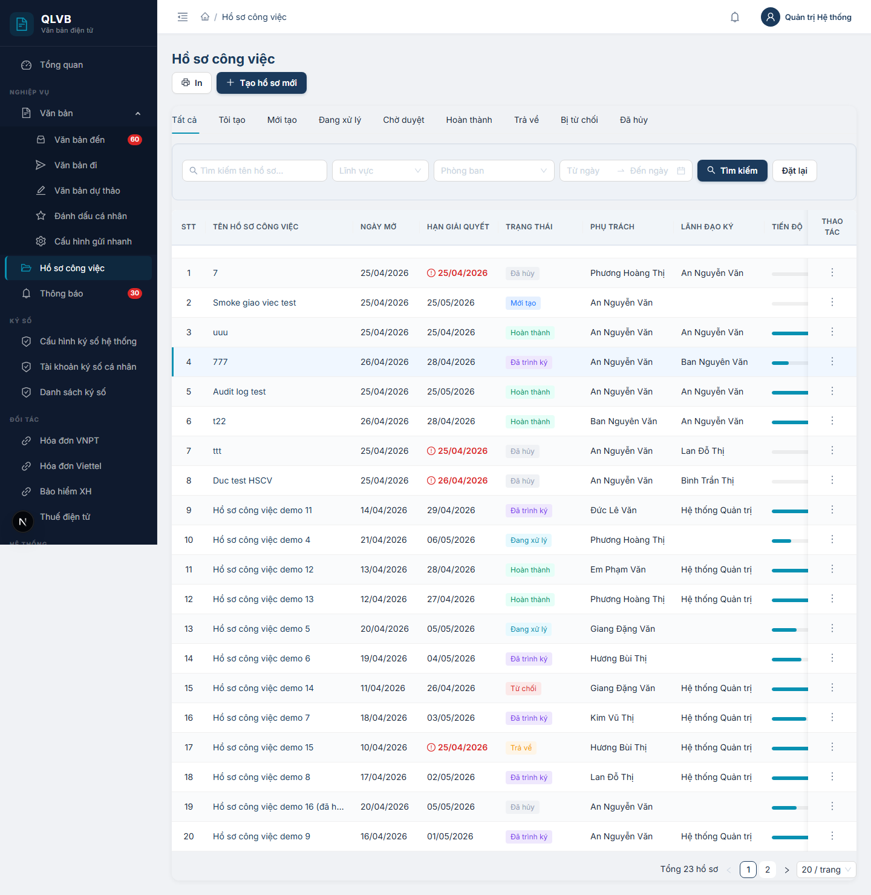

Màn hình chia thành các phần từ trên xuống:

- **Phần đầu trang**: Tiêu đề "Hồ sơ công việc" ở bên trái. Bên phải có 2 nút công cụ: **In** và **Tạo hồ sơ mới** (nút chính, màu xanh).
- **Hàng tab phân loại**: 9 tab phân loại HSCV theo trạng thái và phạm vi tạo, mỗi tab có **Badge** đếm số lượng hồ sơ tương ứng.
- **Hàng bộ lọc phụ**: Ô tìm kiếm theo tên hồ sơ, ô chọn Lĩnh vực, ô chọn Đơn vị / Phòng ban (tùy quyền), khoảng ngày, nút **Tìm kiếm** và **Đặt lại**.
- **Bảng dữ liệu**: Danh sách HSCV với 9 cột (xem mục 5). Bấm vào cột **Tên hồ sơ công việc** để mở Chi tiết. Cột thao tác cuối cùng là nút **ba chấm dọc**.
- **Phần cuối bảng**: Phân trang — chuyển trang, đổi số dòng/trang, hiển thị "Tổng N hồ sơ".
- **Cửa sổ phụ (Drawer)**: **Tạo hồ sơ công việc** / **Chỉnh sửa hồ sơ công việc** mở từ bên phải khi bấm Tạo mới hoặc Sửa.

---

### 3. Tab phân loại HSCV

Hệ thống hiển thị 9 tab theo thứ tự bên dưới. Mỗi tab có Badge nhỏ cạnh tên — số trên Badge là số HSCV đếm được trên toàn phạm vi quyền của người dùng (không phụ thuộc bộ lọc đang chọn).

| Tab | Phạm vi |
|---|---|
| **Tất cả** | Toàn bộ HSCV người dùng được phép xem. |
| **Tôi tạo** | HSCV do chính tài khoản đang đăng nhập tạo ra. |
| **Mới tạo** | HSCV đang ở trạng thái **Mới tạo** (status = 0). |
| **Đang xử lý** | HSCV đang ở trạng thái **Đang xử lý** (status = 1). |
| **Chờ duyệt** | HSCV đã trình ký, đang chờ lãnh đạo duyệt (status = 3). |
| **Hoàn thành** | HSCV đã được duyệt, kết thúc (status = 4). |
| **Trả về** | HSCV bị lãnh đạo trả về để bổ sung (status = -2). |
| **Bị từ chối** | HSCV bị lãnh đạo từ chối (status = -1). |
| **Đã hủy** | HSCV đã bị hủy bỏ (status = -3). |

> Bấm chuyển sang một tab — bảng tự chuyển về **trang 1** và tải lại danh sách. Badge của tab có thể tiếp tục cập nhật theo thời gian khi thao tác trong toàn hệ thống.

---

### 4. Bộ lọc phụ và thanh công cụ

#### 4.1. Hàng bộ lọc phụ (phía dưới các tab)

| Bộ lọc | Mô tả |
|---|---|
| **Tìm kiếm tên hồ sơ...** | Ô gõ từ khóa tìm theo **tên HSCV**. Bấm Enter hoặc nút **Tìm kiếm** để thực hiện. Có nút xóa nhanh từ khóa. |
| **Lĩnh vực** | Chọn 1 lĩnh vực nghiệp vụ để lọc. Có nút xóa lựa chọn. |
| **Phòng ban** *(chỉ Quản trị)* | TreeSelect dạng cây — chọn 1 phòng ban / đơn vị để xem HSCV trực thuộc. |
| **Đơn vị** *(người dùng thường)* | Select danh sách đơn vị — chọn để khoanh vùng dữ liệu. |
| **Khoảng ngày** (Từ ngày — Đến ngày) | Lọc theo ngày tạo HSCV (`DD/MM/YYYY`). |
| **Tìm kiếm** (nút màu xanh) | Áp dụng các bộ lọc đang chọn, đưa danh sách về trang 1. |
| **Đặt lại** | Xóa toàn bộ Từ khóa / Lĩnh vực / Đơn vị / Khoảng ngày, đưa về trang 1. |

> Khi đổi Lĩnh vực, Đơn vị / Phòng ban hoặc Khoảng ngày, danh sách tự chuyển về trang 1 ngay; với ô **Tìm kiếm tên hồ sơ**, người dùng phải bấm Enter hoặc nút **Tìm kiếm** để áp dụng.

#### 4.2. Thanh nút công cụ (góc trên bên phải)

| Nút | Khi nào hiển thị | Tác dụng |
|---|---|---|
| **In** | Luôn hiển thị | Mở hộp thoại in của trình duyệt với danh sách HSCV hiện tại — gồm tiêu đề "DANH SÁCH HỒ SƠ CÔNG VIỆC", ngày in, bảng các cột STT / Tên hồ sơ / Ngày bắt đầu / Hạn hoàn thành / Người phụ trách / Tiến độ / Trạng thái và dòng tổng cuối trang. |
| **Tạo hồ sơ mới** (chính, xanh dương) | Luôn hiển thị | Mở Drawer **Tạo hồ sơ công việc** — nhập thông tin HSCV mới (xem mục 7). |

> **Lưu ý**: Tại phiên bản hiện tại, màn hình danh sách Hồ sơ công việc **chỉ có nút "In"**, **không có nút "Xuất Excel"**. Khi cần đưa danh sách ra file rời, người dùng có thể chọn **In > Lưu thành PDF** từ chính hộp thoại in của trình duyệt. Nếu nghiệp vụ thực sự cần file Excel để tổng hợp / báo cáo, đề nghị phản hồi để bổ sung ở phiên bản sau.

---

### 5. Các cột trong Bảng danh sách

| Tên cột | Mô tả |
|---|---|
| **STT** | Số thứ tự dòng theo trang hiện tại — tính bằng `(trang − 1) × số dòng/trang + thứ tự dòng`. |
| **Tên hồ sơ công việc** | Tên HSCV — in màu xanh navy đậm, bấm vào để mở **Chi tiết HSCV**. |
| **Ngày mở** | Ngày bắt đầu của HSCV (định dạng `DD/MM/YYYY`). Trống — hiển thị dấu gạch ngang `—`. |
| **Hạn giải quyết** | Hạn hoàn thành HSCV. Nếu **đã quá hạn so với hôm nay** *và* HSCV chưa ở trạng thái Hoàn thành — hiển thị **chữ đỏ in đậm** kèm biểu tượng cảnh báo. Trống — hiển thị `—`. |
| **Trạng thái** | Nhãn màu thể hiện trạng thái hiện tại của HSCV (xem mục 6). |
| **Phụ trách** | Họ tên cán bộ được chọn làm người phụ trách chính. Tên dài bị cắt ngắn và có tooltip khi rê chuột. |
| **Lãnh đạo ký** | Họ tên lãnh đạo sẽ ký duyệt HSCV. Tên dài bị cắt ngắn và có tooltip. |
| **Tiến độ** | Thanh phần trăm hoàn thành (0–100%) màu xanh teal. |
| (cột thao tác) | Nút **ba chấm dọc** ở cột cuối, mở menu các lệnh tùy theo trạng thái HSCV (xem mục 7). |

---

### 6. Các trạng thái HSCV hiển thị trong Bảng

Cột **Trạng thái** hiển thị nhãn màu tương ứng với trạng thái đang lưu trong hệ thống. Ý nghĩa và sơ đồ vòng đời chi tiết xem trong **`HSCV_chi_tiet_chuc_nang.md` mục 3**.

| Nhãn hiển thị | Ý nghĩa ngắn |
|---|---|
| **Mới tạo** (xanh dương) | HSCV vừa lập, chưa bắt đầu xử lý. |
| **Đang xử lý** (xanh ngọc) | Cán bộ phụ trách đã bắt đầu làm việc. |
| **Chờ trình ký** (cam) | Đã xong giai đoạn xử lý, chờ gửi trình ký. |
| **Đã trình ký** (tím) | Đã gửi lãnh đạo, chờ duyệt. |
| **Hoàn thành** (xanh lá) | Lãnh đạo đã duyệt — HSCV kết thúc. |
| **Từ chối** (đỏ) | Lãnh đạo không đồng ý duyệt. |
| **Trả về** (vàng) | Lãnh đạo trả về để bổ sung. |
| **Đã hủy** (xám) | HSCV bị hủy — không thao tác tiếp. |

> Nếu hệ thống nhận về một mã trạng thái không nằm trong danh mục trên, cột Trạng thái hiển thị nhãn xám **"Không xác định"**.

---

### 7. Các nút thao tác trên dòng (menu ba chấm dọc)

Khi bấm vào nút **ba chấm dọc** ở cột cuối của một dòng, hệ thống mở menu thao tác. **Menu hiển thị khác nhau tùy trạng thái HSCV**:

#### 7.1. HSCV ở trạng thái **Mới tạo** (status = 0)

| Mục | Tác dụng |
|---|---|
| **Xem chi tiết** | Mở màn Chi tiết HSCV. |
| **Sửa** | Mở Drawer **Chỉnh sửa hồ sơ công việc** — sửa các trường hiện có (xem mục 8). |
| (đường kẻ ngăn) | |
| **Xóa** (màu đỏ) | Mở hộp xác nhận xóa — sau khi xác nhận, hệ thống xóa HSCV. |

#### 7.2. HSCV ở các trạng thái còn lại (Đang xử lý / Chờ trình ký / Đã trình ký / Hoàn thành / Trả về / Bị từ chối / Đã hủy)

| Mục | Tác dụng |
|---|---|
| **Xem chi tiết** | Mở màn Chi tiết HSCV để thực hiện các thao tác chuyên sâu (chuyển xử lý, trình ký, duyệt, tạm dừng, mở lại, hủy, ký số file...). |

> **Quy tắc**: Sửa và Xóa chỉ cho phép khi HSCV ở trạng thái **Mới tạo**. Sau khi đã chuyển xử lý, các thao tác sửa thông tin chính của HSCV phải thực hiện qua màn Chi tiết với các nút chuyên biệt.

---

### 8. Các trường nhập liệu trong Drawer Tạo / Chỉnh sửa HSCV

*[Hình minh họa: Drawer Tạo hồ sơ công việc]*

Khi bấm **Tạo hồ sơ mới** hoặc **Sửa** từ menu, hệ thống mở Drawer rộng 720px ở bên phải. Tiêu đề là *"Tạo hồ sơ công việc"* hoặc *"Chỉnh sửa hồ sơ công việc"*. Nút **Hủy** và **Lưu hồ sơ** ở góc trên bên phải Drawer.

| Tên trường | Bắt buộc | Mô tả & ràng buộc |
|---|---|---|
| **Tên hồ sơ công việc** | Có | Tối đa 500 ký tự, có hiển thị bộ đếm. Để trống — báo *"Vui lòng nhập tên hồ sơ công việc"*. |
| **Loại văn bản** | Không | Chọn từ danh sách Loại văn bản (Công văn, Quyết định, Báo cáo...). Có ô tìm kiếm trong danh sách. |
| **Lĩnh vực** | Không | Chọn từ danh sách Lĩnh vực nghiệp vụ. Có ô tìm kiếm trong danh sách. |
| **Ngày mở** | Có | Định dạng `DD/MM/YYYY`. Để trống — báo *"Vui lòng chọn ngày mở hồ sơ"*. |
| **Hạn giải quyết** | Có | Định dạng `DD/MM/YYYY`. Để trống — báo *"Vui lòng chọn hạn giải quyết"*. **Phải bằng hoặc sau Ngày mở** — nếu trước Ngày mở, báo *"Hạn giải quyết phải sau hoặc bằng ngày mở hồ sơ"*. |
| **Người phụ trách** | Có | Chọn 1 cán bộ — danh sách lấy từ toàn bộ nhân viên cùng đơn vị. Có ô tìm kiếm. Để trống — báo *"Vui lòng chọn người phụ trách"*. |
| **Lãnh đạo ký** | Có | Chọn 1 lãnh đạo — danh sách lấy từ những người được đăng ký làm "Người ký" cho đơn vị. Có ô tìm kiếm. Để trống — báo *"Vui lòng chọn lãnh đạo ký"*. Khi đơn vị **chưa có lãnh đạo nào được đăng ký**, hệ thống hiển thị *"Đơn vị chưa có lãnh đạo"* trong dropdown. |
| **Quy trình** | Không | Chọn quy trình xử lý áp dụng (nếu có). Có nút xóa lựa chọn. |
| **Hồ sơ cha** | Không | Chọn HSCV cha nếu đây là HSCV con của một hồ sơ lớn hơn. Có ô tìm kiếm theo tên HSCV. |
| **Ghi chú** | Không | Vùng văn bản nhiều dòng, tối đa 2000 ký tự, có bộ đếm. |

> Sau khi nhập xong, bấm **Lưu hồ sơ**:
>
> - Tạo mới — hệ thống báo *"Tạo hồ sơ thành công"*.
> - Chỉnh sửa — hệ thống báo *"Lưu hồ sơ thành công"*.
> - Lỗi không cụ thể — báo *"Lưu hồ sơ thất bại. Vui lòng kiểm tra lại thông tin và thử lại."*

---

### 9. Quy trình thao tác chính

#### 9.1. Tạo một HSCV mới

1. Bấm **Tạo hồ sơ mới** ở góc trên bên phải.
2. Trong Drawer:
   - Nhập **Tên hồ sơ công việc** (bắt buộc).
   - Chọn **Ngày mở** + **Hạn giải quyết** (bắt buộc, hạn ≥ ngày mở).
   - Chọn **Người phụ trách** + **Lãnh đạo ký** (bắt buộc).
   - Tùy chọn: Loại văn bản, Lĩnh vực, Quy trình, Hồ sơ cha, Ghi chú.
3. Bấm **Lưu hồ sơ** — hệ thống báo *"Tạo hồ sơ thành công"*, đóng Drawer và làm mới danh sách.
4. HSCV mới xuất hiện trong tab **Tất cả** và **Mới tạo**, trạng thái **Mới tạo** — sẵn sàng cho bước **Chuyển xử lý** ở màn Chi tiết.

#### 9.2. Lọc và tìm kiếm HSCV

1. Bấm tab phân loại phù hợp (VD: **Đang xử lý**) để khoanh vùng theo trạng thái — Badge cạnh tên tab cho biết số lượng hiện có.
2. (Tùy chọn) Trên hàng bộ lọc phụ:
   - Gõ một phần **Tên hồ sơ** vào ô tìm kiếm.
   - Chọn **Lĩnh vực** nếu cần.
   - Chọn **Đơn vị** (người dùng thường) hoặc **Phòng ban** (Quản trị) — chỉ hiển thị HSCV thuộc đơn vị / phòng ban đó.
   - Chọn **Khoảng ngày** (Từ ngày — Đến ngày) để giới hạn theo thời điểm tạo HSCV.
3. Bấm **Tìm kiếm** (hoặc nhấn Enter trong ô tên hồ sơ) — bảng tải lại từ trang 1.
4. Khi cần xóa toàn bộ điều kiện đã đặt — bấm **Đặt lại** để khôi phục danh sách đầy đủ.

#### 9.3. Sửa hoặc Xóa HSCV vừa tạo

Chỉ thực hiện được khi HSCV đang ở trạng thái **Mới tạo**.

1. Trên dòng tương ứng, bấm nút **ba chấm dọc**.
2. Chọn **Sửa** — Drawer Chỉnh sửa mở ra với dữ liệu hiện có. Sửa và bấm **Lưu hồ sơ** — hệ thống báo *"Lưu hồ sơ thành công"*.
3. Chọn **Xóa** (mục đỏ cuối menu) — Hộp xác nhận màu vàng cảnh báo *"Bạn có chắc muốn xóa hồ sơ này? Hành động này không thể hoàn tác."*. Bấm **Xóa** — hệ thống báo *"Đã xóa hồ sơ"*.

#### 9.4. Mở chi tiết HSCV để thao tác chuyên sâu

- Bấm vào **tên HSCV** ở cột "Tên hồ sơ công việc" (chữ xanh navy đậm), HOẶC
- Bấm **ba chấm dọc** ở cột cuối → chọn **Xem chi tiết**.

Toàn bộ thao tác Chuyển xử lý / Trình ký / Duyệt / Trả về / Từ chối / Tạm dừng / Mở lại / Hủy / Lấy số / Cập nhật tiến độ / Phân công cán bộ / Liên kết văn bản / Chuyển tiếp HSCV / Ký số file đính kèm / HSCV con đều thực hiện ở **màn Chi tiết** — tham khảo `HSCV_chi_tiet_chuc_nang.md`.

#### 9.5. In danh sách HSCV

1. Áp dụng các bộ lọc và tab phân loại để có đúng danh sách cần in.
2. Bấm nút **In** ở góc trên bên phải.
3. Trình duyệt mở hộp thoại in — danh sách sẵn sàng để in hoặc lưu thành PDF.

---

### 10. Lưu ý / Ràng buộc nghiệp vụ

#### 10.1. Sửa và Xóa chỉ áp dụng khi HSCV "Mới tạo"

Mục **Sửa** và **Xóa** trên menu ba chấm chỉ hiển thị khi HSCV đang ở trạng thái **Mới tạo** (status = 0). Sau khi đã chuyển xử lý, các thay đổi phải đi qua màn Chi tiết bằng các nút **Chuyển tiếp HSCV**, **Cập nhật tiến độ**, **Tạm dừng**, **Hủy HSCV**... Tham khảo `HSCV_chi_tiet_chuc_nang.md` mục 5 và 6.

#### 10.2. Phạm vi quyền xem dữ liệu

- **Người dùng thường**: chỉ thấy HSCV thuộc đơn vị mình + các phòng ban con. Ô lọc đơn vị là **Select** danh sách phẳng các đơn vị trong phạm vi quyền.
- **Quản trị**: thấy toàn bộ HSCV của hệ thống. Ô lọc trở thành **TreeSelect** dạng cây phân cấp đầy đủ.

Khi cố gắng truy cập một HSCV không thuộc phạm vi quyền (vd: gõ trực tiếp ID vào URL), hệ thống chặn với thông báo *"Không có quyền truy cập hồ sơ này"*.

#### 10.3. Hạn giải quyết phải ≥ Ngày mở

Trên Drawer Tạo/Sửa, nếu **Hạn giải quyết** trước **Ngày mở**, ô báo lỗi inline ngay: *"Hạn giải quyết phải sau hoặc bằng ngày mở hồ sơ"*. Hệ thống không cho phép lưu cho tới khi sửa lại.

#### 10.4. Cảnh báo Quá hạn trên cột "Hạn giải quyết"

Trên bảng danh sách, dòng nào có **Hạn giải quyết** đã trôi qua so với ngày hiện tại *và* HSCV chưa ở trạng thái **Hoàn thành** sẽ hiển thị:

- Ngày hạn **chữ đỏ in đậm**.
- Biểu tượng cảnh báo `(!)` đứng trước.

Đây là dấu hiệu để cán bộ phụ trách / lãnh đạo nhận biết và đôn đốc xử lý.

#### 10.5. Lãnh đạo ký phải đăng ký từ trước

Dropdown **Lãnh đạo ký** chỉ liệt kê những cán bộ đã được Quản trị đăng ký vào danh mục **Người ký** của đơn vị. Khi đơn vị chưa có ai trong danh mục này, dropdown trống và hiển thị *"Đơn vị chưa có lãnh đạo"*. Khi đó, đề nghị Quản trị bổ sung Người ký trong **Quản trị** trước khi tạo HSCV.

#### 10.6. Bảng tổng hợp các thông báo của hệ thống

| Tình huống | Thông báo |
|---|---|
| Tạo HSCV thành công | Tạo hồ sơ thành công |
| Lưu (sửa) HSCV thành công | Lưu hồ sơ thành công |
| Lưu HSCV thất bại (lỗi không cụ thể) | Lưu hồ sơ thất bại. Vui lòng kiểm tra lại thông tin và thử lại. |
| Xóa HSCV thành công | Đã xóa hồ sơ |
| Lỗi xóa HSCV | Lỗi xóa hồ sơ |
| Lỗi tải danh sách | Lỗi tải danh sách hồ sơ công việc |
| Để trống Tên hồ sơ | Vui lòng nhập tên hồ sơ công việc |
| Để trống Ngày mở | Vui lòng chọn ngày mở hồ sơ |
| Để trống Hạn giải quyết | Vui lòng chọn hạn giải quyết |
| Hạn giải quyết trước Ngày mở | Hạn giải quyết phải sau hoặc bằng ngày mở hồ sơ |
| Để trống Người phụ trách | Vui lòng chọn người phụ trách |
| Để trống Lãnh đạo ký | Vui lòng chọn lãnh đạo ký |
| Đơn vị không có lãnh đạo trong dropdown | Đơn vị chưa có lãnh đạo |
| Bảng trống — không có hồ sơ nào | Chưa có hồ sơ công việc — Nhấn "Tạo hồ sơ mới" để bắt đầu quản lý công việc của bạn. |
| Bảng trống khi đang lọc | Không tìm thấy hồ sơ phù hợp. Thử thay đổi bộ lọc hoặc từ khóa tìm kiếm. |
| Truy cập HSCV ngoài quyền | Không có quyền truy cập hồ sơ này |
| Hộp xác nhận xóa | Bạn có chắc muốn xóa hồ sơ này? Hành động này không thể hoàn tác. |

---

*Tài liệu được biên soạn dựa trên hệ thống thực tế đang triển khai. Mọi thắc mắc vui lòng liên hệ với đội phát triển để được hỗ trợ.*


\newpage

## Hướng dẫn sử dụng: Màn hình Chi tiết Hồ sơ công việc

Tài liệu này mô tả đầy đủ các chức năng có trong màn hình **Chi tiết Hồ sơ công việc (HSCV)** của hệ thống Quản lý văn bản điện tử (e-Office), giúp người dùng hiểu rõ cách sử dụng và quy trình nghiệp vụ.

---

### 1. Giới thiệu

**Hồ sơ công việc (HSCV)** là một "tập hồ sơ điện tử" dùng để quản lý toàn bộ công việc liên quan đến một vụ việc cụ thể. Một HSCV có thể gắn nhiều văn bản liên quan, phân công cho nhiều cán bộ cùng phối hợp xử lý, đính kèm tài liệu, trao đổi ý kiến và có cả HSCV con (trường hợp công việc lớn cần chia nhỏ).

Màn hình chi tiết HSCV là nơi người dùng theo dõi và thực hiện mọi thao tác trong vòng đời của một hồ sơ — từ khi mới tạo cho đến khi hoàn thành hoặc bị hủy.

---

### 2. Bố cục màn hình

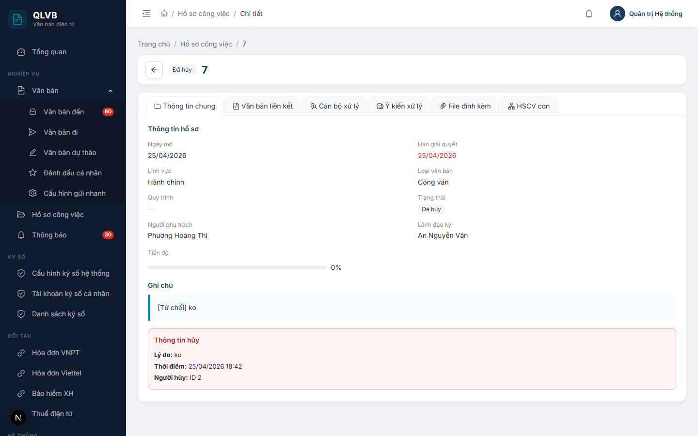

Màn hình chi tiết HSCV gồm 3 phần chính:

- **Phần đầu trang**: Hiển thị nút **Quay lại** (mũi tên trái), **nhãn trạng thái** hiện tại của hồ sơ, **tên HSCV**, **số văn bản** đã lấy (nếu có — dạng nhãn xanh "Số: [số] / [tên sổ]") và **thanh công cụ** chứa các nút hành động.
- **Phần giữa — các Tab**: 6 tab chứa đầy đủ thông tin và thao tác của hồ sơ.
- **Các cửa sổ phụ (Modal/Drawer)**: Mở ra khi người dùng bấm các nút tương ứng để nhập thông tin thao tác.

---

### 3. Trạng thái của Hồ sơ công việc

Mỗi HSCV tại một thời điểm sẽ ở một trong các trạng thái sau:

| Trạng thái | Ý nghĩa |
|---|---|
| **Mới tạo** | HSCV vừa được lập, chưa bắt đầu xử lý |
| **Đang xử lý** | Cán bộ phụ trách đã bắt đầu làm việc với hồ sơ |
| **Đã trình ký** | Hồ sơ đã được gửi lên lãnh đạo để xem xét |
| **Hoàn thành** | Lãnh đạo đã duyệt, hồ sơ kết thúc |
| **Từ chối** | Lãnh đạo không đồng ý duyệt |
| **Trả về** | Lãnh đạo trả lại để bổ sung, chỉnh sửa |
| **Đã hủy** | HSCV không còn giá trị, đã bị hủy bỏ |

Thanh công cụ (các nút hành động) sẽ **hiển thị khác nhau tùy theo trạng thái** — chỉ các nút phù hợp với trạng thái hiện tại mới được hiện ra, giúp người dùng không thao tác sai quy trình.

> **Lưu ý**: Trong các phiên bản trước hệ thống có thêm trạng thái **"Chờ trình ký"** (đặt giữa "Đang xử lý" và "Đã trình ký"). Phiên bản hiện tại đã gộp thao tác trình ký thành một bước duy nhất — bấm **"Trình ký"** ở trạng thái "Đang xử lý" sẽ chuyển trực tiếp sang **"Đã trình ký"**.

---

### 4. Các Tab trong chi tiết HSCV

#### 4.1. Tab "Thông tin chung"

*[Hình minh họa: Tab Thông tin chung]*

Hiển thị toàn bộ thông tin cơ bản của hồ sơ công việc:

- **Ngày mở**: Thời điểm hồ sơ bắt đầu
- **Hạn giải quyết**: Thời hạn phải hoàn thành (chữ đỏ nếu đã quá hạn)
- **Lĩnh vực**: Lĩnh vực nghiệp vụ của hồ sơ
- **Loại văn bản**: Loại hồ sơ/văn bản chính
- **Quy trình**: Quy trình xử lý áp dụng
- **Trạng thái hiện tại**
- **Người phụ trách**: Cán bộ chính chịu trách nhiệm
- **Lãnh đạo ký**: Lãnh đạo sẽ xem xét phê duyệt
- **Tiến độ**: Thanh hiển thị phần trăm hoàn thành (0–100%)
- **Ghi chú**: Nội dung ghi chú thêm (nếu có)
- **Thông tin hủy** (chỉ hiện khi hồ sơ đã hủy): lý do hủy, thời điểm hủy, người hủy — hiển thị trong khung viền đỏ nhạt
- **Liên kết đến HSCV cha** (nếu hồ sơ này là hồ sơ con) — bấm vào tên HSCV cha để chuyển sang xem

#### 4.2. Tab "Văn bản liên kết"

Quản lý tất cả văn bản liên quan đến HSCV (văn bản đến, văn bản đi, dự thảo).

**Thao tác**:
- **Thêm văn bản**: Mở cửa sổ tìm kiếm có 3 tab — **Văn bản đến**, **Văn bản đi**, **Dự thảo**. Nhập từ khóa (số văn bản hoặc trích yếu), bấm **"Tìm kiếm"**, tích chọn nhiều văn bản và bấm **"Liên kết"**.
- **Gỡ liên kết**: Mỗi văn bản đều có nút **"Gỡ liên kết"** (chữ đỏ) ở cột thao tác, có hộp xác nhận trước khi thực hiện.

**Thông tin hiển thị mỗi văn bản**: Số VB, trích yếu, loại văn bản (nhãn xanh), ngày ký.

Tab này hiển thị **số lượng văn bản đã liên kết** (huy hiệu màu xanh teal cạnh tiêu đề tab).

#### 4.3. Tab "Cán bộ xử lý"

*[Hình minh họa: Tab Cán bộ xử lý — bố cục 3 cột]*

Quản lý danh sách cán bộ tham gia xử lý HSCV.

**Giao diện 3 cột**:
1. **Cột trái**: Cây đơn vị — chọn đơn vị để xem danh sách nhân viên, tích chọn nhiều nhân viên cùng lúc
2. **Cột giữa**: Nút **"Thêm >>"** để chuyển nhân viên đã chọn sang danh sách phân công
3. **Cột phải**: Danh sách cán bộ đã được phân công (hiển thị tổng số cán bộ ở tiêu đề), mỗi người có:
   - **Vai trò**: **Phụ trách** (chữ xanh lá) hoặc **Phối hợp** (chữ xanh teal) — chọn bằng nút radio
   - **Hạn xử lý**: Ngày phải hoàn thành (chọn từ lịch)
   - **Xóa**: Biểu tượng thùng rác đỏ — bỏ cán bộ khỏi danh sách

Sau khi điều chỉnh xong, bấm **"Lưu phân công"** (góc dưới bên phải) để ghi nhận thay đổi.

#### 4.4. Tab "Ý kiến xử lý"

Nơi các cán bộ tham gia HSCV trao đổi, ghi ý kiến trong quá trình xử lý.

**Thao tác**:
- **Gửi ý kiến mới**: Nhập nội dung vào ô **"Nhập ý kiến xử lý..."** ở cuối tab (tối đa 2000 ký tự, có đếm ký tự) và bấm **"Gửi ý kiến"**.
- **Chuyển tiếp ý kiến**: Mỗi ý kiến có nút **"Chuyển tiếp"** (chữ xanh, biểu tượng máy bay giấy). Bấm sẽ mở cửa sổ:
  - **Người nhận** (bắt buộc): chọn từ danh sách nhân viên cùng đơn vị
  - **Nội dung chuyển tiếp** (bắt buộc, tối đa 1000 ký tự)
  - Bấm **"Gửi"** để chuyển tiếp.
- Các ý kiến chuyển tiếp sẽ được hiển thị **thụt lề vào trong** với viền trái xám, kèm dòng nhỏ *"Chuyển tiếp cho [Tên người nhận]"* để dễ nhận biết.

**Thông tin mỗi ý kiến**: Ảnh đại diện (chữ cái đầu của tên), tên người gửi, thời gian (DD/MM/YYYY HH:mm), nội dung.

#### 4.5. Tab "File đính kèm"

*[Hình minh họa: Tab File đính kèm — vùng kéo thả]*

Quản lý các tài liệu, file đính kèm của HSCV.

**Thao tác**:
- **Tải lên file**: Vùng "Kéo thả file vào đây hoặc nhấn để chọn file" — kéo thả file hoặc bấm để chọn. Hỗ trợ các định dạng: **PDF, Word (doc, docx), Excel (xls, xlsx), ảnh (png, jpg, jpeg)**. Dung lượng tối đa **50 MB** mỗi file.
- **Tải xuống**: Bấm nút **"Tải xuống"** (biểu tượng mũi tên xuống) ở mỗi file
- **Ký số**: Hiển thị nút **"Ký số"** (xanh lá, biểu tượng khiên) khi đủ các điều kiện sau:
  - Người đang đăng nhập đúng là **lãnh đạo ký** của HSCV
  - HSCV đang ở trạng thái **"Chờ trình ký"** (cũ) hoặc **"Đã trình ký"**
  - File là định dạng **PDF**
  - File **chưa được ký số** trước đó
- **Xóa file**: Có hộp xác nhận trước khi xóa

**Thông tin mỗi file**: Biểu tượng theo định dạng (PDF đỏ, Word xanh dương, Excel xanh lá, ảnh cam), tên file, kích cỡ, thời gian tải lên, người tải lên. File đã ký số sẽ có nhãn **"Đã ký số"** màu xanh kèm dấu tích.

#### 4.6. Tab "HSCV con"

Quản lý các hồ sơ công việc con — dùng khi công việc lớn cần chia nhỏ.

**Thao tác**:
- **Tạo HSCV con**: Bấm nút **"Tạo HSCV con"** (góc trên bên phải) mở cửa sổ nhập:
  - **Hồ sơ cha** (đã điền sẵn, không sửa được)
  - **Tên hồ sơ con** (bắt buộc, tối đa 500 ký tự)
  - **Ngày mở** (bắt buộc)
  - **Hạn giải quyết** (bắt buộc)
  - **Người phụ trách**, **Lãnh đạo ký** (chọn từ danh sách)
  - **Ghi chú** (tối đa 2000 ký tự)
- **Xem chi tiết**: Bấm vào tên HSCV con (chữ xanh navy) để mở màn hình chi tiết của nó

**Thông tin mỗi HSCV con**: Tên, ngày mở, hạn giải quyết (chữ đỏ + biểu tượng cảnh báo nếu quá hạn), trạng thái (nhãn màu), tiến độ (thanh tiến độ).

---

### 5. Các nút hành động theo từng trạng thái

*[Hình minh họa: Thanh công cụ ở các trạng thái khác nhau]*

Dưới đây là các nút hành động sẽ hiển thị trên thanh công cụ — **tùy thuộc vào trạng thái hiện tại** của HSCV.

#### 5.1. Khi HSCV ở trạng thái **"Mới tạo"**

| Nút | Chức năng |
|---|---|
| **Chuyển xử lý** | Bắt đầu xử lý hồ sơ. Trạng thái chuyển từ "Mới tạo" → "Đang xử lý" |
| **Sửa** | Mở cửa sổ chỉnh sửa thông tin HSCV (tên, ngày mở, hạn, lĩnh vực, loại văn bản, người phụ trách, lãnh đạo ký, ghi chú) |
| **Chuyển tiếp HSCV** | Bàn giao cả hồ sơ cho cán bộ khác (xem mục 6.2) |
| **Lịch sử** | Xem toàn bộ lịch sử thao tác trên HSCV |
| **Xóa** | Xóa hẳn HSCV (chỉ cho phép khi mới tạo) |

#### 5.2. Khi HSCV ở trạng thái **"Đang xử lý"**

| Nút | Chức năng |
|---|---|
| **Trình ký** | Đẩy hồ sơ trực tiếp sang trạng thái **"Đã trình ký"** để lãnh đạo xem xét |
| **Cập nhật tiến độ** | Mở cửa sổ điều chỉnh phần trăm hoàn thành (0–100%) |
| **Lấy số** | Lấy số văn bản theo sổ (chỉ hiện nếu HSCV chưa lấy số) |
| **Chuyển tiếp HSCV** | Bàn giao cho cán bộ khác |
| **Lịch sử** | Xem lịch sử thao tác |

#### 5.3. Khi HSCV ở trạng thái **"Đã trình ký"**

| Nút | Chức năng |
|---|---|
| **Duyệt hồ sơ** | Lãnh đạo đồng ý — chuyển sang **"Hoàn thành"** (nút xanh lá) |
| **Từ chối** | Lãnh đạo không đồng ý — kèm lý do từ chối (nút đỏ) |
| **Trả về** | Trả lại để bổ sung — kèm lý do trả về |
| **Lấy số** | Lấy số văn bản (nếu chưa lấy số) |
| **Chuyển tiếp HSCV** | Bàn giao cho cán bộ khác |
| **Lịch sử** | Xem lịch sử thao tác |

#### 5.4. Khi HSCV ở trạng thái **"Hoàn thành"**

| Nút | Chức năng |
|---|---|
| **Mở lại** | Trường hợp cần chỉnh sửa sau khi đã hoàn thành — chuyển về **"Đang xử lý"**, giữ nguyên tiến độ 100% |
| **Xem lịch sử** | Xem lại toàn bộ quá trình xử lý |

#### 5.5. Khi HSCV bị **"Từ chối"** hoặc **"Trả về"**

| Nút | Chức năng |
|---|---|
| **Xử lý lại** | Chuyển về **"Đang xử lý"** để bổ sung, chỉnh sửa |
| **Hủy HSCV** | Hủy bỏ hồ sơ — kèm lý do hủy (chuyển sang trạng thái **"Đã hủy"**) |

> **Lưu ý**: Khi HSCV ở trạng thái **"Đã hủy"**, hệ thống không hiển thị nút thao tác nào — hồ sơ chỉ ở chế độ xem.

---

### 6. Các thao tác quan trọng — Giải thích chi tiết

#### 6.1. Chuyển xử lý

**Mục đích**: Đánh dấu "Tôi bắt đầu làm việc với hồ sơ này".

Khi HSCV vừa được tạo, trạng thái mặc định là **"Mới tạo"**. Khi cán bộ phụ trách chính thức bắt đầu xử lý, bấm nút **"Chuyển xử lý"** để chuyển trạng thái sang **"Đang xử lý"**.

Chức năng này giúp lãnh đạo nhìn vào danh sách biết được hồ sơ nào chưa ai bắt đầu xử lý, hồ sơ nào đang được thực hiện — phục vụ theo dõi tiến độ và đôn đốc khi cần.

#### 6.2. Chuyển tiếp HSCV

*[Hình minh họa: Cửa sổ Chuyển tiếp HSCV]*

**Mục đích**: Bàn giao toàn bộ hồ sơ sang cán bộ khác (đi công tác, nghỉ phép, chuyển công tác, hoặc công việc không thuộc phạm vi phụ trách).

**Cách dùng**:
1. Bấm nút **"Chuyển tiếp HSCV"** trên thanh công cụ.
2. Cửa sổ mở ra với dòng nhắc *"Chỉ có thể chuyển HSCV cho người cùng đơn vị"* (khung xanh nhạt).
3. Chọn **Người nhận** (bắt buộc) — danh sách nhân viên cùng đơn vị, có ô tìm kiếm.
4. Nhập **Ghi chú** (tùy chọn, tối đa 500 ký tự) — giải thích lý do bàn giao.
5. Bấm **"Chuyển tiếp"**.

**Sau khi chuyển tiếp**:
- Người mới trở thành **người phụ trách chính** của HSCV
- Mọi thao tác (cập nhật, thêm ý kiến, gắn văn bản...) đều chuyển sang người mới
- **Lịch sử chuyển tiếp được ghi lại đầy đủ** — có thể xem ở nút **"Lịch sử"**

**Ràng buộc**: Chỉ được chuyển trong cùng đơn vị, không chuyển cho chính mình.

#### 6.3. Lấy số văn bản

**Mục đích**: Cấp số văn bản chính thức theo sổ đăng ký của đơn vị.

**Cách dùng**:
- **Trường hợp HSCV chưa có sổ văn bản**: Bấm **"Lấy số"** → mở cửa sổ **"Chọn sổ văn bản để lấy số"** → chọn sổ từ danh sách (có ô tìm kiếm theo mã hoặc tên sổ) → bấm **"Lấy số"**.
- **Trường hợp HSCV đã chọn sổ trước đó**: Bấm **"Lấy số"** → hiện hộp xác nhận *"Sẽ cấp số kế tiếp theo sổ [tên sổ]. Bạn xác nhận?"* → bấm **"Lấy số"**.

Hệ thống tự động cấp số theo công thức **MAX(số) + 1 trong cùng sổ và năm tạo HSCV**.

Sau khi lấy số thành công, phần đầu trang sẽ hiển thị nhãn xanh **"Số: [số] / [tên sổ]"**.

Nút **"Lấy số"** chỉ hiển thị ở trạng thái **"Đang xử lý"** hoặc **"Đã trình ký"**, và chỉ khi HSCV chưa được lấy số.

#### 6.4. Cập nhật tiến độ

**Mục đích**: Cập nhật phần trăm hoàn thành của hồ sơ (0–100%) để lãnh đạo theo dõi.

Nút này chỉ hiện khi HSCV đang ở trạng thái **"Đang xử lý"**. Người dùng điều chỉnh bằng **thanh trượt** hoặc **nhập số trực tiếp** (có hậu tố `%`), sau đó bấm **"Cập nhật"**.

#### 6.5. Trả về / Từ chối

*[Hình minh họa: Cửa sổ Trả về / Từ chối]*

**Khi lãnh đạo không đồng ý với hồ sơ** (ở trạng thái "Đã trình ký"):

- **Trả về**: Hồ sơ còn có thể sửa chữa, cán bộ xử lý lại và trình ký lại. Kèm **lý do trả về** (bắt buộc).
- **Từ chối**: Không đồng ý hoàn toàn. Kèm **lý do từ chối** (bắt buộc).

**Cách dùng**: Khi bấm **"Từ chối"** hoặc **"Trả về"**, hệ thống mở cửa sổ nhỏ với:
- Dòng hướng dẫn (*"Nhập lý do từ chối để thông báo cho người xử lý."* / *"Nhập lý do trả về để người xử lý biết cần chỉnh sửa gì."*)
- Ô nhập lý do (tối đa 500 ký tự, có đếm ký tự, tự động đặt con trỏ vào ô)
- Nút **"Từ chối"** / **"Trả về"** ở dưới — **bị mờ và không bấm được khi chưa nhập lý do** (đảm bảo bắt buộc nhập)
- Nút **"Hủy"** — đóng cửa sổ, không thực hiện

Khi đã nhập lý do, nút thao tác mới sáng lên và bấm được. Hệ thống ghi nhận lý do để cán bộ thấy và điều chỉnh.

#### 6.6. Hủy HSCV

**Mục đích**: Đóng HSCV khi không còn giá trị xử lý.

Chỉ áp dụng được khi HSCV đã bị **Từ chối** hoặc **Trả về**. Người dùng phải nhập **lý do hủy** (bắt buộc, tối đa 1000 ký tự).

**Cách dùng**:
1. Bấm **"Hủy HSCV"** (nút viền đỏ).
2. Cửa sổ "Hủy hồ sơ công việc" mở ra với ô nhập **"Lý do hủy HSCV"**.
3. Nhập lý do, bấm **"Xác nhận hủy"** (nút đỏ).

Sau khi hủy:
- Trạng thái chuyển sang **"Đã hủy"**
- Thông tin hủy (lý do, người hủy, thời điểm) được hiển thị trong khung viền đỏ nhạt ở tab **"Thông tin chung"**
- HSCV không thể thao tác tiếp

#### 6.7. Mở lại HSCV (sau khi đã hoàn thành)

Trường hợp hồ sơ đã **"Hoàn thành"** nhưng cần chỉnh sửa, bổ sung, người dùng có thể bấm **"Mở lại"** để đưa HSCV về trạng thái **"Đang xử lý"** (giữ nguyên tiến độ 100%).

Hệ thống hiển thị hộp xác nhận *"Trạng thái sẽ chuyển từ 'Hoàn thành' về 'Đang xử lý' (giữ nguyên tiến độ 100%). Bạn xác nhận?"* trước khi thực hiện.

#### 6.8. Ký số trên file đính kèm

Trong tab **"File đính kèm"**, lãnh đạo ký có thể thực hiện ký số trực tiếp trên file PDF đính kèm. Nút **"Ký số"** (xanh lá, biểu tượng khiên) chỉ xuất hiện khi:
- Người đăng nhập đúng là **lãnh đạo ký** của HSCV
- HSCV ở trạng thái **"Chờ trình ký"** (cũ) hoặc **"Đã trình ký"**
- File là định dạng **PDF**
- File chưa được ký số

Sau khi ký thành công, file được gắn nhãn **"Đã ký số"** màu xanh kèm dấu tích.

#### 6.9. Xem lịch sử HSCV

Bấm nút **"Lịch sử"** (hoặc **"Xem lịch sử"** ở trạng thái Hoàn thành) để mở cửa sổ **"Lịch sử hồ sơ công việc"** liệt kê toàn bộ thao tác đã thực hiện:

- **Tạo HSCV**, **Trình ký**, **Duyệt hồ sơ**, **Từ chối**, **Trả về bổ sung**, **Hoàn thành**
- **Lấy số văn bản**
- **Chuyển tiếp**: hiển thị "Tên người chuyển → Tên người nhận"
- **Hủy HSCV**, **Mở lại**
- **Đổi trạng thái** (các thao tác chuyển trạng thái khác)

Mỗi mục lịch sử hiển thị: loại thao tác (kèm biểu tượng), ghi chú (nếu có), thời gian (DD/MM/YYYY HH:mm) và người thực hiện.

Bấm **"Đóng"** để thoát cửa sổ.

Mọi thao tác đều được ghi lại đầy đủ, minh bạch — phục vụ công tác kiểm tra, thanh tra về sau.

---

### 7. Quy trình nghiệp vụ tham khảo

Vòng đời điển hình của một HSCV (phiên bản hiện tại):

```
Mới tạo
   │  (Cán bộ phụ trách bấm "Chuyển xử lý")
   ▼
Đang xử lý ◄────────────────┐
   │                        │
   │  (Bấm "Trình ký")      │  (Trả về / Xử lý lại)
   ▼                        │
Đã trình ký ────────────────┘
   │
   │  (Lãnh đạo bấm "Duyệt hồ sơ")
   ▼
Hoàn thành
```

Các trạng thái phụ **"Từ chối"**, **"Trả về"**, **"Đã hủy"** là các nhánh rẽ khi có tình huống đặc biệt:

- Lãnh đạo bấm **Từ chối** ở "Đã trình ký" → HSCV chuyển sang **"Từ chối"** → cán bộ có thể bấm **"Xử lý lại"** để quay về "Đang xử lý" hoặc **"Hủy HSCV"**.
- Lãnh đạo bấm **Trả về** ở "Đã trình ký" → HSCV chuyển sang **"Trả về"** → tương tự, cán bộ chọn **"Xử lý lại"** hoặc **"Hủy HSCV"**.
- Sau khi **"Hoàn thành"**, nếu cần thì bấm **"Mở lại"** để đưa HSCV về "Đang xử lý" (giữ tiến độ 100%).

---

*Tài liệu được biên soạn dựa trên hệ thống thực tế đang triển khai. Mọi thắc mắc vui lòng liên hệ với đội phát triển để được hỗ trợ.*


\newpage

## Hướng dẫn sử dụng: Màn hình Hồ sơ công việc > Báo cáo

Tài liệu này mô tả đầy đủ các chức năng có trong màn hình **Hồ sơ công việc > Báo cáo** của hệ thống Quản lý văn bản điện tử (e-Office), giúp người dùng hiểu rõ cách xem các chỉ số thống kê và xuất báo cáo về tình hình xử lý hồ sơ công việc.

---

### 1. Giới thiệu

Màn hình **Hồ sơ công việc > Báo cáo** dùng để **tổng hợp và đánh giá hiệu suất xử lý hồ sơ công việc** của đơn vị trong một khoảng thời gian. Người dùng có thể nhìn nhanh các chỉ số chính (tổng số hồ sơ, số đã hoàn thành, số đang thực hiện, tỷ lệ quá hạn) và xem chi tiết theo 3 góc nhìn:

- **Theo đơn vị / phòng ban**: mỗi phòng ban có bao nhiêu hồ sơ đang xử lý, hoàn thành, quá hạn.
- **Theo cán bộ giải quyết**: mỗi cán bộ được giao bao nhiêu hồ sơ và xử lý đến đâu.
- **Theo người giao việc**: mỗi cán bộ giao bao nhiêu hồ sơ và kết quả xử lý ra sao.

Phạm vi dữ liệu trên màn hình này được **tự động lọc theo đơn vị (cấp Sở/Ban/Ngành)** mà người đăng nhập đang thuộc về — quản trị viên cũng chỉ thấy số liệu trong phạm vi đơn vị đã chọn từ bộ lọc, không xem được dữ liệu liên đơn vị.

Báo cáo có thể **xuất ra tệp Excel** để phục vụ tổng hợp, in ấn, hoặc gửi báo cáo định kỳ cho lãnh đạo.

---

### 2. Bố cục màn hình


Màn hình được chia thành 4 khu vực, xếp dọc từ trên xuống:

- **Phần đầu trang**: Tiêu đề *"Báo cáo hồ sơ công việc"* và dòng mô tả ngắn *"Thống kê hiệu suất xử lý hồ sơ công việc theo đơn vị, cán bộ và người giao"*.
- **Khu vực 1 — Hàng thẻ KPI**: 6 thẻ thống kê màu sắc khác nhau, hiển thị các chỉ số chính (xem mục 3).
- **Khu vực 2 — Biểu đồ thống kê**: 2 biểu đồ trên cùng một hàng:
  - Biểu đồ cột **"So sánh theo đơn vị"** (bên trái) — phụ thuộc vào tab báo cáo đang chọn.
  - Biểu đồ tròn **"Tỷ lệ trạng thái"** (bên phải).
- **Khu vực 3 — Khối báo cáo chi tiết** (thẻ nội dung lớn ở dưới):
  - Bộ tab chuyển góc nhìn báo cáo: **Theo đơn vị**, **Theo cán bộ**, **Theo người giao**.
  - Hàng bộ lọc: ô chọn **Đơn vị**, ô chọn **khoảng thời gian**, nút **Tìm kiếm**, nút **Xuất Excel**.
  - Bảng dữ liệu báo cáo chi tiết theo tab đã chọn.

Trên thiết bị di động, các khu vực sẽ tự động xếp dọc một cột để dễ thao tác.

---

### 3. Các thẻ KPI

Mỗi thẻ KPI là một hình chữ nhật màu, hiển thị **tên chỉ số** ở dòng trên và **giá trị số** to ở dòng dưới. Các thẻ chỉ để **xem nhanh số liệu** — bấm vào thẻ không chuyển màn hình.

| Thẻ KPI | Ý nghĩa |
|---|---|
| **Tổng số** | Tổng số hồ sơ công việc thuộc đơn vị (không giới hạn theo khoảng thời gian — đếm tất cả hồ sơ đã từng tạo). |
| **Chuyển kỳ trước** | Số hồ sơ được tạo **trước ngày bắt đầu** của khoảng thời gian đã chọn nhưng đến nay vẫn **chưa hoàn thành và chưa hủy** — tức là khối việc tồn từ kỳ trước chuyển sang. |
| **Kỳ này** | Số hồ sơ được **tạo mới trong khoảng thời gian** đã chọn ở bộ lọc. |
| **Hoàn thành** | Số hồ sơ đã hoàn thành (có ngày hoàn thành nằm trong khoảng thời gian đã chọn). |
| **Đang thực hiện** | Số hồ sơ đang ở các trạng thái xử lý (Mới, Đang xử lý, Chờ duyệt, Đã duyệt) được tạo trong khoảng thời gian đã chọn. |
| **Quá hạn %** | Tỷ lệ phần trăm hồ sơ quá hạn so với tổng số hồ sơ phát sinh trong kỳ. Tính bằng: số hồ sơ có ngày kết thúc nhỏ hơn ngày hiện tại nhưng chưa hoàn thành / tổng số hồ sơ trong kỳ × 100, làm tròn 2 chữ số thập phân. |

> **Lưu ý**: Khi dữ liệu đang được tải, các thẻ hiển thị khung xương (skeleton) thay vì số `0`. Sau khi tải xong, nếu không có dữ liệu hệ thống sẽ hiển thị `0` (riêng "Quá hạn %" hiển thị `0%`).

---

### 4. Các biểu đồ thống kê

| Biểu đồ | Loại | Nội dung |
|---|---|---|
| **So sánh theo đơn vị** | Biểu đồ cột | Mỗi cột tương ứng với một đối tượng trong tab báo cáo đang chọn (đơn vị / cán bộ / người giao); chiều cao cột là **tổng số hồ sơ** của đối tượng đó. Trên đỉnh mỗi cột có nhãn số. Nếu nhãn dưới trục ngang dài, hệ thống tự xoay nhãn cho dễ đọc. |
| **Tỷ lệ trạng thái** | Biểu đồ tròn (donut) | Phân bố hồ sơ theo 3 nhóm trạng thái: **Hoàn thành** (xanh lá), **Đang thực hiện** (xanh teal), **Quá hạn** (đỏ). Số liệu lấy từ các thẻ KPI tương ứng. Các nhóm có giá trị 0 sẽ không hiển thị trong biểu đồ. |

Khi không có dữ liệu, mỗi biểu đồ hiển thị dòng *"Chưa có dữ liệu biểu đồ"* ở giữa khung. Rê chuột lên các phần biểu đồ để xem chi tiết số liệu (tooltip).

---

### 5. Bộ lọc / Phạm vi báo cáo

*[Hình minh họa: Bộ lọc báo cáo]*

Hàng bộ lọc nằm ngay trên bảng báo cáo, gồm 4 phần tử (xếp ngang):

| Phần tử | Bắt buộc | Mô tả |
|---|---|---|
| **Chọn đơn vị** | Không | Ô chọn dạng dropdown, liệt kê các đơn vị / phòng ban có trong hệ thống. Khi để trống, báo cáo tính cho **toàn bộ đơn vị (cấp Sở/Ban/Ngành) của người đăng nhập**. Khi chọn một đơn vị cụ thể, báo cáo chỉ tính cho đơn vị đó. Có nút **xóa nhanh** (hình dấu nhân nhỏ) để bỏ chọn. |
| **Khoảng thời gian** | Có | Ô chọn cặp ngày *Từ ngày — Đến ngày* (định dạng `DD/MM/YYYY`). Mặc định khi mở màn hình: **từ ngày đầu tháng hiện tại đến hôm nay**. Bấm vào ô để mở lịch chọn ngày. |
| **Tìm kiếm** (nút màu xanh navy) | — | Áp dụng bộ lọc và tải lại đồng thời cả KPI và bảng báo cáo. |
| **Xuất Excel** (nút có biểu tượng bảng tính, viền xanh lá) | — | Xuất bảng báo cáo hiện tại ra tệp `.xlsx` (xem mục 7). |

> **Lưu ý**: Khi đổi tab báo cáo (Theo đơn vị / Theo cán bộ / Theo người giao), bảng và biểu đồ cột bên trái **tự động tải lại** theo tab mới — không cần bấm **Tìm kiếm**. Còn khi đổi đơn vị hoặc khoảng thời gian, **phải bấm Tìm kiếm** thì dữ liệu mới được cập nhật.

---

### 6. Bảng báo cáo chi tiết

Bộ tab ở đầu khối báo cáo cho phép chuyển nhanh giữa 3 góc nhìn báo cáo. Nhãn cột đầu tiên của bảng và tiêu đề biểu đồ cột thay đổi theo tab đang chọn.

#### 6.1. Tab "Theo đơn vị"

Liệt kê **các phòng ban trực thuộc đơn vị** đang chọn cùng số lượng hồ sơ công việc của từng phòng ban.

| Cột | Mô tả |
|---|---|
| **Đơn vị** | Tên phòng ban (cắt ngắn nếu quá dài). Đây là các phòng ban có cờ "Phòng ban" và **không bị xóa**, thuộc đơn vị cha đã chọn. |
| **Tổng** | Tổng số hồ sơ công việc thuộc phòng ban đó trong khoảng thời gian đã chọn. |
| **Hoàn thành** | Số hồ sơ đã hoàn thành (in màu xanh lá, đậm). |
| **Đang xử lý** | Số hồ sơ đang ở các trạng thái xử lý (in màu xanh teal, đậm). |
| **Quá hạn** | Số hồ sơ quá ngày kết thúc nhưng chưa hoàn thành (in màu đỏ, đậm). |
| **Tỷ lệ hoàn thành %** | Thanh tiến độ hiển thị tỷ lệ Hoàn thành / Tổng (theo phần trăm, làm tròn 2 chữ số). Thanh có màu xanh teal. |

Bảng được sắp xếp **giảm dần theo Tổng**, sau đó theo tên phòng ban (theo bảng chữ cái).

#### 6.2. Tab "Theo cán bộ"

Liệt kê **các cán bộ giải quyết hồ sơ** trong đơn vị (vai trò "người chủ trì xử lý" của hồ sơ).

Các cột giống tab "Theo đơn vị", chỉ khác cột đầu tiên đổi nhãn thành **"Cán bộ"** — hiển thị họ tên đầy đủ của cán bộ.

> Bảng chỉ hiển thị các cán bộ **có ít nhất một hồ sơ công việc** trong khoảng thời gian đã chọn. Cán bộ đang bị khóa tài khoản không xuất hiện.

#### 6.3. Tab "Theo người giao"

Liệt kê **các cán bộ là người tạo / giao hồ sơ công việc** cho người khác xử lý.

Các cột giống tab "Theo đơn vị", chỉ khác cột đầu tiên đổi nhãn thành **"Người giao"** — hiển thị họ tên đầy đủ của người tạo hồ sơ.

> Tương tự tab "Theo cán bộ", bảng chỉ liệt kê người giao có ít nhất một hồ sơ trong khoảng thời gian đã chọn.

---

### 7. Các nút chức năng

| Nút | Vị trí | Khi nào hiển thị | Tác dụng |
|---|---|---|---|
| **Tab "Theo đơn vị"** (biểu tượng kính lúp) | Đầu khối báo cáo | Luôn hiển thị | Chuyển bảng và biểu đồ cột sang góc nhìn theo phòng ban. |
| **Tab "Theo cán bộ"** (biểu tượng người) | Đầu khối báo cáo | Luôn hiển thị | Chuyển bảng và biểu đồ cột sang góc nhìn theo cán bộ giải quyết. |
| **Tab "Theo người giao"** (biểu tượng nhóm) | Đầu khối báo cáo | Luôn hiển thị | Chuyển bảng và biểu đồ cột sang góc nhìn theo người giao việc. |
| **Chọn đơn vị** | Hàng bộ lọc | Luôn hiển thị | Mở dropdown để chọn một đơn vị / phòng ban làm phạm vi báo cáo. |
| **Khoảng thời gian** | Hàng bộ lọc | Luôn hiển thị | Mở lịch để chọn cặp *Từ ngày — Đến ngày*. |
| **Tìm kiếm** | Hàng bộ lọc | Luôn hiển thị | Áp dụng bộ lọc, tải lại KPI và bảng báo cáo theo tab đang chọn. |
| **Xuất Excel** | Hàng bộ lọc | Luôn hiển thị | Xuất bảng báo cáo hiện tại ra tệp Excel `.xlsx`. Tên tệp tự đặt là `bao-cao-hscv-YYYYMMDD.xlsx` (theo ngày hiện tại). Sau khi tải xong, hệ thống thông báo *"Xuất Excel thành công"*. |

---

### 8. Quy trình xem và xuất báo cáo

#### 8.1. Xem báo cáo theo phòng ban

1. Mở màn hình **Hồ sơ công việc > Báo cáo**. Hệ thống mặc định hiển thị báo cáo từ ngày đầu tháng hiện tại đến hôm nay, tab **Theo đơn vị**.
2. (Tùy chọn) Bấm ô **Chọn đơn vị** và chọn một phòng ban cụ thể. Để trống nếu muốn xem cho toàn bộ đơn vị.
3. (Tùy chọn) Bấm ô **khoảng thời gian** và chọn lại *Từ ngày — Đến ngày* nếu cần kỳ báo cáo khác.
4. Bấm **Tìm kiếm**.
5. Quan sát:
   - **Hàng KPI** — nắm nhanh tổng quan: bao nhiêu hồ sơ phát sinh trong kỳ, bao nhiêu hoàn thành, tỷ lệ quá hạn.
   - **Biểu đồ cột** — so sánh trực quan giữa các phòng ban.
   - **Bảng báo cáo** — đọc số liệu chi tiết, sắp xếp theo Tổng giảm dần.

#### 8.2. Xem báo cáo theo cán bộ giải quyết / người giao

1. Trong khối báo cáo, bấm tab **Theo cán bộ** hoặc **Theo người giao**.
2. Bảng và biểu đồ cột tự động tải lại theo góc nhìn mới (không cần bấm Tìm kiếm).
3. Đổi đơn vị / khoảng thời gian (nếu cần), rồi bấm **Tìm kiếm** để cập nhật.

#### 8.3. Xuất báo cáo ra Excel

1. Hoàn tất các thao tác chọn tab, đơn vị, khoảng thời gian như mục 8.1.
2. Bấm nút **Xuất Excel** (viền xanh lá, có biểu tượng bảng tính).
3. Trình duyệt sẽ tự tải tệp `bao-cao-hscv-YYYYMMDD.xlsx` về máy. Hệ thống hiển thị thông báo *"Xuất Excel thành công"*.
4. Mở tệp bằng Microsoft Excel hoặc phần mềm tương đương. Tệp gồm 1 trang tính tên *"Báo cáo HSCV"* với 6 cột: tên đối tượng (Đơn vị / Cán bộ / Người giao), Tổng, Hoàn thành, Đang xử lý, Quá hạn, Tỷ lệ HT %. Hàng tiêu đề được tô màu xanh navy, chữ trắng đậm.

> **Lưu ý**: Tệp Excel chỉ chứa **dữ liệu của tab báo cáo đang xem**. Để có cả 3 góc nhìn, cần xuất 3 tệp riêng (mỗi tab xuất một lần). Tệp xuất ra tương ứng với bộ lọc đơn vị / khoảng thời gian đang áp dụng tại thời điểm bấm nút.

---

### 9. Lưu ý / Ràng buộc nghiệp vụ

#### 9.1. Phạm vi dữ liệu giới hạn theo đơn vị của người đăng nhập

Báo cáo **chỉ tính dữ liệu hồ sơ công việc thuộc đơn vị cấp Sở/Ban/Ngành** mà người đăng nhập đang trực thuộc. Tài khoản quản trị hệ thống cũng tuân theo quy tắc này — không xem được dữ liệu liên đơn vị trên cùng một màn hình. Để xem báo cáo của đơn vị khác cần đăng nhập bằng tài khoản thuộc đơn vị đó.

#### 9.2. "Chuyển kỳ trước" và "Kỳ này" — phân biệt thế nào?

- **Chuyển kỳ trước**: hồ sơ được tạo **trước ngày bắt đầu** của khoảng thời gian, đến nay vẫn chưa hoàn thành — đây là khối việc tồn đọng từ kỳ trước.
- **Kỳ này**: hồ sơ được tạo **trong khoảng thời gian** đã chọn — đây là khối việc phát sinh mới.

Tổng khối lượng công việc thực tế phải xử lý trong kỳ = "Chuyển kỳ trước" + "Kỳ này".

#### 9.3. Quy ước trạng thái hồ sơ công việc

Báo cáo nhóm các trạng thái hồ sơ thành 3 nhóm chính:

- **Hoàn thành**: trạng thái Hoàn thành (mã 4) — có ngày hoàn thành.
- **Đang thực hiện**: các trạng thái Mới, Đang xử lý, Chờ duyệt, Đã duyệt (mã 0, 1, 2, 3).
- **Quá hạn**: hồ sơ có **ngày kết thúc** nhỏ hơn thời điểm xem báo cáo nhưng **chưa hoàn thành và chưa hủy**.

Một hồ sơ có thể đồng thời đếm vào **Đang thực hiện** và **Quá hạn** — vì "Quá hạn" chỉ phản ánh việc hồ sơ đó đã trễ thời hạn so với ngày kết thúc dự kiến.

#### 9.4. Tỷ lệ hoàn thành (cột "Tỷ lệ hoàn thành %" trong bảng)

Tính bằng: **Số hồ sơ Hoàn thành / Tổng số hồ sơ × 100**, làm tròn 2 chữ số thập phân. Phòng ban / cán bộ chưa có hồ sơ nào sẽ hiển thị 0%.

#### 9.5. Bảng báo cáo Theo cán bộ / Theo người giao chỉ hiện cán bộ có hoạt động

Hai tab này **không liệt kê tất cả cán bộ** trong đơn vị, mà chỉ liệt kê các cán bộ đã có ít nhất một hồ sơ công việc trong khoảng thời gian đã chọn. Cán bộ chưa từng tham gia hồ sơ nào sẽ không xuất hiện. Cán bộ đang bị khóa tài khoản cũng không xuất hiện.

#### 9.6. Định dạng ngày tháng

Toàn bộ ngày trên màn hình sử dụng định dạng Việt Nam: `DD/MM/YYYY` (ví dụ: `25/04/2026`). Khi gửi yêu cầu xuống máy chủ, hệ thống tự chuyển sang định dạng chuẩn quốc tế `YYYY-MM-DD`.

#### 9.7. Báo cáo không tự làm mới

Sau khi mở màn hình, **dữ liệu chỉ được tải lại khi bấm nút Tìm kiếm hoặc khi đổi tab**. Nếu trong lúc xem báo cáo có người dùng khác cập nhật hồ sơ, để thấy số liệu mới cần bấm **Tìm kiếm** lại.

#### 9.8. Phân trang bảng báo cáo

Bảng báo cáo hiển thị **20 dòng mỗi trang**, không cho đổi số dòng / trang. Khi danh sách dài, dùng thanh phân trang ở dưới bảng để chuyển trang.

#### 9.9. Bảng tổng hợp các thông báo của hệ thống

| Tình huống | Thông báo |
|---|---|
| Xuất Excel thành công | Xuất Excel thành công |
| Bảng báo cáo không có dữ liệu | Không có dữ liệu thống kê |
| Biểu đồ chưa có dữ liệu | Chưa có dữ liệu biểu đồ |

---

*Tài liệu được biên soạn dựa trên hệ thống thực tế đang triển khai. Mọi thắc mắc vui lòng liên hệ với đội phát triển để được hỗ trợ.*


\newpage

## Hướng dẫn sử dụng: Màn hình Ký số > Cấu hình ký số hệ thống

Tài liệu này mô tả đầy đủ các chức năng có trong màn hình **Ký số > Cấu hình ký số hệ thống** của hệ thống Quản lý văn bản điện tử (e-Office), giúp người dùng hiểu rõ cách sử dụng và quy trình nghiệp vụ.

---

### 1. Giới thiệu

Màn hình **Ký số > Cấu hình ký số hệ thống** dùng để cấu hình kết nối giữa hệ thống e-Office và **nhà cung cấp dịch vụ ký số (provider)**. Đây là dữ liệu nền của toàn bộ tính năng ký số trong hệ thống: tất cả các luồng ký văn bản đi, ký dự thảo, ký phụ lục đính kèm... đều dùng chung **một** provider đang được kích hoạt tại đây.

Hệ thống hiện hỗ trợ **2 nhà cung cấp cố định**:

- **SmartCA VNPT** — dịch vụ ký số từ xa của VNPT.
- **MySign Viettel** — dịch vụ ký số từ xa của Viettel.

Hai provider này được khởi tạo sẵn ở mức cơ sở dữ liệu — **người quản trị không thêm mới và không xóa được** mà chỉ **sửa cấu hình** (Base URL, Client ID, Client Secret, Profile ID) và **kích hoạt** một trong hai. Tại bất kỳ thời điểm nào, chỉ có **đúng một** provider được kích hoạt cho toàn hệ thống.

Vì là dữ liệu cấu hình hạ tầng nên màn hình này **chỉ dành cho tài khoản Quản trị hệ thống**. Người dùng thông thường truy cập sẽ thấy thông báo *"Bạn không có quyền truy cập trang này"*.

Một thay đổi nhỏ trên màn hình này (ví dụ: chuyển provider đang kích hoạt, đổi Client Secret) sẽ ảnh hưởng đến mọi giao dịch ký số trên toàn hệ thống — do đó cần thao tác cẩn thận, kiểm tra kết nối thành công trước khi kích hoạt.

---

### 2. Bố cục màn hình

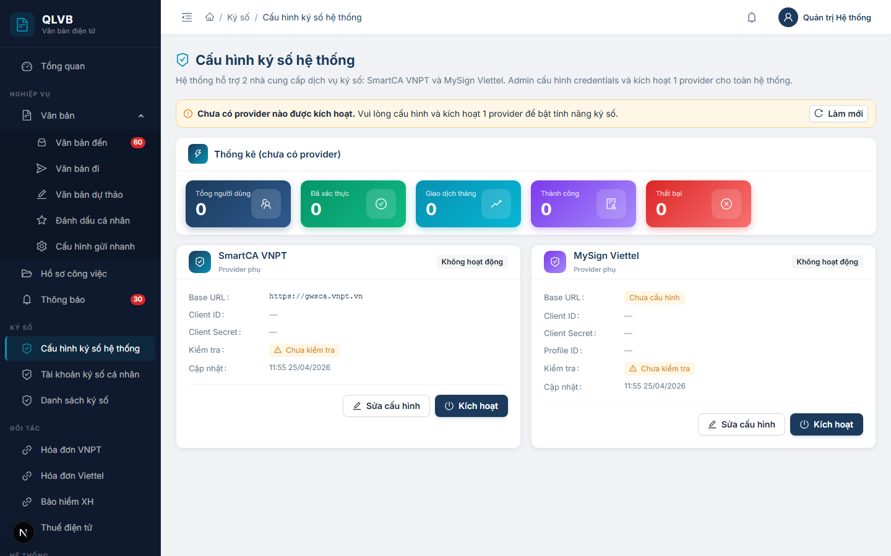

Màn hình được chia thành các khu vực từ trên xuống dưới:

- **Phần đầu trang**: Hiển thị tiêu đề "Cấu hình ký số hệ thống" kèm dòng mô tả ngắn cho biết hệ thống hỗ trợ 2 nhà cung cấp SmartCA VNPT và MySign Viettel.
- **Dải thông báo trạng thái (Banner)**: Nằm ngay dưới tiêu đề, có 2 dạng:
  - **Dải xanh** (khi đã có provider được kích hoạt): hiển thị tên provider đang hoạt động, Base URL và thời điểm kiểm tra kết nối lần cuối.
  - **Dải vàng** (khi chưa có provider nào được kích hoạt): hiển thị cảnh báo *"Chưa có provider nào được kích hoạt. Vui lòng cấu hình và kích hoạt 1 provider để bật tính năng ký số."*
  - Cả hai dạng đều có nút **Làm mới** ở góc phải để tải lại dữ liệu.
- **Khu vực Thống kê**: Một thẻ lớn chứa 5 ô số liệu (KPI) của provider đang kích hoạt:
  - **Tổng người dùng** — tổng số tài khoản đã đăng ký với provider.
  - **Đã xác thực** — số tài khoản đã xác thực thành công.
  - **Giao dịch tháng** — tổng số lượt ký trong tháng hiện tại.
  - **Thành công** — số giao dịch ký thành công trong tháng.
  - **Thất bại** — số giao dịch ký thất bại trong tháng.

  Tiêu đề thẻ thống kê có dạng *"Thống kê (SmartCA VNPT)"* hoặc *"Thống kê (MySign Viettel)"* tùy theo provider đang kích hoạt. Nếu chưa có provider nào kích hoạt sẽ hiển thị *"Thống kê (chưa có provider)"* và cả 5 ô đều bằng 0.
- **Khu vực 2 thẻ Provider — đặt cạnh nhau (trên màn hình rộng) hoặc xếp dọc (trên màn hình hẹp)**:
  - Thẻ trái: **SmartCA VNPT**.
  - Thẻ phải: **MySign Viettel**.
  - Mỗi thẻ hiển thị thông tin cấu hình hiện tại + 2 nút thao tác **Sửa cấu hình** và **Kích hoạt** (nút Kích hoạt chỉ hiển thị khi provider đó đang **không** hoạt động).
  - Provider đang kích hoạt có **viền xanh đậm** + nhãn **"Đang kích hoạt"** (màu xanh lá).
- **Cửa sổ phụ (Drawer)**:
  - **Drawer Sửa cấu hình** — mở ra từ bên phải khi bấm **Sửa cấu hình** trên một thẻ provider, hiển thị các ô nhập credentials và 2 nút kiểm tra kết nối.

---

### 3. Thông tin hiển thị trên Thẻ provider

Mỗi thẻ provider (SmartCA VNPT / MySign Viettel) hiển thị các trường sau:

| Tên trường | Mô tả |
|---|---|
| **Tiêu đề thẻ** | Tên provider — **SmartCA VNPT** hoặc **MySign Viettel** — kèm biểu tượng. Phía dưới có dòng mô tả: *"Provider mặc định hệ thống"* (nếu đang kích hoạt) hoặc *"Provider phụ"* (nếu không). |
| **Nhãn trạng thái** | Hiển thị ở góc phải tiêu đề thẻ: nhãn xanh **"Đang kích hoạt"** hoặc nhãn xám **"Không hoạt động"**. |
| **Base URL** | URL cổng API của provider. Hiển thị ở phông chữ `monospace`. Nếu chưa cấu hình, hiển thị nhãn vàng **"Chưa cấu hình"**. |
| **Client ID** | Mã định danh ứng dụng QLVB do provider cấp. Nếu dài quá 40 ký tự sẽ tự động cắt bớt và hiện tooltip khi rê chuột. Nếu chưa có, hiển thị dấu `—`. |
| **Client Secret** | Hiển thị **"\*\*\*"** kèm chấm xanh nếu đã được cấu hình; hiển thị dấu `—` nếu chưa. **Hệ thống KHÔNG BAO GIỜ hiển thị Client Secret dạng chữ rõ trên giao diện** — đây là thiết kế bảo mật. |
| **Profile ID** | (Chỉ hiển thị với MySign Viettel) — Mã profile ký số do Viettel cấp. |
| **Kiểm tra** | Trạng thái kết nối lần kiểm tra gần nhất: nhãn vàng **"Chưa kiểm tra"**, nhãn xanh **"Kết nối OK"** kèm thời điểm, hoặc nhãn đỏ **"Lỗi kết nối"** kèm thời điểm. |
| **Cập nhật** | Thời điểm cấu hình được cập nhật lần gần nhất, theo định dạng `dd/MM/yyyy hh:mm`. |

Cuối thẻ là **2 nút thao tác**:

- **Sửa cấu hình** — mở Drawer chỉnh sửa credentials.
- **Kích hoạt** — chỉ hiển thị khi provider đó **đang không hoạt động**. Bấm để đặt provider đó làm provider mặc định toàn hệ thống.

---

### 4. Các trường nhập liệu trong cửa sổ Sửa cấu hình

*[Hình minh họa: Cửa sổ Sửa cấu hình provider]*

Khi bấm **Sửa cấu hình** trên một thẻ provider, hệ thống mở cửa sổ phía bên phải màn hình với tiêu đề *"Sửa cấu hình — {Tên provider}"* và các trường sau:

| Tên trường | Bắt buộc | Mô tả & ràng buộc |
|---|---|---|
| **Base URL** | Có | URL cổng API của provider. Tối đa 500 ký tự. **Phải bắt đầu bằng `https://`** (cho phép `http://localhost` chỉ dùng khi phát triển). Sai định dạng hệ thống báo *"Base URL phải bắt đầu bằng https:// (hoặc http://localhost cho dev)"*. Phía dưới ô nhập có dòng gợi ý ví dụ tương ứng từng provider: SmartCA VNPT là `https://gwsca.vnpt.vn`, MySign Viettel là `https://remotesigning.viettel.vn`. |
| **Client ID** | Có | Mã định danh ứng dụng QLVB do provider cấp khi đăng ký tích hợp. Tối đa 200 ký tự. Bỏ trống hệ thống báo *"Nhập Client ID"*. Cạnh nhãn có biểu tượng dấu hỏi tooltip giải thích. |
| **Client Secret** | Có khi mới cấu hình lần đầu — **Không bắt buộc** khi sửa lại provider đã có cấu hình | Mật khẩu của ứng dụng QLVB với provider — **khác** với OTP cá nhân của người ký. Tối đa 500 ký tự, **tối thiểu 8 ký tự** khi nhập mới. Trường này hiển thị dạng ô mật khẩu (che dấu khi gõ). **Nếu provider đã có Client Secret cũ, để trống ô này nghĩa là giữ nguyên secret cũ — không cần gõ lại**. Bên cạnh nhãn có nhãn nhỏ **"Để trống nếu giữ nguyên"** nhắc nhở. Sai độ dài tối thiểu sẽ báo *"Client Secret tối thiểu 8 ký tự"*. |
| **Profile ID** | Có (chỉ với MySign Viettel) | Mã profile ký số do Viettel cấp cùng credentials. Tối đa 200 ký tự. Ví dụ định dạng: `adss:ras:profile:001`. Provider SmartCA VNPT **không có** trường này. Bỏ trống với MySign Viettel sẽ báo *"Profile ID là bắt buộc với MySign Viettel"*. |

> **Lưu ý bảo mật**: Thông tin nhạy cảm (Client Secret) được **mã hóa** trước khi lưu vào cơ sở dữ liệu. Khi tải dữ liệu lên giao diện, hệ thống chỉ trả về dấu `***` thay cho secret thật — nên kể cả Quản trị viên cũng không xem lại được Client Secret cũ. Nếu cần, hãy lấy lại từ phía nhà cung cấp và nhập lại.

Phía dưới các ô nhập là khu vực **Kiểm tra kết nối provider** với 2 nút (chi tiết ở mục 5).

---

### 5. Các nút chức năng

| Nút | Vị trí | Khi nào hiển thị / kích hoạt | Tác dụng |
|---|---|---|---|
| **Làm mới** | Góc phải dải thông báo trạng thái | Luôn hiển thị | Tải lại danh sách provider, thống kê và trạng thái kích hoạt. Dùng khi nghi ngờ dữ liệu không đồng bộ. |
| **Sửa cấu hình** | Cuối mỗi thẻ provider | Luôn hiển thị (mờ đi nếu provider chưa được khởi tạo trong DB) | Mở cửa sổ Sửa cấu hình. |
| **Kích hoạt** (trên thẻ) | Cuối thẻ provider | Chỉ hiển thị khi provider đó **đang không hoạt động** | Mở hộp xác nhận, sau đó đặt provider này làm provider mặc định và **tự động tắt** provider đang hoạt động khác. |
| **Hủy** | Góc phải tiêu đề Drawer Sửa cấu hình | Luôn hiển thị trong Drawer | Đóng Drawer, không lưu thay đổi. |
| **Lưu** | Góc phải tiêu đề Drawer | Luôn hiển thị trong Drawer | Lưu thông tin vừa nhập, **không** kích hoạt provider. |
| **Lưu & Kích hoạt** | Góc phải tiêu đề Drawer | Chỉ hiển thị khi provider đang sửa **đang không hoạt động** | Lưu thông tin **và** kích hoạt provider này (đồng thời tắt provider khác). **Bị mờ (disabled) cho đến khi đã bấm "Kiểm tra với secret mới" thành công**. |
| **Kiểm tra cấu hình đã lưu** | Trong khung kiểm tra của Drawer | Mờ khi provider chưa cấu hình hoặc đang chạy nút kiểm tra còn lại | Test kết nối bằng Client Secret **đã lưu** trong cơ sở dữ liệu. Sau khi test, hệ thống tự cập nhật trường **Kiểm tra** trên thẻ provider. |
| **Kiểm tra với secret mới** | Trong khung kiểm tra của Drawer | Mờ khi chưa nhập Client Secret mới trong form, hoặc đang chạy nút kiểm tra còn lại | Test kết nối bằng Base URL + Client ID + Client Secret **vừa gõ trong form** (không lưu vào DB). Bắt buộc thành công trước khi bấm **Lưu & Kích hoạt**. |
| **Đã hiểu** | Trong hộp cảnh báo "Không thể kích hoạt" | Khi cố kích hoạt provider chưa kiểm tra OK | Đóng hộp cảnh báo. |
| **Kích hoạt** / **Hủy** trong hộp xác nhận | Khi bấm Kích hoạt trên thẻ | Khi mở hộp xác nhận | **Kích hoạt** — thực hiện. **Hủy** — đóng hộp, không thay đổi. |

---

### 6. Quy trình thao tác chính

#### 6.1. Cấu hình lần đầu một provider (chưa từng nhập credentials)

1. Trên màn hình, xác định thẻ provider muốn cấu hình (SmartCA VNPT hoặc MySign Viettel).
2. Bấm **Sửa cấu hình** trên thẻ đó. Cửa sổ Sửa cấu hình mở ra.
3. Điền:
   - **Base URL** (bắt buộc, dạng `https://...`).
   - **Client ID** (bắt buộc).
   - **Client Secret** (bắt buộc, ≥ 8 ký tự).
   - **Profile ID** (chỉ với MySign Viettel — bắt buộc).
4. Bấm **Kiểm tra với secret mới** ở khung kiểm tra phía dưới để xác minh kết nối tới provider.
5. Nếu thành công, hệ thống thông báo **"Kiểm tra kết nối thành công"** và hiển thị hộp xanh có nhãn **"Secret mới nhập"** + thông tin chứng thư.
6. Nếu chưa muốn dùng ngay, bấm **Lưu** — hệ thống thông báo **"Cập nhật cấu hình thành công"**, đóng cửa sổ.
7. Nếu muốn dùng ngay, bấm **Lưu & Kích hoạt** (nút này chỉ bật sau khi kiểm tra với secret mới thành công). Hệ thống lưu cấu hình + tự kích hoạt provider này, đồng thời tắt provider kia. Thông báo **"Lưu và kích hoạt cấu hình thành công"**.

#### 6.2. Sửa lại cấu hình đang dùng (giữ nguyên Client Secret cũ)

1. Trên thẻ provider, bấm **Sửa cấu hình**.
2. Sửa các trường cần thiết (ví dụ: đổi Base URL, đổi Client ID, đổi Profile ID). **Để TRỐNG ô Client Secret** — hệ thống sẽ giữ nguyên secret đã mã hóa từ trước.
3. (Tùy chọn) Bấm **Kiểm tra cấu hình đã lưu** để xác minh credentials hiện tại còn hoạt động — nút này dùng secret đã lưu trong DB, không cần nhập lại.
4. Bấm **Lưu**. Hệ thống thông báo **"Cập nhật cấu hình thành công"**.

> **Lưu ý**: Nếu cần thay Client Secret thành giá trị mới (do provider rotate key, do bị lộ...), hãy nhập secret mới vào ô Client Secret và bấm **Kiểm tra với secret mới** trước khi **Lưu**.

#### 6.3. Chuyển provider đang kích hoạt (sang provider khác)

1. Đảm bảo provider muốn chuyển sang đã cấu hình đầy đủ và **đã kiểm tra kết nối thành công** (nhãn xanh **"Kết nối OK"** trên thẻ).
   - Nếu chưa, mở Drawer Sửa cấu hình → bấm **Kiểm tra cấu hình đã lưu** hoặc **Kiểm tra với secret mới** cho đến khi OK.
2. Trên thẻ provider muốn chuyển sang, bấm **Kích hoạt**.
3. Hộp xác nhận hiện ra:
   > *"Kích hoạt &lt;Tên provider&gt;? Provider đang hoạt động khác (nếu có) sẽ tự động bị tắt."*

   *[Hình minh họa: Hộp xác nhận kích hoạt]*
4. Bấm **Kích hoạt** để xác nhận, hoặc **Hủy** để bỏ qua.
5. Hệ thống thông báo **"Đã kích hoạt &lt;Tên provider&gt;"**. Dải thông báo trên đầu trang và viền 2 thẻ provider tự cập nhật ngay.

> **Quan trọng**: Nếu provider chưa đạt **"Kết nối OK"** mà bấm **Kích hoạt**, hệ thống sẽ chặn lại bằng hộp cảnh báo *"Không thể kích hoạt"* và yêu cầu kiểm tra kết nối thành công trước.

#### 6.4. Kiểm tra kết nối tới provider

Có **2 cách** kiểm tra kết nối, đều ở trong cửa sổ Sửa cấu hình:

##### a) Kiểm tra cấu hình đã lưu

- Dùng khi: muốn xác minh credentials đã lưu trong hệ thống còn hoạt động (sau một thời gian, sau khi provider rotate key, định kỳ...).
- Bấm **Kiểm tra cấu hình đã lưu**.
- Hệ thống dùng Base URL + Client ID + Client Secret **đã lưu** trong cơ sở dữ liệu để gọi thử provider.
- Kết quả hiển thị trong hộp ngay dưới 2 nút, kèm nhãn **"Cấu hình đã lưu"** (màu xanh) và thời gian kết nối tính bằng `ms`.
- Sau khi test xong, **trường "Kiểm tra" trên thẻ provider** được cập nhật ngay.

##### b) Kiểm tra với secret mới

- Dùng khi: vừa nhập Client Secret mới và muốn xác minh trước khi lưu.
- Trước tiên phải nhập **Client Secret** trong form (nếu để trống, nút này sẽ bị mờ).
- Bấm **Kiểm tra với secret mới**.
- Hệ thống dùng Base URL + Client ID + Client Secret **vừa gõ trong form** để gọi thử provider — **không lưu** giá trị này vào DB.
- Kết quả hiển thị trong hộp ngay dưới 2 nút, kèm nhãn **"Secret mới nhập"** (màu tím) và thời gian kết nối tính bằng `ms`.
- Khi kết quả OK, nút **Lưu & Kích hoạt** ở góc phải trên cùng Drawer **bật** lên.

> Hệ thống chặn không cho **chạy đồng thời** 2 nút kiểm tra — bấm nút này thì nút kia sẽ tạm mờ.

---

### 7. Lưu ý / Ràng buộc nghiệp vụ

#### 7.1. Hệ thống cố định chỉ hỗ trợ 2 provider

Hệ thống **không cho phép thêm provider thứ ba** và **không cho phép xóa** SmartCA VNPT hoặc MySign Viettel. Đây là ràng buộc cố ý ở phía hệ thống — nếu trong tương lai cần tích hợp provider mới, sẽ phải nâng cấp hệ thống và bổ sung trình kết nối tương ứng (do đội phát triển thực hiện).

Nếu muốn **tạm dừng** một provider, cách đúng là **kích hoạt provider còn lại** — provider không được kích hoạt sẽ tự động về trạng thái không hoạt động, không bị xóa.

#### 7.2. Tại một thời điểm chỉ có một provider được kích hoạt

Hệ thống đảm bảo **đúng một** provider hoạt động ở mỗi thời điểm. Khi bấm Kích hoạt trên một thẻ, provider đang hoạt động khác (nếu có) **tự động bị tắt**. Cơ chế này được kiểm soát ở mức cơ sở dữ liệu, đảm bảo nhất quán toàn hệ thống.

Nếu cả 2 provider đều **không** được kích hoạt (ví dụ ngay sau khi cài đặt), dải thông báo trên đầu trang sẽ hiển thị màu vàng cảnh báo và toàn bộ tính năng ký số trong hệ thống sẽ không sử dụng được cho đến khi Quản trị viên kích hoạt một provider.

#### 7.3. Không thể xem lại Client Secret đã lưu

Vì lý do bảo mật, **Client Secret được mã hóa khi lưu** và **không bao giờ** được hiển thị lại trên giao diện — kể cả với Quản trị viên. Trên thẻ provider chỉ hiển thị `***`, trong Drawer Sửa cấu hình ô Client Secret để trống.

Hệ quả:

- Khi sửa cấu hình mà **không** muốn đổi Client Secret, **chỉ cần để trống** ô đó — hệ thống tự giữ nguyên giá trị cũ.
- Khi cần đổi Client Secret, phải **lấy lại** giá trị mới từ phía nhà cung cấp (VNPT hoặc Viettel), nhập vào ô và bấm **Kiểm tra với secret mới** trước khi Lưu.

#### 7.4. Bắt buộc kiểm tra kết nối trước khi kích hoạt

Để tránh trường hợp toàn hệ thống bị "đứng" tính năng ký số do cấu hình sai, hệ thống bắt buộc:

- **Kích hoạt từ thẻ provider**: chỉ cho phép khi cột **Kiểm tra** trên thẻ ở trạng thái **"Kết nối OK"**. Nếu không, hộp **"Không thể kích hoạt"** sẽ hiện ra với hướng dẫn.
- **Lưu & Kích hoạt từ Drawer**: chỉ bật khi đã bấm **Kiểm tra với secret mới** thành công ở phiên hiện tại.

#### 7.5. Định dạng Base URL

- Bắt buộc bắt đầu bằng **`https://`** (giao thức an toàn).
- Cho phép **`http://localhost`** chỉ trong môi trường phát triển nội bộ — không dùng trên môi trường thật.
- Ví dụ: `https://gwsca.vnpt.vn` (SmartCA VNPT), `https://remotesigning.viettel.vn` (MySign Viettel).

#### 7.6. Profile ID — chỉ áp dụng cho MySign Viettel

SmartCA VNPT **không** dùng Profile ID. MySign Viettel **bắt buộc** có Profile ID — đây là mã do Viettel cấp cùng Client ID/Client Secret để xác định cấu hình ký số trên hệ thống của Viettel. Nếu sửa cấu hình MySign Viettel mà bỏ trống Profile ID, hệ thống sẽ báo lỗi.

#### 7.7. Kết quả kiểm tra kết nối được lưu lại

Khi bấm **Kiểm tra cấu hình đã lưu**, hệ thống ghi nhận:

- Thời điểm kiểm tra (**Kiểm tra lần cuối**).
- Kết quả: **"Kết nối OK"** hoặc **"Lỗi kết nối"** (kèm chi tiết lỗi từ provider, nếu có).

Thông tin này hiển thị trên thẻ provider và trên dải thông báo trên đầu trang, giúp Quản trị viên theo dõi tình trạng kết nối theo thời gian.

Riêng nút **Kiểm tra với secret mới** **không** ghi vào lịch sử kiểm tra — vì secret đó chưa được lưu, đây chỉ là kiểm tra tạm thời trước khi lưu.

#### 7.8. Bảng tổng hợp các thông báo của hệ thống

| Tình huống | Thông báo |
|---|---|
| Cập nhật cấu hình thành công | Cập nhật cấu hình thành công |
| Lưu và kích hoạt thành công | Lưu và kích hoạt cấu hình thành công |
| Kích hoạt provider thành công | Đã kích hoạt &lt;Tên provider&gt; |
| Provider đang hoạt động — bấm Kích hoạt lại | Provider này đang được kích hoạt |
| Bấm Kích hoạt trên provider chưa cấu hình | Provider này chưa được cấu hình |
| Kiểm tra kết nối với secret mới — thành công | Kiểm tra kết nối thành công |
| Kiểm tra cấu hình đã lưu — thành công | Kiểm tra cấu hình đã lưu thành công |
| Kết nối tới provider thất bại | Kết nối thất bại / Không kết nối được provider |
| Provider chưa cấu hình mà bấm Kiểm tra cấu hình đã lưu | Provider chưa cấu hình, vui lòng nhập Base URL + Client ID + Client Secret trước khi test |
| Bỏ trống Base URL | Nhập Base URL của provider |
| Base URL sai định dạng | Base URL phải bắt đầu bằng https:// (hoặc http://localhost cho dev) |
| Bỏ trống Client ID | Nhập Client ID |
| Client Secret quá ngắn | Client Secret tối thiểu 8 ký tự |
| Bỏ trống Profile ID (MySign Viettel) | Profile ID là bắt buộc với MySign Viettel |
| Bấm Kiểm tra với secret mới mà chưa nhập secret | Nhập client_secret để kiểm tra kết nối |
| Cố kích hoạt provider chưa kiểm tra OK | Không thể kích hoạt &lt;Tên provider&gt; khi chưa kiểm tra kết nối thành công |
| Lỗi tải dữ liệu | Không tải được cấu hình ký số |
| Lưu cấu hình thất bại | Lưu cấu hình thất bại |
| Kích hoạt thất bại | Kích hoạt thất bại |
| Tài khoản không phải Quản trị | Bạn không có quyền truy cập trang này |

---

*Tài liệu được biên soạn dựa trên hệ thống thực tế đang triển khai. Mọi thắc mắc vui lòng liên hệ với đội phát triển để được hỗ trợ.*


\newpage

## Hướng dẫn sử dụng: Màn hình Ký số > Tài khoản ký số cá nhân

Tài liệu này mô tả đầy đủ các chức năng có trong màn hình **Ký số > Tài khoản ký số cá nhân** (đường dẫn `/ky-so/tai-khoan`) của hệ thống Quản lý văn bản điện tử (e-Office), giúp người dùng hiểu rõ cách sử dụng và quy trình nghiệp vụ.

---

### 1. Giới thiệu

Màn hình **Tài khoản ký số cá nhân** dùng để mỗi cán bộ **tự khai báo tài khoản ký số của riêng mình** trên hệ thống e-Office, làm nền tảng để có thể **ký số các văn bản điện tử** (văn bản đi, văn bản dự thảo) sau này. Mỗi tài khoản đăng nhập có một cấu hình ký số riêng, **không nhìn thấy và không ảnh hưởng** đến cấu hình của người khác.

Khác với chữ ký số dạng USB Token, Smart Card cắm trực tiếp vào máy tính, hệ thống e-Office hiện tại tích hợp **dịch vụ ký số từ xa (ký số trên nền tảng đám mây — remote signing)** thông qua hai nhà cung cấp dịch vụ chứng thực:

- **SmartCA VNPT** — dịch vụ ký số cá nhân của VNPT.
- **MySign Viettel** — dịch vụ ký số cá nhân của Viettel.

Tại mỗi thời điểm, **Quản trị viên chỉ kích hoạt một trong hai nhà cung cấp** ở màn hình **Ký số > Cấu hình ký số (cấp đơn vị)**. Người dùng cuối khai báo tài khoản theo đúng nhà cung cấp đang hoạt động đó. Nếu Quản trị viên chưa kích hoạt nhà cung cấp nào, màn hình này sẽ hiện thông báo nhắc liên hệ Quản trị viên.

Việc khai báo bao gồm 2 bước cốt lõi:

1. **Lưu cấu hình** — nhập **Mã định danh** đã đăng ký với nhà cung cấp dịch vụ (và chọn **Chứng thư số** nếu là MySign Viettel).
2. **Xác thực tài khoản ký số** — bấm nút để hệ thống gọi sang nhà cung cấp dịch vụ kiểm tra xem mã định danh có hợp lệ không, đồng thời lấy về thông tin chứng thư số (chủ thể, số serial). Sau khi xác thực thành công, tài khoản mới sẵn sàng dùng để ký số văn bản.

---

### 2. Bố cục màn hình

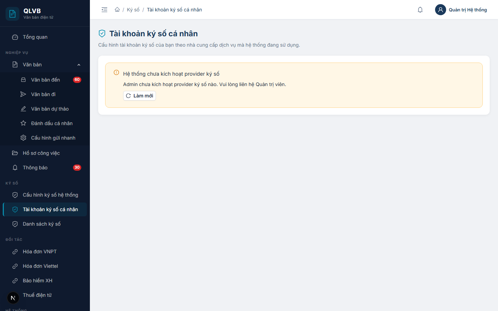

Màn hình chia thành các khu vực sau (chỉ hiển thị khi Quản trị viên đã kích hoạt nhà cung cấp dịch vụ):

- **Phần đầu trang**: Tiêu đề **"Tài khoản ký số cá nhân"** kèm biểu tượng chứng thư bảo mật, dòng mô tả ngắn *"Cấu hình tài khoản ký số của bạn theo nhà cung cấp dịch vụ mà hệ thống đang sử dụng."*.
- **Khung thông báo Provider đang hoạt động**: Một dải thông báo (màu xanh dương, biểu tượng `i`) hiển thị tên nhà cung cấp đang được hệ thống sử dụng (ví dụ *"Provider đang hoạt động: SmartCA VNPT"*) kèm địa chỉ máy chủ (URL gốc) bên cạnh và nút **Làm mới** (biểu tượng mũi tên xoay) ở góc phải để tải lại trạng thái cấu hình.
- **Thẻ "Cấu hình tài khoản"**:
  - Tiêu đề thẻ kèm **nhãn trạng thái xác thực**:
    - **Đã xác thực** (nhãn xanh lá, biểu tượng dấu tích) — khi đã xác thực thành công.
    - **Chưa xác thực** (nhãn vàng cam, biểu tượng cảnh báo) — khi chưa xác thực hoặc cấu hình mới được lưu lại.
  - Góc trên bên phải thẻ hiện dòng *"Xác thực gần nhất: ..."* (chỉ khi đã xác thực).
  - **Biểu mẫu nhập Mã định danh** (và chọn Chứng thư số nếu là MySign).
  - **Khối thông tin chứng thư đã xác thực** — bảng nhỏ hiện *Chủ thể chứng thư* và *Số serial* (chỉ hiện khi đã xác thực).
  - **Hai nút thao tác** ở dưới cùng: **Lưu cấu hình** (màu xanh đậm) và **Xác thực tài khoản ký số**.

**Khi Quản trị viên chưa kích hoạt nhà cung cấp dịch vụ**: Toàn bộ thẻ Cấu hình bị thay bằng một khung cảnh báo màu vàng cam *"Hệ thống chưa kích hoạt provider ký số"* kèm hướng dẫn liên hệ Quản trị viên và nút **Làm mới**.

---

### 3. Các trường nhập liệu trong biểu mẫu

Các trường thay đổi tùy theo nhà cung cấp dịch vụ đang hoạt động.

#### 3.1. Khi nhà cung cấp là SmartCA VNPT

| Tên trường | Bắt buộc | Mô tả & ràng buộc |
|---|---|---|
| **Mã định danh SmartCA** | Có | Số CMND/CCCD hoặc Mã định danh đã đăng ký với VNPT SmartCA. Tối đa 200 ký tự. Có biểu tượng dấu hỏi để rê chuột xem chú thích. Ô nhập có placeholder gợi ý *"Ví dụ: 012345678901"*. Nếu để trống khi bấm Lưu, hệ thống báo *"Vui lòng nhập Mã định danh SmartCA"*. |

> Với SmartCA VNPT, **không cần chọn Chứng thư số** — hệ thống tự lấy chứng thư khi xác thực (mỗi mã định danh thường chỉ có một chứng thư).

#### 3.2. Khi nhà cung cấp là MySign Viettel

| Tên trường | Bắt buộc | Mô tả & ràng buộc |
|---|---|---|
| **Mã định danh MySign** | Có | Mã định danh cá nhân đã đăng ký với Viettel MySign (do Viettel cấp). Tối đa 200 ký tự. Có biểu tượng dấu hỏi để rê chuột xem chú thích. Ô nhập có placeholder gợi ý *"Ví dụ: CMT_123456"*. Nếu để trống khi bấm Lưu, hệ thống báo *"Vui lòng nhập Mã định danh MySign"*. |
| **Chứng thư số** | Có | Danh sách chọn (Select). Mặc định bị **vô hiệu hóa** với placeholder *"Bấm 'Tải danh sách chứng thư' để chọn"*. Sau khi bấm nút **Tải danh sách chứng thư từ MySign**, danh sách được điền đầy với các tùy chọn theo dạng *"<Chủ thể chứng thư> (hết hạn: DD/MM/YYYY)"*. Bắt buộc chọn một chứng thư trước khi Lưu cấu hình. Nếu chưa chọn, hệ thống báo *"Vui lòng chọn chứng thư số"*. |

> Với MySign Viettel, một mã định danh có thể gắn với **nhiều chứng thư số**, nên người dùng phải tự chọn một chứng thư cụ thể.

#### 3.3. Khối thông tin chứng thư (chỉ đọc, hiển thị sau khi đã xác thực)

| Tên hiển thị | Nội dung |
|---|---|
| **Chủ thể chứng thư** | Chuỗi định danh chủ sở hữu chứng thư (ví dụ: `CN=Nguyễn Văn A, OU=..., O=..., C=VN`). Hiển thị bằng phông chữ máy in (monospace). |
| **Số serial** | Số serial của chứng thư số (chuỗi mã hex). Hiển thị bằng phông chữ máy in. |

---

### 4. Các nút chức năng

| Nút | Vị trí | Khi nào hiển thị | Tác dụng |
|---|---|---|---|
| **Làm mới** (biểu tượng mũi tên xoay) | Góc trên bên phải dải thông báo Provider đang hoạt động | Khi đã có nhà cung cấp dịch vụ đang hoạt động | Tải lại trạng thái cấu hình từ máy chủ. Dùng khi nghi ngờ dữ liệu chưa cập nhật, hoặc sau khi Quản trị viên đổi nhà cung cấp. |
| **Làm mới** (biểu tượng mũi tên xoay) | Trong khung cảnh báo "Hệ thống chưa kích hoạt provider ký số" | Khi chưa có nhà cung cấp dịch vụ nào kích hoạt | Tải lại trạng thái — dùng để kiểm tra lại sau khi Quản trị viên vừa kích hoạt nhà cung cấp dịch vụ. |
| **Tải danh sách chứng thư từ MySign** (biểu tượng mũi tên xoay) | Bên trong biểu mẫu, ngay dưới ô Mã định danh | Chỉ hiển thị khi nhà cung cấp dịch vụ là **MySign Viettel** | Gọi sang MySign để lấy danh sách các chứng thư số của mã định danh đã nhập, đổ vào danh sách chọn **Chứng thư số**. **Phải nhập Mã định danh trước khi bấm.** |
| **Lưu cấu hình** (màu xanh đậm, biểu tượng đĩa lưu) | Cuối thẻ Cấu hình tài khoản | Luôn hiển thị khi có biểu mẫu | Lưu Mã định danh (và Chứng thư số nếu là MySign) lên hệ thống. **Sau khi lưu, trạng thái sẽ trở về Chưa xác thực**, người dùng cần bấm tiếp nút Xác thực. |
| **Xác thực tài khoản ký số** (biểu tượng dấu tích) | Cuối thẻ Cấu hình tài khoản, bên phải nút Lưu | Luôn hiển thị | Gọi sang nhà cung cấp dịch vụ để kiểm tra Mã định danh có hợp lệ không, đồng thời lấy về thông tin chứng thư (chủ thể, số serial) để hiển thị. **Bị vô hiệu hóa khi người dùng chưa lưu cấu hình lần nào**, và có chú thích *"Vui lòng lưu cấu hình trước khi xác thực"*. |

---

### 5. Quy trình thao tác chính

#### 5.1. Trường hợp 1 — Hệ thống chưa kích hoạt nhà cung cấp dịch vụ

1. Mở menu **Ký số > Tài khoản ký số cá nhân**.
2. Màn hình hiển thị khung cảnh báo màu vàng cam *"Hệ thống chưa kích hoạt provider ký số"* kèm dòng hướng dẫn *"Vui lòng liên hệ Quản trị viên để cấu hình và kích hoạt nhà cung cấp dịch vụ ký số."*.
3. Liên hệ Quản trị viên đề nghị kích hoạt một nhà cung cấp dịch vụ tại màn hình **Ký số > Cấu hình ký số (cấp đơn vị)**.
4. Sau khi Quản trị viên đã kích hoạt, bấm nút **Làm mới** (biểu tượng mũi tên xoay) trên cùng khung cảnh báo. Khi nhà cung cấp đã sẵn sàng, biểu mẫu cấu hình sẽ hiện ra.

#### 5.2. Trường hợp 2 — Khai báo tài khoản với SmartCA VNPT

1. Mở menu **Ký số > Tài khoản ký số cá nhân**.
2. Trên dải thông báo, kiểm tra **Provider đang hoạt động** ghi *"SmartCA VNPT"*.
3. Nhập **Mã định danh SmartCA** (số CMND/CCCD hoặc Mã định danh đã đăng ký với VNPT SmartCA).
4. Bấm **Lưu cấu hình**.
5. Hệ thống hiển thị thông báo *"Lưu cấu hình thành công. Vui lòng bấm 'Xác thực tài khoản ký số' để kiểm tra."*. Nhãn trạng thái chuyển về **Chưa xác thực**.
6. Bấm **Xác thực tài khoản ký số**.
7. Nếu chứng thư hợp lệ, hệ thống thông báo *"Kiểm tra thành công — chứng thư hợp lệ"*. Nhãn trạng thái chuyển sang **Đã xác thực** (xanh lá), khối thông tin Chủ thể chứng thư và Số serial xuất hiện, dòng *"Xác thực gần nhất: ..."* hiển thị thời điểm vừa xác thực.

*[Hình minh họa: Đã xác thực thành công]*

#### 5.3. Trường hợp 3 — Khai báo tài khoản với MySign Viettel

1. Mở menu **Ký số > Tài khoản ký số cá nhân**.
2. Trên dải thông báo, kiểm tra **Provider đang hoạt động** ghi *"MySign Viettel"*.
3. Nhập **Mã định danh MySign** (do Viettel cấp).
4. Bấm **Tải danh sách chứng thư từ MySign**:
   - Nếu chưa nhập Mã định danh, hệ thống báo dưới ô nhập *"Vui lòng nhập Mã định danh trước"*.
   - Nếu MySign trả về danh sách chứng thư, hệ thống thông báo *"Đã tải N chứng thư số"* và đổ danh sách vào ô **Chứng thư số**.
   - Nếu mã định danh không có chứng thư nào, hệ thống thông báo *"Không tìm thấy chứng thư nào cho mã định danh này"*.
5. Mở ô **Chứng thư số** và chọn một chứng thư phù hợp (mỗi mục hiển thị Chủ thể chứng thư kèm hạn sử dụng).
6. Bấm **Lưu cấu hình** → thông báo *"Lưu cấu hình thành công..."*. Nhãn trạng thái về **Chưa xác thực**.
7. Bấm **Xác thực tài khoản ký số** → thông báo *"Kiểm tra thành công — chứng thư hợp lệ"*. Nhãn trạng thái chuyển sang **Đã xác thực**.

*[Hình minh họa: Tải danh sách chứng thư MySign]*

#### 5.4. Cập nhật lại Mã định danh hoặc đổi Chứng thư số

1. Mở lại màn hình **Ký số > Tài khoản ký số cá nhân**.
2. Sửa thông tin Mã định danh, hoặc (với MySign) bấm lại **Tải danh sách chứng thư từ MySign** rồi chọn lại chứng thư khác.
3. Bấm **Lưu cấu hình**. Hệ thống thông báo *"Lưu cấu hình thành công..."* và **đặt lại trạng thái về Chưa xác thực**, cho dù trước đó đã xác thực rồi.
4. Bấm lại **Xác thực tài khoản ký số** để xác thực với cấu hình mới.

> **Quan trọng**: Mỗi lần Lưu cấu hình, hệ thống đều coi như cấu hình mới và yêu cầu xác thực lại. Nếu không xác thực lại, các chức năng ký số có thể không sử dụng được tài khoản này.

---

### 6. Lưu ý / Ràng buộc nghiệp vụ

#### 6.1. Mỗi tài khoản người dùng có một cấu hình riêng

Cấu hình ký số trên màn hình này gắn với **tài khoản đăng nhập hiện tại**. Người dùng A không thể nhìn thấy, sửa hoặc xác thực thay cho người dùng B. Hệ thống xác định danh tính dựa vào phiên đăng nhập, do đó luôn an toàn về phía người dùng cuối.

#### 6.2. Một tài khoản — một cấu hình theo đúng nhà cung cấp đang hoạt động

Mỗi tài khoản người dùng trên hệ thống e-Office tại **một thời điểm** chỉ cần khai báo cấu hình ký số ứng với **đúng nhà cung cấp dịch vụ mà Quản trị viên đang kích hoạt**. Nếu sau này Quản trị viên đổi sang nhà cung cấp khác, người dùng cần quay lại màn hình này khai báo lại theo nhà cung cấp mới.

#### 6.3. Điều kiện cần để có thể ký số văn bản

Tài khoản ký số chỉ được coi là **sẵn sàng** khi nhãn trạng thái trên thẻ Cấu hình hiển thị **Đã xác thực** (màu xanh lá). Nếu trạng thái là **Chưa xác thực**, các chức năng ký số ở các màn hình **Văn bản đi**, **Văn bản dự thảo** có thể không sử dụng được tài khoản này.

#### 6.4. Sau khi Lưu cấu hình, BẮT BUỘC phải Xác thực lại

Mỗi lần bấm **Lưu cấu hình**, hệ thống đặt lại trạng thái về **Chưa xác thực**. Đây là cơ chế an toàn để đảm bảo cấu hình mới luôn được kiểm tra với nhà cung cấp dịch vụ trước khi sử dụng. Người dùng cần chủ động bấm **Xác thực tài khoản ký số** sau mỗi lần Lưu.

#### 6.5. Nút Xác thực bị vô hiệu hóa khi chưa Lưu lần nào

Khi mở màn hình lần đầu (chưa từng lưu cấu hình nào), nút **Xác thực tài khoản ký số** bị mờ đi và không bấm được. Rê chuột lên sẽ thấy chú thích *"Vui lòng lưu cấu hình trước khi xác thực"*. Sau khi Lưu lần đầu, nút sẽ được kích hoạt.

#### 6.6. Với MySign Viettel: PHẢI tải danh sách chứng thư trước khi chọn

Ô **Chứng thư số** mặc định bị vô hiệu hóa với placeholder *"Bấm 'Tải danh sách chứng thư' để chọn"*. Người dùng phải:

1. Nhập **Mã định danh MySign** trước.
2. Bấm **Tải danh sách chứng thư từ MySign** để hệ thống lấy về danh sách thật từ Viettel.
3. Sau đó mới mở được ô chọn chứng thư.

Nếu danh sách trả về rỗng (*"Không tìm thấy chứng thư nào cho mã định danh này"*), kiểm tra lại Mã định danh đã đăng ký đúng chưa, hoặc liên hệ Viettel để xác nhận tình trạng tài khoản.

#### 6.7. Thời điểm xác thực gần nhất được ghi lại

Sau mỗi lần xác thực thành công, hệ thống ghi lại thời điểm xác thực và hiển thị ở góc trên bên phải thẻ Cấu hình tài khoản: *"Xác thực gần nhất: DD/MM/YYYY HH:MM"*. Nếu hạn của chứng thư đã sắp hết, người dùng nên xác thực lại định kỳ để bảo đảm cấu hình còn hiệu lực.

#### 6.8. Lỗi kết nối đến nhà cung cấp dịch vụ

Khi bấm **Tải danh sách chứng thư từ MySign** hoặc **Xác thực tài khoản ký số**, hệ thống cần gọi sang dịch vụ của VNPT hoặc Viettel. Nếu mạng có sự cố, hoặc dịch vụ phía nhà cung cấp đang gián đoạn, hệ thống sẽ hiển thị thông báo dạng *"Không kết nối được provider: ..."* hoặc *"Không lấy được danh sách chứng thư: ..."*. Trong trường hợp này, thử lại sau ít phút; nếu vẫn không được, liên hệ Quản trị viên để kiểm tra cấu hình kết nối ở cấp đơn vị.

#### 6.9. Khi xác thực thất bại nhưng không phải do lỗi mạng

Có những trường hợp hệ thống kết nối được sang nhà cung cấp dịch vụ nhưng không tìm thấy chứng thư khớp:

- Với **MySign Viettel**: chứng thư đã chọn không còn có trong danh sách hiện tại của mã định danh (có thể đã bị thu hồi hoặc hết hạn). Hệ thống thông báo *"Không tìm thấy chứng thư khớp credential_id đã chọn. Vui lòng tải lại danh sách CTS."*.
- Với **SmartCA VNPT**: mã định danh không gắn với chứng thư nào. Hệ thống thông báo *"Không tìm thấy chứng thư nào cho user_id này"*.

Khi gặp các thông báo này, kiểm tra lại Mã định danh, tải lại danh sách chứng thư (với MySign) và xác thực lại.

#### 6.10. Bảng tổng hợp các thông báo của hệ thống

| Tình huống | Thông báo |
|---|---|
| Lưu cấu hình thành công | Lưu cấu hình thành công. Vui lòng bấm "Xác thực tài khoản ký số" để kiểm tra. |
| Xác thực thành công | Kiểm tra thành công — chứng thư hợp lệ |
| Tải danh sách chứng thư MySign thành công | Đã tải N chứng thư số |
| Tải danh sách chứng thư MySign nhưng rỗng | Không tìm thấy chứng thư nào cho mã định danh này |
| Bấm Tải danh sách khi chưa nhập Mã định danh | Vui lòng nhập Mã định danh trước |
| Để trống Mã định danh khi Lưu (SmartCA) | Vui lòng nhập Mã định danh SmartCA |
| Để trống Mã định danh khi Lưu (MySign) | Vui lòng nhập Mã định danh MySign |
| Mã định danh quá 200 ký tự | Tối đa 200 ký tự |
| Không chọn Chứng thư số (MySign) | Vui lòng chọn chứng thư số |
| Bấm Xác thực khi chưa Lưu cấu hình lần nào | Vui lòng lưu cấu hình trước khi kiểm tra |
| Xác thực thất bại — không tìm thấy chứng thư khớp (MySign) | Không tìm thấy chứng thư khớp credential_id đã chọn. Vui lòng tải lại danh sách CTS. |
| Xác thực thất bại — không có chứng thư (SmartCA) | Không tìm thấy chứng thư nào cho user_id này |
| Lỗi kết nối đến nhà cung cấp khi xác thực | Không kết nối được provider: <chi tiết> |
| Lỗi kết nối đến nhà cung cấp khi tải danh sách chứng thư | Không lấy được danh sách chứng thư: <chi tiết> |
| Hệ thống chưa kích hoạt nhà cung cấp dịch vụ | Hệ thống chưa kích hoạt provider ký số / Admin chưa kích hoạt provider ký số nào. Vui lòng liên hệ Quản trị viên. |
| Lỗi tải cấu hình | Không tải được cấu hình |
| Lỗi lưu cấu hình | Lưu cấu hình thất bại |

---

*Tài liệu được biên soạn dựa trên hệ thống thực tế đang triển khai. Mọi thắc mắc vui lòng liên hệ với đội phát triển để được hỗ trợ.*


\newpage

## Hướng dẫn sử dụng: Màn hình Ký số > Danh sách ký số

Tài liệu này mô tả đầy đủ các chức năng có trong màn hình **Ký số > Danh sách ký số** (đường dẫn `/ky-so/danh-sach`) của hệ thống Quản lý văn bản điện tử (e-Office), giúp người dùng hiểu rõ cách sử dụng và quy trình nghiệp vụ.

---

### 1. Giới thiệu

Màn hình **Ký số > Danh sách ký số** là nơi cán bộ thực hiện thao tác **ký số điện tử** trên các tệp đính kèm dạng PDF của văn bản đi, văn bản dự thảo và hồ sơ công việc. Đây là công cụ thay thế cho việc ký giấy, sử dụng chứng thư số (CKS) và ứng dụng OTP trên thiết bị di động (VNPT SmartCA, Viettel MySign) để gắn chữ ký số hợp lệ vào tệp PDF của văn bản.

Mỗi bản ký số gồm 2 thành phần:

- **Tệp PDF gốc** (đính kèm trên văn bản đi / dự thảo / hồ sơ công việc).
- **Giao dịch ký số** (sign transaction): bản ghi nhận yêu cầu ký số gửi sang nhà cung cấp dịch vụ chứng thực, lưu trạng thái (đang chờ OTP, đã ký, thất bại, hết hạn, đã hủy) cùng `provider_transaction_id` để tra cứu.

Màn hình này gom toàn bộ các tệp **cần ký** và các giao dịch **đã / đang / không thành công** của tài khoản đăng nhập hiện tại. Đây là **danh sách cá nhân** — mỗi người dùng chỉ thấy các tệp / giao dịch của chính mình; máy chủ luôn lọc theo `staffId` lấy từ phiên đăng nhập (JWT), không thể xem dữ liệu của người khác.

> **Lưu ý nghiệp vụ**: Hệ thống **không cho phép ký số văn bản đến** — chỉ có 3 loại được ký: **Văn bản đi**, **Dự thảo**, **Hồ sơ công việc**.

---

### 2. Bố cục màn hình

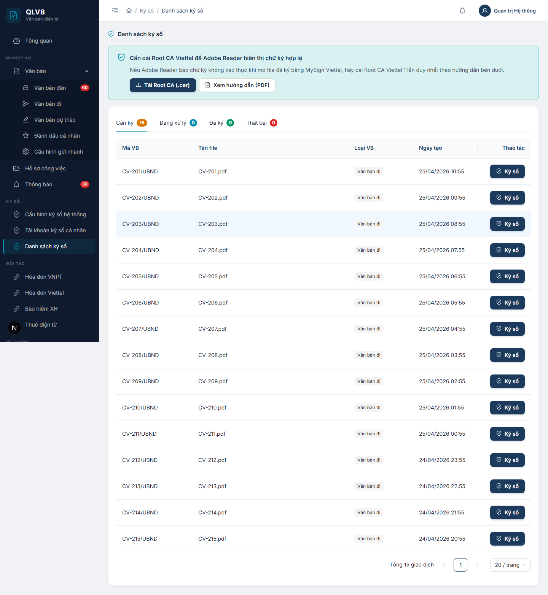

Màn hình gồm các khu vực chính sau:

- **Phần đầu trang**: Tiêu đề **"Danh sách ký số"** kèm biểu tượng chứng thư an toàn (hình khiên).
- **Khung "Cần cài Root CA Viettel"** (dải thông báo màu xanh dương ngay dưới tiêu đề): Hướng dẫn cài Root CA của Viettel để Adobe Reader hiển thị chữ ký hợp lệ. Khung này luôn hiển thị, gồm 2 nút:
  - **Tải Root CA (.cer)** — tải tệp chứng thư gốc về máy.
  - **Xem hướng dẫn (PDF)** — mở tài liệu hướng dẫn cài Root CA trong tab mới.
- **Thanh phân loại (tab)**: Gồm 4 tab xếp hàng ngang, mỗi tab kèm **huy hiệu số đếm** màu phân biệt:
  - **Cần ký** (huy hiệu cam) — số tệp đang chờ ký.
  - **Đang xử lý** (huy hiệu xanh teal) — số giao dịch đã gửi đi, đang chờ xác nhận OTP.
  - **Đã ký** (huy hiệu xanh lá) — số giao dịch đã hoàn tất.
  - **Thất bại** (huy hiệu đỏ) — số giao dịch thất bại / hết hạn / đã hủy.
- **Bảng danh sách**: Hiển thị các dòng tương ứng với tab đang chọn. Mặc định mở tab **Cần ký**.
- **Phân trang**: Dưới chân bảng, mặc định **20 dòng / trang**, có thể đổi sang 10 / 50 / 100 dòng. Dòng tổng kết hiển thị *"Tổng N giao dịch"*.

> **Realtime cập nhật**: Khi giao dịch ký của bạn được nhà cung cấp xử lý xong (thành công hoặc thất bại), hệ thống tự đẩy thông báo qua Socket.IO và **bảng + huy hiệu số đếm sẽ tự động làm mới** mà không cần tải lại trang.

> **Đồng bộ với địa chỉ web**: Tab đang chọn, số trang và kích thước trang đều được lưu trên thanh địa chỉ (ví dụ `?tab=completed&page=2&pageSize=20`). Có thể chia sẻ liên kết hoặc dùng nút **Quay lại / Tiến** của trình duyệt mà không mất ngữ cảnh.

---

### 3. Các tab phân loại

| Tab | Số đếm hiển thị | Nội dung |
|---|---|---|
| **Cần ký** | `need_sign` | Các **tệp PDF đính kèm** thuộc văn bản đi / dự thảo / hồ sơ công việc mà bạn **có quyền ký** (signer / approver / người tạo / quản trị) nhưng **chưa ký** và **chưa có giao dịch ký nào đang chạy**. Đây là danh sách hành động — bạn cần xử lý từng dòng. |
| **Đang xử lý** | `pending` | Các **giao dịch ký số** đã được gửi sang nhà cung cấp dịch vụ chứng thực, đang **chờ bạn xác nhận OTP** trên ứng dụng di động (VNPT SmartCA / Viettel MySign). Mỗi giao dịch có thời hạn xác nhận **3 phút**; quá hạn sẽ tự chuyển sang **Thất bại** với trạng thái *Hết thời gian*. |
| **Đã ký** | `completed` | Các giao dịch đã hoàn tất — file PDF đã được gắn chữ ký số và lưu vào kho tệp. Tải file đã ký từ tab này. |
| **Thất bại** | `failed` | Gộp 3 trạng thái: **failed** (nhà cung cấp từ chối / lỗi kỹ thuật), **expired** (hết 3 phút không xác nhận OTP), **cancelled** (bạn chủ động hủy). Có thể bấm **Ký lại** để mở lại modal ký. |

Bấm vào tab nào, bảng bên dưới chỉ hiển thị các dòng thuộc loại đó. Khi chuyển tab, hệ thống **đặt lại số trang về 1** nhưng **giữ nguyên kích thước trang** đã chọn.

---

### 4. Các cột trong bảng danh sách

Cột hiển thị **khác nhau theo từng tab** vì bản chất dữ liệu khác nhau (tab **Cần ký** là tệp đính kèm, 3 tab còn lại là giao dịch ký).

#### 4.1. Tab "Cần ký"

| Tên cột | Mô tả |
|---|---|
| **Mã VB** | Số ký hiệu của văn bản (ví dụ `123/QĐ-UBND`). Nếu chưa cấp số, hiển thị nhãn loại văn bản hoặc `#<id>`. |
| **Tên file** | Tên tệp PDF đính kèm. Tooltip hiển thị đầy đủ khi rê chuột. Nếu dài sẽ tự động cắt bớt. |
| **Loại VB** | Nhãn xám phân biệt: **Văn bản đi**, **Dự thảo**, **Hồ sơ công việc**. |
| **Ngày tạo** | Ngày giờ tệp đính kèm được tạo, định dạng `DD/MM/YYYY HH:mm`. |
| (cột thao tác) | Nút **Ký số** màu xanh navy (xem mục 6). |

#### 4.2. Tab "Đang xử lý"

| Tên cột | Mô tả |
|---|---|
| **Mã VB** | Nhãn văn bản (`doc_label`) hoặc `#<doc_id>`. |
| **Tên file** | Tên tệp PDF đang được ký. |
| **Nhà cung cấp** | Nhãn xanh dương: **VNPT SmartCA** hoặc **Viettel MySign** — nhà cung cấp dịch vụ chứng thực đang xử lý giao dịch. |
| **Bắt đầu lúc** | Thời điểm bạn gửi yêu cầu ký, định dạng `DD/MM/YYYY HH:mm`. |
| (cột thao tác) | Nút **Hủy** (màu đỏ) — chỉ hiển thị cho giao dịch của chính bạn (xem mục 6.2). |

#### 4.3. Tab "Đã ký"

| Tên cột | Mô tả |
|---|---|
| **Mã VB** | Nhãn văn bản hoặc `#<doc_id>`. |
| **Tên file** | Tên tệp PDF đã ký. |
| **Nhà cung cấp** | Nhãn xanh lá: nhà cung cấp đã thực hiện ký (VNPT / Viettel). |
| **Ngày ký** | Thời điểm hoàn tất (`completed_at`), định dạng `DD/MM/YYYY HH:mm`. |
| (cột thao tác) | Nút **Tải file đã ký** (biểu tượng mũi tên xuống) — xem mục 6.3. |

#### 4.4. Tab "Thất bại"

| Tên cột | Mô tả |
|---|---|
| **Mã VB** | Nhãn văn bản hoặc `#<doc_id>`. |
| **Tên file** | Tên tệp PDF của giao dịch thất bại. |
| **Lý do lỗi** | Thông điệp lỗi chi tiết (`error_message`). Nếu để trống, hệ thống hiển thị nhãn dự phòng theo trạng thái: **Hết thời gian**, **Đã hủy**, **Thất bại**. Nếu dài quá 80 ký tự sẽ cắt bớt và hiện đầy đủ khi rê chuột. |
| **Thất bại lúc** | Thời điểm `completed_at`; nếu trống dùng `created_at`. |
| (cột thao tác) | Nút **Ký lại** màu xanh navy (xem mục 6.4). |

> **Lưu ý**: Trên màn hình này hiện **chưa có ô tìm kiếm tự do và chưa có bộ lọc nâng cao**. Để thu hẹp danh sách, sử dụng các tab phân loại và phân trang.

---

### 5. Các nút chức năng

| Nút | Vị trí | Khi nào hiển thị | Tác dụng |
|---|---|---|---|
| **Tải Root CA (.cer)** | Khung Root CA dưới tiêu đề | Luôn hiển thị | Tải tệp chứng thư gốc Viettel về máy (`viettel-ca-new.cer`). Cài 1 lần duy nhất vào kho chứng thư của Windows / Adobe Reader để chữ ký hiển thị **hợp lệ**. |
| **Xem hướng dẫn (PDF)** | Khung Root CA dưới tiêu đề | Luôn hiển thị | Mở tài liệu hướng dẫn cài Root CA dạng PDF (`huong-dan-cai-root-ca.pdf`) trong tab mới. |
| **Tab "Cần ký" / "Đang xử lý" / "Đã ký" / "Thất bại"** | Thanh phân loại | Luôn hiển thị | Chuyển bảng sang loại dữ liệu tương ứng. Mỗi tab kèm số đếm cập nhật theo thời gian thực. |
| **Ký số** (biểu tượng khiên, nền xanh navy) | Cột thao tác — tab **Cần ký** | Mỗi dòng | Mở **cửa sổ Ký số điện tử** để bắt đầu giao dịch ký với nhà cung cấp. **Bị vô hiệu hóa khi đang có 1 cửa sổ ký mở** (chống bấm 2 lần tạo 2 giao dịch). |
| **Hủy** (màu đỏ) | Cột thao tác — tab **Đang xử lý** | Mỗi dòng có giao dịch trạng thái `pending` của chính bạn | Mở hộp xác nhận, sau đó hủy giao dịch. Chỉ hủy được giao dịch **chưa hoàn tất** và **của chính mình**. |
| **Tải file đã ký** (biểu tượng mũi tên xuống) | Cột thao tác — tab **Đã ký** | Mỗi dòng | Tải tệp PDF đã ký về máy. Tệp được phân phát qua máy chủ proxy (không tiết lộ địa chỉ kho lưu trữ nội bộ). Tên tệp tự động thêm tiền tố `signed_`. |
| **Ký lại** (biểu tượng làm mới) | Cột thao tác — tab **Thất bại** | Mỗi dòng | Mở lại **cửa sổ Ký số điện tử** với cùng tệp đính kèm để tạo giao dịch mới. **Bị vô hiệu hóa khi đang có 1 cửa sổ ký mở**. |
| **Hủy ký số** (trong cửa sổ ký) | Footer cửa sổ ký | Khi giao dịch đang ở trạng thái `pending` | Hủy giao dịch hiện tại — sau khi xác nhận, trạng thái chuyển sang **Đã hủy**. |
| **Đóng (chạy nền)** (trong cửa sổ ký) | Footer cửa sổ ký | Khi giao dịch đang ở trạng thái `pending` | Đóng cửa sổ — giao dịch tiếp tục chạy nền, hệ thống sẽ thông báo qua **chuông thông báo** khi hoàn tất. |
| **Đóng** (trong cửa sổ ký) | Footer cửa sổ ký | Khi giao dịch ở trạng thái cuối (đã ký / thất bại / hết hạn / đã hủy) | Đóng cửa sổ. |

---

### 6. Quy trình thao tác chính

#### 6.1. Ký số một tệp đính kèm

> **Điều kiện trước khi ký** (kiểm tra ở mục 7.1, 7.2): (1) Quản trị viên đã cấu hình nhà cung cấp ký số ở trạng thái hoạt động; (2) Bạn đã cấu hình **Tài khoản ký số cá nhân** ở trang `/ky-so/tai-khoan` và đã **xác thực** thành công; (3) Tệp đính kèm đúng định dạng PDF.

1. Vào menu **Ký số > Danh sách ký số**, bấm tab **Cần ký**.
2. Tìm dòng tương ứng với tệp cần ký.
3. Bấm nút **Ký số** ở cột thao tác.
4. Cửa sổ **Ký số điện tử** mở ra (xem ảnh dưới), hiển thị:
   - **File**: tên tệp đang ký.
   - **Nhà cung cấp**: nhãn xanh — **SmartCA VNPT** hoặc **MySign Viettel** — tùy cấu hình hệ thống.
   - **Trạng thái**: ban đầu *"Đang khởi tạo giao dịch..."*.

   *[Hình minh họa: Cửa sổ Ký số điện tử — đang chờ OTP]*

5. Sau khoảng 0,5–1 giây, trạng thái chuyển sang **Đang chờ xác nhận OTP** kèm:
   - **Đồng hồ đếm ngược 3:00** dạng vòng tròn ở giữa cửa sổ (xanh navy → vàng khi còn 30–60s → đỏ khi còn dưới 30s).
   - Khung thông báo *"Chờ xác nhận OTP trên thiết bị di động"*.
6. Mở ứng dụng **VNPT SmartCA** hoặc **Viettel MySign** trên điện thoại của bạn, vào mục thông báo / yêu cầu ký, **xác nhận OTP**.
7. Khi nhà cung cấp ký xong, cửa sổ tự động chuyển sang trạng thái **Đã ký** (màu xanh lá), kèm thông báo *"Ký số thành công"*. File đã ký được lưu tự động vào kho tệp.
8. Bấm **Đóng** để thoát. Tab **Cần ký** tự giảm số đếm, tab **Đã ký** tăng tương ứng.

> **Mẹo**: Có thể bấm **Đóng (chạy nền)** ngay khi đang chờ OTP — giao dịch không bị hủy mà tiếp tục chạy. Khi hoàn tất, hệ thống đẩy thông báo qua **chuông thông báo** ở góc trên màn hình; hoặc bạn quay lại tab **Đã ký** sẽ thấy giao dịch xuất hiện.

#### 6.2. Hủy một giao dịch đang xử lý

1. Vào tab **Đang xử lý**.
2. Tìm dòng giao dịch cần hủy.
3. Bấm nút **Hủy** (màu đỏ) ở cột thao tác.
4. Hộp xác nhận hiện ra với câu hỏi *"Bạn có chắc muốn hủy giao dịch ký cho file ..."*.
5. Bấm **Hủy giao dịch** (màu đỏ) để xác nhận, hoặc **Đóng** để bỏ qua.
6. Hệ thống thông báo **"Đã hủy giao dịch ký số"**. Giao dịch chuyển từ tab **Đang xử lý** sang tab **Thất bại** với trạng thái *Đã hủy*.

> **Lưu ý**: Chỉ hủy được giao dịch **của chính mình** và **đang ở trạng thái `pending`**. Hệ thống đối chiếu `staff_id` của giao dịch với tài khoản đang đăng nhập — nếu khác sẽ trả lỗi *"Bạn không có quyền hủy giao dịch này"*.

#### 6.3. Tải file đã ký

1. Vào tab **Đã ký**.
2. Tìm dòng giao dịch tương ứng.
3. Bấm nút **Tải file đã ký** (biểu tượng mũi tên xuống) ở cột thao tác.
4. Trình duyệt tải tệp PDF đã ký về máy với tên dạng `signed_<tên_file_gốc>.pdf`.

> **Lưu ý**: Tệp được phát qua máy chủ proxy (không phải qua liên kết tạm thời `presigned URL`). Hệ thống đặt `Cache-Control: no-store` để chống lưu cache trình duyệt — mỗi lần tải đều xác thực lại quyền sở hữu.

#### 6.4. Ký lại một giao dịch thất bại

1. Vào tab **Thất bại**.
2. Tìm dòng giao dịch thất bại / hết hạn / đã hủy.
3. (Khuyến nghị) Rê chuột vào cột **Lý do lỗi** để xem nguyên nhân đầy đủ.
4. Bấm nút **Ký lại** ở cột thao tác → mở lại **cửa sổ Ký số điện tử** với cùng tệp PDF.
5. Thực hiện tiếp các bước 5 → 8 ở mục 6.1.

> **Lưu ý**: Nút **Ký lại** tạo **giao dịch mới hoàn toàn** (transaction_id mới); giao dịch thất bại cũ vẫn lưu lại trong tab **Thất bại** để phục vụ kiểm tra / đối chiếu.

---

### 7. Lưu ý / Ràng buộc nghiệp vụ

#### 7.1. Điều kiện hệ thống — Cấu hình nhà cung cấp

Trước khi user ký được, **Quản trị viên** phải cấu hình ít nhất 1 nhà cung cấp dịch vụ chứng thực (CFG-01) ở màn hình **Ký số > Cấu hình** và đặt trạng thái **Đang hoạt động**. Nếu chưa có nhà cung cấp đang hoạt động, bấm **Ký số** sẽ nhận lỗi:

> *"Hệ thống chưa cấu hình provider ký số. Vui lòng liên hệ Quản trị viên."*

#### 7.2. Điều kiện cá nhân — Tài khoản ký số đã xác thực

Mỗi user phải tự cấu hình thông tin định danh (`user_id`, `credential_id`) của mình tại màn hình **Ký số > Tài khoản ký số cá nhân** (`/ky-so/tai-khoan`) và bấm **Kiểm tra** để xác thực. Nếu chưa cấu hình hoặc chưa xác thực, bấm **Ký số** sẽ nhận một trong hai lỗi:

- *"Bạn chưa cấu hình tài khoản ký số. Vui lòng vào "Tài khoản ký số cá nhân" để cấu hình."*
- *"Tài khoản ký số chưa được xác thực. Vui lòng bấm "Kiểm tra" trong trang Tài khoản ký số cá nhân."*

#### 7.3. Quyền ký theo từng tệp

Hệ thống chỉ cho phép ký nếu user thuộc **một trong các nhóm** sau (kiểm tra qua hàm `edoc.fn_attachment_can_sign`):

- **Người ký** (`signer`) hoặc **Người duyệt** (`approver`) được gán cho văn bản (so khớp tên không phân biệt dấu, hoa thường — UNACCENT + LOWER).
- **Người tạo** (`created_by`) văn bản.
- **Quản trị viên** (`isAdmin`).

Nếu không thỏa, bấm **Ký số** sẽ nhận lỗi *"Bạn không có quyền ký file này"* (HTTP 403).

#### 7.4. Không ký số văn bản đến

Văn bản đến (`incoming_doc`) **không được phép ký số** theo quy định nghiệp vụ cơ quan nhà nước. Nếu cố ý gửi yêu cầu, hệ thống chặn ngay và trả lỗi:

> *"Không được ký số văn bản đến"*

Tab **Cần ký** trên màn hình này chỉ liệt kê tệp thuộc 3 loại được phép: **Văn bản đi**, **Dự thảo**, **Hồ sơ công việc**.

#### 7.5. Chỉ ký được file PDF

Hệ thống kiểm tra phần mở rộng tệp; nếu tên tệp không kết thúc bằng `.pdf` sẽ trả lỗi:

> *"Chỉ hỗ trợ ký file PDF. File hiện tại không phải định dạng PDF."*

Trường hợp tệp PDF lỗi cấu trúc (corrupt) không thể chèn placeholder chữ ký, hệ thống trả:

> *"File PDF không hợp lệ hoặc không tương thích ký số: ..."*

#### 7.6. Thời hạn xác nhận OTP — 3 phút

Mỗi giao dịch ký có thời hạn **180 giây** kể từ lúc gửi sang nhà cung cấp. Nếu user không xác nhận OTP trong thời gian này, giao dịch tự động chuyển sang trạng thái **Hết thời gian** (`expired`) và xuất hiện ở tab **Thất bại**. Đồng hồ đếm ngược trên cửa sổ ký:

- **Xanh navy** khi còn > 60 giây.
- **Vàng** khi còn 30–60 giây.
- **Đỏ** khi còn dưới 30 giây.

#### 7.7. Cài Root CA Viettel để hiển thị chữ ký hợp lệ

Đối với các tệp ký bằng **Viettel MySign**, Adobe Reader có thể hiển thị cảnh báo *"chữ ký không xác thực"* nếu máy tính chưa có Root CA của Viettel trong kho chứng thư hệ thống. Cài Root CA **một lần duy nhất** trên mỗi máy tính:

1. Bấm **Tải Root CA (.cer)** trên khung thông báo đầu trang.
2. Bấm **Xem hướng dẫn (PDF)** để xem các bước cài chi tiết.
3. Sau khi cài, mở lại tệp đã ký bằng Adobe Reader — chữ ký sẽ hiển thị tích xanh **hợp lệ**.

#### 7.8. Cập nhật theo thời gian thực

Trang lắng nghe 2 sự kiện qua Socket.IO:

- `sign_completed` — kích hoạt khi nhà cung cấp ký xong và worker hoàn tất gắn chữ ký vào tệp.
- `sign_failed` — kích hoạt khi giao dịch thất bại / hết hạn / bị hủy.

Khi nhận được sự kiện của chính mình, bảng **tự làm mới** đồng thời các huy hiệu số đếm trên 4 tab cũng được cập nhật. Server lọc sự kiện theo phòng `user_{staffId}` — user khác không nhận được.

#### 7.9. Phạm vi cá nhân — không chia sẻ

Mỗi user chỉ thấy giao dịch / tệp cần ký của chính mình. Server lấy `staffId` từ JWT của phiên đăng nhập, **không bao giờ** lấy từ tham số URL hay body — đảm bảo không thể truy cập danh sách của người khác (mitigate T-11-18).

#### 7.10. Tải lại danh sách

Hệ thống không có nút **Làm mới** thủ công. Danh sách tự cập nhật trong các trường hợp:

- Khi mở trang lần đầu.
- Khi chuyển tab, đổi trang, đổi kích thước trang.
- Khi nhận sự kiện Socket.IO `sign_completed` / `sign_failed`.
- Khi thực hiện thành công thao tác **Ký số** / **Hủy** trên cùng trang.

Nếu nghi ngờ dữ liệu không đồng bộ, có thể tải lại trang bằng phím **F5**.

#### 7.11. Bảng tổng hợp các thông báo của hệ thống

| Tình huống | Thông báo |
|---|---|
| Khởi tạo ký số thành công | Yêu cầu ký đã được gửi. Vui lòng xác nhận OTP trên ứng dụng di động. |
| Ký số thành công | Ký số thành công |
| Hủy giao dịch thành công | Đã hủy giao dịch ký số |
| Hết thời gian chờ OTP | Hết thời gian chờ xác nhận OTP. Vui lòng thử lại. |
| Chưa cấu hình nhà cung cấp | Hệ thống chưa cấu hình provider ký số. Vui lòng liên hệ Quản trị viên. |
| Chưa cấu hình tài khoản ký số | Bạn chưa cấu hình tài khoản ký số. Vui lòng vào "Tài khoản ký số cá nhân" để cấu hình. |
| Tài khoản ký số chưa xác thực | Tài khoản ký số chưa được xác thực. Vui lòng bấm "Kiểm tra" trong trang Tài khoản ký số cá nhân. |
| Không có quyền ký tệp | Bạn không có quyền ký file này |
| Cố ký văn bản đến | Không được ký số văn bản đến |
| Tệp không phải PDF | Chỉ hỗ trợ ký file PDF. File hiện tại không phải định dạng PDF. |
| PDF lỗi cấu trúc | File PDF không hợp lệ hoặc không tương thích ký số: \<chi tiết\> |
| Nhà cung cấp từ chối yêu cầu | Provider từ chối yêu cầu ký: \<chi tiết\> |
| Hủy giao dịch của người khác | Bạn không có quyền hủy giao dịch này |
| Hủy giao dịch không ở trạng thái pending | Giao dịch không thể hủy (trạng thái hiện tại: \<status\>) |
| Tải file khi giao dịch chưa hoàn tất | Giao dịch chưa có file đã ký |
| Tải file của giao dịch người khác (không phải admin) | Bạn không có quyền tải file của giao dịch này |
| Lỗi tải danh sách | Không tải được danh sách |
| Tab "Cần ký" trống | Bạn không có văn bản nào đang chờ ký |
| Tab "Đang xử lý" trống | Không có giao dịch nào đang xử lý |
| Tab "Đã ký" trống | Bạn chưa có giao dịch ký số hoàn tất |
| Tab "Thất bại" trống | Không có giao dịch thất bại / hết hạn / đã hủy |

---

*Tài liệu được biên soạn dựa trên hệ thống thực tế đang triển khai. Mọi thắc mắc vui lòng liên hệ với đội phát triển để được hỗ trợ.*


\newpage

## Hướng dẫn sử dụng: Màn hình Quản trị > Đơn vị

Tài liệu này mô tả đầy đủ các chức năng có trong màn hình **Quản trị > Đơn vị** của hệ thống Quản lý văn bản điện tử (e-Office), giúp người dùng hiểu rõ cách sử dụng và quy trình nghiệp vụ.

---

### 1. Giới thiệu

Màn hình **Quản trị > Đơn vị** dùng để quản lý cơ cấu tổ chức của cơ quan, bao gồm các **đơn vị** (cấp lớn — ví dụ: Sở, Ban, Ngành) và các **phòng ban** trực thuộc. Đây là dữ liệu nền tảng của toàn bộ hệ thống e-Office: dùng để phân quyền cho cán bộ, gán đơn vị làm việc, định tuyến gửi/nhận văn bản, lập sổ văn bản và phân công xử lý hồ sơ công việc.

Vì là dữ liệu gốc nên màn hình này **chỉ dành cho tài khoản Quản trị hệ thống**. Người dùng thông thường không truy cập được vào đây.

Một thay đổi nhỏ trên màn hình này (ví dụ: khóa một đơn vị, đổi tên một phòng ban) sẽ ảnh hưởng đến nhiều màn hình khác, do đó cần thao tác cẩn thận và đúng quy trình.

---

### 2. Bố cục màn hình


Màn hình được chia thành 2 cột chính cùng phần đầu trang:

- **Phần đầu trang**: Hiển thị tiêu đề "Quản lý đơn vị" và dòng mô tả ngắn "Quản lý cơ cấu tổ chức, đơn vị và phòng ban".
- **Cột trái — Cơ cấu tổ chức (cây phân cấp)**:
  - Ô tìm kiếm nhanh ở phía trên cây.
  - Cây phân cấp đơn vị / phòng ban (mặc định mở rộng tất cả các nhánh).
  - Nút **Tải lại** (biểu tượng mũi tên xoay tròn) ở góc trên bên phải để tải lại cây sau khi có thay đổi.
  - Bấm vào một nhánh trên cây sẽ lọc bảng bên phải chỉ hiển thị các phòng ban trực thuộc nhánh đó.
- **Cột phải — Danh sách đơn vị**:
  - Bảng dữ liệu hiển thị các đơn vị / phòng ban tương ứng với nhánh đã chọn (mặc định hiển thị toàn bộ).
  - Nút **Thêm đơn vị** (biểu tượng dấu cộng, màu xanh) ở góc trên bên phải bảng để mở cửa sổ thêm mới.
  - Mỗi dòng có nút thao tác hình **ba chấm dọc** ở cột cuối cùng, chứa các lệnh: Sửa thông tin, Khóa / Mở khóa, Xóa.
- **Cửa sổ phụ (Drawer / Modal)**:
  - **Drawer Thêm đơn vị / Cập nhật đơn vị** — mở ra từ bên phải khi bấm nút Thêm hoặc Sửa.
  - **Hộp xác nhận xóa** — mở khi bấm Xóa, yêu cầu xác nhận trước khi thực hiện.

---

### 3. Các cột trong Bảng danh sách đơn vị

| Tên cột | Mô tả |
|---|---|
| **Mã** | Mã của đơn vị / phòng ban — hiển thị in đậm, màu xanh navy. Dùng để tham chiếu nội bộ. |
| **Tên** | Tên đầy đủ của đơn vị / phòng ban. Nếu tên dài sẽ tự động cắt bớt và hiện tooltip khi rê chuột. |
| **Cấp** | Phân loại: **Đơn vị** (nhãn xanh teal) hoặc **Phòng ban** (nhãn xanh navy). Thông tin này quyết định cách phân cấp tổ chức. |
| **Số NV** | Số lượng nhân viên hiện đang thuộc đơn vị / phòng ban đó. |
| **Trạng thái** | **Hoạt động** (nhãn xanh lá) hoặc **Đã khóa** (nhãn đỏ). Đơn vị bị khóa sẽ không cho phép thao tác nghiệp vụ liên quan. |
| (cột thao tác) | Nút ba chấm dọc, mở menu các lệnh: Sửa thông tin, Khóa / Mở khóa, Xóa. |

---

### 4. Các trường nhập liệu trong cửa sổ Thêm / Cập nhật đơn vị


Khi bấm **Thêm đơn vị** hoặc **Sửa thông tin**, hệ thống mở cửa sổ phía bên phải màn hình với các trường sau:

| Tên trường | Bắt buộc | Mô tả & ràng buộc |
|---|---|---|
| **Đơn vị cha** | Không | Chọn đơn vị cấp trên trực tiếp. Nếu để trống, đơn vị này sẽ là đơn vị gốc (cấp cao nhất). Ô chọn dạng cây phân cấp, có nút xóa để bỏ chọn. Khi đang chọn một nhánh trên cây bên trái rồi mới bấm Thêm, ô này sẽ được điền sẵn nhánh đang chọn. |
| **Mã** | Có | Mã ngắn dùng để tham chiếu (ví dụ: `PB01`, `STC`). Tối đa 50 ký tự. **Mã phải duy nhất trong toàn hệ thống** — nếu trùng, hệ thống sẽ báo lỗi "Mã đơn vị đã tồn tại". |
| **Tên** | Có | Tên đầy đủ của đơn vị / phòng ban. Tối đa 200 ký tự. Nếu để trống hệ thống báo lỗi "Tên đơn vị là bắt buộc". |
| **Tên tiếng Anh** | Không | Tên tiếng Anh tương ứng (dùng khi cần xuất báo cáo song ngữ). Tối đa 200 ký tự. |
| **Tên viết tắt** | Không | Tên viết tắt ngắn gọn (ví dụ: `CNTT`, `TC-KH`). Tối đa 50 ký tự. |
| **Cấp** | Có | Chọn một trong hai: **Đơn vị** (cấp tổ chức lớn — Sở, Ban, Ngành) hoặc **Phòng ban** (cấp trực thuộc đơn vị). Mặc định là **Phòng ban**. |
| **Thứ tự** | Không | Số nguyên không âm, dùng để sắp xếp thứ tự hiển thị trong cây và trong bảng. Số nhỏ hiển thị trước. Mặc định là 0. |
| **SDT** | Không | Số điện thoại liên hệ. Tối đa 20 ký tự. Chỉ chấp nhận chữ số, dấu cộng `+`, dấu trừ `-`, khoảng trắng, dấu ngoặc tròn `(`, `)`. Nếu sai định dạng hệ thống báo "Số điện thoại không hợp lệ". |
| **Fax** | Không | Số fax liên hệ. Tối đa 20 ký tự. Quy tắc định dạng giống SDT. Nếu sai báo "Số fax không hợp lệ". |
| **Email** | Không | Email liên hệ chung của đơn vị. Tối đa 100 ký tự. Phải đúng định dạng email (có ký tự `@` và phần đuôi tên miền). Nếu sai báo "Email không hợp lệ". |
| **Địa chỉ** | Không | Địa chỉ trụ sở của đơn vị. Tối đa 500 ký tự. |
| **Cho phép sổ VB** | Không | Công tắc bật/tắt — quy định đơn vị này có được phép có **sổ văn bản riêng** hay không (ảnh hưởng đến chức năng cấp số văn bản trong các nghiệp vụ Văn bản đến / Văn bản đi). Mặc định: tắt. |
| **Mô tả** | Không | Mô tả thêm về chức năng, nhiệm vụ của đơn vị. Tối đa 500 ký tự, dạng vùng văn bản nhiều dòng. |

> **Lưu ý**: Sau khi điền xong, bấm **Thêm mới** (khi tạo) hoặc **Cập nhật** (khi sửa) ở góc trên bên phải cửa sổ. Các thông báo sai định dạng sẽ hiển thị ngay dưới ô nhập tương ứng để người dùng dễ phát hiện và sửa.

---

### 5. Các nút chức năng

| Nút | Vị trí | Khi nào hiển thị | Tác dụng |
|---|---|---|---|
| **Thêm đơn vị** | Góc trên bên phải bảng danh sách | Luôn hiển thị | Mở cửa sổ Thêm mới đơn vị. Nếu đang chọn một nhánh trên cây, đơn vị mới sẽ được tạo dưới nhánh đó (đặt sẵn ở ô "Đơn vị cha"). |
| **Tải lại** (biểu tượng mũi tên xoay tròn) | Góc trên bên phải khung "Cơ cấu tổ chức" | Luôn hiển thị | Tải lại toàn bộ cây phân cấp từ máy chủ. Dùng khi nghi ngờ dữ liệu không đồng bộ. |
| **Ô tìm kiếm "Tìm kiếm đơn vị..."** | Phía trên cây phân cấp | Luôn hiển thị | Lọc các nhánh trên cây theo từ khóa nhập. Có nút xóa nhanh để xóa từ khóa. |
| **Sửa thông tin** | Trong menu ba chấm trên mỗi dòng | Luôn hiển thị | Mở cửa sổ Cập nhật đơn vị với dữ liệu hiện có để chỉnh sửa. |
| **Khóa** | Trong menu ba chấm trên mỗi dòng | Khi đơn vị đang ở trạng thái **Hoạt động** | Khóa đơn vị / phòng ban — không cho phép tham gia các luồng nghiệp vụ tới khi mở khóa lại. |
| **Mở khóa** | Trong menu ba chấm trên mỗi dòng | Khi đơn vị đang ở trạng thái **Đã khóa** | Mở khóa đơn vị / phòng ban, đưa về trạng thái **Hoạt động**. |
| **Xóa** | Trong menu ba chấm trên mỗi dòng (mục cuối, màu đỏ) | Luôn hiển thị | Mở hộp xác nhận, sau đó xóa đơn vị. **Chỉ xóa được khi đơn vị không còn phòng ban con và không còn nhân viên** (xem mục 7). |
| **Thêm mới** / **Cập nhật** | Góc trên bên phải cửa sổ Thêm/Sửa | Trong cửa sổ Thêm/Sửa | Lưu dữ liệu vừa nhập. Nhãn nút thay đổi tùy theo đang Thêm mới hay Cập nhật. |
| **Hủy** | Góc trên bên phải cửa sổ Thêm/Sửa | Trong cửa sổ Thêm/Sửa | Đóng cửa sổ, không lưu thay đổi. |
| **Xóa** / **Hủy** trong hộp xác nhận | Trong hộp xác nhận xóa | Khi mở hộp xác nhận | **Xóa** (màu đỏ) — thực hiện xóa. **Hủy** — đóng hộp, không xóa. |

---

### 6. Quy trình thao tác chính

#### 6.1. Thêm mới một đơn vị / phòng ban

1. (Tùy chọn) Trên cây bên trái, bấm chọn nhánh muốn đặt đơn vị mới vào — khi đó "Đơn vị cha" trong cửa sổ thêm sẽ được điền sẵn.
2. Bấm nút **Thêm đơn vị** ở góc trên bên phải bảng.
3. Trong cửa sổ Thêm đơn vị, điền:
   - **Mã** (bắt buộc): mã ngắn không trùng đơn vị nào khác.
   - **Tên** (bắt buộc): tên đầy đủ.
   - **Cấp**: chọn **Đơn vị** hoặc **Phòng ban** (xem ý nghĩa ở mục 7).
   - Các thông tin còn lại điền tùy nhu cầu.
4. Bấm **Thêm mới**.
5. Hệ thống thông báo **"Thêm thành công"** và đóng cửa sổ. Cây bên trái và bảng bên phải tự động cập nhật.

*[Hình minh họa: Hộp Thêm đơn vị đã điền dữ liệu]*

#### 6.2. Chỉnh sửa thông tin một đơn vị

1. Tìm đơn vị cần sửa trên bảng (có thể bấm chọn nhánh trên cây để thu hẹp danh sách).
2. Trên dòng tương ứng, bấm biểu tượng **ba chấm dọc** ở cột cuối → chọn **Sửa thông tin**.
3. Cửa sổ **Cập nhật đơn vị** mở ra với dữ liệu sẵn có. Sửa các thông tin cần thiết.
4. Bấm **Cập nhật**.
5. Hệ thống thông báo **"Cập nhật thành công"** và đóng cửa sổ.

> Khi đổi **Đơn vị cha**, đơn vị này sẽ được di chuyển sang nhánh mới trên cây. Cần cân nhắc kỹ vì việc di chuyển ảnh hưởng đến phân quyền của nhân viên thuộc đơn vị đó.

#### 6.3. Khóa / Mở khóa đơn vị

1. Tìm đơn vị cần khóa hoặc mở khóa.
2. Bấm biểu tượng **ba chấm dọc** ở cột cuối.
3. Bấm **Khóa** (nếu đang Hoạt động) hoặc **Mở khóa** (nếu đang Đã khóa).
4. Hệ thống thông báo **"Đã khóa"** hoặc **"Đã mở khóa"** tương ứng. Cột **Trạng thái** trên bảng cập nhật ngay.

> **Khi nào nên khóa?** Khi một phòng ban tạm dừng hoạt động (chia tách, sát nhập, chưa kiện toàn), khóa giúp ngăn việc gán nhân sự / gửi văn bản nhầm tới phòng ban đó, đồng thời vẫn giữ nguyên dữ liệu lịch sử.

#### 6.4. Xóa đơn vị

1. Tìm đơn vị cần xóa.
2. Bấm biểu tượng **ba chấm dọc** ở cột cuối → chọn **Xóa** (mục cuối cùng, màu đỏ).
3. Hộp xác nhận hiện ra với câu hỏi *"Bạn có chắc chắn muốn xóa đơn vị này?"*.

   *[Hình minh họa: Hộp xác nhận xóa]*
4. Bấm **Xóa** (màu đỏ) để xác nhận, hoặc **Hủy** để bỏ qua.
5. Nếu xóa được, hệ thống thông báo **"Xóa thành công"**.
6. Nếu không xóa được, hệ thống báo lỗi rõ lý do (xem mục 7).

> **Quan trọng**: Hệ thống thực hiện **xóa mềm** — dữ liệu không bị xóa hẳn khỏi cơ sở dữ liệu mà chỉ ẩn khỏi danh sách. Tuy vậy, từ góc nhìn nghiệp vụ, đơn vị đã xóa coi như không còn tồn tại.

#### 6.5. Tìm kiếm trên cây cơ cấu tổ chức

1. Trên ô **Tìm kiếm đơn vị...** ở phía trên cây bên trái, gõ một phần tên đơn vị / phòng ban (có thể không cần dấu).
2. Cây sẽ tự động lọc, chỉ hiển thị các nhánh chứa từ khóa kèm các nhánh cha của chúng.
3. Bấm biểu tượng **dấu nhân** trong ô tìm kiếm để xóa từ khóa và hiển thị lại toàn bộ cây.
4. Bấm vào một nhánh trên cây để lọc bảng bên phải chỉ còn các phòng ban thuộc nhánh đó.

---

### 7. Lưu ý / Ràng buộc nghiệp vụ

#### 7.1. "Đơn vị" và "Phòng ban" — phân biệt thế nào?

Hệ thống chia tổ chức thành 2 cấp khái niệm:

- **Đơn vị**: cấp tổ chức lớn — ví dụ Sở, Ban, Ngành, Tổng công ty. Đơn vị thường là chủ thể có sổ văn bản, có lãnh đạo ký, có con dấu riêng.
- **Phòng ban**: cấp tổ chức trực thuộc bên trong một đơn vị — ví dụ Phòng Kế hoạch, Phòng Tổ chức cán bộ, Văn phòng.

Phân biệt này được lưu trên trường **Cấp** của mỗi bản ghi, ảnh hưởng đến cách nhân viên được gán đơn vị làm việc và cách định tuyến văn bản trong toàn hệ thống.

#### 7.2. Mã đơn vị phải duy nhất

Trong toàn hệ thống, **mỗi mã đơn vị chỉ tồn tại một lần** (không phân biệt chữ hoa / chữ thường). Khi nhập trùng, hệ thống báo:

> *"Mã đơn vị đã tồn tại"*

Lỗi này hiển thị ngay tại ô **Mã** trong cửa sổ nhập để người dùng dễ phát hiện.

#### 7.3. Không xóa được đơn vị còn dữ liệu liên quan

Hệ thống ngăn xóa nếu:

- **Còn phòng ban con trực thuộc**:
  > *"Không thể xóa: còn N phòng ban con"*

  Cần xóa hoặc chuyển các phòng ban con đi trước.

- **Còn nhân viên thuộc đơn vị**:
  > *"Không thể xóa: còn N nhân viên thuộc phòng ban này"*

  Cần chuyển toàn bộ nhân viên sang đơn vị khác trước (thực hiện ở màn hình **Quản trị > Nhân viên**).

Nếu không xóa được nhưng đơn vị thực sự đã ngừng hoạt động, có thể chuyển sang dùng chức năng **Khóa** (mục 6.3).

#### 7.4. Thứ tự sắp xếp (sort_order)

Số ở trường **Thứ tự** quyết định vị trí hiển thị của đơn vị trong cây và trong bảng. Số nhỏ đứng trước số lớn. Khi nhiều đơn vị cùng số thứ tự, hệ thống tiếp tục sắp xếp theo tên (theo bảng chữ cái).

#### 7.5. "Cho phép sổ VB" — ý nghĩa nghiệp vụ

Bật công tắc này khi đơn vị có **sổ văn bản riêng** — tức là được phép cấp số văn bản đi / văn bản đến mang đầu sổ của đơn vị. Tắt khi đơn vị không phải là chủ thể quản lý sổ (ví dụ: phòng ban nội bộ chỉ dùng sổ chung của đơn vị cấp trên).

Cấu hình chi tiết của các sổ văn bản được thực hiện ở màn hình **Quản trị > Sổ văn bản**, nhưng việc đơn vị có được tạo sổ hay không phụ thuộc vào công tắc này.

#### 7.6. Định dạng SDT, Fax, Email

- **SDT** và **Fax**: chỉ chấp nhận chữ số, dấu `+`, `-`, khoảng trắng và ngoặc tròn `(`, `)`. Không chấp nhận chữ cái.
- **Email**: phải đúng định dạng chuẩn (có `@` và phần đuôi tên miền).

Sai định dạng sẽ thấy thông báo đỏ ngay dưới ô nhập.

#### 7.7. Bảng tổng hợp các thông báo của hệ thống

| Tình huống | Thông báo |
|---|---|
| Thêm đơn vị thành công | Thêm thành công |
| Cập nhật đơn vị thành công | Cập nhật thành công |
| Xóa đơn vị thành công | Xóa thành công |
| Khóa đơn vị | Đã khóa |
| Mở khóa đơn vị | Đã mở khóa |
| Để trống Tên | Tên đơn vị là bắt buộc |
| Mã trùng | Mã đơn vị đã tồn tại |
| Email sai định dạng | Email không hợp lệ |
| SDT sai định dạng | Số điện thoại không hợp lệ |
| Fax sai định dạng | Số fax không hợp lệ |
| Xóa đơn vị còn phòng ban con | Không thể xóa: còn N phòng ban con |
| Xóa đơn vị còn nhân viên | Không thể xóa: còn N nhân viên thuộc phòng ban này |
| Lỗi tải dữ liệu | Lỗi tải dữ liệu đơn vị / Lỗi tải danh sách |

---

*Tài liệu được biên soạn dựa trên hệ thống thực tế đang triển khai. Mọi thắc mắc vui lòng liên hệ với đội phát triển để được hỗ trợ.*


\newpage

## Hướng dẫn sử dụng: Màn hình Quản trị > Chức vụ

Tài liệu này mô tả đầy đủ các chức năng có trong màn hình **Quản trị > Chức vụ** của hệ thống Quản lý văn bản điện tử (e-Office), giúp người dùng hiểu rõ cách sử dụng và quy trình nghiệp vụ.

---

### 1. Giới thiệu

Màn hình **Quản trị > Chức vụ** dùng để quản lý danh mục **chức vụ** của cán bộ trong cơ quan — ví dụ: Giám đốc, Phó Giám đốc, Trưởng phòng, Phó Trưởng phòng, Chuyên viên, Văn thư. Đây là dữ liệu nền tảng để gán cho từng cán bộ ở màn hình **Quản trị > Người dùng**, đồng thời chi phối hai quyền nghiệp vụ rất quan trọng:

- **Chức vụ lãnh đạo**: cán bộ giữ chức vụ này được phép giao việc, phân công, cho ý kiến chỉ đạo, ký duyệt văn bản trong các luồng văn bản đến / đi / dự thảo.
- **Chức vụ được xử lý văn bản**: cán bộ giữ chức vụ này được phép nhận văn bản giao xử lý (chuyên viên, thư ký…). Nếu tắt, cán bộ sẽ không xuất hiện trong danh sách chọn người xử lý.

Vì là dữ liệu gốc, ảnh hưởng đến phân quyền của toàn bộ cán bộ, nên màn hình này **chỉ dành cho tài khoản Quản trị hệ thống**. Người dùng thông thường không truy cập được.

---

### 2. Bố cục màn hình


Màn hình được chia thành 2 phần chính:

- **Phần đầu trang**: Hiển thị tiêu đề "Quản lý chức vụ" và dòng mô tả ngắn "Danh mục chức vụ trong hệ thống".
- **Khung "Danh sách chức vụ"**:
  - Tiêu đề khung kèm biểu tượng thẻ tên màu xanh teal.
  - **Ô tìm kiếm "Tìm kiếm..."** ở góc trên bên phải khung — cho phép tìm theo tên hoặc mã chức vụ.
  - **Nút "Thêm chức vụ"** (màu xanh, biểu tượng dấu cộng) ngay cạnh ô tìm kiếm.
  - Bảng dữ liệu hiển thị toàn bộ chức vụ trong hệ thống, có phân trang ở phía dưới.
  - Mỗi dòng có nút thao tác hình **ba chấm dọc** ở cột cuối cùng, chứa các lệnh: Sửa thông tin, Xóa.
- **Cửa sổ phụ (Drawer / Modal)**:
  - **Drawer Thêm chức vụ mới / Cập nhật chức vụ** — mở ra từ bên phải khi bấm nút Thêm hoặc Sửa.
  - **Hộp xác nhận xóa** — mở khi bấm Xóa, yêu cầu xác nhận trước khi thực hiện.

---

### 3. Các cột trong Bảng danh sách chức vụ

| Tên cột | Mô tả |
|---|---|
| **Mã** | Mã ngắn của chức vụ — hiển thị in đậm, màu xanh navy. Dùng để tham chiếu nội bộ. |
| **Tên chức vụ** | Tên đầy đủ của chức vụ. Nếu tên dài sẽ tự động cắt bớt và hiện tooltip khi rê chuột. |
| **Thứ tự** | Số nguyên dùng để sắp xếp thứ tự hiển thị trong bảng và trong các danh sách chọn chức vụ ở các màn hình khác. Số nhỏ đứng trước. |
| **Số NV** | Số lượng nhân viên hiện đang giữ chức vụ này. Khi cột này lớn hơn 0, không thể xóa chức vụ (xem mục 7). |
| **Lãnh đạo** | Nhãn **Có** (xanh lá) hoặc **Không** (xám). Cho biết chức vụ này có quyền lãnh đạo (giao việc, ký duyệt) hay không. |
| **XL Văn bản** | Nhãn **Có** (xanh lá) hoặc **Không** (xám). Cho biết chức vụ này có được tham gia xử lý văn bản hay không. |
| **Trạng thái** | **Hoạt động** (nhãn xanh lá) hoặc **Ngừng** (nhãn đỏ). Chức vụ đang ngừng vẫn còn trong hệ thống nhưng không được dùng cho các thao tác mới. |
| (cột thao tác) | Nút ba chấm dọc, mở menu các lệnh: Sửa thông tin, Xóa. |

---

### 4. Các trường nhập liệu trong cửa sổ Thêm / Cập nhật chức vụ

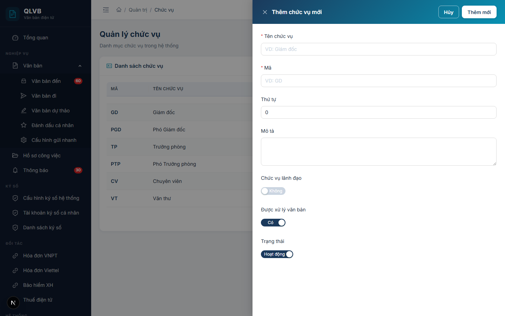

Khi bấm **Thêm chức vụ** hoặc **Sửa thông tin**, hệ thống mở cửa sổ phía bên phải màn hình với các trường sau:

| Tên trường | Bắt buộc | Mô tả & ràng buộc |
|---|---|---|
| **Tên chức vụ** | Có | Tên đầy đủ của chức vụ (ví dụ: `Giám đốc`, `Phó Trưởng phòng`). Tối đa 100 ký tự. Nếu để trống, hệ thống báo lỗi "Tên chức vụ là bắt buộc". |
| **Mã** | Có | Mã ngắn dùng để tham chiếu (ví dụ: `GD`, `PTP`, `CV`). Tối đa 20 ký tự. **Mã phải duy nhất trong toàn hệ thống** (không phân biệt chữ hoa/thường) — nếu trùng, hệ thống sẽ báo lỗi "Mã chức vụ đã tồn tại". |
| **Thứ tự** | Không | Số nguyên không âm, dùng để sắp xếp thứ tự hiển thị. Số nhỏ đứng trước. Mặc định là 0. Nên đặt theo cấp bậc — ví dụ Giám đốc = 1, Phó Giám đốc = 2, Trưởng phòng = 10, Chuyên viên = 50. |
| **Mô tả** | Không | Mô tả thêm về chức năng, nhiệm vụ của chức vụ. Tối đa 500 ký tự, dạng vùng văn bản nhiều dòng. |
| **Chức vụ lãnh đạo** | Không | Công tắc bật/tắt — quy định chức vụ này có quyền **giao việc, phân công xử lý, cho ý kiến chỉ đạo, ký duyệt** hay không. Mặc định: tắt. |
| **Được xử lý văn bản** | Không | Công tắc bật/tắt — quy định cán bộ giữ chức vụ này có được nhận văn bản giao xử lý hay không. Mặc định: bật. |
| **Trạng thái** | Không | Công tắc **Hoạt động / Ngừng**. Khi đặt **Ngừng**, chức vụ vẫn còn trong hệ thống nhưng không nên dùng cho cán bộ mới. Mặc định khi tạo mới: Hoạt động. |

> **Lưu ý**: Sau khi điền xong, bấm **Thêm mới** (khi tạo) hoặc **Cập nhật** (khi sửa) ở góc trên bên phải cửa sổ. Các thông báo sai sẽ hiển thị ngay dưới ô nhập tương ứng để người dùng dễ phát hiện và sửa.

---

### 5. Các nút chức năng

| Nút | Vị trí | Khi nào hiển thị | Tác dụng |
|---|---|---|---|
| **Thêm chức vụ** | Góc trên bên phải khung "Danh sách chức vụ" | Luôn hiển thị | Mở cửa sổ Thêm chức vụ mới với các giá trị mặc định: Trạng thái = Hoạt động, Thứ tự = 0, Lãnh đạo = Không, Được xử lý văn bản = Có. |
| **Ô tìm kiếm "Tìm kiếm..."** | Góc trên bên phải khung "Danh sách chức vụ" | Luôn hiển thị | Lọc bảng theo từ khóa nhập. Tìm cả trong **Tên** và **Mã**. Có nút xóa nhanh để bỏ từ khóa. |
| **Sửa thông tin** | Trong menu ba chấm trên mỗi dòng | Luôn hiển thị | Mở cửa sổ Cập nhật chức vụ với dữ liệu hiện có để chỉnh sửa. |
| **Xóa** | Trong menu ba chấm trên mỗi dòng (mục cuối, màu đỏ) | Luôn hiển thị | Mở hộp xác nhận, sau đó xóa chức vụ. **Chỉ xóa được khi không có nhân viên nào giữ chức vụ đó** (xem mục 7). |
| **Thêm mới** / **Cập nhật** | Góc trên bên phải cửa sổ Thêm/Sửa | Trong cửa sổ Thêm/Sửa | Lưu dữ liệu vừa nhập. Nhãn nút thay đổi tùy theo đang Thêm mới hay Cập nhật. |
| **Hủy** | Góc trên bên phải cửa sổ Thêm/Sửa | Trong cửa sổ Thêm/Sửa | Đóng cửa sổ, không lưu thay đổi. |
| **Xóa** / **Hủy** trong hộp xác nhận | Trong hộp xác nhận xóa | Khi mở hộp xác nhận | **Xóa** (màu đỏ) — thực hiện xóa. **Hủy** — đóng hộp, không xóa. |
| **Phân trang** | Phía dưới bảng | Khi tổng số bản ghi vượt số dòng/trang | Chuyển trang, đổi số dòng/trang. Hiển thị tổng số chức vụ. |

---

### 6. Quy trình thao tác chính

#### 6.1. Thêm mới một chức vụ

1. Bấm nút **Thêm chức vụ** ở góc trên bên phải khung "Danh sách chức vụ".
2. Trong cửa sổ **Thêm chức vụ mới**, điền:
   - **Tên chức vụ** (bắt buộc): tên đầy đủ — ví dụ `Trưởng phòng Tổ chức cán bộ`.
   - **Mã** (bắt buộc): mã ngắn không trùng chức vụ nào khác — ví dụ `TP-TCCB`.
   - **Thứ tự**: nhập số phù hợp với cấp bậc của chức vụ (xem mục 7.4).
   - **Chức vụ lãnh đạo**: bật nếu chức vụ này được giao việc / ký duyệt.
   - **Được xử lý văn bản**: giữ bật nếu cán bộ giữ chức vụ này có thể nhận văn bản xử lý; tắt với chức vụ thuần lãnh đạo không trực tiếp xử lý.
   - **Mô tả** (tùy chọn): mô tả vai trò chức vụ.
3. Bấm **Thêm mới**.
4. Hệ thống thông báo **"Thêm thành công"** và đóng cửa sổ. Bảng tự động cập nhật.

*[Hình minh họa: Cửa sổ Thêm chức vụ đã điền dữ liệu]*

#### 6.2. Chỉnh sửa thông tin một chức vụ

1. Tìm chức vụ cần sửa trên bảng (có thể dùng ô tìm kiếm để thu hẹp danh sách).
2. Trên dòng tương ứng, bấm biểu tượng **ba chấm dọc** ở cột cuối → chọn **Sửa thông tin**.
3. Cửa sổ **Cập nhật chức vụ** mở ra với dữ liệu sẵn có. Sửa các thông tin cần thiết.
4. Bấm **Cập nhật**.
5. Hệ thống thông báo **"Cập nhật thành công"** và đóng cửa sổ.

> Khi đổi công tắc **Chức vụ lãnh đạo** hoặc **Được xử lý văn bản**, thay đổi sẽ ảnh hưởng đến **tất cả cán bộ đang giữ chức vụ đó**. Hãy cân nhắc kỹ vì việc này có thể làm thay đổi quyền giao việc / nhận văn bản của hàng loạt cán bộ.

#### 6.3. Ngừng / Kích hoạt lại một chức vụ

Hệ thống không có nút Khóa/Mở khóa riêng. Để **ngừng** một chức vụ (không cho dùng nữa), thao tác như sau:

1. Mở cửa sổ **Sửa thông tin** chức vụ cần ngừng.
2. Tắt công tắc **Trạng thái** (chuyển sang **Ngừng**).
3. Bấm **Cập nhật**.
4. Để kích hoạt lại, mở cửa sổ Sửa thông tin và bật lại công tắc Trạng thái về **Hoạt động**.

> **Khi nào nên ngừng?** Khi một chức vụ không còn dùng theo cơ cấu mới (sau tái cơ cấu, sát nhập), nhưng vẫn còn cán bộ trong lịch sử giữ chức vụ đó. Ngừng giúp ngăn việc gán chức vụ này cho cán bộ mới, đồng thời vẫn giữ nguyên dữ liệu lịch sử.

#### 6.4. Xóa chức vụ

1. Tìm chức vụ cần xóa.
2. Bấm biểu tượng **ba chấm dọc** ở cột cuối → chọn **Xóa** (mục cuối, màu đỏ).
3. Hộp xác nhận hiện ra với câu hỏi *"Bạn có chắc chắn muốn xóa chức vụ này?"*.

   *[Hình minh họa: Hộp xác nhận xóa]*
4. Bấm **Xóa** (màu đỏ) để xác nhận, hoặc **Hủy** để bỏ qua.
5. Nếu xóa được, hệ thống thông báo **"Xóa thành công"**.
6. Nếu không xóa được (chức vụ còn nhân viên), hệ thống báo lỗi rõ lý do (xem mục 7).

> **Quan trọng**: Khác với một số danh mục khác, chức vụ thực hiện **xóa cứng** — bản ghi bị xóa hẳn khỏi cơ sở dữ liệu nếu thỏa mãn điều kiện xóa. Hãy cân nhắc kỹ trước khi xóa, hoặc dùng phương án **Ngừng** ở mục 6.3 để bảo toàn lịch sử.

#### 6.5. Tìm kiếm chức vụ

1. Trên ô **Tìm kiếm...** ở góc trên bên phải khung "Danh sách chức vụ", gõ một phần **Tên** hoặc **Mã** chức vụ.
2. Nhấn Enter (hoặc bấm biểu tượng kính lúp). Bảng sẽ tự động lọc, chỉ hiển thị các chức vụ khớp.
3. Bấm biểu tượng **dấu nhân** trong ô tìm kiếm để xóa từ khóa và hiển thị lại toàn bộ danh sách.

---

### 7. Lưu ý / Ràng buộc nghiệp vụ

#### 7.1. "Chức vụ lãnh đạo" — ý nghĩa nghiệp vụ

Công tắc **Chức vụ lãnh đạo** quyết định cán bộ giữ chức vụ đó có được phép thực hiện các hành vi của lãnh đạo trong toàn hệ thống hay không, bao gồm:

- **Giao việc, phân công xử lý** trong luồng Văn bản đến.
- **Cho ý kiến chỉ đạo** trên văn bản đến.
- **Ký duyệt** dự thảo văn bản đi, hồ sơ công việc.
- **Nhận báo cáo, theo dõi tiến độ** từ cấp dưới.

Các chức vụ thường được đánh dấu **Có** (Lãnh đạo): Giám đốc, Phó Giám đốc, Trưởng phòng, Phó Trưởng phòng, Chánh Văn phòng.

Các chức vụ thường được đánh dấu **Không**: Chuyên viên, Văn thư, Thư ký, Cán sự.

#### 7.2. "Được xử lý văn bản" — ý nghĩa nghiệp vụ

Công tắc **Được xử lý văn bản** quyết định cán bộ giữ chức vụ đó có xuất hiện trong **danh sách chọn người xử lý** ở các màn hình giao việc / phân công hay không.

- Bật (mặc định khi tạo mới): áp dụng cho hầu hết các chức vụ — chuyên viên, trưởng phòng, văn thư.
- Tắt: áp dụng cho các chức vụ thuần đại diện, không trực tiếp xử lý văn bản — ví dụ một số chức vụ kiêm nhiệm.

#### 7.3. Mã chức vụ phải duy nhất

Trong toàn hệ thống, **mỗi mã chức vụ chỉ tồn tại một lần** (không phân biệt chữ hoa / chữ thường). Khi nhập trùng, hệ thống báo:

> *"Mã chức vụ đã tồn tại"*

Lỗi này hiển thị ngay tại ô **Mã** trong cửa sổ nhập để người dùng dễ phát hiện.

#### 7.4. Thứ tự sắp xếp

Số ở trường **Thứ tự** quyết định vị trí hiển thị của chức vụ trong bảng và trong các danh sách chọn chức vụ ở các màn hình khác (ví dụ: màn hình Quản trị > Người dùng). Số nhỏ đứng trước số lớn. Khi nhiều chức vụ cùng số thứ tự, hệ thống tiếp tục sắp xếp theo tên (theo bảng chữ cái).

Khuyến nghị đặt theo cấp bậc nghiệp vụ — ví dụ:

- Giám đốc = 1
- Phó Giám đốc = 2
- Trưởng phòng = 10
- Phó Trưởng phòng = 11
- Chuyên viên = 50
- Văn thư = 90

#### 7.5. Không xóa được chức vụ còn nhân viên đang giữ

Hệ thống ngăn xóa nếu chức vụ vẫn còn cán bộ đang gắn vào, kèm thông báo rõ số lượng:

> *"Không thể xóa: còn N nhân viên đang sử dụng chức vụ này"*

Trong đó **N** là số cán bộ đang giữ chức vụ đó (cũng chính là số ở cột **Số NV** của bảng).

Cách xử lý:

- Vào màn hình **Quản trị > Người dùng**, chuyển từng cán bộ sang chức vụ khác phù hợp.
- Sau khi cột **Số NV** về 0, thao tác xóa sẽ thành công.
- Nếu không thể chuyển toàn bộ cán bộ, hãy chọn phương án **Ngừng** ở mục 6.3 thay vì xóa.

#### 7.6. Mã và tên — không nên thay đổi sau khi đã sử dụng

Mặc dù hệ thống cho phép sửa **Mã** và **Tên** chức vụ bất kỳ lúc nào, nhưng nếu chức vụ đã được gán cho nhiều cán bộ và đã xuất hiện trên các văn bản, hồ sơ trong quá khứ, việc đổi tên sẽ làm thay đổi cách hiển thị trong toàn bộ lịch sử nghiệp vụ. Khuyến nghị:

- Chỉ sửa khi phát hiện sai chính tả hoặc sai mã ngay sau khi tạo.
- Nếu cần đổi cấu trúc chức vụ (theo cơ cấu mới), nên **tạo chức vụ mới + ngừng chức vụ cũ + chuyển dần cán bộ** thay vì sửa trực tiếp.

#### 7.7. Bảng tổng hợp các thông báo của hệ thống

| Tình huống | Thông báo |
|---|---|
| Thêm chức vụ thành công | Thêm thành công |
| Cập nhật chức vụ thành công | Cập nhật thành công |
| Xóa chức vụ thành công | Xóa thành công |
| Để trống Tên chức vụ | Tên chức vụ là bắt buộc |
| Mã chức vụ trùng | Mã chức vụ đã tồn tại |
| Sửa nhưng không tìm thấy bản ghi | Không tìm thấy chức vụ |
| Tạo mới thất bại do lỗi hệ thống | Không thể tạo chức vụ |
| Xóa chức vụ còn nhân viên | Không thể xóa: còn N nhân viên đang sử dụng chức vụ này |
| Xác nhận trước khi xóa | Bạn có chắc chắn muốn xóa chức vụ này? |
| Lỗi tải danh sách | Lỗi tải dữ liệu |
| Lỗi khi xóa | Lỗi khi xóa |
| Trường Tên chức vụ trống (cảnh báo trên form) | Nhập tên chức vụ |
| Trường Mã trống (cảnh báo trên form) | Nhập mã |

---

*Tài liệu được biên soạn dựa trên hệ thống thực tế đang triển khai. Mọi thắc mắc vui lòng liên hệ với đội phát triển để được hỗ trợ.*


\newpage

## Hướng dẫn sử dụng: Màn hình Quản trị > Người dùng

Tài liệu này mô tả đầy đủ các chức năng có trong màn hình **Quản trị > Người dùng** của hệ thống Quản lý văn bản điện tử (e-Office), giúp người dùng hiểu rõ cách sử dụng và quy trình nghiệp vụ.

---

### 1. Giới thiệu

Màn hình **Quản trị > Người dùng** dùng để quản lý toàn bộ tài khoản truy cập hệ thống e-Office: cán bộ, công chức, viên chức của các đơn vị / phòng ban. Đây là màn hình **quan trọng nhất phần Quản trị** vì nó quyết định **ai được vào hệ thống**, **vào với danh nghĩa nào**, **làm việc trong đơn vị nào** và **được phép làm gì** thông qua các nhóm quyền đã gán.

Vì là dữ liệu nhạy cảm liên quan tới tài khoản và mật khẩu nên màn hình này **chỉ dành cho tài khoản Quản trị hệ thống**. Người dùng thông thường không truy cập được vào đây.

Mỗi thay đổi trên màn hình này đều ảnh hưởng đến phiên đăng nhập, phân quyền, định tuyến văn bản và các luồng nghiệp vụ liên quan tới người dùng đó. Cần thao tác cẩn thận, đặc biệt ở các chức năng **Khóa tài khoản**, **Reset mật khẩu**, **Phân quyền** và **Xóa người dùng**.

---

### 2. Bố cục màn hình

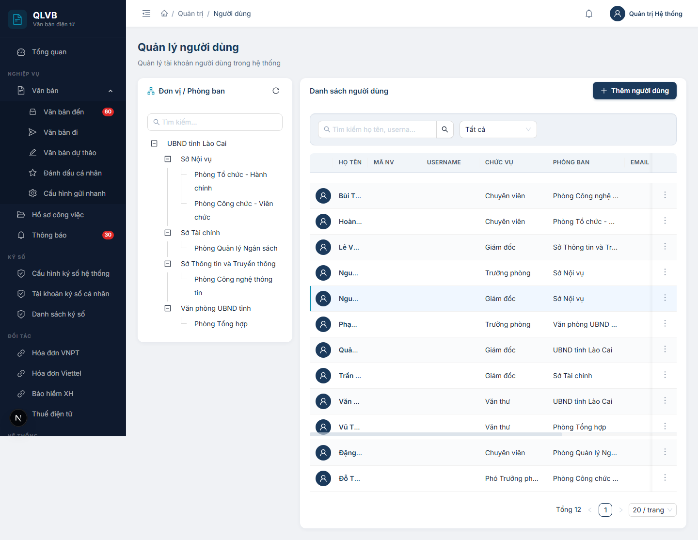

Màn hình được chia thành 2 cột chính cùng phần đầu trang:

- **Phần đầu trang**: Hiển thị tiêu đề "Quản lý người dùng" và dòng mô tả ngắn "Quản lý tài khoản người dùng trong hệ thống".
- **Cột trái — Đơn vị / Phòng ban (cây phân cấp)**:
  - Ô tìm kiếm nhanh ở phía trên cây.
  - Cây phân cấp đơn vị / phòng ban (mặc định mở rộng tất cả các nhánh).
  - Nút **Tải lại** (biểu tượng mũi tên xoay tròn) ở góc trên bên phải để tải lại cây sau khi có thay đổi.
  - Bấm vào một nhánh trên cây sẽ lọc bảng bên phải chỉ hiển thị các người dùng thuộc nhánh đó.
- **Cột phải — Danh sách người dùng**:
  - Thanh lọc nhanh: ô tìm kiếm theo họ tên / username + bộ lọc trạng thái (Tất cả / Hoạt động / Đã khóa).
  - Bảng dữ liệu hiển thị các người dùng tương ứng với nhánh đã chọn (mặc định hiển thị toàn bộ).
  - Nút **Thêm người dùng** (biểu tượng dấu cộng, màu xanh) ở góc trên bên phải bảng để mở cửa sổ thêm mới.
  - Mỗi dòng có nút thao tác hình **ba chấm dọc** ở cột cuối cùng, chứa các lệnh: Sửa thông tin, Phân quyền, Khóa / Mở khóa tài khoản, Reset mật khẩu, Xóa người dùng.
  - Phía dưới bảng có thanh phân trang (mặc định 20 bản ghi / trang).
- **Cửa sổ phụ (Drawer / Modal)**:
  - **Drawer Thêm người dùng / Sửa người dùng** — mở ra từ bên phải khi bấm Thêm hoặc Sửa.
  - **Drawer Phân quyền** — mở ra từ bên phải khi bấm Phân quyền, hiển thị danh sách nhóm quyền có thể gán.
  - **Hộp xác nhận Reset mật khẩu** và **Hộp xác nhận xóa** — mở khi bấm chức năng tương ứng, yêu cầu xác nhận trước khi thực hiện.

---

### 3. Các cột trong Bảng danh sách người dùng

| Tên cột | Mô tả |
|---|---|
| **Ảnh đại diện** | Hiển thị ảnh đại diện (avatar) của người dùng. Nếu chưa có ảnh, hệ thống hiển thị biểu tượng người trên nền xanh navy. |
| **Họ tên** | Họ và tên đầy đủ của người dùng (hệ thống tự ghép từ "Họ và tên đệm" + "Tên"), in đậm, màu xanh navy. |
| **Mã NV** | Mã nhân viên do hệ thống tự sinh khi tạo mới (định dạng `NVxxxxxx`). In đậm, màu xanh navy. |
| **Username** | Tên đăng nhập dùng để vào hệ thống. Luôn ở dạng chữ thường, không có khoảng trắng. |
| **Chức vụ** | Tên chức vụ hiện tại của người dùng (lấy từ danh mục Chức vụ). Có thể trống nếu chưa gán. |
| **Phòng ban** | Tên phòng ban (hoặc đơn vị) trực tiếp của người dùng. |
| **Email** | Địa chỉ email công vụ. Nếu dài sẽ tự động cắt và hiện tooltip khi rê chuột. |
| **SDT** | Số điện thoại liên hệ. Nếu để trống số bàn, hệ thống tự lấy số di động hiển thị. |
| **Trạng thái** | **Hoạt động** (nhãn xanh lá) hoặc **Đã khóa** (nhãn đỏ). Tài khoản bị khóa sẽ không thể đăng nhập hệ thống. |
| (cột thao tác) | Nút ba chấm dọc, mở menu các lệnh: Sửa thông tin, Phân quyền, Khóa / Mở khóa tài khoản, Reset mật khẩu, Xóa người dùng. |

---

### 4. Các trường nhập liệu trong cửa sổ Thêm / Sửa người dùng

*[Hình minh họa: Cửa sổ Thêm người dùng]*

Khi bấm **Thêm người dùng** hoặc **Sửa thông tin**, hệ thống mở cửa sổ phía bên phải màn hình, được chia thành 2 cột thông tin.

#### 4.1. Cột trái — Thông tin tài khoản và cá nhân

| Tên trường | Bắt buộc | Mô tả & ràng buộc |
|---|---|---|
| **Tên đăng nhập** | Có | Tên dùng để đăng nhập vào hệ thống. Tối thiểu 3 ký tự, tối đa 50 ký tự. **Chỉ chấp nhận chữ cái, số, dấu chấm `.`, gạch dưới `_`, gạch ngang `-`** — không có khoảng trắng, không có dấu tiếng Việt. Hệ thống sẽ tự chuyển về chữ thường. **Phải duy nhất trong toàn hệ thống** — nếu trùng báo "Tên đăng nhập đã tồn tại". Trường này **không sửa được sau khi đã tạo** (bị mờ đi khi sửa). |
| **Mật khẩu** | Không (chỉ hiện khi tạo mới) | Mật khẩu khởi tạo cho tài khoản. Tối thiểu 6 ký tự, **phải chứa cả chữ hoa, chữ thường và số**. Tối đa 50 ký tự. Nếu để trống, hệ thống dùng mật khẩu mặc định **`Admin@123`**. Người dùng sẽ được yêu cầu đổi mật khẩu trong lần đăng nhập đầu tiên. Trường này **không hiển thị trong cửa sổ Sửa** — muốn đặt lại mật khẩu phải dùng chức năng "Reset mật khẩu" ở menu ba chấm. |
| **Họ và tên đệm** | Có | Phần Họ và Tên đệm (ví dụ: `Nguyễn Văn`). Tối đa 50 ký tự. Để trống sẽ báo "Họ và tên là bắt buộc". |
| **Tên** | Có | Phần Tên (ví dụ: `An`). Tối đa 50 ký tự. Hệ thống tự ghép thành "Họ tên đầy đủ" để hiển thị trên bảng. Để trống sẽ báo "Họ và tên là bắt buộc". |
| **Email** | Không | Email công vụ. Tối đa 100 ký tự. Phải đúng định dạng email (có `@` và phần đuôi tên miền). Sai định dạng báo "Email không đúng định dạng". **Phải duy nhất trong toàn hệ thống** — nếu trùng (kể cả khác chữ hoa / chữ thường) sẽ báo "Email đã được sử dụng". |
| **Số điện thoại** | Không | Số điện thoại bàn / cơ quan. Tối đa 20 ký tự. Chấp nhận chữ số, dấu cộng `+`, dấu trừ `-`, khoảng trắng và ngoặc tròn `(`, `)`. Độ dài hợp lệ từ 8 đến 15 ký tự. Sai định dạng báo "Số điện thoại không đúng định dạng". |
| **Di động** | Không | Số điện thoại di động. Tối đa 20 ký tự. Quy tắc định dạng giống Số điện thoại. Sai định dạng báo "Số di động không đúng định dạng". |

#### 4.2. Cột phải — Tổ chức và thông tin cá nhân

| Tên trường | Bắt buộc | Mô tả & ràng buộc |
|---|---|---|
| **Đơn vị** | Có | Đơn vị (cấp Sở / Ban / Ngành) mà người dùng trực thuộc. Ô chọn dạng cây phân cấp, có nút xóa nhanh. Khi chọn đơn vị, danh sách "Phòng ban" bên dưới sẽ tự động cập nhật. Khi đang chọn một nhánh trên cây bên trái rồi mới bấm Thêm, ô này sẽ được điền sẵn nhánh đang chọn. Để trống báo "Đơn vị và phòng ban là bắt buộc". |
| **Phòng ban** | Có | Phòng ban trực tiếp trong đơn vị đã chọn. Chỉ có thể chọn sau khi đã chọn Đơn vị. Khi đổi Đơn vị, ô này sẽ tự xóa giá trị cũ. Để trống báo "Đơn vị và phòng ban là bắt buộc". |
| **Chức vụ** | Không | Chức vụ chính thức của người dùng (lấy từ danh mục Chức vụ). |
| **Giới tính** | Không (mặc định: Nam) | Chọn một trong ba: **Nam** / **Nữ** / **Khác**. |
| **Ngày sinh** | Không | Ngày sinh của người dùng, định dạng `DD/MM/YYYY`. |
| **Địa chỉ** | Không | Địa chỉ liên hệ. Không giới hạn cứng nhưng khuyến nghị tối đa 500 ký tự (có hiển thị bộ đếm ký tự). |

> **Lưu ý**: Sau khi điền xong, bấm **Thêm mới** (khi tạo) hoặc **Cập nhật** (khi sửa) ở góc trên bên phải cửa sổ. Các thông báo sai định dạng sẽ hiển thị ngay dưới ô nhập tương ứng để dễ phát hiện và sửa.

#### 4.3. Cửa sổ Phân quyền

*[Hình minh họa: Cửa sổ Phân quyền người dùng]*

Cửa sổ này không có trường nhập tự do mà gồm danh sách thẻ chọn (checkbox card):

| Mục | Mô tả |
|---|---|
| **Tiêu đề** | "Phân quyền: <Họ tên người dùng>". |
| **Dòng mô tả** | "Chọn nhóm quyền cho người dùng <Họ tên> (<username>)". |
| **Danh sách nhóm quyền** | Mỗi nhóm quyền hiển thị thành 1 thẻ vuông gồm tên nhóm (in đậm) và mô tả (chữ xám). Bấm vào thẻ hoặc tích vào ô vuông để chọn / bỏ chọn. Thẻ được chọn có viền và nền xanh teal nhạt. Một người dùng có thể được gán **nhiều nhóm quyền cùng lúc**. |

---

### 5. Các nút chức năng

| Nút | Vị trí | Khi nào hiển thị | Tác dụng |
|---|---|---|---|
| **Thêm người dùng** | Góc trên bên phải bảng danh sách | Luôn hiển thị | Mở cửa sổ Thêm người dùng. Nếu đang chọn một nhánh trên cây, đơn vị / phòng ban tương ứng sẽ được điền sẵn vào form. |
| **Tải lại** (biểu tượng mũi tên xoay tròn) | Góc trên bên phải khung "Đơn vị / Phòng ban" | Luôn hiển thị | Tải lại toàn bộ cây đơn vị từ máy chủ. Dùng khi nghi ngờ dữ liệu không đồng bộ. |
| **Ô tìm kiếm "Tìm kiếm..."** trong cây | Phía trên cây phân cấp | Luôn hiển thị | Lọc các nhánh trên cây theo từ khóa nhập. Có nút xóa nhanh. |
| **Ô tìm kiếm "Tìm kiếm họ tên, username..."** | Phía trên bảng | Luôn hiển thị | Tìm theo họ tên đầy đủ, tên đăng nhập, email hoặc mã nhân viên. Bấm Enter hoặc biểu tượng kính lúp để tìm. |
| **Bộ lọc trạng thái** | Cạnh ô tìm kiếm | Luôn hiển thị | Lọc theo trạng thái tài khoản: Tất cả / Hoạt động / Đã khóa. |
| **Sửa thông tin** | Trong menu ba chấm trên mỗi dòng | Luôn hiển thị | Mở cửa sổ Sửa người dùng với dữ liệu sẵn có. Tên đăng nhập và Mật khẩu **không sửa được** ở đây. |
| **Phân quyền** | Trong menu ba chấm trên mỗi dòng | Luôn hiển thị | Mở cửa sổ Phân quyền để gán / bỏ gán các nhóm quyền cho người dùng. |
| **Khóa tài khoản** | Trong menu ba chấm trên mỗi dòng | Khi tài khoản đang ở trạng thái **Hoạt động** | Khóa tài khoản — người dùng không thể đăng nhập cho tới khi mở khóa lại. |
| **Mở khóa tài khoản** | Trong menu ba chấm trên mỗi dòng | Khi tài khoản đang ở trạng thái **Đã khóa** | Mở khóa tài khoản, đưa về trạng thái **Hoạt động**. |
| **Reset mật khẩu** | Trong menu ba chấm trên mỗi dòng | Luôn hiển thị | Mở hộp xác nhận, sau đó đặt lại mật khẩu của người dùng về **`Admin@123`**. Người dùng phải đổi mật khẩu trong lần đăng nhập tiếp theo. |
| **Xóa người dùng** | Trong menu ba chấm trên mỗi dòng (mục cuối, màu đỏ) | Luôn hiển thị | Mở hộp xác nhận, sau đó xóa người dùng (xóa mềm — xem mục 7). |
| **Thêm mới** / **Cập nhật** | Góc trên bên phải cửa sổ Thêm/Sửa | Trong cửa sổ Thêm/Sửa | Lưu dữ liệu vừa nhập. Nhãn nút thay đổi tùy theo đang Thêm mới hay Cập nhật. |
| **Hủy** | Góc trên bên phải cửa sổ Thêm/Sửa | Trong cửa sổ Thêm/Sửa | Đóng cửa sổ, không lưu thay đổi. |
| **Lưu** | Góc trên bên phải cửa sổ Phân quyền | Trong cửa sổ Phân quyền | Lưu danh sách nhóm quyền đã chọn cho người dùng. |
| **Reset** / **Hủy** trong hộp Reset mật khẩu | Trong hộp xác nhận | Khi mở hộp xác nhận | **Reset** — xác nhận đặt lại mật khẩu. **Hủy** — đóng hộp, không thực hiện. |
| **Xóa** / **Hủy** trong hộp Xác nhận xóa | Trong hộp xác nhận | Khi mở hộp xác nhận | **Xóa** (màu đỏ) — thực hiện xóa. **Hủy** — đóng hộp, không xóa. |

---

### 6. Quy trình thao tác chính

#### 6.1. Thêm mới một người dùng

1. (Tùy chọn) Trên cây bên trái, bấm chọn nhánh đơn vị / phòng ban muốn thêm người dùng vào — khi đó ô "Đơn vị" và "Phòng ban" trong cửa sổ thêm sẽ được điền sẵn.
2. Bấm nút **Thêm người dùng** ở góc trên bên phải bảng.
3. Trong cửa sổ Thêm người dùng, điền đầy đủ thông tin **Tên đăng nhập**, **Họ và tên đệm**, **Tên**, **Đơn vị** và **Phòng ban** (các trường bắt buộc).
4. (Tùy chọn) Nhập **Mật khẩu** khởi tạo. Nếu để trống, hệ thống sẽ dùng mặc định `Admin@123`.
5. Điền các thông tin còn lại (Email, SDT, Chức vụ, Giới tính, Ngày sinh, Địa chỉ) tùy nhu cầu.
6. Bấm **Thêm mới**.
7. Hệ thống thông báo **"Thêm thành công"** và đóng cửa sổ. Bảng bên phải tự động cập nhật.

> Sau khi tạo xong, để gán quyền cho người dùng, vào menu ba chấm → **Phân quyền** (xem mục 6.5).

#### 6.2. Chỉnh sửa thông tin một người dùng

1. Tìm người dùng cần sửa trên bảng (có thể chọn nhánh trên cây hoặc dùng ô tìm kiếm).
2. Trên dòng tương ứng, bấm biểu tượng **ba chấm dọc** ở cột cuối → chọn **Sửa thông tin**.
3. Cửa sổ **Sửa người dùng** mở ra với dữ liệu sẵn có. Tiêu đề có dạng "Sửa người dùng — <Mã NV>".
4. Sửa các thông tin cần thiết. Lưu ý: **Tên đăng nhập** không sửa được, **Mật khẩu** không hiện ở cửa sổ này.
5. Bấm **Cập nhật**.
6. Hệ thống thông báo **"Cập nhật thành công"** và đóng cửa sổ.

> Đổi **Đơn vị** sẽ làm rỗng ô **Phòng ban** — phải chọn lại Phòng ban mới trước khi lưu.

#### 6.3. Khóa / Mở khóa tài khoản

1. Tìm người dùng cần khóa hoặc mở khóa.
2. Bấm biểu tượng **ba chấm dọc** ở cột cuối.
3. Bấm **Khóa tài khoản** (nếu đang Hoạt động) hoặc **Mở khóa tài khoản** (nếu đang Đã khóa).
4. Hệ thống thông báo **"Đã khóa"** hoặc **"Đã mở khóa"** tương ứng. Cột **Trạng thái** trên bảng cập nhật ngay.

> **Khóa tài khoản** ngăn người dùng đăng nhập nhưng giữ nguyên toàn bộ dữ liệu lịch sử (văn bản đã xử lý, hồ sơ đã ký...). Dùng khi cán bộ nghỉ việc, nghỉ thai sản, đi học dài hạn — hoặc khi nghi ngờ tài khoản bị lộ thông tin đăng nhập.

#### 6.4. Đặt lại (Reset) mật khẩu

1. Tìm người dùng cần đặt lại mật khẩu.
2. Bấm biểu tượng **ba chấm dọc** ở cột cuối → chọn **Reset mật khẩu**.
3. Hộp xác nhận hiện ra với câu hỏi *"Mật khẩu của "<Họ tên>" sẽ được đặt về mặc định (Admin@123)?"*.
4. Bấm **Reset** để xác nhận, hoặc **Hủy** để bỏ qua.
5. Hệ thống thông báo **"Đã reset mật khẩu"**. Người dùng phải dùng mật khẩu **`Admin@123`** để đăng nhập và sẽ được yêu cầu đổi mật khẩu mới ngay sau đó.

> Chức năng này dùng khi người dùng quên mật khẩu hoặc tài khoản nghi ngờ bị xâm nhập. **Quản trị viên không xem được mật khẩu cũ** — hệ thống chỉ cho phép đặt lại về giá trị mặc định.

#### 6.5. Phân quyền cho người dùng

1. Tìm người dùng cần phân quyền.
2. Bấm biểu tượng **ba chấm dọc** ở cột cuối → chọn **Phân quyền**.
3. Cửa sổ **Phân quyền** mở ra hiển thị tất cả các nhóm quyền có trong hệ thống.
4. Tích chọn các nhóm quyền muốn gán cho người dùng (có thể chọn nhiều nhóm cùng lúc). Bấm vào thẻ hoặc ô vuông trong thẻ.
5. Bấm nút **Lưu** ở góc trên bên phải.
6. Hệ thống thông báo **"Lưu phân quyền thành công"** và đóng cửa sổ.

> Việc gán nhóm quyền quyết định người dùng được vào những menu nào, làm được những thao tác nghiệp vụ gì (gửi văn bản đến, ký số, lập sổ, duyệt ngân sách...). Cần làm theo đúng quy chế phân quyền của cơ quan.

#### 6.6. Xóa người dùng

1. Tìm người dùng cần xóa.
2. Bấm biểu tượng **ba chấm dọc** ở cột cuối → chọn **Xóa người dùng** (mục cuối, màu đỏ).
3. Hộp xác nhận hiện ra với câu hỏi *"Bạn có chắc chắn muốn xóa "<Họ tên>"?"*.

   *[Hình minh họa: Hộp xác nhận xóa người dùng]*
4. Bấm **Xóa** (màu đỏ) để xác nhận, hoặc **Hủy** để bỏ qua.
5. Nếu xóa được, hệ thống thông báo **"Xóa thành công"**.

> **Quan trọng**: Hệ thống thực hiện **xóa mềm** — tài khoản không bị xóa hẳn khỏi cơ sở dữ liệu mà được đánh dấu là đã xóa. Người dùng không còn truy cập được hệ thống và không hiển thị trong các danh sách nghiệp vụ. Tuy nhiên, dữ liệu lịch sử (văn bản đã ký, đã xử lý) vẫn được giữ nguyên để tra cứu / kiểm toán.

---

### 7. Lưu ý / Ràng buộc nghiệp vụ

#### 7.1. Tên đăng nhập là khóa duy nhất, không sửa được sau khi tạo

Mỗi tên đăng nhập chỉ tồn tại đúng **một lần** trong toàn hệ thống (so sánh **không phân biệt chữ hoa / chữ thường**). Khi tạo trùng, hệ thống báo:

> *"Tên đăng nhập đã tồn tại"*

Sau khi đã tạo, ô **Tên đăng nhập** trong cửa sổ Sửa sẽ bị mờ đi — không thể sửa lại được. Lý do: tên đăng nhập gắn với toàn bộ phiên đăng nhập, lịch sử thao tác và các bản ghi liên quan, nếu đổi sẽ phá vỡ tính toàn vẹn dữ liệu. Nếu cần đổi, phải tạo tài khoản mới và xóa tài khoản cũ.

#### 7.2. Quy tắc đặt mật khẩu

Mật khẩu (cả khi tạo mới và khi đổi mật khẩu) phải:

- **Tối thiểu 6 ký tự**.
- **Chứa cả chữ hoa, chữ thường và số**.

Nếu vi phạm, hệ thống báo: *"Mật khẩu phải có ít nhất 6 ký tự, chứa chữ hoa, chữ thường và số"*.

Mật khẩu mặc định cho tài khoản mới và sau khi reset là **`Admin@123`**. Người dùng sẽ được hệ thống nhắc đổi mật khẩu trong lần đăng nhập đầu tiên (cờ "đã đổi mật khẩu" được đặt thành chưa).

#### 7.3. Email phải duy nhất nếu có

Nếu có nhập email, mỗi email chỉ tồn tại đúng một lần trong toàn hệ thống (không phân biệt chữ hoa / chữ thường). Trùng email sẽ báo:

> *"Email đã được sử dụng"*

Email không bắt buộc nhưng nên có để hệ thống gửi thông báo, nhắc lịch họp và các email tự động khác.

#### 7.4. Đơn vị và Phòng ban phải đi đôi

Một người dùng **luôn phải thuộc cả Đơn vị (cấp lớn) và Phòng ban (cấp trực thuộc)**. Hệ thống tự lấy Đơn vị từ vị trí của Phòng ban trong cây tổ chức, nhưng vẫn yêu cầu nhập rõ ràng cả 2. Để trống một trong hai sẽ báo:

> *"Đơn vị và phòng ban là bắt buộc"*

Khi đổi Đơn vị, danh sách Phòng ban sẽ được làm mới — phải chọn lại Phòng ban tương ứng trước khi lưu.

#### 7.5. Định dạng Tên đăng nhập

- **Chỉ chấp nhận**: chữ cái Latin (a-z, A-Z), số (0-9), dấu chấm `.`, dấu gạch dưới `_`, dấu gạch ngang `-`.
- **Không chấp nhận**: dấu tiếng Việt, khoảng trắng, ký tự đặc biệt (`@`, `#`, `!`, `*`, ...).
- **Tối thiểu 3 ký tự**, tối đa 50 ký tự.

Hệ thống tự chuyển về **chữ thường** khi lưu (`Nguyen.A` → `nguyen.a`).

#### 7.6. Định dạng SDT, Di động, Email

- **SDT** và **Di động**: chỉ chấp nhận chữ số, dấu `+`, `-`, khoảng trắng và ngoặc tròn `(`, `)`. Độ dài hợp lệ từ 8 đến 15 ký tự.
- **Email**: phải đúng định dạng chuẩn (có `@` và phần đuôi tên miền).

Sai định dạng sẽ thấy thông báo đỏ ngay dưới ô nhập.

#### 7.7. Mã nhân viên do hệ thống tự sinh

Trường **Mã NV** (mã nhân viên) **không nhập tay** — hệ thống tự sinh khi tạo mới theo định dạng **`NV` + 6 chữ số** (ví dụ: `NV000123`). Mã này dùng để tham chiếu nội bộ và in trên các báo cáo.

#### 7.8. Tách biệt rõ "Sửa thông tin" và các thao tác bảo mật

Để bảo đảm an toàn, các thao tác liên quan tới mật khẩu / phân quyền **không nằm trong cửa sổ Sửa** mà tách thành các chức năng riêng:

- **Đổi mật khẩu của người khác** → chỉ qua "Reset mật khẩu" (về `Admin@123`).
- **Đổi mật khẩu của chính mình** → qua menu cá nhân, yêu cầu nhập mật khẩu hiện tại.
- **Đổi nhóm quyền** → qua "Phân quyền".
- **Khóa / Mở khóa** → qua "Khóa tài khoản" / "Mở khóa tài khoản".

Quản trị viên **không thể xem mật khẩu** của bất kỳ người dùng nào — kể cả của chính mình. Hệ thống chỉ lưu giá trị đã được biến đổi một chiều.

#### 7.9. Bảng tổng hợp các thông báo của hệ thống

| Tình huống | Thông báo |
|---|---|
| Thêm người dùng thành công | Thêm thành công |
| Cập nhật thông tin thành công | Cập nhật thành công |
| Xóa người dùng thành công | Xóa thành công |
| Khóa tài khoản | Đã khóa |
| Mở khóa tài khoản | Đã mở khóa |
| Reset mật khẩu thành công | Đã reset mật khẩu |
| Phản hồi đầy đủ từ máy chủ khi reset | Đã reset mật khẩu về mặc định (Admin@123) |
| Lưu phân quyền thành công | Lưu phân quyền thành công |
| Để trống Họ và Tên | Họ và tên là bắt buộc |
| Để trống Đơn vị hoặc Phòng ban | Đơn vị và phòng ban là bắt buộc |
| Tên đăng nhập trùng | Tên đăng nhập đã tồn tại |
| Tên đăng nhập dưới 3 ký tự | Tên đăng nhập phải có ít nhất 3 ký tự |
| Tên đăng nhập có ký tự cấm | Tên đăng nhập chỉ chứa chữ cái, số, dấu chấm, gạch ngang |
| Email trùng (khi sửa) | Email đã được sử dụng |
| Email sai định dạng | Email không đúng định dạng |
| SDT sai định dạng | Số điện thoại không đúng định dạng |
| Số di động sai định dạng | Số di động không đúng định dạng |
| Mật khẩu yếu (khi tạo) | Mật khẩu phải có ít nhất 6 ký tự / Mật khẩu phải chứa chữ hoa, chữ thường và số |
| Mật khẩu mới yếu (khi đổi) | Mật khẩu mới phải có ít nhất 6 ký tự, chứa chữ hoa, chữ thường và số |
| Đổi mật khẩu — thiếu mật khẩu cũ / mới | Mật khẩu cũ và mật khẩu mới là bắt buộc |
| Đổi mật khẩu — trùng mật khẩu cũ | Mật khẩu mới không được trùng với mật khẩu hiện tại |
| Đổi mật khẩu — sai mật khẩu hiện tại | Mật khẩu hiện tại không đúng |
| Không tìm thấy người dùng (đã xóa) | Không tìm thấy người dùng |
| Tạo người dùng thất bại | Không thể tạo người dùng |
| Lỗi tải dữ liệu | Lỗi tải dữ liệu / Lỗi tải cây đơn vị / Lỗi tải chi tiết người dùng / Lỗi tải nhóm quyền |
| Lỗi lưu phân quyền | Lỗi lưu phân quyền |
| Lỗi reset mật khẩu | Lỗi reset mật khẩu |
| Lỗi khi xóa | Lỗi khi xóa |

---

*Tài liệu được biên soạn dựa trên hệ thống thực tế đang triển khai. Mọi thắc mắc vui lòng liên hệ với đội phát triển để được hỗ trợ.*


\newpage

## Hướng dẫn sử dụng: Màn hình Quản trị > Nhóm quyền

Tài liệu này mô tả đầy đủ các chức năng có trong màn hình **Quản trị > Nhóm quyền** của hệ thống Quản lý văn bản điện tử (e-Office), giúp người dùng hiểu rõ cách sử dụng và quy trình nghiệp vụ.

---

### 1. Giới thiệu

Trong hệ thống e-Office, **nhóm quyền** (còn gọi là vai trò) là một tập hợp các quyền hạn được đặt tên — ví dụ: *Quản trị hệ thống*, *Văn thư*, *Lãnh đạo đơn vị*, *Cán bộ thường*. Mỗi nhóm quyền sẽ được gán một danh sách các **chức năng** mà nó được phép thao tác (xem danh sách văn bản, tạo văn bản đi, cấp số, ký số, quản trị hệ thống...).

Mỗi nhân viên có thể được gán **một hoặc nhiều nhóm quyền** cùng lúc. Khi nhân viên đăng nhập, hệ thống sẽ **cộng dồn** quyền hạn từ tất cả các nhóm quyền mà nhân viên đó thuộc về để xác định các thao tác được phép thực hiện. Ví dụ: một cán bộ vừa thuộc nhóm *Văn thư*, vừa thuộc nhóm *Lãnh đạo đơn vị* sẽ có quyền của cả hai nhóm.

Màn hình **Quản trị > Nhóm quyền** dùng để:

- Tạo mới, chỉnh sửa, xóa các nhóm quyền của cơ quan.
- **Phân quyền** cho từng nhóm — tức là chọn các chức năng mà nhóm quyền đó được phép sử dụng (qua cây chức năng có ô tích chọn).
- Theo dõi số lượng người dùng hiện đang được gán mỗi nhóm quyền.

Vì là dữ liệu nền tảng, ảnh hưởng tới quyền truy cập của toàn bộ cán bộ trong cơ quan, **màn hình này chỉ dành cho tài khoản Quản trị hệ thống**. Mỗi thay đổi (thêm chức năng cho nhóm, bỏ chức năng, xóa nhóm) sẽ tác động ngay lập tức đến những nhân viên thuộc nhóm đó.

Việc gán nhóm quyền cho từng nhân viên cụ thể được thực hiện ở màn hình **Quản trị > Người dùng** (nhân viên).

---

### 2. Bố cục màn hình

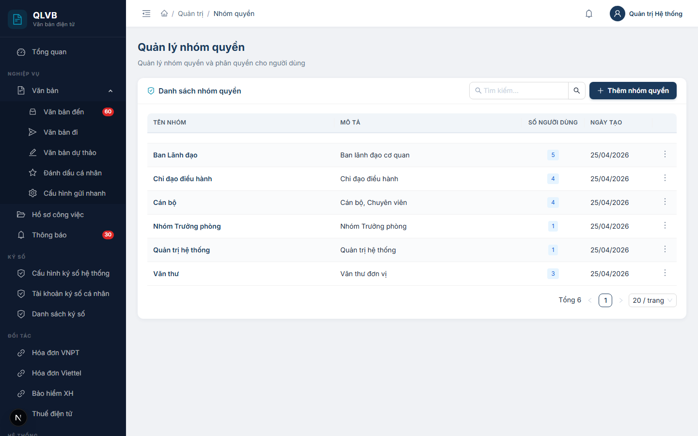

Màn hình gồm phần đầu trang và một khung nội dung chính:

- **Phần đầu trang**: Hiển thị tiêu đề "Quản lý nhóm quyền" và dòng mô tả ngắn "Quản lý nhóm quyền và phân quyền cho người dùng".
- **Khung "Danh sách nhóm quyền"**:
  - Tiêu đề khung kèm biểu tượng tấm khiên màu xanh teal.
  - Ở góc trên bên phải có **ô tìm kiếm** (theo tên nhóm quyền) và nút **Thêm nhóm quyền** (biểu tượng dấu cộng, màu xanh).
  - Bên dưới là **bảng dữ liệu** liệt kê các nhóm quyền hiện có, kèm phân trang ở cuối bảng.
  - Mỗi dòng có nút thao tác hình **ba chấm dọc** ở cột cuối cùng, chứa các lệnh: Sửa thông tin, Phân quyền, Xóa.
- **Cửa sổ phụ (Drawer / Modal)**:
  - **Drawer Thêm nhóm quyền mới / Cập nhật nhóm quyền** — mở ra từ bên phải khi bấm nút Thêm hoặc Sửa.
  - **Drawer Phân quyền** — mở ra từ bên phải khi bấm Phân quyền, hiển thị cây chức năng có ô tích chọn.
  - **Hộp xác nhận xóa** — mở khi bấm Xóa, yêu cầu xác nhận trước khi thực hiện.

---

### 3. Các cột trong Bảng danh sách nhóm quyền

| Tên cột | Mô tả |
|---|---|
| **Tên nhóm** | Tên của nhóm quyền — hiển thị in đậm, màu xanh navy. Ví dụ: *Quản trị hệ thống*, *Văn thư*, *Lãnh đạo đơn vị*. |
| **Mô tả** | Mô tả ngắn về vai trò của nhóm quyền. Nếu mô tả dài sẽ tự động cắt bớt và hiện tooltip khi rê chuột. |
| **Số người dùng** | Số lượng nhân viên hiện đang được gán nhóm quyền này. Hiển thị dạng nhãn nền xanh ở giữa ô. Số 0 nghĩa là chưa có ai dùng nhóm này. |
| **Ngày tạo** | Ngày nhóm quyền được tạo, định dạng `DD/MM/YYYY`. Nếu chưa có sẽ hiển thị dấu `-`. |
| (cột thao tác) | Nút ba chấm dọc ở cuối dòng, mở menu các lệnh: Sửa thông tin, Phân quyền, Xóa. |

Cuối bảng là thanh phân trang (chuyển trang, đổi số dòng / trang, hiển thị tổng số bản ghi dưới dạng *"Tổng N"*).

---

### 4. Các trường nhập liệu trong cửa sổ Thêm / Cập nhật nhóm quyền

*[Hình minh họa: Cửa sổ Thêm nhóm quyền mới]*

Khi bấm **Thêm nhóm quyền** hoặc **Sửa thông tin**, hệ thống mở cửa sổ phía bên phải màn hình với các trường sau:

| Tên trường | Bắt buộc | Mô tả & ràng buộc |
|---|---|---|
| **Tên nhóm quyền** | Có | Tên của nhóm quyền. Tối đa 100 ký tự. Ví dụ: *Quản trị hệ thống*, *Văn thư đi*. **Không phân biệt chữ hoa / chữ thường** — nếu trùng tên với một nhóm quyền khác (kể cả khác hoa thường), hệ thống báo *"Tên nhóm quyền đã tồn tại"*. Nếu để trống, hệ thống báo *"Tên nhóm quyền là bắt buộc"*. |
| **Mô tả** | Không | Mô tả vai trò, phạm vi sử dụng của nhóm quyền. Tối đa 500 ký tự, dạng vùng văn bản nhiều dòng. |

> **Lưu ý**: Cửa sổ Thêm/Sửa **chỉ chứa hai trường** trên. Việc chọn các chức năng cụ thể mà nhóm quyền này được phép sử dụng được thực hiện ở **một cửa sổ riêng** — *Phân quyền* (xem mục 4.1 dưới đây).

#### 4.1. Cửa sổ Phân quyền

*[Hình minh họa: Cửa sổ Phân quyền nhóm quyền]*

Khi bấm **Phân quyền** trong menu ba chấm của một dòng, hệ thống mở một cửa sổ riêng phía bên phải màn hình với:

- Tiêu đề dạng *"Phân quyền: **\<tên nhóm quyền\>**"*.
- Một **cây chức năng có ô tích chọn** (checkbox tree) — liệt kê toàn bộ các chức năng (menu) của hệ thống theo cấu trúc cha - con. Cha tích thì các con được tích theo; bỏ tích cha sẽ bỏ tích các con. Có thể tự tích / bỏ tích từng nút riêng lẻ.
- Mặc định cây mở rộng tất cả các nhánh để dễ rà soát.
- Các ô đã được tích sẵn tương ứng với các chức năng nhóm quyền hiện đang sở hữu.
- Nút **Lưu phân quyền** ở góc trên bên phải để ghi lại thay đổi.

Khi bấm **Lưu phân quyền**, hệ thống ghi đè toàn bộ danh sách chức năng của nhóm quyền theo các ô đang được tích — *các chức năng bị bỏ tích sẽ bị gỡ khỏi nhóm*. Sau khi lưu thành công, hệ thống thông báo *"Lưu phân quyền thành công"* và đóng cửa sổ.

---

### 5. Các nút chức năng

| Nút | Vị trí | Khi nào hiển thị | Tác dụng |
|---|---|---|---|
| **Thêm nhóm quyền** | Góc trên bên phải khung "Danh sách nhóm quyền" | Luôn hiển thị | Mở cửa sổ Thêm nhóm quyền mới. |
| **Ô tìm kiếm "Tìm kiếm..."** | Góc trên bên phải khung, cạnh nút Thêm | Luôn hiển thị | Lọc bảng theo từ khóa trên trường **Tên nhóm**. Có nút xóa nhanh từ khóa. |
| **Sửa thông tin** | Trong menu ba chấm trên mỗi dòng | Luôn hiển thị | Mở cửa sổ Cập nhật nhóm quyền với dữ liệu hiện có để chỉnh sửa Tên nhóm và Mô tả. |
| **Phân quyền** | Trong menu ba chấm trên mỗi dòng | Luôn hiển thị | Mở cửa sổ Phân quyền — cây chức năng có ô tích chọn — để chọn các chức năng nhóm quyền được phép sử dụng. |
| **Xóa** | Trong menu ba chấm trên mỗi dòng (mục cuối, màu đỏ) | Luôn hiển thị | Mở hộp xác nhận, sau đó xóa nhóm quyền. **Chỉ xóa được khi không còn nhân viên nào thuộc nhóm này** (xem mục 7). |
| **Thêm mới** / **Cập nhật** | Góc trên bên phải cửa sổ Thêm / Sửa | Trong cửa sổ Thêm / Sửa | Lưu dữ liệu vừa nhập. Nhãn nút thay đổi tùy đang Thêm mới hay Cập nhật. |
| **Hủy** | Góc trên bên phải cửa sổ Thêm / Sửa | Trong cửa sổ Thêm / Sửa | Đóng cửa sổ, không lưu thay đổi. |
| **Lưu phân quyền** | Góc trên bên phải cửa sổ Phân quyền | Trong cửa sổ Phân quyền | Ghi đè danh sách chức năng của nhóm quyền theo các ô đang tích trên cây. |
| **Xóa** / **Hủy** trong hộp xác nhận | Trong hộp xác nhận xóa | Khi mở hộp xác nhận | **Xóa** (màu đỏ) — thực hiện xóa. **Hủy** — đóng hộp, không xóa. |
| **Phân trang** | Cuối bảng | Luôn hiển thị | Chuyển trang, đổi số dòng mỗi trang. Hiển thị tổng số bản ghi dạng *"Tổng N"*. |

---

### 6. Quy trình thao tác chính

#### 6.1. Thêm mới một nhóm quyền

1. Bấm nút **Thêm nhóm quyền** ở góc trên bên phải khung danh sách.
2. Trong cửa sổ **Thêm nhóm quyền mới**, điền:
   - **Tên nhóm quyền** (bắt buộc): tên không trùng với nhóm quyền nào khác.
   - **Mô tả** (tùy chọn): mô tả ngắn vai trò, phạm vi sử dụng của nhóm.
3. Bấm **Thêm mới**.
4. Hệ thống thông báo **"Thêm thành công"** và đóng cửa sổ. Bảng danh sách tự động cập nhật.
5. Sau khi tạo xong, **bước tiếp theo** là vào menu ba chấm của nhóm vừa tạo → **Phân quyền** để chọn các chức năng cho nhóm (xem mục 6.3). Nếu bỏ qua bước này, nhóm quyền sẽ không có quyền hạn nào và việc gán nhóm cho nhân viên sẽ không có ý nghĩa.

*[Hình minh họa: Cửa sổ Thêm đã điền dữ liệu]*

#### 6.2. Chỉnh sửa thông tin một nhóm quyền

1. Tìm nhóm quyền cần sửa trên bảng (có thể dùng ô tìm kiếm theo tên nhóm để thu hẹp danh sách).
2. Trên dòng tương ứng, bấm biểu tượng **ba chấm dọc** ở cột cuối → chọn **Sửa thông tin**.
3. Cửa sổ **Cập nhật nhóm quyền** mở ra với dữ liệu sẵn có. Sửa **Tên nhóm quyền** và/hoặc **Mô tả**.
4. Bấm **Cập nhật**.
5. Hệ thống thông báo **"Cập nhật thành công"** và đóng cửa sổ.

> Việc sửa **Tên nhóm quyền** không làm thay đổi danh sách chức năng đã gán hay danh sách nhân viên thuộc nhóm — đây chỉ là đổi tên hiển thị.

#### 6.3. Phân quyền cho một nhóm quyền

1. Tìm nhóm quyền cần phân quyền trên bảng.
2. Bấm biểu tượng **ba chấm dọc** ở cột cuối → chọn **Phân quyền**.
3. Cửa sổ **Phân quyền: \<tên nhóm\>** mở ra. Chờ cây chức năng tải xong (có biểu tượng quay vòng nếu còn đang tải).
4. Trên cây chức năng:
   - **Tích vào ô** trước tên một chức năng để cấp quyền chức năng đó cho nhóm.
   - **Bỏ tích** để gỡ chức năng đó khỏi nhóm.
   - Tích vào nút cha sẽ tự động tích tất cả các nút con bên dưới; bỏ tích cha sẽ bỏ tích các con.
   - Có thể tự tích từng nút con riêng lẻ mà không cần tích cha.
5. Bấm **Lưu phân quyền** ở góc trên bên phải cửa sổ.
6. Hệ thống thông báo **"Lưu phân quyền thành công"** và đóng cửa sổ.

> **Quan trọng**: Phân quyền hoạt động theo nguyên tắc **ghi đè toàn bộ**. Mỗi lần bấm Lưu, hệ thống sẽ thay thế danh sách chức năng cũ bằng danh sách các ô đang được tích. Vì vậy phải tích đủ tất cả các chức năng muốn cấp cho nhóm — kể cả những chức năng đã được cấp trước đó nhưng vẫn muốn giữ lại.

#### 6.4. Xóa nhóm quyền

1. Tìm nhóm quyền cần xóa.
2. Bấm biểu tượng **ba chấm dọc** ở cột cuối → chọn **Xóa** (mục cuối cùng, màu đỏ).
3. Hộp xác nhận hiện ra với câu hỏi *"Bạn có chắc chắn muốn xóa nhóm quyền này?"*.

   *[Hình minh họa: Hộp xác nhận xóa]*
4. Bấm **Xóa** (màu đỏ) để xác nhận, hoặc **Hủy** để bỏ qua.
5. Nếu xóa được, hệ thống thông báo **"Xóa thành công"**. Toàn bộ phân quyền (danh sách chức năng đã tích) của nhóm cũng được gỡ theo.
6. Nếu nhóm còn nhân viên đang được gán, hệ thống không cho xóa và báo lỗi rõ số lượng (xem mục 7).

#### 6.5. Tìm kiếm nhóm quyền

1. Trên ô **Tìm kiếm...** ở góc trên bên phải khung danh sách, gõ một phần tên nhóm quyền cần tìm.
2. Bấm Enter (hoặc đợi vài giây) — bảng tự động lọc các dòng có **Tên nhóm** chứa từ khóa.
3. Bấm biểu tượng **dấu nhân** trong ô tìm kiếm để xóa từ khóa và hiển thị lại toàn bộ danh sách.

---

### 7. Lưu ý / Ràng buộc nghiệp vụ

#### 7.1. Cộng dồn quyền từ nhiều nhóm

Một nhân viên có thể thuộc nhiều nhóm quyền cùng lúc. Khi đó, quyền hạn của nhân viên là **hợp** của các chức năng có trong tất cả các nhóm. Không có khái niệm "trừ quyền" hay "ưu tiên giữa các nhóm" — chỉ cần **một** nhóm có chức năng đó là nhân viên có thể dùng.

Khi muốn thu hẹp quyền của một nhân viên, có hai cách:
- **Gỡ nhân viên khỏi nhóm có quyền đó** (làm ở màn hình *Quản trị > Người dùng*).
- **Bỏ tích chức năng khỏi nhóm quyền** (làm ở cửa sổ Phân quyền) — *cách này ảnh hưởng đến TẤT CẢ nhân viên thuộc nhóm*, cần cân nhắc.

#### 7.2. Tên nhóm quyền phải duy nhất

Trong toàn hệ thống, **mỗi tên nhóm quyền chỉ tồn tại một lần** (không phân biệt chữ hoa / chữ thường — *"Văn thư"* và *"VĂN THƯ"* được coi là trùng). Khi nhập trùng, hệ thống báo:

> *"Tên nhóm quyền đã tồn tại"*

Lỗi này hiển thị ngay tại ô **Tên nhóm quyền** trong cửa sổ nhập để người dùng dễ phát hiện.

#### 7.3. Không xóa được nhóm quyền còn nhân viên thuộc về

Hệ thống ngăn xóa nếu nhóm quyền còn ít nhất một nhân viên đang được gán:

> *"Không thể xóa: còn N nhân viên trong nhóm quyền này"*

(với *N* là số lượng nhân viên thực tế).

Cách xử lý:
- Vào màn hình **Quản trị > Người dùng**, gỡ nhóm quyền này khỏi từng nhân viên có liên quan.
- Sau khi *N* về 0, quay lại màn hình này để xóa.

#### 7.4. Phân quyền là ghi đè toàn bộ

Khi bấm **Lưu phân quyền**, hệ thống **xóa toàn bộ** danh sách chức năng cũ của nhóm và ghi lại theo các ô đang được tích trên cây. Nếu vô tình bỏ tích một số chức năng quan trọng trước khi lưu, các chức năng đó sẽ bị gỡ khỏi nhóm và toàn bộ nhân viên thuộc nhóm sẽ mất quyền tương ứng.

Khuyến nghị: trước khi mở cửa sổ Phân quyền để thay đổi, ghi nhớ (hoặc chụp màn hình) trạng thái tích hiện tại để có thể khôi phục nếu cần.

#### 7.5. Xóa nhóm sẽ gỡ luôn các chức năng đã phân quyền

Khi xóa thành công một nhóm quyền (sau khi đã gỡ hết nhân viên), toàn bộ danh sách các chức năng đã tích cho nhóm cũng bị xóa theo. Không có thao tác hoàn tác — nếu cần dùng lại, phải tạo nhóm mới và phân quyền lại từ đầu.

#### 7.6. Phạm vi đơn vị

Mỗi nhóm quyền được tạo dưới phạm vi đơn vị của người tạo (do hệ thống tự xác định theo phòng ban của tài khoản đang đăng nhập). Trong phiên bản hiện tại, danh sách hiển thị bao gồm các nhóm quyền của đơn vị hiện tại và các nhóm quyền dùng chung (không gắn đơn vị cụ thể). Người dùng quản trị thông thường không cần quan tâm đến chi tiết này.

#### 7.7. Bảng tổng hợp các thông báo của hệ thống

| Tình huống | Thông báo |
|---|---|
| Thêm nhóm quyền thành công | Thêm thành công |
| Cập nhật nhóm quyền thành công | Cập nhật thành công |
| Xóa nhóm quyền thành công | Xóa thành công |
| Lưu phân quyền thành công | Lưu phân quyền thành công |
| Để trống Tên nhóm quyền (cửa sổ nhập) | Nhập tên nhóm quyền |
| Để trống Tên nhóm quyền (lưu lên máy chủ) | Tên nhóm quyền là bắt buộc |
| Tên nhóm quyền trùng | Tên nhóm quyền đã tồn tại |
| Xóa nhóm còn nhân viên | Không thể xóa: còn N nhân viên trong nhóm quyền này |
| Không tạo được nhóm quyền (lỗi máy chủ) | Không thể tạo nhóm quyền |
| Không tìm thấy nhóm quyền khi cập nhật | Không tìm thấy nhóm quyền |
| Lỗi khi tải danh sách nhóm quyền | Lỗi tải dữ liệu |
| Lỗi khi tải cây chức năng / quyền hiện có | Lỗi tải quyền |
| Lỗi khi lưu phân quyền | Lỗi lưu phân quyền |
| Lỗi khi xóa | Lỗi khi xóa |

---

*Tài liệu được biên soạn dựa trên hệ thống thực tế đang triển khai. Mọi thắc mắc vui lòng liên hệ với đội phát triển để được hỗ trợ.*


\newpage

## Hướng dẫn sử dụng: Màn hình Quản trị > Sổ văn bản

Tài liệu này mô tả đầy đủ các chức năng có trong màn hình **Quản trị > Sổ văn bản** của hệ thống Quản lý văn bản điện tử (e-Office), giúp người dùng hiểu rõ cách sử dụng và quy trình nghiệp vụ.

---

### 1. Giới thiệu

Màn hình **Quản trị > Sổ văn bản** dùng để quản lý các **sổ văn bản** của đơn vị — đây là dữ liệu nền cốt lõi để cấp số cho **văn bản đến**, **văn bản đi** và **văn bản dự thảo**. Mỗi văn bản phát sinh trong hệ thống đều phải được vào một sổ tương ứng để theo dõi, lưu trữ và tra cứu sau này.

Sổ văn bản trong hệ thống được phân thành 3 nhóm theo loại nghiệp vụ:

- **Sổ văn bản đến** — dùng cho các văn bản gửi từ ngoài vào đơn vị.
- **Sổ văn bản đi** — dùng cho các văn bản đơn vị phát hành ra bên ngoài.
- **Sổ văn bản dự thảo** — dùng để theo dõi các bản thảo trong nội bộ trước khi phát hành.

Mỗi sổ thuộc về **một đơn vị** (đơn vị cấp Sở / Ban / Ngành — không thuộc phòng ban). Trong cùng một đơn vị và cùng một loại sổ, **mỗi sổ có thể được đánh dấu là "Sổ mặc định"** để hệ thống tự động đề xuất khi cán bộ vào sổ một văn bản mới. Trong mỗi nhóm chỉ có duy nhất một sổ mặc định tại một thời điểm.

Vì là dữ liệu gốc phục vụ toàn đơn vị nên màn hình này **chỉ dành cho tài khoản Quản trị hệ thống của đơn vị**. Người dùng thông thường không truy cập được vào đây.

> **Phạm vi xem dữ liệu**: Hệ thống tự động lọc các sổ thuộc đơn vị của tài khoản đang đăng nhập. Người dùng chỉ thấy sổ của đơn vị mình, không thấy sổ của đơn vị khác.

---

### 2. Bố cục màn hình

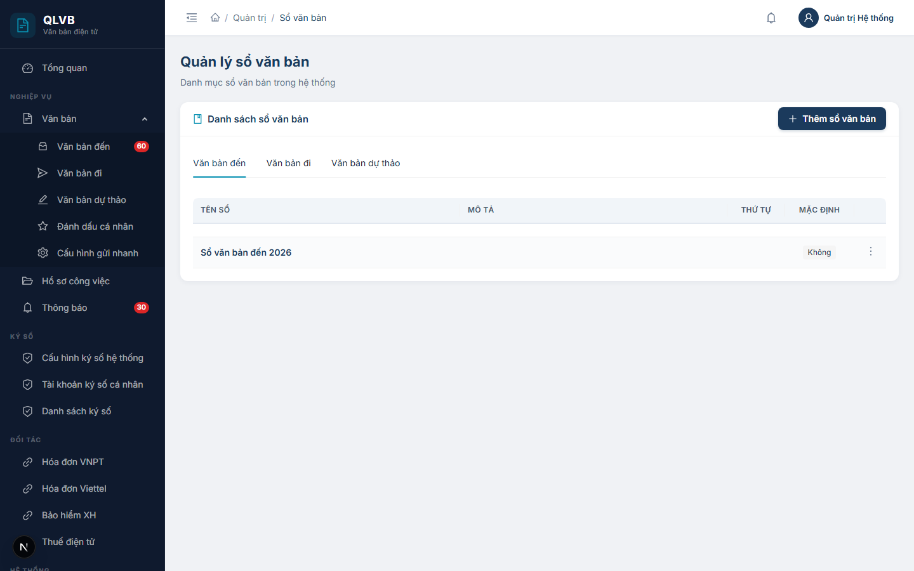

Màn hình được tổ chức theo cấu trúc một khu vực chính kèm phần đầu trang:

- **Phần đầu trang**: Hiển thị tiêu đề "Quản lý sổ văn bản" và dòng mô tả ngắn "Danh mục sổ văn bản trong hệ thống".
- **Khung "Danh sách sổ văn bản"**:
  - Tiêu đề khung có biểu tượng cuốn sổ (màu xanh teal) và chữ **Danh sách sổ văn bản**.
  - Nút **Thêm sổ văn bản** (biểu tượng dấu cộng, màu xanh) ở góc trên bên phải khung.
  - **Thanh chuyển nhóm sổ (tab)** ngay phía trên bảng, gồm 3 tab: **Văn bản đến**, **Văn bản đi**, **Văn bản dự thảo**. Bấm tab nào, bảng sẽ hiển thị các sổ thuộc nhóm đó.
  - Bảng dữ liệu hiển thị các sổ thuộc nhóm đang chọn của đơn vị đang đăng nhập.
  - Mỗi dòng có nút thao tác hình **ba chấm dọc** ở cột cuối cùng, chứa các lệnh: Sửa, Đặt mặc định, Xóa.
- **Cửa sổ phụ (Drawer / Modal)**:
  - **Drawer Thêm sổ văn bản mới / Cập nhật sổ văn bản** — mở ra từ bên phải khi bấm nút Thêm hoặc Sửa.
  - **Hộp xác nhận xóa** — mở khi bấm Xóa, yêu cầu xác nhận trước khi thực hiện.

---

### 3. Các cột trong Bảng danh sách sổ văn bản

| Tên cột | Mô tả |
|---|---|
| **Tên sổ** | Tên đầy đủ của sổ văn bản — hiển thị in đậm, màu xanh navy. Ví dụ: "Sổ văn bản đến năm 2026", "Sổ công văn đi". Nếu tên dài sẽ tự động cắt bớt và hiện đầy đủ khi rê chuột. |
| **Mô tả** | Mô tả thêm về phạm vi sử dụng của sổ. Nếu mô tả dài sẽ tự động cắt bớt. |
| **Thứ tự** | Số nguyên không âm dùng để sắp xếp thứ tự hiển thị của các sổ trong cùng một nhóm. Số nhỏ đứng trước. |
| **Mặc định** | Nhãn **Mặc định** (xanh lá) hoặc **Không**. Sổ mặc định là sổ được hệ thống tự động đề xuất khi cán bộ vào sổ một văn bản mới thuộc nhóm tương ứng. |
| (cột thao tác) | Nút ba chấm dọc, mở menu các lệnh: Sửa, Đặt mặc định, Xóa. |

> Bảng được sắp xếp theo **Thứ tự** tăng dần, sau đó theo **Tên sổ** theo bảng chữ cái.

---

### 4. Các trường nhập liệu trong cửa sổ Thêm / Cập nhật sổ văn bản

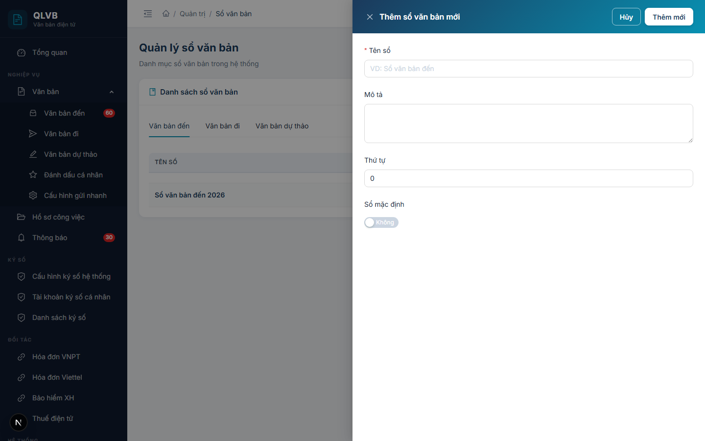

Khi bấm **Thêm sổ văn bản** hoặc **Sửa**, hệ thống mở cửa sổ phía bên phải màn hình với các trường sau:

| Tên trường | Bắt buộc | Mô tả & ràng buộc |
|---|---|---|
| **Tên sổ** | Có | Tên đầy đủ của sổ văn bản. Tối đa 200 ký tự. Ví dụ: "Sổ văn bản đến", "Sổ công văn đi năm 2026". **Tên sổ phải duy nhất trong cùng một đơn vị và cùng một nhóm sổ** — nếu trùng (không phân biệt chữ hoa / chữ thường), hệ thống sẽ báo lỗi "Tên sổ văn bản đã tồn tại trong đơn vị". Nếu để trống hệ thống báo "Nhập tên sổ văn bản". |
| **Mô tả** | Không | Mô tả thêm về phạm vi, mục đích sử dụng của sổ. Tối đa 500 ký tự, dạng vùng văn bản nhiều dòng. |
| **Thứ tự** | Không | Số nguyên không âm, dùng để sắp xếp thứ tự hiển thị các sổ trong cùng một nhóm. Số nhỏ hiển thị trước số lớn. Mặc định là 0. *(Trường này chỉ có ý nghĩa khi sửa — khi thêm mới, hệ thống dùng giá trị mặc định 0.)* |
| **Sổ mặc định** | Không | Công tắc bật/tắt — quy định sổ này có phải là **sổ mặc định** của đơn vị cho nhóm sổ tương ứng hay không. Mặc định: tắt. **Trong cùng một đơn vị + cùng một nhóm chỉ có một sổ mặc định.** Khi bật công tắc này, sổ mặc định cũ (nếu có) sẽ tự động bị tắt. |

> **Lưu ý**: Sau khi điền xong, bấm **Thêm mới** (khi tạo) hoặc **Cập nhật** (khi sửa) ở góc trên bên phải cửa sổ. Các thông báo sai định dạng sẽ hiển thị ngay dưới ô nhập tương ứng để người dùng dễ phát hiện và sửa.

> **Lưu ý quan trọng**: **Nhóm sổ** (Văn bản đến / Văn bản đi / Văn bản dự thảo) và **Đơn vị sở hữu sổ** không xuất hiện trong cửa sổ nhập — hệ thống tự gán theo tab đang chọn và đơn vị của tài khoản đang đăng nhập. Vì vậy khi muốn thêm sổ cho nhóm nào, hãy chọn đúng tab tương ứng **trước khi** bấm Thêm sổ văn bản.

---

### 5. Các nút chức năng

| Nút | Vị trí | Khi nào hiển thị | Tác dụng |
|---|---|---|---|
| **Thêm sổ văn bản** | Góc trên bên phải khung danh sách | Luôn hiển thị | Mở cửa sổ Thêm sổ văn bản mới. Sổ mới sẽ thuộc nhóm tương ứng với **tab đang chọn** và thuộc đơn vị của tài khoản đang đăng nhập. |
| **Tab Văn bản đến / Văn bản đi / Văn bản dự thảo** | Phía trên bảng danh sách | Luôn hiển thị | Chuyển nhóm sổ đang xem. Bảng tự động tải lại danh sách sổ thuộc nhóm vừa chọn. |
| **Sửa** | Trong menu ba chấm trên mỗi dòng | Luôn hiển thị | Mở cửa sổ Cập nhật sổ văn bản với dữ liệu hiện có để chỉnh sửa. |
| **Đặt mặc định** | Trong menu ba chấm trên mỗi dòng | Luôn hiển thị | Đặt sổ này làm sổ mặc định trong nhóm đang xem của đơn vị. Đồng thời tự động tắt cờ mặc định ở sổ mặc định cũ (nếu có). |
| **Xóa** | Trong menu ba chấm trên mỗi dòng (mục cuối, màu đỏ) | Luôn hiển thị | Mở hộp xác nhận, sau đó xóa sổ văn bản. |
| **Thêm mới** / **Cập nhật** | Góc trên bên phải cửa sổ Thêm/Sửa | Trong cửa sổ Thêm/Sửa | Lưu dữ liệu vừa nhập. Nhãn nút thay đổi tùy theo đang Thêm mới hay Cập nhật. |
| **Hủy** | Góc trên bên phải cửa sổ Thêm/Sửa | Trong cửa sổ Thêm/Sửa | Đóng cửa sổ, không lưu thay đổi. |
| **Xóa** / **Hủy** trong hộp xác nhận | Trong hộp xác nhận xóa | Khi mở hộp xác nhận | **Xóa** (màu đỏ) — thực hiện xóa. **Hủy** — đóng hộp, không xóa. |

---

### 6. Quy trình thao tác chính

#### 6.1. Thêm mới một sổ văn bản

1. Trên thanh tab phía trên bảng, **chọn đúng nhóm sổ** cần thêm: **Văn bản đến**, **Văn bản đi** hoặc **Văn bản dự thảo**.
2. Bấm nút **Thêm sổ văn bản** ở góc trên bên phải khung danh sách.
3. Trong cửa sổ Thêm sổ văn bản mới, điền:
   - **Tên sổ** (bắt buộc): tên đầy đủ, không trùng với sổ khác cùng nhóm trong đơn vị. Tối đa 200 ký tự.
   - **Mô tả** (tùy chọn): mô tả ngắn về phạm vi sử dụng của sổ. Tối đa 500 ký tự.
   - **Thứ tự**: thường để mặc định là 0 khi thêm mới.
   - **Sổ mặc định**: bật nếu muốn dùng sổ này làm sổ mặc định cho nhóm.
4. Bấm **Thêm mới**.
5. Hệ thống thông báo **"Thêm thành công"** và đóng cửa sổ. Bảng danh sách tự động cập nhật.

*[Hình minh họa: Cửa sổ Thêm sổ văn bản đã điền dữ liệu]*

> Nếu khi thêm mới đã bật **Sổ mặc định**, hệ thống tự động bỏ cờ mặc định ở sổ trước đó (nếu có) trong cùng nhóm + cùng đơn vị.

#### 6.2. Chỉnh sửa thông tin một sổ văn bản

1. Chuyển sang tab tương ứng (Văn bản đến / Văn bản đi / Văn bản dự thảo) để hiển thị sổ cần sửa.
2. Trên dòng tương ứng, bấm biểu tượng **ba chấm dọc** ở cột cuối → chọn **Sửa**.
3. Cửa sổ **Cập nhật sổ văn bản** mở ra với dữ liệu sẵn có. Sửa các thông tin cần thiết (Tên sổ, Mô tả, Thứ tự, Sổ mặc định).
4. Bấm **Cập nhật**.
5. Hệ thống thông báo **"Cập nhật thành công"** và đóng cửa sổ.

> Khi sửa, **không thể đổi nhóm sổ và không thể chuyển sổ sang đơn vị khác** — đây là các thuộc tính cố định khi sổ được tạo ra. Nếu cần đổi nhóm, hãy xóa sổ cũ và tạo sổ mới ở nhóm đúng.

#### 6.3. Đặt một sổ làm sổ mặc định

1. Chuyển sang tab tương ứng.
2. Trên dòng sổ muốn đặt làm mặc định, bấm biểu tượng **ba chấm dọc** ở cột cuối.
3. Chọn **Đặt mặc định**.
4. Hệ thống thông báo **"Đặt mặc định thành công"**. Cột **Mặc định** trên bảng cập nhật ngay: dòng vừa chọn chuyển sang nhãn **Mặc định** (xanh lá), sổ mặc định cũ (nếu có) chuyển sang **Không**.

> **Khi nào nên đổi sổ mặc định?** Thường khi đầu năm mới chuyển sang dùng sổ năm mới, hoặc khi tách / gộp sổ theo nhu cầu nghiệp vụ của đơn vị. Trong cùng một nhóm sổ + cùng một đơn vị **chỉ có duy nhất một sổ mặc định tại một thời điểm**.

#### 6.4. Xóa sổ văn bản

1. Chuyển sang tab tương ứng để tìm sổ cần xóa.
2. Bấm biểu tượng **ba chấm dọc** ở cột cuối → chọn **Xóa** (mục cuối cùng, màu đỏ).
3. Hộp xác nhận hiện ra với câu hỏi *"Bạn có chắc chắn muốn xóa sổ văn bản này?"*.

   *[Hình minh họa: Hộp xác nhận xóa sổ văn bản]*
4. Bấm **Xóa** (màu đỏ) để xác nhận, hoặc **Hủy** để bỏ qua.
5. Nếu xóa thành công, hệ thống thông báo **"Xóa thành công"** và bảng tự động cập nhật.

> **Quan trọng**: Hệ thống thực hiện **xóa mềm** — sổ và toàn bộ dữ liệu liên quan vẫn được lưu trong cơ sở dữ liệu nhưng không còn xuất hiện trong danh sách. Các văn bản đã được vào sổ trước đó vẫn giữ nguyên thông tin tham chiếu sổ — đảm bảo dữ liệu lịch sử không bị phá vỡ.

> **Khuyến nghị**: Hạn chế xóa sổ đã có văn bản phát sinh. Thay vào đó, có thể đổi tên sổ (ví dụ thêm hậu tố "(không dùng)") hoặc tạo sổ mới và đặt làm sổ mặc định, để các văn bản mới không vào nhầm sổ cũ.

#### 6.5. Chuyển giữa các nhóm sổ

1. Trên thanh tab phía trên bảng, bấm tên nhóm muốn xem: **Văn bản đến**, **Văn bản đi**, hoặc **Văn bản dự thảo**.
2. Bảng tự động tải lại, chỉ hiển thị các sổ thuộc nhóm vừa chọn (và thuộc đơn vị của tài khoản đang đăng nhập).
3. Mọi thao tác Thêm / Sửa / Xóa / Đặt mặc định sau đó đều áp dụng cho **nhóm đang chọn**.

---

### 7. Lưu ý / Ràng buộc nghiệp vụ

#### 7.1. Phạm vi sổ — Đơn vị, không phải Phòng ban

Sổ văn bản luôn thuộc về **một đơn vị** (cấp Sở / Ban / Ngành), không thuộc phòng ban. Khi tài khoản đăng nhập là người của một phòng ban, hệ thống tự động xác định **đơn vị cấp trên** (đơn vị gốc theo cây tổ chức) làm chủ sở hữu sổ.

Điều này có nghĩa: dù một cán bộ thuộc phòng ban nào trong Sở A, các sổ mà cán bộ đó nhìn thấy ở màn hình này luôn là sổ của **toàn Sở A**, không phải của phòng ban riêng.

#### 7.2. Phân nhóm sổ — Cố định khi tạo

Mỗi sổ văn bản thuộc về duy nhất một trong ba nhóm:

- **Văn bản đến** — phục vụ vào sổ các văn bản gửi đến đơn vị.
- **Văn bản đi** — phục vụ vào sổ các văn bản đơn vị phát hành.
- **Văn bản dự thảo** — phục vụ theo dõi các bản thảo nội bộ.

**Nhóm sổ được gán cố định khi tạo và không thể đổi sau đó**. Nhóm sổ tương ứng với tab đang chọn tại thời điểm bấm "Thêm sổ văn bản". Đây là lý do cần chọn đúng tab trước khi bấm Thêm.

#### 7.3. Sổ mặc định — Quy tắc duy nhất

Trong cùng một **đơn vị + nhóm sổ**, **chỉ có duy nhất một sổ mặc định tại một thời điểm**. Khi đặt một sổ khác làm mặc định:

- Sổ mặc định cũ (nếu có) tự động bị tắt cờ mặc định.
- Sổ vừa chọn được bật cờ mặc định.

Cơ chế này áp dụng cả khi **bật công tắc Sổ mặc định trong cửa sổ Thêm/Sửa**, lẫn khi dùng lệnh **Đặt mặc định** trong menu ba chấm.

Sổ mặc định là sổ được hệ thống tự động đề xuất khi cán bộ vào sổ một văn bản mới ở các màn hình **Văn bản đến / Văn bản đi / Văn bản dự thảo**, giúp giảm thao tác nhập liệu thường ngày.

#### 7.4. Tên sổ phải duy nhất trong phạm vi (đơn vị + nhóm)

Trong cùng một **đơn vị + nhóm sổ**, **mỗi tên sổ chỉ tồn tại một lần** (không phân biệt chữ hoa / chữ thường, không phân biệt khoảng trắng đầu/cuối). Khi nhập trùng, hệ thống báo:

> *"Tên sổ văn bản đã tồn tại trong đơn vị"*

Lỗi này hiển thị ngay tại ô **Tên sổ** trong cửa sổ nhập để người dùng dễ phát hiện.

Lưu ý: Hai sổ ở **hai nhóm khác nhau** (ví dụ một sổ ở Văn bản đến, một sổ ở Văn bản đi) có thể trùng tên — quy tắc duy nhất chỉ áp dụng trong cùng nhóm.

#### 7.5. Xóa mềm — Bảo toàn dữ liệu lịch sử

Khi xóa, hệ thống chỉ ẩn sổ khỏi danh sách (xóa mềm). Các văn bản đã được vào sổ trước đó:

- Vẫn giữ nguyên tham chiếu tới sổ cũ.
- Vẫn tra cứu được trong các báo cáo và sổ thống kê.
- Vẫn truy xuất được khi xem chi tiết văn bản.

Nhờ vậy, việc xóa một sổ không phá vỡ dữ liệu lịch sử của các văn bản đã phát sinh.

#### 7.6. Thứ tự sắp xếp

Số ở trường **Thứ tự** quyết định vị trí hiển thị của sổ trong bảng. Số nhỏ đứng trước số lớn. Khi nhiều sổ cùng số thứ tự, hệ thống tiếp tục sắp xếp theo **Tên sổ** theo bảng chữ cái.

Cùng quy tắc sắp xếp này được áp dụng ở **các ô chọn sổ** tại màn hình Văn bản đến / Văn bản đi — sổ có thứ tự nhỏ sẽ hiện trước trong danh sách thả xuống.

#### 7.7. Bảng tổng hợp các thông báo của hệ thống

| Tình huống | Thông báo |
|---|---|
| Thêm sổ thành công | Thêm thành công |
| Cập nhật sổ thành công | Cập nhật thành công |
| Xóa sổ thành công | Xóa thành công |
| Đặt mặc định thành công | Đặt mặc định thành công |
| Để trống Tên sổ (nhập từ form) | Nhập tên sổ văn bản |
| Để trống Tên sổ (kiểm tra ở máy chủ) | Tên sổ văn bản là bắt buộc |
| Tên sổ chỉ có khoảng trắng / rỗng | Tên sổ văn bản không được để trống |
| Tên sổ vượt quá 200 ký tự | Tên sổ văn bản không được vượt quá 200 ký tự |
| Tên sổ trùng trong cùng đơn vị + nhóm | Tên sổ văn bản đã tồn tại trong đơn vị |
| Thiếu nhóm sổ khi tạo | Loại văn bản là bắt buộc |
| Sửa / Xóa sổ không tồn tại | Không tìm thấy sổ văn bản |
| Lỗi khi xóa | Lỗi khi xóa |
| Lỗi khi đặt mặc định | Lỗi khi đặt mặc định |
| Lỗi tải dữ liệu | Lỗi tải dữ liệu |

---

*Tài liệu được biên soạn dựa trên hệ thống thực tế đang triển khai. Mọi thắc mắc vui lòng liên hệ với đội phát triển để được hỗ trợ.*


\newpage

## Hướng dẫn sử dụng: Màn hình Quản trị > Loại văn bản

Tài liệu này mô tả đầy đủ các chức năng có trong màn hình **Quản trị > Loại văn bản** của hệ thống Quản lý văn bản điện tử (e-Office), giúp người dùng hiểu rõ cách sử dụng và quy trình nghiệp vụ.

---

### 1. Giới thiệu

Màn hình **Quản trị > Loại văn bản** dùng để quản lý danh mục các loại văn bản hành chính theo Nghị định 30/2020/NĐ-CP — ví dụ: Quyết định, Công văn, Thông báo, Tờ trình, Báo cáo, Kế hoạch, Hướng dẫn, Nghị quyết... Đây là dữ liệu nền tảng dùng cho:

- Phân loại văn bản khi đăng ký Văn bản đến / Văn bản đi / Văn bản dự thảo.
- Cấp số văn bản (mã loại được ghép vào số ký hiệu, ví dụ: "12/2026/QĐ-UBND").
- Lập báo cáo thống kê (số lượng văn bản theo từng loại trong một kỳ).
- Quy định mẫu trình bày văn bản theo đúng thể thức của từng loại.

Danh mục được tổ chức theo **3 nhóm** tương ứng với 3 phân hệ nghiệp vụ:

- **Văn bản đến** — các loại văn bản cơ quan tiếp nhận từ bên ngoài.
- **Văn bản đi** — các loại văn bản cơ quan ban hành.
- **Văn bản dự thảo** — các loại văn bản đang trong quá trình soạn thảo nội bộ.

Trong mỗi nhóm, các loại văn bản có thể được tổ chức **phân cấp cha — con** (ví dụ: "Quyết định" là cha, "Quyết định cá biệt" và "Quyết định quy phạm" là con).

Vì là dữ liệu gốc nên màn hình này **chỉ dành cho tài khoản Quản trị hệ thống**. Người dùng thông thường chỉ thấy danh mục này dưới dạng ô chọn (dropdown) khi đăng ký văn bản.

---

### 2. Bố cục màn hình

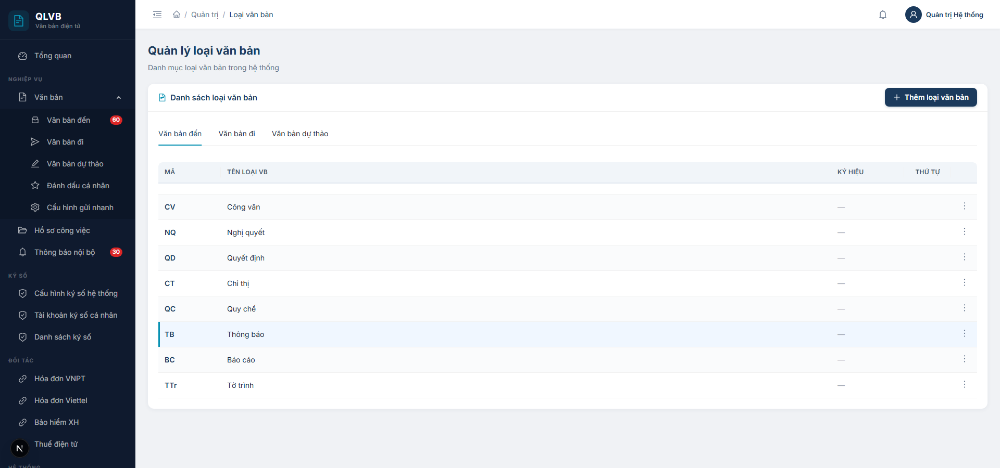

Màn hình được chia thành các phần sau:

- **Phần đầu trang**: Hiển thị tiêu đề "Quản lý loại văn bản" và dòng mô tả ngắn "Danh mục loại văn bản trong hệ thống".
- **Khung danh sách**: Là một thẻ (card) lớn ở giữa màn hình, gồm:
  - Tiêu đề "Danh sách loại văn bản" (kèm biểu tượng tài liệu màu xanh teal) ở góc trên bên trái.
  - Nút **Thêm loại văn bản** (biểu tượng dấu cộng, màu xanh) ở góc trên bên phải.
  - **Thanh tab** ngay dưới tiêu đề, gồm 3 mục: **Văn bản đến / Văn bản đi / Văn bản dự thảo**. Khi bấm chuyển tab, danh sách bên dưới được lọc theo nhóm tương ứng.
  - **Bảng dữ liệu** dạng cây phân cấp — các loại con được lùi vào bên trong loại cha, có biểu tượng mở/thu nhánh.
  - Mỗi dòng có nút **ba chấm dọc** ở cột cuối, mở menu các lệnh: Sửa, Xóa.
- **Cửa sổ phụ (Drawer)**:
  - **Drawer Thêm loại văn bản mới / Cập nhật loại văn bản** — mở từ bên phải khi bấm Thêm hoặc Sửa.
  - **Hộp xác nhận xóa** — mở khi bấm Xóa, yêu cầu xác nhận trước khi thực hiện.

---

### 3. Các cột trong bảng danh sách loại văn bản

| Tên cột | Mô tả |
|---|---|
| **Mã** | Mã ngắn của loại văn bản — hiển thị in đậm, màu xanh navy (ví dụ: `QĐ`, `CV`, `TB`, `BC`). Dùng để ghép vào số ký hiệu văn bản. |
| **Tên loại VB** | Tên đầy đủ của loại văn bản (ví dụ: "Quyết định", "Công văn", "Thông báo"). Nếu tên dài sẽ tự động cắt bớt và hiện tooltip khi rê chuột. |
| **Ký hiệu** | Kiểu ký hiệu áp dụng khi cấp số văn bản — `Số/Ký hiệu`, `Số-Ký hiệu`, hoặc để trống. Quy định cách ghép số văn bản với mã loại trong số ký hiệu cuối cùng. |
| **Thứ tự** | Số nguyên dùng để sắp xếp thứ tự hiển thị trong bảng và trong các ô chọn ở các phân hệ. Số nhỏ hiển thị trước. |
| (cột thao tác) | Nút ba chấm dọc, mở menu các lệnh: Sửa, Xóa. |

> **Lưu ý**: Bảng hiển thị dạng cây — các loại con nằm bên trong loại cha. Bấm vào biểu tượng mũi tên/dấu cộng đầu dòng để mở rộng hoặc thu gọn nhánh con. Bảng KHÔNG có phân trang — toàn bộ danh mục hiện trong một trang.

---

### 4. Các trường nhập liệu trong cửa sổ Thêm / Cập nhật loại văn bản

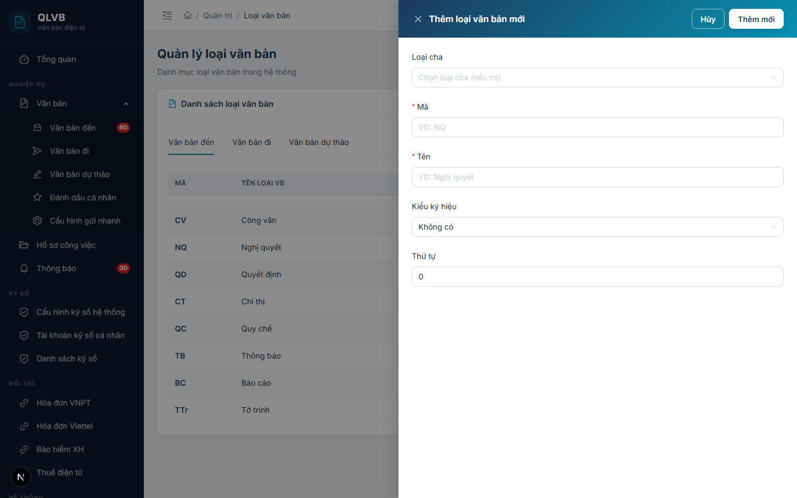

Khi bấm **Thêm loại văn bản** hoặc **Sửa**, hệ thống mở cửa sổ phía bên phải màn hình với các trường sau:

| Tên trường | Bắt buộc | Mô tả & ràng buộc |
|---|---|---|
| **Loại cha** | Không | Chọn loại văn bản cấp trên trực tiếp (nếu loại đang tạo là một dạng con của loại lớn hơn). Ô chọn dạng tìm kiếm, hiển thị danh sách phẳng các loại trong cùng nhóm tab đang chọn (Văn bản đến / đi / dự thảo), có thụt đầu dòng để thể hiện cấp. Để trống nếu đây là loại gốc. Có nút **Xóa nhanh** (dấu nhân) để bỏ chọn. |
| **Mã** | Có | Mã ngắn của loại văn bản (ví dụ: `QĐ`, `CV`, `TB`). Tối đa 20 ký tự. **Mã phải duy nhất trong toàn hệ thống**, không phân biệt chữ hoa / chữ thường. Nếu trùng, hệ thống báo "Mã loại văn bản đã tồn tại". Nếu để trống báo "Nhập mã loại văn bản" (kiểm tra tại ô nhập) hoặc "Mã loại văn bản không được để trống" (kiểm tra trên máy chủ). |
| **Tên** | Có | Tên đầy đủ của loại văn bản (ví dụ: "Nghị quyết", "Công văn"). Tối đa 200 ký tự. Nếu để trống báo "Nhập tên loại văn bản" hoặc "Tên loại văn bản không được để trống". |
| **Kiểu ký hiệu** | Không | Quy định cách hệ thống ghép số văn bản với mã loại khi cấp số. Có 3 lựa chọn: **Không có** (chỉ dùng số), **Số/Ký hiệu** (ví dụ: `12/QĐ-UBND`), **Số-Ký hiệu** (ví dụ: `12-QĐ-UBND`). Mặc định: Không có. |
| **Thứ tự** | Không | Số nguyên không âm, dùng để sắp xếp thứ tự hiển thị. Số nhỏ hiển thị trước. Mặc định: 0. |

> **Lưu ý**: Trường **Nhóm văn bản** (Văn bản đến / đi / dự thảo) KHÔNG xuất hiện trong cửa sổ Thêm / Cập nhật. Nhóm được xác định **tự động theo tab đang chọn** ở thời điểm bấm Thêm. Vì vậy, nếu muốn thêm một loại cho nhóm "Văn bản đi", phải bấm sang tab "Văn bản đi" trước khi bấm Thêm.

> Sau khi điền xong, bấm **Thêm mới** (khi tạo) hoặc **Cập nhật** (khi sửa) ở góc trên bên phải cửa sổ. Các thông báo sai dữ liệu sẽ hiển thị ngay dưới ô nhập tương ứng để người dùng dễ phát hiện và sửa.

---

### 5. Các nút chức năng

| Nút | Vị trí | Khi nào hiển thị | Tác dụng |
|---|---|---|---|
| **Thêm loại văn bản** | Góc trên bên phải khung danh sách | Luôn hiển thị | Mở cửa sổ Thêm mới. Loại văn bản mới sẽ thuộc về **nhóm tab đang chọn** (Văn bản đến / đi / dự thảo). |
| **Tab "Văn bản đến" / "Văn bản đi" / "Văn bản dự thảo"** | Trên cùng của khung danh sách, ngay dưới tiêu đề | Luôn hiển thị | Lọc bảng để chỉ hiển thị các loại văn bản thuộc nhóm tương ứng. |
| **Sửa** | Trong menu ba chấm trên mỗi dòng | Luôn hiển thị | Mở cửa sổ Cập nhật với dữ liệu hiện có để chỉnh sửa. |
| **Xóa** | Trong menu ba chấm trên mỗi dòng (mục cuối, màu đỏ) | Luôn hiển thị | Mở hộp xác nhận, sau đó xóa loại văn bản. **Chỉ xóa được khi loại không còn loại con** (xem mục 7). |
| **Mở rộng / Thu gọn nhánh** | Biểu tượng mũi tên (hoặc dấu cộng/trừ) ở đầu mỗi dòng có loại con | Khi loại văn bản có ít nhất một loại con | Hiển thị hoặc ẩn các loại con bên trong. |
| **Thêm mới** / **Cập nhật** | Góc trên bên phải cửa sổ Thêm/Sửa | Trong cửa sổ Thêm/Sửa | Lưu dữ liệu vừa nhập. Nhãn nút thay đổi tùy theo đang Thêm mới hay Cập nhật. |
| **Hủy** | Góc trên bên phải cửa sổ Thêm/Sửa | Trong cửa sổ Thêm/Sửa | Đóng cửa sổ, không lưu thay đổi. |
| **Xóa** / **Hủy** trong hộp xác nhận | Trong hộp xác nhận xóa | Khi mở hộp xác nhận | **Xóa** (màu đỏ) — thực hiện xóa. **Hủy** — đóng hộp, không xóa. |

---

### 6. Quy trình thao tác chính

#### 6.1. Thêm mới một loại văn bản

1. Trên khung danh sách, bấm chọn **tab nhóm** phù hợp: **Văn bản đến**, **Văn bản đi** hoặc **Văn bản dự thảo**.
2. Bấm nút **Thêm loại văn bản** ở góc trên bên phải.
3. Trong cửa sổ Thêm:
   - **Loại cha** (tùy chọn): chọn nếu loại đang tạo là một dạng con của một loại lớn hơn (ví dụ: thêm "Quyết định cá biệt" là con của "Quyết định").
   - **Mã** (bắt buộc): nhập mã ngắn, tối đa 20 ký tự, không trùng với mã đã có.
   - **Tên** (bắt buộc): nhập tên đầy đủ, tối đa 200 ký tự.
   - **Kiểu ký hiệu**: chọn kiểu ghép số ký hiệu phù hợp với thể thức của loại (xem mục 7.3).
   - **Thứ tự**: nhập số nguyên không âm để điều chỉnh thứ tự hiển thị (tùy chọn).
4. Bấm **Thêm mới**.
5. Hệ thống thông báo **"Thêm thành công"** và đóng cửa sổ. Bảng tự động cập nhật.

*[Hình minh họa: Hộp Thêm loại văn bản đã điền dữ liệu]*

#### 6.2. Chỉnh sửa thông tin một loại văn bản

1. Trên thanh tab, chọn nhóm chứa loại văn bản cần sửa.
2. Tìm loại văn bản trên bảng (mở rộng nhánh cha nếu cần).
3. Trên dòng tương ứng, bấm biểu tượng **ba chấm dọc** ở cột cuối → chọn **Sửa**.
4. Cửa sổ **Cập nhật loại văn bản** mở ra với dữ liệu sẵn có. Sửa các thông tin cần thiết.
5. Bấm **Cập nhật**.
6. Hệ thống thông báo **"Cập nhật thành công"** và đóng cửa sổ.

> Khi đổi **Loại cha**, loại văn bản đang sửa sẽ được di chuyển sang nhánh mới trong cây. Lưu ý: hệ thống KHÔNG cho phép chọn chính loại đang sửa làm cha của chính nó (hệ thống báo "Không thể chọn chính mình làm cha").

#### 6.3. Xóa loại văn bản

1. Tìm loại văn bản cần xóa trên bảng (đúng tab nhóm).
2. Bấm biểu tượng **ba chấm dọc** ở cột cuối → chọn **Xóa** (mục cuối cùng, màu đỏ).
3. Hộp xác nhận hiện ra với câu hỏi *"Bạn có chắc chắn muốn xóa loại văn bản này?"*.

   *[Hình minh họa: Hộp xác nhận xóa]*
4. Bấm **Xóa** (màu đỏ) để xác nhận, hoặc **Hủy** để bỏ qua.
5. Nếu xóa được, hệ thống thông báo **"Xóa thành công"**.
6. Nếu không xóa được, hệ thống báo lỗi rõ lý do (xem mục 7).

> **Quan trọng**: Hệ thống thực hiện **xóa mềm** — dữ liệu không bị xóa hẳn khỏi cơ sở dữ liệu mà chỉ ẩn khỏi danh sách và các ô chọn ở các phân hệ. Tuy vậy, từ góc nhìn nghiệp vụ, loại đã xóa coi như không còn dùng được nữa.

#### 6.4. Chuyển nhóm văn bản (Đến / Đi / Dự thảo)

Trên thanh tab phía trên bảng, bấm vào tên nhóm tương ứng để xem danh sách loại văn bản thuộc nhóm đó. Khi chuyển tab, hệ thống tự động tải lại dữ liệu cho nhóm mới.

> **Lưu ý**: Một loại văn bản chỉ thuộc về **một nhóm duy nhất** tại thời điểm tạo, được xác định bởi tab đang chọn lúc bấm Thêm. Nếu muốn dùng cùng một tên loại cho nhiều nhóm (ví dụ: "Báo cáo" cho cả Văn bản đến và Văn bản đi), phải tạo riêng cho từng nhóm — và mã (code) giữa các bản ghi vẫn phải duy nhất, do vậy có thể đặt mã hơi khác nhau (ví dụ: `BC-DEN`, `BC-DI`).

---

### 7. Lưu ý / Ràng buộc nghiệp vụ

#### 7.1. Mã loại văn bản phải duy nhất

Trong toàn hệ thống, **mỗi mã loại văn bản chỉ tồn tại một lần** (không phân biệt chữ hoa / chữ thường, không phân biệt nhóm). Khi nhập trùng, hệ thống báo:

> *"Mã loại văn bản đã tồn tại"*

Lỗi này hiển thị ngay tại ô **Mã** trong cửa sổ nhập để người dùng dễ phát hiện.

#### 7.2. Không xóa được loại văn bản còn loại con

Nếu loại văn bản đang xóa **còn loại con trực thuộc**, hệ thống ngăn xóa và báo:

> *"Không thể xóa: còn N loại văn bản con"*

(N là số lượng loại con thực tế.)

Trong trường hợp này, cần xóa hết các loại con bên trong trước, hoặc đổi loại cha của các loại con sang một loại khác trước khi xóa.

> **Lưu ý**: Hệ thống hiện chỉ kiểm tra **loại con trực thuộc**. Việc loại văn bản đã được dùng trong văn bản đến/đi/dự thảo cụ thể chưa được kiểm tra ở bước xóa — do đó cần cân nhắc kỹ và **ưu tiên giữ nguyên** các loại đã dùng, chỉ xóa các loại được tạo nhầm hoặc chưa từng dùng.

#### 7.3. "Kiểu ký hiệu" — ý nghĩa nghiệp vụ

Trường **Kiểu ký hiệu** quyết định cách hệ thống tự động sinh số ký hiệu văn bản khi cấp số:

- **Không có**: Chỉ hiển thị số văn bản đơn thuần. Phù hợp với các loại văn bản không có quy định ký hiệu chính thức.
- **Số/Ký hiệu**: Ký hiệu được ghép theo dạng `<số>/<năm>/<mã loại>-<đơn vị>` (ví dụ: `12/2026/QĐ-UBND`). Đây là dạng phổ biến cho văn bản quy phạm và văn bản hành chính có ký hiệu rõ ràng.
- **Số-Ký hiệu**: Ký hiệu được ghép theo dạng `<số>-<mã loại>-<đơn vị>` (ví dụ: `12-QĐ-UBND`). Dạng này dùng cho một số loại văn bản nội bộ.

Việc cấp số ký hiệu thực tế được cấu hình chi tiết ở màn hình **Quản trị > Sổ văn bản**. Trường này chỉ thiết lập kiểu ghép cho riêng loại văn bản này.

#### 7.4. Phân cấp cha — con

Hệ thống hỗ trợ tổ chức loại văn bản theo nhiều cấp (cây phân cấp). Một số quy tắc cần lưu ý:

- Loại con luôn nằm cùng nhóm với loại cha (Đến / Đi / Dự thảo).
- Khi chọn **Loại cha**, danh sách chỉ hiển thị các loại trong cùng nhóm tab đang xem.
- KHÔNG được chọn chính mình làm cha (hệ thống báo "Không thể chọn chính mình làm cha").
- Nếu chọn loại cha đã bị xóa hoặc không tồn tại, hệ thống báo "Loại văn bản cha không tồn tại".

#### 7.5. Thứ tự sắp xếp

Số ở trường **Thứ tự** quyết định vị trí hiển thị của loại văn bản trong bảng và trong các ô chọn ở phân hệ Văn bản đến / đi / dự thảo. Số nhỏ đứng trước số lớn. Khi nhiều loại cùng số thứ tự, hệ thống tiếp tục sắp xếp theo tên (theo bảng chữ cái, có hỗ trợ tiếng Việt).

#### 7.6. Bảng tổng hợp các thông báo của hệ thống

| Tình huống | Thông báo |
|---|---|
| Thêm loại văn bản thành công | Thêm thành công |
| Cập nhật loại văn bản thành công | Cập nhật thành công |
| Xóa loại văn bản thành công | Xóa thành công |
| Để trống Mã (ngay tại ô) | Nhập mã loại văn bản |
| Để trống Tên (ngay tại ô) | Nhập tên loại văn bản |
| Để trống Tên (kiểm tra máy chủ) | Tên loại văn bản là bắt buộc |
| Tên trống (kiểm tra ở quy trình lưu) | Tên loại văn bản không được để trống |
| Tên dài quá 200 ký tự | Tên loại văn bản không được vượt quá 200 ký tự |
| Để trống Mã (kiểm tra máy chủ) | Mã loại văn bản là bắt buộc |
| Mã trống (kiểm tra ở quy trình lưu) | Mã loại văn bản không được để trống |
| Mã dài quá 20 ký tự | Mã loại văn bản không được vượt quá 20 ký tự |
| Mã trùng | Mã loại văn bản đã tồn tại |
| Chọn loại cha không tồn tại | Loại văn bản cha không tồn tại |
| Chọn chính mình làm cha (khi sửa) | Không thể chọn chính mình làm cha |
| Xóa loại còn loại con bên trong | Không thể xóa: còn N loại văn bản con |
| Sửa/xóa nhưng loại không tồn tại | Không tìm thấy loại văn bản |
| Lỗi tải dữ liệu | Lỗi tải dữ liệu |
| Lỗi khi xóa (lỗi hệ thống) | Lỗi khi xóa |

---

*Tài liệu được biên soạn dựa trên hệ thống thực tế đang triển khai. Mọi thắc mắc vui lòng liên hệ với đội phát triển để được hỗ trợ.*


\newpage

## Hướng dẫn sử dụng: Màn hình Quản trị > Lĩnh vực

Tài liệu này mô tả đầy đủ các chức năng có trong màn hình **Quản trị > Lĩnh vực** của hệ thống Quản lý văn bản điện tử (e-Office), giúp người dùng hiểu rõ cách sử dụng và quy trình nghiệp vụ.

---

### 1. Giới thiệu

Màn hình **Quản trị > Lĩnh vực** dùng để quản lý danh mục **lĩnh vực nghiệp vụ** của cơ quan — ví dụ: Tài chính, Tổ chức cán bộ, Kế hoạch đầu tư, Thanh tra, Văn hóa - Xã hội, Khoa học công nghệ... Mỗi văn bản đến, văn bản đi, dự thảo và hồ sơ công việc đều có thể được gán một lĩnh vực để thuận tiện cho việc lọc, tra cứu, thống kê và phân công xử lý.

Đây là dữ liệu danh mục dùng chung trong **phạm vi đơn vị** (mỗi đơn vị quản lý danh sách lĩnh vực riêng của mình). Mã lĩnh vực không trùng nhau trong cùng một đơn vị, nhưng có thể trùng giữa các đơn vị khác nhau.

Vì là dữ liệu nền tảng, ảnh hưởng đến cách tổ chức và thống kê văn bản, màn hình này **chỉ dành cho tài khoản Quản trị hệ thống** hoặc người được phân quyền quản trị danh mục.

---

### 2. Bố cục màn hình

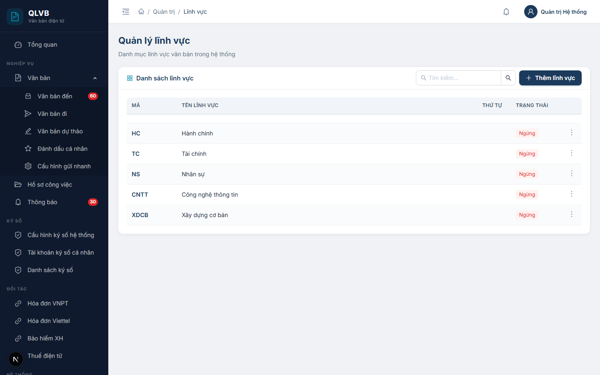

Màn hình bố cục đơn giản, gồm các phần chính:

- **Phần đầu trang**: Hiển thị tiêu đề "Quản lý lĩnh vực" và dòng mô tả ngắn "Danh mục lĩnh vực văn bản trong hệ thống".
- **Khung danh sách lĩnh vực**:
  - Tiêu đề khung "Danh sách lĩnh vực" với biểu tượng ô vuông màu xanh teal.
  - **Ô tìm kiếm** (placeholder "Tìm kiếm...") ở góc trên bên phải khung — có nút xóa nhanh.
  - Nút **Thêm lĩnh vực** (biểu tượng dấu cộng, màu xanh navy) ở góc trên bên phải khung.
  - Bảng dữ liệu liệt kê các lĩnh vực hiện có — không phân trang (hiển thị toàn bộ trên 1 trang).
  - Mỗi dòng có nút thao tác hình **ba chấm dọc** ở cột cuối cùng, chứa các lệnh: Sửa, Xóa.
- **Cửa sổ phụ (Drawer / Modal)**:
  - **Drawer Thêm lĩnh vực mới / Cập nhật lĩnh vực** — mở từ bên phải khi bấm nút Thêm hoặc Sửa.
  - **Hộp xác nhận xóa** — mở khi bấm Xóa, yêu cầu xác nhận trước khi thực hiện.

---

### 3. Các cột trong Bảng danh sách lĩnh vực

| Tên cột | Mô tả |
|---|---|
| **Mã** | Mã ngắn của lĩnh vực — hiển thị in đậm, màu xanh navy. Dùng để tham chiếu nội bộ và lọc nhanh. |
| **Tên lĩnh vực** | Tên đầy đủ của lĩnh vực. Nếu tên dài sẽ tự động cắt bớt và hiện tooltip khi rê chuột. |
| **Thứ tự** | Số nguyên không âm, quyết định thứ tự hiển thị của lĩnh vực trong bảng và trong các ô chọn lĩnh vực ở các màn hình khác. Số nhỏ hiển thị trước. |
| **Trạng thái** | **Hoạt động** (nhãn xanh lá) hoặc **Ngừng** (nhãn đỏ). Lĩnh vực **Ngừng** vẫn còn trong danh sách quản trị nhưng không xuất hiện trong các ô chọn lĩnh vực ở nghiệp vụ văn bản. |
| (cột thao tác) | Nút ba chấm dọc, mở menu các lệnh: Sửa, Xóa. |

---

### 4. Các trường nhập liệu trong cửa sổ Thêm / Cập nhật lĩnh vực


Khi bấm **Thêm lĩnh vực** hoặc **Sửa**, hệ thống mở cửa sổ phía bên phải màn hình với các trường sau:

| Tên trường | Bắt buộc | Mô tả & ràng buộc |
|---|---|---|
| **Mã** | Có | Mã ngắn dùng để tham chiếu (ví dụ: `KHCN`, `TCKH`, `TT`). Tối đa 20 ký tự. **Mã phải duy nhất trong phạm vi đơn vị** — không phân biệt chữ hoa / chữ thường. Nếu trùng, hệ thống báo lỗi "Mã lĩnh vực đã tồn tại trong đơn vị". Nếu để trống, báo "Mã lĩnh vực là bắt buộc". |
| **Tên** | Có | Tên đầy đủ của lĩnh vực (ví dụ: "Khoa học công nghệ", "Tài chính - Kế hoạch"). Tối đa 200 ký tự. Nếu để trống, hệ thống báo "Tên lĩnh vực là bắt buộc". |
| **Thứ tự** | Không | Số nguyên không âm, dùng để sắp xếp thứ tự hiển thị trong bảng và trong các ô chọn lĩnh vực. Số nhỏ hiển thị trước. Mặc định là 0. |
| **Trạng thái** | Không | Công tắc bật/tắt — chỉ hiển thị khi đang **Cập nhật**, không hiển thị khi **Thêm mới** (lĩnh vực mới mặc định là **Hoạt động**). Bật = Hoạt động, Tắt = Ngừng. Khi để **Ngừng**, lĩnh vực vẫn còn trong danh sách quản trị nhưng người dùng không chọn được khi soạn văn bản. |

> **Lưu ý**: Sau khi điền xong, bấm **Thêm mới** (khi tạo) hoặc **Cập nhật** (khi sửa) ở góc trên bên phải cửa sổ. Các lỗi sai (mã trùng, vượt độ dài, để trống bắt buộc) sẽ hiển thị ngay tại ô tương ứng để người dùng dễ phát hiện và sửa.

---

### 5. Các nút chức năng

| Nút | Vị trí | Khi nào hiển thị | Tác dụng |
|---|---|---|---|
| **Thêm lĩnh vực** | Góc trên bên phải khung "Danh sách lĩnh vực" | Luôn hiển thị | Mở cửa sổ Thêm lĩnh vực mới. |
| **Ô tìm kiếm "Tìm kiếm..."** | Góc trên bên phải khung, bên trái nút Thêm | Luôn hiển thị | Lọc danh sách theo từ khóa nhập (so khớp trong **Mã** hoặc **Tên**). Có nút xóa nhanh để bỏ từ khóa và hiển thị lại toàn bộ. Bấm Enter hoặc bấm biểu tượng kính lúp để áp dụng. |
| **Sửa** | Trong menu ba chấm trên mỗi dòng | Luôn hiển thị | Mở cửa sổ Cập nhật lĩnh vực với dữ liệu hiện có để chỉnh sửa. |
| **Xóa** | Trong menu ba chấm trên mỗi dòng (mục cuối, màu đỏ) | Luôn hiển thị | Mở hộp xác nhận, sau đó xóa lĩnh vực. |
| **Thêm mới** / **Cập nhật** | Góc trên bên phải cửa sổ Thêm/Sửa | Trong cửa sổ Thêm/Sửa | Lưu dữ liệu vừa nhập. Nhãn nút thay đổi tùy theo đang Thêm mới hay Cập nhật. |
| **Hủy** | Góc trên bên phải cửa sổ Thêm/Sửa | Trong cửa sổ Thêm/Sửa | Đóng cửa sổ, không lưu thay đổi. |
| **Xóa** / **Hủy** trong hộp xác nhận | Trong hộp xác nhận xóa | Khi mở hộp xác nhận | **Xóa** (màu đỏ) — thực hiện xóa. **Hủy** — đóng hộp, không xóa. |

---

### 6. Quy trình thao tác chính

#### 6.1. Thêm mới một lĩnh vực

1. Bấm nút **Thêm lĩnh vực** ở góc trên bên phải khung danh sách.
2. Trong cửa sổ **Thêm lĩnh vực mới**, điền:
   - **Mã** (bắt buộc): tối đa 20 ký tự, không trùng với lĩnh vực nào đã có trong cùng đơn vị (ví dụ: `KHCN`).
   - **Tên** (bắt buộc): tên đầy đủ, tối đa 200 ký tự (ví dụ: "Khoa học công nghệ").
   - **Thứ tự** (tùy chọn): số nguyên không âm, mặc định 0.
3. Bấm **Thêm mới**.
4. Hệ thống thông báo **"Thêm thành công"** và đóng cửa sổ. Bảng tự động cập nhật, hiển thị lĩnh vực vừa tạo ở vị trí phù hợp theo thứ tự.

*[Hình minh họa: Cửa sổ Thêm lĩnh vực đã điền dữ liệu]*

#### 6.2. Chỉnh sửa thông tin một lĩnh vực

1. Tìm lĩnh vực cần sửa trên bảng (có thể dùng ô tìm kiếm để thu hẹp danh sách).
2. Trên dòng tương ứng, bấm biểu tượng **ba chấm dọc** ở cột cuối → chọn **Sửa**.
3. Cửa sổ **Cập nhật lĩnh vực** mở ra với dữ liệu sẵn có. Sửa các thông tin cần thiết (Mã, Tên, Thứ tự, Trạng thái).
4. Bấm **Cập nhật**.
5. Hệ thống thông báo **"Cập nhật thành công"** và đóng cửa sổ. Bảng cập nhật ngay.

> Khi đổi **Trạng thái** từ Hoạt động sang Ngừng, lĩnh vực sẽ không còn xuất hiện trong các ô chọn lĩnh vực ở các màn hình nghiệp vụ (Văn bản đến, Văn bản đi, Hồ sơ công việc), nhưng các văn bản cũ đã gán lĩnh vực này vẫn giữ nguyên — không bị mất dữ liệu.

#### 6.3. Xóa lĩnh vực

1. Tìm lĩnh vực cần xóa trên bảng.
2. Bấm biểu tượng **ba chấm dọc** ở cột cuối → chọn **Xóa** (mục cuối cùng, màu đỏ).
3. Hộp xác nhận hiện ra với câu hỏi *"Bạn có chắc chắn muốn xóa lĩnh vực này?"*.

   *[Hình minh họa: Hộp xác nhận xóa]*
4. Bấm **Xóa** (màu đỏ) để xác nhận, hoặc **Hủy** để bỏ qua.
5. Nếu xóa được, hệ thống thông báo **"Xóa thành công"**. Bảng cập nhật ngay.
6. Nếu lĩnh vực đang được tham chiếu bởi văn bản hoặc hồ sơ, hệ thống sẽ báo lỗi và không xóa được — khi đó hãy chuyển sang **đặt Trạng thái = Ngừng** thay vì xóa (xem mục 7.3).

#### 6.4. Tìm kiếm lĩnh vực

1. Trên ô **Tìm kiếm...** ở góc trên bên phải khung, gõ từ khóa (một phần Mã hoặc một phần Tên).
2. Bấm Enter hoặc bấm biểu tượng **kính lúp** để áp dụng.
3. Bảng sẽ chỉ hiển thị các lĩnh vực có Mã hoặc Tên chứa từ khóa.
4. Bấm biểu tượng **dấu nhân** trong ô tìm kiếm để xóa từ khóa và hiển thị lại toàn bộ.

---

### 7. Lưu ý / Ràng buộc nghiệp vụ

#### 7.1. Mã lĩnh vực — duy nhất trong đơn vị

Mỗi đơn vị quản lý danh mục lĩnh vực riêng. Trong **cùng một đơn vị**, mỗi mã lĩnh vực **chỉ tồn tại một lần** (không phân biệt chữ hoa / chữ thường, đã loại khoảng trắng đầu/cuối). Hai đơn vị khác nhau có thể cùng có mã `KHCN` mà không xung đột.

Khi nhập trùng mã trong cùng đơn vị, hệ thống báo:

> *"Mã lĩnh vực đã tồn tại trong đơn vị"*

Lỗi này hiển thị ngay tại ô **Mã** trong cửa sổ nhập.

#### 7.2. Giới hạn độ dài

- **Mã**: tối đa **20 ký tự**. Vượt quá → "Mã lĩnh vực không được vượt quá 20 ký tự".
- **Tên**: tối đa **200 ký tự**. Vượt quá → "Tên lĩnh vực không được vượt quá 200 ký tự".

Hệ thống tự động cắt giới hạn ký tự ngay khi nhập, nhưng người dùng nên cân nhắc đặt mã ngắn gọn (3-6 ký tự) và tên đầy đủ rõ nghĩa để dễ tra cứu.

#### 7.3. "Ngừng" hay "Xóa" — nên chọn cách nào?

Nguyên tắc khuyến nghị:

- **Đặt Trạng thái = Ngừng** khi lĩnh vực không còn dùng nữa nhưng đã có văn bản / hồ sơ tham chiếu — đây là cách an toàn nhất, giữ nguyên lịch sử.
- **Xóa hẳn** chỉ áp dụng khi lĩnh vực **chưa từng được sử dụng** (mới tạo nhầm, gõ sai mã, trùng nội dung với lĩnh vực khác).

Khi xóa một lĩnh vực đang còn được tham chiếu, hệ thống sẽ chặn để bảo toàn dữ liệu — thông báo trả về tùy theo ràng buộc cơ sở dữ liệu (xem bảng thông báo ở mục 7.6).

#### 7.4. Thứ tự sắp xếp (sort_order)

Số ở trường **Thứ tự** quyết định vị trí hiển thị của lĩnh vực trong bảng quản trị **và** trong các ô chọn lĩnh vực ở các màn hình nghiệp vụ. Số nhỏ đứng trước số lớn. Khi nhiều lĩnh vực cùng số thứ tự, hệ thống tiếp tục sắp xếp theo tên (theo bảng chữ cái).

Mẹo: dùng các bước nhảy 10 (10, 20, 30...) thay vì 1, 2, 3 — sau này muốn chèn thêm lĩnh vực vào giữa sẽ không phải đánh số lại toàn bộ.

#### 7.5. Phạm vi dữ liệu theo đơn vị

Khi mở màn hình, hệ thống mặc định chỉ hiển thị danh sách lĩnh vực thuộc **đơn vị của người đăng nhập** (xác định theo phòng ban gán cho tài khoản, truy ngược lên đơn vị cha cao nhất). Người dùng không nhìn thấy danh sách lĩnh vực của đơn vị khác.

Khi tạo mới, lĩnh vực sẽ tự động được gán cho đơn vị của người đăng nhập — không cần chọn đơn vị thủ công.

#### 7.6. Bảng tổng hợp các thông báo của hệ thống

| Tình huống | Thông báo |
|---|---|
| Thêm lĩnh vực thành công | Thêm thành công |
| Cập nhật lĩnh vực thành công | Cập nhật thành công |
| Xóa lĩnh vực thành công | Xóa thành công |
| Để trống Mã (frontend) | Nhập mã lĩnh vực |
| Để trống Mã (backend) | Mã lĩnh vực là bắt buộc |
| Mã rỗng (kiểm tra ở SP) | Mã lĩnh vực không được để trống |
| Mã vượt 20 ký tự | Mã lĩnh vực không được vượt quá 20 ký tự |
| Mã trùng trong cùng đơn vị | Mã lĩnh vực đã tồn tại trong đơn vị |
| Để trống Tên (frontend) | Nhập tên lĩnh vực |
| Để trống Tên (backend) | Tên lĩnh vực là bắt buộc |
| Tên rỗng (kiểm tra ở SP) | Tên lĩnh vực không được để trống |
| Tên vượt 200 ký tự | Tên lĩnh vực không được vượt quá 200 ký tự |
| Không tìm thấy bản ghi khi sửa / xóa | Không tìm thấy lĩnh vực |
| Lỗi tải dữ liệu | Lỗi tải dữ liệu |
| Lỗi khi xóa (chung) | Lỗi khi xóa |

---

*Tài liệu được biên soạn dựa trên hệ thống thực tế đang triển khai. Mọi thắc mắc vui lòng liên hệ với đội phát triển để được hỗ trợ.*


\newpage

## Hướng dẫn sử dụng: Màn hình Quản trị > Người ký

Tài liệu này mô tả đầy đủ các chức năng có trong màn hình **Quản trị > Người ký** của hệ thống Quản lý văn bản điện tử (e-Office), giúp người dùng hiểu rõ cách sử dụng và quy trình nghiệp vụ.

---

### 1. Giới thiệu

Màn hình **Quản trị > Người ký** dùng để quản lý danh mục **những người có thẩm quyền ký văn bản** của cơ quan — thường là lãnh đạo đơn vị, lãnh đạo phòng ban, người được ủy quyền ký thay (KT.), ký thừa lệnh (TL.), ký quyền (Q.) theo Nghị định 30/2020/NĐ-CP.

Khi soạn **văn bản đi** hoặc **dự thảo văn bản**, người soạn sẽ chọn người ký từ chính danh mục này — họ tên và chức vụ được lấy từ đây sẽ in lên cuối văn bản. Vì vậy, chỉ những nhân viên có tên trong danh sách này mới xuất hiện trong ô chọn người ký ở các màn hình nghiệp vụ. Nếu một lãnh đạo nghỉ hưu / chuyển công tác, cần xóa khỏi danh sách này để không còn được chọn ký văn bản mới.

Đây là dữ liệu danh mục dùng chung trong **phạm vi đơn vị** — mỗi đơn vị quản lý danh sách người ký của riêng mình. Người dùng đăng nhập bằng tài khoản thuộc đơn vị nào sẽ chỉ thấy và quản lý danh sách người ký của đơn vị đó.

Vì là dữ liệu nền tảng, ảnh hưởng đến tính pháp lý của văn bản phát hành, màn hình này **chỉ dành cho tài khoản Quản trị hệ thống** hoặc người được phân quyền quản trị danh mục.

---

### 2. Bố cục màn hình

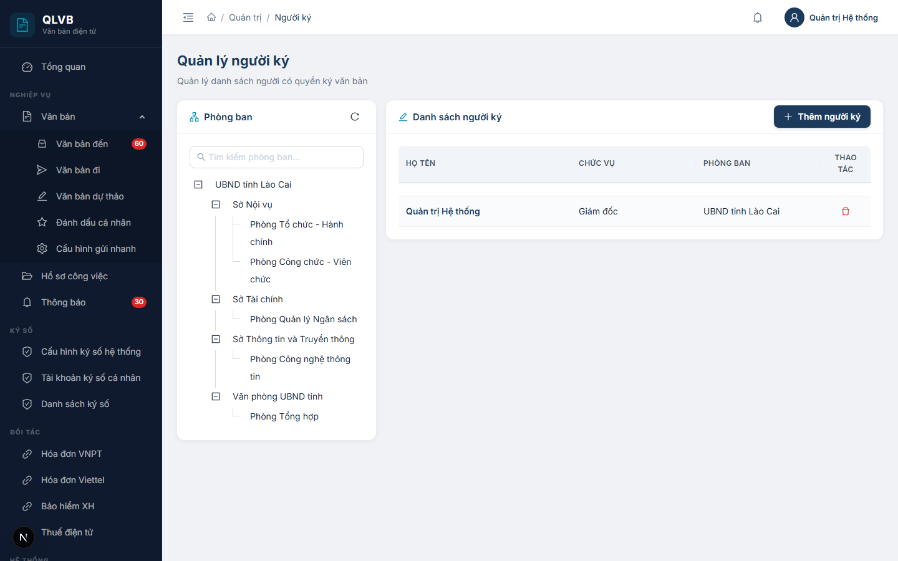

Màn hình được chia thành 2 cột chính cùng phần đầu trang:

- **Phần đầu trang**: Hiển thị tiêu đề "Quản lý người ký" và dòng mô tả ngắn "Quản lý danh sách người có quyền ký văn bản".
- **Cột trái — Phòng ban (cây phân cấp)**:
  - Tiêu đề khung "Phòng ban" với biểu tượng sơ đồ tổ chức màu xanh teal.
  - Nút **Tải lại** (biểu tượng mũi tên xoay tròn) ở góc trên bên phải khung — dùng để làm mới cây phòng ban.
  - **Ô tìm kiếm** (placeholder "Tìm kiếm phòng ban...") ở phía trên cây — có nút xóa nhanh.
  - Cây phân cấp đơn vị / phòng ban (mặc định mở rộng tất cả các nhánh).
  - Bấm vào một nhánh trên cây sẽ lọc bảng bên phải chỉ hiển thị người ký thuộc phòng ban đó.
- **Cột phải — Danh sách người ký**:
  - Tiêu đề khung "Danh sách người ký" với biểu tượng cây bút màu xanh teal.
  - Nút **Thêm người ký** (biểu tượng dấu cộng, màu xanh navy) ở góc trên bên phải khung — mở hộp thoại thêm mới.
  - Bảng dữ liệu liệt kê những người ký đã được thêm — không phân trang (hiển thị toàn bộ trên 1 trang).
  - Mỗi dòng có một nút **Xóa** hình thùng rác màu đỏ ở cột thao tác.
- **Hộp thoại phụ (Modal)**:
  - **Hộp thoại Thêm người ký** — mở giữa màn hình khi bấm nút Thêm.
  - **Hộp xác nhận xóa** — mở khi bấm nút thùng rác, yêu cầu xác nhận trước khi thực hiện.

---

### 3. Các cột trong Bảng danh sách người ký

| Tên cột | Mô tả |
|---|---|
| **Họ tên** | Họ và tên đầy đủ của người ký — hiển thị in đậm, màu xanh navy. Lấy tự động từ thông tin nhân viên đã chọn. Nếu tên dài sẽ tự động cắt bớt và hiện tooltip khi rê chuột. |
| **Chức vụ** | Chức vụ của người ký (ví dụ: "Giám đốc", "Phó Giám đốc", "Trưởng phòng"). Lấy từ chức vụ đang gán cho nhân viên trong hồ sơ nhân sự. Khi ký văn bản, chức vụ này sẽ được in dưới phần "Người ký". |
| **Phòng ban** | Phòng ban / đơn vị mà người ký được gán vào trong danh mục này (theo nhánh đã chọn ở cây bên trái khi thêm). |
| **Thao tác** | Nút **thùng rác đỏ** — bấm để xóa người ký khỏi danh sách. |

> **Lưu ý**: Ba cột Họ tên, Chức vụ, Phòng ban đều được lấy tự động khi thêm người ký — không có ô nhập tay. Nếu sau này cần đổi chức vụ của một người ký, hãy sửa thông tin nhân viên ở màn hình **Quản trị > Nhân viên** (chức vụ hiển thị ở đây sẽ tự cập nhật theo).

---

### 4. Các trường trong hộp thoại Thêm người ký

*[Hình minh họa: Hộp thoại Thêm người ký]*

Khi bấm **Thêm người ký**, hệ thống mở hộp thoại giữa màn hình với các trường sau:

| Tên trường | Bắt buộc | Mô tả & ràng buộc |
|---|---|---|
| **Phòng ban / đơn vị (chọn từ cây bên trái)** | Có | **Phải chọn nhánh trên cây bên trái TRƯỚC khi bấm Thêm người ký**. Người ký mới sẽ được gán vào nhánh đang chọn. Nếu chưa chọn, hệ thống cảnh báo "Vui lòng chọn phòng ban / đơn vị từ cây bên trái trước". |
| **Nhân viên** | Có | Ô chọn (combobox) có hỗ trợ tìm kiếm — gõ một phần họ tên để lọc nhanh. Mỗi mục hiển thị theo định dạng `<Họ tên> - <Chức vụ> - <Phòng ban>`. Danh sách nhân viên được lấy theo phòng ban / đơn vị đã chọn ở cây bên trái — chỉ hiển thị nhân viên thuộc phạm vi đó. Nếu không chọn nhân viên mà bấm **Thêm**, hệ thống cảnh báo "Vui lòng chọn nhân viên". |

> **Lưu ý**: Hộp thoại chỉ có duy nhất một ô **chọn nhân viên**. Toàn bộ thông tin chức vụ và phòng ban được hiển thị tự động theo hồ sơ nhân viên — màn hình **không có** trường nhập "Loại ký" tách riêng cho các trường hợp ký thay (KT.), thừa lệnh (TL.), quyền (Q.) theo Nghị định 30/2020. Bảng người ký cũng chỉ lưu liên kết tới nhân viên, không có cột nào khác để ghi loại ký. Nếu muốn người này ký với một danh xưng khác (ví dụ "Phó Giám đốc" thay vì "Trưởng phòng"), cần cập nhật trường **Chức vụ** của nhân viên đó ở **Quản trị > Nhân viên** trước khi thêm vào danh sách người ký. Khi cần ghi nhãn "KT." / "TL." / "Q." trên văn bản chính thức, đặt sẵn vào chính tên chức vụ của nhân viên đó (ví dụ "KT. Giám đốc — Phó Giám đốc").

---

### 5. Các nút chức năng

| Nút | Vị trí | Khi nào hiển thị | Tác dụng |
|---|---|---|---|
| **Thêm người ký** | Góc trên bên phải khung "Danh sách người ký" | Luôn hiển thị | Mở hộp thoại Thêm người ký. **Trước khi bấm, phải chọn một nhánh trên cây bên trái** để xác định người ký được gán vào phòng ban / đơn vị nào. |
| **Tải lại** (biểu tượng mũi tên xoay tròn) | Góc trên bên phải khung "Phòng ban" | Luôn hiển thị | Tải lại toàn bộ cây phòng ban từ máy chủ. Dùng khi nghi ngờ dữ liệu không đồng bộ (ví dụ: vừa thêm phòng ban mới ở màn hình khác). |
| **Ô tìm kiếm "Tìm kiếm phòng ban..."** | Phía trên cây phân cấp bên trái | Luôn hiển thị | Lọc các nhánh trên cây theo từ khóa nhập. Có nút xóa nhanh để bỏ từ khóa và hiển thị lại toàn bộ cây. |
| **(Nhánh trên cây)** | Cây phòng ban bên trái | Luôn hiển thị | Bấm vào một nhánh sẽ lọc bảng bên phải chỉ còn người ký thuộc phòng ban đó. Bấm lại nhánh đó (hoặc bấm nhánh khác) để đổi bộ lọc. |
| **Xóa** (biểu tượng thùng rác đỏ) | Cột thao tác trên mỗi dòng của bảng | Luôn hiển thị | Mở hộp xác nhận, sau đó xóa người ký khỏi danh sách. |
| **Thêm** | Góc dưới bên phải hộp thoại Thêm người ký | Trong hộp thoại Thêm | Lưu người ký mới. Có biểu tượng đợi (loading) khi đang xử lý. |
| **Hủy** | Góc dưới bên phải hộp thoại Thêm người ký | Trong hộp thoại Thêm | Đóng hộp thoại, không thêm. |
| **Xóa** / **Hủy** trong hộp xác nhận | Trong hộp xác nhận xóa | Khi mở hộp xác nhận | **Xóa** (màu đỏ) — thực hiện xóa. **Hủy** — đóng hộp, không xóa. |

---

### 6. Quy trình thao tác chính

#### 6.1. Thêm mới một người ký

1. Trên cây bên trái, **bấm chọn nhánh phòng ban / đơn vị** mà người ký sẽ được gán vào (ví dụ: bấm "Văn phòng UBND" nếu đang muốn thêm Chánh Văn phòng).
   - Nếu chưa biết tên phòng ban, có thể gõ vào ô **Tìm kiếm phòng ban...** để lọc nhanh.
2. Bấm nút **Thêm người ký** ở góc trên bên phải bảng.
3. Hộp thoại **Thêm người ký** mở ra. Trong ô chọn nhân viên:
   - Gõ một phần họ tên để hệ thống lọc nhanh, hoặc cuộn để tìm.
   - Mỗi mục hiển thị `<Họ tên> - <Chức vụ> - <Phòng ban>` để dễ phân biệt khi có người trùng tên.
   - Bấm chọn nhân viên cần thêm.
4. Bấm **Thêm**.
5. Hệ thống thông báo **"Thêm người ký thành công"**, đóng hộp thoại và bảng tự động cập nhật, hiển thị người vừa thêm.

*[Hình minh họa: Hộp thoại Thêm người ký đã chọn nhân viên]*

> **Nếu chưa chọn nhánh trên cây**: bấm **Thêm** sẽ thấy cảnh báo "Vui lòng chọn phòng ban / đơn vị từ cây bên trái trước". Đóng cảnh báo, bấm chọn nhánh trên cây rồi bấm lại **Thêm người ký**.

#### 6.2. Xóa một người ký

1. Tìm người ký cần xóa trên bảng (có thể bấm nhánh trên cây bên trái để thu hẹp danh sách).
2. Trên dòng tương ứng, bấm biểu tượng **thùng rác đỏ** ở cột Thao tác.
3. Hộp xác nhận hiện ra với câu hỏi *"Bạn có chắc chắn muốn xóa người ký '<Họ tên>'?"*.

   *[Hình minh họa: Hộp xác nhận xóa]*
4. Bấm **Xóa** (màu đỏ) để xác nhận, hoặc **Hủy** để bỏ qua.
5. Hệ thống thông báo **"Xóa người ký thành công"** và bảng cập nhật ngay.

> **Lưu ý**: Xóa khỏi danh sách người ký **không** xóa nhân viên khỏi hệ thống — chỉ là gỡ quyền ký văn bản. Nhân viên vẫn còn nguyên trong **Quản trị > Nhân viên**, có thể đăng nhập, nhận giao việc bình thường. Nếu sau này muốn cấp lại quyền ký, chỉ cần thêm lại vào danh sách.

#### 6.3. Lọc danh sách theo phòng ban

1. Trên cây **Phòng ban** ở bên trái, bấm chọn nhánh cần xem.
2. Bảng bên phải tự động cập nhật, chỉ hiển thị những người ký thuộc nhánh đó.
3. Để xem **toàn bộ** người ký của đơn vị, bấm vào nhánh hiện đang chọn lần nữa để bỏ chọn (hoặc tải lại trang).

#### 6.4. Tìm kiếm phòng ban trên cây

1. Trên ô **Tìm kiếm phòng ban...** ở phía trên cây bên trái, gõ một phần tên phòng ban (có thể không cần dấu).
2. Cây sẽ tự động lọc, chỉ hiển thị các nhánh chứa từ khóa kèm các nhánh cha của chúng.
3. Bấm biểu tượng **dấu nhân** trong ô tìm kiếm để xóa từ khóa và hiển thị lại toàn bộ cây.

---

### 7. Lưu ý / Ràng buộc nghiệp vụ

#### 7.1. Một nhân viên chỉ được thêm một lần trong cùng đơn vị

Trong **cùng một đơn vị**, mỗi nhân viên **chỉ được thêm vào danh sách người ký một lần duy nhất**. Khi cố thêm trùng, hệ thống báo:

> *"Nhân viên đã có trong danh sách người ký"*

Nếu người ký đó đã chuyển sang phòng ban khác trong cùng đơn vị nhưng vẫn giữ quyền ký, **bản ghi người ký không tự cập nhật phòng ban**. Khi thêm người ký, hệ thống ghi cứng phòng ban của nhân viên tại đúng thời điểm đó vào danh sách người ký; sau đó nếu nhân viên đổi phòng ban trong **Quản trị > Nhân viên** thì cột **Phòng ban** trong danh sách người ký vẫn hiển thị phòng ban cũ. Cách xử lý đúng: **xóa** bản ghi người ký cũ rồi **thêm lại** sau khi đã chọn đúng phòng ban mới trên cây bên trái — bản ghi mới sẽ ghi nhận phòng ban hiện tại của nhân viên.

#### 7.2. Nhân viên đã xóa không thể chọn làm người ký

Hệ thống chỉ cho phép thêm người ký từ những nhân viên **đang còn hoạt động** (chưa bị xóa khỏi hệ thống). Nếu cố thêm một nhân viên đã bị xóa, hệ thống báo:

> *"Nhân viên không tồn tại"*

Trường hợp này thường gặp khi danh sách trên client còn cache cũ — hãy bấm **Tải lại** trên cây phòng ban hoặc tải lại trang.

#### 7.3. Phải chọn phòng ban / đơn vị trước khi thêm

Hệ thống yêu cầu **bấm chọn một nhánh trên cây bên trái trước khi thêm người ký**. Lý do:

- Người ký phải gắn với một phòng ban / đơn vị cụ thể để đúng phạm vi nghiệp vụ.
- Danh sách nhân viên trong ô chọn sẽ được lọc theo nhánh đã chọn — giúp người dùng dễ tìm.

Nếu chưa chọn nhánh:

> *"Vui lòng chọn phòng ban / đơn vị từ cây bên trái trước"*

#### 7.4. Phải chọn nhân viên trong hộp thoại

Sau khi mở hộp thoại Thêm người ký, nếu bấm **Thêm** mà chưa chọn nhân viên trong ô chọn:

> *"Vui lòng chọn nhân viên"*

#### 7.5. Phạm vi dữ liệu theo đơn vị

Khi mở màn hình, hệ thống mặc định chỉ hiển thị danh sách người ký thuộc **đơn vị của người đăng nhập**. Người dùng không nhìn thấy danh sách người ký của đơn vị khác.

Khi tạo mới, người ký sẽ tự động được gán cho đơn vị của người đăng nhập (hệ thống tự xác định đơn vị cha cao nhất từ phòng ban được chọn) — không cần chọn đơn vị thủ công.

#### 7.6. Liên hệ với chức năng "Soạn văn bản đi" / "Dự thảo"

Danh sách người ký quản lý ở màn hình này được dùng trực tiếp cho:

- **Văn bản đi** → ô chọn **Người ký** khi soạn văn bản.
- **Dự thảo văn bản** → ô chọn **Người ký** khi tạo dự thảo.
- **Trình ký số (ký số văn bản)** → người ký trong yêu cầu ký số được lấy từ danh sách này.

Vì vậy, cần đảm bảo **luôn cập nhật danh sách kịp thời**:

- Có lãnh đạo mới được bổ nhiệm → thêm vào.
- Lãnh đạo nghỉ hưu / chuyển công tác → xóa khỏi danh sách (nhưng giữ nguyên nhân viên trong hệ thống).
- Đổi chức vụ → cập nhật chức vụ ở **Quản trị > Nhân viên** (chức vụ hiển thị tại đây sẽ tự cập nhật).

#### 7.7. Không có chức năng sửa

Bảng người ký không có nút **Sửa**. Nếu cần thay đổi chức vụ / phòng ban hiển thị, hãy thực hiện ở màn hình **Quản trị > Nhân viên**. Nếu cần đổi sang một nhân viên khác, hãy **xóa** và **thêm mới** lại với nhân viên đúng.

#### 7.8. Bảng tổng hợp các thông báo của hệ thống

| Tình huống | Thông báo |
|---|---|
| Thêm người ký thành công (frontend) | Thêm người ký thành công |
| Thêm người ký thành công (backend) | Them nguoi ky thanh cong |
| Xóa người ký thành công (frontend) | Xóa người ký thành công |
| Xóa người ký thành công (backend) | Xoa nguoi ky thanh cong |
| Chưa chọn nhân viên trong hộp thoại | Vui lòng chọn nhân viên |
| Chưa chọn phòng ban / đơn vị trên cây | Vui lòng chọn phòng ban / đơn vị từ cây bên trái trước |
| Thêm trùng nhân viên trong cùng đơn vị | Nhân viên đã có trong danh sách người ký |
| Nhân viên đã xóa / không tồn tại | Nhân viên không tồn tại |
| Không tìm thấy người ký khi xóa | Không tìm thấy người ký |
| Đơn vị bắt buộc (chưa xác định được đơn vị) | Đơn vị là bắt buộc |
| Lỗi tải dữ liệu cây phòng ban | Lỗi tải dữ liệu đơn vị |
| Lỗi tải danh sách người ký | Lỗi tải danh sách người ký |
| Lỗi tải danh sách nhân viên (trong hộp thoại) | Lỗi tải danh sách nhân viên |
| Lỗi khi thêm người ký (chung) | Lỗi khi thêm người ký |
| Lỗi khi xóa (chung) | Lỗi khi xóa |

---

*Tài liệu được biên soạn dựa trên hệ thống thực tế đang triển khai. Mọi thắc mắc vui lòng liên hệ với đội phát triển để được hỗ trợ.*


\newpage
