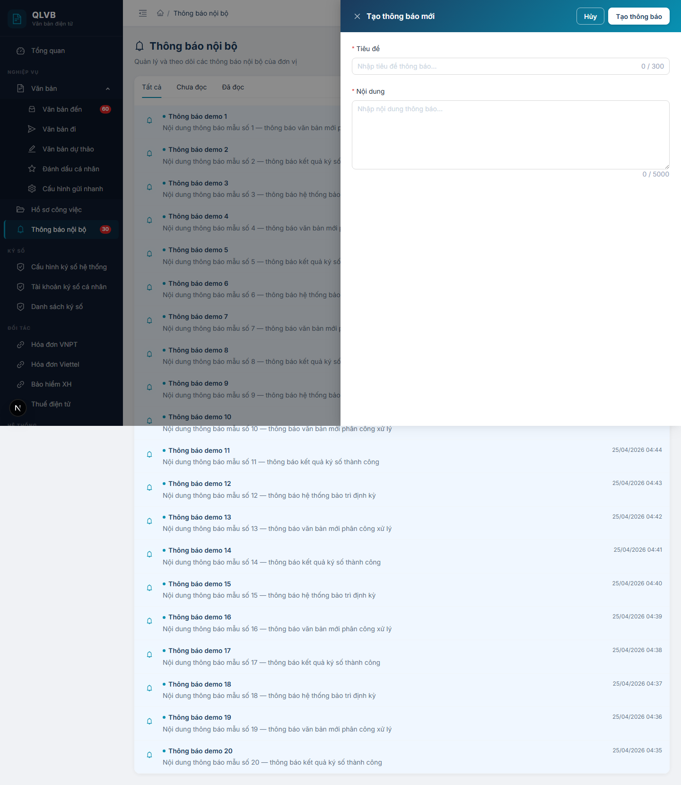
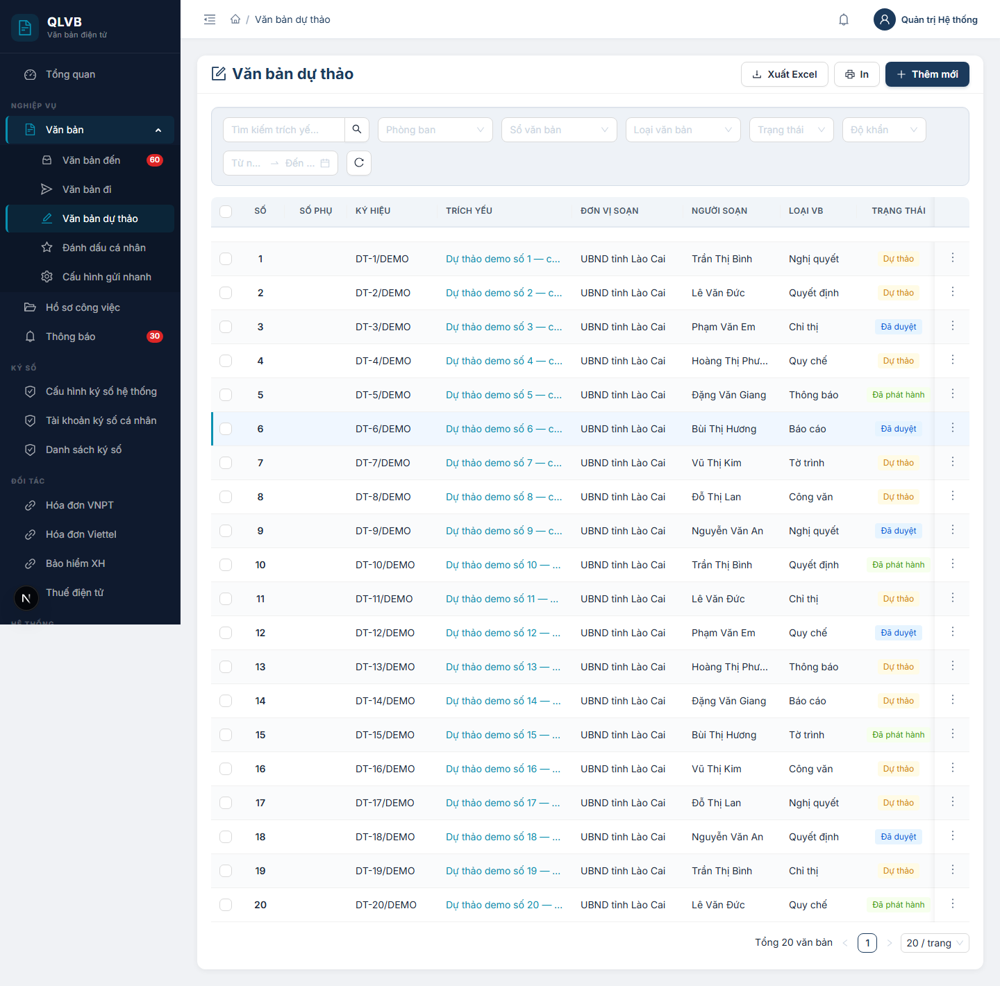
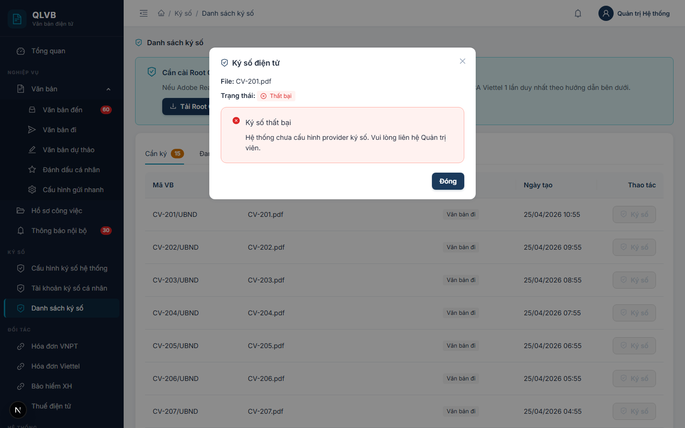

# Hướng dẫn sử dụng — Hệ thống Quản lý văn bản điện tử (e-Office)

Bộ tài liệu này mô tả đầy đủ các chức năng của hệ thống Quản lý văn bản điện tử (e-Office) phiên bản hiện hành, dành cho người dùng cuối là cán bộ, công chức và lãnh đạo trong các cơ quan, đơn vị.

## 1. Giới thiệu chung

**e-Office** là hệ thống quản lý văn bản điện tử dùng cho cơ quan nhà nước cấp tỉnh (ví dụ: tỉnh Lào Cai) và doanh nghiệp nhà nước. Hệ thống cho phép toàn bộ nhân sự quản lý văn bản đến / đi / dự thảo, hồ sơ công việc, ký số điện tử, liên thông LGSP, tích hợp với các nhà cung cấp hóa đơn điện tử và các dịch vụ công khác.

**Các giá trị cốt lõi:**
- Số hóa toàn bộ luồng văn bản hành chính theo Nghị định 30/2020/NĐ-CP
- Ký số điện tử trực tiếp trong hệ thống (kết nối VNPT SmartCA, Viettel MySign)
- Phân quyền nhiều cấp theo đơn vị, chức vụ và vai trò
- Truy cập mọi nơi qua trình duyệt — không cần cài đặt phần mềm

## 2. Đăng nhập hệ thống

Mở trình duyệt, truy cập địa chỉ hệ thống do quản trị cấp. Đăng nhập bằng **Tên đăng nhập** và **Mật khẩu** được cấp.

Sau khi đăng nhập thành công, hệ thống tự động chuyển đến **Trang Tổng quan**.

Chi tiết: xem mục Đăng nhập và Thông tin cá nhân.

## 3. Bố cục giao diện chung

Sau khi đăng nhập, giao diện hệ thống gồm 3 phần chính:

- **Thanh điều hướng bên trái (sidebar)**: chứa toàn bộ menu các chức năng. Có thể thu gọn / mở rộng bằng nút ba gạch ở góc trên bên trái.
- **Thanh tiêu đề (header)**: chứa biểu tượng chuông thông báo, ảnh đại diện và menu tài khoản (xem thông tin cá nhân, đăng xuất).
- **Khu vực nội dung chính**: hiển thị nội dung của chức năng đang chọn.

## 4. Vai trò người dùng

Hệ thống phân biệt 4 vai trò chính, mỗi vai trò có phạm vi chức năng khác nhau:

| Vai trò | Mô tả ngắn |
|---|---|
| **Quản trị hệ thống** | Cấu hình toàn bộ hệ thống — đơn vị, người dùng, danh mục, ký số, liên thông |
| **Văn thư** | Tiếp nhận văn bản đến, vào sổ, phát hành văn bản đi |
| **Lãnh đạo** (Ban Lãnh đạo / Chỉ đạo điều hành) | Phê duyệt, ký số, phân công xử lý văn bản và hồ sơ công việc |
| **Cán bộ thường** | Soạn dự thảo, xử lý văn bản được giao, theo dõi hồ sơ công việc |

Một người dùng có thể được gán **nhiều vai trò** cùng lúc; quyền hạn sẽ là tập hợp của tất cả các vai trò.

## 5. Quy ước trong tài liệu

- **Chữ in đậm** trong dấu nháy hoặc trên ô vuông — tên các nút bấm, tên các ô nhập, tên các trạng thái.
- *Chữ in nghiêng trong dấu nháy* — thông báo do hệ thống hiển thị.
- Bảng "**Tên trường — Bắt buộc — Mô tả & ràng buộc**" — liệt kê tất cả các ô nhập trong cửa sổ Thêm / Sửa.
- Bảng "**Nút — Vị trí — Khi nào hiển thị — Tác dụng**" — liệt kê tất cả các nút có trên màn hình.
- Bảng "**Tình huống — Thông báo**" ở cuối mỗi tài liệu — liệt kê đầy đủ các thông báo hệ thống có thể hiện ra.
- Hình minh họa được đặt ở thư mục `screenshots/` đi kèm.

## 6. Liên hệ hỗ trợ

Mọi thắc mắc, góp ý hoặc yêu cầu hỗ trợ vui lòng liên hệ với đội phát triển hệ thống.

*Tài liệu được biên soạn dựa trên hệ thống thực tế đang triển khai (phiên bản 2.0). Mọi mô tả về chức năng, ô nhập, nút bấm và thông báo đều đối chiếu trực tiếp với mã nguồn hiện hành.*

# Phần I — Chi tiết các chức năng

## 1. Đăng nhập và Thông tin cá nhân

### 1.1. Giới thiệu

Hai màn hình thuộc nhóm xác thực và thông tin cá nhân là điểm bắt đầu của mọi phiên làm việc trên hệ thống Quản lý văn bản điện tử (e-Office). **Mọi cán bộ, công chức** đều sử dụng:

- Màn hình **Đăng nhập** (`/login`) — cửa ngõ duy nhất để truy cập hệ thống. Tài khoản (tên đăng nhập + mật khẩu) do Quản trị viên cấp, gắn với một bản ghi nhân sự thuộc một đơn vị, phòng ban, chức vụ và một hoặc nhiều vai trò.
- Màn hình **Thông tin cá nhân** (`/thong-tin-ca-nhan`) — nơi người dùng tự xem thông tin tài khoản và đổi mật khẩu của mình.

Sau khi đăng nhập thành công, hệ thống tự đưa người dùng đến màn hình **Tổng quan (Dashboard)**. Mỗi lần đăng nhập (cả thành công và thất bại) đều được ghi nhật ký kèm địa chỉ truy cập và trình duyệt sử dụng phục vụ tra cứu khi cần.

### 1.2. Quy trình thao tác và ràng buộc nghiệp vụ

**Quy trình đăng nhập đầu phiên làm việc:**
1. Mở trình duyệt, truy cập đường dẫn của hệ thống. Nếu chưa đăng nhập, hệ thống tự đưa về `/login`.
2. Nhập tên đăng nhập và mật khẩu được cấp.
3. Tùy chọn bỏ tích **Ghi nhớ đăng nhập** nếu đang dùng máy chung.
4. Bấm **Đăng nhập**. Hệ thống xác thực và chuyển đến trang **Tổng quan**.
5. Khi để trình duyệt không thao tác trong thời gian dài, phiên có thể hết hạn — hệ thống tự đưa về `/login`.

**Quy trình đổi mật khẩu định kỳ:**
1. Bấm vào ảnh đại diện ở góc trên bên phải, chọn **Thông tin cá nhân**.
2. Tab **Đổi mật khẩu** đã được mở sẵn ở cột phải.
3. Nhập mật khẩu hiện tại, mật khẩu mới và xác nhận lại mật khẩu mới.
4. Bấm **Đổi mật khẩu** để hoàn tất.

**Quy trình đăng xuất:**
1. Bấm vào ảnh đại diện ở góc trên bên phải, chọn **Đăng xuất**.
2. Xác nhận trong hộp thoại hiển thị.
3. Hệ thống đóng phiên đăng nhập và đưa về `/login`.

**Ràng buộc nghiệp vụ:**

- **Phạm vi tự sửa của người dùng**: chỉ tự đổi được mật khẩu. Các thông tin khác (họ tên, email, số điện thoại, ảnh đại diện, chức vụ, phòng ban, đơn vị, vai trò) chỉ Quản trị viên sửa được ở màn hình **Quản trị > Người dùng**.
- **Trạng thái tài khoản**: tài khoản bị **khóa** hoặc **xóa** không đăng nhập được. Cần liên hệ Quản trị viên để mở khóa hoặc cấp lại.
- **Quên mật khẩu**: hệ thống **không có** chức năng tự khôi phục mật khẩu. Người dùng cần liên hệ Quản trị viên để được đặt lại mật khẩu về mặc định **Admin@123**, sau đó tự đổi mật khẩu mới ở màn hình Thông tin cá nhân.
- **Quy tắc mật khẩu mới**: tối thiểu 6 ký tự, bắt buộc chứa cả chữ hoa, chữ thường và chữ số. Mật khẩu mới không được trùng với mật khẩu hiện tại.
- **Cấu hình tài khoản ký số** với nhà cung cấp (SmartCA VNPT, MySign Viettel...) đã được tách sang menu **Ký số > Tài khoản ký số cá nhân**, không nằm ở màn hình Thông tin cá nhân.

### 1.3. Các màn hình chức năng

#### 1.3.1. Màn hình Đăng nhập

##### 1.3.1.1. Bố cục màn hình

Màn hình chia làm hai cột ngang trên cùng một trang:

- **Cột trái — Giới thiệu hệ thống**: logo dạng biểu tượng tài liệu được bảo vệ, tiêu đề **"Quản lý Văn bản"**, dòng mô tả *"Hệ thống quản lý văn bản điện tử — Chuyển đổi số doanh nghiệp"* và ba dòng tính năng nổi bật: Bảo mật, Liên thông, Cộng tác.
- **Cột phải — Khung nhập thông tin đăng nhập**: tiêu đề **"Đăng nhập"**, dòng mô tả ngắn, hai ô nhập (Tên đăng nhập và Mật khẩu), ô tích **Ghi nhớ đăng nhập**, nút **Đăng nhập** lớn màu xanh navy. Dòng *"Phiên bản 2.0 · Chuyển đổi số Doanh nghiệp"* ở chân trang.

Trên thiết bị di động, hai cột tự xếp chồng dọc.

##### 1.3.1.2. Các nút chức năng

| Nút | Vị trí | Khi nào hiển thị | Tác dụng |
|---|---|---|---|
| **Đăng nhập** | Cuối khung bên phải | Luôn | Xác thực tài khoản. Trong khi xử lý, nút chuyển sang trạng thái đang quay (loading) và bị khóa. Có thể dùng phím `Enter` thay thế. |
| **Hiện/ẩn mật khẩu** (con mắt) | Bên trong ô Mật khẩu | Luôn | Bật/tắt hiển thị mật khẩu đang nhập. |

##### 1.3.1.3. Các trường nhập

| Tên trường | Bắt buộc | Mô tả & ràng buộc |
|---|---|---|
| **Tên đăng nhập** | Có | Tên đăng nhập do Quản trị viên cấp. Để trống và bấm Đăng nhập sẽ hiển thị thông báo *"Vui lòng nhập tên đăng nhập"*. |
| **Mật khẩu** | Có | Mật khẩu của tài khoản. Nhập dạng ẩn (chấm tròn). Để trống và bấm Đăng nhập sẽ hiển thị thông báo *"Vui lòng nhập mật khẩu"*. |
| **Ghi nhớ đăng nhập** | Không | Tích chọn để duy trì phiên đăng nhập lâu hơn cho lần truy cập kế tiếp. Mặc định đã tích. Bỏ tích nếu đang dùng máy dùng chung. |

##### 1.3.1.4. Thông báo của hệ thống

| Tình huống | Thông báo |
|---|---|
| Để trống ô Tên đăng nhập | Vui lòng nhập tên đăng nhập |
| Để trống ô Mật khẩu | Vui lòng nhập mật khẩu |
| Bấm Đăng nhập khi cả hai ô để trống (lỗi máy chủ) | Vui lòng nhập tên đăng nhập và mật khẩu |
| Tên đăng nhập không tồn tại | Tên đăng nhập hoặc mật khẩu không đúng |
| Mật khẩu sai | Tên đăng nhập hoặc mật khẩu không đúng |
| Tài khoản đã bị Quản trị viên xóa | Tài khoản đã bị xóa |
| Tài khoản đang bị khóa | Tài khoản đã bị khóa |
| Đăng nhập thành công | Đăng nhập thành công |
| Lỗi không xác định khác | Đăng nhập thất bại |

#### 1.3.2. Màn hình Thông tin cá nhân

##### 1.3.2.1. Bố cục màn hình

- **Phần đầu trang**: tiêu đề **"Thông tin cá nhân"** và dòng mô tả *"Xem thông tin tài khoản, đổi mật khẩu và quản lý ảnh chữ ký"*.
- **Cột trái — Thẻ thông tin tài khoản (chỉ xem)**:
  - Banner đầu thẻ: ảnh đại diện 72px, họ và tên (chữ to, đậm), tên đăng nhập kèm ký hiệu `@`, nhãn chức vụ (xanh teal) và nhãn **Quản trị viên** (vàng) nếu có.
  - Bảng 7 dòng thông tin: Họ và tên, Tên đăng nhập, Email, Số điện thoại, Chức vụ, Phòng ban, Đơn vị. Trường chưa có dữ liệu hiển thị chữ xám *"Chưa cập nhật"*.
- **Cột phải — Khung tác vụ**: thẻ chứa duy nhất tab **Đổi mật khẩu** (biểu tượng ổ khóa), mở sẵn.

Trên thiết bị di động, hai cột tự xếp chồng dọc — thẻ thông tin nằm trên, khung Đổi mật khẩu nằm dưới.

##### 1.3.2.2. Các nút chức năng

| Nút | Vị trí | Khi nào hiển thị | Tác dụng |
|---|---|---|---|
| **Đổi mật khẩu** | Cuối form ở cột phải | Luôn | Gửi yêu cầu đổi mật khẩu sau khi đã điền đủ ba ô nhập. Trong khi xử lý, nút chuyển sang trạng thái loading. |

##### 1.3.2.3. Các trường hiển thị (cột trái — chỉ xem)

| Tên trường | Mô tả |
|---|---|
| Ảnh đại diện | Ảnh đại diện của tài khoản. Nếu chưa có sẽ hiển thị biểu tượng người mặc định. |
| Họ và tên | Họ tên đầy đủ. Hiển thị cả ở banner và trong bảng. |
| Tên đăng nhập | Username dùng để đăng nhập. |
| Email | Địa chỉ email. Trống → *"Chưa cập nhật"*. |
| Số điện thoại | Số điện thoại liên hệ. Trống → *"Chưa cập nhật"*. |
| Chức vụ | Chức vụ trong cơ quan. Trống → *"Chưa cập nhật"*. |
| Phòng ban | Phòng ban đang công tác. Trống → *"Chưa cập nhật"*. |
| Đơn vị | Đơn vị cấp lớn (Sở, Ban, Ngành, Tổng công ty) chứa phòng ban. Trống → *"Chưa cập nhật"*. |
| Nhãn Chức vụ (banner) | Nhãn xanh teal. Hiển thị nếu tài khoản có chức vụ. |
| Nhãn Quản trị viên (banner) | Nhãn vàng. Hiển thị nếu tài khoản có quyền quản trị hệ thống. |

##### 1.3.2.4. Các trường nhập (cột phải — Tab Đổi mật khẩu)

| Tên trường | Bắt buộc | Mô tả & ràng buộc |
|---|---|---|
| **Mật khẩu hiện tại** | Có | Mật khẩu đang dùng để đăng nhập. Nhập dạng ẩn. Sai → *"Mật khẩu hiện tại không đúng"*. |
| **Mật khẩu mới** | Có | Mật khẩu mới muốn đặt. Tối thiểu 6 ký tự, bắt buộc chứa chữ hoa, chữ thường và chữ số. Không được trùng với mật khẩu hiện tại. |
| **Xác nhận mật khẩu mới** | Có | Nhập lại đúng mật khẩu mới. Khác với ô Mật khẩu mới → *"Mật khẩu xác nhận không khớp"* hiển thị ngay dưới ô. |

##### 1.3.2.5. Thông báo của hệ thống

| Tình huống | Thông báo |
|---|---|
| Để trống ô Mật khẩu hiện tại | Nhập mật khẩu hiện tại |
| Để trống ô Mật khẩu mới | Nhập mật khẩu mới |
| Mật khẩu mới ngắn hơn 6 ký tự | Tối thiểu 6 ký tự |
| Mật khẩu mới không có đủ chữ hoa / chữ thường / số | Phải chứa chữ hoa, chữ thường và số |
| Để trống ô Xác nhận mật khẩu mới | Xác nhận mật khẩu mới |
| Xác nhận mật khẩu khác mật khẩu mới | Mật khẩu xác nhận không khớp |
| Mật khẩu mới trùng mật khẩu hiện tại | Mật khẩu mới không được trùng với mật khẩu hiện tại |
| Mật khẩu hiện tại nhập sai | Mật khẩu hiện tại không đúng |
| Mật khẩu mới không thỏa quy tắc (chiều dài / chữ hoa / chữ thường / số) khi máy chủ kiểm tra | Mật khẩu mới phải có ít nhất 6 ký tự, chứa chữ hoa, chữ thường và số |
| Đổi mật khẩu thành công | Đổi mật khẩu thành công |
| Lỗi máy chủ không xác định | Lỗi đổi mật khẩu |

#### 1.3.3. Hộp xác nhận Đăng xuất

*[Hình minh họa: Hộp xác nhận Đăng xuất]*

##### 1.3.3.1. Bố cục màn hình

Hộp thoại nhỏ ở giữa màn hình, hiển thị câu hỏi *"Bạn có chắc chắn muốn đăng xuất?"* và hai nút thao tác. Hộp thoại được mở khi người dùng bấm vào ảnh đại diện ở góc trên bên phải và chọn **Đăng xuất** trong menu thả xuống.

##### 1.3.3.2. Các nút chức năng

| Nút | Vị trí | Khi nào hiển thị | Tác dụng |
|---|---|---|---|
| **Đăng xuất** (màu đỏ) | Bên phải hộp thoại | Luôn | Đóng phiên đăng nhập, xóa thông tin tài khoản khỏi trình duyệt và đưa về `/login`. |
| **Hủy** | Bên trái hộp thoại | Luôn | Đóng hộp thoại, giữ nguyên phiên đang đăng nhập. |

##### 1.3.3.3. Thông báo của hệ thống

| Tình huống | Thông báo |
|---|---|
| Đăng xuất thành công | Đăng xuất thành công |

## 2. Tổng quan (Dashboard)

### 2.1. Giới thiệu

**Tổng quan** là màn hình đầu tiên người dùng nhìn thấy ngay sau khi đăng nhập vào hệ thống Quản lý văn bản điện tử (e-Office). Màn hình đóng vai trò trang chủ — cho người dùng cái nhìn nhanh về khối lượng công việc đang chờ xử lý, xu hướng văn bản theo tháng, các văn bản và đầu việc mới nhất cùng các lối tắt tạo nhanh sang các phân hệ khác.

Đối tượng sử dụng là **toàn bộ cán bộ, công chức** đã đăng nhập vào hệ thống. Dữ liệu hiển thị trên màn hình **phụ thuộc vai trò người dùng**:

- **Quản trị viên** thấy số liệu tổng hợp toàn hệ thống.
- **Người dùng thông thường** chỉ thấy số liệu thuộc phòng ban, đơn vị mình (bao gồm cả các phòng ban con thuộc nhánh tổ chức của mình), kèm các văn bản và việc được giao trực tiếp cho cá nhân.

Hai phân hệ **Tin nhắn** và **Lịch họp** vẫn còn các chỉ số hiển thị trên Dashboard nhưng menu chính của hai module đã được tạm ẩn ở phiên bản này — sẽ mở lại ở các phiên bản kế tiếp khi module hoàn thiện.

### 2.2. Quy trình thao tác và ràng buộc nghiệp vụ

**Quy trình sử dụng hằng ngày:**

1. Đăng nhập vào hệ thống — hệ thống tự đưa đến màn hình **Tổng quan**.
2. Quan sát các thẻ thống kê ở đầu trang để biết khối lượng công việc đang chờ. Thẻ có giá trị khác 0 → có việc cần xử lý.
3. Bấm vào thẻ thống kê tương ứng để chuyển sang màn hình chi tiết (VB đến, VB đi, HSCV, Dự thảo, Thông báo).
4. Quan sát hai bảng "Văn bản mới nhận" và "Văn bản đi mới" để nắm 5 văn bản mới nhất; danh sách "Việc sắp tới hạn" để nắm hồ sơ công việc gần hạn.
5. Sử dụng khu vực "Thao tác nhanh" để tạo mới văn bản đến, văn bản đi, dự thảo, hồ sơ công việc... mà không cần vào menu sidebar.

**Ràng buộc nghiệp vụ:**

- **Phạm vi dữ liệu**: bốn thẻ chính (VB đến chưa đọc, VB đi chờ duyệt, Hồ sơ công việc, Việc quá hạn), hai bảng VB mới và biểu đồ thống kê đều **lọc theo phòng ban — đơn vị** của người dùng đối với người dùng thường, **toàn hệ thống** đối với Quản trị viên.
- **Việc sắp tới hạn**: chỉ tính các hồ sơ công việc mà người dùng được giao trực tiếp.
- **Tin nhắn chưa đọc**: luôn tính theo cá nhân người đang đăng nhập (không phải theo phòng ban).
- **Module tạm ẩn**: thẻ "Tin nhắn chưa đọc", "Lịch họp hôm nay" và hai nút Thao tác nhanh "Soạn tin nhắn", "Tạo lịch" vẫn hoạt động (bấm dẫn đến trang tương ứng) nhưng menu sidebar của hai module này đã được ẩn ở phiên bản hiện tại.
- **Tự động tải lại**: dữ liệu được tải khi vào trang. Để cập nhật số liệu mới nhất, tải lại trang trình duyệt (`F5`) hoặc rời và quay lại màn hình.

### 2.3. Các màn hình chức năng

#### 2.3.1. Màn hình Tổng quan

##### 2.3.1.1. Bố cục màn hình

Màn hình xếp dọc thành 4 khu vực, từ trên xuống:

- **Phần đầu trang**: lời chào *"Xin chào, [Họ tên người dùng]"* và dòng mô tả *"Tổng quan hoạt động hệ thống văn bản"*.
- **Khu vực 1 — Hàng thẻ thống kê**: 8 thẻ thống kê màu sắc khác nhau, mỗi thẻ là một hình chữ nhật bo tròn. Trên desktop hiển thị 8 thẻ trên một hàng; trên thiết bị di động xếp 2 thẻ một hàng. Bấm vào thẻ → chuyển đến màn hình chi tiết tương ứng.
- **Khu vực 2 — Biểu đồ thống kê**: 2 biểu đồ trên cùng một hàng — biểu đồ cột "Văn bản đến/đi theo tháng" (chiếm phần lớn bên trái) và biểu đồ tròn "HSCV theo trạng thái" (bên phải).
- **Khu vực 3 — Văn bản đến mới + Việc sắp tới hạn**: bảng "Văn bản mới nhận" (bên trái, 5 dòng) và khung "Việc sắp tới hạn" (bên phải).
- **Khu vực 4 — Văn bản đi mới + Thao tác nhanh**: bảng "Văn bản đi mới" (bên trái, 5 dòng) và lưới 6 nút "Thao tác nhanh" (bên phải).

Trên thiết bị di động, các khu vực và các cột bên trong tự xếp chồng dọc.

##### 2.3.1.2. Các nút chức năng

| Nút | Vị trí | Khi nào hiển thị | Tác dụng |
|---|---|---|---|
| Thẻ **VB đến chưa đọc** | Khu vực 1 | Luôn | Chuyển đến màn hình **Văn bản đến**. |
| Thẻ **VB đi chờ duyệt** | Khu vực 1 | Luôn | Chuyển đến màn hình **Văn bản đi**. |
| Thẻ **Hồ sơ công việc** | Khu vực 1 | Luôn | Chuyển đến màn hình **Hồ sơ công việc**. |
| Thẻ **Việc quá hạn** | Khu vực 1 | Luôn | Chuyển đến màn hình **Hồ sơ công việc**. |
| Thẻ **Dự thảo chờ phát hành** | Khu vực 1 | Luôn | Chuyển đến màn hình **Văn bản dự thảo**. |
| Thẻ **Tin nhắn chưa đọc** *(module tạm ẩn ở phiên bản này)* | Khu vực 1 | Luôn | Chuyển đến trang Tin nhắn. |
| Thẻ **Thông báo chưa đọc** | Khu vực 1 | Luôn | Chuyển đến màn hình **Thông báo nội bộ**. |
| Thẻ **Lịch họp hôm nay** *(module tạm ẩn ở phiên bản này)* | Khu vực 1 | Luôn | Chuyển đến trang Lịch cơ quan. |
| **Xem thêm** | Góc phải tiêu đề bảng "Văn bản mới nhận" | Luôn | Mở danh sách đầy đủ ở **Văn bản đến**. |
| **Xem thêm** | Góc phải tiêu đề khung "Việc sắp tới hạn" | Luôn | Mở danh sách đầy đủ ở **Hồ sơ công việc**. |
| **Xem thêm** | Góc phải tiêu đề bảng "Văn bản đi mới" | Luôn | Mở danh sách đầy đủ ở **Văn bản đi**. |
| **Tạo VB đến** | Khu vực 4 | Luôn | Mở màn hình **Văn bản đến** để tạo mới. |
| **Tạo VB đi** | Khu vực 4 | Luôn | Mở màn hình **Văn bản đi** để tạo mới. |
| **Soạn dự thảo** | Khu vực 4 | Luôn | Mở màn hình **Văn bản dự thảo** để soạn mới. |
| **Soạn tin nhắn** *(module tạm ẩn ở phiên bản này)* | Khu vực 4 | Luôn | Mở trang Tin nhắn. |
| **Tạo HSCV** | Khu vực 4 | Luôn | Mở màn hình **Hồ sơ công việc** để tạo mới. |
| **Tạo lịch** *(module tạm ẩn ở phiên bản này)* | Khu vực 4 | Luôn | Mở trang Lịch cá nhân. |

##### 2.3.1.3. Các trường dữ liệu

**Bảng thẻ thống kê (Khu vực 1):**

| Tên thẻ | Mô tả |
|---|---|
| VB đến chưa đọc | Số văn bản đến chưa được người dùng (hoặc phòng ban) đọc. |
| VB đi chờ duyệt | Số văn bản đi đang trong trạng thái chờ lãnh đạo duyệt. |
| Hồ sơ công việc | Tổng số hồ sơ công việc thuộc phạm vi của người dùng. |
| Việc quá hạn | Số hồ sơ công việc đã quá hạn xử lý. |
| Dự thảo chờ phát hành | Số văn bản dự thảo đã được duyệt nhưng chưa phát hành thành VB đi. |
| Tin nhắn chưa đọc | Số tin nhắn nội bộ gửi đến cá nhân chưa đọc. |
| Thông báo chưa đọc | Số thông báo nội bộ của đơn vị chưa được người dùng đọc. |
| Lịch họp hôm nay | Số cuộc họp / sự kiện sử dụng phòng họp diễn ra trong ngày hôm nay. |

**Biểu đồ (Khu vực 2):**

| Biểu đồ | Loại | Nội dung |
|---|---|---|
| Văn bản đến/đi theo tháng | Cột nhóm | Mỗi tháng có 2 cột: VB đến (xanh navy) và VB đi (xanh teal). Hiển thị 6 tháng gần nhất theo định dạng `MM/YYYY`. Trục dọc là số lượng. Khi không có dữ liệu, hiển thị nền trắng. |
| HSCV theo trạng thái | Tròn (donut) | Phân bố hồ sơ công việc theo các trạng thái: Mới, Đang xử lý, Chờ duyệt, Đã duyệt, Hoàn thành, Từ chối, Trả về. Mỗi lát bánh là một trạng thái kèm số lượng. Khi không có dữ liệu hiển thị dòng *"Chưa có dữ liệu"*. |

Rê chuột lên biểu đồ để xem chi tiết số liệu (tooltip).

**Bảng "Văn bản mới nhận" (Khu vực 3 — bên trái):**

| Tên cột | Mô tả |
|---|---|
| Số/Ký hiệu | Số ký hiệu đã đăng số của văn bản đến. Trống hiển thị `—`. |
| Trích yếu | Nội dung trích yếu, bị cắt nếu quá dài (`...`). |
| Ngày nhận | Ngày văn bản được tiếp nhận, định dạng `DD/MM/YYYY`. |
| Độ khẩn | Nhãn màu: đỏ (Hỏa tốc), cam (Khẩn), xanh (các mức còn lại). Trống không hiển thị nhãn. |

**Khung "Việc sắp tới hạn" (Khu vực 3 — bên phải):**

| Tên trường | Mô tả |
|---|---|
| Tên việc | Tên hồ sơ công việc, in đậm. |
| Trạng thái | Nhãn màu theo trạng thái: Mới (xám), Đang xử lý / Chờ duyệt (xanh dương), Đã duyệt (cam), Hoàn thành (xanh lá), Từ chối / Trả về (đỏ). |
| Tiến độ | Thanh tiến độ phần trăm (xanh teal). |
| Thời hạn | Ngày hết hạn, định dạng `DD/MM`. Trống hiển thị `—`. |

Khi không có dữ liệu, khung hiển thị dòng *"Không có việc sắp tới hạn"*.

**Bảng "Văn bản đi mới" (Khu vực 4 — bên trái):**

| Tên cột | Mô tả |
|---|---|
| Số/Ký hiệu | Số ký hiệu của văn bản đi. Trống hiển thị `—`. |
| Trích yếu | Nội dung trích yếu, bị cắt nếu quá dài. |
| Ngày ban hành | Ngày phát hành, định dạng `DD/MM/YYYY`. |
| Loại VB | Nhãn xanh dương ghi loại văn bản. Trống không hiển thị nhãn. |

##### 2.3.1.4. Thông báo của hệ thống

| Tình huống | Thông báo |
|---|---|
| Bảng "Văn bản mới nhận" không có dữ liệu | Chưa có văn bản mới |
| Bảng "Văn bản đi mới" không có dữ liệu | Chưa có văn bản đi mới |
| Khung "Việc sắp tới hạn" không có dữ liệu | Không có việc sắp tới hạn |
| Biểu đồ "HSCV theo trạng thái" không có dữ liệu | Chưa có dữ liệu |

## 3. Thông báo nội bộ

### 3.1. Giới thiệu

Hệ thống có hai vùng thông báo độc lập, phục vụ hai mục đích khác nhau:

- **Chuông thông báo cá nhân (Bell)** — biểu tượng chuông ở góc trên bên phải của thanh tiêu đề (header). Đây là kênh **thông báo cá nhân tự động** do hệ thống sinh ra cho từng người dùng (ví dụ: ký số thành công, ký số thất bại, được giao xử lý văn bản đến, được giao việc, lãnh đạo có ý kiến chỉ đạo). Mỗi người dùng chỉ thấy thông báo của riêng mình.
- **Trang Thông báo nội bộ** (`/thong-bao`) — danh sách các **thông báo do người (Quản trị viên) tự soạn** cho toàn đơn vị: thông báo họp, thông báo bảo trì hệ thống, thông báo nghỉ lễ, hướng dẫn... Mọi cán bộ trong cùng đơn vị đều thấy chung một danh sách này.

Nhân sự sử dụng:
- **Mọi cán bộ** đều có chuông thông báo cá nhân và đều có thể đọc danh sách Thông báo nội bộ.
- **Quản trị viên** có thêm quyền soạn thông báo mới ở trang Thông báo nội bộ.

Khi có thông báo mới gửi tới (qua kết nối thời gian thực với máy chủ), chuông sẽ hiện chấm đỏ kèm số đếm và một ô **toast** nhỏ trượt từ góc phải màn hình trong khoảng 3 giây.

### 3.2. Quy trình thao tác và ràng buộc nghiệp vụ

**Quy trình theo dõi thông báo cá nhân (chuông):**

1. Quan sát chấm đỏ trên biểu tượng chuông ở header — số trên chấm đỏ là số thông báo chưa đọc (hiển thị tối đa 99+).
2. Bấm vào biểu tượng chuông để mở dropdown hiển thị 10 thông báo gần nhất.
3. Bấm vào một dòng thông báo — hệ thống tự đánh dấu là đã đọc và chuyển đến trang liên quan (nếu có liên kết).
4. Bấm **Đánh dấu đã đọc tất cả** ở góc trên bên phải dropdown để xóa toàn bộ chấm đỏ.

**Quy trình theo dõi Thông báo nội bộ:**

1. Vào menu **Thông báo nội bộ** (hoặc bấm thẻ "Thông báo chưa đọc" trên Tổng quan).
2. Lọc theo tab **Tất cả / Chưa đọc / Đã đọc** để xem nhóm tương ứng.
3. Bấm vào một dòng thông báo chưa đọc — hệ thống tự đánh dấu là đã đọc.
4. Bấm **Đánh dấu đã đọc tất cả** để đánh dấu toàn bộ thông báo của đơn vị mình là đã đọc.

**Quy trình tạo Thông báo nội bộ (chỉ Quản trị viên):**

1. Ở trang Thông báo nội bộ, bấm **Tạo thông báo** ở góc phải đầu trang. Drawer "Tạo thông báo mới" mở ra.
2. Nhập **Tiêu đề** (tối đa 300 ký tự) và **Nội dung** (tối đa 5000 ký tự).
3. Bấm **Tạo thông báo** trong drawer để gửi.
4. Sau khi tạo, danh sách tự cập nhật. Toàn bộ cán bộ trong đơn vị sẽ thấy thông báo mới ở dòng đầu danh sách.

**Ràng buộc nghiệp vụ:**

- **Quyền tạo Thông báo nội bộ**: chỉ tài khoản có quyền **Quản trị viên** thấy nút **Tạo thông báo**.
- **Phạm vi nhìn thấy**: Thông báo nội bộ được phát hành cho **đơn vị cấp gốc** chứa phòng ban của người tạo. Người dùng thuộc cùng đơn vị (kể cả các phòng ban con) đều thấy chung. Người dùng đơn vị khác **không thấy**.
- **Đánh dấu đã đọc**: thực hiện trên từng người dùng — mỗi cán bộ có trạng thái đọc/chưa đọc riêng cho từng thông báo của đơn vị.
- **Người tạo lấy từ phiên đăng nhập**: hệ thống tự ghi nhận người tạo từ tài khoản đang đăng nhập, không cho phép giả mạo người tạo.
- **Toast thời gian thực**: khi đang online, có thông báo mới sẽ hiện ô toast trượt 3 giây ở góc phải. Thông báo cá nhân (chuông) cũng đồng thời tăng số đếm chấm đỏ.

### 3.3. Các màn hình chức năng

#### 3.3.1. Chuông thông báo cá nhân ở header

*[Hình minh họa: Chuông thông báo và dropdown]*

##### 3.3.1.1. Bố cục màn hình

- **Biểu tượng chuông**: nằm ở góc trên bên phải của thanh tiêu đề chính. Khi có thông báo chưa đọc, một chấm đỏ nhỏ chứa số đếm xuất hiện ở góc trên phải biểu tượng (tối đa hiển thị `99+`).
- **Dropdown khi bấm chuông**: khung trắng bo góc, đổ bóng nhẹ, chiều rộng cố định, mở từ phía dưới biểu tượng chuông. Có 3 phần:
  - Phần đầu: dòng tiêu đề **"Thông báo"** ở trái và liên kết **Đánh dấu đã đọc tất cả** ở phải.
  - Phần thân: tối đa 10 dòng thông báo gần nhất, mỗi dòng gồm biểu tượng theo loại + tiêu đề + nội dung tóm tắt + thời gian tương đối (ví dụ: *"5 phút trước"*).
  - Khi đang tải: con quay loading ở giữa.
  - Khi không có thông báo: biểu tượng rỗng và dòng *"Không có thông báo"*.

##### 3.3.1.2. Các nút chức năng

| Nút | Vị trí | Khi nào hiển thị | Tác dụng |
|---|---|---|---|
| **Biểu tượng chuông** | Header (góc trên phải) | Luôn (sau khi đăng nhập) | Mở/đóng dropdown thông báo cá nhân. |
| **Đánh dấu đã đọc tất cả** | Góc phải đầu dropdown | Luôn (vô hiệu khi không có thông báo chưa đọc) | Đánh dấu toàn bộ thông báo cá nhân là đã đọc, đặt số chấm đỏ về 0. |
| **Một dòng thông báo** | Trong dropdown | Khi danh sách có dữ liệu | Đánh dấu thông báo đó là đã đọc và chuyển đến trang liên quan (nếu có liên kết kèm theo). Đóng dropdown. |

##### 3.3.1.3. Các trường dữ liệu (mỗi dòng thông báo)

| Tên trường | Mô tả |
|---|---|
| Biểu tượng loại | Mỗi loại có một biểu tượng riêng: dấu tích xanh (ký số thành công), dấu chéo đỏ (ký số thất bại), tài liệu xanh navy (được giao VB đến), giấy tờ teal (được giao việc), bút chì cam (lãnh đạo có ý kiến). Loại khác: chuông xanh teal mặc định. |
| Tiêu đề | Tiêu đề thông báo, in đậm nếu chưa đọc. Cắt một dòng nếu dài. |
| Nội dung tóm tắt | Mô tả ngắn dưới tiêu đề. Cắt một dòng. |
| Thời gian tương đối | Hiển thị dạng "vừa xong", "5 phút trước", "2 giờ trước"... theo tiếng Việt. |

##### 3.3.1.4. Thông báo của hệ thống

| Tình huống | Thông báo |
|---|---|
| Dropdown không có dữ liệu | Không có thông báo |
| Toast khi nhận sự kiện ký số thành công | Ký số thành công — Giao dịch #[mã] đã hoàn tất |
| Toast khi giao dịch ký số bị hết hạn | Ký số hết hạn |
| Toast khi giao dịch ký số bị hủy | Đã hủy ký số |
| Toast khi ký số gặp lỗi khác | Ký số thất bại |
| Toast khi nhận thông báo mới (giao việc, ý kiến chỉ đạo...) | Tiêu đề + mô tả của thông báo |

#### 3.3.2. Trang danh sách Thông báo nội bộ

*[Hình minh họa: Trang Thông báo nội bộ]*

##### 3.3.2.1. Bố cục màn hình

- **Phần đầu trang**: tiêu đề **"Thông báo nội bộ"** kèm biểu tượng chuông và dòng mô tả *"Quản lý và theo dõi các thông báo nội bộ của đơn vị"*. Bên phải có hai nút thao tác **Đánh dấu đã đọc tất cả** và **Tạo thông báo** (chỉ Quản trị viên).
- **Thẻ danh sách**: thẻ trắng bo góc, có hai phần:
  - Hàng tab lọc trên cùng: **Tất cả / Chưa đọc / Đã đọc**.
  - Phần thân: danh sách thông báo dạng dòng, mỗi dòng có biểu tượng chuông tròn, tiêu đề, nội dung tóm tắt 2 dòng và thời gian tạo bên phải. Thông báo chưa đọc có chấm xanh và tiêu đề in đậm; thông báo đã đọc hiển thị nhạt hơn.
  - Phân trang ở cuối nếu tổng số thông báo vượt 20 dòng.
- **Trạng thái rỗng**: khi không có thông báo, hiển thị biểu tượng chuông xám lớn ở giữa cùng dòng *"Chưa có thông báo"* và *"Hệ thống sẽ thông báo khi có văn bản mới hoặc việc được giao."*

##### 3.3.2.2. Các nút chức năng

| Nút | Vị trí | Khi nào hiển thị | Tác dụng |
|---|---|---|---|
| **Đánh dấu đã đọc tất cả** | Góc phải đầu trang | Luôn | Đánh dấu mọi thông báo nội bộ trong phạm vi đơn vị mình là đã đọc. Trong khi xử lý, nút chuyển sang loading. |
| **Tạo thông báo** | Góc phải đầu trang | Chỉ khi tài khoản có quyền **Quản trị viên** | Mở drawer "Tạo thông báo mới". |
| **Tab Tất cả / Chưa đọc / Đã đọc** | Đầu thẻ danh sách | Luôn | Lọc danh sách theo trạng thái đọc. Khi đổi tab, danh sách tải lại từ trang 1. |
| **Một dòng thông báo (chưa đọc)** | Trong danh sách | Khi tab cho phép | Đánh dấu thông báo đó là đã đọc — chấm xanh và đậm chữ biến mất, không chuyển trang. |
| **Phân trang** | Cuối thẻ | Khi tổng số > 20 | Chuyển trang. Mỗi trang 20 dòng. |

##### 3.3.2.3. Các cột / trường dữ liệu

| Tên trường | Mô tả |
|---|---|
| Biểu tượng | Hình tròn nhạt với biểu tượng chuông teal — đánh dấu đây là một thông báo nội bộ. |
| Tiêu đề | Tiêu đề thông báo. In đậm nếu chưa đọc, có thêm chấm xanh phía trước. |
| Nội dung tóm tắt | Hai dòng đầu của nội dung, bị cắt với dấu `...` nếu dài. |
| Thời gian tạo | Bên phải dòng. Hiển thị định dạng `DD/MM/YYYY HH:mm`. |

##### 3.3.2.4. Thông báo của hệ thống

| Tình huống | Thông báo |
|---|---|
| Đánh dấu đã đọc tất cả thành công | Đã đánh dấu tất cả là đã đọc |
| Đánh dấu đã đọc tất cả thất bại | Thao tác thất bại. Vui lòng thử lại. |
| Danh sách trống | Chưa có thông báo + dòng phụ "Hệ thống sẽ thông báo khi có văn bản mới hoặc việc được giao." |

#### 3.3.3. Drawer Tạo thông báo (Quản trị viên)

##### 3.3.3.1. Bố cục màn hình

- Drawer trượt từ phải, rộng 720px, có dải gradient xanh navy ở phần đầu. Tiêu đề **"Tạo thông báo mới"** ở góc trái đầu drawer.
- Phần đầu drawer (extra) có hai nút **Hủy** (viền trắng trên nền gradient) và **Tạo thông báo** (nút đặc, màu sáng).
- Phần thân: form 2 trường dọc — Tiêu đề (input một dòng kèm bộ đếm ký tự), Nội dung (vùng nhập 6 dòng kèm bộ đếm ký tự).
- Drawer chỉ mở được nếu tài khoản có quyền Quản trị viên (vì nút **Tạo thông báo** chỉ hiển thị với nhóm này).

##### 3.3.3.2. Các nút chức năng

| Nút | Vị trí | Khi nào hiển thị | Tác dụng |
|---|---|---|---|
| **Tạo thông báo** | Góc phải đầu drawer | Luôn (khi drawer mở) | Kiểm tra ràng buộc → gửi yêu cầu tạo thông báo. Trong khi xử lý, nút chuyển sang loading. Thành công → đóng drawer, xóa form, tải lại danh sách. |
| **Hủy** | Góc phải đầu drawer (cạnh Tạo) | Luôn (khi drawer mở) | Đóng drawer mà không tạo gì. |
| **Đóng (X)** | Góc trên trái drawer | Luôn | Đóng drawer mà không tạo gì. |

##### 3.3.3.3. Các trường nhập

| Tên trường | Bắt buộc | Mô tả & ràng buộc |
|---|---|---|
| **Tiêu đề** | Có | Tối đa 300 ký tự. Bộ đếm ký tự hiển thị ở góc phải ô nhập. Bỏ trống → *"Vui lòng nhập tiêu đề"*. Vượt 300 ký tự sẽ bị từ chối ở máy chủ. |
| **Nội dung** | Có | Vùng nhập 6 dòng. Tối đa 5000 ký tự, có bộ đếm. Bỏ trống → *"Vui lòng nhập nội dung"*. |

##### 3.3.3.4. Thông báo của hệ thống

| Tình huống | Thông báo |
|---|---|
| Bỏ trống ô Tiêu đề | Vui lòng nhập tiêu đề |
| Bỏ trống ô Nội dung | Vui lòng nhập nội dung |
| Tiêu đề rỗng (sau khi xóa khoảng trắng) ở máy chủ | Tiêu đề thông báo là bắt buộc |
| Tiêu đề vượt quá 300 ký tự | Tiêu đề không được vượt quá 300 ký tự |
| Nội dung rỗng (sau khi xóa khoảng trắng) ở máy chủ | Nội dung thông báo là bắt buộc |
| Tạo thông báo thành công | Tạo thông báo thành công |
| Tạo thông báo thất bại do lỗi không xác định | Tạo thông báo thất bại. Vui lòng thử lại. |

## 4. Văn bản đến

### 4.1. Giới thiệu

Văn bản đến là phân hệ quản lý mọi văn bản cơ quan tiếp nhận từ bên ngoài hoặc từ đơn vị nội bộ khác. Văn thư đăng ký vào sổ, lãnh đạo duyệt và phân công xử lý, chuyên viên tiếp nhận và xử lý theo bút phê. Phân hệ phục vụ vòng đời từ lúc nhận văn bản tới khi đưa vào hồ sơ công việc giải quyết.

Phân hệ phục vụ ba vai chính:
- Văn thư: đăng ký, sửa, xóa, gửi và phân phối văn bản đến cán bộ liên quan.
- Lãnh đạo: duyệt, hủy duyệt, thu hồi, bút phê và giao việc thành hồ sơ công việc.
- Chuyên viên: nhận và xử lý văn bản, có thể chuyển lại nếu nhận nhầm.

Một văn bản đến có thể đến từ ba nguồn:
- Nhập tay: do văn thư tự đăng ký từ bản giấy hoặc file scan.
- Nội bộ: tự sinh khi đơn vị khác trong tỉnh ban hành văn bản đi và chọn đơn vị nhận là cơ quan của bạn.
- LGSP: tự sinh từ Trục liên thông Lào Cai gửi xuống.

Hai trường hợp Nội bộ và LGSP không cho sửa nội dung gốc — chỉ có thể tiếp nhận, phân công xử lý hoặc chuyển lại.

### 4.2. Quy trình thao tác và ràng buộc nghiệp vụ

Quy trình chuẩn của một văn bản đến:

1. Văn thư đăng ký văn bản (Thêm mới) → trạng thái Chờ duyệt.
2. Lãnh đạo mở chi tiết, kiểm tra, bấm Duyệt → trạng thái Đã duyệt.
3. Lãnh đạo bấm Gửi để chọn cán bộ tiếp nhận, hoặc viết Bút phê kèm phân công.
4. Cán bộ nhận văn bản, đọc và xử lý. Có thể bấm Chuyển lại nếu không đúng việc của mình.
5. Lãnh đạo bấm Giao việc để tạo hồ sơ công việc xử lý chính thức, hoặc Thêm vào hồ sơ công việc đã có.

Ràng buộc nghiệp vụ:

- Trích yếu nội dung, Sổ văn bản và Ngày đến là bắt buộc khi tạo mới.
- Số đến tự cấp theo Sổ văn bản: hệ thống lấy số tiếp theo của sổ trong cùng đơn vị.
- Khi tạo mới, người dùng phải chọn Nơi gửi (cơ quan/đơn vị đã gửi văn bản này đến) — bắt buộc.
- Văn bản nguồn nội bộ hoặc LGSP không cho sửa hoặc xóa — chỉ tiếp nhận, phân công, chuyển lại.
- Đã duyệt mới được phép Gửi, Bút phê, Nhận bản giấy, Gửi liên thông.
- Khi đã có người nhận trong danh sách Phân công xử lý mà cần đăng ký lại — phải Thu hồi để xóa danh sách người nhận và đặt lại trạng thái Chờ duyệt.
- Lý do Chuyển lại phải có ít nhất 10 ký tự.
- Quyền hiển thị nút Sửa, Duyệt, Gửi, Thu hồi, Xóa được hệ thống tính theo vai trò người dùng và đơn vị tạo văn bản — nếu không có quyền, các nút này tự động bị ẩn.

### 4.3. Các màn hình chức năng

#### 4.3.1. Màn hình danh sách văn bản đến

##### 4.3.1.1. Bố cục màn hình

Trên cùng là tiêu đề "Văn bản đến" cùng với nhóm nút Đánh dấu đã đọc, Xuất Excel, In, Thêm mới ở góc phải. Dưới là thanh bộ lọc một hàng gồm ô tìm kiếm, lựa chọn phòng ban (chỉ admin), Sổ văn bản, Loại văn bản, Độ khẩn, khoảng ngày đến và nút xóa bộ lọc. Phần thân là bảng danh sách văn bản đến phân trang.

##### 4.3.1.2. Các nút chức năng

| Nút | Vị trí | Khi nào hiển thị | Tác dụng |
|---|---|---|---|
| Thêm mới | Góc phải tiêu đề | Luôn hiển thị | Mở Drawer thêm văn bản đến |
| Xuất Excel | Góc phải tiêu đề | Luôn hiển thị | Tải file Excel danh sách hiện tại theo bộ lọc |
| In | Góc phải tiêu đề | Luôn hiển thị | In danh sách hiện tại ra giấy |
| Đánh dấu đã đọc (N) | Góc phải tiêu đề | Khi đã chọn ít nhất 1 dòng | Đánh dấu các văn bản đã chọn là đã đọc |
| Xóa bộ lọc | Cuối hàng bộ lọc | Luôn hiển thị | Xóa toàn bộ điều kiện lọc, quay về trang 1 |
| Tìm kiếm | Đầu hàng bộ lọc | Luôn hiển thị | Lọc theo trích yếu hoặc số ký hiệu |
| Dropdown thao tác | Cột cuối mỗi dòng | Luôn hiển thị | Mở danh sách thao tác cho dòng đó |

Các mục trong Dropdown thao tác tùy theo trạng thái và quyền:

| Mục | Khi nào hiển thị | Tác dụng |
|---|---|---|
| Xem chi tiết | Luôn có | Mở trang chi tiết văn bản đến |
| Sửa | Văn bản chưa duyệt + nguồn nhập tay + có quyền sửa | Mở Drawer sửa |
| Duyệt | Văn bản chưa duyệt + có quyền duyệt | Duyệt văn bản |
| Hủy duyệt | Văn bản đã duyệt + có quyền duyệt | Mở hộp xác nhận hủy duyệt |
| Thu hồi | Văn bản đã duyệt + có quyền thu hồi | Mở hộp xác nhận thu hồi |
| Xóa | Văn bản chưa duyệt + có quyền sửa | Mở hộp xác nhận xóa |

##### 4.3.1.3. Các cột hiển thị

| Tên cột | Mô tả |
|---|---|
| Số đến | Số thứ tự đăng ký trong sổ. Văn bản chưa đọc in đậm |
| Ngày đến | Ngày văn thư tiếp nhận, định dạng DD/MM/YYYY |
| Số ký hiệu | Ký hiệu văn bản gốc (vd: 123/UBND-VP) |
| Trích yếu | Tóm tắt nội dung, click mở chi tiết. Có thẻ "Gửi cho tôi" nếu là người nhận |
| CQ ban hành | Cơ quan/đơn vị ban hành văn bản gốc |
| Loại VB | Loại văn bản (Công văn, Quyết định, Thông báo...) |
| Độ khẩn | Hiển thị thẻ Khẩn (cam) hoặc Hỏa tốc (đỏ); Thường để trống |
| Trạng thái | Chờ duyệt (vàng) / Đã duyệt (xanh) / Từ chối (đỏ) |

##### 4.3.1.4. Thông báo của hệ thống

| Tình huống | Thông báo |
|---|---|
| Lỗi tải danh sách | Lỗi tải danh sách văn bản đến |
| Đánh dấu đã đọc thành công | Đã đánh dấu đọc |

#### 4.3.2. Drawer thêm/sửa văn bản đến

*[Hình minh họa: Drawer thêm văn bản đến]*

##### 4.3.2.1. Bố cục màn hình

Drawer mở từ phải, rộng 800px, đầu Drawer có dải gradient xanh thẫm. Tiêu đề là "Thêm văn bản đến" hoặc "Sửa văn bản đến". Phần thân là form nhiều hàng. Dưới đầu Drawer có hai nút Hủy và Tạo mới/Cập nhật.

##### 4.3.2.2. Các nút chức năng

| Nút | Vị trí | Khi nào hiển thị | Tác dụng |
|---|---|---|---|
| Tạo mới / Cập nhật | Góc phải đầu Drawer | Luôn có | Lưu văn bản, đóng Drawer, tải lại danh sách |
| Hủy | Góc phải đầu Drawer | Luôn có | Đóng Drawer, không lưu |

##### 4.3.2.3. Các trường dữ liệu

| Tên trường | Bắt buộc | Mô tả & ràng buộc |
|---|---|---|
| Sổ văn bản | Có | Chọn từ danh sách Sổ văn bản loại Đến. Khi chọn xong, hệ thống tự điền Số đến tiếp theo |
| Số đến | Không | Số nguyên >= 1, hệ thống đề xuất tự động |
| Số phụ | Không | Tối đa 20 ký tự, ví dụ: a, b, c |
| Ngày đến | Có | Mặc định ngày hiện tại |
| Ký hiệu | Không | Tối đa 100 ký tự, ví dụ 123/UBND-VP |
| Cơ quan ban hành | Không | Chọn từ cây đơn vị nội bộ hoặc tự gõ tên |
| Trích yếu nội dung | Có | Tối đa 2000 ký tự |
| Loại văn bản | Không | Chọn từ danh mục Loại VB |
| Lĩnh vực | Không | Chọn từ danh mục Lĩnh vực |
| Người ký | Không | Tối đa 200 ký tự |
| Ngày ký | Không | DD/MM/YYYY |
| Ngày ban hành | Không | DD/MM/YYYY |
| Hạn xử lý | Không | DD/MM/YYYY |
| Độ mật | Không | Thường / Mật / Tối mật / Tuyệt mật. Mặc định Thường |
| Độ khẩn | Không | Thường / Khẩn / Hỏa tốc. Mặc định Thường |
| Số tờ | Không | Số nguyên >= 0, mặc định 1 |
| Số bản | Không | Số nguyên >= 0, mặc định 1 |
| Bản giấy | Không | Đã nhận / Chưa nhận |
| Mã văn bản | Không | Số CV gốc bên gửi, tối đa 100 ký tự |
| Nơi gửi | Có | Cơ quan/đơn vị đã gửi văn bản này. Chọn từ đơn vị nội bộ hoặc cơ quan ngoài LGSP, hoặc tự gõ tên mới |

##### 4.3.2.4. Thông báo của hệ thống

| Tình huống | Thông báo |
|---|---|
| Trích yếu rỗng | Trích yếu nội dung là bắt buộc |
| Sổ văn bản chưa chọn | Sổ văn bản là bắt buộc |
| Ngày đến rỗng | Ngày đến là bắt buộc |
| Nơi gửi rỗng | Bắt buộc khi tự nhập VB đến |
| Tạo thành công | Tạo văn bản đến thành công |
| Cập nhật thành công | Cập nhật thành công |
| Sửa văn bản nguồn nội bộ | Văn bản đến từ đơn vị nội bộ không được sửa nội dung gốc. Chỉ có thể tiếp nhận / phân công xử lý / từ chối. |
| Sửa văn bản nguồn LGSP | Văn bản đến từ LGSP không được sửa nội dung gốc. Chỉ có thể tiếp nhận / phân công xử lý / từ chối. |
| Không có quyền sửa | Không có quyền sửa văn bản đến này |

#### 4.3.3. Hộp thoại xác nhận xóa văn bản

*[Hình minh họa: Xác nhận xóa]*

##### 4.3.3.1. Bố cục màn hình

Hộp thoại nhỏ giữa màn hình. Tiêu đề "Xác nhận xóa". Nội dung "Xóa văn bản &lt;trích yếu&gt;...?". Hai nút Xóa (đỏ) và Hủy.

##### 4.3.3.2. Các nút chức năng

| Nút | Vị trí | Khi nào hiển thị | Tác dụng |
|---|---|---|---|
| Xóa | Góc phải hộp thoại | Luôn có | Xóa văn bản, đóng hộp thoại, tải lại danh sách |
| Hủy | Góc phải hộp thoại | Luôn có | Đóng hộp thoại, không xóa |

##### 4.3.3.3. Thông báo của hệ thống

| Tình huống | Thông báo |
|---|---|
| Xóa thành công | Đã xóa |
| Không có quyền | Không có quyền xóa văn bản đến này |
| Văn bản đã duyệt | Không thể xóa văn bản đã duyệt (cần Hủy duyệt trước) |

#### 4.3.4. Trang chi tiết văn bản đến

*[Hình minh họa: Chi tiết văn bản đến]*

##### 4.3.4.1. Bố cục màn hình

Trang chi tiết hai cột. Trên cùng là thanh tiêu đề có nút quay lại, số đến và ký hiệu, đơn vị ban hành, ngày đến, các thẻ trạng thái và nhóm nút thao tác bên phải.

Cột trái (rộng): Trích yếu nội dung, Thông tin văn bản (số đến, ngày đến, ký hiệu, sổ văn bản, cơ quan ban hành, loại, lĩnh vực, người ký, ngày ký, hạn xử lý, nơi nhận, người duyệt, nguồn, độ mật, độ khẩn, số tờ và số bản, bản giấy, người nhập, thời gian tạo), Tài liệu đính kèm, Ý kiến bút phê.

Cột phải: Phân công xử lý (danh sách cán bộ được gửi văn bản kèm trạng thái đọc và chưa đọc), Lịch sử xử lý dạng timeline.

Nếu văn bản bị từ chối, dưới thanh tiêu đề có dải đỏ "Lý do từ chối".

##### 4.3.4.2. Các nút chức năng

| Nút | Vị trí | Khi nào hiển thị | Tác dụng |
|---|---|---|---|
| Quay lại | Trái thanh tiêu đề | Luôn có | Quay về danh sách văn bản đến |
| Đánh dấu (sao) | Phải thanh tiêu đề | Luôn có | Bật/tắt đánh dấu cá nhân |
| Giao việc | Phải thanh tiêu đề | Luôn có | Mở Drawer Giao việc tạo hồ sơ công việc |
| Thêm vào HSCV | Phải thanh tiêu đề | Luôn có | Mở Modal chọn hồ sơ công việc đã có |
| Gửi liên thông | Phải thanh tiêu đề | Văn bản đã duyệt | Mở Modal Gửi liên thông LGSP |
| Sửa | Phải thanh tiêu đề | Chưa duyệt + nguồn nhập tay + có quyền | Quay về danh sách và mở Drawer sửa |
| Duyệt | Phải thanh tiêu đề | Chưa duyệt + có quyền duyệt | Duyệt văn bản |
| Gửi | Phải thanh tiêu đề | Đã duyệt + có quyền gửi | Mở Modal Gửi văn bản |
| Bút phê | Phải thanh tiêu đề | Đã duyệt | Cuộn xuống ô nhập bút phê |
| Dropdown thao tác phụ | Phải thanh tiêu đề | Tùy trạng thái | Mở danh sách thao tác phụ |
| Nhận bàn giao | Phải thanh tiêu đề | Văn bản liên thông + cán bộ là người nhận | Mở Popconfirm nhận bàn giao |
| Chuyển lại | Phải thanh tiêu đề | Văn bản liên thông + có quyền | Mở Modal nhập lý do chuyển lại |
| Thêm file | Khu vực Đính kèm | Văn bản chưa duyệt | Mở hộp chọn file để upload |
| Tải | Mỗi dòng đính kèm | Luôn có | Tải file về máy |
| Ký số | Mỗi dòng đính kèm | File chưa ký số | Ký số mock cho file |
| Xác thực | Mỗi dòng đính kèm | File đã ký số | Xác thực chữ ký số |
| Xóa file | Mỗi dòng đính kèm | Văn bản chưa duyệt | Mở Popconfirm xóa file |
| Phân công giải quyết (checkbox) | Khu vực Bút phê | Văn bản đã duyệt | Mở khung chọn cán bộ và hạn giải quyết kèm bút phê |
| Gửi bút phê / Bút phê & Phân công | Khu vực Bút phê | Văn bản đã duyệt | Lưu bút phê |

Mục trong Dropdown thao tác phụ:

| Mục | Khi nào hiển thị | Tác dụng |
|---|---|---|
| Thu hồi | Đã có người nhận + có quyền thu hồi | Mở Popconfirm thu hồi |
| Xóa văn bản | Chưa duyệt + có quyền xóa | Mở Popconfirm xóa |
| Nhận bản giấy | Đã duyệt + chưa nhận bản giấy + có quyền | Đánh dấu đã nhận bản giấy |
| Hủy duyệt | Đã duyệt + có quyền duyệt | Mở Popconfirm hủy duyệt |

##### 4.3.4.3. Thông báo của hệ thống

| Tình huống | Thông báo |
|---|---|
| Duyệt thành công | Duyệt thành công |
| Hủy duyệt thành công | Hủy duyệt thành công |
| Thu hồi thành công | Thu hồi thành công |
| Đã xác nhận nhận bản giấy | Đã xác nhận nhận bản giấy |
| Tải file lên thành công | Tải lên thành công |
| Xóa file đính kèm | Đã xóa |
| Ký số thành công | Ký số thành công |
| Chữ ký hợp lệ (Modal) | Chữ ký hợp lệ — &lt;Tên người ký&gt; • &lt;ngày giờ ký&gt; |
| Chưa ký số (Modal) | Chưa ký số — File chưa được ký số |
| Lỗi xác thực | Lỗi xác thực |
| Nhận bàn giao thành công | Nhận bàn giao thành công |

#### 4.3.5. Modal gửi văn bản

*[Hình minh họa: Modal Gửi văn bản]*

##### 4.3.5.1. Bố cục màn hình

Modal giữa màn hình rộng 560px. Tiêu đề "Gửi văn bản". Trên cùng có ô Chọn tất cả. Phần thân là danh sách cán bộ gom theo phòng ban — mỗi cán bộ là một hàng có ô chọn. Dưới có hai nút Gửi và Hủy.

##### 4.3.5.2. Các nút chức năng

| Nút | Vị trí | Khi nào hiển thị | Tác dụng |
|---|---|---|---|
| Gửi (N) | Góc phải Modal | Luôn có | Gửi văn bản tới N cán bộ đã chọn |
| Hủy | Góc phải Modal | Luôn có | Đóng Modal |
| Chọn tất cả | Trên đầu danh sách | Luôn có | Tick chọn toàn bộ cán bộ |

##### 4.3.5.3. Các cột hiển thị

| Tên cột | Mô tả |
|---|---|
| Phòng ban | Tiêu đề nhóm cán bộ |
| Họ tên + Chức vụ | Mỗi cán bộ là 1 dòng có ô chọn |

##### 4.3.5.4. Thông báo của hệ thống

| Tình huống | Thông báo |
|---|---|
| Chưa chọn người nhận | Chọn ít nhất một người nhận |
| Gửi thành công | Đã gửi |
| Không có quyền | Không có quyền gửi văn bản đến này |

#### 4.3.6. Drawer giao việc

*[Hình minh họa: Drawer Giao việc]*

##### 4.3.6.1. Bố cục màn hình

Drawer rộng 720px, có gradient xanh thẫm. Tiêu đề "Giao việc". Form nhập Tên hồ sơ, Hạn xử lý, Người phụ trách, Ghi chú. Dưới đầu Drawer có nút Tạo và giao việc, Hủy.

##### 4.3.6.2. Các nút chức năng

| Nút | Vị trí | Khi nào hiển thị | Tác dụng |
|---|---|---|---|
| Tạo và giao việc | Góc phải đầu Drawer | Luôn có | Tạo hồ sơ công việc, gửi thông báo cho người phụ trách, đóng Drawer |
| Hủy | Góc phải đầu Drawer | Luôn có | Đóng Drawer |

##### 4.3.6.3. Các trường dữ liệu

| Tên trường | Bắt buộc | Mô tả & ràng buộc |
|---|---|---|
| Tên hồ sơ | Có | Tối đa 200 ký tự. Mặc định lấy từ trích yếu văn bản |
| Hạn xử lý | Có | DD/MM/YYYY. Mặc định lấy từ Hạn xử lý của văn bản |
| Người phụ trách | Có | Chọn nhiều cán bộ, có tìm kiếm theo tên |
| Ghi chú | Không | Tối đa 500 ký tự |

##### 4.3.6.4. Thông báo của hệ thống

| Tình huống | Thông báo |
|---|---|
| Tên hồ sơ rỗng | Vui lòng nhập tên hồ sơ |
| Hạn xử lý rỗng | Vui lòng chọn hạn xử lý |
| Người phụ trách rỗng | Vui lòng chọn ít nhất một người phụ trách |
| Tạo thành công | Giao việc thành công |
| Không có quyền | Không có quyền giao xử lý văn bản đến này |

#### 4.3.7. Modal chuyển lại văn bản

*[Hình minh họa: Modal Chuyển lại]*

##### 4.3.7.1. Bố cục màn hình

Modal rộng 480px. Tiêu đề "Lý do chuyển lại". Trong thân là ô nhập lý do nhiều dòng kèm đếm ký tự. Dưới có hai nút Chuyển lại và Hủy.

##### 4.3.7.2. Các nút chức năng

| Nút | Vị trí | Khi nào hiển thị | Tác dụng |
|---|---|---|---|
| Chuyển lại | Góc phải Modal | Luôn có | Chuyển văn bản về người gửi kèm lý do |
| Hủy | Góc phải Modal | Luôn có | Đóng Modal |

##### 4.3.7.3. Các trường dữ liệu

| Tên trường | Bắt buộc | Mô tả & ràng buộc |
|---|---|---|
| Lý do chuyển lại | Có | Tối thiểu 10 ký tự, tối đa 500 ký tự |

##### 4.3.7.4. Thông báo của hệ thống

| Tình huống | Thông báo |
|---|---|
| Lý do rỗng | Vui lòng nhập lý do chuyển lại |
| Lý do dưới 10 ký tự | Lý do chuyển lại phải có ít nhất 10 ký tự |
| Chuyển lại thành công | Chuyển lại văn bản thành công |
| Không có quyền | Không có quyền chuyển lại văn bản đến này |

#### 4.3.8. Modal thêm văn bản vào hồ sơ công việc

*[Hình minh họa: Modal Thêm vào HSCV]*

##### 4.3.8.1. Bố cục màn hình

Modal cỡ trung bình. Tiêu đề "Thêm vào hồ sơ công việc". Phần thân là ô tìm kiếm và chọn hồ sơ công việc đã có. Dưới có hai nút Thêm vào HSCV và Hủy.

##### 4.3.8.2. Các nút chức năng

| Nút | Vị trí | Khi nào hiển thị | Tác dụng |
|---|---|---|---|
| Thêm vào HSCV | Góc phải Modal | Luôn có | Liên kết văn bản vào hồ sơ công việc đã chọn |
| Hủy | Góc phải Modal | Luôn có | Đóng Modal |

##### 4.3.8.3. Các trường dữ liệu

| Tên trường | Bắt buộc | Mô tả & ràng buộc |
|---|---|---|
| Hồ sơ công việc | Có | Chọn từ danh sách hồ sơ công việc đang có. Hiển thị "Tên (Trạng thái)" — Mới / Đang xử lý / Trình duyệt |

##### 4.3.8.4. Thông báo của hệ thống

| Tình huống | Thông báo |
|---|---|
| Chưa chọn HSCV | Vui lòng chọn hồ sơ công việc |
| Thêm thành công | Đã thêm vào hồ sơ công việc |
| Không có quyền | Không có quyền thêm vào hồ sơ công việc |

#### 4.3.9. Modal gửi liên thông LGSP

*[Hình minh họa: Modal Gửi liên thông]*

##### 4.3.9.1. Bố cục màn hình

Modal cỡ trung bình. Tiêu đề "Gửi liên thông LGSP". Trong thân có ô chọn nhiều đơn vị nhận. Dưới có hai nút Gửi liên thông và Hủy.

##### 4.3.9.2. Các nút chức năng

| Nút | Vị trí | Khi nào hiển thị | Tác dụng |
|---|---|---|---|
| Gửi liên thông | Góc phải Modal | Luôn có | Gửi văn bản đến qua Trục liên thông tới các đơn vị đã chọn |
| Hủy | Góc phải Modal | Luôn có | Đóng Modal |

##### 4.3.9.3. Các trường dữ liệu

| Tên trường | Bắt buộc | Mô tả & ràng buộc |
|---|---|---|
| Đơn vị nhận | Có | Chọn nhiều đơn vị từ danh sách cơ quan LGSP |

##### 4.3.9.4. Thông báo của hệ thống

| Tình huống | Thông báo |
|---|---|
| Chưa chọn đơn vị | Vui lòng chọn ít nhất một đơn vị |
| Gửi thành công | Đã gửi liên thông cho N đơn vị |
| Không có quyền | Không có quyền gửi liên thông văn bản đến này |

## 5. Văn bản đi

### 5.1. Giới thiệu

Văn bản đi là phân hệ quản lý các văn bản do cơ quan ban hành ra bên ngoài hoặc tới đơn vị nội bộ khác. Phân hệ phục vụ toàn bộ chu trình từ soạn thảo, trình lãnh đạo duyệt, ký số, ban hành cấp số, đến gửi nội bộ và liên thông qua LGSP.

Phân hệ phục vụ ba vai chính:
- Chuyên viên soạn thảo: nhập nội dung, chọn đơn vị nhận, đính kèm file.
- Lãnh đạo: duyệt hoặc từ chối văn bản, ký số file, ban hành.
- Văn thư: ban hành cấp số, gửi tới đơn vị nhận, theo dõi tracking liên thông.

Văn bản đi có thể được tạo bằng hai cách:
- Tạo trực tiếp tại danh sách văn bản đi.
- Tự sinh từ Phát hành một văn bản dự thảo đã duyệt.

### 5.2. Quy trình thao tác và ràng buộc nghiệp vụ

Quy trình chuẩn của một văn bản đi:

1. Chuyên viên Thêm mới văn bản đi (chọn đơn vị nhận nội bộ và cơ quan ngoài LGSP) → trạng thái Chờ duyệt.
2. Lãnh đạo bấm Duyệt (hoặc Từ chối kèm lý do) → trạng thái Đã duyệt.
3. Lãnh đạo ký số file đính kèm trên trang chi tiết.
4. Văn thư bấm Ban hành (cấp số chính thức) hoặc Ban hành & Gửi (kết hợp 2 bước).
5. Khi Gửi, hệ thống tự sinh Văn bản đến cho các đơn vị nội bộ và đẩy lên LGSP cho cơ quan ngoài. Người dùng theo dõi tracking ở khung Đơn vị/Cơ quan nhận trên trang chi tiết.

Ràng buộc nghiệp vụ:

- Trích yếu nội dung, Sổ văn bản, Đơn vị soạn thảo, Người soạn thảo là bắt buộc.
- Số đi tự cấp theo Sổ văn bản — hệ thống đề xuất số tiếp theo khi chọn sổ.
- Văn bản đã duyệt không cho sửa hay xóa nữa, cũng không cho thay đổi danh sách đính kèm. Muốn sửa lại phải Hủy duyệt trước.
- Đã ban hành mới được phép Gửi nội bộ và Gửi liên thông LGSP.
- Khi Gửi mà chưa chọn đơn vị nhận trong danh sách Nội bộ, hệ thống mở Modal chọn đơn vị nhận trước.
- Văn bản đã có người nhận muốn sửa lại — phải Thu hồi để xóa danh sách người nhận và đặt lại trạng thái Chờ duyệt.
- Lý do từ chối không bắt buộc, nhưng nên ghi rõ để chuyên viên biết cách sửa lại.
- Nút Sửa, Duyệt, Ban hành, Gửi, Thu hồi, Xóa hiển thị có điều kiện theo trạng thái và quyền của người dùng.

### 5.3. Các màn hình chức năng

#### 5.3.1. Màn hình danh sách văn bản đi

##### 5.3.1.1. Bố cục màn hình

Trên cùng là tiêu đề "Văn bản đi" với nhóm nút Đánh dấu đã đọc, Xuất Excel, In, Thêm mới ở góc phải. Dưới là thanh bộ lọc gồm ô tìm kiếm, lựa chọn phòng ban (chỉ admin), Sổ văn bản, Loại văn bản, Độ khẩn, khoảng ngày và nút xóa bộ lọc. Phần thân là bảng danh sách văn bản đi phân trang.

##### 5.3.1.2. Các nút chức năng

| Nút | Vị trí | Khi nào hiển thị | Tác dụng |
|---|---|---|---|
| Thêm mới | Góc phải tiêu đề | Luôn hiển thị | Mở Drawer thêm văn bản đi |
| Xuất Excel | Góc phải tiêu đề | Luôn hiển thị | Tải file Excel danh sách hiện tại theo bộ lọc |
| In | Góc phải tiêu đề | Luôn hiển thị | In danh sách hiện tại ra giấy |
| Đánh dấu đã đọc (N) | Góc phải tiêu đề | Khi đã chọn ít nhất 1 dòng | Đánh dấu các văn bản đã chọn là đã đọc |
| Xóa bộ lọc | Cuối hàng bộ lọc | Luôn hiển thị | Xóa toàn bộ điều kiện lọc, quay về trang 1 |
| Tìm kiếm | Đầu hàng bộ lọc | Luôn hiển thị | Lọc theo trích yếu hoặc số ký hiệu |
| Dropdown thao tác | Cột cuối mỗi dòng | Luôn hiển thị | Mở danh sách thao tác cho dòng đó |

Các mục trong Dropdown thao tác:

| Mục | Khi nào hiển thị | Tác dụng |
|---|---|---|
| Xem chi tiết | Luôn có | Mở trang chi tiết văn bản đi |
| Sửa | Chưa duyệt + có quyền sửa | Mở Drawer sửa |
| Duyệt | Chưa duyệt + có quyền duyệt | Duyệt văn bản |
| Từ chối | Chưa duyệt + chưa từ chối + có quyền duyệt | Mở Modal nhập lý do từ chối |
| Hủy duyệt | Đã duyệt + có quyền duyệt | Mở hộp xác nhận hủy duyệt |
| Thu hồi | Đã duyệt + có quyền thu hồi | Mở hộp xác nhận thu hồi |
| Xóa | Chưa duyệt + có quyền sửa | Mở hộp xác nhận xóa |

##### 5.3.1.3. Các cột hiển thị

| Tên cột | Mô tả |
|---|---|
| Số đi | Số thứ tự cấp khi ban hành |
| Số phụ | Phần phụ của số đi (a, b, c) |
| Ngày đề | Ngày soạn văn bản |
| Ký hiệu | Ký hiệu chính thức (vd: 123/UBND-VP) |
| Trích yếu | Tóm tắt nội dung, click mở chi tiết. Có thẻ "Gửi cho tôi" nếu là người nhận |
| Đơn vị soạn | Đơn vị tạo văn bản |
| Nơi nhận | Tóm tắt các đơn vị nhận |
| Loại VB | Loại văn bản |
| Trạng thái | Chờ duyệt (vàng) / Đã duyệt (xanh) / Từ chối (đỏ) |

##### 5.3.1.4. Thông báo của hệ thống

| Tình huống | Thông báo |
|---|---|
| Lỗi tải danh sách | Lỗi tải danh sách văn bản đi |
| Đánh dấu đã đọc thành công | Đã đánh dấu đọc |
| Lỗi xuất Excel | Lỗi xuất Excel |

#### 5.3.2. Drawer thêm/sửa văn bản đi

*[Hình minh họa: Drawer thêm văn bản đi]*

##### 5.3.2.1. Bố cục màn hình

Drawer mở từ phải, rộng 720px, đầu Drawer có dải gradient xanh thẫm. Tiêu đề "Thêm văn bản đi" hoặc "Sửa văn bản đi". Phần thân là form nhiều hàng. Dưới đầu Drawer có hai nút Hủy và Tạo mới/Cập nhật.

##### 5.3.2.2. Các nút chức năng

| Nút | Vị trí | Khi nào hiển thị | Tác dụng |
|---|---|---|---|
| Tạo mới / Cập nhật | Góc phải đầu Drawer | Luôn có | Lưu văn bản, đóng Drawer, tải lại danh sách |
| Hủy | Góc phải đầu Drawer | Luôn có | Đóng Drawer, không lưu |

##### 5.3.2.3. Các trường dữ liệu

| Tên trường | Bắt buộc | Mô tả & ràng buộc |
|---|---|---|
| Sổ văn bản | Có | Chọn từ Sổ văn bản loại Đi. Khi chọn xong tự điền Số đi tiếp theo |
| Số đi | Không | Số nguyên >= 1 |
| Số phụ | Không | Tối đa 20 ký tự |
| Ngày đề | Không | DD/MM/YYYY |
| Ký hiệu | Không | Tối đa 100 ký tự |
| Mã văn bản | Không | Mã định danh, tối đa 100 ký tự |
| Trích yếu nội dung | Có | Tối đa 2000 ký tự |
| Đơn vị soạn thảo | Có | Chọn từ cây đơn vị, mặc định là phòng của người dùng |
| Người soạn thảo | Có | Phụ thuộc Đơn vị soạn — chọn từ danh sách cán bộ trong đơn vị đó |
| Đơn vị ban hành | Không | Chọn từ cây đơn vị |
| Người ký | Không | Tối đa 200 ký tự |
| Loại văn bản | Không | Chọn từ danh mục Loại VB |
| Lĩnh vực | Không | Chọn từ danh mục Lĩnh vực |
| Độ mật | Không | Thường / Mật / Tối mật / Tuyệt mật. Mặc định Thường |
| Ngày ký | Không | DD/MM/YYYY |
| Ngày ban hành | Không | DD/MM/YYYY |
| Hạn xử lý | Không | DD/MM/YYYY |
| Độ khẩn | Không | Thường / Khẩn / Hỏa tốc. Mặc định Thường |
| Số tờ | Không | Số nguyên >= 0, mặc định 1 |
| Số bản | Không | Số nguyên >= 0, mặc định 1 |
| Đơn vị nhận (nội bộ) | Không | Chọn nhiều đơn vị trong hệ thống. Khi Gửi, hệ thống tự sinh Văn bản đến cho từng đơn vị |
| Cơ quan nhận (ngoài LGSP) | Không | Chọn nhiều cơ quan ngoài tỉnh. Khi Gửi, hệ thống đẩy lên LGSP |

##### 5.3.2.4. Thông báo của hệ thống

| Tình huống | Thông báo |
|---|---|
| Trích yếu rỗng | Trích yếu nội dung là bắt buộc |
| Sổ văn bản chưa chọn | Sổ văn bản là bắt buộc |
| Đơn vị soạn rỗng | Đơn vị soạn là bắt buộc |
| Người soạn rỗng | Người soạn là bắt buộc |
| Tạo thành công | Tạo văn bản đi thành công |
| Cập nhật thành công | Cập nhật thành công |
| Không có quyền | Không có quyền sửa văn bản đi này |

#### 5.3.3. Hộp thoại xác nhận xóa văn bản

*[Hình minh họa: Xác nhận xóa]*

##### 5.3.3.1. Bố cục màn hình

Hộp thoại nhỏ giữa màn hình. Tiêu đề "Xác nhận xóa". Nội dung "Xóa văn bản &lt;trích yếu&gt;...?". Hai nút Xóa (đỏ) và Hủy.

##### 5.3.3.2. Các nút chức năng

| Nút | Vị trí | Khi nào hiển thị | Tác dụng |
|---|---|---|---|
| Xóa | Góc phải hộp thoại | Luôn có | Xóa văn bản, tải lại danh sách |
| Hủy | Góc phải hộp thoại | Luôn có | Đóng hộp thoại |

##### 5.3.3.3. Thông báo của hệ thống

| Tình huống | Thông báo |
|---|---|
| Xóa thành công | Đã xóa |
| Không có quyền | Không có quyền xóa văn bản đi này |
| Văn bản đã duyệt | Không thể xóa văn bản đã duyệt |

#### 5.3.4. Modal từ chối văn bản

*[Hình minh họa: Modal Từ chối]*

##### 5.3.4.1. Bố cục màn hình

Hộp thoại giữa màn hình. Tiêu đề "Từ chối văn bản đi". Trong thân có ô nhập lý do nhiều dòng (không bắt buộc). Hai nút Từ chối (đỏ) và Hủy.

##### 5.3.4.2. Các nút chức năng

| Nút | Vị trí | Khi nào hiển thị | Tác dụng |
|---|---|---|---|
| Từ chối | Góc phải hộp thoại | Luôn có | Đặt văn bản về trạng thái Từ chối kèm lý do |
| Hủy | Góc phải hộp thoại | Luôn có | Đóng hộp thoại |

##### 5.3.4.3. Các trường dữ liệu

| Tên trường | Bắt buộc | Mô tả & ràng buộc |
|---|---|---|
| Lý do từ chối | Không | Nội dung tự do |

##### 5.3.4.4. Thông báo của hệ thống

| Tình huống | Thông báo |
|---|---|
| Từ chối thành công | Đã từ chối văn bản đi |
| Không có quyền | Không có quyền từ chối văn bản đi này |

#### 5.3.5. Trang chi tiết văn bản đi

*[Hình minh họa: Chi tiết văn bản đi]*

##### 5.3.5.1. Bố cục màn hình

Trang chi tiết hai cột. Trên cùng là thanh tiêu đề có nút quay lại, số đi và ký hiệu, đơn vị soạn, ngày ban hành, các thẻ trạng thái và nhóm nút thao tác bên phải.

Cột trái: Trích yếu nội dung, Thông tin văn bản (số đi, ngày ban hành, ký hiệu, sổ văn bản, đơn vị soạn, người soạn, đơn vị phát hành, loại, lĩnh vực, người ký, ngày ký, hạn xử lý, nơi nhận, người duyệt, trạng thái phát hành, độ mật, độ khẩn, số tờ và số bản, ký số, liên thông, người nhập, thời gian tạo), Tài liệu đính kèm (kèm nút Ký số trên mỗi file).

Cột phải: Đơn vị/Cơ quan nhận (kèm tracking nội bộ và LGSP), Người nhận nội bộ (nếu có), Ý kiến lãnh đạo, Lịch sử xử lý dạng timeline.

##### 5.3.5.2. Các nút chức năng

| Nút | Vị trí | Khi nào hiển thị | Tác dụng |
|---|---|---|---|
| Quay lại | Trái thanh tiêu đề | Luôn có | Quay về danh sách văn bản đi |
| Đánh dấu (sao) | Phải thanh tiêu đề | Luôn có | Bật/tắt đánh dấu cá nhân |
| Giao việc | Phải thanh tiêu đề | Có quyền duyệt | Mở Drawer Giao việc |
| Thêm vào HSCV | Phải thanh tiêu đề | Có quyền duyệt | Mở Modal chọn hồ sơ công việc |
| Sửa | Phải thanh tiêu đề | Chưa duyệt + có quyền sửa | Quay về danh sách và mở Drawer sửa |
| Duyệt | Phải thanh tiêu đề | Chưa duyệt + có quyền duyệt | Duyệt văn bản |
| Ban hành | Phải thanh tiêu đề | Đã duyệt + chưa ban hành + có quyền ban hành | Cấp số chính thức cho văn bản |
| Ban hành & Gửi | Phải thanh tiêu đề | Đã duyệt + chưa ban hành + có quyền ban hành & gửi | Cấp số và gửi đi luôn trong 1 thao tác |
| Gửi | Phải thanh tiêu đề | Đã ban hành + chưa gửi + có quyền gửi | Gửi tới đơn vị nhận đã chọn |
| Dropdown thao tác phụ | Phải thanh tiêu đề | Tùy trạng thái | Mở danh sách thao tác phụ |
| Thêm file | Khu vực Đính kèm | Văn bản chưa duyệt | Mở hộp chọn file để upload |
| Ký số | Mỗi dòng đính kèm | File chưa ký số | Mở Modal ký số file |
| Tải | Mỗi dòng đính kèm | Luôn có | Tải file về máy |
| Xóa file | Mỗi dòng đính kèm | Văn bản chưa duyệt | Mở Popconfirm xóa file |
| Gửi ý kiến | Khu vực Ý kiến lãnh đạo | Luôn có | Lưu ý kiến |

Mục trong Dropdown thao tác phụ:

| Mục | Khi nào hiển thị | Tác dụng |
|---|---|---|
| Từ chối | Chưa duyệt + chưa từ chối + có quyền duyệt | Mở Modal nhập lý do từ chối |
| Xóa văn bản | Chưa duyệt + có quyền sửa | Mở Popconfirm xóa |
| Hủy duyệt | Đã duyệt chưa ban hành + có quyền duyệt | Hủy duyệt |
| Thu hồi | Đã có người nhận + có quyền thu hồi | Mở Popconfirm thu hồi |

##### 5.3.5.3. Thông báo của hệ thống

| Tình huống | Thông báo |
|---|---|
| Duyệt thành công | Duyệt thành công |
| Hủy duyệt thành công | Hủy duyệt thành công |
| Thu hồi thành công | Thu hồi thành công |
| Từ chối thành công | Đã từ chối |
| Ban hành thành công | Ban hành thành công, số &lt;số đi&gt; |
| Tải file lên | Tải lên thành công |
| Xóa file | Đã xóa |

#### 5.3.6. Modal gửi văn bản tới cán bộ

*[Hình minh họa: Modal Gửi văn bản]*

##### 5.3.6.1. Bố cục màn hình

Modal giữa màn hình rộng 560px. Tiêu đề "Gửi văn bản". Trên cùng có Chọn tất cả. Phần thân là danh sách cán bộ gom theo phòng ban có ô chọn. Dưới có hai nút Gửi và Hủy.

##### 5.3.6.2. Các nút chức năng

| Nút | Vị trí | Khi nào hiển thị | Tác dụng |
|---|---|---|---|
| Gửi (N) | Góc phải Modal | Luôn có | Gửi văn bản tới N cán bộ đã chọn |
| Hủy | Góc phải Modal | Luôn có | Đóng Modal |
| Chọn tất cả | Trên đầu danh sách | Luôn có | Tick chọn toàn bộ cán bộ |

##### 5.3.6.3. Các cột hiển thị

| Tên cột | Mô tả |
|---|---|
| Phòng ban | Tiêu đề nhóm cán bộ |
| Họ tên + Chức vụ | Mỗi cán bộ là 1 dòng có ô chọn |

##### 5.3.6.4. Thông báo của hệ thống

| Tình huống | Thông báo |
|---|---|
| Chưa chọn người nhận | Chọn ít nhất một người nhận |
| Gửi thành công | Đã gửi |
| Không có quyền | Không có quyền gửi văn bản đi này |

#### 5.3.7. Modal gửi nội bộ (chọn đơn vị nhận)

*[Hình minh họa: Modal Gửi nội bộ]*

##### 5.3.7.1. Bố cục màn hình

Modal rộng 600px. Tiêu đề "Gửi nội bộ — chọn đơn vị nhận" hoặc "Ban hành & Gửi — chọn đơn vị nhận" tùy thao tác đang thực hiện. Ngay dưới tiêu đề là dòng hướng dẫn. Phần thân là nhóm ô chọn nhiều với toàn bộ đơn vị trong hệ thống (loại trừ chính đơn vị phát hành). Dưới có hai nút Gửi (N đơn vị) và Hủy.

##### 5.3.7.2. Các nút chức năng

| Nút | Vị trí | Khi nào hiển thị | Tác dụng |
|---|---|---|---|
| Gửi / Ban hành & Gửi (N) | Góc phải Modal | Luôn có | Lưu danh sách đơn vị nhận, ban hành (nếu cần) và gửi |
| Hủy | Góc phải Modal | Luôn có | Đóng Modal |

##### 5.3.7.3. Các trường dữ liệu

| Tên trường | Bắt buộc | Mô tả & ràng buộc |
|---|---|---|
| Đơn vị nhận | Có | Chọn nhiều đơn vị trong tỉnh |

##### 5.3.7.4. Thông báo của hệ thống

| Tình huống | Thông báo |
|---|---|
| Chưa chọn đơn vị | Chọn ít nhất 1 đơn vị nhận |
| Gửi thành công | Đã gửi: N đơn vị nội bộ |
| Ban hành & Gửi thành công | Đã ban hành và gửi: N đơn vị nội bộ |

#### 5.3.8. Drawer giao việc

*[Hình minh họa: Drawer Giao việc]*

##### 5.3.8.1. Bố cục màn hình

Drawer rộng 600px, có gradient xanh thẫm. Tiêu đề "Giao việc". Form gồm Tên hồ sơ công việc, Ngày bắt đầu, Hạn hoàn thành, Người phụ trách, Ghi chú. Dưới đầu Drawer có nút Tạo và giao việc, Hủy.

##### 5.3.8.2. Các nút chức năng

| Nút | Vị trí | Khi nào hiển thị | Tác dụng |
|---|---|---|---|
| Tạo và giao việc | Góc phải đầu Drawer | Luôn có | Tạo hồ sơ công việc từ văn bản đi |
| Hủy | Góc phải đầu Drawer | Luôn có | Đóng Drawer |

##### 5.3.8.3. Các trường dữ liệu

| Tên trường | Bắt buộc | Mô tả & ràng buộc |
|---|---|---|
| Tên hồ sơ công việc | Có | Tối đa 500 ký tự. Mặc định "Xử lý VB đi: &lt;ký hiệu hoặc trích yếu&gt;" |
| Ngày bắt đầu | Không | DD/MM/YYYY |
| Hạn hoàn thành | Không | DD/MM/YYYY |
| Người phụ trách | Không | Chọn nhiều cán bộ |
| Ghi chú | Không | Tối đa 500 ký tự |

##### 5.3.8.4. Thông báo của hệ thống

| Tình huống | Thông báo |
|---|---|
| Tên hồ sơ rỗng | Tên hồ sơ công việc là bắt buộc |
| Tạo thành công | Giao việc thành công |
| Không có quyền | Không có quyền giao xử lý văn bản đi này |

#### 5.3.9. Modal thêm văn bản vào hồ sơ công việc

*[Hình minh họa: Modal Thêm vào HSCV]*

##### 5.3.9.1. Bố cục màn hình

Modal cỡ trung bình. Tiêu đề "Thêm vào hồ sơ công việc". Phần thân là ô tìm kiếm và chọn hồ sơ công việc đã có. Dưới có hai nút Thêm vào HSCV và Hủy.

##### 5.3.9.2. Các nút chức năng

| Nút | Vị trí | Khi nào hiển thị | Tác dụng |
|---|---|---|---|
| Thêm vào HSCV | Góc phải Modal | Luôn có | Liên kết văn bản vào hồ sơ công việc đã chọn |
| Hủy | Góc phải Modal | Luôn có | Đóng Modal |

##### 5.3.9.3. Các trường dữ liệu

| Tên trường | Bắt buộc | Mô tả & ràng buộc |
|---|---|---|
| Hồ sơ công việc | Có | Hiển thị "Tên (Mới / Đang xử lý / Trình duyệt)" |

##### 5.3.9.4. Thông báo của hệ thống

| Tình huống | Thông báo |
|---|---|
| Chưa chọn HSCV | Vui lòng chọn HSCV |
| Thêm thành công | Đã thêm vào HSCV |
| Không có quyền | Không có quyền thêm vào hồ sơ công việc |

## 6. Văn bản dự thảo

### 6.1. Giới thiệu

Văn bản dự thảo là phân hệ quản lý các bản thảo nội bộ trước khi trở thành văn bản đi chính thức. Chuyên viên soạn dự thảo, gửi xin ý kiến lãnh đạo, lãnh đạo duyệt hoặc từ chối, sau khi duyệt thì bấm Phát hành để hệ thống tự sinh một văn bản đi mới.

Phân hệ phục vụ ba vai chính:
- Chuyên viên soạn thảo: tạo dự thảo, sửa, gửi xin ý kiến.
- Lãnh đạo: duyệt, từ chối, ghi ý kiến trên dự thảo.
- Văn thư hoặc lãnh đạo có quyền phát hành: bấm Phát hành để biến dự thảo thành văn bản đi.

### 6.2. Quy trình thao tác và ràng buộc nghiệp vụ

Quy trình chuẩn:

1. Chuyên viên Thêm mới văn bản dự thảo → trạng thái Dự thảo.
2. Chuyên viên đính kèm file, chọn người ký, ghi chú nơi nhận. Nếu cần xin ý kiến cán bộ khác thì bấm Gửi.
3. Lãnh đạo mở chi tiết, đọc, có thể bấm Duyệt, Từ chối kèm lý do, hoặc ghi Ý kiến.
4. Sau khi Duyệt → trạng thái Đã duyệt. Lãnh đạo bấm Phát hành.
5. Hệ thống tạo Văn bản đi mới gắn với dự thảo. Trạng thái dự thảo chuyển sang Đã phát hành (chỉ còn xem, không sửa).

Ràng buộc nghiệp vụ:

- Trích yếu nội dung, Sổ văn bản, Đơn vị soạn thảo, Người soạn thảo là bắt buộc.
- Số tự cấp theo Sổ văn bản — hệ thống lấy số tiếp theo của sổ trong cùng đơn vị.
- Văn bản đã duyệt không sửa, không xóa được. Phải Hủy duyệt trước khi sửa lại.
- Văn bản đã phát hành chỉ xem, không thao tác gì thêm trên dự thảo.
- Khi đã có người nhận trong danh sách Phân công xử lý mà cần đăng ký lại — phải Thu hồi.
- Trường Nơi nhận trong dự thảo chỉ là mô tả tự do. Việc chọn đơn vị nhận chính thức được làm trên Văn bản đi sau khi phát hành.
- Nút Sửa, Duyệt, Phát hành, Gửi, Thu hồi, Xóa hiển thị có điều kiện theo trạng thái và quyền người dùng.

### 6.3. Các màn hình chức năng

#### 6.3.1. Màn hình danh sách văn bản dự thảo

##### 6.3.1.1. Bố cục màn hình

Trên cùng là tiêu đề "Văn bản dự thảo" với nhóm nút Xuất Excel, In, Thêm mới ở góc phải. Dưới là thanh bộ lọc gồm ô tìm kiếm, lựa chọn phòng ban (chỉ admin), Sổ văn bản, Loại văn bản, Trạng thái, Độ khẩn, khoảng ngày và nút xóa bộ lọc. Phần thân là bảng phân trang.

##### 6.3.1.2. Các nút chức năng

| Nút | Vị trí | Khi nào hiển thị | Tác dụng |
|---|---|---|---|
| Thêm mới | Góc phải tiêu đề | Luôn hiển thị | Mở Drawer thêm văn bản dự thảo |
| Xuất Excel | Góc phải tiêu đề | Luôn hiển thị | Tải file Excel theo bộ lọc |
| In | Góc phải tiêu đề | Luôn hiển thị | In danh sách hiện tại |
| Xóa bộ lọc | Cuối hàng bộ lọc | Luôn hiển thị | Xóa toàn bộ điều kiện lọc |
| Tìm kiếm | Đầu hàng bộ lọc | Luôn hiển thị | Lọc theo trích yếu hoặc số ký hiệu |
| Dropdown thao tác | Cột cuối mỗi dòng | Luôn hiển thị | Mở danh sách thao tác cho dòng đó |

Các mục trong Dropdown thao tác:

| Mục | Khi nào hiển thị | Tác dụng |
|---|---|---|
| Xem chi tiết | Luôn có | Mở trang chi tiết văn bản dự thảo |
| Sửa | Chưa duyệt + chưa phát hành + có quyền sửa | Mở Drawer sửa |
| Duyệt | Chưa duyệt + chưa phát hành + có quyền duyệt | Mở hộp xác nhận duyệt |
| Từ chối | Chưa duyệt + chưa phát hành + chưa từ chối + có quyền duyệt | Mở Modal nhập lý do từ chối |
| Phát hành | Đã duyệt + chưa phát hành + có quyền ban hành | Mở hộp xác nhận phát hành |
| Hủy duyệt | Đã duyệt + chưa phát hành + có quyền duyệt | Mở hộp xác nhận hủy duyệt |
| Thu hồi | Đã duyệt + chưa phát hành + có quyền thu hồi | Mở hộp xác nhận thu hồi |
| Xóa | Chưa duyệt + chưa phát hành + có quyền sửa | Mở hộp xác nhận xóa |

##### 6.3.1.3. Các cột hiển thị

| Tên cột | Mô tả |
|---|---|
| Số | Số thứ tự dự thảo, in đậm |
| Số phụ | Phần phụ của số (a, b, bis...) |
| Ký hiệu | Ký hiệu dự kiến |
| Trích yếu | Tóm tắt nội dung, click mở chi tiết. Có thẻ "Gửi cho tôi" nếu là người nhận |
| Đơn vị soạn | Đơn vị tạo dự thảo |
| Người soạn | Cán bộ soạn thảo |
| Loại VB | Loại văn bản |
| Trạng thái | Dự thảo (vàng) / Đã duyệt (xanh dương) / Đã phát hành (xanh lá) / Từ chối (đỏ) |

##### 6.3.1.4. Thông báo của hệ thống

| Tình huống | Thông báo |
|---|---|
| Lỗi tải danh sách | Lỗi tải danh sách văn bản dự thảo |
| Lỗi xuất Excel | Lỗi xuất Excel |

#### 6.3.2. Drawer thêm/sửa văn bản dự thảo

*[Hình minh họa: Drawer thêm văn bản dự thảo]*

##### 6.3.2.1. Bố cục màn hình

Drawer mở từ phải, rộng 720px, có gradient xanh thẫm. Tiêu đề "Thêm văn bản dự thảo" hoặc "Sửa văn bản dự thảo". Phần thân là form nhiều hàng. Dưới đầu Drawer có hai nút Hủy và Tạo mới/Cập nhật.

##### 6.3.2.2. Các nút chức năng

| Nút | Vị trí | Khi nào hiển thị | Tác dụng |
|---|---|---|---|
| Tạo mới / Cập nhật | Góc phải đầu Drawer | Luôn có | Lưu, đóng Drawer, tải lại danh sách |
| Hủy | Góc phải đầu Drawer | Luôn có | Đóng Drawer, không lưu |

##### 6.3.2.3. Các trường dữ liệu

| Tên trường | Bắt buộc | Mô tả & ràng buộc |
|---|---|---|
| Sổ văn bản | Có | Chọn từ Sổ văn bản loại Dự thảo. Khi chọn xong tự điền số tiếp theo |
| Số | Không | Số nguyên >= 1 |
| Số phụ | Không | Tối đa 20 ký tự |
| Ký hiệu | Không | Tối đa 100 ký tự |
| Mã văn bản | Không | Tối đa 100 ký tự |
| Ngày soạn | Không | DD/MM/YYYY |
| Trích yếu nội dung | Có | Tối đa 2000 ký tự |
| Đơn vị soạn thảo | Có | Chọn từ cây đơn vị, mặc định là phòng người dùng |
| Người soạn thảo | Có | Phụ thuộc Đơn vị soạn — chọn từ danh sách cán bộ trong đơn vị đó |
| Đơn vị ban hành | Không | Chọn từ cây đơn vị |
| Loại văn bản | Không | Chọn từ danh mục |
| Lĩnh vực | Không | Chọn từ danh mục |
| Người ký | Không | Tối đa 200 ký tự |
| Ngày ký | Không | DD/MM/YYYY |
| Ngày ban hành | Không | DD/MM/YYYY |
| Hạn xử lý | Không | DD/MM/YYYY |
| Độ mật | Không | Thường / Mật / Tối mật / Tuyệt mật |
| Độ khẩn | Không | Thường / Khẩn / Hỏa tốc |
| Số tờ | Không | Số nguyên >= 0, mặc định 1 |
| Số bản | Không | Số nguyên >= 0, mặc định 1 |
| Nơi nhận | Không | Mô tả tự do, tối đa 2000 ký tự. Việc chọn đơn vị nhận chính thức làm trên VB đi sau phát hành |

##### 6.3.2.4. Thông báo của hệ thống

| Tình huống | Thông báo |
|---|---|
| Sổ văn bản chưa chọn | Bắt buộc chọn sổ văn bản |
| Trích yếu rỗng | Bắt buộc nhập trích yếu |
| Đơn vị soạn rỗng | Bắt buộc chọn đơn vị soạn |
| Người soạn rỗng | Bắt buộc chọn người soạn |
| Tạo thành công | Tạo văn bản dự thảo thành công |
| Cập nhật thành công | Cập nhật thành công |
| Không có quyền | Không có quyền sửa văn bản này |

#### 6.3.3. Hộp thoại xác nhận xóa

*[Hình minh họa: Xác nhận xóa]*

##### 6.3.3.1. Bố cục màn hình

Hộp thoại nhỏ. Tiêu đề "Xác nhận xóa". Nội dung "Xóa văn bản dự thảo &lt;trích yếu&gt;...?". Hai nút Xóa (đỏ) và Hủy.

##### 6.3.3.2. Các nút chức năng

| Nút | Vị trí | Khi nào hiển thị | Tác dụng |
|---|---|---|---|
| Xóa | Góc phải hộp thoại | Luôn có | Xóa, tải lại danh sách |
| Hủy | Góc phải hộp thoại | Luôn có | Đóng hộp thoại |

##### 6.3.3.3. Thông báo của hệ thống

| Tình huống | Thông báo |
|---|---|
| Xóa thành công | Đã xóa |
| Không có quyền | Không có quyền xóa văn bản này |
| Văn bản đã duyệt | Không thể xóa văn bản đã duyệt |

#### 6.3.4. Hộp thoại xác nhận duyệt

*[Hình minh họa: Xác nhận duyệt]*

##### 6.3.4.1. Bố cục màn hình

Hộp thoại nhỏ. Tiêu đề "Xác nhận duyệt". Nội dung "Duyệt văn bản dự thảo &lt;trích yếu&gt;...?". Hai nút Duyệt và Hủy.

##### 6.3.4.2. Các nút chức năng

| Nút | Vị trí | Khi nào hiển thị | Tác dụng |
|---|---|---|---|
| Duyệt | Góc phải hộp thoại | Luôn có | Duyệt văn bản, đặt trạng thái Đã duyệt |
| Hủy | Góc phải hộp thoại | Luôn có | Đóng hộp thoại |

##### 6.3.4.3. Thông báo của hệ thống

| Tình huống | Thông báo |
|---|---|
| Duyệt thành công | Duyệt thành công |
| Không có quyền | Không có quyền duyệt văn bản này |

#### 6.3.5. Modal từ chối văn bản dự thảo

*[Hình minh họa: Modal Từ chối]*

##### 6.3.5.1. Bố cục màn hình

Hộp thoại giữa màn hình. Tiêu đề "Từ chối văn bản dự thảo". Trong thân có ô nhập lý do nhiều dòng (không bắt buộc). Hai nút Từ chối (đỏ) và Hủy.

##### 6.3.5.2. Các nút chức năng

| Nút | Vị trí | Khi nào hiển thị | Tác dụng |
|---|---|---|---|
| Từ chối | Góc phải hộp thoại | Luôn có | Đặt văn bản về trạng thái Từ chối kèm lý do |
| Hủy | Góc phải hộp thoại | Luôn có | Đóng hộp thoại |

##### 6.3.5.3. Các trường dữ liệu

| Tên trường | Bắt buộc | Mô tả & ràng buộc |
|---|---|---|
| Lý do từ chối | Không | Nội dung tự do |

##### 6.3.5.4. Thông báo của hệ thống

| Tình huống | Thông báo |
|---|---|
| Từ chối thành công | Đã từ chối văn bản dự thảo |
| Không có quyền | Không có quyền từ chối văn bản này |

#### 6.3.6. Hộp thoại xác nhận phát hành

*[Hình minh họa: Xác nhận phát hành]*

##### 6.3.6.1. Bố cục màn hình

Hộp thoại nhỏ. Tiêu đề "Xác nhận phát hành". Nội dung cảnh báo "Phát hành văn bản &lt;trích yếu&gt;...? Sau khi phát hành sẽ không thể sửa hoặc xóa." Hai nút Phát hành và Hủy.

Sau khi phát hành thành công, hệ thống mở thêm 1 hộp thoại "Phát hành thành công — Đã tạo văn bản đi #&lt;ID&gt;." với hai nút Xem văn bản đi (chuyển sang trang chi tiết VB đi) và Ở lại.

##### 6.3.6.2. Các nút chức năng

| Nút | Vị trí | Khi nào hiển thị | Tác dụng |
|---|---|---|---|
| Phát hành | Góc phải hộp thoại | Luôn có | Tạo Văn bản đi từ dự thảo, đặt dự thảo về trạng thái Đã phát hành |
| Hủy | Góc phải hộp thoại | Luôn có | Đóng hộp thoại |
| Xem văn bản đi | Hộp thoại thông báo thành công | Sau phát hành thành công | Mở trang chi tiết Văn bản đi mới |
| Ở lại | Hộp thoại thông báo thành công | Sau phát hành thành công | Đóng hộp thoại, ở lại trang dự thảo |

##### 6.3.6.3. Thông báo của hệ thống

| Tình huống | Thông báo |
|---|---|
| Phát hành thành công | Phát hành thành công — Đã tạo văn bản đi #&lt;ID&gt; |
| Không có quyền | Không có quyền phát hành văn bản này |

#### 6.3.7. Trang chi tiết văn bản dự thảo

*[Hình minh họa: Chi tiết văn bản dự thảo]*

##### 6.3.7.1. Bố cục màn hình

Trang chi tiết hai cột. Trên cùng là thanh tiêu đề có nút quay lại, số và ký hiệu, đơn vị soạn, người soạn, các thẻ trạng thái và nhóm nút thao tác bên phải. Nếu văn bản từ chối có dải đỏ "Lý do từ chối" dưới thanh tiêu đề.

Cột trái: Trích yếu nội dung, Thông tin văn bản, Tài liệu đính kèm (kèm nút Ký số trên mỗi file).

Cột phải: Người nhận (cán bộ được gửi xin ý kiến), Ý kiến lãnh đạo, Lịch sử xử lý dạng timeline.

##### 6.3.7.2. Các nút chức năng

| Nút | Vị trí | Khi nào hiển thị | Tác dụng |
|---|---|---|---|
| Quay lại | Trái thanh tiêu đề | Luôn có | Quay về danh sách |
| Đánh dấu (sao) | Phải thanh tiêu đề | Luôn có | Bật/tắt đánh dấu cá nhân |
| Sửa | Phải thanh tiêu đề | Chưa duyệt + chưa phát hành + có quyền sửa | Quay về danh sách và mở Drawer sửa |
| Duyệt | Phải thanh tiêu đề | Chưa duyệt + chưa phát hành + có quyền duyệt | Duyệt văn bản |
| Phát hành | Phải thanh tiêu đề | Đã duyệt + chưa phát hành + có quyền ban hành | Mở Modal phát hành |
| Gửi | Phải thanh tiêu đề | Đã duyệt + chưa phát hành + có quyền gửi | Mở Modal Gửi xin ý kiến |
| Dropdown thao tác phụ | Phải thanh tiêu đề | Tùy trạng thái | Mở danh sách thao tác phụ |
| Thẻ Đã phát hành | Phải thanh tiêu đề | Đã phát hành | Hiển thị "Đã phát hành ngày &lt;...&gt;" |
| Thêm file | Khu vực Đính kèm | Chưa duyệt | Mở hộp chọn file để upload |
| Ký số | Mỗi dòng đính kèm | File chưa ký số | Mở Modal ký số file |
| Tải | Mỗi dòng đính kèm | Luôn có | Tải file về máy |
| Xóa file | Mỗi dòng đính kèm | Văn bản chưa duyệt | Mở Popconfirm xóa file |
| Gửi ý kiến | Khu vực Ý kiến lãnh đạo | Luôn có | Lưu ý kiến |

Mục trong Dropdown thao tác phụ:

| Mục | Khi nào hiển thị | Tác dụng |
|---|---|---|
| Từ chối | Chưa duyệt + chưa từ chối + có quyền duyệt | Mở Modal nhập lý do từ chối |
| Xóa văn bản | Chưa duyệt + có quyền sửa | Mở Popconfirm xóa |
| Hủy duyệt | Đã duyệt + chưa phát hành + có quyền duyệt | Hủy duyệt |
| Thu hồi | Đã có người nhận + có quyền thu hồi | Mở Popconfirm thu hồi |

##### 6.3.7.3. Thông báo của hệ thống

| Tình huống | Thông báo |
|---|---|
| Duyệt thành công | Duyệt thành công |
| Hủy duyệt thành công | Hủy duyệt thành công |
| Thu hồi thành công | Thu hồi thành công |
| Tải file lên | Tải lên thành công |
| Xóa file | Đã xóa |
| Thêm ý kiến | Thêm ý kiến thành công |

#### 6.3.8. Modal gửi xin ý kiến

*[Hình minh họa: Modal Gửi xin ý kiến]*

##### 6.3.8.1. Bố cục màn hình

Modal giữa màn hình rộng 560px. Tiêu đề "Gửi văn bản". Trên cùng có Chọn tất cả. Phần thân là danh sách cán bộ gom theo phòng ban có ô chọn. Dưới có hai nút Gửi và Hủy.

##### 6.3.8.2. Các nút chức năng

| Nút | Vị trí | Khi nào hiển thị | Tác dụng |
|---|---|---|---|
| Gửi (N) | Góc phải Modal | Luôn có | Gửi xin ý kiến tới N cán bộ đã chọn |
| Hủy | Góc phải Modal | Luôn có | Đóng Modal |
| Chọn tất cả | Trên đầu danh sách | Luôn có | Tick chọn toàn bộ cán bộ |

##### 6.3.8.3. Các cột hiển thị

| Tên cột | Mô tả |
|---|---|
| Phòng ban | Tiêu đề nhóm cán bộ |
| Họ tên + Chức vụ | Mỗi cán bộ là 1 dòng có ô chọn |

##### 6.3.8.4. Thông báo của hệ thống

| Tình huống | Thông báo |
|---|---|
| Chưa chọn người nhận | Chọn ít nhất một người nhận |
| Gửi thành công | Đã gửi |
| Không có quyền | Không có quyền gửi văn bản này |

## 7. Đánh dấu cá nhân

### 7.1. Giới thiệu

Màn hình **Văn bản đánh dấu cá nhân** (`/van-ban-danh-dau`) tập hợp tất cả các văn bản mà người dùng đã đánh dấu (bookmark) ở các phân hệ Văn bản đến, Văn bản đi và Văn bản dự thảo về cùng một nơi để tra cứu nhanh. Đây là **danh sách riêng của từng cán bộ** — mỗi người chỉ thấy các văn bản chính mình đã đánh dấu, không phụ thuộc phòng ban hay đơn vị.

Cán bộ thường dùng tính năng đánh dấu để:
- Đánh dấu các văn bản quan trọng cần theo dõi liên tục.
- Lưu lại các văn bản đang đợi xử lý cá nhân.
- Tổng hợp các văn bản tham chiếu thường dùng để mở nhanh.

Việc **đánh dấu** hoặc **bỏ đánh dấu** một văn bản được thực hiện ngay tại màn hình chi tiết của văn bản (nút ngôi sao). Màn hình này chỉ tổng hợp lại — không phải nơi đầu tiên đánh dấu.

### 7.2. Quy trình thao tác và ràng buộc nghiệp vụ

**Quy trình tra cứu văn bản đã đánh dấu:**

1. Vào menu **Văn bản đánh dấu** ở sidebar (hoặc truy cập đường dẫn `/van-ban-danh-dau`).
2. Hệ thống tự gộp các văn bản đã đánh dấu từ ba phân hệ — Văn bản đến, Văn bản đi và Văn bản dự thảo — và sắp xếp theo thứ tự: văn bản **Quan trọng** lên đầu, sau đó theo **ngày đánh dấu mới nhất**.
3. Sử dụng các tab **Tất cả / VB đến / VB đi / Dự thảo** để lọc nhóm tương ứng. Số trong ngoặc của mỗi tab là tổng số văn bản đã đánh dấu thuộc nhóm đó.
4. Bấm vào tiêu đề **Trích yếu** hoặc nút **Xem (con mắt)** để mở chi tiết văn bản.
5. Bấm **In** ở góc phải đầu trang để in danh sách hiện tại theo bộ lọc đang chọn.

**Quy trình quản lý đánh dấu:**

1. Bấm biểu tượng **ngôi sao** ở đầu mỗi dòng để bật/tắt cờ "Quan trọng" cho văn bản đó. Văn bản quan trọng có ngôi sao vàng và được sắp lên đầu danh sách.
2. Bấm biểu tượng **thùng rác** ở cuối dòng để **bỏ đánh dấu** văn bản — văn bản sẽ biến mất khỏi danh sách (vẫn tồn tại ở phân hệ gốc của nó).

**Ràng buộc nghiệp vụ:**

- **Phạm vi cá nhân**: mỗi người chỉ thấy danh sách đánh dấu của riêng mình. Không có chế độ xem chung của phòng ban hay đơn vị.
- **Đánh dấu được tạo ở đâu**: nút đánh dấu (ngôi sao) nằm ở các màn hình chi tiết Văn bản đến, Văn bản đi và Văn bản dự thảo. Người dùng **không tạo mới đánh dấu trực tiếp** trên màn hình này.
- **Bỏ đánh dấu**: hành động bỏ đánh dấu chỉ xóa cờ bookmark — không xóa văn bản gốc.
- **Quan trọng vs đánh dấu thường**: cả hai đều thuộc danh sách đánh dấu cá nhân; cờ Quan trọng chỉ ảnh hưởng thứ tự sắp xếp (ưu tiên lên đầu).
- **In ấn**: tính năng In sử dụng hộp in của trình duyệt; chỉ in các dòng đang hiển thị trong tab đang chọn.
- **Chuyển nhánh phân hệ**: khi mở chi tiết một văn bản, hệ thống chuyển sang đường dẫn của phân hệ tương ứng — `/van-ban-den/[id]`, `/van-ban-di/[id]` hoặc `/van-ban-du-thao/[id]`.

### 7.3. Các màn hình chức năng

#### 7.3.1. Màn hình Văn bản đánh dấu cá nhân

##### 7.3.1.1. Bố cục màn hình

- **Thẻ chứa toàn bộ màn hình**: tiêu đề **"Văn bản đánh dấu cá nhân"** kèm biểu tượng ngôi sao vàng ở góc trái đầu thẻ; nút **In** ở góc phải.
- **Hàng tab lọc theo loại văn bản**: ngay dưới tiêu đề thẻ, gồm 4 tab: **Tất cả ([n]) / VB đến ([n]) / VB đi ([n]) / Dự thảo ([n])** — số trong ngoặc cập nhật theo dữ liệu thực tế.
- **Bảng danh sách**: bảng nhỏ gọn (size small), 10 cột (xem mục dưới), phân trang 20 dòng/trang. Thông tin tổng số hiển thị ở góc phải bảng dạng *"Tổng [n] văn bản"*.
- **Trạng thái rỗng**: khi tab đang chọn không có dòng nào, hiển thị hộp rỗng và dòng *"Chưa đánh dấu văn bản nào"*.
- **Khu vực in (ẩn trên màn hình, chỉ hiện khi in)**: bao gồm dòng tiêu đề lớn *"VĂN BẢN ĐÁNH DẤU CÁ NHÂN"*, ngày in và bảng tóm tắt 8 cột.

##### 7.3.1.2. Các nút chức năng

| Nút | Vị trí | Khi nào hiển thị | Tác dụng |
|---|---|---|---|
| **In** | Góc phải tiêu đề thẻ | Luôn | Mở hộp thoại in của trình duyệt, in danh sách hiện tại theo tab đang chọn. |
| **Tab Tất cả / VB đến / VB đi / Dự thảo** | Đầu thẻ | Luôn | Lọc danh sách theo nhóm. Khi đổi tab, bảng tải lại tức thì (không gọi lại máy chủ). |
| **Ngôi sao** (đầu mỗi dòng) | Cột đầu tiên | Luôn | Bật/tắt cờ "Quan trọng" cho văn bản đó. Sao vàng = quan trọng, sao xám = chưa đặt. Sau khi bấm, danh sách tải lại để cập nhật thứ tự. |
| **Trích yếu** (dạng liên kết) | Cột Trích yếu | Luôn | Mở màn hình chi tiết văn bản tương ứng (`/van-ban-den/[id]`, `/van-ban-di/[id]` hoặc `/van-ban-du-thao/[id]`). |
| **Con mắt (Xem)** | Cột thao tác cuối | Luôn | Mở màn hình chi tiết văn bản tương ứng — giống bấm vào Trích yếu. |
| **Thùng rác (Bỏ đánh dấu)** | Cột thao tác cuối | Luôn | Xóa cờ đánh dấu của văn bản đó — văn bản biến mất khỏi danh sách. Vẫn tồn tại ở phân hệ gốc. |
| **Phân trang** | Cuối bảng | Khi tổng số > 20 | Chuyển trang. Mỗi trang 20 dòng. |

##### 7.3.1.3. Các cột

| Tên cột | Mô tả |
|---|---|
| (Ngôi sao Quan trọng) | Biểu tượng ngôi sao — vàng nếu được đặt là Quan trọng, xám nếu chưa. Chú giải khi rê chuột: *"Bỏ quan trọng"* hoặc *"Đánh dấu quan trọng"*. |
| Loại | Nhãn màu phân biệt phân hệ: **VB đến** (xanh dương), **VB đi** (xanh lá), **VB dự thảo** (cam). |
| Số VB | Số văn bản (số thứ tự đăng ký trong sổ). |
| Ngày nhận | Ngày văn bản được tiếp nhận / phát hành / soạn thảo. Định dạng `DD/MM/YYYY`. Trống → ô rỗng. |
| Số ký hiệu | Số ký hiệu văn bản. |
| Trích yếu | Nội dung trích yếu của văn bản. Hiển thị dạng liên kết — bấm để mở chi tiết. Cắt bằng `...` nếu quá dài. |
| CQ ban hành | Tên cơ quan / đơn vị ban hành văn bản. Cắt bằng `...` nếu dài. |
| Ghi chú | Ghi chú do người dùng nhập khi đánh dấu (ở phân hệ gốc). Cắt bằng `...` nếu dài. |
| Ngày đánh dấu | Ngày người dùng đặt cờ đánh dấu cho văn bản. Định dạng `DD/MM/YYYY`. |
| (Thao tác) | Hai nút **Xem** (con mắt) và **Bỏ đánh dấu** (thùng rác đỏ). |

##### 7.3.1.4. Thông báo của hệ thống

| Tình huống | Thông báo |
|---|---|
| Tab đang chọn không có dòng nào | Chưa đánh dấu văn bản nào |
| Tải dữ liệu thất bại (lỗi mạng / máy chủ) | Lỗi tải dữ liệu |
| Bỏ đánh dấu thành công | Đã bỏ đánh dấu |
| Bỏ đánh dấu hoặc đổi cờ Quan trọng thất bại | Lỗi |
| Tổng số văn bản (góc phải bảng) | Tổng [n] văn bản |

## 8. Cấu hình gửi nhanh

### 8.1. Giới thiệu

Cấu hình gửi nhanh là phân hệ giúp người dùng tự chọn sẵn một danh sách cán bộ thường xuyên gửi văn bản tới (cấp dưới hoặc đồng nghiệp hay phối hợp). Khi gửi văn bản hoặc bút phê phân công ở các phân hệ khác, danh sách này được tick sẵn — tiết kiệm thời gian thay vì chọn lại từng người mỗi lần.

Phân hệ chỉ phục vụ một vai duy nhất:
- Mọi cán bộ đăng nhập đều có thể tự cấu hình danh sách gửi nhanh cá nhân của riêng mình.

Cấu hình mang tính cá nhân — mỗi tài khoản có danh sách riêng, không ảnh hưởng đến tài khoản khác.

### 8.2. Quy trình thao tác và ràng buộc nghiệp vụ

Quy trình chuẩn:

1. Mở màn hình Cấu hình gửi nhanh từ menu.
2. Tìm kiếm cán bộ ở cột trái theo tên, chức vụ hoặc phòng ban.
3. Tick ô chọn ở dòng cán bộ — họ xuất hiện ngay ở cột phải "Đã chọn gửi nhanh".
4. Có thể bỏ tick ở cột trái hoặc bấm Bỏ ở cột phải để loại khỏi danh sách.
5. Bấm Lưu cấu hình. Danh sách sẽ áp dụng cho lần gửi văn bản hoặc bút phê tiếp theo.

Ràng buộc nghiệp vụ:

- Cấu hình gắn với tài khoản đăng nhập, không chia sẻ giữa người dùng.
- Khi lưu, hệ thống ghi đè toàn bộ cấu hình cũ bằng danh sách hiện tại — không cộng dồn.
- Tìm kiếm cán bộ ở cột trái không làm mất danh sách đã chọn ở cột phải. Người dùng có thể tìm theo nhiều keyword khác nhau và tick chọn dồn vào cột phải.
- Danh sách gửi nhanh dùng chung cho tính năng Gửi văn bản đến và bút phê Phân công giải quyết — không cần cấu hình riêng cho từng phân hệ.

### 8.3. Các màn hình chức năng

#### 8.3.1. Màn hình cấu hình gửi nhanh

##### 8.3.1.1. Bố cục màn hình

Trên cùng là tiêu đề "Cấu hình gửi nhanh" với nút Lưu cấu hình ở góc phải. Dưới tiêu đề có khung hướng dẫn xanh nhạt giải thích mục đích của cấu hình.

Phần thân chia hai cột:
- Cột trái (60% bề rộng): ô tìm kiếm cán bộ (theo tên, chức vụ, phòng ban) và bảng danh sách cán bộ phân trang. Mỗi dòng có ô chọn ở đầu, sau đó là Họ tên, Chức vụ, Phòng ban.
- Cột phải (40% bề rộng): khung vàng nhạt hiển thị các cán bộ đã chọn. Mỗi dòng gồm Họ tên, Chức vụ, Phòng ban và nút Bỏ (đỏ) để loại khỏi danh sách.

##### 8.3.1.2. Các nút chức năng

| Nút | Vị trí | Khi nào hiển thị | Tác dụng |
|---|---|---|---|
| Lưu cấu hình (N người) | Góc phải tiêu đề | Luôn hiển thị | Ghi đè cấu hình hiện tại với danh sách N cán bộ đang chọn |
| Tìm kiếm | Đầu cột trái | Luôn hiển thị | Tìm cán bộ theo tên, chức vụ hoặc phòng ban (chống dội 350ms) |
| Ô chọn dòng | Mỗi dòng cột trái | Luôn hiển thị | Tick = thêm vào danh sách; bỏ tick = loại khỏi danh sách |
| Bỏ | Mỗi dòng cột phải | Luôn hiển thị | Loại cán bộ khỏi danh sách đã chọn |
| Phân trang | Dưới bảng cột trái | Khi tổng > 20 cán bộ | Chuyển trang trong danh sách cán bộ |

##### 8.3.1.3. Các cột hiển thị (cột trái)

| Tên cột | Mô tả |
|---|---|
| Ô chọn | Ô check chọn cán bộ vào danh sách |
| Họ tên | Họ tên đầy đủ của cán bộ |
| Chức vụ | Chức vụ hiện tại; hiển thị "—" nếu chưa có |
| Phòng ban | Phòng ban đang công tác; hiển thị "—" nếu chưa có |

##### 8.3.1.4. Các cột hiển thị (cột phải — danh sách đã chọn)

| Tên cột | Mô tả |
|---|---|
| Họ tên | Họ tên cán bộ đã chọn |
| Chức vụ | Hiển thị dạng thẻ |
| Phòng ban | Tên phòng ban |
| Bỏ | Nút bỏ chọn (đỏ) |

##### 8.3.1.5. Thông báo của hệ thống

| Tình huống | Thông báo |
|---|---|
| Lỗi tải danh sách cán bộ | Lỗi tải danh sách cán bộ |
| Lỗi tải cấu hình hiện tại | Lỗi tải cấu hình hiện tại |
| Lưu thành công | Đã lưu cấu hình gửi nhanh |
| Lỗi lưu | Lỗi lưu |
| Danh sách cán bộ rỗng | Không tìm thấy cán bộ |
| Chưa chọn cán bộ | Chưa chọn cán bộ nào |
| Danh sách người nhận không hợp lệ | Danh sách người nhận không hợp lệ |

## 9. Hồ sơ công việc

### 9.1. Giới thiệu

Hồ sơ công việc (HSCV) là tập hồ sơ điện tử gắn với một vụ việc cụ thể trong cơ quan. Mỗi HSCV cho phép cán bộ quản lý các văn bản liên quan, phân công cán bộ phối hợp xử lý, theo dõi tiến độ hoàn thành, ghi nhận ý kiến trao đổi giữa các bên, đính kèm tệp tin và tổ chức theo cây hồ sơ cha — hồ sơ con.

Module gồm hai phần chính:

- **Danh sách hồ sơ công việc**: nơi cán bộ tra cứu, lập mới, lọc và xuất dữ liệu HSCV theo nghiệp vụ.
- **Chi tiết hồ sơ công việc**: nơi cán bộ thực hiện toàn bộ thao tác xử lý nội dung của một HSCV cụ thể (chuyển xử lý, trình ký, duyệt, ký số, lấy số văn bản, chuyển tiếp, hủy bỏ, mở lại...).

Phạm vi dữ liệu cán bộ nhìn thấy phụ thuộc vai trò:

- **Quản trị**: thấy toàn bộ HSCV của tất cả phòng ban, có ô lọc Phòng ban dạng cây.
- **Người dùng thường**: chỉ thấy HSCV trong phạm vi đơn vị mình (đơn vị cha và các phòng ban con trực thuộc), có ô lọc Đơn vị dạng danh sách.

### 9.2. Quy trình thao tác và ràng buộc nghiệp vụ

Vòng đời chuẩn của một HSCV gồm các trạng thái:

1. **Mới tạo** (status = 0): cán bộ vừa lập HSCV. Có thể sửa, xóa, chuyển xử lý, chuyển tiếp HSCV cho người khác.
2. **Đang xử lý** (status = 1): HSCV đã được chuyển vào xử lý. Cập nhật tiến độ, lấy số văn bản (nếu có), trình ký lên lãnh đạo.
3. **Đã trình ký** (status = 3): lãnh đạo nhận hồ sơ. Lãnh đạo có thể duyệt, từ chối hoặc trả về.
4. **Hoàn thành** (status = 4): lãnh đạo đã duyệt. Tiến độ tự động đặt 100%. Vẫn có thể mở lại nếu cần.
5. **Trả về** (status = -2): lãnh đạo trả về để bổ sung. Cán bộ có thể xử lý lại hoặc hủy bỏ.
6. **Bị từ chối** (status = -1): lãnh đạo từ chối. Cán bộ có thể xử lý lại hoặc hủy bỏ.
7. **Đã hủy** (status = -3): HSCV đã bị hủy bỏ kèm lý do.

Ràng buộc nghiệp vụ chính:

- Tên HSCV bắt buộc, không quá 500 ký tự.
- Hạn giải quyết phải sau hoặc bằng ngày mở.
- Chỉ ở trạng thái **Mới tạo** mới sửa, xóa được HSCV.
- Chỉ ở trạng thái **Bị từ chối** hoặc **Trả về** mới hủy được HSCV; lý do hủy bắt buộc.
- Chỉ ở trạng thái **Hoàn thành** mới mở lại được HSCV (về Đang xử lý, giữ nguyên tiến độ 100%).
- Chuyển tiếp HSCV chỉ chuyển được cho người cùng đơn vị và không trùng với người hiện tại.
- Lấy số văn bản: số = MAX(số) + 1 trong cùng sổ và năm tạo HSCV; HSCV đã có số không lấy lại được.
- Phân công cán bộ: tối đa 50 cán bộ mỗi lần. Mỗi cán bộ có vai trò Phụ trách hoặc Phối hợp.
- Tệp đính kèm: tối đa 50 MB mỗi tệp; định dạng cho phép gồm PDF, Word, Excel, PNG, JPG.
- Ký số: chỉ áp dụng cho tệp PDF, chỉ lãnh đạo ký được chỉ định mới có nút Ký số, và chỉ khi HSCV đang Đã trình ký.

### 9.3. Các màn hình chức năng

#### 9.3.1. Màn hình Danh sách hồ sơ công việc

##### 9.3.1.1. Bố cục màn hình

Từ trên xuống:

- Đầu trang: tiêu đề "Hồ sơ công việc" bên trái; bên phải là cụm nút In, Xuất Excel, Tạo hồ sơ mới.
- Hàng tab phân loại: 9 tab kèm Badge đếm số lượng theo trạng thái và phạm vi tạo.
- Hàng bộ lọc phụ: ô tìm kiếm tên hồ sơ, ô chọn Lĩnh vực, ô chọn Đơn vị/Phòng ban, ô khoảng ngày, nút Tìm kiếm và Đặt lại.
- Bảng dữ liệu: 9 cột (xem bên dưới); cột thao tác cuối cùng là nút ba chấm dọc.
- Phân trang ở cuối bảng: chuyển trang, đổi số dòng/trang, hiển thị "Tổng N hồ sơ".

##### 9.3.1.2. Các tab phân loại

| Tab | Phạm vi |
|---|---|
| Tất cả | Toàn bộ HSCV người dùng được phép xem. |
| Tôi tạo | HSCV do tài khoản đang đăng nhập tạo. |
| Mới tạo | HSCV ở trạng thái Mới tạo (status = 0). |
| Đang xử lý | HSCV ở trạng thái Đang xử lý (status = 1). |
| Chờ duyệt | HSCV đã trình ký, chờ lãnh đạo duyệt (status = 3). |
| Hoàn thành | HSCV đã được duyệt (status = 4). |
| Trả về | HSCV bị lãnh đạo trả về (status = -2). |
| Bị từ chối | HSCV bị lãnh đạo từ chối (status = -1). |
| Đã hủy | HSCV đã bị hủy bỏ (status = -3). |

Chuyển tab — bảng tự đưa về trang 1 và tải lại danh sách.

##### 9.3.1.3. Các nút chức năng

| Nút | Vị trí | Khi nào hiển thị | Tác dụng |
|---|---|---|---|
| In | Góc trên bên phải | Luôn hiển thị | Mở hộp thoại in của trình duyệt với phần "DANH SÁCH HỒ SƠ CÔNG VIỆC", ngày in và bảng dữ liệu HSCV hiện tại. |
| Xuất Excel | Góc trên bên phải | Luôn hiển thị | Tải tệp `.xlsx` chứa toàn bộ HSCV theo bộ lọc và tab đang chọn (tối đa 10.000 dòng). Tệp có 10 cột: STT, Tên hồ sơ, Loại văn bản, Lĩnh vực, Ngày mở, Hạn giải quyết, Trạng thái, Người phụ trách, Lãnh đạo ký, Tiến độ. |
| Tạo hồ sơ mới | Góc trên bên phải | Luôn hiển thị | Mở Drawer Tạo hồ sơ công việc. |
| Tìm kiếm | Hàng bộ lọc | Luôn hiển thị | Áp dụng các bộ lọc đang chọn, đưa danh sách về trang 1. |
| Đặt lại | Hàng bộ lọc | Luôn hiển thị | Xóa Từ khóa, Lĩnh vực, Đơn vị/Phòng ban, Khoảng ngày và đưa về trang 1. |
| Ba chấm dọc | Cột cuối mỗi dòng | Luôn hiển thị | Mở menu thao tác. Mặc định có Xem chi tiết. Khi HSCV ở trạng thái Mới tạo có thêm Sửa và Xóa. |

##### 9.3.1.4. Các cột / trường dữ liệu

| Cột | Mô tả |
|---|---|
| STT | Số thứ tự dòng theo trang hiện tại. |
| Tên hồ sơ công việc | Tên HSCV in màu xanh navy đậm, bấm vào để mở Chi tiết HSCV. |
| Ngày mở | Ngày bắt đầu HSCV (DD/MM/YYYY). Trống hiển thị `—`. |
| Hạn giải quyết | Hạn hoàn thành. Quá hạn so với hôm nay và HSCV chưa Hoàn thành — chữ đỏ in đậm kèm biểu tượng cảnh báo. |
| Trạng thái | Nhãn màu theo trạng thái: Mới tạo, Đang xử lý, Chờ trình ký, Đã trình ký, Hoàn thành, Từ chối, Trả về, Đã hủy. |
| Phụ trách | Họ tên cán bộ được chọn làm người phụ trách. |
| Lãnh đạo ký | Họ tên lãnh đạo sẽ ký duyệt HSCV. |
| Tiến độ | Thanh phần trăm hoàn thành (0–100%) màu xanh teal. |

##### 9.3.1.5. Thông báo của hệ thống

| Tình huống | Thông báo |
|---|---|
| Tải danh sách thất bại | Lỗi tải danh sách hồ sơ công việc |
| Bảng trống không có bộ lọc | Chưa có hồ sơ công việc |
| Bảng trống có bộ lọc | Không tìm thấy hồ sơ phù hợp. Thử thay đổi bộ lọc hoặc từ khóa tìm kiếm. |
| Tải dữ liệu xuất Excel thất bại | Không tải được dữ liệu để xuất Excel |
| Xuất Excel khi danh sách trống | Không có hồ sơ nào phù hợp để xuất |
| Xuất Excel thành công | Đã xuất N hồ sơ |

#### 9.3.2. Drawer Tạo hồ sơ công việc

##### 9.3.2.1. Bố cục màn hình

Drawer trượt từ phải, rộng 720px, tiêu đề "Tạo hồ sơ công việc". Phần thân chia 5 nhóm trường, sắp xếp theo thứ tự logic. Phần đáy có hai nút Hủy và Lưu hồ sơ ở góc trên bên phải.

##### 9.3.2.2. Các nút chức năng

| Nút | Vị trí | Khi nào hiển thị | Tác dụng |
|---|---|---|---|
| Lưu hồ sơ | Góc trên drawer | Luôn hiển thị | Kiểm tra dữ liệu, gọi tạo HSCV. Thành công đóng drawer và tải lại danh sách. |
| Hủy | Góc trên drawer | Luôn hiển thị | Đóng drawer, bỏ qua dữ liệu đang nhập. |

##### 9.3.2.3. Các trường dữ liệu

| Trường | Bắt buộc | Mô tả |
|---|---|---|
| Tên hồ sơ công việc | Có | Tối đa 500 ký tự, có đếm số ký tự. |
| Loại văn bản | Không | Chọn từ cây loại văn bản. |
| Lĩnh vực | Không | Chọn từ danh sách lĩnh vực nghiệp vụ. |
| Ngày mở | Có | Chọn ngày bắt đầu HSCV. |
| Hạn giải quyết | Có | Phải sau hoặc bằng ngày mở. |
| Người phụ trách | Có | Danh sách cán bộ cùng đơn vị. |
| Lãnh đạo ký | Có | Danh sách người ký được đăng ký cho đơn vị. |
| Quy trình | Không | Chọn quy trình xử lý đã cấu hình. |
| Hồ sơ cha | Không | Chọn HSCV cha nếu là hồ sơ con. |
| Ghi chú | Không | Tối đa 2000 ký tự. |

##### 9.3.2.4. Thông báo của hệ thống

| Tình huống | Thông báo |
|---|---|
| Trống tên HSCV | Vui lòng nhập tên hồ sơ công việc |
| Trống ngày mở | Vui lòng chọn ngày mở hồ sơ |
| Trống hạn giải quyết | Vui lòng chọn hạn giải quyết |
| Hạn giải quyết trước ngày mở | Hạn giải quyết phải sau hoặc bằng ngày mở hồ sơ |
| Trống người phụ trách | Vui lòng chọn người phụ trách |
| Trống lãnh đạo ký | Vui lòng chọn lãnh đạo ký |
| Đơn vị chưa có lãnh đạo trong dropdown | Đơn vị chưa có lãnh đạo |
| Tạo HSCV thành công | Tạo hồ sơ thành công |
| Tạo HSCV thất bại có thông tin SP | (Thông điệp do hệ thống trả về, ví dụ: Tên hồ sơ công việc không được để trống) |
| Tạo HSCV thất bại không xác định | Lưu hồ sơ thất bại. Vui lòng kiểm tra lại thông tin và thử lại. |

#### 9.3.3. Drawer Chỉnh sửa hồ sơ công việc

##### 9.3.3.1. Bố cục màn hình

Drawer giống Drawer Tạo hồ sơ công việc, tiêu đề chuyển thành "Chỉnh sửa hồ sơ công việc". Các trường được điền sẵn dữ liệu HSCV đang chọn. Chỉ mở được khi HSCV ở trạng thái Mới tạo.

##### 9.3.3.2. Các nút chức năng

| Nút | Vị trí | Khi nào hiển thị | Tác dụng |
|---|---|---|---|
| Lưu hồ sơ | Góc trên drawer | Luôn hiển thị | Cập nhật HSCV. Thành công đóng drawer và tải lại danh sách. |
| Hủy | Góc trên drawer | Luôn hiển thị | Đóng drawer, bỏ qua thay đổi. |

##### 9.3.3.3. Các trường dữ liệu

Giống Drawer Tạo hồ sơ công việc.

##### 9.3.3.4. Thông báo của hệ thống

| Tình huống | Thông báo |
|---|---|
| Cập nhật thành công | Lưu hồ sơ thành công |
| Cập nhật thất bại | Lưu hồ sơ thất bại. Vui lòng kiểm tra lại thông tin và thử lại. |

#### 9.3.4. Hộp thoại Xác nhận xóa HSCV

##### 9.3.4.1. Bố cục màn hình

Modal nhỏ chính giữa, tiêu đề "Xóa hồ sơ", có biểu tượng cảnh báo. Nội dung yêu cầu xác nhận xóa. Hai nút Xóa (đỏ) và Hủy bỏ.

##### 9.3.4.2. Các nút chức năng

| Nút | Vị trí | Khi nào hiển thị | Tác dụng |
|---|---|---|---|
| Xóa | Đáy modal | Luôn hiển thị | Xóa HSCV và làm mới danh sách. |
| Hủy bỏ | Đáy modal | Luôn hiển thị | Đóng hộp thoại, không thay đổi. |

##### 9.3.4.3. Các trường dữ liệu

Không có trường nhập liệu.

##### 9.3.4.4. Thông báo của hệ thống

| Tình huống | Thông báo |
|---|---|
| Yêu cầu xác nhận | Bạn có chắc muốn xóa hồ sơ này? Hành động này không thể hoàn tác. |
| Xóa thành công | Đã xóa hồ sơ |
| Xóa thất bại | Lỗi xóa hồ sơ |

#### 9.3.5. Màn hình Chi tiết hồ sơ công việc

##### 9.3.5.1. Bố cục màn hình

Từ trên xuống:

- Breadcrumb: Trang chủ — Hồ sơ công việc — Tên HSCV.
- Khung tiêu đề: nút quay lại, nhãn trạng thái, tên HSCV, nhãn số văn bản (nếu đã lấy số), thanh nút thao tác bên phải.
- Khu nội dung: thẻ chứa 6 tab (Thông tin chung, Văn bản liên kết, Cán bộ xử lý, Ý kiến xử lý, File đính kèm, HSCV con).

Thanh nút thao tác thay đổi theo trạng thái HSCV:

| Trạng thái | Nút hiển thị |
|---|---|
| Mới tạo | Chuyển xử lý, Sửa, Chuyển tiếp HSCV, Lịch sử, Xóa |
| Đang xử lý | Trình ký, Cập nhật tiến độ, Lấy số (khi chưa có số), Chuyển tiếp HSCV, Lịch sử |
| Đã trình ký | Duyệt hồ sơ, Từ chối, Trả về, Lấy số (khi chưa có số), Chuyển tiếp HSCV, Lịch sử |
| Hoàn thành | Mở lại, Xem lịch sử |
| Bị từ chối, Trả về | Xử lý lại, Hủy HSCV |

##### 9.3.5.2. Các tab nội dung

| Tab | Mô tả |
|---|---|
| Thông tin chung | Hiển thị 8 ô thông tin (Ngày mở, Hạn giải quyết, Lĩnh vực, Loại văn bản, Quy trình, Trạng thái, Người phụ trách, Lãnh đạo ký), thanh tiến độ, ghi chú. Khi HSCV đã hủy hiển thị thêm khung Thông tin hủy (lý do, thời điểm). |
| Văn bản liên kết | Bảng văn bản đến/đi/dự thảo đã được liên kết với HSCV. Có nút Thêm văn bản. |
| Cán bộ xử lý | Khung phân công 3 cột: cây đơn vị bên trái, danh sách cán bộ chọn được ở giữa, danh sách cán bộ đã phân công bên phải. |
| Ý kiến xử lý | Danh sách ý kiến theo dòng thời gian, có khu vực nhập ý kiến mới. Mỗi ý kiến có nút Chuyển tiếp. |
| File đính kèm | Khung kéo thả tệp + danh sách tệp. Mỗi tệp có nút Tải xuống, Ký số (nếu đủ điều kiện), Xóa. |
| HSCV con | Bảng HSCV con của HSCV hiện tại. Có nút Tạo HSCV con. |

##### 9.3.5.3. Thông báo của hệ thống

| Tình huống | Thông báo |
|---|---|
| Tải HSCV thất bại | Không thể tải hồ sơ công việc. Kiểm tra kết nối mạng và thử lại. |
| Cập nhật trạng thái thành công | Cập nhật trạng thái thành công |
| Cập nhật trạng thái thất bại | Cập nhật trạng thái thất bại |

#### 9.3.6. Tab Thông tin chung

##### 9.3.6.1. Bố cục màn hình

Lưới 8 ô: Ngày mở, Hạn giải quyết, Lĩnh vực, Loại văn bản, Quy trình, Trạng thái, Người phụ trách, Lãnh đạo ký. Thanh tiến độ, khu Ghi chú và (nếu là hồ sơ con) liên kết tới HSCV cha. Khi HSCV đã hủy có thêm khung Thông tin hủy nền đỏ nhạt.

##### 9.3.6.2. Các nút chức năng

Không có nút riêng trong tab này — sử dụng các nút trên thanh tiêu đề HSCV.

##### 9.3.6.3. Các trường dữ liệu

| Trường | Mô tả |
|---|---|
| Ngày mở | Ngày bắt đầu HSCV. |
| Hạn giải quyết | Quá hạn so với hôm nay sẽ in màu đỏ. |
| Lĩnh vực | Lĩnh vực nghiệp vụ. |
| Loại văn bản | Loại văn bản gắn HSCV. |
| Quy trình | Quy trình xử lý. |
| Trạng thái | Nhãn màu trạng thái hiện tại. |
| Người phụ trách | Họ tên cán bộ phụ trách. |
| Lãnh đạo ký | Họ tên lãnh đạo ký. |
| Tiến độ | Thanh phần trăm 0–100%. |
| Ghi chú | Phần văn bản ghi chú khi tạo/sửa HSCV. |
| HSCV cha | Liên kết về HSCV cha (chỉ hiện khi có). |
| Thông tin hủy | Lý do, thời điểm và người hủy (chỉ hiện khi đã hủy). |

##### 9.3.6.4. Thông báo của hệ thống

Không có thông báo riêng tab này.

#### 9.3.7. Tab Văn bản liên kết

##### 9.3.7.1. Bố cục màn hình

Đầu tab: nhãn "Văn bản liên kết" + Badge số lượng + nút Thêm văn bản. Bảng dưới có 5 cột: Số VB, Trích yếu, Loại, Ngày ký, Thao tác.

##### 9.3.7.2. Các nút chức năng

| Nút | Vị trí | Khi nào hiển thị | Tác dụng |
|---|---|---|---|
| Thêm văn bản | Đầu tab | Luôn hiển thị | Mở Modal Thêm văn bản liên kết. |
| Gỡ liên kết | Cột Thao tác | Luôn hiển thị | Mở Popconfirm "Gỡ liên kết văn bản này?", xác nhận để gỡ. |

##### 9.3.7.3. Các cột / trường dữ liệu

| Cột | Mô tả |
|---|---|
| Số VB | Số văn bản liên kết. |
| Trích yếu | Trích yếu văn bản. |
| Loại | Tên loại văn bản (Tag xanh). |
| Ngày ký | Ngày ký văn bản (DD/MM/YYYY). |

##### 9.3.7.4. Thông báo của hệ thống

| Tình huống | Thông báo |
|---|---|
| Tải danh sách thất bại | Lỗi tải văn bản liên kết |
| Bảng trống | Chưa có văn bản liên kết. Nhấn "Thêm văn bản" để liên kết văn bản đến/đi/dự thảo. |
| Gỡ liên kết thành công | Đã gỡ liên kết văn bản |
| Gỡ liên kết thất bại | Lỗi gỡ liên kết |

#### 9.3.8. Modal Thêm văn bản liên kết

##### 9.3.8.1. Bố cục màn hình

Modal rộng 800px. Đầu modal có 3 tab: Văn bản đến, Văn bản đi, Dự thảo. Mỗi tab có hàng tìm kiếm (ô nhập từ khóa + nút Tìm kiếm) và bảng kết quả có cột chọn (checkbox).

##### 9.3.8.2. Các nút chức năng

| Nút | Vị trí | Khi nào hiển thị | Tác dụng |
|---|---|---|---|
| Tìm kiếm | Hàng tìm kiếm | Luôn hiển thị | Tìm văn bản theo từ khóa trong tab đang chọn. |
| Liên kết | Đáy modal | Luôn hiển thị | Liên kết các văn bản đã chọn vào HSCV. |
| Hủy bỏ | Đáy modal | Luôn hiển thị | Đóng modal. |

##### 9.3.8.3. Các cột / trường dữ liệu

| Cột | Mô tả |
|---|---|
| Số VB | Số văn bản gốc. |
| Trích yếu | Trích yếu văn bản. |
| Loại | Tên loại văn bản. |
| Ngày ký | Ngày ký (DD/MM/YYYY). |

##### 9.3.8.4. Thông báo của hệ thống

| Tình huống | Thông báo |
|---|---|
| Tìm kiếm thất bại | Lỗi tìm kiếm văn bản |
| Bấm Liên kết khi chưa chọn dòng | Vui lòng chọn ít nhất một văn bản |
| Liên kết thành công | Liên kết văn bản thành công |
| Liên kết thất bại | Lỗi liên kết văn bản |

#### 9.3.9. Tab Cán bộ xử lý

##### 9.3.9.1. Bố cục màn hình

Tab chia 3 cột:

- Trái: cây đơn vị "Chọn đơn vị" + danh sách cán bộ của đơn vị đã chọn (mỗi cán bộ có checkbox).
- Giữa: nút Thêm >> để chuyển cán bộ đã tích sang khung phải.
- Phải: danh sách cán bộ đã được phân công, mỗi dòng có Radio (Phụ trách / Phối hợp), DatePicker hạn xử lý, nút thùng rác xóa.

Đáy tab có nút Lưu phân công.

##### 9.3.9.2. Các nút chức năng

| Nút | Vị trí | Khi nào hiển thị | Tác dụng |
|---|---|---|---|
| Thêm >> | Cột giữa | Luôn hiển thị | Chuyển cán bộ đã tích từ khung trái sang khung phải. |
| Thùng rác | Mỗi dòng cán bộ đã phân công | Luôn hiển thị | Bỏ cán bộ khỏi khung phân công. |
| Lưu phân công | Đáy tab | Luôn hiển thị | Lưu danh sách cán bộ và vai trò vào HSCV. |

##### 9.3.9.3. Các trường dữ liệu

| Trường | Mô tả |
|---|---|
| Vai trò | Phụ trách (xanh lá) hoặc Phối hợp (xanh teal). |
| Hạn xử lý | Ngày hạn cán bộ phải xử lý phần việc của mình. |

##### 9.3.9.4. Thông báo của hệ thống

| Tình huống | Thông báo |
|---|---|
| Tải danh sách cán bộ thất bại | Lỗi tải danh sách cán bộ |
| Tải nhân viên đơn vị thất bại | Lỗi tải danh sách nhân viên |
| Bấm Thêm khi chưa tích cán bộ | Vui lòng chọn cán bộ cần thêm |
| Cán bộ đã có sẵn trong khung phải | Các cán bộ đã được phân công rồi |
| Lưu khi khung phân công trống | Chưa có cán bộ nào được phân công |
| Lưu thành công | Phân công cán bộ thành công |
| Lưu thất bại | Lỗi phân công cán bộ |
| Vượt 50 cán bộ | Không được phân công quá 50 cán bộ cùng lúc |

#### 9.3.10. Tab Ý kiến xử lý

##### 9.3.10.1. Bố cục màn hình

Mỗi ý kiến hiển thị thành dòng có Avatar màu, họ tên, thời điểm và nội dung. Ý kiến chuyển tiếp được thụt lề trái và có nhãn "Chuyển tiếp cho ...". Mỗi ý kiến có nút Chuyển tiếp ở chân.

Phía dưới có khung soạn ý kiến mới (TextArea tối đa 2000 ký tự + nút Gửi ý kiến).

##### 9.3.10.2. Các nút chức năng

| Nút | Vị trí | Khi nào hiển thị | Tác dụng |
|---|---|---|---|
| Chuyển tiếp | Mỗi ý kiến | Luôn hiển thị | Mở Modal Chuyển tiếp ý kiến. |
| Gửi ý kiến | Khung soạn | Luôn hiển thị | Gửi ý kiến mới vào HSCV. |

##### 9.3.10.3. Các trường dữ liệu

| Trường | Bắt buộc | Mô tả |
|---|---|---|
| Nội dung ý kiến | Có | Tối đa 2000 ký tự, hiển thị bộ đếm. |

##### 9.3.10.4. Thông báo của hệ thống

| Tình huống | Thông báo |
|---|---|
| Tải danh sách ý kiến thất bại | Lỗi tải ý kiến xử lý |
| Bảng trống | Chưa có ý kiến xử lý. Hãy là người đầu tiên thêm ý kiến. |
| Trống nội dung khi gửi | Vui lòng nhập ý kiến |
| Gửi thành công | Gửi ý kiến thành công |
| Gửi thất bại | Gửi ý kiến thất bại |

#### 9.3.11. Modal Chuyển tiếp ý kiến

##### 9.3.11.1. Bố cục màn hình

Modal rộng 500px, tiêu đề "Chuyển tiếp ý kiến". Form có 2 trường: Người nhận (Select) và Nội dung chuyển tiếp (TextArea).

##### 9.3.11.2. Các nút chức năng

| Nút | Vị trí | Khi nào hiển thị | Tác dụng |
|---|---|---|---|
| Gửi | Đáy modal | Luôn hiển thị | Gửi ý kiến chuyển tiếp đến người nhận. |
| Hủy | Đáy modal | Luôn hiển thị | Đóng modal. |

##### 9.3.11.3. Các trường dữ liệu

| Trường | Bắt buộc | Mô tả |
|---|---|---|
| Người nhận | Có | Cán bộ cùng đơn vị, có ô tìm kiếm. |
| Nội dung chuyển tiếp | Có | Tối đa 1000 ký tự. |

##### 9.3.11.4. Thông báo của hệ thống

| Tình huống | Thông báo |
|---|---|
| Trống người nhận | Vui lòng chọn người nhận |
| Trống nội dung | Vui lòng nhập nội dung chuyển tiếp |
| Gửi thành công | Đã chuyển tiếp ý kiến |
| Gửi thất bại | Chuyển tiếp thất bại |

#### 9.3.12. Tab File đính kèm

##### 9.3.12.1. Bố cục màn hình

Đầu tab: khung kéo thả "Kéo thả file vào đây hoặc nhấn để chọn file" với gợi ý định dạng. Bên dưới là danh sách tệp đã đính kèm. Mỗi dòng tệp có biểu tượng theo định dạng, tên tệp, dung lượng, thời gian, người tải lên và cụm nút thao tác.

##### 9.3.12.2. Các nút chức năng

| Nút | Vị trí | Khi nào hiển thị | Tác dụng |
|---|---|---|---|
| Tải xuống | Mỗi dòng tệp | Luôn hiển thị | Mở tệp trong tab mới. |
| Ký số | Mỗi dòng tệp | Tệp PDF + cán bộ là lãnh đạo ký + HSCV ở Chờ trình ký hoặc Đã trình ký + tệp chưa ký | Mở Modal Ký số (xem 3.x trong module Danh sách ký số). |
| Xóa | Mỗi dòng tệp | Luôn hiển thị | Mở Popconfirm xác nhận xóa tệp. |

##### 9.3.12.3. Các trường dữ liệu

Hiển thị tên tệp, dung lượng (B/KB/MB), thời gian (DD/MM/YYYY HH:mm), tên người tải lên. Tệp đã ký số có nhãn "Đã ký số".

##### 9.3.12.4. Thông báo của hệ thống

| Tình huống | Thông báo |
|---|---|
| Tải danh sách thất bại | Lỗi tải file đính kèm |
| Bảng trống | Chưa có file đính kèm |
| Tải lên thành công | Tải lên file thành công |
| Tải lên thất bại | Tải lên file thất bại |
| Tải xuống thất bại | Không thể tải xuống file "<tên tệp>" |
| Loại tệp không hỗ trợ (BE) | Loại file không được hỗ trợ |
| Tệp trống khi gửi | Vui lòng chọn file |
| Xóa thành công | Đã xóa file |
| Xóa thất bại | Xóa file thất bại |

#### 9.3.13. Tab HSCV con

##### 9.3.13.1. Bố cục màn hình

Đầu tab có nút Tạo HSCV con. Bên dưới là bảng 5 cột: Tên hồ sơ, Ngày mở, Hạn giải quyết, Trạng thái, Tiến độ. Bấm tên hồ sơ để mở Chi tiết HSCV con.

##### 9.3.13.2. Các nút chức năng

| Nút | Vị trí | Khi nào hiển thị | Tác dụng |
|---|---|---|---|
| Tạo HSCV con | Đầu tab | Luôn hiển thị | Mở Drawer Tạo hồ sơ con. |

##### 9.3.13.3. Các cột / trường dữ liệu

| Cột | Mô tả |
|---|---|
| Tên hồ sơ | Tên HSCV con — bấm vào để mở Chi tiết. |
| Ngày mở | Ngày bắt đầu HSCV con. |
| Hạn giải quyết | Quá hạn — chữ đỏ kèm biểu tượng cảnh báo. |
| Trạng thái | Nhãn màu theo trạng thái. |
| Tiến độ | Thanh phần trăm. |

##### 9.3.13.4. Thông báo của hệ thống

| Tình huống | Thông báo |
|---|---|
| Tải danh sách thất bại | Lỗi tải hồ sơ con |
| Bảng trống | Chưa có hồ sơ con. Nhấn "Tạo HSCV con" để thêm hồ sơ con. |

#### 9.3.14. Drawer Tạo HSCV con

##### 9.3.14.1. Bố cục màn hình

Drawer trượt từ phải, rộng 720px, tiêu đề "Tạo hồ sơ con". Trường Hồ sơ cha hiển thị tên HSCV hiện tại (chỉ đọc). Các trường còn lại tương tự Drawer Tạo hồ sơ công việc nhưng giảm bớt: Tên hồ sơ con, Ngày mở, Hạn giải quyết, Người phụ trách, Lãnh đạo ký, Ghi chú.

##### 9.3.14.2. Các nút chức năng

| Nút | Vị trí | Khi nào hiển thị | Tác dụng |
|---|---|---|---|
| Lưu | Góc trên drawer | Luôn hiển thị | Tạo HSCV con thuộc HSCV hiện tại. |
| Hủy | Góc trên drawer | Luôn hiển thị | Đóng drawer, bỏ qua. |

##### 9.3.14.3. Các trường dữ liệu

| Trường | Bắt buộc | Mô tả |
|---|---|---|
| Hồ sơ cha | (chỉ đọc) | Tên HSCV hiện tại. |
| Tên hồ sơ con | Có | Tối đa 500 ký tự. |
| Ngày mở | Có | Ngày bắt đầu. |
| Hạn giải quyết | Có | Phải sau hoặc bằng ngày mở. |
| Người phụ trách | Không | Cán bộ cùng đơn vị. |
| Lãnh đạo ký | Không | Người ký được đăng ký cho đơn vị. |
| Ghi chú | Không | Tối đa 2000 ký tự. |

##### 9.3.14.4. Thông báo của hệ thống

| Tình huống | Thông báo |
|---|---|
| Trống tên | Vui lòng nhập tên hồ sơ con |
| Trống ngày mở | Vui lòng chọn ngày mở |
| Trống hạn | Vui lòng chọn hạn |
| Đơn vị chưa có lãnh đạo | Đơn vị chưa có lãnh đạo |
| Tạo thành công | Tạo hồ sơ con thành công |
| Tạo thất bại | Tạo hồ sơ thất bại |

#### 9.3.15. Modal Cập nhật tiến độ

##### 9.3.15.1. Bố cục màn hình

Modal nhỏ, tiêu đề "Cập nhật tiến độ". Bên trong có nhãn "Tiến độ hoàn thành (%)", thanh trượt 0–100, ô nhập số có hậu tố `%`.

##### 9.3.15.2. Các nút chức năng

| Nút | Vị trí | Khi nào hiển thị | Tác dụng |
|---|---|---|---|
| Cập nhật | Đáy modal | Luôn hiển thị | Lưu tiến độ và làm mới HSCV. |
| Hủy bỏ | Đáy modal | Luôn hiển thị | Đóng modal. |

##### 9.3.15.3. Các trường dữ liệu

| Trường | Bắt buộc | Mô tả |
|---|---|---|
| Tiến độ hoàn thành (%) | Có | Số nguyên 0–100, đồng bộ giữa thanh trượt và ô nhập. |

##### 9.3.15.4. Thông báo của hệ thống

| Tình huống | Thông báo |
|---|---|
| Cập nhật thành công | Cập nhật tiến độ thành công |
| Cập nhật thất bại | Cập nhật tiến độ thất bại |
| Vượt giới hạn (BE) | Tiến độ phải trong khoảng 0-100 |

#### 9.3.16. Modal Lấy số văn bản

##### 9.3.16.1. Bố cục màn hình

Modal nhỏ, tiêu đề "Chọn sổ văn bản để lấy số". Form có 1 trường Sổ văn bản (Select có ô tìm kiếm). Phía dưới hiển thị ghi chú: "Số văn bản được tính theo công thức MAX(số) + 1 trong cùng sổ và năm tạo HSCV.". Khi HSCV đã chọn sẵn sổ, hệ thống hiển thị Modal xác nhận đơn giản với nội dung "Sẽ cấp số kế tiếp theo sổ ... Bạn xác nhận?".

##### 9.3.16.2. Các nút chức năng

| Nút | Vị trí | Khi nào hiển thị | Tác dụng |
|---|---|---|---|
| Lấy số | Đáy modal | Luôn hiển thị | Cấp số kế tiếp theo sổ đã chọn. |
| Hủy | Đáy modal | Luôn hiển thị | Đóng modal. |

##### 9.3.16.3. Các trường dữ liệu

| Trường | Bắt buộc | Mô tả |
|---|---|---|
| Sổ văn bản | Có | Danh sách sổ — hiển thị `<mã> - <tên>`. |

##### 9.3.16.4. Thông báo của hệ thống

| Tình huống | Thông báo |
|---|---|
| Tải sổ thất bại | Không tải được danh sách sổ văn bản |
| Trống sổ khi xác nhận | Vui lòng chọn sổ văn bản |
| Cấp số thành công | Đã lấy số <số> |
| HSCV đã có số | HSCV đã có số <số> |
| Lỗi nghiệp vụ khác | Thao tác thất bại |

#### 9.3.17. Modal Trình ký / Duyệt hồ sơ / Xử lý lại / Chuyển xử lý

##### 9.3.17.1. Bố cục màn hình

Đây là các nút thao tác đơn giản (không mở thêm cửa sổ). Khi bấm — hệ thống gọi đổi trạng thái HSCV ngay và làm mới chi tiết.

##### 9.3.17.2. Các nút chức năng

| Nút | Vị trí | Khi nào hiển thị | Tác dụng |
|---|---|---|---|
| Chuyển xử lý | Thanh nút | Trạng thái Mới tạo | Chuyển HSCV sang trạng thái Đang xử lý. |
| Trình ký | Thanh nút | Trạng thái Đang xử lý | Chuyển HSCV sang trạng thái Đã trình ký. |
| Duyệt hồ sơ | Thanh nút | Trạng thái Đã trình ký | Phê duyệt HSCV — chuyển sang Hoàn thành, tiến độ = 100%. |
| Xử lý lại | Thanh nút | Trạng thái Bị từ chối / Trả về | Chuyển HSCV về Đang xử lý. |

##### 9.3.17.3. Thông báo của hệ thống

| Tình huống | Thông báo |
|---|---|
| Thành công | Cập nhật trạng thái thành công |
| Thất bại | Cập nhật trạng thái thất bại |

#### 9.3.18. Modal Từ chối hồ sơ

##### 9.3.18.1. Bố cục màn hình

Modal nhỏ, tiêu đề "Từ chối hồ sơ". Trên là dòng hướng dẫn "Nhập lý do từ chối để thông báo cho người xử lý.", dưới là TextArea (tối đa 500 ký tự, có đếm). Đáy có 2 nút Từ chối (đỏ, vô hiệu khi trống lý do) và Hủy.

##### 9.3.18.2. Các nút chức năng

| Nút | Vị trí | Khi nào hiển thị | Tác dụng |
|---|---|---|---|
| Từ chối | Đáy modal | Luôn hiển thị; vô hiệu khi trống lý do | Chuyển HSCV sang Bị từ chối kèm lý do. |
| Hủy | Đáy modal | Luôn hiển thị | Đóng modal. |

##### 9.3.18.3. Các trường dữ liệu

| Trường | Bắt buộc | Mô tả |
|---|---|---|
| Lý do từ chối | Có | Tối đa 500 ký tự. |

##### 9.3.18.4. Thông báo của hệ thống

| Tình huống | Thông báo |
|---|---|
| Trống lý do (BE) | Lý do là bắt buộc khi từ chối hoặc trả về |
| Từ chối thành công | Cập nhật trạng thái thành công |

#### 9.3.19. Modal Trả về hồ sơ

##### 9.3.19.1. Bố cục màn hình

Giống Modal Từ chối nhưng tiêu đề "Trả về hồ sơ", dòng hướng dẫn "Nhập lý do trả về để người xử lý biết cần chỉnh sửa gì.". Nút chính là Trả về (vô hiệu khi trống lý do).

##### 9.3.19.2. Các nút chức năng

| Nút | Vị trí | Khi nào hiển thị | Tác dụng |
|---|---|---|---|
| Trả về | Đáy modal | Luôn hiển thị; vô hiệu khi trống lý do | Chuyển HSCV sang Trả về kèm lý do. |
| Hủy | Đáy modal | Luôn hiển thị | Đóng modal. |

##### 9.3.19.3. Các trường dữ liệu

| Trường | Bắt buộc | Mô tả |
|---|---|---|
| Lý do trả về | Có | Tối đa 500 ký tự. |

##### 9.3.19.4. Thông báo của hệ thống

| Tình huống | Thông báo |
|---|---|
| Trả về thành công | Cập nhật trạng thái thành công |

#### 9.3.20. Modal Hủy HSCV

##### 9.3.20.1. Bố cục màn hình

Modal rộng 480px, tiêu đề "Hủy hồ sơ công việc". Form có 1 trường Lý do hủy HSCV (TextArea, 1000 ký tự). Đáy có nút Xác nhận hủy (đỏ) và Hủy thao tác.

##### 9.3.20.2. Các nút chức năng

| Nút | Vị trí | Khi nào hiển thị | Tác dụng |
|---|---|---|---|
| Xác nhận hủy | Đáy modal | Luôn hiển thị | Đặt HSCV về trạng thái Đã hủy kèm lý do. |
| Hủy thao tác | Đáy modal | Luôn hiển thị | Đóng modal. |

##### 9.3.20.3. Các trường dữ liệu

| Trường | Bắt buộc | Mô tả |
|---|---|---|
| Lý do hủy HSCV | Có | Tối đa 1000 ký tự. |

##### 9.3.20.4. Thông báo của hệ thống

| Tình huống | Thông báo |
|---|---|
| Trống lý do | Vui lòng nhập lý do hủy |
| Hủy thành công | Đã hủy hồ sơ công việc |
| Trạng thái không cho hủy | Chỉ được hủy HSCV ở trạng thái Từ chối (-1) hoặc Trả về (-2). Trạng thái hiện tại: <mã> |

#### 9.3.21. Hộp thoại Mở lại HSCV

##### 9.3.21.1. Bố cục màn hình

Modal nhỏ "Mở lại hồ sơ công việc?" với mô tả: "Trạng thái sẽ chuyển từ 'Hoàn thành' về 'Đang xử lý' (giữ nguyên tiến độ 100%). Bạn xác nhận?". Nút Mở lại và Hủy.

##### 9.3.21.2. Các nút chức năng

| Nút | Vị trí | Khi nào hiển thị | Tác dụng |
|---|---|---|---|
| Mở lại | Đáy modal | Luôn hiển thị | Đưa HSCV về Đang xử lý, giữ tiến độ. |
| Hủy | Đáy modal | Luôn hiển thị | Đóng modal. |

##### 9.3.21.3. Thông báo của hệ thống

| Tình huống | Thông báo |
|---|---|
| Mở lại thành công | Đã mở lại hồ sơ công việc |
| Trạng thái không cho mở lại | Chỉ có thể mở lại HSCV đã hoàn thành. Trạng thái hiện tại: <mã> |
| Lỗi khác | Thao tác thất bại |

#### 9.3.22. Modal Chuyển tiếp HSCV

##### 9.3.22.1. Bố cục màn hình

Modal rộng 500px, tiêu đề "Chuyển tiếp hồ sơ công việc". Đầu modal có dòng nhắc "Chỉ có thể chuyển HSCV cho người cùng đơn vị". Form gồm Người nhận (Select có ô tìm kiếm) và Ghi chú (TextArea).

##### 9.3.22.2. Các nút chức năng

| Nút | Vị trí | Khi nào hiển thị | Tác dụng |
|---|---|---|---|
| Chuyển tiếp | Đáy modal | Luôn hiển thị | Chuyển HSCV cho người nhận. |
| Hủy | Đáy modal | Luôn hiển thị | Đóng modal. |

##### 9.3.22.3. Các trường dữ liệu

| Trường | Bắt buộc | Mô tả |
|---|---|---|
| Người nhận | Có | Cán bộ cùng đơn vị (loại trừ chính mình). |
| Ghi chú | Không | Tối đa 500 ký tự. |

##### 9.3.22.4. Thông báo của hệ thống

| Tình huống | Thông báo |
|---|---|
| Trống người nhận | Vui lòng chọn người nhận |
| Chuyển tiếp thành công | Đã chuyển tiếp hồ sơ công việc |
| Người nhận khác đơn vị | Chỉ có thể chuyển HSCV cho người cùng đơn vị |
| Người nhận không tồn tại | Không tìm thấy người nhận |
| Người nhận đã khóa | Người nhận đã khóa tài khoản |
| Người nhận đã xóa | Người nhận đã bị xoá |
| Chuyển cho chính mình | Không thể chuyển cho chính mình |

#### 9.3.23. Modal Lịch sử HSCV

##### 9.3.23.1. Bố cục màn hình

Modal rộng 720px, tiêu đề "Lịch sử hồ sơ công việc". Bên trong là danh sách thẻ, mỗi thẻ mô tả một sự kiện trong vòng đời HSCV: Tạo HSCV, Trình ký, Duyệt hồ sơ, Từ chối, Trả về bổ sung, Hoàn thành, Lấy số văn bản, Chuyển tiếp, Hủy HSCV, Mở lại, Đổi trạng thái → <tên>. Mỗi thẻ có ghi chú (nếu có) và thời điểm + người thao tác. Đáy modal có nút Đóng.

##### 9.3.23.2. Các nút chức năng

| Nút | Vị trí | Khi nào hiển thị | Tác dụng |
|---|---|---|---|
| Đóng | Đáy modal | Luôn hiển thị | Đóng modal. |

##### 9.3.23.3. Các trường dữ liệu

Hiển thị: loại hành động, ghi chú (nếu có), thời điểm (DD/MM/YYYY HH:mm), tên người thao tác.

##### 9.3.23.4. Thông báo của hệ thống

| Tình huống | Thông báo |
|---|---|
| Bảng trống | Chưa có lịch sử |

## 10. Cấu hình ký số hệ thống

### 10.1. Giới thiệu

Trang Cấu hình ký số hệ thống là nơi quản trị viên khai báo thông tin kết nối tới các nhà cung cấp dịch vụ ký số điện tử và chọn nhà cung cấp đang vận hành cho toàn hệ thống. Hệ thống hỗ trợ cố định hai nhà cung cấp:

- SmartCA VNPT
- MySign Viettel

Cả hai nhà cung cấp được hệ thống tạo sẵn — quản trị viên chỉ cập nhật thông tin kết nối (Base URL, Client ID, Client Secret, Profile ID) và bấm Kích hoạt một nhà cung cấp duy nhất. Khi đổi nhà cung cấp, hệ thống tự động tắt nhà cung cấp đang chạy. Trang chỉ truy cập được khi tài khoản có quyền quản trị.

### 10.2. Quy trình thao tác và ràng buộc nghiệp vụ

Quy trình chuẩn để bật ký số cho hệ thống:

1. Mở trang Cấu hình ký số hệ thống. Nếu chưa có nhà cung cấp nào hoạt động — banner màu vàng cảnh báo.
2. Bấm Sửa cấu hình ở thẻ nhà cung cấp tương ứng — Drawer mở.
3. Nhập đủ Base URL, Client ID, Client Secret. Riêng MySign Viettel phải nhập thêm Profile ID.
4. Bấm Kiểm tra với secret mới — hệ thống gọi thử API nhà cung cấp với thông tin vừa nhập.
5. Khi kết quả OK — bấm Lưu & Kích hoạt để vừa lưu thông tin vừa đặt nhà cung cấp này làm mặc định.
6. Sau khi kích hoạt — banner đầu trang đổi sang màu xanh, các thẻ thống kê được cập nhật theo nhà cung cấp đang chạy.

Ràng buộc nghiệp vụ:

- Base URL bắt buộc, phải bắt đầu bằng `https://` hoặc `http://localhost` (cho môi trường dev).
- Client ID bắt buộc, tối đa 200 ký tự.
- Client Secret tối thiểu 8 ký tự khi nhập mới; để trống nếu giữ nguyên giá trị cũ.
- Profile ID bắt buộc với MySign Viettel.
- Chỉ có thể bấm Lưu & Kích hoạt sau khi Kiểm tra với secret mới trả về OK.
- Tại mỗi thời điểm chỉ có một nhà cung cấp ở trạng thái đang kích hoạt.
- Hệ thống không cho phép thêm hoặc xóa nhà cung cấp.

### 10.3. Các màn hình chức năng

#### 10.3.1. Màn hình Cấu hình ký số hệ thống

##### 10.3.1.1. Bố cục màn hình

Từ trên xuống:

- Đầu trang: tiêu đề "Cấu hình ký số hệ thống" và mô tả ngắn.
- Banner trạng thái: nếu đã có nhà cung cấp đang hoạt động — banner xanh báo tên, Base URL và lần kiểm tra gần nhất; nếu chưa có — banner vàng cảnh báo. Banner có nút Làm mới.
- Khu thống kê: thẻ tiêu đề "Thống kê (<tên nhà cung cấp>)", bên trong là 5 thẻ KPI nhỏ.
- Hai thẻ nhà cung cấp đặt cạnh nhau (xếp dọc trên màn hình hẹp), mỗi thẻ chứa thông tin và cụm nút thao tác.

##### 10.3.1.2. Các nút chức năng

| Nút | Vị trí | Khi nào hiển thị | Tác dụng |
|---|---|---|---|
| Làm mới | Banner đầu trang | Luôn hiển thị | Tải lại thông tin cấu hình và thống kê. |
| Sửa cấu hình | Đáy thẻ nhà cung cấp | Luôn hiển thị, vô hiệu khi nhà cung cấp chưa được khởi tạo | Mở Drawer Sửa cấu hình. |
| Kích hoạt | Đáy thẻ nhà cung cấp | Khi nhà cung cấp chưa kích hoạt và đã được cấu hình | Mở Modal xác nhận kích hoạt. |

##### 10.3.1.3. Các trường dữ liệu trong thẻ nhà cung cấp

| Trường | Mô tả |
|---|---|
| Base URL | URL cổng API (font monospace). Trống — Tag "Chưa cấu hình". |
| Client ID | Mã định danh app QLVB do nhà cung cấp cấp. |
| Client Secret | Hiển thị `***` nếu đã có. Trống — dấu gạch ngang. |
| Profile ID | Chỉ hiển thị với MySign Viettel. |
| Kiểm tra | Tag Kết nối OK / Lỗi kết nối / Chưa kiểm tra, kèm thời điểm kiểm tra gần nhất. |
| Cập nhật | Thời điểm thay đổi cấu hình gần nhất. |

##### 10.3.1.4. Các thẻ KPI

| Thẻ | Ý nghĩa |
|---|---|
| Tổng người dùng | Số tài khoản đã cấu hình ký số với nhà cung cấp. |
| Đã xác thực | Số tài khoản đã xác thực được chứng thư số. |
| Giao dịch tháng | Số giao dịch ký số trong tháng. |
| Thành công | Số giao dịch ký thành công trong tháng. |
| Thất bại | Số giao dịch thất bại trong tháng. |

##### 10.3.1.5. Thông báo của hệ thống

| Tình huống | Thông báo |
|---|---|
| Người dùng không có quyền | Bạn không có quyền truy cập trang này |
| Tải cấu hình thất bại | Không tải được cấu hình ký số |
| Banner: chưa có nhà cung cấp | Chưa có provider nào được kích hoạt. Vui lòng cấu hình và kích hoạt 1 provider để bật tính năng ký số. |
| Banner: đã có nhà cung cấp | Provider đang hoạt động: <tên> (<Base URL>) Kiểm tra lần cuối: <thời gian> |
| Bấm Kích hoạt khi chưa cấu hình | Provider này chưa được cấu hình |
| Bấm Kích hoạt khi đã đang chạy | Provider này đang được kích hoạt |
| Bấm Kích hoạt khi chưa kiểm tra OK (Modal cảnh báo) | Không thể kích hoạt provider <tên> khi chưa kiểm tra kết nối thành công. |
| Kích hoạt thành công | Đã kích hoạt <tên nhà cung cấp> |
| Kích hoạt thất bại | Kích hoạt thất bại |

#### 10.3.2. Drawer Sửa cấu hình nhà cung cấp

##### 10.3.2.1. Bố cục màn hình

Drawer trượt từ phải, rộng 720px, tiêu đề "Sửa cấu hình — <tên nhà cung cấp>". Đầu thân drawer có Alert thông tin về nhà cung cấp đang sửa. Form bên dưới gồm Base URL, Client ID, Client Secret, và Profile ID (chỉ với MySign Viettel). Phía cuối form là khu Kiểm tra kết nối nền xám gồm hai nút và khu kết quả. Góc trên drawer có cụm nút Hủy / Lưu / Lưu & Kích hoạt.

##### 10.3.2.2. Các nút chức năng

| Nút | Vị trí | Khi nào hiển thị | Tác dụng |
|---|---|---|---|
| Hủy | Góc trên drawer | Luôn hiển thị | Đóng drawer, bỏ thay đổi. |
| Lưu | Góc trên drawer | Luôn hiển thị | Lưu cấu hình mà không kích hoạt. |
| Lưu & Kích hoạt | Góc trên drawer | Hiển thị khi nhà cung cấp chưa kích hoạt | Vô hiệu cho đến khi Kiểm tra với secret mới trả về OK. Lưu rồi kích hoạt nhà cung cấp. |
| Kiểm tra cấu hình đã lưu | Khu kiểm tra | Luôn hiển thị; vô hiệu khi nhà cung cấp chưa từng có Client Secret | Test bằng thông tin đã lưu trong cơ sở dữ liệu. |
| Kiểm tra với secret mới | Khu kiểm tra | Vô hiệu khi chưa nhập Client Secret mới | Test bằng thông tin user vừa nhập trong form. |

##### 10.3.2.3. Các trường dữ liệu

| Trường | Bắt buộc | Mô tả |
|---|---|---|
| Base URL | Có | Tối đa 500 ký tự, phải bắt đầu `https://` hoặc `http://localhost`. Có gợi ý ví dụ. |
| Client ID | Có | Tối đa 200 ký tự. |
| Client Secret | Khi tạo mới | Tối thiểu 8 ký tự. Để trống — giữ nguyên giá trị cũ. Có nhãn "Để trống nếu giữ nguyên" và biểu tượng ổ khóa nhắc rằng giá trị cũ đã được mã hóa. |
| Profile ID | Có với MySign Viettel | Chuỗi định danh hồ sơ ký do Viettel cấp. |

##### 10.3.2.4. Khu kết quả kiểm tra

Sau khi bấm Kiểm tra, khu này hiển thị Alert kết quả:

- Thành công — Alert xanh, kèm thông tin chứng thư (nếu có).
- Thất bại — Alert đỏ kèm lý do.

Mỗi kết quả gắn nhãn nguồn: "Cấu hình đã lưu" hoặc "Secret mới nhập" và thời gian phản hồi (ms).

##### 10.3.2.5. Thông báo của hệ thống

| Tình huống | Thông báo |
|---|---|
| Trống Base URL | Nhập Base URL của provider |
| Base URL không hợp lệ | Base URL phải bắt đầu bằng https:// (hoặc http://localhost cho dev) |
| Trống Client ID | Nhập Client ID |
| Client Secret < 8 ký tự | Client Secret tối thiểu 8 ký tự |
| Trống Profile ID (MySign Viettel) | Profile ID là bắt buộc với MySign Viettel |
| Bấm Kiểm tra với secret mới khi chưa nhập secret | Nhập client_secret để kiểm tra kết nối |
| Kiểm tra thành công | Kiểm tra kết nối thành công |
| Kiểm tra cấu hình đã lưu thành công | Kiểm tra cấu hình đã lưu thành công |
| Kiểm tra thất bại | Không kết nối được provider |
| Lưu thành công không kèm kích hoạt | Cập nhật cấu hình thành công |
| Lưu kèm kích hoạt thành công | Lưu và kích hoạt cấu hình thành công |
| Lưu OK nhưng kích hoạt lỗi | Lưu thành công. Kích hoạt thất bại |
| Lưu thất bại | Lưu cấu hình thất bại |
| Backend báo provider_code sai | provider_code không hợp lệ |
| Backend báo client_id thiếu | client_id là bắt buộc |
| Backend báo client_secret thiếu | client_secret là bắt buộc |
| Backend báo cấu hình không tồn tại | Không tìm thấy cấu hình |

#### 10.3.3. Modal Xác nhận kích hoạt nhà cung cấp

##### 10.3.3.1. Bố cục màn hình

Modal nhỏ chính giữa, tiêu đề "Kích hoạt provider". Nội dung mô tả nhà cung cấp đang chuẩn bị kích hoạt và cảnh báo: "Provider đang hoạt động khác (nếu có) sẽ tự động bị tắt.". Đáy modal có nút Kích hoạt và Hủy.

##### 10.3.3.2. Các nút chức năng

| Nút | Vị trí | Khi nào hiển thị | Tác dụng |
|---|---|---|---|
| Kích hoạt | Đáy modal | Luôn hiển thị | Đặt nhà cung cấp này làm mặc định, tự tắt nhà cung cấp khác. |
| Hủy | Đáy modal | Luôn hiển thị | Đóng modal, không thay đổi. |

##### 10.3.3.3. Các trường dữ liệu

Không có trường nhập liệu.

##### 10.3.3.4. Thông báo của hệ thống

| Tình huống | Thông báo |
|---|---|
| Kích hoạt thành công | Đã kích hoạt <tên nhà cung cấp> |
| Kích hoạt thất bại | Kích hoạt thất bại |

## 11. Tài khoản ký số cá nhân

### 11.1. Giới thiệu

Trang Tài khoản ký số cá nhân là nơi mỗi cán bộ khai báo thông tin định danh ký số của mình theo nhà cung cấp đang được hệ thống sử dụng. Sau khi khai báo, hệ thống xác thực tài khoản với nhà cung cấp để lưu lại thông tin chứng thư số. Khi đã xác thực xong, cán bộ mới ký được tài liệu PDF trong các module Văn bản đi, Dự thảo và Hồ sơ công việc.

Hệ thống hỗ trợ hai nhà cung cấp do quản trị cấu hình ở module Cấu hình ký số hệ thống:

- SmartCA VNPT — yêu cầu Mã định danh SmartCA (số CMND/CCCD hoặc mã đã đăng ký).
- MySign Viettel — yêu cầu Mã định danh MySign + chọn chứng thư số trong danh sách lấy từ Viettel.

Mỗi cán bộ chỉ có một cấu hình duy nhất tương ứng với nhà cung cấp đang hoạt động. Khi quản trị đổi nhà cung cấp, hệ thống nhắc cán bộ cấu hình lại theo nhà cung cấp mới.

### 11.2. Quy trình thao tác và ràng buộc nghiệp vụ

Quy trình chuẩn:

1. Mở trang Tài khoản ký số cá nhân.
2. Nếu hệ thống chưa kích hoạt nhà cung cấp — trang hiển thị banner cảnh báo và nút Làm mới. Cán bộ liên hệ quản trị.
3. Khi đã có nhà cung cấp hoạt động — trang hiển thị banner xanh kèm tên nhà cung cấp và Base URL.
4. Nhập Mã định danh theo nhà cung cấp đang dùng.
5. Riêng MySign Viettel: bấm Tải danh sách chứng thư từ MySign — hệ thống gọi API Viettel để lấy danh sách chứng thư của mã định danh, sau đó chọn 1 chứng thư.
6. Bấm Lưu cấu hình — thông tin được lưu lại nhưng chưa được xác thực.
7. Bấm Xác thực tài khoản ký số — hệ thống gọi API nhà cung cấp để kiểm tra mã định danh và lưu thông tin chứng thư (chủ thể, số serial). Khi thành công, nhãn trạng thái đổi thành Đã xác thực.

Ràng buộc nghiệp vụ:

- Mã định danh bắt buộc, tối đa 200 ký tự.
- Với MySign Viettel: phải chọn chứng thư số trong danh sách trước khi Lưu.
- Phải Lưu cấu hình trước khi bấm Xác thực.
- Mỗi cán bộ chỉ có một cấu hình; nhập lại Mã định danh sẽ ghi đè cấu hình cũ.
- Khi quản trị đổi nhà cung cấp, cán bộ phải khai báo lại theo nhà cung cấp mới.

### 11.3. Các màn hình chức năng

#### 11.3.1. Màn hình Tài khoản ký số cá nhân

##### 11.3.1.1. Bố cục màn hình

Từ trên xuống:

- Đầu trang: tiêu đề "Tài khoản ký số cá nhân" và mô tả ngắn.
- Khi hệ thống chưa có nhà cung cấp hoạt động — thẻ Alert vàng "Hệ thống chưa kích hoạt provider ký số" kèm nút Làm mới.
- Khi đã có nhà cung cấp:
  - Banner xanh báo nhà cung cấp đang hoạt động và Base URL, có nút Làm mới.
  - Thẻ "Cấu hình tài khoản" chứa nhãn trạng thái (Đã xác thực / Chưa xác thực) và Form khai báo. Khi đã xác thực, góc phải thẻ hiển thị "Xác thực gần nhất: <thời gian>".

##### 11.3.1.2. Các nút chức năng

| Nút | Vị trí | Khi nào hiển thị | Tác dụng |
|---|---|---|---|
| Làm mới | Banner đầu trang | Luôn hiển thị | Tải lại thông tin nhà cung cấp đang hoạt động và cấu hình của cán bộ. |
| Tải danh sách chứng thư từ MySign | Trong Form | Chỉ với MySign Viettel | Gọi API Viettel để lấy danh sách chứng thư theo Mã định danh đang nhập. |
| Lưu cấu hình | Đáy thẻ cấu hình | Luôn hiển thị | Lưu Mã định danh (và chứng thư đã chọn nếu là MySign). |
| Xác thực tài khoản ký số | Đáy thẻ cấu hình | Vô hiệu khi chưa Lưu cấu hình | Gọi API nhà cung cấp để xác thực, lưu thông tin chứng thư. |

##### 11.3.1.3. Các trường dữ liệu

| Trường | Bắt buộc | Mô tả |
|---|---|---|
| Mã định danh | Có | Tên nhãn thay đổi theo nhà cung cấp: "Mã định danh SmartCA" hoặc "Mã định danh MySign". Tối đa 200 ký tự. Có ô tìm kiếm xóa nhanh. |
| Chứng thư số | Có với MySign Viettel | Select danh sách chứng thư đã tải về. Mỗi mục hiển thị `<chủ thể> (hết hạn: <ngày>)`. Vô hiệu khi danh sách trống. |
| Chủ thể chứng thư | (chỉ đọc) | Hiển thị sau khi xác thực, font monospace. |
| Số serial | (chỉ đọc) | Hiển thị sau khi xác thực, font monospace. |

##### 11.3.1.4. Nhãn trạng thái

| Nhãn | Khi nào | Ý nghĩa |
|---|---|---|
| Đã xác thực (xanh) | Sau khi Xác thực thành công | Tài khoản đã sẵn sàng ký số. |
| Chưa xác thực (vàng) | Khi chưa Lưu hoặc xác thực thất bại | Cần hoàn tất xác thực để bật chức năng ký. |

##### 11.3.1.5. Thông báo của hệ thống

| Tình huống | Thông báo |
|---|---|
| Tải cấu hình thất bại | Không tải được cấu hình |
| Hệ thống chưa kích hoạt nhà cung cấp (banner) | Hệ thống chưa kích hoạt provider ký số. Vui lòng liên hệ Quản trị viên để cấu hình và kích hoạt nhà cung cấp dịch vụ ký số. |
| Bấm Tải danh sách chứng thư khi trống Mã định danh | Vui lòng nhập Mã định danh trước |
| Tải danh sách chứng thư trống | Không tìm thấy chứng thư nào cho mã định danh này |
| Tải danh sách chứng thư thành công | Đã tải <N> chứng thư số |
| Tải danh sách chứng thư thất bại | Không tải được danh sách chứng thư |
| Backend báo lỗi với chi tiết | Không lấy được danh sách chứng thư: <chi tiết> |
| Trống Mã định danh khi Lưu | Vui lòng nhập <tên nhãn> |
| Quá 200 ký tự | Tối đa 200 ký tự |
| Trống chứng thư khi Lưu (MySign) | Vui lòng chọn chứng thư số |
| Lưu thành công | Lưu cấu hình thành công. Vui lòng bấm "Xác thực tài khoản ký số" để kiểm tra. |
| Lưu thất bại | Lưu cấu hình thất bại |
| Backend báo user_id | Vui lòng nhập user_id (không quá 200 ký tự) |
| Bấm Xác thực khi chưa Lưu | Vui lòng lưu cấu hình trước khi kiểm tra |
| Xác thực thành công | Kiểm tra thành công — chứng thư hợp lệ |
| Xác thực thất bại (200 nhưng không hợp lệ) | Kiểm tra thất bại — chứng thư không hợp lệ |
| Xác thực lỗi kết nối | Không kết nối được provider |

## 12. Danh sách ký số

### 12.1. Giới thiệu

Trang Danh sách ký số là điểm vào tập trung để cán bộ ký số các tệp PDF đính kèm trên Văn bản đi, Dự thảo và Hồ sơ công việc. Trang gom tất cả tệp đang chờ ký, các giao dịch đang chạy, đã hoàn tất hoặc thất bại theo bốn tab. Mỗi cán bộ chỉ thấy giao dịch của riêng mình.

Khi bấm Ký số, hệ thống mở Modal ký số: gọi API tới nhà cung cấp đang hoạt động (SmartCA VNPT hoặc MySign Viettel), tạo giao dịch ký với thời hạn 3:00 phút và yêu cầu cán bộ xác nhận OTP trên ứng dụng nhà cung cấp đã cài trên điện thoại. Khi cán bộ xác nhận xong, tệp PDF được đính kèm chữ ký số và lưu lại trên hệ thống.

Đặc biệt với MySign Viettel: file PDF đã ký dùng chứng thư từ Viettel — Adobe Reader chỉ hiển thị chữ ký hợp lệ khi máy người xem đã cài Root CA Viettel. Trang luôn hiển thị banner cung cấp tệp Root CA và hướng dẫn cài đặt.

### 12.2. Quy trình thao tác và ràng buộc nghiệp vụ

Quy trình ký số một tệp:

1. Mở trang Danh sách ký số. Mặc định mở tab Cần ký.
2. Tìm dòng tệp cần ký, bấm Ký số — Modal Ký số bật ra. Hệ thống tự gửi yêu cầu ký tới nhà cung cấp và bắt đầu đếm ngược 3:00 phút.
3. Mở ứng dụng nhà cung cấp trên điện thoại (SmartCA / MySign), xác nhận yêu cầu OTP đang chờ.
4. Khi xác nhận xong, modal đổi trạng thái sang Đã ký — tệp đã ký nằm trên Văn bản tương ứng và xuất hiện trong tab Đã ký.
5. Nếu hết 3:00 phút mà chưa xác nhận — giao dịch chuyển sang Hết thời gian (xem trong tab Thất bại). Cán bộ có thể bấm Ký lại để tạo giao dịch mới.
6. Cán bộ có thể đóng modal trong khi đang chờ — giao dịch tiếp tục chạy nền và Bell thông báo sẽ báo khi xong.

Ràng buộc nghiệp vụ:

- Chỉ ký được tệp PDF.
- Văn bản đến (incoming) không được phép ký số.
- Mỗi giao dịch ký có thời hạn 3:00 phút (180 giây). Hết hạn mà chưa OTP — giao dịch tự chuyển trạng thái Hết thời gian.
- Cán bộ chỉ ký được tệp mà mình có quyền (lãnh đạo ký được chỉ định trên Văn bản đi / Dự thảo / HSCV và Văn bản đó đang ở đúng bước trình ký).
- Mỗi tệp chỉ ký 1 lần. Sau khi ký, tệp gốc không sửa được nữa và sinh ra phiên bản đã ký.
- Để bật Adobe Reader xác thực chữ ký Viettel — máy người xem phải cài Root CA Viettel.

### 12.3. Các màn hình chức năng

#### 12.3.1. Màn hình Danh sách ký số

##### 12.3.1.1. Bố cục màn hình

Từ trên xuống:

- Đầu trang: tiêu đề "Danh sách ký số".
- Banner Root CA Viettel (luôn hiển thị) — xem 3.2.
- Thẻ chính chứa 4 tab. Mỗi tab có Badge số lượng giao dịch tương ứng. Bên dưới mỗi tab là bảng dữ liệu phân trang.

##### 12.3.1.2. Các tab

| Tab | Badge | Mô tả |
|---|---|---|
| Cần ký | Cam | Tệp PDF cán bộ đang được giao trách nhiệm ký nhưng chưa tạo giao dịch. |
| Đang xử lý | Xanh teal | Giao dịch đã tạo, đang đợi OTP hoặc đang chạy nền. |
| Đã ký | Xanh lá | Giao dịch đã hoàn tất, có tệp đã ký. |
| Thất bại | Đỏ | Giao dịch đã hủy, hết thời gian, hoặc bị nhà cung cấp từ chối. |

##### 12.3.1.3. Các nút chức năng

| Nút | Vị trí | Khi nào hiển thị | Tác dụng |
|---|---|---|---|
| Ký số | Cột Thao tác — tab Cần ký | Luôn hiển thị; vô hiệu khi đang mở Modal ký | Mở Modal ký số. |
| Hủy | Cột Thao tác — tab Đang xử lý | Luôn hiển thị | Mở Modal xác nhận hủy giao dịch. |
| Tải file đã ký | Cột Thao tác — tab Đã ký | Luôn hiển thị | Tải tệp PDF đã ký từ máy chủ. |
| Ký lại | Cột Thao tác — tab Thất bại | Luôn hiển thị; vô hiệu khi đang mở Modal ký | Mở Modal ký số để tạo giao dịch mới. |

##### 12.3.1.4. Các cột / trường dữ liệu theo tab

Tab Cần ký:

| Cột | Mô tả |
|---|---|
| Mã VB | Mã hiệu hoặc số văn bản gắn tệp. |
| Tên file | Tên tệp PDF cần ký (cắt ngắn, có tooltip). |
| Loại VB | Văn bản đi, Dự thảo, hoặc Hồ sơ công việc. |
| Ngày tạo | Thời điểm tạo tệp (DD/MM/YYYY HH:mm). |

Tab Đang xử lý:

| Cột | Mô tả |
|---|---|
| Mã VB | Mã hiệu văn bản. |
| Tên file | Tên tệp PDF đang ký. |
| Nhà cung cấp | Tag xanh — VNPT SmartCA hoặc Viettel MySign. |
| Bắt đầu lúc | Thời điểm tạo giao dịch ký (DD/MM/YYYY HH:mm). |

Tab Đã ký:

| Cột | Mô tả |
|---|---|
| Mã VB | Mã hiệu văn bản. |
| Tên file | Tên tệp PDF gốc. |
| Nhà cung cấp | Tag xanh lá — nhà cung cấp đã ký. |
| Ngày ký | Thời điểm hoàn tất (DD/MM/YYYY HH:mm). |

Tab Thất bại:

| Cột | Mô tả |
|---|---|
| Mã VB | Mã hiệu văn bản. |
| Tên file | Tên tệp PDF. |
| Lý do lỗi | Mô tả lỗi do nhà cung cấp trả về hoặc nhãn Hết thời gian / Đã hủy / Thất bại. |
| Thất bại lúc | Thời điểm kết thúc giao dịch (DD/MM/YYYY HH:mm). |

##### 12.3.1.5. Phân trang và URL

Phân trang đặt ở chân bảng — chuyển trang, đổi số dòng/trang (10/20/50/100), hiển thị "Tổng N giao dịch". Khi đổi tab/trang/cỡ trang, đường dẫn URL được cập nhật theo tham số `?tab=...&page=...&pageSize=...`. Tải lại trang giữ nguyên trạng thái hiển thị.

Hệ thống có realtime: khi giao dịch hoàn tất ở phía nhà cung cấp, danh sách tự cập nhật mà không cần làm mới thủ công.

##### 12.3.1.6. Thông báo của hệ thống

| Tình huống | Thông báo |
|---|---|
| Tải danh sách thất bại | Không tải được danh sách |
| Tab Cần ký trống | Bạn không có văn bản nào đang chờ ký |
| Tab Đang xử lý trống | Không có giao dịch nào đang xử lý |
| Tab Đã ký trống | Bạn chưa có giao dịch ký số hoàn tất |
| Tab Thất bại trống | Không có giao dịch thất bại / hết hạn / đã hủy |
| Tải file đã ký 403 | Bạn không có quyền tải file này |
| Tải file đã ký 404 | File đã ký chưa sẵn sàng hoặc giao dịch không tồn tại |
| Tải file đã ký lỗi khác | Không tải được file đã ký |

#### 12.3.2. Banner cài Root CA Viettel

##### 12.3.2.1. Bố cục màn hình

Banner xanh dương đặt ngay dưới tiêu đề trang. Tiêu đề: "Cần cài Root CA Viettel để Adobe Reader hiển thị chữ ký hợp lệ". Mô tả: nếu Adobe Reader báo chữ ký không xác thực khi mở tệp đã ký bằng MySign Viettel — cán bộ cài Root CA Viettel theo hướng dẫn. Hai nút thao tác phía dưới mô tả.

##### 12.3.2.2. Các nút chức năng

| Nút | Vị trí | Khi nào hiển thị | Tác dụng |
|---|---|---|---|
| Tải Root CA (.cer) | Trong banner | Luôn hiển thị | Tải tệp `.cer` Root CA Viettel để cài vào Trusted Root trên máy. |
| Xem hướng dẫn (PDF) | Trong banner | Luôn hiển thị | Mở tệp PDF hướng dẫn cài Root CA trong tab mới. |

##### 12.3.2.3. Các trường dữ liệu

Không có trường nhập liệu.

##### 12.3.2.4. Thông báo của hệ thống

Banner không có thông báo riêng.

#### 12.3.3. Modal Ký số

##### 12.3.3.1. Bố cục màn hình

Modal rộng 560px, tiêu đề "Ký số điện tử" có biểu tượng chứng thư. Bên trong từ trên xuống:

- Dòng "File: <tên tệp>".
- Dòng "Nhà cung cấp: <tên>" (hiển thị sau khi tạo giao dịch xong).
- Dòng "Trạng thái: ..." kèm Tag màu — Đang khởi tạo giao dịch / Đang chờ xác nhận OTP / Đã ký / Thất bại / Hết thời gian / Đã hủy.
- Khi đang chờ OTP — đồng hồ đếm ngược dạng vòng tròn 3:00. Vòng đổi màu theo thời gian còn lại: trên 60s — xanh navy, từ 30 đến 60s — vàng, dưới 30s — đỏ. Bên dưới có dòng nhắc "Vui lòng xác nhận OTP trên ứng dụng <nhà cung cấp> trên điện thoại".
- Khu Alert mô tả trạng thái:
  - Đang chờ — Alert xanh, hướng dẫn xác nhận OTP, gợi ý có thể đóng để chạy nền.
  - Thành công — Alert xanh "Ký số thành công", nhắc đóng modal để xem tệp đã ký.
  - Thất bại / Hết thời gian / Đã hủy — Alert đỏ hoặc vàng kèm lý do từ máy chủ.

Đáy modal có cụm nút thay đổi theo trạng thái.

##### 12.3.3.2. Các nút chức năng

| Nút | Vị trí | Khi nào hiển thị | Tác dụng |
|---|---|---|---|
| Hủy ký số | Đáy modal | Khi giao dịch đang chờ OTP | Gửi lệnh hủy giao dịch lên máy chủ. |
| Đóng (chạy nền) | Đáy modal | Khi giao dịch đang chờ OTP | Đóng modal nhưng không hủy — giao dịch tiếp tục chạy, Bell thông báo sẽ báo khi xong. |
| Đóng | Đáy modal | Khi giao dịch đã kết thúc (Đã ký / Thất bại / Hết thời gian / Đã hủy) | Đóng modal. |

##### 12.3.3.3. Các trường dữ liệu

Modal không có trường nhập liệu — toàn bộ thông tin lấy từ giao dịch ký đang chạy.

##### 12.3.3.4. Vòng đời và thời hạn

| Pha | Mô tả |
|---|---|
| Khởi tạo | Hệ thống đẩy tệp lên nhà cung cấp, lấy mã giao dịch. Có Tag "Đang khởi tạo giao dịch...". |
| Đang chờ OTP | Đồng hồ đếm ngược 3:00 chạy. Cán bộ phải xác nhận trên điện thoại trong khoảng thời gian này. |
| Hết thời gian | Sau 3:00 mà chưa xác nhận — modal đổi sang trạng thái Hết thời gian, ghi nhận trong tab Thất bại. |
| Đã ký | Cán bộ xác nhận trên điện thoại — modal hiện Alert thành công. |
| Đã hủy | Cán bộ bấm Hủy ký số — giao dịch chuyển sang Đã hủy. |
| Thất bại | Nhà cung cấp từ chối hoặc lỗi mạng — Alert đỏ kèm lý do. |

##### 12.3.3.5. Thông báo của hệ thống

| Tình huống | Thông báo |
|---|---|
| Khởi tạo lỗi mạng | Không thể kết nối đến máy chủ |
| Khởi tạo lỗi từ máy chủ | Khởi tạo ký số thất bại |
| Phản hồi không hợp lệ | Phản hồi không hợp lệ từ máy chủ |
| Backend báo file không phải PDF | Chỉ hỗ trợ ký file PDF. File hiện tại không phải định dạng PDF. |
| Backend báo không có quyền ký | Bạn không có quyền ký file này |
| Backend báo ký văn bản đến | Không được ký số văn bản đến |
| Backend báo PDF không hợp lệ | File PDF không hợp lệ hoặc không tương thích ký số |
| Backend báo không tải file PDF | Không thể tải file PDF từ MinIO |
| Backend báo nhà cung cấp từ chối | Provider từ chối yêu cầu ký |
| Hết thời gian (FE đếm ngược) | Hết thời gian chờ xác nhận OTP. Vui lòng thử lại. |
| Ký thành công | Ký số thành công |
| Bấm Hủy ký số thành công | Đã hủy giao dịch ký số |
| Bấm Hủy ký số thất bại | Không thể hủy giao dịch |

#### 12.3.4. Modal Xác nhận hủy giao dịch ký số

##### 12.3.4.1. Bố cục màn hình

Modal nhỏ chính giữa, tiêu đề "Hủy giao dịch ký số". Nội dung: "Bạn có chắc muốn hủy giao dịch ký cho file '<tên tệp>'?". Đáy có nút Hủy giao dịch (đỏ) và Đóng.

##### 12.3.4.2. Các nút chức năng

| Nút | Vị trí | Khi nào hiển thị | Tác dụng |
|---|---|---|---|
| Hủy giao dịch | Đáy modal | Luôn hiển thị | Gọi máy chủ hủy giao dịch ký số. |
| Đóng | Đáy modal | Luôn hiển thị | Đóng modal, giao dịch giữ nguyên. |

##### 12.3.4.3. Các trường dữ liệu

Không có trường nhập liệu.

##### 12.3.4.4. Thông báo của hệ thống

| Tình huống | Thông báo |
|---|---|
| Hủy thành công | Đã hủy giao dịch ký số |
| Hủy thất bại | Không thể hủy giao dịch |
| Backend báo không có quyền | Bạn không có quyền hủy giao dịch này |
| Backend báo giao dịch không tồn tại | Không tìm thấy giao dịch ký số |

## 13. Quản trị đơn vị

### 13.1. Giới thiệu

Module Quản trị đơn vị giúp quản trị viên thiết lập và duy trì cơ cấu tổ chức của hệ thống, gồm các đơn vị cấp cao (sở, ban, ngành) và phòng ban trực thuộc. Đây là dữ liệu nền tảng cho toàn bộ luồng nghiệp vụ — văn bản đến, văn bản đi, hồ sơ công việc, phân quyền và lịch họp đều dựa trên cây đơn vị này.

Truy cập: menu **Quản trị → Đơn vị**.

Đối tượng sử dụng: quản trị viên hệ thống, văn thư cấp đơn vị có quyền quản lý cơ cấu.

### 13.2. Quy trình thao tác và ràng buộc nghiệp vụ

Quy trình chuẩn khi xây dựng cơ cấu tổ chức:

1. Tạo đơn vị cấp cao nhất (cấp đơn vị) trước, ví dụ: Sở Nội vụ, Sở Tài chính.
2. Trong từng đơn vị, thêm các phòng ban trực thuộc (cấp phòng ban).
3. Có thể tạo nhiều cấp lồng nhau (đơn vị → phòng → tổ) bằng cách chọn đơn vị cha tương ứng.
4. Đánh dấu **Cho phép sổ văn bản** với các đơn vị/phòng ban được phép tự cấu hình sổ văn bản đến, đi.
5. Khi đơn vị tạm dừng hoạt động, dùng **Khóa** để vô hiệu hóa thay vì xóa (giữ lịch sử văn bản).

Ràng buộc nghiệp vụ:

- **Mã đơn vị** phải duy nhất trong toàn hệ thống (không phân biệt chữ hoa/thường).
- **Tên đơn vị** là trường bắt buộc.
- Không thể xóa đơn vị nếu còn phòng ban con trực thuộc — phải xóa hoặc di chuyển các phòng ban con trước.
- Không thể xóa đơn vị nếu còn nhân viên đang thuộc về đơn vị/phòng ban đó — phải chuyển nhân viên sang đơn vị khác hoặc xóa nhân viên trước.
- **Cấp** (Đơn vị / Phòng ban) phân biệt mục đích sử dụng: Đơn vị là cấp gán sổ văn bản và phân vùng dữ liệu, Phòng ban là cấp dùng để gán nhân viên xử lý.
- Khi đơn vị bị **Khóa**, các tài khoản trong đơn vị vẫn có thể đăng nhập nhưng đơn vị không xuất hiện trong các Select chọn đơn vị mới.

### 13.3. Các màn hình chức năng

#### 13.3.1. Màn hình danh sách đơn vị

*[Hình minh họa: Danh sách đơn vị]*

##### 13.3.1.1. Bố cục màn hình

Màn hình chia thành hai phần:

- **Bên trái** — Cây cơ cấu tổ chức: hiển thị toàn bộ cây đơn vị/phòng ban dưới dạng phân cấp. Có ô tìm kiếm theo tên và nút Tải lại.
- **Bên phải** — Bảng danh sách đơn vị: hiển thị các đơn vị/phòng ban thuộc nút đang chọn ở cây trái. Khi chưa chọn nút nào, bảng hiển thị toàn bộ.

Trên cùng là tiêu đề trang **Quản lý đơn vị** kèm dòng mô tả ngắn.

##### 13.3.1.2. Các nút chức năng

| Nút | Vị trí | Khi nào hiển thị | Tác dụng |
|---|---|---|---|
| Tải lại | Góc phải card cây trái | Luôn hiển thị | Tải lại cây cơ cấu tổ chức từ máy chủ |
| Thêm đơn vị | Góc phải card bảng phải | Luôn hiển thị | Mở Drawer nhập thông tin đơn vị mới |
| Sửa thông tin | Trong menu ba chấm cuối mỗi dòng | Mọi dòng | Mở Drawer chỉnh sửa thông tin đơn vị |
| Khóa | Trong menu ba chấm cuối mỗi dòng | Khi đơn vị đang Hoạt động | Khóa đơn vị, đổi trạng thái sang Đã khóa |
| Mở khóa | Trong menu ba chấm cuối mỗi dòng | Khi đơn vị Đã khóa | Mở khóa, đổi trạng thái sang Hoạt động |
| Xóa | Trong menu ba chấm cuối mỗi dòng | Mọi dòng | Mở hộp xác nhận xóa |

##### 13.3.1.3. Các cột / trường dữ liệu

| Cột | Ý nghĩa |
|---|---|
| Mã | Mã đơn vị, in đậm màu xanh navy |
| Tên | Tên đầy đủ của đơn vị/phòng ban |
| Cấp | Đơn vị (thẻ xanh teal) hoặc Phòng ban (thẻ xanh navy) |
| Số NV | Số nhân viên đang thuộc về đơn vị/phòng ban |
| Trạng thái | Hoạt động (xanh) hoặc Đã khóa (đỏ) |

Khi click chọn một nút trong cây trái, bảng phải tự động lọc danh sách phòng ban con cấp 1 và cấp 2 của nút đó.

##### 13.3.1.4. Thông báo của hệ thống

| Tình huống | Thông báo |
|---|---|
| Tải cây không thành công | Lỗi tải dữ liệu đơn vị |
| Tải bảng không thành công | Lỗi tải danh sách |
| Khóa đơn vị thành công | Đã khóa |
| Mở khóa đơn vị thành công | Đã mở khóa |
| Xóa thành công | Xóa thành công |
| Xóa khi còn phòng ban con | Không thể xóa: còn N phòng ban con |
| Xóa khi còn nhân viên | Không thể xóa: còn N nhân viên thuộc phòng ban này |

#### 13.3.2. Màn hình Thêm đơn vị mới

*[Hình minh họa: Drawer thêm đơn vị]*

Mở khi nhấn nút **Thêm đơn vị** ở góc phải bảng. Drawer trượt từ phải vào, tiêu đề **Thêm đơn vị mới**, có nền gradient xanh navy.

##### 13.3.2.1. Bố cục màn hình

Drawer rộng 720px, bố cục dọc:

- Trên cùng — Trường **Đơn vị cha** chiếm toàn bộ chiều ngang.
- Hai cột — Cặp Mã / Tên, Tên tiếng Anh / Tên viết tắt.
- Một dòng đơn — Cấp (Đơn vị / Phòng ban) dạng Radio.
- Ba cột — Thứ tự / SDT / Fax.
- Hai cột — Email / Địa chỉ.
- Một dòng đơn — Cho phép sổ văn bản (Switch).
- Cuối — Mô tả (TextArea).

##### 13.3.2.2. Các nút chức năng

| Nút | Vị trí | Khi nào hiển thị | Tác dụng |
|---|---|---|---|
| Hủy | Header drawer (góc phải trên) | Luôn hiển thị | Đóng drawer, không lưu thay đổi |
| Thêm mới | Header drawer (góc phải trên) | Luôn hiển thị | Lưu đơn vị mới, đóng drawer khi thành công |

##### 13.3.2.3. Các cột / trường dữ liệu

| Trường | Bắt buộc | Ý nghĩa |
|---|---|---|
| Đơn vị cha | Không | Chọn đơn vị cấp trên trong cây. Bỏ trống nếu là đơn vị gốc. Nếu trước khi mở Drawer đã chọn 1 nút trong cây trái, hệ thống tự gán đơn vị cha = nút đó |
| Mã | Có | Tối đa 50 ký tự, ví dụ PB01. Phải duy nhất trong hệ thống |
| Tên | Có | Tên đơn vị/phòng ban, tối đa 200 ký tự |
| Tên tiếng Anh | Không | Tên hiển thị tiếng Anh, tối đa 200 ký tự |
| Tên viết tắt | Không | Viết tắt dùng nội bộ, tối đa 50 ký tự |
| Cấp | Có | Đơn vị / Phòng ban (mặc định Phòng ban). Đơn vị là cấp gán sổ văn bản |
| Thứ tự | Không | Số dương, mặc định 0. Quyết định thứ tự hiển thị trong cây |
| SDT | Không | Số điện thoại cố định, chỉ chấp nhận số, dấu cộng/trừ, dấu cách, ngoặc đơn |
| Fax | Không | Tương tự SDT |
| Email | Không | Phải đúng định dạng email nếu có nhập |
| Địa chỉ | Không | Tối đa 500 ký tự |
| Cho phép sổ văn bản | Không | Bật để đơn vị này được phép cấu hình sổ văn bản đến/đi |
| Mô tả | Không | Ghi chú thêm về đơn vị, tối đa 500 ký tự |

##### 13.3.2.4. Thông báo của hệ thống

| Tình huống | Thông báo |
|---|---|
| Bỏ trống Mã | Nhập mã |
| Bỏ trống Tên | Nhập tên |
| Mã đã tồn tại | Mã đơn vị đã tồn tại (hiển thị inline ở trường Mã) |
| Email không đúng định dạng | Email không hợp lệ |
| SDT không đúng định dạng | Số điện thoại không hợp lệ |
| Fax không đúng định dạng | Số fax không hợp lệ |
| Tên rỗng (gửi lên server) | Tên đơn vị là bắt buộc |
| Lưu thành công | Thêm thành công |

#### 13.3.3. Màn hình Cập nhật đơn vị

*[Hình minh họa: Drawer cập nhật đơn vị]*

Mở khi chọn **Sửa thông tin** trong menu ba chấm. Drawer giống Drawer Thêm về bố cục và các trường, chỉ khác hai điểm:

- Tiêu đề là **Cập nhật đơn vị**.
- Nút lưu là **Cập nhật**.

Toàn bộ trường được tải sẵn dữ liệu hiện tại của đơn vị. Người dùng sửa các trường cần thay đổi và bấm **Cập nhật** để lưu.

##### 13.3.3.1. Thông báo của hệ thống

| Tình huống | Thông báo |
|---|---|
| Cập nhật thành công | Cập nhật thành công |
| Mã đã tồn tại ở đơn vị khác | Mã đơn vị đã tồn tại |

Các thông báo còn lại giống Drawer Thêm.

#### 13.3.4. Hộp xác nhận xóa đơn vị

*[Hình minh họa: Modal xác nhận xóa]*

Hiển thị khi chọn **Xóa** trong menu ba chấm cuối mỗi dòng.

##### 13.3.4.1. Bố cục màn hình

Modal nhỏ nằm giữa màn hình, gồm:

- Tiêu đề: **Xác nhận xóa**.
- Nội dung: dòng văn bản hỏi xác nhận.
- Hai nút ở chân: **Hủy** và **Xóa** (nút Xóa màu đỏ).

##### 13.3.4.2. Các nút chức năng

| Nút | Vị trí | Khi nào hiển thị | Tác dụng |
|---|---|---|---|
| Hủy | Chân modal, bên trái | Luôn hiển thị | Đóng modal, không xóa |
| Xóa | Chân modal, bên phải | Luôn hiển thị | Gọi API xóa đơn vị |

##### 13.3.4.3. Thông báo của hệ thống

| Tình huống | Thông báo |
|---|---|
| Nội dung modal | Bạn có chắc chắn muốn xóa đơn vị này? |
| Xóa thành công | Xóa thành công |
| Còn phòng ban con | Không thể xóa: còn N phòng ban con |
| Còn nhân viên | Không thể xóa: còn N nhân viên thuộc phòng ban này |

## 14. Quản trị chức vụ

### 14.1. Giới thiệu

Module Quản trị chức vụ giúp quản trị viên duy trì danh mục chức vụ trong hệ thống, ví dụ: Giám đốc, Phó giám đốc, Trưởng phòng, Phó trưởng phòng, Chuyên viên, Văn thư. Chức vụ được gán cho từng nhân viên để phân biệt vai trò trong luồng xử lý văn bản.

Truy cập: menu **Quản trị → Chức vụ**.

Đối tượng sử dụng: quản trị viên hệ thống.

### 14.2. Quy trình thao tác và ràng buộc nghiệp vụ

Quy trình chuẩn:

1. Tạo các chức vụ cơ bản theo cơ cấu nhân sự (Giám đốc, Phó giám đốc, Trưởng phòng, Chuyên viên, Văn thư...).
2. Đánh dấu **Chức vụ lãnh đạo** với các chức vụ có thẩm quyền duyệt, ký, phân công xử lý văn bản.
3. Đánh dấu **Được xử lý văn bản** để chức vụ đó được xuất hiện trong các Select khi giao việc, gán xử lý.
4. Khi không còn sử dụng, chuyển **Trạng thái** sang Ngừng (thay vì xóa) để giữ lịch sử nhân sự cũ.

Ràng buộc nghiệp vụ:

- **Tên chức vụ** là trường bắt buộc.
- **Mã chức vụ** phải duy nhất trong toàn hệ thống.
- Không thể xóa chức vụ nếu còn nhân viên đang sử dụng — phải đổi chức vụ của các nhân viên đó hoặc xóa nhân viên trước.
- **Chức vụ lãnh đạo** được hệ thống dùng để xác định ai có quyền duyệt, phân công, ký số văn bản đi.
- **Được xử lý văn bản** quyết định chức vụ có xuất hiện trong danh sách người xử lý khi văn thư phân công văn bản đến.

### 14.3. Các màn hình chức năng

#### 14.3.1. Màn hình danh sách chức vụ

*[Hình minh họa: Danh sách chức vụ]*

##### 14.3.1.1. Bố cục màn hình

Toàn màn hình là một bảng danh sách chức vụ trong card chính. Trên cùng là tiêu đề trang **Quản lý chức vụ** kèm dòng mô tả ngắn.

Header card gồm tiêu đề **Danh sách chức vụ** ở bên trái và hai thành phần ở bên phải: ô tìm kiếm và nút Thêm chức vụ.

Cuối bảng có thanh phân trang với tổng số bản ghi và bộ chọn số dòng/trang.

##### 14.3.1.2. Các nút chức năng

| Nút | Vị trí | Khi nào hiển thị | Tác dụng |
|---|---|---|---|
| Tìm kiếm | Header card, bên trái nút Thêm | Luôn hiển thị | Lọc danh sách theo từ khóa, gõ Enter để tìm |
| Thêm chức vụ | Header card, góc phải | Luôn hiển thị | Mở Drawer nhập thông tin chức vụ mới |
| Sửa thông tin | Trong menu ba chấm cuối mỗi dòng | Mọi dòng | Mở Drawer chỉnh sửa thông tin chức vụ |
| Xóa | Trong menu ba chấm cuối mỗi dòng | Mọi dòng | Mở hộp xác nhận xóa |

##### 14.3.1.3. Các cột / trường dữ liệu

| Cột | Ý nghĩa |
|---|---|
| Mã | Mã chức vụ, in đậm màu xanh navy |
| Tên chức vụ | Tên đầy đủ của chức vụ |
| Thứ tự | Số nguyên dùng để sắp xếp danh sách |
| Số NV | Số nhân viên đang giữ chức vụ này |
| Lãnh đạo | Có (xanh) / Không (xám) — đánh dấu chức vụ lãnh đạo |
| XL Văn bản | Có (xanh) / Không (xám) — đánh dấu chức vụ được xử lý văn bản |
| Trạng thái | Hoạt động (xanh) / Ngừng (đỏ) |

##### 14.3.1.4. Thông báo của hệ thống

| Tình huống | Thông báo |
|---|---|
| Tải bảng không thành công | Lỗi tải dữ liệu |
| Xóa thành công | Xóa thành công |
| Xóa khi còn nhân viên | Không thể xóa: còn N nhân viên đang sử dụng chức vụ này |

#### 14.3.2. Màn hình Thêm chức vụ mới

*[Hình minh họa: Drawer thêm chức vụ]*

Mở khi nhấn nút **Thêm chức vụ** ở header card. Drawer trượt từ phải vào, tiêu đề **Thêm chức vụ mới**, nền gradient xanh navy.

##### 14.3.2.1. Bố cục màn hình

Drawer rộng 720px, các trường xếp dọc:

1. Tên chức vụ (Input).
2. Mã (Input).
3. Thứ tự (InputNumber).
4. Mô tả (TextArea 3 dòng).
5. Chức vụ lãnh đạo (Switch Có/Không).
6. Được xử lý văn bản (Switch Có/Không).
7. Trạng thái (Switch Hoạt động/Ngừng).

##### 14.3.2.2. Các nút chức năng

| Nút | Vị trí | Khi nào hiển thị | Tác dụng |
|---|---|---|---|
| Hủy | Header drawer (góc phải trên) | Luôn hiển thị | Đóng drawer, không lưu thay đổi |
| Thêm mới | Header drawer (góc phải trên) | Luôn hiển thị | Lưu chức vụ mới, đóng drawer khi thành công |

##### 14.3.2.3. Các cột / trường dữ liệu

| Trường | Bắt buộc | Ý nghĩa |
|---|---|---|
| Tên chức vụ | Có | Tối đa 100 ký tự, ví dụ Giám đốc |
| Mã | Có | Tối đa 20 ký tự, ví dụ GD. Duy nhất trong hệ thống |
| Thứ tự | Không | Số nguyên không âm, mặc định 0. Dùng sắp xếp danh sách |
| Mô tả | Không | Ghi chú vai trò chức vụ, tối đa 500 ký tự |
| Chức vụ lãnh đạo | Không | Mặc định Không. Bật nếu chức vụ có thẩm quyền duyệt, ký |
| Được xử lý văn bản | Không | Mặc định Có. Bật để xuất hiện trong Select gán xử lý |
| Trạng thái | Không | Mặc định Hoạt động. Khi chuyển sang Ngừng, chức vụ không xuất hiện trong các Select |

##### 14.3.2.4. Thông báo của hệ thống

| Tình huống | Thông báo |
|---|---|
| Bỏ trống Tên chức vụ | Nhập tên chức vụ |
| Bỏ trống Mã | Nhập mã |
| Mã đã tồn tại | Mã chức vụ đã tồn tại (hiển thị inline ở trường Mã) |
| Tên rỗng (gửi lên server) | Tên chức vụ là bắt buộc |
| Lưu thành công | Thêm thành công |

#### 14.3.3. Màn hình Cập nhật chức vụ

*[Hình minh họa: Drawer cập nhật chức vụ]*

Mở khi chọn **Sửa thông tin** trong menu ba chấm. Drawer giống Drawer Thêm về bố cục và các trường, chỉ khác hai điểm:

- Tiêu đề là **Cập nhật chức vụ**.
- Nút lưu là **Cập nhật**.

Toàn bộ trường được tải sẵn dữ liệu hiện tại của chức vụ. Người dùng sửa các trường cần thay đổi và bấm **Cập nhật** để lưu.

##### 14.3.3.1. Thông báo của hệ thống

| Tình huống | Thông báo |
|---|---|
| Cập nhật thành công | Cập nhật thành công |
| Mã đã tồn tại ở chức vụ khác | Mã chức vụ đã tồn tại |

Các thông báo còn lại giống Drawer Thêm.

#### 14.3.4. Hộp xác nhận xóa chức vụ

*[Hình minh họa: Modal xác nhận xóa]*

Hiển thị khi chọn **Xóa** trong menu ba chấm cuối mỗi dòng.

##### 14.3.4.1. Bố cục màn hình

Modal nhỏ nằm giữa màn hình, gồm:

- Tiêu đề: **Xác nhận xóa**.
- Nội dung: dòng văn bản hỏi xác nhận.
- Hai nút ở chân: **Hủy** và **Xóa** (nút Xóa màu đỏ).

##### 14.3.4.2. Các nút chức năng

| Nút | Vị trí | Khi nào hiển thị | Tác dụng |
|---|---|---|---|
| Hủy | Chân modal, bên trái | Luôn hiển thị | Đóng modal, không xóa |
| Xóa | Chân modal, bên phải | Luôn hiển thị | Gọi API xóa chức vụ |

##### 14.3.4.3. Thông báo của hệ thống

| Tình huống | Thông báo |
|---|---|
| Nội dung modal | Bạn có chắc chắn muốn xóa chức vụ này? |
| Xóa thành công | Xóa thành công |
| Còn nhân viên đang dùng | Không thể xóa: còn N nhân viên đang sử dụng chức vụ này |

## 15. Quản trị người dùng

### 15.1. Giới thiệu

Module Quản trị người dùng là nơi quản trị viên tạo và quản lý toàn bộ tài khoản đăng nhập hệ thống — từ chuyên viên xử lý văn bản, văn thư, lãnh đạo đến quản trị viên. Mỗi người dùng được gán: đơn vị, phòng ban, chức vụ, nhóm quyền và trạng thái hoạt động.

Truy cập: menu **Quản trị → Người dùng**.

Đối tượng sử dụng: quản trị viên hệ thống.

### 15.2. Quy trình thao tác và ràng buộc nghiệp vụ

Quy trình chuẩn khi tạo người dùng mới:

1. Đảm bảo đơn vị, phòng ban, chức vụ và nhóm quyền cần thiết đã có trong hệ thống.
2. Vào màn hình Quản trị → Người dùng, chọn đơn vị/phòng ban từ cây trái (giúp hệ thống tự gán đơn vị, phòng ban cho người dùng mới).
3. Bấm **Thêm người dùng**, điền thông tin tài khoản (username, mật khẩu, họ tên, email, SDT, đơn vị, phòng ban, chức vụ).
4. Sau khi tạo xong, vào menu ba chấm chọn **Phân quyền** để gán nhóm quyền cho người dùng.
5. Khi tài khoản nghỉ việc tạm thời: dùng **Khóa tài khoản**. Khi mất mật khẩu: dùng **Reset mật khẩu** đưa về mặc định.

Ràng buộc nghiệp vụ:

- **Tên đăng nhập** phải duy nhất, từ 3 ký tự trở lên, chỉ chứa chữ cái, số, dấu chấm, gạch ngang. Sau khi tạo không thể đổi.
- **Mật khẩu** tối thiểu 6 ký tự, phải chứa chữ hoa, chữ thường và số. Nếu để trống khi tạo mới, hệ thống đặt mặc định **Admin@123**.
- **Email** phải đúng định dạng và duy nhất trong hệ thống.
- **Số điện thoại** và **Số di động** phải có 8–15 ký tự (số, dấu cộng/trừ, ngoặc đơn).
- **Đơn vị** và **Phòng ban** là bắt buộc — phòng ban được lọc theo đơn vị đã chọn.
- **Họ và tên đệm** + **Tên** là bắt buộc.
- Khi tài khoản bị **Khóa**, người dùng không thể đăng nhập nhưng vẫn còn dữ liệu lịch sử.
- **Reset mật khẩu** đưa mật khẩu về **Admin@123** (theo cấu hình hệ thống).
- Quản trị viên không nên xóa tài khoản đã từng xử lý văn bản — nên Khóa thay vì Xóa để giữ lịch sử.

### 15.3. Các màn hình chức năng

#### 15.3.1. Màn hình danh sách người dùng

*[Hình minh họa: Danh sách người dùng]*

##### 15.3.1.1. Bố cục màn hình

Màn hình chia hai phần:

- **Bên trái** — Cây Đơn vị / Phòng ban: hiển thị toàn bộ cây cơ cấu, có ô tìm kiếm theo tên và nút Tải lại. Click vào nút bất kỳ sẽ lọc danh sách bên phải.
- **Bên phải** — Bảng danh sách người dùng: gồm thanh lọc (tìm kiếm + chọn trạng thái) và bảng dữ liệu có phân trang.

Trên cùng là tiêu đề trang **Quản lý người dùng** kèm dòng mô tả ngắn.

##### 15.3.1.2. Các nút chức năng

| Nút | Vị trí | Khi nào hiển thị | Tác dụng |
|---|---|---|---|
| Tải lại | Góc phải card cây trái | Luôn hiển thị | Tải lại cây đơn vị/phòng ban |
| Tìm kiếm | Thanh lọc trong card phải | Luôn hiển thị | Lọc theo họ tên, username, gõ Enter để tìm |
| Lọc theo trạng thái | Thanh lọc, bên phải ô tìm kiếm | Luôn hiển thị | Tất cả / Hoạt động / Đã khóa |
| Thêm người dùng | Header card phải, góc phải | Luôn hiển thị | Mở Drawer thêm người dùng mới |
| Sửa thông tin | Trong menu ba chấm cuối mỗi dòng | Mọi dòng | Mở Drawer chỉnh sửa thông tin người dùng |
| Phân quyền | Trong menu ba chấm cuối mỗi dòng | Mọi dòng | Mở Drawer chọn nhóm quyền cho người dùng |
| Khóa tài khoản | Trong menu ba chấm cuối mỗi dòng | Khi tài khoản đang Hoạt động | Khóa tài khoản |
| Mở khóa tài khoản | Trong menu ba chấm cuối mỗi dòng | Khi tài khoản Đã khóa | Mở khóa tài khoản |
| Reset mật khẩu | Trong menu ba chấm cuối mỗi dòng | Mọi dòng | Mở hộp xác nhận đặt lại mật khẩu về mặc định |
| Xóa người dùng | Trong menu ba chấm cuối mỗi dòng | Mọi dòng | Mở hộp xác nhận xóa người dùng |

##### 15.3.1.3. Các cột / trường dữ liệu

| Cột | Ý nghĩa |
|---|---|
| Ảnh | Avatar người dùng (icon mặc định nếu chưa có ảnh) |
| Họ tên | Họ và tên đầy đủ, in đậm màu xanh navy |
| Mã NV | Mã nhân viên do hệ thống tự sinh |
| Username | Tên đăng nhập |
| Chức vụ | Tên chức vụ hiện tại |
| Phòng ban | Tên phòng ban đang thuộc về |
| Email | Email liên hệ |
| SDT | Hiển thị 2 dòng — số điện thoại bàn ở dòng trên (đậm), số di động ở dòng dưới (xám nhỏ). Nếu cả hai trống, hiển thị dấu gạch — |
| Trạng thái | Hoạt động (xanh) / Đã khóa (đỏ) |

##### 15.3.1.4. Thông báo của hệ thống

| Tình huống | Thông báo |
|---|---|
| Tải cây không thành công | Lỗi tải cây đơn vị |
| Tải bảng không thành công | Lỗi tải dữ liệu |
| Khóa thành công | Đã khóa |
| Mở khóa thành công | Đã mở khóa |

#### 15.3.2. Màn hình Thêm người dùng mới

*[Hình minh họa: Drawer thêm người dùng]*

Mở khi nhấn nút **Thêm người dùng**. Drawer trượt từ phải vào, tiêu đề **Thêm người dùng mới**, nền gradient xanh navy.

##### 15.3.2.1. Bố cục màn hình

Drawer rộng 720px, chia làm 2 cột:

**Cột trái** (7 trường, hiển thị thông tin tài khoản và liên hệ):

1. Tên đăng nhập.
2. Mật khẩu (chỉ có khi thêm mới).
3. Họ và tên đệm.
4. Tên.
5. Email.
6. Số điện thoại.
7. Di động.

**Cột phải** (6 trường, hiển thị thông tin tổ chức và cá nhân):

1. Đơn vị.
2. Phòng ban.
3. Chức vụ.
4. Giới tính (Radio: Nam / Nữ / Khác).
5. Ngày sinh.
6. Địa chỉ.

Nếu trước khi mở Drawer đã chọn 1 phòng ban trong cây trái, hệ thống tự gán Đơn vị + Phòng ban tương ứng.

##### 15.3.2.2. Các nút chức năng

| Nút | Vị trí | Khi nào hiển thị | Tác dụng |
|---|---|---|---|
| Hủy | Header drawer (góc phải trên) | Luôn hiển thị | Đóng drawer, không lưu thay đổi |
| Thêm mới | Header drawer (góc phải trên) | Luôn hiển thị | Lưu người dùng mới, đóng drawer khi thành công |

##### 15.3.2.3. Các cột / trường dữ liệu

| Trường | Bắt buộc | Ý nghĩa |
|---|---|---|
| Tên đăng nhập | Có | Tối thiểu 3, tối đa 50 ký tự. Chỉ chứa chữ cái, số, dấu chấm, gạch ngang. Phải duy nhất |
| Mật khẩu | Không | Tối thiểu 6 ký tự, phải có chữ hoa, chữ thường, số. Để trống = Admin@123 |
| Họ và tên đệm | Có | Tối đa 50 ký tự, ví dụ "Nguyễn Văn" |
| Tên | Có | Tối đa 50 ký tự, ví dụ "An" |
| Email | Không | Phải đúng định dạng. Nếu nhập, không được trùng với người dùng khác |
| Số điện thoại | Không | 8–15 ký tự gồm số, dấu +, -, khoảng trắng, ngoặc đơn |
| Di động | Không | Tương tự Số điện thoại |
| Đơn vị | Có | Chọn từ cây đơn vị (TreeSelect) |
| Phòng ban | Có | Chọn từ Select. Danh sách lọc theo Đơn vị đã chọn — đổi Đơn vị sẽ xóa giá trị Phòng ban |
| Chức vụ | Không | Chọn từ Select danh sách chức vụ đang hoạt động |
| Giới tính | Không | Mặc định Nam |
| Ngày sinh | Không | Định dạng ngày/tháng/năm |
| Địa chỉ | Không | Tối đa 500 ký tự, hiển thị bộ đếm ký tự |

##### 15.3.2.4. Thông báo của hệ thống

| Tình huống | Thông báo |
|---|---|
| Bỏ trống Tên đăng nhập | Nhập tên đăng nhập |
| Tên đăng nhập dưới 3 ký tự | Tối thiểu 3 ký tự |
| Tên đăng nhập sai định dạng (frontend) | Chỉ chứa chữ cái, số, dấu chấm, gạch ngang |
| Tên đăng nhập sai định dạng (server) | Tên đăng nhập chỉ chứa chữ cái, số, dấu chấm, gạch ngang |
| Tên đăng nhập dưới 3 ký tự (server) | Tên đăng nhập phải có ít nhất 3 ký tự |
| Tên đăng nhập đã tồn tại | Tên đăng nhập đã tồn tại (inline ở trường) |
| Mật khẩu dưới 6 ký tự | Tối thiểu 6 ký tự |
| Mật khẩu thiếu hoa/thường/số | Phải chứa chữ hoa, chữ thường và số |
| Mật khẩu sai (server) | Mật khẩu phải có ít nhất 6 ký tự, chứa chữ hoa, chữ thường và số |
| Bỏ trống Họ và tên đệm | Nhập họ và tên đệm |
| Bỏ trống Tên | Nhập tên |
| Họ tên rỗng (server) | Họ và tên là bắt buộc |
| Email sai định dạng (frontend) | Email không hợp lệ |
| Email sai định dạng (server) | Email không đúng định dạng |
| Email trùng | Email đã được sử dụng (inline ở trường Email) |
| SDT sai định dạng (frontend) | Số điện thoại không đúng định dạng |
| SDT sai định dạng (server) | Số điện thoại không đúng định dạng |
| Di động sai định dạng | Số di động không đúng định dạng |
| Bỏ trống Đơn vị | Chọn đơn vị |
| Bỏ trống Phòng ban | Chọn phòng ban |
| Đơn vị/Phòng ban rỗng (server) | Đơn vị và phòng ban là bắt buộc |
| Lưu thành công | Thêm thành công |

#### 15.3.3. Màn hình Sửa người dùng

*[Hình minh họa: Drawer sửa người dùng]*

Mở khi chọn **Sửa thông tin** trong menu ba chấm. Tiêu đề **Sửa người dùng — <Mã NV>**.

##### 15.3.3.1. Bố cục màn hình

Bố cục giống Drawer Thêm với hai khác biệt:

- Trường **Tên đăng nhập** bị khóa, không cho chỉnh sửa.
- Không có trường **Mật khẩu** (mật khẩu được đổi qua chức năng Reset mật khẩu hoặc người dùng tự đổi).

Toàn bộ trường còn lại được tải sẵn dữ liệu hiện tại — hệ thống gọi API chi tiết để lấy đủ thông tin (username, họ tên, email, SDT, di động, giới tính, ngày sinh, địa chỉ, đơn vị, phòng ban, chức vụ).

##### 15.3.3.2. Các nút chức năng

| Nút | Vị trí | Khi nào hiển thị | Tác dụng |
|---|---|---|---|
| Hủy | Header drawer (góc phải trên) | Luôn hiển thị | Đóng drawer, không lưu thay đổi |
| Cập nhật | Header drawer (góc phải trên) | Luôn hiển thị | Lưu thay đổi, đóng drawer khi thành công |

##### 15.3.3.3. Thông báo của hệ thống

| Tình huống | Thông báo |
|---|---|
| Tải chi tiết không thành công | Lỗi tải chi tiết người dùng |
| Cập nhật thành công | Cập nhật thành công |
| Email trùng người khác | Email đã được sử dụng |

Các thông báo còn lại giống Drawer Thêm.

#### 15.3.4. Màn hình Phân quyền cho người dùng

*[Hình minh họa: Drawer phân quyền người dùng]*

Mở khi chọn **Phân quyền** trong menu ba chấm. Tiêu đề **Phân quyền: <Họ tên>**.

##### 15.3.4.1. Bố cục màn hình

Drawer rộng 480px, gồm:

- Dòng mô tả ngắn cho biết đang phân quyền cho ai (họ tên + username).
- Danh sách các nhóm quyền hiển thị dưới dạng card — mỗi card có 1 ô checkbox + tên nhóm + mô tả ngắn.
- Khi click vào card hoặc vào checkbox, nhóm quyền được chọn/bỏ chọn — card đổi màu nền và viền sang xanh teal khi được chọn.

##### 15.3.4.2. Các nút chức năng

| Nút | Vị trí | Khi nào hiển thị | Tác dụng |
|---|---|---|---|
| Lưu | Header drawer (góc phải trên) | Luôn hiển thị | Lưu danh sách nhóm quyền đã chọn |

##### 15.3.4.3. Các cột / trường dữ liệu

| Trường | Ý nghĩa |
|---|---|
| Tên nhóm quyền | Tên nhóm, in đậm màu xanh navy |
| Mô tả | Dòng giải thích ngắn về nhóm quyền (nếu có) |
| Trạng thái chọn | Card được chọn có nền xanh nhạt, viền xanh teal |

Hệ thống tự lưu lại danh sách nhóm quyền hiện tại của người dùng khi mở Drawer, người dùng chỉ cần tích/bỏ tích và nhấn Lưu.

##### 15.3.4.4. Thông báo của hệ thống

| Tình huống | Thông báo |
|---|---|
| Tải dữ liệu không thành công | Lỗi tải nhóm quyền |
| Lưu thành công | Lưu phân quyền thành công |
| Lưu không thành công | Lỗi lưu phân quyền |

#### 15.3.5. Hộp xác nhận Reset mật khẩu

*[Hình minh họa: Modal xác nhận reset mật khẩu]*

Hiển thị khi chọn **Reset mật khẩu** trong menu ba chấm.

##### 15.3.5.1. Bố cục màn hình

Modal nhỏ nằm giữa màn hình:

- Tiêu đề: **Reset mật khẩu**.
- Nội dung: dòng văn bản hỏi xác nhận, có nêu rõ tên người dùng và mật khẩu mặc định sau khi reset.
- Hai nút ở chân: **Hủy** và **Reset**.

##### 15.3.5.2. Các nút chức năng

| Nút | Vị trí | Khi nào hiển thị | Tác dụng |
|---|---|---|---|
| Hủy | Chân modal, bên trái | Luôn hiển thị | Đóng modal, không reset |
| Reset | Chân modal, bên phải | Luôn hiển thị | Đặt lại mật khẩu về mặc định Admin@123 |

##### 15.3.5.3. Thông báo của hệ thống

| Tình huống | Thông báo |
|---|---|
| Nội dung modal | Mật khẩu của "<Họ tên>" sẽ được đặt về mặc định (Admin@123)? |
| Reset thành công | Đã reset mật khẩu |
| Reset không thành công | Lỗi reset mật khẩu |

#### 15.3.6. Hộp xác nhận xóa người dùng

*[Hình minh họa: Modal xác nhận xóa người dùng]*

Hiển thị khi chọn **Xóa người dùng** trong menu ba chấm.

##### 15.3.6.1. Bố cục màn hình

Modal nhỏ nằm giữa màn hình:

- Tiêu đề: **Xác nhận xóa**.
- Nội dung: dòng văn bản hỏi xác nhận có nêu rõ họ tên người dùng.
- Hai nút ở chân: **Hủy** và **Xóa** (nút Xóa màu đỏ).

##### 15.3.6.2. Các nút chức năng

| Nút | Vị trí | Khi nào hiển thị | Tác dụng |
|---|---|---|---|
| Hủy | Chân modal, bên trái | Luôn hiển thị | Đóng modal, không xóa |
| Xóa | Chân modal, bên phải | Luôn hiển thị | Gọi API xóa người dùng |

##### 15.3.6.3. Thông báo của hệ thống

| Tình huống | Thông báo |
|---|---|
| Nội dung modal | Bạn có chắc chắn muốn xóa "<Họ tên>"? |
| Xóa thành công | Xóa thành công |
| Xóa không thành công | Lỗi khi xóa |

## 16. Quản trị nhóm quyền

### 16.1. Giới thiệu

Module Quản trị nhóm quyền giúp quản trị viên tạo các nhóm quyền (vai trò) và gán cho nhóm đó các chức năng (menu, nút bấm, hành động) cụ thể trong hệ thống. Sau khi nhóm quyền có quyền hợp lý, quản trị viên gán nhóm quyền cho người dùng tại màn hình Quản trị → Người dùng → Phân quyền.

Truy cập: menu **Quản trị → Nhóm quyền**.

Đối tượng sử dụng: quản trị viên hệ thống.

### 16.2. Quy trình thao tác và ràng buộc nghiệp vụ

Quy trình chuẩn:

1. Tạo các nhóm quyền theo vai trò công việc, ví dụ: Quản trị hệ thống, Văn thư đơn vị, Lãnh đạo phòng, Chuyên viên, Trợ lý.
2. Với mỗi nhóm quyền, mở **Phân quyền** và tích chọn các chức năng được phép sử dụng — các chức năng được tổ chức dạng cây (menu cha → menu con → hành động).
3. Sang màn hình Quản trị → Người dùng, gán nhóm quyền cho từng người dùng.
4. Một người dùng có thể được gán nhiều nhóm quyền — quyền cuối cùng là tổng hợp (union) của các nhóm.

Ràng buộc nghiệp vụ:

- **Tên nhóm quyền** là trường bắt buộc và phải duy nhất trong hệ thống.
- Không thể xóa nhóm quyền nếu còn nhân viên đang được gán nhóm quyền đó — phải gỡ phân quyền của các nhân viên đó trước.
- Khi tích chọn 1 mục cha trong cây phân quyền, mặc định các mục con cũng được chọn (theo cơ chế của Tree component).
- Nhóm quyền là cấp gán quyền duy nhất — quyền không gán trực tiếp cho người dùng.

### 16.3. Các màn hình chức năng

#### 16.3.1. Màn hình danh sách nhóm quyền

*[Hình minh họa: Danh sách nhóm quyền]*

##### 16.3.1.1. Bố cục màn hình

Toàn màn hình là một bảng danh sách trong card chính. Trên cùng là tiêu đề trang **Quản lý nhóm quyền** kèm dòng mô tả ngắn.

Header card gồm tiêu đề **Danh sách nhóm quyền** ở bên trái và hai thành phần ở bên phải: ô tìm kiếm và nút Thêm nhóm quyền.

Cuối bảng có thanh phân trang với tổng số bản ghi và bộ chọn số dòng/trang.

##### 16.3.1.2. Các nút chức năng

| Nút | Vị trí | Khi nào hiển thị | Tác dụng |
|---|---|---|---|
| Tìm kiếm | Header card, bên trái nút Thêm | Luôn hiển thị | Lọc danh sách theo từ khóa, gõ Enter để tìm |
| Thêm nhóm quyền | Header card, góc phải | Luôn hiển thị | Mở Drawer nhập thông tin nhóm quyền mới |
| Sửa thông tin | Trong menu ba chấm cuối mỗi dòng | Mọi dòng | Mở Drawer chỉnh sửa nhóm quyền |
| Phân quyền | Trong menu ba chấm cuối mỗi dòng | Mọi dòng | Mở Drawer chọn các chức năng cho nhóm quyền |
| Xóa | Trong menu ba chấm cuối mỗi dòng | Mọi dòng | Mở hộp xác nhận xóa |

##### 16.3.1.3. Các cột / trường dữ liệu

| Cột | Ý nghĩa |
|---|---|
| Tên nhóm | Tên nhóm quyền, in đậm màu xanh navy |
| Mô tả | Dòng giải thích vai trò của nhóm |
| Số người dùng | Số nhân viên được gán nhóm quyền (thẻ xanh) |
| Ngày tạo | Ngày tạo nhóm quyền (định dạng dd/MM/yyyy) |

##### 16.3.1.4. Thông báo của hệ thống

| Tình huống | Thông báo |
|---|---|
| Tải bảng không thành công | Lỗi tải dữ liệu |
| Xóa thành công | Xóa thành công |
| Xóa khi còn người dùng | Không thể xóa: còn N nhân viên trong nhóm quyền này |

#### 16.3.2. Màn hình Thêm nhóm quyền mới

*[Hình minh họa: Drawer thêm nhóm quyền]*

Mở khi nhấn nút **Thêm nhóm quyền**. Drawer trượt từ phải vào, tiêu đề **Thêm nhóm quyền mới**, nền gradient xanh navy.

##### 16.3.2.1. Bố cục màn hình

Drawer rộng 720px, gồm 2 trường xếp dọc:

1. Tên nhóm quyền (Input).
2. Mô tả (TextArea 4 dòng).

##### 16.3.2.2. Các nút chức năng

| Nút | Vị trí | Khi nào hiển thị | Tác dụng |
|---|---|---|---|
| Hủy | Header drawer (góc phải trên) | Luôn hiển thị | Đóng drawer, không lưu thay đổi |
| Thêm mới | Header drawer (góc phải trên) | Luôn hiển thị | Lưu nhóm quyền mới, đóng drawer khi thành công |

##### 16.3.2.3. Các cột / trường dữ liệu

| Trường | Bắt buộc | Ý nghĩa |
|---|---|---|
| Tên nhóm quyền | Có | Tối đa 100 ký tự, ví dụ "Quản trị hệ thống". Phải duy nhất |
| Mô tả | Không | Ghi chú vai trò của nhóm quyền, tối đa 500 ký tự |

##### 16.3.2.4. Thông báo của hệ thống

| Tình huống | Thông báo |
|---|---|
| Bỏ trống Tên nhóm quyền | Nhập tên nhóm quyền |
| Tên rỗng (server) | Tên nhóm quyền là bắt buộc (inline ở trường Tên) |
| Tên đã tồn tại | Tên nhóm quyền đã tồn tại (inline ở trường Tên) |
| Lưu thành công | Thêm thành công |

#### 16.3.3. Màn hình Cập nhật nhóm quyền

*[Hình minh họa: Drawer cập nhật nhóm quyền]*

Mở khi chọn **Sửa thông tin** trong menu ba chấm. Drawer giống Drawer Thêm về bố cục và các trường, chỉ khác hai điểm:

- Tiêu đề là **Cập nhật nhóm quyền**.
- Nút lưu là **Cập nhật**.

Toàn bộ trường được tải sẵn dữ liệu hiện tại. Người dùng sửa các trường cần thay đổi và bấm **Cập nhật** để lưu.

##### 16.3.3.1. Thông báo của hệ thống

| Tình huống | Thông báo |
|---|---|
| Cập nhật thành công | Cập nhật thành công |
| Tên đã tồn tại ở nhóm khác | Tên nhóm quyền đã tồn tại |

Các thông báo còn lại giống Drawer Thêm.

#### 16.3.4. Màn hình Phân quyền cho nhóm

*[Hình minh họa: Drawer phân quyền nhóm]*

Mở khi chọn **Phân quyền** trong menu ba chấm. Tiêu đề **Phân quyền: <Tên nhóm quyền>**.

##### 16.3.4.1. Bố cục màn hình

Drawer rộng 720px, gồm:

- Cây các chức năng của hệ thống dưới dạng tree có checkbox.
- Cây tổ chức theo phân cấp menu cha → menu con → hành động (ví dụ: Văn bản đến → Danh sách → Tiếp nhận).
- Mặc định mở rộng tất cả các nút.
- Khi tích chọn nút cha, các nút con tự động được chọn theo.

Khi mở Drawer, hệ thống tải song song hai dữ liệu: cây chức năng và danh sách quyền hiện tại của nhóm — các quyền đã có sẽ được tích sẵn.

##### 16.3.4.2. Các nút chức năng

| Nút | Vị trí | Khi nào hiển thị | Tác dụng |
|---|---|---|---|
| Lưu phân quyền | Header drawer (góc phải trên) | Luôn hiển thị | Lưu danh sách quyền đã chọn cho nhóm |

Trong lúc đang tải dữ liệu, drawer hiển thị biểu tượng quay vòng (loading) ở giữa nội dung.

##### 16.3.4.3. Các cột / trường dữ liệu

| Trường | Ý nghĩa |
|---|---|
| Tên chức năng | Tên menu / hành động trong cây — lấy từ trường tên menu của chức năng |
| Checkbox | Tích để gán quyền, bỏ tích để gỡ quyền |

##### 16.3.4.4. Thông báo của hệ thống

| Tình huống | Thông báo |
|---|---|
| Tải cây quyền không thành công | Lỗi tải quyền |
| Lưu thành công | Lưu phân quyền thành công |
| Lưu không thành công | Lỗi lưu phân quyền |

#### 16.3.5. Hộp xác nhận xóa nhóm quyền

*[Hình minh họa: Modal xác nhận xóa]*

Hiển thị khi chọn **Xóa** trong menu ba chấm.

##### 16.3.5.1. Bố cục màn hình

Modal nhỏ nằm giữa màn hình:

- Tiêu đề: **Xác nhận xóa**.
- Nội dung: dòng văn bản hỏi xác nhận.
- Hai nút ở chân: **Hủy** và **Xóa** (nút Xóa màu đỏ).

##### 16.3.5.2. Các nút chức năng

| Nút | Vị trí | Khi nào hiển thị | Tác dụng |
|---|---|---|---|
| Hủy | Chân modal, bên trái | Luôn hiển thị | Đóng modal, không xóa |
| Xóa | Chân modal, bên phải | Luôn hiển thị | Gọi API xóa nhóm quyền |

##### 16.3.5.3. Thông báo của hệ thống

| Tình huống | Thông báo |
|---|---|
| Nội dung modal | Bạn có chắc chắn muốn xóa nhóm quyền này? |
| Xóa thành công | Xóa thành công |
| Còn người dùng đang dùng | Không thể xóa: còn N nhân viên trong nhóm quyền này |

## 17. Quản lý sổ văn bản

### 17.1. Giới thiệu

Sổ văn bản là danh mục dùng để phân loại và đánh số các loại văn bản đến, đi, dự thảo trong đơn vị. Mỗi nhóm văn bản (đến / đi / dự thảo) có thể có nhiều sổ khác nhau, trong đó mỗi nhóm chỉ có duy nhất một sổ được đặt làm mặc định. Sổ mặc định sẽ được hệ thống chọn sẵn khi người dùng tạo mới văn bản.

Người quản trị đơn vị sử dụng chức năng này để thêm, chỉnh sửa, xóa sổ và đặt sổ mặc định cho từng nhóm văn bản.

### 17.2. Quy trình thao tác và ràng buộc nghiệp vụ

- Sổ văn bản được tạo và quản lý theo từng đơn vị. Người dùng chỉ thấy danh sách sổ thuộc đơn vị mình đang đăng nhập.
- Có ba nhóm sổ tương ứng ba tab: Văn bản đến, Văn bản đi, Văn bản dự thảo. Khi thêm sổ mới, hệ thống sẽ tự gán nhóm theo tab đang chọn.
- Tên sổ là bắt buộc và không được trùng lặp trong cùng đơn vị, cùng nhóm.
- Tên sổ tối đa 200 ký tự, mô tả tối đa 500 ký tự.
- Trường thứ tự nhận giá trị nguyên không âm, dùng để sắp xếp khi hiển thị trong các form chọn sổ.
- Mỗi nhóm chỉ có duy nhất một sổ mặc định. Khi đặt một sổ làm mặc định, sổ mặc định cũ trong cùng nhóm sẽ tự động bỏ đánh dấu.
- Khi tạo văn bản mới, hệ thống sẽ chọn sẵn sổ mặc định, người dùng vẫn có thể đổi sang sổ khác trước khi lưu.

### 17.3. Các màn hình chức năng

#### 17.3.1. Màn hình danh sách

*[Hình minh họa: Danh sách sổ văn bản]*

##### 17.3.1.1. Bố cục màn hình

- Khu vực trên cùng: tiêu đề "Quản lý sổ văn bản" và mô tả ngắn.
- Thẻ "Danh sách sổ văn bản" gồm:
  - Hàng tab phân nhóm: Văn bản đến / Văn bản đi / Văn bản dự thảo.
  - Bảng danh sách các sổ thuộc nhóm đang chọn.
  - Nút "Thêm sổ văn bản" ở góc phải tiêu đề thẻ.

##### 17.3.1.2. Các nút chức năng

| Nút | Vị trí | Khi nào hiển thị | Tác dụng |
|---|---|---|---|
| Thêm sổ văn bản | Góc phải tiêu đề thẻ | Luôn hiển thị | Mở hộp thoại Thêm sổ văn bản |
| Tab Văn bản đến / đi / dự thảo | Phía trên bảng | Luôn hiển thị | Lọc danh sách theo nhóm văn bản tương ứng |
| Biểu tượng ba chấm dọc | Cuối mỗi dòng | Luôn hiển thị | Mở menu chứa: Sửa, Đặt mặc định, Xóa |
| Sửa | Trong menu ba chấm | Luôn hiển thị | Mở hộp thoại Cập nhật sổ văn bản |
| Đặt mặc định | Trong menu ba chấm | Luôn hiển thị | Đặt sổ này làm sổ mặc định của nhóm hiện tại |
| Xóa | Trong menu ba chấm | Luôn hiển thị | Mở hộp xác nhận xóa |

##### 17.3.1.3. Các cột / trường dữ liệu

| Cột | Ý nghĩa |
|---|---|
| Tên sổ | Tên sổ văn bản, hiển thị in đậm màu xanh đậm |
| Mô tả | Mô tả chi tiết của sổ |
| Thứ tự | Số thứ tự dùng để sắp xếp khi hiển thị |
| Mặc định | Nhãn "Mặc định" (xanh) nếu là sổ mặc định, ngược lại hiển thị "Không" |

##### 17.3.1.4. Thông báo của hệ thống

| Tình huống | Thông báo |
|---|---|
| Đặt mặc định thành công | Đặt mặc định thành công |
| Lỗi khi đặt mặc định | Lỗi khi đặt mặc định |
| Lỗi khi tải danh sách | Lỗi tải dữ liệu |

#### 17.3.2. Hộp thoại Thêm / Cập nhật sổ văn bản

*[Hình minh họa: Hộp thoại thêm sổ văn bản]*

##### 17.3.2.1. Bố cục màn hình

- Hộp thoại trượt từ phải sang, tiêu đề "Thêm sổ văn bản mới" (khi thêm) hoặc "Cập nhật sổ văn bản" (khi sửa).
- Thân hộp thoại chứa các trường nhập theo chiều dọc: Tên sổ, Mô tả, Thứ tự, Sổ mặc định.
- Phần đầu hộp thoại có hai nút Hủy và Thêm mới / Cập nhật.

##### 17.3.2.2. Các nút chức năng

| Nút | Vị trí | Khi nào hiển thị | Tác dụng |
|---|---|---|---|
| Hủy | Góc phải đầu hộp thoại | Luôn hiển thị | Đóng hộp thoại, không lưu thay đổi |
| Thêm mới | Góc phải đầu hộp thoại | Khi đang thêm | Lưu sổ mới và đóng hộp thoại |
| Cập nhật | Góc phải đầu hộp thoại | Khi đang sửa | Lưu thay đổi và đóng hộp thoại |

##### 17.3.2.3. Các trường nhập

| Trường | Bắt buộc | Mô tả |
|---|---|---|
| Tên sổ | Có | Tối đa 200 ký tự, gợi ý "VD: Sổ văn bản đến" |
| Mô tả | Không | Tối đa 500 ký tự, dạng văn bản nhiều dòng |
| Thứ tự | Không | Số nguyên không âm, mặc định 0 |
| Sổ mặc định | Không | Công tắc Có / Không, mặc định Không |

##### 17.3.2.4. Thông báo của hệ thống

| Tình huống | Thông báo |
|---|---|
| Bỏ trống tên sổ | Nhập tên sổ văn bản |
| Tên sổ vượt quá độ dài cho phép | Tên sổ văn bản không được vượt quá 200 ký tự |
| Tên sổ đã tồn tại trong đơn vị | Tên sổ văn bản đã tồn tại trong đơn vị |
| Thiếu nhóm văn bản | Loại văn bản là bắt buộc |
| Thêm thành công | Thêm thành công |
| Cập nhật thành công | Cập nhật thành công |

#### 17.3.3. Hộp xác nhận đặt mặc định

*[Hình minh họa: Đặt sổ mặc định]*

##### 17.3.3.1. Bố cục màn hình

Khi người dùng chọn "Đặt mặc định" trong menu ba chấm, hệ thống thực hiện thao tác trực tiếp và hiển thị thông báo. Sổ mặc định cũ trong cùng nhóm tự động chuyển về trạng thái "Không".

##### 17.3.3.2. Thông báo của hệ thống

| Tình huống | Thông báo |
|---|---|
| Đặt mặc định thành công | Đặt mặc định thành công |
| Đặt mặc định thất bại | Lỗi khi đặt mặc định |

#### 17.3.4. Hộp xác nhận xóa

*[Hình minh họa: Xác nhận xóa sổ văn bản]*

##### 17.3.4.1. Bố cục màn hình

- Hộp thoại nổi giữa màn hình, tiêu đề "Xác nhận xóa".
- Nội dung: "Bạn có chắc chắn muốn xóa sổ văn bản này?".
- Hai nút: Hủy và Xóa (màu đỏ).

##### 17.3.4.2. Các nút chức năng

| Nút | Vị trí | Khi nào hiển thị | Tác dụng |
|---|---|---|---|
| Hủy | Góc phải dưới | Luôn hiển thị | Đóng hộp thoại, không xóa |
| Xóa | Góc phải dưới, màu đỏ | Luôn hiển thị | Thực hiện xóa sổ và đóng hộp thoại |

##### 17.3.4.3. Thông báo của hệ thống

| Tình huống | Thông báo |
|---|---|
| Xóa thành công | Xóa thành công |
| Xóa thất bại | Lỗi khi xóa |

## 18. Quản lý loại văn bản

### 18.1. Giới thiệu

Loại văn bản là danh mục phân loại các loại tài liệu hành chính theo nhóm văn bản đến, đi và dự thảo. Mỗi loại văn bản có một mã viết tắt (ví dụ: NQ cho Nghị quyết, QĐ cho Quyết định) và có thể được tổ chức theo cấu trúc cha - con để phục vụ phân loại nhiều cấp.

Người quản trị đơn vị sử dụng chức năng này để thêm, chỉnh sửa, xóa loại văn bản và cấu hình kiểu ký hiệu hiển thị trên số văn bản.

### 18.2. Quy trình thao tác và ràng buộc nghiệp vụ

- Có ba nhóm loại văn bản tương ứng ba tab: Văn bản đến, Văn bản đi, Văn bản dự thảo. Khi thêm loại mới, hệ thống tự gán nhóm theo tab đang chọn.
- Loại văn bản hỗ trợ phân cấp nhiều tầng thông qua trường "Loại cha". Loại không có cha sẽ là loại gốc; loại có cha sẽ trở thành loại con của loại cha tương ứng.
- Mã loại văn bản là bắt buộc, tối đa 20 ký tự, không được trùng lặp.
- Tên loại văn bản là bắt buộc, tối đa 200 ký tự.
- Khi cập nhật, không được chọn chính loại đang sửa làm loại cha của nó.
- Trường "Kiểu ký hiệu" có ba lựa chọn:
  - Không có (mặc định, chỉ hiển thị số văn bản).
  - Số/Ký hiệu (ví dụ: 12/NQ-UBND).
  - Số-Ký hiệu (ví dụ: 12-NQ-UBND).
- Trường thứ tự nhận giá trị nguyên không âm, dùng để sắp xếp khi hiển thị.

### 18.3. Các màn hình chức năng

#### 18.3.1. Màn hình danh sách

*[Hình minh họa: Danh sách loại văn bản]*

##### 18.3.1.1. Bố cục màn hình

- Khu vực trên cùng: tiêu đề "Quản lý loại văn bản" và mô tả ngắn.
- Thẻ "Danh sách loại văn bản" gồm:
  - Hàng tab phân nhóm: Văn bản đến / Văn bản đi / Văn bản dự thảo.
  - Bảng danh sách loại văn bản hiển thị dạng cây có thể mở rộng / thu gọn để xem các loại con.
  - Nút "Thêm loại văn bản" ở góc phải tiêu đề thẻ.

##### 18.3.1.2. Các nút chức năng

| Nút | Vị trí | Khi nào hiển thị | Tác dụng |
|---|---|---|---|
| Thêm loại văn bản | Góc phải tiêu đề thẻ | Luôn hiển thị | Mở hộp thoại Thêm loại văn bản mới |
| Tab Văn bản đến / đi / dự thảo | Phía trên bảng | Luôn hiển thị | Lọc danh sách theo nhóm văn bản |
| Biểu tượng mũi tên mở rộng | Đầu mỗi dòng có loại con | Khi loại đó có loại con | Mở rộng / thu gọn để xem loại con |
| Biểu tượng ba chấm dọc | Cuối mỗi dòng | Luôn hiển thị | Mở menu chứa: Sửa, Xóa |
| Sửa | Trong menu ba chấm | Luôn hiển thị | Mở hộp thoại Cập nhật loại văn bản |
| Xóa | Trong menu ba chấm | Luôn hiển thị | Mở hộp xác nhận xóa |

##### 18.3.1.3. Các cột / trường dữ liệu

| Cột | Ý nghĩa |
|---|---|
| Mã | Mã viết tắt của loại văn bản, hiển thị in đậm màu xanh đậm |
| Tên loại VB | Tên đầy đủ của loại văn bản |
| Ký hiệu | Hiển thị "Số/Ký hiệu" hoặc "Số-Ký hiệu" tương ứng cấu hình; nếu không cấu hình hiển thị dấu gạch ngang |
| Thứ tự | Số thứ tự dùng để sắp xếp khi hiển thị |

##### 18.3.1.4. Thông báo của hệ thống

| Tình huống | Thông báo |
|---|---|
| Lỗi khi tải danh sách | Lỗi tải dữ liệu |

#### 18.3.2. Hộp thoại Thêm / Cập nhật loại văn bản

*[Hình minh họa: Hộp thoại thêm loại văn bản]*

##### 18.3.2.1. Bố cục màn hình

- Hộp thoại trượt từ phải sang, tiêu đề "Thêm loại văn bản mới" (khi thêm) hoặc "Cập nhật loại văn bản" (khi sửa).
- Thân hộp thoại chứa các trường nhập theo chiều dọc: Loại cha, Mã, Tên, Kiểu ký hiệu, Thứ tự.
- Phần đầu hộp thoại có hai nút Hủy và Thêm mới / Cập nhật.

##### 18.3.2.2. Các nút chức năng

| Nút | Vị trí | Khi nào hiển thị | Tác dụng |
|---|---|---|---|
| Hủy | Góc phải đầu hộp thoại | Luôn hiển thị | Đóng hộp thoại, không lưu thay đổi |
| Thêm mới | Góc phải đầu hộp thoại | Khi đang thêm | Lưu loại mới và đóng hộp thoại |
| Cập nhật | Góc phải đầu hộp thoại | Khi đang sửa | Lưu thay đổi và đóng hộp thoại |

##### 18.3.2.3. Các trường nhập

| Trường | Bắt buộc | Mô tả |
|---|---|---|
| Loại cha | Không | Chọn từ danh sách các loại đang có; hỗ trợ tìm kiếm theo tên; có thể bỏ trống nếu là loại gốc |
| Mã | Có | Tối đa 20 ký tự, gợi ý "VD: NQ" |
| Tên | Có | Tối đa 200 ký tự, gợi ý "VD: Nghị quyết" |
| Kiểu ký hiệu | Không | Chọn một trong: Không có, Số/Ký hiệu, Số-Ký hiệu |
| Thứ tự | Không | Số nguyên không âm, mặc định 0 |

##### 18.3.2.4. Thông báo của hệ thống

| Tình huống | Thông báo |
|---|---|
| Bỏ trống mã | Nhập mã loại văn bản |
| Bỏ trống tên | Nhập tên loại văn bản |
| Mã vượt quá độ dài cho phép | Mã loại văn bản không được vượt quá 20 ký tự |
| Tên vượt quá độ dài cho phép | Tên loại văn bản không được vượt quá 200 ký tự |
| Mã đã tồn tại | Mã loại văn bản đã tồn tại |
| Loại cha không tồn tại | Loại văn bản cha không tồn tại |
| Chọn chính mình làm cha | Không thể chọn chính mình làm cha |
| Thêm thành công | Thêm thành công |
| Cập nhật thành công | Cập nhật thành công |

#### 18.3.3. Hộp xác nhận xóa

*[Hình minh họa: Xác nhận xóa loại văn bản]*

##### 18.3.3.1. Bố cục màn hình

- Hộp thoại nổi giữa màn hình, tiêu đề "Xác nhận xóa".
- Nội dung: "Bạn có chắc chắn muốn xóa loại văn bản này?".
- Hai nút: Hủy và Xóa (màu đỏ).

##### 18.3.3.2. Các nút chức năng

| Nút | Vị trí | Khi nào hiển thị | Tác dụng |
|---|---|---|---|
| Hủy | Góc phải dưới | Luôn hiển thị | Đóng hộp thoại, không xóa |
| Xóa | Góc phải dưới, màu đỏ | Luôn hiển thị | Thực hiện xóa loại văn bản và đóng hộp thoại |

##### 18.3.3.3. Thông báo của hệ thống

| Tình huống | Thông báo |
|---|---|
| Xóa thành công | Xóa thành công |
| Xóa thất bại | Lỗi khi xóa |

## 19. Quản lý lĩnh vực

### 19.1. Giới thiệu

Lĩnh vực là danh mục phân loại văn bản theo chủ đề chuyên môn (ví dụ: Khoa học công nghệ, Tài chính, Nhân sự...). Khi tạo văn bản đến, văn bản đi hoặc văn bản dự thảo, người dùng có thể gán một hoặc nhiều lĩnh vực để thuận tiện cho việc tìm kiếm và phân loại sau này.

Người quản trị đơn vị sử dụng chức năng này để thêm, chỉnh sửa, xóa lĩnh vực và bật / tắt trạng thái hoạt động.

### 19.2. Quy trình thao tác và ràng buộc nghiệp vụ

- Lĩnh vực được tạo và quản lý theo từng đơn vị. Người dùng chỉ thấy lĩnh vực thuộc đơn vị mình đang đăng nhập.
- Mã lĩnh vực là bắt buộc, tối đa 20 ký tự, không được trùng lặp trong cùng đơn vị.
- Tên lĩnh vực là bắt buộc, tối đa 200 ký tự.
- Trường thứ tự nhận giá trị nguyên không âm, dùng để sắp xếp khi hiển thị trong các form chọn lĩnh vực.
- Khi thêm mới, lĩnh vực được tự động đặt ở trạng thái "Hoạt động". Trạng thái chỉ có thể bật / tắt khi chỉnh sửa.
- Lĩnh vực ở trạng thái "Ngừng" sẽ không xuất hiện trong các form chọn lĩnh vực ở văn bản đến / đi / dự thảo nhưng vẫn hiển thị trên màn hình quản trị.
- Tìm kiếm theo từ khóa: nhập từ khóa vào ô tìm kiếm và nhấn Enter để áp dụng (không cần bấm biểu tượng kính lúp).

### 19.3. Các màn hình chức năng

#### 19.3.1. Màn hình danh sách

*[Hình minh họa: Danh sách lĩnh vực]*

##### 19.3.1.1. Bố cục màn hình

- Khu vực trên cùng: tiêu đề "Quản lý lĩnh vực" và mô tả ngắn.
- Thẻ "Danh sách lĩnh vực" gồm:
  - Bảng danh sách các lĩnh vực thuộc đơn vị hiện tại.
  - Ô tìm kiếm và nút "Thêm lĩnh vực" ở góc phải tiêu đề thẻ.

##### 19.3.1.2. Các nút chức năng

| Nút | Vị trí | Khi nào hiển thị | Tác dụng |
|---|---|---|---|
| Thêm lĩnh vực | Góc phải tiêu đề thẻ | Luôn hiển thị | Mở hộp thoại Thêm lĩnh vực mới |
| Ô tìm kiếm | Góc phải tiêu đề thẻ | Luôn hiển thị | Lọc danh sách theo từ khóa, áp dụng khi nhấn Enter |
| Biểu tượng ba chấm dọc | Cuối mỗi dòng | Luôn hiển thị | Mở menu chứa: Sửa, Xóa |
| Sửa | Trong menu ba chấm | Luôn hiển thị | Mở hộp thoại Cập nhật lĩnh vực |
| Xóa | Trong menu ba chấm | Luôn hiển thị | Mở hộp xác nhận xóa |

##### 19.3.1.3. Các cột / trường dữ liệu

| Cột | Ý nghĩa |
|---|---|
| Mã | Mã viết tắt của lĩnh vực, hiển thị in đậm màu xanh đậm |
| Tên lĩnh vực | Tên đầy đủ của lĩnh vực |
| Thứ tự | Số thứ tự dùng để sắp xếp khi hiển thị |
| Trạng thái | Nhãn "Hoạt động" (xanh) hoặc "Ngừng" (đỏ) |

##### 19.3.1.4. Thông báo của hệ thống

| Tình huống | Thông báo |
|---|---|
| Lỗi khi tải danh sách | Lỗi tải dữ liệu |

#### 19.3.2. Hộp thoại Thêm / Cập nhật lĩnh vực

*[Hình minh họa: Hộp thoại thêm lĩnh vực]*

##### 19.3.2.1. Bố cục màn hình

- Hộp thoại trượt từ phải sang, tiêu đề "Thêm lĩnh vực mới" (khi thêm) hoặc "Cập nhật lĩnh vực" (khi sửa).
- Thân hộp thoại chứa các trường nhập theo chiều dọc: Mã, Tên, Thứ tự. Khi đang sửa, hiện thêm trường Trạng thái.
- Phần đầu hộp thoại có hai nút Hủy và Thêm mới / Cập nhật.

##### 19.3.2.2. Các nút chức năng

| Nút | Vị trí | Khi nào hiển thị | Tác dụng |
|---|---|---|---|
| Hủy | Góc phải đầu hộp thoại | Luôn hiển thị | Đóng hộp thoại, không lưu thay đổi |
| Thêm mới | Góc phải đầu hộp thoại | Khi đang thêm | Lưu lĩnh vực mới và đóng hộp thoại |
| Cập nhật | Góc phải đầu hộp thoại | Khi đang sửa | Lưu thay đổi và đóng hộp thoại |

##### 19.3.2.3. Các trường nhập

| Trường | Bắt buộc | Mô tả |
|---|---|---|
| Mã | Có | Tối đa 20 ký tự, gợi ý "VD: KHCN" |
| Tên | Có | Tối đa 200 ký tự, gợi ý "VD: Khoa học công nghệ" |
| Thứ tự | Không | Số nguyên không âm, mặc định 0 |
| Trạng thái | Không | Công tắc Hoạt động / Ngừng, chỉ hiển thị khi chỉnh sửa |

##### 19.3.2.4. Thông báo của hệ thống

| Tình huống | Thông báo |
|---|---|
| Bỏ trống mã | Nhập mã lĩnh vực |
| Bỏ trống tên | Nhập tên lĩnh vực |
| Mã vượt quá độ dài cho phép | Mã lĩnh vực không được vượt quá 20 ký tự |
| Tên vượt quá độ dài cho phép | Tên lĩnh vực không được vượt quá 200 ký tự |
| Mã đã tồn tại trong đơn vị | Mã lĩnh vực đã tồn tại trong đơn vị |
| Thêm thành công | Thêm thành công |
| Cập nhật thành công | Cập nhật thành công |

#### 19.3.3. Hộp xác nhận xóa

*[Hình minh họa: Xác nhận xóa lĩnh vực]*

##### 19.3.3.1. Bố cục màn hình

- Hộp thoại nổi giữa màn hình, tiêu đề "Xác nhận xóa".
- Nội dung: "Bạn có chắc chắn muốn xóa lĩnh vực này?".
- Hai nút: Hủy và Xóa (màu đỏ).

##### 19.3.3.2. Các nút chức năng

| Nút | Vị trí | Khi nào hiển thị | Tác dụng |
|---|---|---|---|
| Hủy | Góc phải dưới | Luôn hiển thị | Đóng hộp thoại, không xóa |
| Xóa | Góc phải dưới, màu đỏ | Luôn hiển thị | Thực hiện xóa lĩnh vực và đóng hộp thoại |

##### 19.3.3.3. Thông báo của hệ thống

| Tình huống | Thông báo |
|---|---|
| Xóa thành công | Xóa thành công |
| Xóa thất bại | Lỗi khi xóa |

## 20. Quản lý người ký

### 20.1. Giới thiệu

Người ký là danh sách những nhân viên trong đơn vị có quyền ký các văn bản đi và văn bản dự thảo. Mỗi phòng ban có thể có một hoặc nhiều người ký riêng. Khi soạn văn bản đi hoặc dự thảo, người dùng sẽ chọn người ký từ danh sách này.

Người quản trị đơn vị sử dụng chức năng này để thêm hoặc gỡ bỏ người ký theo từng phòng ban.

### 20.2. Quy trình thao tác và ràng buộc nghiệp vụ

- Người ký được phân theo phòng ban. Phải chọn một phòng ban trên cây ở bên trái trước khi thêm người ký mới.
- Một nhân viên đã được thêm làm người ký của một phòng ban không thể được thêm lại vào cùng phòng ban đó.
- Trong hộp thoại thêm người ký, danh sách nhân viên chỉ hiển thị các nhân viên thuộc phòng ban đang chọn (kể cả các phòng ban con). Người dùng chỉ chọn nhân viên có sẵn, không nhập tay.
- Khi nhân viên được điều chuyển sang phòng ban khác, hệ thống tự động đồng bộ thông tin phòng ban của người ký theo nhân viên (qua trigger ở cơ sở dữ liệu). Người quản trị không cần thao tác thủ công.
- Bảng danh sách người ký không có thao tác chỉnh sửa, chỉ có thao tác xóa. Muốn thay đổi thông tin người ký, hãy xóa người ký hiện tại và thêm lại.

### 20.3. Các màn hình chức năng

#### 20.3.1. Màn hình danh sách

*[Hình minh họa: Danh sách người ký]*

##### 20.3.1.1. Bố cục màn hình

- Khu vực trên cùng: tiêu đề "Quản lý người ký" và mô tả ngắn.
- Hai cột:
  - Cột trái (thẻ "Phòng ban"): cây phòng ban của đơn vị, có ô tìm kiếm phòng ban và nút tải lại.
  - Cột phải (thẻ "Danh sách người ký"): bảng danh sách các nhân viên đã được thêm làm người ký, kèm nút "Thêm người ký" ở góc phải tiêu đề thẻ.
- Khi chưa chọn phòng ban nào trên cây, bảng bên phải hiển thị toàn bộ người ký của đơn vị. Khi chọn một nhánh, bảng hiển thị người ký thuộc nhánh đó.

##### 20.3.1.2. Các nút chức năng

| Nút | Vị trí | Khi nào hiển thị | Tác dụng |
|---|---|---|---|
| Thêm người ký | Góc phải tiêu đề thẻ Danh sách người ký | Luôn hiển thị | Mở hộp thoại Thêm người ký |
| Ô tìm kiếm phòng ban | Trên cùng cột trái | Luôn hiển thị | Lọc cây phòng ban theo từ khóa |
| Biểu tượng tải lại | Góc phải tiêu đề thẻ Phòng ban | Luôn hiển thị | Tải lại cây phòng ban |
| Nhánh trên cây phòng ban | Cột trái | Luôn hiển thị | Lọc danh sách người ký theo nhánh đã chọn |
| Biểu tượng thùng rác | Cuối mỗi dòng trong bảng | Luôn hiển thị | Mở hộp xác nhận xóa người ký |

##### 20.3.1.3. Các cột / trường dữ liệu

| Cột | Ý nghĩa |
|---|---|
| Họ tên | Họ và tên đầy đủ của người ký, hiển thị in đậm màu xanh đậm |
| Chức vụ | Chức vụ hiện tại của người ký |
| Phòng ban | Phòng ban hiện tại của người ký (đồng bộ tự động khi nhân viên đổi phòng ban) |
| Thao tác | Biểu tượng thùng rác để xóa người ký |

##### 20.3.1.4. Thông báo của hệ thống

| Tình huống | Thông báo |
|---|---|
| Lỗi khi tải cây phòng ban | Lỗi tải dữ liệu đơn vị |
| Lỗi khi tải danh sách người ký | Lỗi tải danh sách người ký |

#### 20.3.2. Hộp thoại Thêm người ký

*[Hình minh họa: Hộp thoại thêm người ký]*

##### 20.3.2.1. Bố cục màn hình

- Hộp thoại nổi giữa màn hình, tiêu đề "Thêm người ký".
- Phần thân: dòng hướng dẫn "Chọn nhân viên để thêm vào danh sách người ký" và một ô chọn nhân viên dạng tìm kiếm.
- Hai nút Hủy và Thêm ở góc phải dưới hộp thoại.

##### 20.3.2.2. Các nút chức năng

| Nút | Vị trí | Khi nào hiển thị | Tác dụng |
|---|---|---|---|
| Hủy | Góc phải dưới | Luôn hiển thị | Đóng hộp thoại, không thêm |
| Thêm | Góc phải dưới | Luôn hiển thị | Thêm nhân viên đã chọn vào danh sách người ký |
| Ô chọn nhân viên | Giữa hộp thoại | Luôn hiển thị | Tìm kiếm và chọn nhân viên theo họ tên, chức vụ hoặc phòng ban |

##### 20.3.2.3. Các trường nhập

| Trường | Bắt buộc | Mô tả |
|---|---|---|
| Nhân viên | Có | Chọn từ danh sách nhân viên thuộc phòng ban đang chọn (gồm cả các phòng ban con); hiển thị theo định dạng "Họ tên - Chức vụ - Phòng ban"; không được nhập tay |

##### 20.3.2.4. Thông báo của hệ thống

| Tình huống | Thông báo |
|---|---|
| Chưa chọn nhân viên | Vui lòng chọn nhân viên |
| Chưa chọn phòng ban trên cây trái | Vui lòng chọn phòng ban / đơn vị từ cây bên trái trước |
| Thêm thành công | Thêm người ký thành công |
| Thêm thất bại | Lỗi khi thêm người ký |

#### 20.3.3. Hộp xác nhận xóa

*[Hình minh họa: Xác nhận xóa người ký]*

##### 20.3.3.1. Bố cục màn hình

- Hộp thoại nổi giữa màn hình, tiêu đề "Xác nhận xóa".
- Nội dung: 'Bạn có chắc chắn muốn xóa người ký "[Họ tên]"?', trong đó [Họ tên] là tên của người ký được chọn.
- Hai nút: Hủy và Xóa (màu đỏ).

##### 20.3.3.2. Các nút chức năng

| Nút | Vị trí | Khi nào hiển thị | Tác dụng |
|---|---|---|---|
| Hủy | Góc phải dưới | Luôn hiển thị | Đóng hộp thoại, không xóa |
| Xóa | Góc phải dưới, màu đỏ | Luôn hiển thị | Gỡ bỏ người ký khỏi danh sách và đóng hộp thoại |

##### 20.3.3.3. Thông báo của hệ thống

| Tình huống | Thông báo |
|---|---|
| Xóa thành công | Xóa người ký thành công |
| Xóa thất bại | Lỗi khi xóa |

