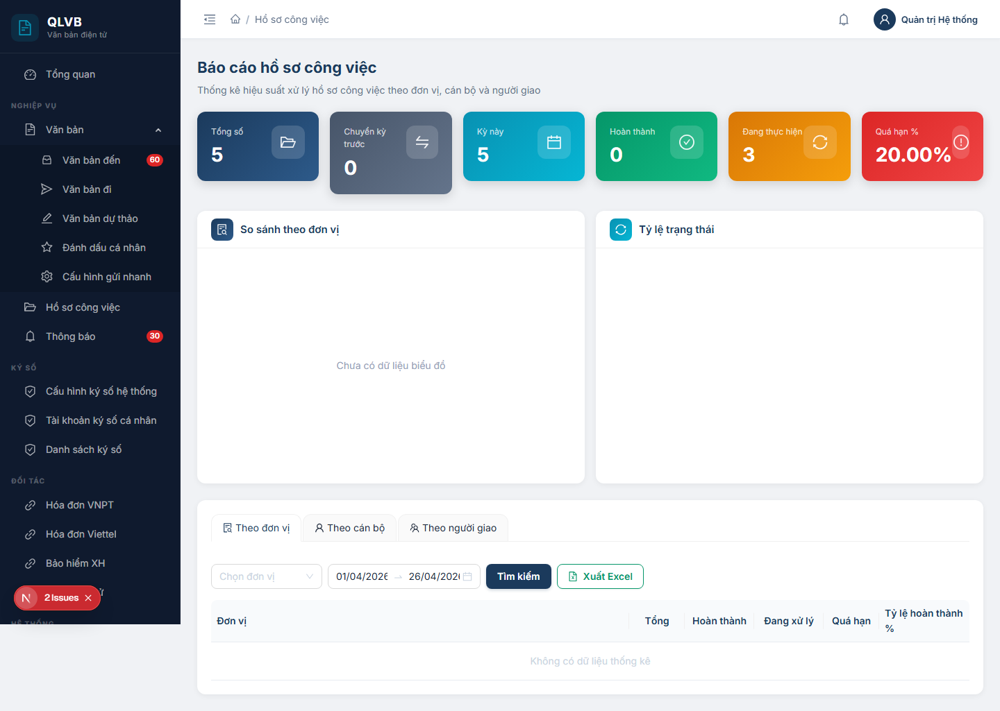
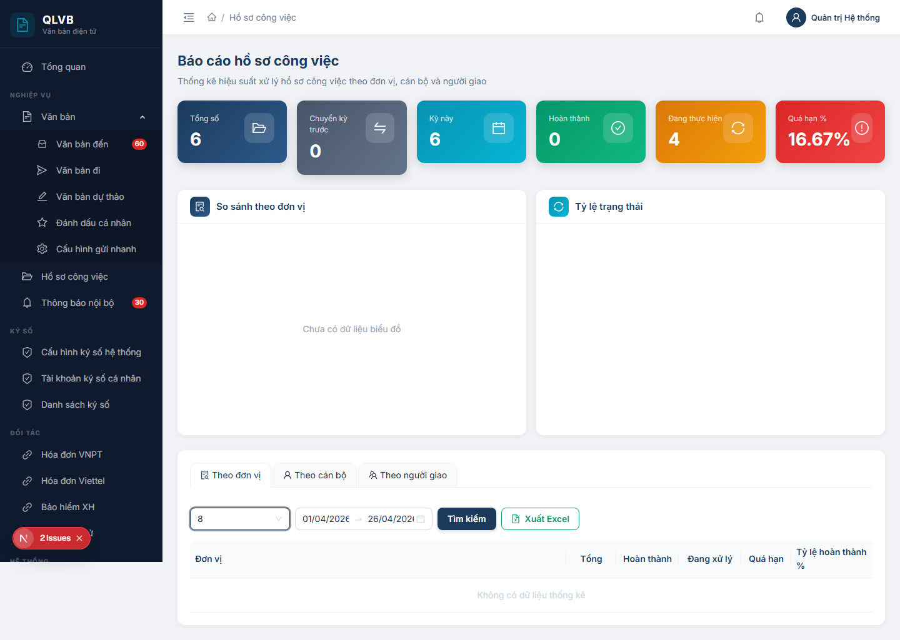

# Hướng dẫn sử dụng: Màn hình Hồ sơ công việc > Báo cáo

Tài liệu này mô tả đầy đủ các chức năng có trong màn hình **Hồ sơ công việc > Báo cáo** của hệ thống Quản lý văn bản điện tử (e-Office), giúp người dùng hiểu rõ cách xem các chỉ số thống kê và xuất báo cáo về tình hình xử lý hồ sơ công việc.

---

## 1. Giới thiệu

Màn hình **Hồ sơ công việc > Báo cáo** dùng để **tổng hợp và đánh giá hiệu suất xử lý hồ sơ công việc** của đơn vị trong một khoảng thời gian. Người dùng có thể nhìn nhanh các chỉ số chính (tổng số hồ sơ, số đã hoàn thành, số đang thực hiện, tỷ lệ quá hạn) và xem chi tiết theo 3 góc nhìn:

- **Theo đơn vị / phòng ban**: mỗi phòng ban có bao nhiêu hồ sơ đang xử lý, hoàn thành, quá hạn.
- **Theo cán bộ giải quyết**: mỗi cán bộ được giao bao nhiêu hồ sơ và xử lý đến đâu.
- **Theo người giao việc**: mỗi cán bộ giao bao nhiêu hồ sơ và kết quả xử lý ra sao.

Phạm vi dữ liệu trên màn hình này được **tự động lọc theo đơn vị (cấp Sở/Ban/Ngành)** mà người đăng nhập đang thuộc về — quản trị viên cũng chỉ thấy số liệu trong phạm vi đơn vị đã chọn từ bộ lọc, không xem được dữ liệu liên đơn vị.

Báo cáo có thể **xuất ra tệp Excel** để phục vụ tổng hợp, in ấn, hoặc gửi báo cáo định kỳ cho lãnh đạo.

---

## 2. Bố cục màn hình

Màn hình được chia thành 4 khu vực, xếp dọc từ trên xuống:

- **Phần đầu trang**: Tiêu đề *"Báo cáo hồ sơ công việc"* và dòng mô tả ngắn *"Thống kê hiệu suất xử lý hồ sơ công việc theo đơn vị, cán bộ và người giao"*.
- **Khu vực 1 — Hàng thẻ KPI**: 6 thẻ thống kê màu sắc khác nhau, hiển thị các chỉ số chính (xem mục 3).
- **Khu vực 2 — Biểu đồ thống kê**: 2 biểu đồ trên cùng một hàng:
  - Biểu đồ cột **"So sánh theo đơn vị"** (bên trái) — phụ thuộc vào tab báo cáo đang chọn.
  - Biểu đồ tròn **"Tỷ lệ trạng thái"** (bên phải).
- **Khu vực 3 — Khối báo cáo chi tiết** (thẻ nội dung lớn ở dưới):
  - Bộ tab chuyển góc nhìn báo cáo: **Theo đơn vị**, **Theo cán bộ**, **Theo người giao**.
  - Hàng bộ lọc: ô chọn **Đơn vị**, ô chọn **khoảng thời gian**, nút **Tìm kiếm**, nút **Xuất Excel**.
  - Bảng dữ liệu báo cáo chi tiết theo tab đã chọn.

Trên thiết bị di động, các khu vực sẽ tự động xếp dọc một cột để dễ thao tác.

---

## 3. Các thẻ KPI

Mỗi thẻ KPI là một hình chữ nhật màu, hiển thị **tên chỉ số** ở dòng trên và **giá trị số** to ở dòng dưới. Các thẻ chỉ để **xem nhanh số liệu** — bấm vào thẻ không chuyển màn hình.

| Thẻ KPI | Ý nghĩa |
|---|---|
| **Tổng số** | Tổng số hồ sơ công việc thuộc đơn vị (không giới hạn theo khoảng thời gian — đếm tất cả hồ sơ đã từng tạo). |
| **Chuyển kỳ trước** | Số hồ sơ được tạo **trước ngày bắt đầu** của khoảng thời gian đã chọn nhưng đến nay vẫn **chưa hoàn thành và chưa hủy** — tức là khối việc tồn từ kỳ trước chuyển sang. |
| **Kỳ này** | Số hồ sơ được **tạo mới trong khoảng thời gian** đã chọn ở bộ lọc. |
| **Hoàn thành** | Số hồ sơ đã hoàn thành (có ngày hoàn thành nằm trong khoảng thời gian đã chọn). |
| **Đang thực hiện** | Số hồ sơ đang ở các trạng thái xử lý (Mới, Đang xử lý, Chờ duyệt, Đã duyệt) được tạo trong khoảng thời gian đã chọn. |
| **Quá hạn %** | Tỷ lệ phần trăm hồ sơ quá hạn so với tổng số hồ sơ phát sinh trong kỳ. Tính bằng: số hồ sơ có ngày kết thúc nhỏ hơn ngày hiện tại nhưng chưa hoàn thành / tổng số hồ sơ trong kỳ × 100, làm tròn 2 chữ số thập phân. |

> **Lưu ý**: Khi dữ liệu đang được tải, các thẻ hiển thị khung xương (skeleton) thay vì số `0`. Sau khi tải xong, nếu không có dữ liệu hệ thống sẽ hiển thị `0` (riêng "Quá hạn %" hiển thị `0%`).

---

## 4. Các biểu đồ thống kê

| Biểu đồ | Loại | Nội dung |
|---|---|---|
| **So sánh theo đơn vị** | Biểu đồ cột | Mỗi cột tương ứng với một đối tượng trong tab báo cáo đang chọn (đơn vị / cán bộ / người giao); chiều cao cột là **tổng số hồ sơ** của đối tượng đó. Trên đỉnh mỗi cột có nhãn số. Nếu nhãn dưới trục ngang dài, hệ thống tự xoay nhãn cho dễ đọc. |
| **Tỷ lệ trạng thái** | Biểu đồ tròn (donut) | Phân bố hồ sơ theo 3 nhóm trạng thái: **Hoàn thành** (xanh lá), **Đang thực hiện** (xanh teal), **Quá hạn** (đỏ). Số liệu lấy từ các thẻ KPI tương ứng. Các nhóm có giá trị 0 sẽ không hiển thị trong biểu đồ. |

Khi không có dữ liệu, mỗi biểu đồ hiển thị dòng *"Chưa có dữ liệu biểu đồ"* ở giữa khung. Rê chuột lên các phần biểu đồ để xem chi tiết số liệu (tooltip).

---

## 5. Bộ lọc / Phạm vi báo cáo

Hàng bộ lọc nằm ngay trên bảng báo cáo, gồm 4 phần tử (xếp ngang):

| Phần tử | Bắt buộc | Mô tả |
|---|---|---|
| **Chọn đơn vị** | Không | Ô chọn dạng dropdown, liệt kê các đơn vị / phòng ban có trong hệ thống. Khi để trống, báo cáo tính cho **toàn bộ đơn vị (cấp Sở/Ban/Ngành) của người đăng nhập**. Khi chọn một đơn vị cụ thể, báo cáo chỉ tính cho đơn vị đó. Có nút **xóa nhanh** (hình dấu nhân nhỏ) để bỏ chọn. |
| **Khoảng thời gian** | Có | Ô chọn cặp ngày *Từ ngày — Đến ngày* (định dạng `DD/MM/YYYY`). Mặc định khi mở màn hình: **từ ngày đầu tháng hiện tại đến hôm nay**. Bấm vào ô để mở lịch chọn ngày. |
| **Tìm kiếm** (nút màu xanh navy) | — | Áp dụng bộ lọc và tải lại đồng thời cả KPI và bảng báo cáo. |
| **Xuất Excel** (nút có biểu tượng bảng tính, viền xanh lá) | — | Xuất bảng báo cáo hiện tại ra tệp `.xlsx` (xem mục 7). |

> **Lưu ý**: Khi đổi tab báo cáo (Theo đơn vị / Theo cán bộ / Theo người giao), bảng và biểu đồ cột bên trái **tự động tải lại** theo tab mới — không cần bấm **Tìm kiếm**. Còn khi đổi đơn vị hoặc khoảng thời gian, **phải bấm Tìm kiếm** thì dữ liệu mới được cập nhật.

---

## 6. Bảng báo cáo chi tiết

Bộ tab ở đầu khối báo cáo cho phép chuyển nhanh giữa 3 góc nhìn báo cáo. Nhãn cột đầu tiên của bảng và tiêu đề biểu đồ cột thay đổi theo tab đang chọn.

### 6.1. Tab "Theo đơn vị"

Liệt kê **các phòng ban trực thuộc đơn vị** đang chọn cùng số lượng hồ sơ công việc của từng phòng ban.

| Cột | Mô tả |
|---|---|
| **Đơn vị** | Tên phòng ban (cắt ngắn nếu quá dài). Đây là các phòng ban có cờ "Phòng ban" và **không bị xóa**, thuộc đơn vị cha đã chọn. |
| **Tổng** | Tổng số hồ sơ công việc thuộc phòng ban đó trong khoảng thời gian đã chọn. |
| **Hoàn thành** | Số hồ sơ đã hoàn thành (in màu xanh lá, đậm). |
| **Đang xử lý** | Số hồ sơ đang ở các trạng thái xử lý (in màu xanh teal, đậm). |
| **Quá hạn** | Số hồ sơ quá ngày kết thúc nhưng chưa hoàn thành (in màu đỏ, đậm). |
| **Tỷ lệ hoàn thành %** | Thanh tiến độ hiển thị tỷ lệ Hoàn thành / Tổng (theo phần trăm, làm tròn 2 chữ số). Thanh có màu xanh teal. |

Bảng được sắp xếp **giảm dần theo Tổng**, sau đó theo tên phòng ban (theo bảng chữ cái).

### 6.2. Tab "Theo cán bộ"

Liệt kê **các cán bộ giải quyết hồ sơ** trong đơn vị (vai trò "người chủ trì xử lý" của hồ sơ).

Các cột giống tab "Theo đơn vị", chỉ khác cột đầu tiên đổi nhãn thành **"Cán bộ"** — hiển thị họ tên đầy đủ của cán bộ.

> Bảng chỉ hiển thị các cán bộ **có ít nhất một hồ sơ công việc** trong khoảng thời gian đã chọn. Cán bộ đang bị khóa tài khoản không xuất hiện.

### 6.3. Tab "Theo người giao"

Liệt kê **các cán bộ là người tạo / giao hồ sơ công việc** cho người khác xử lý.

Các cột giống tab "Theo đơn vị", chỉ khác cột đầu tiên đổi nhãn thành **"Người giao"** — hiển thị họ tên đầy đủ của người tạo hồ sơ.

> Tương tự tab "Theo cán bộ", bảng chỉ liệt kê người giao có ít nhất một hồ sơ trong khoảng thời gian đã chọn.

---

## 7. Các nút chức năng

| Nút | Vị trí | Khi nào hiển thị | Tác dụng |
|---|---|---|---|
| **Tab "Theo đơn vị"** (biểu tượng kính lúp) | Đầu khối báo cáo | Luôn hiển thị | Chuyển bảng và biểu đồ cột sang góc nhìn theo phòng ban. |
| **Tab "Theo cán bộ"** (biểu tượng người) | Đầu khối báo cáo | Luôn hiển thị | Chuyển bảng và biểu đồ cột sang góc nhìn theo cán bộ giải quyết. |
| **Tab "Theo người giao"** (biểu tượng nhóm) | Đầu khối báo cáo | Luôn hiển thị | Chuyển bảng và biểu đồ cột sang góc nhìn theo người giao việc. |
| **Chọn đơn vị** | Hàng bộ lọc | Luôn hiển thị | Mở dropdown để chọn một đơn vị / phòng ban làm phạm vi báo cáo. |
| **Khoảng thời gian** | Hàng bộ lọc | Luôn hiển thị | Mở lịch để chọn cặp *Từ ngày — Đến ngày*. |
| **Tìm kiếm** | Hàng bộ lọc | Luôn hiển thị | Áp dụng bộ lọc, tải lại KPI và bảng báo cáo theo tab đang chọn. |
| **Xuất Excel** | Hàng bộ lọc | Luôn hiển thị | Xuất bảng báo cáo hiện tại ra tệp Excel `.xlsx`. Tên tệp tự đặt là `bao-cao-hscv-YYYYMMDD.xlsx` (theo ngày hiện tại). Sau khi tải xong, hệ thống thông báo *"Xuất Excel thành công"*. |

---

## 8. Quy trình xem và xuất báo cáo

### 8.1. Xem báo cáo theo phòng ban

1. Mở màn hình **Hồ sơ công việc > Báo cáo**. Hệ thống mặc định hiển thị báo cáo từ ngày đầu tháng hiện tại đến hôm nay, tab **Theo đơn vị**.
2. (Tùy chọn) Bấm ô **Chọn đơn vị** và chọn một phòng ban cụ thể. Để trống nếu muốn xem cho toàn bộ đơn vị.
3. (Tùy chọn) Bấm ô **khoảng thời gian** và chọn lại *Từ ngày — Đến ngày* nếu cần kỳ báo cáo khác.
4. Bấm **Tìm kiếm**.
5. Quan sát:
   - **Hàng KPI** — nắm nhanh tổng quan: bao nhiêu hồ sơ phát sinh trong kỳ, bao nhiêu hoàn thành, tỷ lệ quá hạn.
   - **Biểu đồ cột** — so sánh trực quan giữa các phòng ban.
   - **Bảng báo cáo** — đọc số liệu chi tiết, sắp xếp theo Tổng giảm dần.

### 8.2. Xem báo cáo theo cán bộ giải quyết / người giao

1. Trong khối báo cáo, bấm tab **Theo cán bộ** hoặc **Theo người giao**.
2. Bảng và biểu đồ cột tự động tải lại theo góc nhìn mới (không cần bấm Tìm kiếm).
3. Đổi đơn vị / khoảng thời gian (nếu cần), rồi bấm **Tìm kiếm** để cập nhật.

### 8.3. Xuất báo cáo ra Excel

1. Hoàn tất các thao tác chọn tab, đơn vị, khoảng thời gian như mục 8.1.
2. Bấm nút **Xuất Excel** (viền xanh lá, có biểu tượng bảng tính).
3. Trình duyệt sẽ tự tải tệp `bao-cao-hscv-YYYYMMDD.xlsx` về máy. Hệ thống hiển thị thông báo *"Xuất Excel thành công"*.
4. Mở tệp bằng Microsoft Excel hoặc phần mềm tương đương. Tệp gồm 1 trang tính tên *"Báo cáo HSCV"* với 6 cột: tên đối tượng (Đơn vị / Cán bộ / Người giao), Tổng, Hoàn thành, Đang xử lý, Quá hạn, Tỷ lệ HT %. Hàng tiêu đề được tô màu xanh navy, chữ trắng đậm.

> **Lưu ý**: Tệp Excel chỉ chứa **dữ liệu của tab báo cáo đang xem**. Để có cả 3 góc nhìn, cần xuất 3 tệp riêng (mỗi tab xuất một lần). Tệp xuất ra tương ứng với bộ lọc đơn vị / khoảng thời gian đang áp dụng tại thời điểm bấm nút.

---

## 9. Lưu ý / Ràng buộc nghiệp vụ

### 9.1. Phạm vi dữ liệu giới hạn theo đơn vị của người đăng nhập

Báo cáo **chỉ tính dữ liệu hồ sơ công việc thuộc đơn vị cấp Sở/Ban/Ngành** mà người đăng nhập đang trực thuộc. Tài khoản quản trị hệ thống cũng tuân theo quy tắc này — không xem được dữ liệu liên đơn vị trên cùng một màn hình. Để xem báo cáo của đơn vị khác cần đăng nhập bằng tài khoản thuộc đơn vị đó.

### 9.2. "Chuyển kỳ trước" và "Kỳ này" — phân biệt thế nào?

- **Chuyển kỳ trước**: hồ sơ được tạo **trước ngày bắt đầu** của khoảng thời gian, đến nay vẫn chưa hoàn thành — đây là khối việc tồn đọng từ kỳ trước.
- **Kỳ này**: hồ sơ được tạo **trong khoảng thời gian** đã chọn — đây là khối việc phát sinh mới.

Tổng khối lượng công việc thực tế phải xử lý trong kỳ = "Chuyển kỳ trước" + "Kỳ này".

### 9.3. Quy ước trạng thái hồ sơ công việc

Báo cáo nhóm các trạng thái hồ sơ thành 3 nhóm chính:

- **Hoàn thành**: trạng thái Hoàn thành (mã 4) — có ngày hoàn thành.
- **Đang thực hiện**: các trạng thái Mới, Đang xử lý, Chờ duyệt, Đã duyệt (mã 0, 1, 2, 3).
- **Quá hạn**: hồ sơ có **ngày kết thúc** nhỏ hơn thời điểm xem báo cáo nhưng **chưa hoàn thành và chưa hủy**.

Một hồ sơ có thể đồng thời đếm vào **Đang thực hiện** và **Quá hạn** — vì "Quá hạn" chỉ phản ánh việc hồ sơ đó đã trễ thời hạn so với ngày kết thúc dự kiến.

### 9.4. Tỷ lệ hoàn thành (cột "Tỷ lệ hoàn thành %" trong bảng)

Tính bằng: **Số hồ sơ Hoàn thành / Tổng số hồ sơ × 100**, làm tròn 2 chữ số thập phân. Phòng ban / cán bộ chưa có hồ sơ nào sẽ hiển thị 0%.

### 9.5. Bảng báo cáo Theo cán bộ / Theo người giao chỉ hiện cán bộ có hoạt động

Hai tab này **không liệt kê tất cả cán bộ** trong đơn vị, mà chỉ liệt kê các cán bộ đã có ít nhất một hồ sơ công việc trong khoảng thời gian đã chọn. Cán bộ chưa từng tham gia hồ sơ nào sẽ không xuất hiện. Cán bộ đang bị khóa tài khoản cũng không xuất hiện.

### 9.6. Định dạng ngày tháng

Toàn bộ ngày trên màn hình sử dụng định dạng Việt Nam: `DD/MM/YYYY` (ví dụ: `25/04/2026`). Khi gửi yêu cầu xuống máy chủ, hệ thống tự chuyển sang định dạng chuẩn quốc tế `YYYY-MM-DD`.

### 9.7. Báo cáo không tự làm mới

Sau khi mở màn hình, **dữ liệu chỉ được tải lại khi bấm nút Tìm kiếm hoặc khi đổi tab**. Nếu trong lúc xem báo cáo có người dùng khác cập nhật hồ sơ, để thấy số liệu mới cần bấm **Tìm kiếm** lại.

### 9.8. Phân trang bảng báo cáo

Bảng báo cáo hiển thị **20 dòng mỗi trang**, không cho đổi số dòng / trang. Khi danh sách dài, dùng thanh phân trang ở dưới bảng để chuyển trang.

---

*Tài liệu được biên soạn dựa trên hệ thống thực tế đang triển khai. Mọi thắc mắc vui lòng liên hệ với đội phát triển để được hỗ trợ.*
