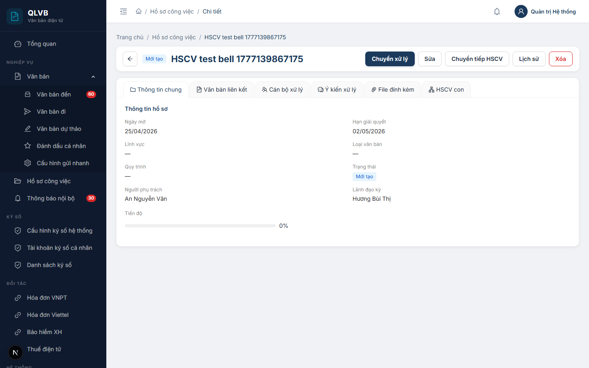
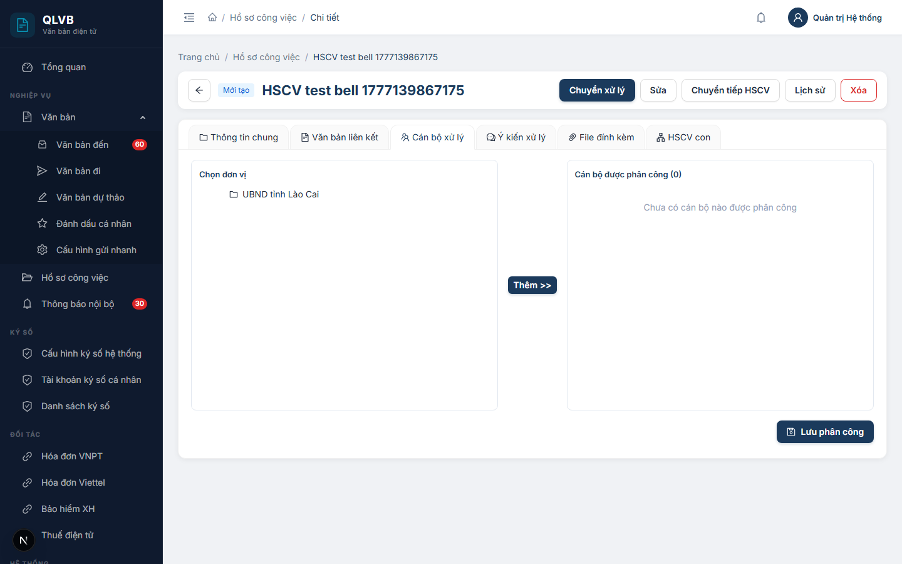
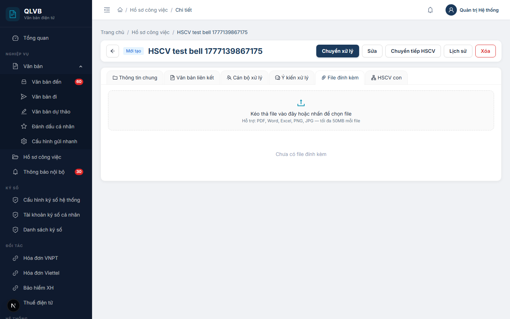
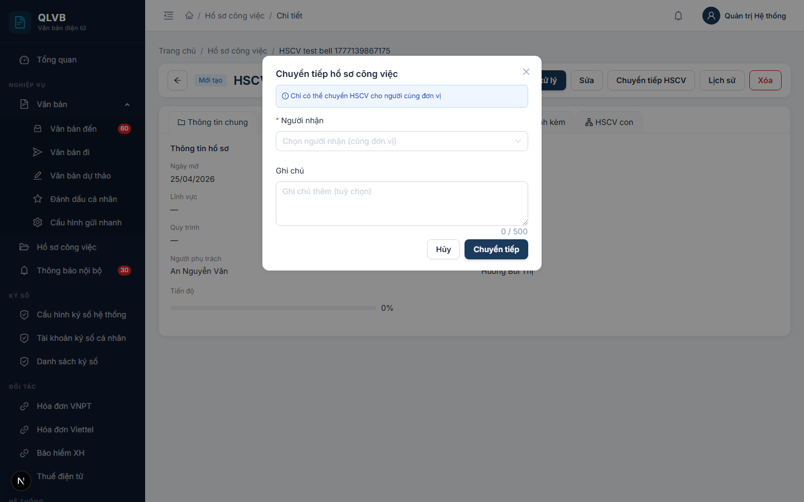

# Hướng dẫn sử dụng: Màn hình Chi tiết Hồ sơ công việc

Tài liệu này mô tả đầy đủ các chức năng có trong màn hình **Chi tiết Hồ sơ công việc (HSCV)** của hệ thống Quản lý văn bản điện tử (e-Office), giúp người dùng hiểu rõ cách sử dụng và quy trình nghiệp vụ.

---

## 1. Giới thiệu

**Hồ sơ công việc (HSCV)** là một "tập hồ sơ điện tử" dùng để quản lý toàn bộ công việc liên quan đến một vụ việc cụ thể. Một HSCV có thể gắn nhiều văn bản liên quan, phân công cho nhiều cán bộ cùng phối hợp xử lý, đính kèm tài liệu, trao đổi ý kiến và có cả HSCV con (trường hợp công việc lớn cần chia nhỏ).

Màn hình chi tiết HSCV là nơi người dùng theo dõi và thực hiện mọi thao tác trong vòng đời của một hồ sơ — từ khi mới tạo cho đến khi hoàn thành hoặc bị hủy.

---

## 2. Bố cục màn hình


Màn hình chi tiết HSCV gồm 3 phần chính:

- **Phần đầu trang**: Hiển thị nút **Quay lại** (mũi tên trái), **nhãn trạng thái** hiện tại của hồ sơ, **tên HSCV**, **số văn bản** đã lấy (nếu có — dạng nhãn xanh "Số: [số] / [tên sổ]") và **thanh công cụ** chứa các nút hành động.
- **Phần giữa — các Tab**: 6 tab chứa đầy đủ thông tin và thao tác của hồ sơ.
- **Các cửa sổ phụ (Modal/Drawer)**: Mở ra khi người dùng bấm các nút tương ứng để nhập thông tin thao tác.

---

## 3. Trạng thái của Hồ sơ công việc

Mỗi HSCV tại một thời điểm sẽ ở một trong các trạng thái sau:

| Trạng thái | Ý nghĩa |
|---|---|
| **Mới tạo** | HSCV vừa được lập, chưa bắt đầu xử lý |
| **Đang xử lý** | Cán bộ phụ trách đã bắt đầu làm việc với hồ sơ |
| **Đã trình ký** | Hồ sơ đã được gửi lên lãnh đạo để xem xét |
| **Hoàn thành** | Lãnh đạo đã duyệt, hồ sơ kết thúc |
| **Từ chối** | Lãnh đạo không đồng ý duyệt |
| **Trả về** | Lãnh đạo trả lại để bổ sung, chỉnh sửa |
| **Đã hủy** | HSCV không còn giá trị, đã bị hủy bỏ |

Thanh công cụ (các nút hành động) sẽ **hiển thị khác nhau tùy theo trạng thái** — chỉ các nút phù hợp với trạng thái hiện tại mới được hiện ra, giúp người dùng không thao tác sai quy trình.

> **Lưu ý**: Trong các phiên bản trước hệ thống có thêm trạng thái **"Chờ trình ký"** (đặt giữa "Đang xử lý" và "Đã trình ký"). Phiên bản hiện tại đã gộp thao tác trình ký thành một bước duy nhất — bấm **"Trình ký"** ở trạng thái "Đang xử lý" sẽ chuyển trực tiếp sang **"Đã trình ký"**.

---

## 4. Các Tab trong chi tiết HSCV

### 4.1. Tab "Thông tin chung"



Hiển thị toàn bộ thông tin cơ bản của hồ sơ công việc:

- **Ngày mở**: Thời điểm hồ sơ bắt đầu
- **Hạn giải quyết**: Thời hạn phải hoàn thành (chữ đỏ nếu đã quá hạn)
- **Lĩnh vực**: Lĩnh vực nghiệp vụ của hồ sơ
- **Loại văn bản**: Loại hồ sơ/văn bản chính
- **Quy trình**: Quy trình xử lý áp dụng
- **Trạng thái hiện tại**
- **Người phụ trách**: Cán bộ chính chịu trách nhiệm
- **Lãnh đạo ký**: Lãnh đạo sẽ xem xét phê duyệt
- **Tiến độ**: Thanh hiển thị phần trăm hoàn thành (0–100%)
- **Ghi chú**: Nội dung ghi chú thêm (nếu có)
- **Thông tin hủy** (chỉ hiện khi hồ sơ đã hủy): lý do hủy, thời điểm hủy, người hủy — hiển thị trong khung viền đỏ nhạt
- **Liên kết đến HSCV cha** (nếu hồ sơ này là hồ sơ con) — bấm vào tên HSCV cha để chuyển sang xem

### 4.2. Tab "Văn bản liên kết"

Quản lý tất cả văn bản liên quan đến HSCV (văn bản đến, văn bản đi, dự thảo).

**Thao tác**:
- **Thêm văn bản**: Mở cửa sổ tìm kiếm có 3 tab — **Văn bản đến**, **Văn bản đi**, **Dự thảo**. Nhập từ khóa (số văn bản hoặc trích yếu), bấm **"Tìm kiếm"**, tích chọn nhiều văn bản và bấm **"Liên kết"**.
- **Gỡ liên kết**: Mỗi văn bản đều có nút **"Gỡ liên kết"** (chữ đỏ) ở cột thao tác, có hộp xác nhận trước khi thực hiện.

**Thông tin hiển thị mỗi văn bản**: Số VB, trích yếu, loại văn bản (nhãn xanh), ngày ký.

Tab này hiển thị **số lượng văn bản đã liên kết** (huy hiệu màu xanh teal cạnh tiêu đề tab).

### 4.3. Tab "Cán bộ xử lý"



Quản lý danh sách cán bộ tham gia xử lý HSCV.

**Giao diện 3 cột**:
1. **Cột trái**: Cây đơn vị — chọn đơn vị để xem danh sách nhân viên, tích chọn nhiều nhân viên cùng lúc
2. **Cột giữa**: Nút **"Thêm >>"** để chuyển nhân viên đã chọn sang danh sách phân công
3. **Cột phải**: Danh sách cán bộ đã được phân công (hiển thị tổng số cán bộ ở tiêu đề), mỗi người có:
   - **Vai trò**: **Phụ trách** (chữ xanh lá) hoặc **Phối hợp** (chữ xanh teal) — chọn bằng nút radio
   - **Hạn xử lý**: Ngày phải hoàn thành (chọn từ lịch)
   - **Xóa**: Biểu tượng thùng rác đỏ — bỏ cán bộ khỏi danh sách

Sau khi điều chỉnh xong, bấm **"Lưu phân công"** (góc dưới bên phải) để ghi nhận thay đổi.

### 4.4. Tab "Ý kiến xử lý"

Nơi các cán bộ tham gia HSCV trao đổi, ghi ý kiến trong quá trình xử lý.

**Thao tác**:
- **Gửi ý kiến mới**: Nhập nội dung vào ô **"Nhập ý kiến xử lý..."** ở cuối tab (tối đa 2000 ký tự, có đếm ký tự) và bấm **"Gửi ý kiến"**.
- **Chuyển tiếp ý kiến**: Mỗi ý kiến có nút **"Chuyển tiếp"** (chữ xanh, biểu tượng máy bay giấy). Bấm sẽ mở cửa sổ:
  - **Người nhận** (bắt buộc): chọn từ danh sách nhân viên cùng đơn vị
  - **Nội dung chuyển tiếp** (bắt buộc, tối đa 1000 ký tự)
  - Bấm **"Gửi"** để chuyển tiếp.
- Các ý kiến chuyển tiếp sẽ được hiển thị **thụt lề vào trong** với viền trái xám, kèm dòng nhỏ *"Chuyển tiếp cho [Tên người nhận]"* để dễ nhận biết.

**Thông tin mỗi ý kiến**: Ảnh đại diện (chữ cái đầu của tên), tên người gửi, thời gian (DD/MM/YYYY HH:mm), nội dung.

### 4.5. Tab "File đính kèm"



Quản lý các tài liệu, file đính kèm của HSCV.

**Thao tác**:
- **Tải lên file**: Vùng "Kéo thả file vào đây hoặc nhấn để chọn file" — kéo thả file hoặc bấm để chọn. Hỗ trợ các định dạng: **PDF, Word (doc, docx), Excel (xls, xlsx), ảnh (png, jpg, jpeg)**. Dung lượng tối đa **50 MB** mỗi file.
- **Tải xuống**: Bấm nút **"Tải xuống"** (biểu tượng mũi tên xuống) ở mỗi file
- **Ký số**: Hiển thị nút **"Ký số"** (xanh lá, biểu tượng khiên) khi đủ các điều kiện sau:
  - Người đang đăng nhập đúng là **lãnh đạo ký** của HSCV
  - HSCV đang ở trạng thái **"Đã trình ký"**
  - File là định dạng **PDF**
  - File **chưa được ký số** trước đó
- **Xóa file**: Có hộp xác nhận trước khi xóa

**Thông tin mỗi file**: Biểu tượng theo định dạng (PDF đỏ, Word xanh dương, Excel xanh lá, ảnh cam), tên file, kích cỡ, thời gian tải lên, người tải lên. File đã ký số sẽ có nhãn **"Đã ký số"** màu xanh kèm dấu tích.

### 4.6. Tab "HSCV con"

Quản lý các hồ sơ công việc con — dùng khi công việc lớn cần chia nhỏ.

**Thao tác**:
- **Tạo HSCV con**: Bấm nút **"Tạo HSCV con"** (góc trên bên phải) mở cửa sổ nhập:
  - **Hồ sơ cha** (đã điền sẵn, không sửa được)
  - **Tên hồ sơ con** (bắt buộc, tối đa 500 ký tự)
  - **Ngày mở** (bắt buộc)
  - **Hạn giải quyết** (bắt buộc)
  - **Người phụ trách**, **Lãnh đạo ký** (chọn từ danh sách)
  - **Ghi chú** (tối đa 2000 ký tự)
- **Xem chi tiết**: Bấm vào tên HSCV con (chữ xanh navy) để mở màn hình chi tiết của nó

**Thông tin mỗi HSCV con**: Tên, ngày mở, hạn giải quyết (chữ đỏ + biểu tượng cảnh báo nếu quá hạn), trạng thái (nhãn màu), tiến độ (thanh tiến độ).

---

## 5. Các nút hành động theo từng trạng thái


Dưới đây là các nút hành động sẽ hiển thị trên thanh công cụ — **tùy thuộc vào trạng thái hiện tại** của HSCV.

### 5.1. Khi HSCV ở trạng thái **"Mới tạo"**

| Nút | Chức năng |
|---|---|
| **Chuyển xử lý** | Bắt đầu xử lý hồ sơ. Trạng thái chuyển từ "Mới tạo" → "Đang xử lý" |
| **Sửa** | Mở cửa sổ chỉnh sửa thông tin HSCV (tên, ngày mở, hạn, lĩnh vực, loại văn bản, người phụ trách, lãnh đạo ký, ghi chú) |
| **Chuyển tiếp HSCV** | Bàn giao cả hồ sơ cho cán bộ khác (xem mục 6.2) |
| **Lịch sử** | Xem toàn bộ lịch sử thao tác trên HSCV |
| **Xóa** | Xóa hẳn HSCV (chỉ cho phép khi mới tạo) |

### 5.2. Khi HSCV ở trạng thái **"Đang xử lý"**

| Nút | Chức năng |
|---|---|
| **Trình ký** | Đẩy hồ sơ trực tiếp sang trạng thái **"Đã trình ký"** để lãnh đạo xem xét |
| **Cập nhật tiến độ** | Mở cửa sổ điều chỉnh phần trăm hoàn thành (0–100%) |
| **Lấy số** | Lấy số văn bản theo sổ (chỉ hiện nếu HSCV chưa lấy số) |
| **Chuyển tiếp HSCV** | Bàn giao cho cán bộ khác |
| **Lịch sử** | Xem lịch sử thao tác |

### 5.3. Khi HSCV ở trạng thái **"Đã trình ký"**

| Nút | Chức năng |
|---|---|
| **Duyệt hồ sơ** | Lãnh đạo đồng ý — chuyển sang **"Hoàn thành"** (nút xanh lá) |
| **Từ chối** | Lãnh đạo không đồng ý — kèm lý do từ chối (nút đỏ) |
| **Trả về** | Trả lại để bổ sung — kèm lý do trả về |
| **Lấy số** | Lấy số văn bản (nếu chưa lấy số) |
| **Chuyển tiếp HSCV** | Bàn giao cho cán bộ khác |
| **Lịch sử** | Xem lịch sử thao tác |

### 5.4. Khi HSCV ở trạng thái **"Hoàn thành"**

| Nút | Chức năng |
|---|---|
| **Mở lại** | Trường hợp cần chỉnh sửa sau khi đã hoàn thành — chuyển về **"Đang xử lý"**, giữ nguyên tiến độ 100% |
| **Xem lịch sử** | Xem lại toàn bộ quá trình xử lý |

### 5.5. Khi HSCV bị **"Từ chối"** hoặc **"Trả về"**

| Nút | Chức năng |
|---|---|
| **Xử lý lại** | Chuyển về **"Đang xử lý"** để bổ sung, chỉnh sửa |
| **Hủy HSCV** | Hủy bỏ hồ sơ — kèm lý do hủy (chuyển sang trạng thái **"Đã hủy"**) |

> **Lưu ý**: Khi HSCV ở trạng thái **"Đã hủy"**, hệ thống không hiển thị nút thao tác nào — hồ sơ chỉ ở chế độ xem.

---

## 6. Các thao tác quan trọng — Giải thích chi tiết

### 6.1. Chuyển xử lý

**Mục đích**: Đánh dấu "Tôi bắt đầu làm việc với hồ sơ này".

Khi HSCV vừa được tạo, trạng thái mặc định là **"Mới tạo"**. Khi cán bộ phụ trách chính thức bắt đầu xử lý, bấm nút **"Chuyển xử lý"** để chuyển trạng thái sang **"Đang xử lý"**.

Chức năng này giúp lãnh đạo nhìn vào danh sách biết được hồ sơ nào chưa ai bắt đầu xử lý, hồ sơ nào đang được thực hiện — phục vụ theo dõi tiến độ và đôn đốc khi cần.

### 6.2. Chuyển tiếp HSCV



**Mục đích**: Bàn giao toàn bộ hồ sơ sang cán bộ khác (đi công tác, nghỉ phép, chuyển công tác, hoặc công việc không thuộc phạm vi phụ trách).

**Cách dùng**:
1. Bấm nút **"Chuyển tiếp HSCV"** trên thanh công cụ.
2. Cửa sổ mở ra với dòng nhắc *"Chỉ có thể chuyển HSCV cho người cùng đơn vị"* (khung xanh nhạt).
3. Chọn **Người nhận** (bắt buộc) — danh sách nhân viên cùng đơn vị, có ô tìm kiếm.
4. Nhập **Ghi chú** (tùy chọn, tối đa 500 ký tự) — giải thích lý do bàn giao.
5. Bấm **"Chuyển tiếp"**.

**Sau khi chuyển tiếp**:
- Người mới trở thành **người phụ trách chính** của HSCV
- Mọi thao tác (cập nhật, thêm ý kiến, gắn văn bản...) đều chuyển sang người mới
- **Lịch sử chuyển tiếp được ghi lại đầy đủ** — có thể xem ở nút **"Lịch sử"**

**Ràng buộc**: Chỉ được chuyển trong cùng đơn vị, không chuyển cho chính mình.

### 6.3. Lấy số văn bản

**Mục đích**: Cấp số văn bản chính thức theo sổ đăng ký của đơn vị.

**Cách dùng**:
- **Trường hợp HSCV chưa có sổ văn bản**: Bấm **"Lấy số"** → mở cửa sổ **"Chọn sổ văn bản để lấy số"** → chọn sổ từ danh sách (có ô tìm kiếm theo mã hoặc tên sổ) → bấm **"Lấy số"**.
- **Trường hợp HSCV đã chọn sổ trước đó**: Bấm **"Lấy số"** → hiện hộp xác nhận *"Sẽ cấp số kế tiếp theo sổ [tên sổ]. Bạn xác nhận?"* → bấm **"Lấy số"**.

Hệ thống tự động cấp số theo công thức **MAX(số) + 1 trong cùng sổ và năm tạo HSCV**.

Sau khi lấy số thành công, phần đầu trang sẽ hiển thị nhãn xanh **"Số: [số] / [tên sổ]"**.

Nút **"Lấy số"** chỉ hiển thị ở trạng thái **"Đang xử lý"** hoặc **"Đã trình ký"**, và chỉ khi HSCV chưa được lấy số.

### 6.4. Cập nhật tiến độ

**Mục đích**: Cập nhật phần trăm hoàn thành của hồ sơ (0–100%) để lãnh đạo theo dõi.

Nút này chỉ hiện khi HSCV đang ở trạng thái **"Đang xử lý"**. Người dùng điều chỉnh bằng **thanh trượt** hoặc **nhập số trực tiếp** (có hậu tố `%`), sau đó bấm **"Cập nhật"**.

### 6.5. Trả về / Từ chối


**Khi lãnh đạo không đồng ý với hồ sơ** (ở trạng thái "Đã trình ký"):

- **Trả về**: Hồ sơ còn có thể sửa chữa, cán bộ xử lý lại và trình ký lại. Kèm **lý do trả về** (bắt buộc).
- **Từ chối**: Không đồng ý hoàn toàn. Kèm **lý do từ chối** (bắt buộc).

**Cách dùng**: Khi bấm **"Từ chối"** hoặc **"Trả về"**, hệ thống mở cửa sổ nhỏ với:
- Dòng hướng dẫn (*"Nhập lý do từ chối để thông báo cho người xử lý."* / *"Nhập lý do trả về để người xử lý biết cần chỉnh sửa gì."*)
- Ô nhập lý do (tối đa 500 ký tự, có đếm ký tự, tự động đặt con trỏ vào ô)
- Nút **"Từ chối"** / **"Trả về"** ở dưới — **bị mờ và không bấm được khi chưa nhập lý do** (đảm bảo bắt buộc nhập)
- Nút **"Hủy"** — đóng cửa sổ, không thực hiện

Khi đã nhập lý do, nút thao tác mới sáng lên và bấm được. Hệ thống ghi nhận lý do để cán bộ thấy và điều chỉnh.

### 6.6. Hủy HSCV

**Mục đích**: Đóng HSCV khi không còn giá trị xử lý.

Chỉ áp dụng được khi HSCV đã bị **Từ chối** hoặc **Trả về**. Người dùng phải nhập **lý do hủy** (bắt buộc, tối đa 1000 ký tự).

**Cách dùng**:
1. Bấm **"Hủy HSCV"** (nút viền đỏ).
2. Cửa sổ "Hủy hồ sơ công việc" mở ra với ô nhập **"Lý do hủy HSCV"**.
3. Nhập lý do, bấm **"Xác nhận hủy"** (nút đỏ).

Sau khi hủy:
- Trạng thái chuyển sang **"Đã hủy"**
- Thông tin hủy (lý do, người hủy, thời điểm) được hiển thị trong khung viền đỏ nhạt ở tab **"Thông tin chung"**
- HSCV không thể thao tác tiếp

### 6.7. Mở lại HSCV (sau khi đã hoàn thành)

Trường hợp hồ sơ đã **"Hoàn thành"** nhưng cần chỉnh sửa, bổ sung, người dùng có thể bấm **"Mở lại"** để đưa HSCV về trạng thái **"Đang xử lý"** (giữ nguyên tiến độ 100%).

Hệ thống hiển thị hộp xác nhận *"Trạng thái sẽ chuyển từ 'Hoàn thành' về 'Đang xử lý' (giữ nguyên tiến độ 100%). Bạn xác nhận?"* trước khi thực hiện.

### 6.8. Ký số trên file đính kèm

Trong tab **"File đính kèm"**, lãnh đạo ký có thể thực hiện ký số trực tiếp trên file PDF đính kèm. Nút **"Ký số"** (xanh lá, biểu tượng khiên) chỉ xuất hiện khi:
- Người đăng nhập đúng là **lãnh đạo ký** của HSCV
- HSCV ở trạng thái **"Đã trình ký"**
- File là định dạng **PDF**
- File chưa được ký số

Sau khi ký thành công, file được gắn nhãn **"Đã ký số"** màu xanh kèm dấu tích.

### 6.9. Xem lịch sử HSCV

Bấm nút **"Lịch sử"** (hoặc **"Xem lịch sử"** ở trạng thái Hoàn thành) để mở cửa sổ **"Lịch sử hồ sơ công việc"** liệt kê toàn bộ thao tác đã thực hiện:

- **Tạo HSCV**, **Trình ký**, **Duyệt hồ sơ**, **Từ chối**, **Trả về bổ sung**, **Hoàn thành**
- **Lấy số văn bản**
- **Chuyển tiếp**: hiển thị "Tên người chuyển → Tên người nhận"
- **Hủy HSCV**, **Mở lại**
- **Đổi trạng thái** (các thao tác chuyển trạng thái khác)

Mỗi mục lịch sử hiển thị: loại thao tác (kèm biểu tượng), ghi chú (nếu có), thời gian (DD/MM/YYYY HH:mm) và người thực hiện.

Bấm **"Đóng"** để thoát cửa sổ.

Mọi thao tác đều được ghi lại đầy đủ, minh bạch — phục vụ công tác kiểm tra, thanh tra về sau.

---

## 7. Quy trình nghiệp vụ tham khảo

Vòng đời điển hình của một HSCV (phiên bản hiện tại):

```
Mới tạo
   │  (Cán bộ phụ trách bấm "Chuyển xử lý")
   ▼
Đang xử lý ◄────────────────┐
   │                        │
   │  (Bấm "Trình ký")      │  (Trả về / Xử lý lại)
   ▼                        │
Đã trình ký ────────────────┘
   │
   │  (Lãnh đạo bấm "Duyệt hồ sơ")
   ▼
Hoàn thành
```

Các trạng thái phụ **"Từ chối"**, **"Trả về"**, **"Đã hủy"** là các nhánh rẽ khi có tình huống đặc biệt:

- Lãnh đạo bấm **Từ chối** ở "Đã trình ký" → HSCV chuyển sang **"Từ chối"** → cán bộ có thể bấm **"Xử lý lại"** để quay về "Đang xử lý" hoặc **"Hủy HSCV"**.
- Lãnh đạo bấm **Trả về** ở "Đã trình ký" → HSCV chuyển sang **"Trả về"** → tương tự, cán bộ chọn **"Xử lý lại"** hoặc **"Hủy HSCV"**.
- Sau khi **"Hoàn thành"**, nếu cần thì bấm **"Mở lại"** để đưa HSCV về "Đang xử lý" (giữ tiến độ 100%).

---

*Tài liệu được biên soạn dựa trên hệ thống thực tế đang triển khai. Mọi thắc mắc vui lòng liên hệ với đội phát triển để được hỗ trợ.*
