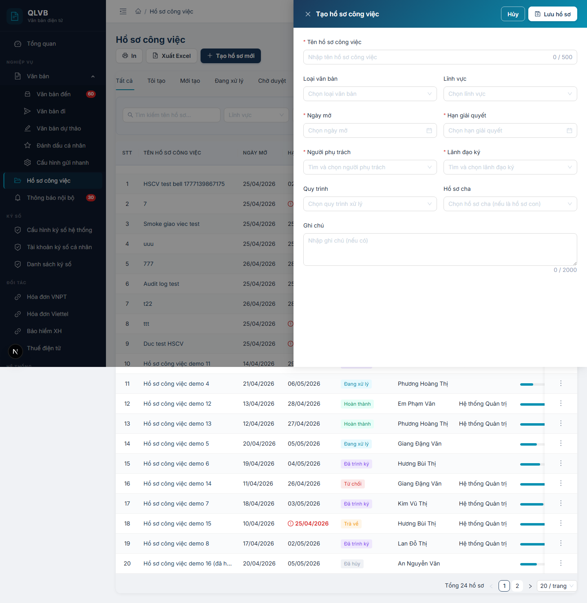

# Hướng dẫn sử dụng: Danh sách Hồ sơ công việc

Tài liệu này mô tả đầy đủ các chức năng của màn hình **Danh sách Hồ sơ công việc** (đường dẫn `/ho-so-cong-viec`) trong hệ thống Quản lý văn bản điện tử (e-Office), giúp người dùng hiểu rõ cách tra cứu, lập mới và sàng lọc hồ sơ công việc theo nghiệp vụ của cơ quan.

---

## 1. Giới thiệu

**Hồ sơ công việc (HSCV)** là "tập hồ sơ điện tử" gắn với một vụ việc cụ thể — quản lý văn bản liên quan, phân công cán bộ phối hợp, theo dõi tiến độ và lưu lại toàn bộ ý kiến trao đổi. Màn hình **Danh sách HSCV** là điểm vào duy nhất để cán bộ:

- Tra cứu nhanh các HSCV mình đang phụ trách hoặc phối hợp.
- Tạo HSCV mới khi phát sinh công việc cần quản lý chính thức.
- Theo dõi nhanh số lượng hồ sơ theo từng trạng thái thông qua các tab phân loại.
- Lọc theo lĩnh vực, đơn vị, khoảng ngày để khoanh vùng nhanh khi báo cáo lãnh đạo.

Toàn bộ chi tiết thao tác bên trong một HSCV (chuyển xử lý, trình ký, ký số, gắn văn bản, phân công cán bộ, hủy HSCV...) **không nằm trong tài liệu này**. Vui lòng xem tài liệu **`HSCV_chi_tiet_chuc_nang.md`** (hướng dẫn màn Chi tiết HSCV).

Phạm vi dữ liệu mà người dùng nhìn thấy phụ thuộc vào quyền:

- **Quản trị**: thấy toàn bộ HSCV của tất cả phòng ban, có ô lọc **Phòng ban** dạng cây.
- **Người dùng thường**: chỉ thấy HSCV thuộc phạm vi đơn vị của mình (đơn vị + các phòng ban con trực thuộc), kèm ô lọc **Đơn vị** dạng danh sách.

---

## 2. Bố cục màn hình

Màn hình chia thành các phần từ trên xuống:

- **Phần đầu trang**: Tiêu đề "Hồ sơ công việc" ở bên trái. Bên phải có 2 nút công cụ: **In** và **Tạo hồ sơ mới** (nút chính, màu xanh).
- **Hàng tab phân loại**: 9 tab phân loại HSCV theo trạng thái và phạm vi tạo, mỗi tab có **Badge** đếm số lượng hồ sơ tương ứng.
- **Hàng bộ lọc phụ**: Ô tìm kiếm theo tên hồ sơ, ô chọn Lĩnh vực, ô chọn Đơn vị / Phòng ban (tùy quyền), khoảng ngày, nút **Tìm kiếm** và **Đặt lại**.
- **Bảng dữ liệu**: Danh sách HSCV với 9 cột (xem mục 5). Bấm vào cột **Tên hồ sơ công việc** để mở Chi tiết. Cột thao tác cuối cùng là nút **ba chấm dọc**.
- **Phần cuối bảng**: Phân trang — chuyển trang, đổi số dòng/trang, hiển thị "Tổng N hồ sơ".
- **Cửa sổ phụ (Drawer)**: **Tạo hồ sơ công việc** / **Chỉnh sửa hồ sơ công việc** mở từ bên phải khi bấm Tạo mới hoặc Sửa.

---

## 3. Tab phân loại HSCV

Hệ thống hiển thị 9 tab theo thứ tự bên dưới. Mỗi tab có Badge nhỏ cạnh tên — số trên Badge là số HSCV đếm được trên toàn phạm vi quyền của người dùng (không phụ thuộc bộ lọc đang chọn).

| Tab | Phạm vi |
|---|---|
| **Tất cả** | Toàn bộ HSCV người dùng được phép xem. |
| **Tôi tạo** | HSCV do chính tài khoản đang đăng nhập tạo ra. |
| **Mới tạo** | HSCV đang ở trạng thái **Mới tạo** (status = 0). |
| **Đang xử lý** | HSCV đang ở trạng thái **Đang xử lý** (status = 1). |
| **Chờ duyệt** | HSCV đã trình ký, đang chờ lãnh đạo duyệt (status = 3). |
| **Hoàn thành** | HSCV đã được duyệt, kết thúc (status = 4). |
| **Trả về** | HSCV bị lãnh đạo trả về để bổ sung (status = -2). |
| **Bị từ chối** | HSCV bị lãnh đạo từ chối (status = -1). |
| **Đã hủy** | HSCV đã bị hủy bỏ (status = -3). |

> Bấm chuyển sang một tab — bảng tự chuyển về **trang 1** và tải lại danh sách. Badge của tab có thể tiếp tục cập nhật theo thời gian khi thao tác trong toàn hệ thống.

---

## 4. Bộ lọc phụ và thanh công cụ

### 4.1. Hàng bộ lọc phụ (phía dưới các tab)

| Bộ lọc | Mô tả |
|---|---|
| **Tìm kiếm tên hồ sơ...** | Ô gõ từ khóa tìm theo **tên HSCV**. Bấm Enter hoặc nút **Tìm kiếm** để thực hiện. Có nút xóa nhanh từ khóa. |
| **Lĩnh vực** | Chọn 1 lĩnh vực nghiệp vụ để lọc. Có nút xóa lựa chọn. |
| **Phòng ban** *(chỉ Quản trị)* | TreeSelect dạng cây — chọn 1 phòng ban / đơn vị để xem HSCV trực thuộc. |
| **Đơn vị** *(người dùng thường)* | Select danh sách đơn vị — chọn để khoanh vùng dữ liệu. |
| **Khoảng ngày** (Từ ngày — Đến ngày) | Lọc theo ngày tạo HSCV (`DD/MM/YYYY`). |
| **Tìm kiếm** (nút màu xanh) | Áp dụng các bộ lọc đang chọn, đưa danh sách về trang 1. |
| **Đặt lại** | Xóa toàn bộ Từ khóa / Lĩnh vực / Đơn vị / Khoảng ngày, đưa về trang 1. |

> Khi đổi Lĩnh vực, Đơn vị / Phòng ban hoặc Khoảng ngày, danh sách tự chuyển về trang 1 ngay; với ô **Tìm kiếm tên hồ sơ**, người dùng phải bấm Enter hoặc nút **Tìm kiếm** để áp dụng.

### 4.2. Thanh nút công cụ (góc trên bên phải)

| Nút | Khi nào hiển thị | Tác dụng |
|---|---|---|
| **In** | Luôn hiển thị | Mở hộp thoại in của trình duyệt với danh sách HSCV hiện tại — gồm tiêu đề "DANH SÁCH HỒ SƠ CÔNG VIỆC", ngày in, bảng các cột STT / Tên hồ sơ / Ngày bắt đầu / Hạn hoàn thành / Người phụ trách / Tiến độ / Trạng thái và dòng tổng cuối trang. |
| **Xuất Excel** | Luôn hiển thị | Tải về tệp Excel `.xlsx` chứa toàn bộ HSCV theo bộ lọc và tab đang chọn (tối đa 10.000 dòng). Tên tệp dạng `ho-so-cong-viec-<Tab>-<Ngày giờ>.xlsx`. Bảng có 10 cột: STT, Tên hồ sơ, Loại văn bản, Lĩnh vực, Ngày mở, Hạn giải quyết, Trạng thái, Người phụ trách, Lãnh đạo ký, Tiến độ. Dòng tiêu đề được bôi đậm trên nền xanh navy. |
| **Tạo hồ sơ mới** (chính, xanh dương) | Luôn hiển thị | Mở Drawer **Tạo hồ sơ công việc** — nhập thông tin HSCV mới (xem mục 7). |

> **Lưu ý**: Nút **Xuất Excel** xuất theo đúng bộ lọc và tab đang chọn — nếu muốn xuất toàn bộ thì chọn tab "Tất cả" và bỏ hết bộ lọc trước khi bấm. Nếu danh sách hiện trống, hệ thống sẽ thông báo *"Không có hồ sơ nào phù hợp để xuất"* thay vì tạo file rỗng.

---

## 5. Các cột trong Bảng danh sách

| Tên cột | Mô tả |
|---|---|
| **STT** | Số thứ tự dòng theo trang hiện tại — tính bằng `(trang − 1) × số dòng/trang + thứ tự dòng`. |
| **Tên hồ sơ công việc** | Tên HSCV — in màu xanh navy đậm, bấm vào để mở **Chi tiết HSCV**. |
| **Ngày mở** | Ngày bắt đầu của HSCV (định dạng `DD/MM/YYYY`). Trống — hiển thị dấu gạch ngang `—`. |
| **Hạn giải quyết** | Hạn hoàn thành HSCV. Nếu **đã quá hạn so với hôm nay** *và* HSCV chưa ở trạng thái Hoàn thành — hiển thị **chữ đỏ in đậm** kèm biểu tượng cảnh báo. Trống — hiển thị `—`. |
| **Trạng thái** | Nhãn màu thể hiện trạng thái hiện tại của HSCV (xem mục 6). |
| **Phụ trách** | Họ tên cán bộ được chọn làm người phụ trách chính. Tên dài bị cắt ngắn và có tooltip khi rê chuột. |
| **Lãnh đạo ký** | Họ tên lãnh đạo sẽ ký duyệt HSCV. Tên dài bị cắt ngắn và có tooltip. |
| **Tiến độ** | Thanh phần trăm hoàn thành (0–100%) màu xanh teal. |
| (cột thao tác) | Nút **ba chấm dọc** ở cột cuối, mở menu các lệnh tùy theo trạng thái HSCV (xem mục 7). |

---

## 6. Các trạng thái HSCV hiển thị trong Bảng

Cột **Trạng thái** hiển thị nhãn màu tương ứng với trạng thái đang lưu trong hệ thống. Ý nghĩa và sơ đồ vòng đời chi tiết xem trong **`HSCV_chi_tiet_chuc_nang.md` mục 3**.

| Nhãn hiển thị | Ý nghĩa ngắn |
|---|---|
| **Mới tạo** (xanh dương) | HSCV vừa lập, chưa bắt đầu xử lý. |
| **Đang xử lý** (xanh ngọc) | Cán bộ phụ trách đã bắt đầu làm việc. |
| **Chờ trình ký** (cam) | Đã xong giai đoạn xử lý, chờ gửi trình ký. |
| **Đã trình ký** (tím) | Đã gửi lãnh đạo, chờ duyệt. |
| **Hoàn thành** (xanh lá) | Lãnh đạo đã duyệt — HSCV kết thúc. |
| **Từ chối** (đỏ) | Lãnh đạo không đồng ý duyệt. |
| **Trả về** (vàng) | Lãnh đạo trả về để bổ sung. |
| **Đã hủy** (xám) | HSCV bị hủy — không thao tác tiếp. |

> Nếu hệ thống nhận về một mã trạng thái không nằm trong danh mục trên, cột Trạng thái hiển thị nhãn xám **"Không xác định"**.

---

## 7. Các nút thao tác trên dòng (menu ba chấm dọc)

Khi bấm vào nút **ba chấm dọc** ở cột cuối của một dòng, hệ thống mở menu thao tác. **Menu hiển thị khác nhau tùy trạng thái HSCV**:

### 7.1. HSCV ở trạng thái **Mới tạo** (status = 0)

| Mục | Tác dụng |
|---|---|
| **Xem chi tiết** | Mở màn Chi tiết HSCV. |
| **Sửa** | Mở Drawer **Chỉnh sửa hồ sơ công việc** — sửa các trường hiện có (xem mục 8). |
| (đường kẻ ngăn) | |
| **Xóa** (màu đỏ) | Mở hộp xác nhận xóa — sau khi xác nhận, hệ thống xóa HSCV. |

### 7.2. HSCV ở các trạng thái còn lại (Đang xử lý / Chờ trình ký / Đã trình ký / Hoàn thành / Trả về / Bị từ chối / Đã hủy)

| Mục | Tác dụng |
|---|---|
| **Xem chi tiết** | Mở màn Chi tiết HSCV để thực hiện các thao tác chuyên sâu (chuyển xử lý, trình ký, duyệt, tạm dừng, mở lại, hủy, ký số file...). |

> **Quy tắc**: Sửa và Xóa chỉ cho phép khi HSCV ở trạng thái **Mới tạo**. Sau khi đã chuyển xử lý, các thao tác sửa thông tin chính của HSCV phải thực hiện qua màn Chi tiết với các nút chuyên biệt.

---

## 8. Các trường nhập liệu trong Drawer Tạo / Chỉnh sửa HSCV

Khi bấm **Tạo hồ sơ mới** hoặc **Sửa** từ menu, hệ thống mở Drawer rộng 720px ở bên phải. Tiêu đề là *"Tạo hồ sơ công việc"* hoặc *"Chỉnh sửa hồ sơ công việc"*. Nút **Hủy** và **Lưu hồ sơ** ở góc trên bên phải Drawer.

| Tên trường | Bắt buộc | Mô tả & ràng buộc |
|---|---|---|
| **Tên hồ sơ công việc** | Có | Tối đa 500 ký tự, có hiển thị bộ đếm. Để trống — báo *"Vui lòng nhập tên hồ sơ công việc"*. |
| **Loại văn bản** | Không | Chọn từ danh sách Loại văn bản (Công văn, Quyết định, Báo cáo...). Có ô tìm kiếm trong danh sách. |
| **Lĩnh vực** | Không | Chọn từ danh sách Lĩnh vực nghiệp vụ. Có ô tìm kiếm trong danh sách. |
| **Ngày mở** | Có | Định dạng `DD/MM/YYYY`. Để trống — báo *"Vui lòng chọn ngày mở hồ sơ"*. |
| **Hạn giải quyết** | Có | Định dạng `DD/MM/YYYY`. Để trống — báo *"Vui lòng chọn hạn giải quyết"*. **Phải bằng hoặc sau Ngày mở** — nếu trước Ngày mở, báo *"Hạn giải quyết phải sau hoặc bằng ngày mở hồ sơ"*. |
| **Người phụ trách** | Có | Chọn 1 cán bộ — danh sách lấy từ toàn bộ nhân viên cùng đơn vị. Có ô tìm kiếm. Để trống — báo *"Vui lòng chọn người phụ trách"*. |
| **Lãnh đạo ký** | Có | Chọn 1 lãnh đạo — danh sách lấy từ những người được đăng ký làm "Người ký" cho đơn vị. Có ô tìm kiếm. Để trống — báo *"Vui lòng chọn lãnh đạo ký"*. Khi đơn vị **chưa có lãnh đạo nào được đăng ký**, hệ thống hiển thị *"Đơn vị chưa có lãnh đạo"* trong dropdown. |
| **Quy trình** | Không | Chọn quy trình xử lý áp dụng (nếu có). Có nút xóa lựa chọn. |
| **Hồ sơ cha** | Không | Chọn HSCV cha nếu đây là HSCV con của một hồ sơ lớn hơn. Có ô tìm kiếm theo tên HSCV. |
| **Ghi chú** | Không | Vùng văn bản nhiều dòng, tối đa 2000 ký tự, có bộ đếm. |

> Sau khi nhập xong, bấm **Lưu hồ sơ**:
>
> - Tạo mới — hệ thống báo *"Tạo hồ sơ thành công"*.
> - Chỉnh sửa — hệ thống báo *"Lưu hồ sơ thành công"*.
> - Lỗi không cụ thể — báo *"Lưu hồ sơ thất bại. Vui lòng kiểm tra lại thông tin và thử lại."*

---

## 9. Quy trình thao tác chính

### 9.1. Tạo một HSCV mới

1. Bấm **Tạo hồ sơ mới** ở góc trên bên phải.
2. Trong Drawer:
   - Nhập **Tên hồ sơ công việc** (bắt buộc).
   - Chọn **Ngày mở** + **Hạn giải quyết** (bắt buộc, hạn ≥ ngày mở).
   - Chọn **Người phụ trách** + **Lãnh đạo ký** (bắt buộc).
   - Tùy chọn: Loại văn bản, Lĩnh vực, Quy trình, Hồ sơ cha, Ghi chú.
3. Bấm **Lưu hồ sơ** — hệ thống báo *"Tạo hồ sơ thành công"*, đóng Drawer và làm mới danh sách.
4. HSCV mới xuất hiện trong tab **Tất cả** và **Mới tạo**, trạng thái **Mới tạo** — sẵn sàng cho bước **Chuyển xử lý** ở màn Chi tiết.

### 9.2. Lọc và tìm kiếm HSCV

1. Bấm tab phân loại phù hợp (VD: **Đang xử lý**) để khoanh vùng theo trạng thái — Badge cạnh tên tab cho biết số lượng hiện có.
2. (Tùy chọn) Trên hàng bộ lọc phụ:
   - Gõ một phần **Tên hồ sơ** vào ô tìm kiếm.
   - Chọn **Lĩnh vực** nếu cần.
   - Chọn **Đơn vị** (người dùng thường) hoặc **Phòng ban** (Quản trị) — chỉ hiển thị HSCV thuộc đơn vị / phòng ban đó.
   - Chọn **Khoảng ngày** (Từ ngày — Đến ngày) để giới hạn theo thời điểm tạo HSCV.
3. Bấm **Tìm kiếm** (hoặc nhấn Enter trong ô tên hồ sơ) — bảng tải lại từ trang 1.
4. Khi cần xóa toàn bộ điều kiện đã đặt — bấm **Đặt lại** để khôi phục danh sách đầy đủ.

### 9.3. Sửa hoặc Xóa HSCV vừa tạo

Chỉ thực hiện được khi HSCV đang ở trạng thái **Mới tạo**.

1. Trên dòng tương ứng, bấm nút **ba chấm dọc**.
2. Chọn **Sửa** — Drawer Chỉnh sửa mở ra với dữ liệu hiện có. Sửa và bấm **Lưu hồ sơ** — hệ thống báo *"Lưu hồ sơ thành công"*.
3. Chọn **Xóa** (mục đỏ cuối menu) — Hộp xác nhận màu vàng cảnh báo *"Bạn có chắc muốn xóa hồ sơ này? Hành động này không thể hoàn tác."*. Bấm **Xóa** — hệ thống báo *"Đã xóa hồ sơ"*.

### 9.4. Mở chi tiết HSCV để thao tác chuyên sâu

- Bấm vào **tên HSCV** ở cột "Tên hồ sơ công việc" (chữ xanh navy đậm), HOẶC
- Bấm **ba chấm dọc** ở cột cuối → chọn **Xem chi tiết**.

Toàn bộ thao tác Chuyển xử lý / Trình ký / Duyệt / Trả về / Từ chối / Tạm dừng / Mở lại / Hủy / Lấy số / Cập nhật tiến độ / Phân công cán bộ / Liên kết văn bản / Chuyển tiếp HSCV / Ký số file đính kèm / HSCV con đều thực hiện ở **màn Chi tiết** — tham khảo `HSCV_chi_tiet_chuc_nang.md`.

### 9.5. In danh sách HSCV

1. Áp dụng các bộ lọc và tab phân loại để có đúng danh sách cần in.
2. Bấm nút **In** ở góc trên bên phải.
3. Trình duyệt mở hộp thoại in — danh sách sẵn sàng để in hoặc lưu thành PDF.

---

## 10. Lưu ý / Ràng buộc nghiệp vụ

### 10.1. Sửa và Xóa chỉ áp dụng khi HSCV "Mới tạo"

Mục **Sửa** và **Xóa** trên menu ba chấm chỉ hiển thị khi HSCV đang ở trạng thái **Mới tạo** (status = 0). Sau khi đã chuyển xử lý, các thay đổi phải đi qua màn Chi tiết bằng các nút **Chuyển tiếp HSCV**, **Cập nhật tiến độ**, **Tạm dừng**, **Hủy HSCV**... Tham khảo `HSCV_chi_tiet_chuc_nang.md` mục 5 và 6.

### 10.2. Phạm vi quyền xem dữ liệu

- **Người dùng thường**: chỉ thấy HSCV thuộc đơn vị mình + các phòng ban con. Ô lọc đơn vị là **Select** danh sách phẳng các đơn vị trong phạm vi quyền.
- **Quản trị**: thấy toàn bộ HSCV của hệ thống. Ô lọc trở thành **TreeSelect** dạng cây phân cấp đầy đủ.

Khi cố gắng truy cập một HSCV không thuộc phạm vi quyền (vd: gõ trực tiếp ID vào URL), hệ thống chặn với thông báo *"Không có quyền truy cập hồ sơ này"*.

### 10.3. Hạn giải quyết phải ≥ Ngày mở

Trên Drawer Tạo/Sửa, nếu **Hạn giải quyết** trước **Ngày mở**, ô báo lỗi inline ngay: *"Hạn giải quyết phải sau hoặc bằng ngày mở hồ sơ"*. Hệ thống không cho phép lưu cho tới khi sửa lại.

### 10.4. Cảnh báo Quá hạn trên cột "Hạn giải quyết"

Trên bảng danh sách, dòng nào có **Hạn giải quyết** đã trôi qua so với ngày hiện tại *và* HSCV chưa ở trạng thái **Hoàn thành** sẽ hiển thị:

- Ngày hạn **chữ đỏ in đậm**.
- Biểu tượng cảnh báo `(!)` đứng trước.

Đây là dấu hiệu để cán bộ phụ trách / lãnh đạo nhận biết và đôn đốc xử lý.

### 10.5. Lãnh đạo ký phải đăng ký từ trước

Dropdown **Lãnh đạo ký** chỉ liệt kê những cán bộ đã được Quản trị đăng ký vào danh mục **Người ký** của đơn vị. Khi đơn vị chưa có ai trong danh mục này, dropdown trống và hiển thị *"Đơn vị chưa có lãnh đạo"*. Khi đó, đề nghị Quản trị bổ sung Người ký trong **Quản trị** trước khi tạo HSCV.

### 10.6. Bảng tổng hợp các thông báo của hệ thống

| Tình huống | Thông báo |
|---|---|
| Tạo HSCV thành công | Tạo hồ sơ thành công |
| Lưu (sửa) HSCV thành công | Lưu hồ sơ thành công |
| Lưu HSCV thất bại (lỗi không cụ thể) | Lưu hồ sơ thất bại. Vui lòng kiểm tra lại thông tin và thử lại. |
| Xóa HSCV thành công | Đã xóa hồ sơ |
| Lỗi xóa HSCV | Lỗi xóa hồ sơ |
| Lỗi tải danh sách | Lỗi tải danh sách hồ sơ công việc |
| Xuất Excel thành công | Đã xuất N hồ sơ |
| Xuất Excel khi danh sách trống | Không có hồ sơ nào phù hợp để xuất |
| Lỗi tải dữ liệu khi xuất Excel | Không tải được dữ liệu để xuất Excel |
| Để trống Tên hồ sơ | Vui lòng nhập tên hồ sơ công việc |
| Để trống Ngày mở | Vui lòng chọn ngày mở hồ sơ |
| Để trống Hạn giải quyết | Vui lòng chọn hạn giải quyết |
| Hạn giải quyết trước Ngày mở | Hạn giải quyết phải sau hoặc bằng ngày mở hồ sơ |
| Để trống Người phụ trách | Vui lòng chọn người phụ trách |
| Để trống Lãnh đạo ký | Vui lòng chọn lãnh đạo ký |
| Đơn vị không có lãnh đạo trong dropdown | Đơn vị chưa có lãnh đạo |
| Bảng trống — không có hồ sơ nào | Chưa có hồ sơ công việc — Nhấn "Tạo hồ sơ mới" để bắt đầu quản lý công việc của bạn. |
| Bảng trống khi đang lọc | Không tìm thấy hồ sơ phù hợp. Thử thay đổi bộ lọc hoặc từ khóa tìm kiếm. |
| Truy cập HSCV ngoài quyền | Không có quyền truy cập hồ sơ này |
| Hộp xác nhận xóa | Bạn có chắc muốn xóa hồ sơ này? Hành động này không thể hoàn tác. |

---

*Tài liệu được biên soạn dựa trên hệ thống thực tế đang triển khai. Mọi thắc mắc vui lòng liên hệ với đội phát triển để được hỗ trợ.*
