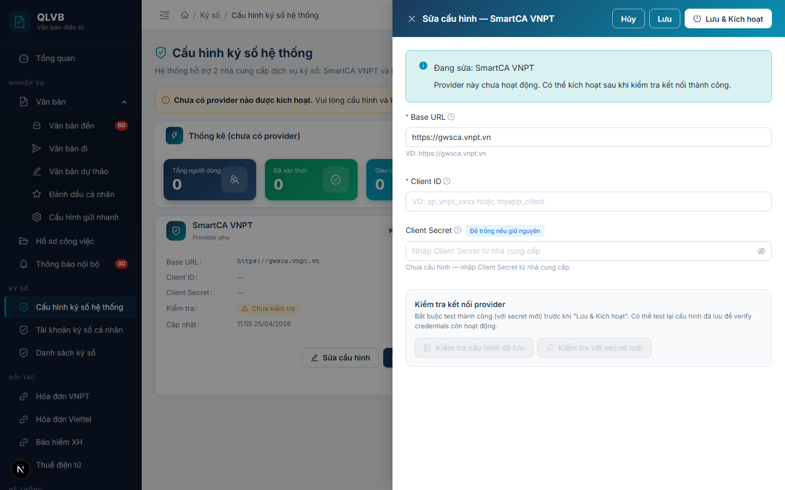
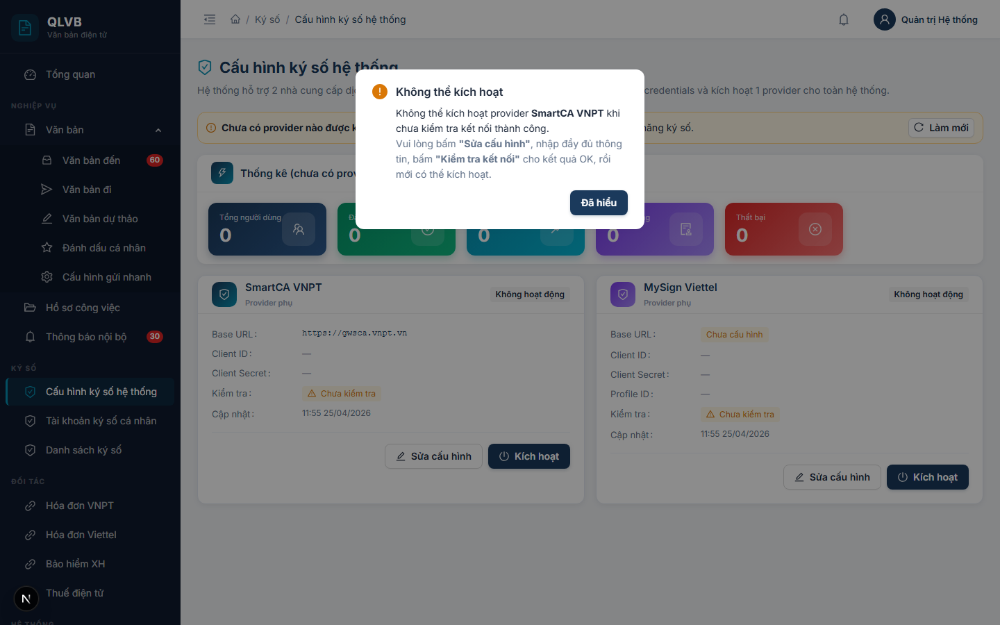

# Hướng dẫn sử dụng: Màn hình Ký số > Cấu hình ký số hệ thống

Tài liệu này mô tả đầy đủ các chức năng có trong màn hình **Ký số > Cấu hình ký số hệ thống** của hệ thống Quản lý văn bản điện tử (e-Office), giúp người dùng hiểu rõ cách sử dụng và quy trình nghiệp vụ.

---

## 1. Giới thiệu

Màn hình **Ký số > Cấu hình ký số hệ thống** dùng để cấu hình kết nối giữa hệ thống e-Office và **nhà cung cấp dịch vụ ký số (provider)**. Đây là dữ liệu nền của toàn bộ tính năng ký số trong hệ thống: tất cả các luồng ký văn bản đi, ký dự thảo, ký phụ lục đính kèm... đều dùng chung **một** provider đang được kích hoạt tại đây.

Hệ thống hiện hỗ trợ **2 nhà cung cấp cố định**:

- **SmartCA VNPT** — dịch vụ ký số từ xa của VNPT.
- **MySign Viettel** — dịch vụ ký số từ xa của Viettel.

Hai provider này được khởi tạo sẵn ở mức cơ sở dữ liệu — **người quản trị không thêm mới và không xóa được** mà chỉ **sửa cấu hình** (Base URL, Client ID, Client Secret, Profile ID) và **kích hoạt** một trong hai. Tại bất kỳ thời điểm nào, chỉ có **đúng một** provider được kích hoạt cho toàn hệ thống.

Vì là dữ liệu cấu hình hạ tầng nên màn hình này **chỉ dành cho tài khoản Quản trị hệ thống**. Người dùng thông thường truy cập sẽ thấy thông báo *"Bạn không có quyền truy cập trang này"*.

Một thay đổi nhỏ trên màn hình này (ví dụ: chuyển provider đang kích hoạt, đổi Client Secret) sẽ ảnh hưởng đến mọi giao dịch ký số trên toàn hệ thống — do đó cần thao tác cẩn thận, kiểm tra kết nối thành công trước khi kích hoạt.

---

## 2. Bố cục màn hình

Màn hình được chia thành các khu vực từ trên xuống dưới:

- **Phần đầu trang**: Hiển thị tiêu đề "Cấu hình ký số hệ thống" kèm dòng mô tả ngắn cho biết hệ thống hỗ trợ 2 nhà cung cấp SmartCA VNPT và MySign Viettel.
- **Dải thông báo trạng thái (Banner)**: Nằm ngay dưới tiêu đề, có 2 dạng:
  - **Dải xanh** (khi đã có provider được kích hoạt): hiển thị tên provider đang hoạt động, Base URL và thời điểm kiểm tra kết nối lần cuối.
  - **Dải vàng** (khi chưa có provider nào được kích hoạt): hiển thị cảnh báo *"Chưa có provider nào được kích hoạt. Vui lòng cấu hình và kích hoạt 1 provider để bật tính năng ký số."*
  - Cả hai dạng đều có nút **Làm mới** ở góc phải để tải lại dữ liệu.
- **Khu vực Thống kê**: Một thẻ lớn chứa 5 ô số liệu (KPI) của provider đang kích hoạt:
  - **Tổng người dùng** — tổng số tài khoản đã đăng ký với provider.
  - **Đã xác thực** — số tài khoản đã xác thực thành công.
  - **Giao dịch tháng** — tổng số lượt ký trong tháng hiện tại.
  - **Thành công** — số giao dịch ký thành công trong tháng.
  - **Thất bại** — số giao dịch ký thất bại trong tháng.

  Tiêu đề thẻ thống kê có dạng *"Thống kê (SmartCA VNPT)"* hoặc *"Thống kê (MySign Viettel)"* tùy theo provider đang kích hoạt. Nếu chưa có provider nào kích hoạt sẽ hiển thị *"Thống kê (chưa có provider)"* và cả 5 ô đều bằng 0.
- **Khu vực 2 thẻ Provider — đặt cạnh nhau (trên màn hình rộng) hoặc xếp dọc (trên màn hình hẹp)**:
  - Thẻ trái: **SmartCA VNPT**.
  - Thẻ phải: **MySign Viettel**.
  - Mỗi thẻ hiển thị thông tin cấu hình hiện tại + 2 nút thao tác **Sửa cấu hình** và **Kích hoạt** (nút Kích hoạt chỉ hiển thị khi provider đó đang **không** hoạt động).
  - Provider đang kích hoạt có **viền xanh đậm** + nhãn **"Đang kích hoạt"** (màu xanh lá).
- **Cửa sổ phụ (Drawer)**:
  - **Drawer Sửa cấu hình** — mở ra từ bên phải khi bấm **Sửa cấu hình** trên một thẻ provider, hiển thị các ô nhập credentials và 2 nút kiểm tra kết nối.

---

## 3. Thông tin hiển thị trên Thẻ provider

Mỗi thẻ provider (SmartCA VNPT / MySign Viettel) hiển thị các trường sau:

| Tên trường | Mô tả |
|---|---|
| **Tiêu đề thẻ** | Tên provider — **SmartCA VNPT** hoặc **MySign Viettel** — kèm biểu tượng. Phía dưới có dòng mô tả: *"Provider mặc định hệ thống"* (nếu đang kích hoạt) hoặc *"Provider phụ"* (nếu không). |
| **Nhãn trạng thái** | Hiển thị ở góc phải tiêu đề thẻ: nhãn xanh **"Đang kích hoạt"** hoặc nhãn xám **"Không hoạt động"**. |
| **Base URL** | URL cổng API của provider. Hiển thị ở phông chữ `monospace`. Nếu chưa cấu hình, hiển thị nhãn vàng **"Chưa cấu hình"**. |
| **Client ID** | Mã định danh ứng dụng QLVB do provider cấp. Nếu dài quá 40 ký tự sẽ tự động cắt bớt và hiện tooltip khi rê chuột. Nếu chưa có, hiển thị dấu `—`. |
| **Client Secret** | Hiển thị **"\*\*\*"** kèm chấm xanh nếu đã được cấu hình; hiển thị dấu `—` nếu chưa. **Hệ thống KHÔNG BAO GIỜ hiển thị Client Secret dạng chữ rõ trên giao diện** — đây là thiết kế bảo mật. |
| **Profile ID** | (Chỉ hiển thị với MySign Viettel) — Mã profile ký số do Viettel cấp. |
| **Kiểm tra** | Trạng thái kết nối lần kiểm tra gần nhất: nhãn vàng **"Chưa kiểm tra"**, nhãn xanh **"Kết nối OK"** kèm thời điểm, hoặc nhãn đỏ **"Lỗi kết nối"** kèm thời điểm. |
| **Cập nhật** | Thời điểm cấu hình được cập nhật lần gần nhất, theo định dạng `dd/MM/yyyy hh:mm`. |

Cuối thẻ là **2 nút thao tác**:

- **Sửa cấu hình** — mở Drawer chỉnh sửa credentials.
- **Kích hoạt** — chỉ hiển thị khi provider đó **đang không hoạt động**. Bấm để đặt provider đó làm provider mặc định toàn hệ thống.

---

## 4. Các trường nhập liệu trong cửa sổ Sửa cấu hình

Khi bấm **Sửa cấu hình** trên một thẻ provider, hệ thống mở cửa sổ phía bên phải màn hình với tiêu đề *"Sửa cấu hình — {Tên provider}"* và các trường sau:

| Tên trường | Bắt buộc | Mô tả & ràng buộc |
|---|---|---|
| **Base URL** | Có | URL cổng API của provider. Tối đa 500 ký tự. **Phải bắt đầu bằng `https://`** (cho phép `http://localhost` chỉ dùng khi phát triển). Sai định dạng hệ thống báo *"Base URL phải bắt đầu bằng https:// (hoặc http://localhost cho dev)"*. Phía dưới ô nhập có dòng gợi ý ví dụ tương ứng từng provider: SmartCA VNPT là `https://gwsca.vnpt.vn`, MySign Viettel là `https://remotesigning.viettel.vn`. |
| **Client ID** | Có | Mã định danh ứng dụng QLVB do provider cấp khi đăng ký tích hợp. Tối đa 200 ký tự. Bỏ trống hệ thống báo *"Nhập Client ID"*. Cạnh nhãn có biểu tượng dấu hỏi tooltip giải thích. |
| **Client Secret** | Có khi mới cấu hình lần đầu — **Không bắt buộc** khi sửa lại provider đã có cấu hình | Mật khẩu của ứng dụng QLVB với provider — **khác** với OTP cá nhân của người ký. Tối đa 500 ký tự, **tối thiểu 8 ký tự** khi nhập mới. Trường này hiển thị dạng ô mật khẩu (che dấu khi gõ). **Nếu provider đã có Client Secret cũ, để trống ô này nghĩa là giữ nguyên secret cũ — không cần gõ lại**. Bên cạnh nhãn có nhãn nhỏ **"Để trống nếu giữ nguyên"** nhắc nhở. Sai độ dài tối thiểu sẽ báo *"Client Secret tối thiểu 8 ký tự"*. |
| **Profile ID** | Có (chỉ với MySign Viettel) | Mã profile ký số do Viettel cấp cùng credentials. Tối đa 200 ký tự. Ví dụ định dạng: `adss:ras:profile:001`. Provider SmartCA VNPT **không có** trường này. Bỏ trống với MySign Viettel sẽ báo *"Profile ID là bắt buộc với MySign Viettel"*. |

> **Lưu ý bảo mật**: Thông tin nhạy cảm (Client Secret) được **mã hóa** trước khi lưu vào cơ sở dữ liệu. Khi tải dữ liệu lên giao diện, hệ thống chỉ trả về dấu `***` thay cho secret thật — nên kể cả Quản trị viên cũng không xem lại được Client Secret cũ. Nếu cần, hãy lấy lại từ phía nhà cung cấp và nhập lại.

Phía dưới các ô nhập là khu vực **Kiểm tra kết nối provider** với 2 nút (chi tiết ở mục 5).

---

## 5. Các nút chức năng

| Nút | Vị trí | Khi nào hiển thị / kích hoạt | Tác dụng |
|---|---|---|---|
| **Làm mới** | Góc phải dải thông báo trạng thái | Luôn hiển thị | Tải lại danh sách provider, thống kê và trạng thái kích hoạt. Dùng khi nghi ngờ dữ liệu không đồng bộ. |
| **Sửa cấu hình** | Cuối mỗi thẻ provider | Luôn hiển thị (mờ đi nếu provider chưa được khởi tạo trong DB) | Mở cửa sổ Sửa cấu hình. |
| **Kích hoạt** (trên thẻ) | Cuối thẻ provider | Chỉ hiển thị khi provider đó **đang không hoạt động** | Mở hộp xác nhận, sau đó đặt provider này làm provider mặc định và **tự động tắt** provider đang hoạt động khác. |
| **Hủy** | Góc phải tiêu đề Drawer Sửa cấu hình | Luôn hiển thị trong Drawer | Đóng Drawer, không lưu thay đổi. |
| **Lưu** | Góc phải tiêu đề Drawer | Luôn hiển thị trong Drawer | Lưu thông tin vừa nhập, **không** kích hoạt provider. |
| **Lưu & Kích hoạt** | Góc phải tiêu đề Drawer | Chỉ hiển thị khi provider đang sửa **đang không hoạt động** | Lưu thông tin **và** kích hoạt provider này (đồng thời tắt provider khác). **Bị mờ (disabled) cho đến khi đã bấm "Kiểm tra với secret mới" thành công**. |
| **Kiểm tra cấu hình đã lưu** | Trong khung kiểm tra của Drawer | Mờ khi provider chưa cấu hình hoặc đang chạy nút kiểm tra còn lại | Test kết nối bằng Client Secret **đã lưu** trong cơ sở dữ liệu. Sau khi test, hệ thống tự cập nhật trường **Kiểm tra** trên thẻ provider. |
| **Kiểm tra với secret mới** | Trong khung kiểm tra của Drawer | Mờ khi chưa nhập Client Secret mới trong form, hoặc đang chạy nút kiểm tra còn lại | Test kết nối bằng Base URL + Client ID + Client Secret **vừa gõ trong form** (không lưu vào DB). Bắt buộc thành công trước khi bấm **Lưu & Kích hoạt**. |
| **Đã hiểu** | Trong hộp cảnh báo "Không thể kích hoạt" | Khi cố kích hoạt provider chưa kiểm tra OK | Đóng hộp cảnh báo. |
| **Kích hoạt** / **Hủy** trong hộp xác nhận | Khi bấm Kích hoạt trên thẻ | Khi mở hộp xác nhận | **Kích hoạt** — thực hiện. **Hủy** — đóng hộp, không thay đổi. |

---

## 6. Quy trình thao tác chính

### 6.1. Cấu hình lần đầu một provider (chưa từng nhập credentials)

1. Trên màn hình, xác định thẻ provider muốn cấu hình (SmartCA VNPT hoặc MySign Viettel).
2. Bấm **Sửa cấu hình** trên thẻ đó. Cửa sổ Sửa cấu hình mở ra.
3. Điền:
   - **Base URL** (bắt buộc, dạng `https://...`).
   - **Client ID** (bắt buộc).
   - **Client Secret** (bắt buộc, ≥ 8 ký tự).
   - **Profile ID** (chỉ với MySign Viettel — bắt buộc).
4. Bấm **Kiểm tra với secret mới** ở khung kiểm tra phía dưới để xác minh kết nối tới provider.
5. Nếu thành công, hệ thống thông báo **"Kiểm tra kết nối thành công"** và hiển thị hộp xanh có nhãn **"Secret mới nhập"** + thông tin chứng thư.
6. Nếu chưa muốn dùng ngay, bấm **Lưu** — hệ thống thông báo **"Cập nhật cấu hình thành công"**, đóng cửa sổ.
7. Nếu muốn dùng ngay, bấm **Lưu & Kích hoạt** (nút này chỉ bật sau khi kiểm tra với secret mới thành công). Hệ thống lưu cấu hình + tự kích hoạt provider này, đồng thời tắt provider kia. Thông báo **"Lưu và kích hoạt cấu hình thành công"**.

### 6.2. Sửa lại cấu hình đang dùng (giữ nguyên Client Secret cũ)

1. Trên thẻ provider, bấm **Sửa cấu hình**.
2. Sửa các trường cần thiết (ví dụ: đổi Base URL, đổi Client ID, đổi Profile ID). **Để TRỐNG ô Client Secret** — hệ thống sẽ giữ nguyên secret đã mã hóa từ trước.
3. (Tùy chọn) Bấm **Kiểm tra cấu hình đã lưu** để xác minh credentials hiện tại còn hoạt động — nút này dùng secret đã lưu trong DB, không cần nhập lại.
4. Bấm **Lưu**. Hệ thống thông báo **"Cập nhật cấu hình thành công"**.

> **Lưu ý**: Nếu cần thay Client Secret thành giá trị mới (do provider rotate key, do bị lộ...), hãy nhập secret mới vào ô Client Secret và bấm **Kiểm tra với secret mới** trước khi **Lưu**.

### 6.3. Chuyển provider đang kích hoạt (sang provider khác)

1. Đảm bảo provider muốn chuyển sang đã cấu hình đầy đủ và **đã kiểm tra kết nối thành công** (nhãn xanh **"Kết nối OK"** trên thẻ).
   - Nếu chưa, mở Drawer Sửa cấu hình → bấm **Kiểm tra cấu hình đã lưu** hoặc **Kiểm tra với secret mới** cho đến khi OK.
2. Trên thẻ provider muốn chuyển sang, bấm **Kích hoạt**.
3. Hộp xác nhận hiện ra:
   > *"Kích hoạt &lt;Tên provider&gt;? Provider đang hoạt động khác (nếu có) sẽ tự động bị tắt."*

   
4. Bấm **Kích hoạt** để xác nhận, hoặc **Hủy** để bỏ qua.
5. Hệ thống thông báo **"Đã kích hoạt &lt;Tên provider&gt;"**. Dải thông báo trên đầu trang và viền 2 thẻ provider tự cập nhật ngay.

> **Quan trọng**: Nếu provider chưa đạt **"Kết nối OK"** mà bấm **Kích hoạt**, hệ thống sẽ chặn lại bằng hộp cảnh báo *"Không thể kích hoạt"* và yêu cầu kiểm tra kết nối thành công trước.

### 6.4. Kiểm tra kết nối tới provider

Có **2 cách** kiểm tra kết nối, đều ở trong cửa sổ Sửa cấu hình:

#### a) Kiểm tra cấu hình đã lưu

- Dùng khi: muốn xác minh credentials đã lưu trong hệ thống còn hoạt động (sau một thời gian, sau khi provider rotate key, định kỳ...).
- Bấm **Kiểm tra cấu hình đã lưu**.
- Hệ thống dùng Base URL + Client ID + Client Secret **đã lưu** trong cơ sở dữ liệu để gọi thử provider.
- Kết quả hiển thị trong hộp ngay dưới 2 nút, kèm nhãn **"Cấu hình đã lưu"** (màu xanh) và thời gian kết nối tính bằng `ms`.
- Sau khi test xong, **trường "Kiểm tra" trên thẻ provider** được cập nhật ngay.

#### b) Kiểm tra với secret mới

- Dùng khi: vừa nhập Client Secret mới và muốn xác minh trước khi lưu.
- Trước tiên phải nhập **Client Secret** trong form (nếu để trống, nút này sẽ bị mờ).
- Bấm **Kiểm tra với secret mới**.
- Hệ thống dùng Base URL + Client ID + Client Secret **vừa gõ trong form** để gọi thử provider — **không lưu** giá trị này vào DB.
- Kết quả hiển thị trong hộp ngay dưới 2 nút, kèm nhãn **"Secret mới nhập"** (màu tím) và thời gian kết nối tính bằng `ms`.
- Khi kết quả OK, nút **Lưu & Kích hoạt** ở góc phải trên cùng Drawer **bật** lên.

> Hệ thống chặn không cho **chạy đồng thời** 2 nút kiểm tra — bấm nút này thì nút kia sẽ tạm mờ.

---

## 7. Lưu ý / Ràng buộc nghiệp vụ

### 7.1. Hệ thống cố định chỉ hỗ trợ 2 provider

Hệ thống **không cho phép thêm provider thứ ba** và **không cho phép xóa** SmartCA VNPT hoặc MySign Viettel. Đây là ràng buộc cố ý ở phía hệ thống — nếu trong tương lai cần tích hợp provider mới, sẽ phải nâng cấp hệ thống và bổ sung trình kết nối tương ứng (do đội phát triển thực hiện).

Nếu muốn **tạm dừng** một provider, cách đúng là **kích hoạt provider còn lại** — provider không được kích hoạt sẽ tự động về trạng thái không hoạt động, không bị xóa.

### 7.2. Tại một thời điểm chỉ có một provider được kích hoạt

Hệ thống đảm bảo **đúng một** provider hoạt động ở mỗi thời điểm. Khi bấm Kích hoạt trên một thẻ, provider đang hoạt động khác (nếu có) **tự động bị tắt**. Cơ chế này được kiểm soát ở mức cơ sở dữ liệu, đảm bảo nhất quán toàn hệ thống.

Nếu cả 2 provider đều **không** được kích hoạt (ví dụ ngay sau khi cài đặt), dải thông báo trên đầu trang sẽ hiển thị màu vàng cảnh báo và toàn bộ tính năng ký số trong hệ thống sẽ không sử dụng được cho đến khi Quản trị viên kích hoạt một provider.

### 7.3. Không thể xem lại Client Secret đã lưu

Vì lý do bảo mật, **Client Secret được mã hóa khi lưu** và **không bao giờ** được hiển thị lại trên giao diện — kể cả với Quản trị viên. Trên thẻ provider chỉ hiển thị `***`, trong Drawer Sửa cấu hình ô Client Secret để trống.

Hệ quả:

- Khi sửa cấu hình mà **không** muốn đổi Client Secret, **chỉ cần để trống** ô đó — hệ thống tự giữ nguyên giá trị cũ.
- Khi cần đổi Client Secret, phải **lấy lại** giá trị mới từ phía nhà cung cấp (VNPT hoặc Viettel), nhập vào ô và bấm **Kiểm tra với secret mới** trước khi Lưu.

### 7.4. Bắt buộc kiểm tra kết nối trước khi kích hoạt

Để tránh trường hợp toàn hệ thống bị "đứng" tính năng ký số do cấu hình sai, hệ thống bắt buộc:

- **Kích hoạt từ thẻ provider**: chỉ cho phép khi cột **Kiểm tra** trên thẻ ở trạng thái **"Kết nối OK"**. Nếu không, hộp **"Không thể kích hoạt"** sẽ hiện ra với hướng dẫn.
- **Lưu & Kích hoạt từ Drawer**: chỉ bật khi đã bấm **Kiểm tra với secret mới** thành công ở phiên hiện tại.

### 7.5. Định dạng Base URL

- Bắt buộc bắt đầu bằng **`https://`** (giao thức an toàn).
- Cho phép **`http://localhost`** chỉ trong môi trường phát triển nội bộ — không dùng trên môi trường thật.
- Ví dụ: `https://gwsca.vnpt.vn` (SmartCA VNPT), `https://remotesigning.viettel.vn` (MySign Viettel).

### 7.6. Profile ID — chỉ áp dụng cho MySign Viettel

SmartCA VNPT **không** dùng Profile ID. MySign Viettel **bắt buộc** có Profile ID — đây là mã do Viettel cấp cùng Client ID/Client Secret để xác định cấu hình ký số trên hệ thống của Viettel. Nếu sửa cấu hình MySign Viettel mà bỏ trống Profile ID, hệ thống sẽ báo lỗi.

### 7.7. Kết quả kiểm tra kết nối được lưu lại

Khi bấm **Kiểm tra cấu hình đã lưu**, hệ thống ghi nhận:

- Thời điểm kiểm tra (**Kiểm tra lần cuối**).
- Kết quả: **"Kết nối OK"** hoặc **"Lỗi kết nối"** (kèm chi tiết lỗi từ provider, nếu có).

Thông tin này hiển thị trên thẻ provider và trên dải thông báo trên đầu trang, giúp Quản trị viên theo dõi tình trạng kết nối theo thời gian.

Riêng nút **Kiểm tra với secret mới** **không** ghi vào lịch sử kiểm tra — vì secret đó chưa được lưu, đây chỉ là kiểm tra tạm thời trước khi lưu.

---

*Tài liệu được biên soạn dựa trên hệ thống thực tế đang triển khai. Mọi thắc mắc vui lòng liên hệ với đội phát triển để được hỗ trợ.*
