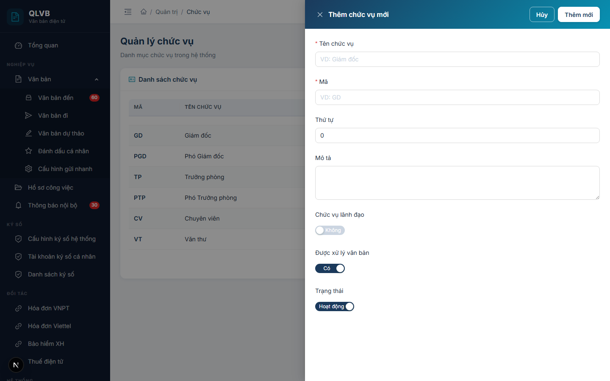
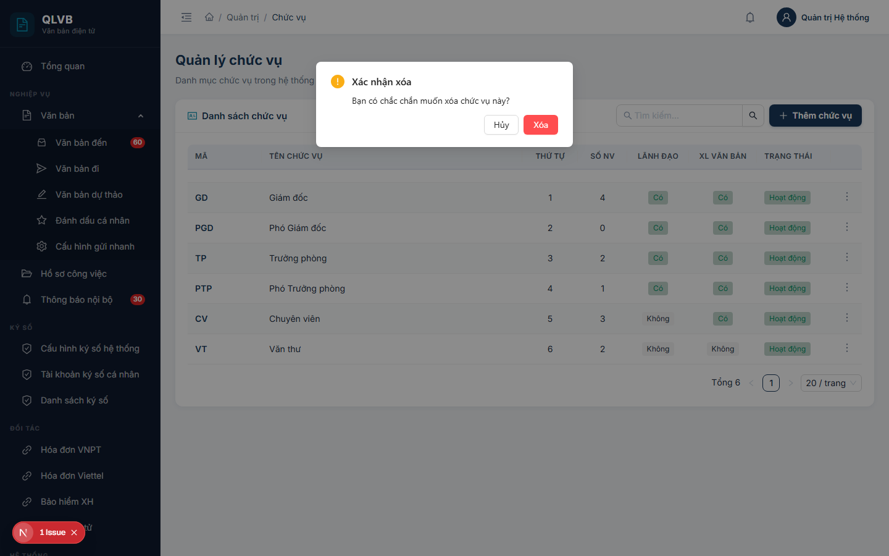

# Hướng dẫn sử dụng: Màn hình Quản trị > Chức vụ

Tài liệu này mô tả đầy đủ các chức năng có trong màn hình **Quản trị > Chức vụ** của hệ thống Quản lý văn bản điện tử (e-Office), giúp người dùng hiểu rõ cách sử dụng và quy trình nghiệp vụ.

---

## 1. Giới thiệu

Màn hình **Quản trị > Chức vụ** dùng để quản lý danh mục **chức vụ** của cán bộ trong cơ quan — ví dụ: Giám đốc, Phó Giám đốc, Trưởng phòng, Phó Trưởng phòng, Chuyên viên, Văn thư. Đây là dữ liệu nền tảng để gán cho từng cán bộ ở màn hình **Quản trị > Người dùng**, đồng thời chi phối hai quyền nghiệp vụ rất quan trọng:

- **Chức vụ lãnh đạo**: cán bộ giữ chức vụ này được phép giao việc, phân công, cho ý kiến chỉ đạo, ký duyệt văn bản trong các luồng văn bản đến / đi / dự thảo.
- **Chức vụ được xử lý văn bản**: cán bộ giữ chức vụ này được phép nhận văn bản giao xử lý (chuyên viên, thư ký…). Nếu tắt, cán bộ sẽ không xuất hiện trong danh sách chọn người xử lý.

Vì là dữ liệu gốc, ảnh hưởng đến phân quyền của toàn bộ cán bộ, nên màn hình này **chỉ dành cho tài khoản Quản trị hệ thống**. Người dùng thông thường không truy cập được.

---

## 2. Bố cục màn hình

Màn hình được chia thành 2 phần chính:

- **Phần đầu trang**: Hiển thị tiêu đề "Quản lý chức vụ" và dòng mô tả ngắn "Danh mục chức vụ trong hệ thống".
- **Khung "Danh sách chức vụ"**:
  - Tiêu đề khung kèm biểu tượng thẻ tên màu xanh teal.
  - **Ô tìm kiếm "Tìm kiếm..."** ở góc trên bên phải khung — cho phép tìm theo tên hoặc mã chức vụ.
  - **Nút "Thêm chức vụ"** (màu xanh, biểu tượng dấu cộng) ngay cạnh ô tìm kiếm.
  - Bảng dữ liệu hiển thị toàn bộ chức vụ trong hệ thống, có phân trang ở phía dưới.
  - Mỗi dòng có nút thao tác hình **ba chấm dọc** ở cột cuối cùng, chứa các lệnh: Sửa thông tin, Xóa.
- **Cửa sổ phụ (Drawer / Modal)**:
  - **Drawer Thêm chức vụ mới / Cập nhật chức vụ** — mở ra từ bên phải khi bấm nút Thêm hoặc Sửa.
  - **Hộp xác nhận xóa** — mở khi bấm Xóa, yêu cầu xác nhận trước khi thực hiện.

---

## 3. Các cột trong Bảng danh sách chức vụ

| Tên cột | Mô tả |
|---|---|
| **Mã** | Mã ngắn của chức vụ — hiển thị in đậm, màu xanh navy. Dùng để tham chiếu nội bộ. |
| **Tên chức vụ** | Tên đầy đủ của chức vụ. Nếu tên dài sẽ tự động cắt bớt và hiện tooltip khi rê chuột. |
| **Thứ tự** | Số nguyên dùng để sắp xếp thứ tự hiển thị trong bảng và trong các danh sách chọn chức vụ ở các màn hình khác. Số nhỏ đứng trước. |
| **Số NV** | Số lượng nhân viên hiện đang giữ chức vụ này. Khi cột này lớn hơn 0, không thể xóa chức vụ (xem mục 7). |
| **Lãnh đạo** | Nhãn **Có** (xanh lá) hoặc **Không** (xám). Cho biết chức vụ này có quyền lãnh đạo (giao việc, ký duyệt) hay không. |
| **XL Văn bản** | Nhãn **Có** (xanh lá) hoặc **Không** (xám). Cho biết chức vụ này có được tham gia xử lý văn bản hay không. |
| **Trạng thái** | **Hoạt động** (nhãn xanh lá) hoặc **Ngừng** (nhãn đỏ). Chức vụ đang ngừng vẫn còn trong hệ thống nhưng không được dùng cho các thao tác mới. |
| (cột thao tác) | Nút ba chấm dọc, mở menu các lệnh: Sửa thông tin, Xóa. |

---

## 4. Các trường nhập liệu trong cửa sổ Thêm / Cập nhật chức vụ

Khi bấm **Thêm chức vụ** hoặc **Sửa thông tin**, hệ thống mở cửa sổ phía bên phải màn hình với các trường sau:

| Tên trường | Bắt buộc | Mô tả & ràng buộc |
|---|---|---|
| **Tên chức vụ** | Có | Tên đầy đủ của chức vụ (ví dụ: `Giám đốc`, `Phó Trưởng phòng`). Tối đa 100 ký tự. Nếu để trống, hệ thống báo lỗi "Tên chức vụ là bắt buộc". |
| **Mã** | Có | Mã ngắn dùng để tham chiếu (ví dụ: `GD`, `PTP`, `CV`). Tối đa 20 ký tự. **Mã phải duy nhất trong toàn hệ thống** (không phân biệt chữ hoa/thường) — nếu trùng, hệ thống sẽ báo lỗi "Mã chức vụ đã tồn tại". |
| **Thứ tự** | Không | Số nguyên không âm, dùng để sắp xếp thứ tự hiển thị. Số nhỏ đứng trước. Mặc định là 0. Nên đặt theo cấp bậc — ví dụ Giám đốc = 1, Phó Giám đốc = 2, Trưởng phòng = 10, Chuyên viên = 50. |
| **Mô tả** | Không | Mô tả thêm về chức năng, nhiệm vụ của chức vụ. Tối đa 500 ký tự, dạng vùng văn bản nhiều dòng. |
| **Chức vụ lãnh đạo** | Không | Công tắc bật/tắt — quy định chức vụ này có quyền **giao việc, phân công xử lý, cho ý kiến chỉ đạo, ký duyệt** hay không. Mặc định: tắt. |
| **Được xử lý văn bản** | Không | Công tắc bật/tắt — quy định cán bộ giữ chức vụ này có được nhận văn bản giao xử lý hay không. Mặc định: bật. |
| **Trạng thái** | Không | Công tắc **Hoạt động / Ngừng**. Khi đặt **Ngừng**, chức vụ vẫn còn trong hệ thống nhưng không nên dùng cho cán bộ mới. Mặc định khi tạo mới: Hoạt động. |

> **Lưu ý**: Sau khi điền xong, bấm **Thêm mới** (khi tạo) hoặc **Cập nhật** (khi sửa) ở góc trên bên phải cửa sổ. Các thông báo sai sẽ hiển thị ngay dưới ô nhập tương ứng để người dùng dễ phát hiện và sửa.

---

## 5. Các nút chức năng

| Nút | Vị trí | Khi nào hiển thị | Tác dụng |
|---|---|---|---|
| **Thêm chức vụ** | Góc trên bên phải khung "Danh sách chức vụ" | Luôn hiển thị | Mở cửa sổ Thêm chức vụ mới với các giá trị mặc định: Trạng thái = Hoạt động, Thứ tự = 0, Lãnh đạo = Không, Được xử lý văn bản = Có. |
| **Ô tìm kiếm "Tìm kiếm..."** | Góc trên bên phải khung "Danh sách chức vụ" | Luôn hiển thị | Lọc bảng theo từ khóa nhập. Tìm cả trong **Tên** và **Mã**. Có nút xóa nhanh để bỏ từ khóa. |
| **Sửa thông tin** | Trong menu ba chấm trên mỗi dòng | Luôn hiển thị | Mở cửa sổ Cập nhật chức vụ với dữ liệu hiện có để chỉnh sửa. |
| **Xóa** | Trong menu ba chấm trên mỗi dòng (mục cuối, màu đỏ) | Luôn hiển thị | Mở hộp xác nhận, sau đó xóa chức vụ. **Chỉ xóa được khi không có nhân viên nào giữ chức vụ đó** (xem mục 7). |
| **Thêm mới** / **Cập nhật** | Góc trên bên phải cửa sổ Thêm/Sửa | Trong cửa sổ Thêm/Sửa | Lưu dữ liệu vừa nhập. Nhãn nút thay đổi tùy theo đang Thêm mới hay Cập nhật. |
| **Hủy** | Góc trên bên phải cửa sổ Thêm/Sửa | Trong cửa sổ Thêm/Sửa | Đóng cửa sổ, không lưu thay đổi. |
| **Xóa** / **Hủy** trong hộp xác nhận | Trong hộp xác nhận xóa | Khi mở hộp xác nhận | **Xóa** (màu đỏ) — thực hiện xóa. **Hủy** — đóng hộp, không xóa. |
| **Phân trang** | Phía dưới bảng | Khi tổng số bản ghi vượt số dòng/trang | Chuyển trang, đổi số dòng/trang. Hiển thị tổng số chức vụ. |

---

## 6. Quy trình thao tác chính

### 6.1. Thêm mới một chức vụ

1. Bấm nút **Thêm chức vụ** ở góc trên bên phải khung "Danh sách chức vụ".
2. Trong cửa sổ **Thêm chức vụ mới**, điền:
   - **Tên chức vụ** (bắt buộc): tên đầy đủ — ví dụ `Trưởng phòng Tổ chức cán bộ`.
   - **Mã** (bắt buộc): mã ngắn không trùng chức vụ nào khác — ví dụ `TP-TCCB`.
   - **Thứ tự**: nhập số phù hợp với cấp bậc của chức vụ (xem mục 7.4).
   - **Chức vụ lãnh đạo**: bật nếu chức vụ này được giao việc / ký duyệt.
   - **Được xử lý văn bản**: giữ bật nếu cán bộ giữ chức vụ này có thể nhận văn bản xử lý; tắt với chức vụ thuần lãnh đạo không trực tiếp xử lý.
   - **Mô tả** (tùy chọn): mô tả vai trò chức vụ.
3. Bấm **Thêm mới**.
4. Hệ thống thông báo **"Thêm thành công"** và đóng cửa sổ. Bảng tự động cập nhật.

### 6.2. Chỉnh sửa thông tin một chức vụ

1. Tìm chức vụ cần sửa trên bảng (có thể dùng ô tìm kiếm để thu hẹp danh sách).
2. Trên dòng tương ứng, bấm biểu tượng **ba chấm dọc** ở cột cuối → chọn **Sửa thông tin**.
3. Cửa sổ **Cập nhật chức vụ** mở ra với dữ liệu sẵn có. Sửa các thông tin cần thiết.
4. Bấm **Cập nhật**.
5. Hệ thống thông báo **"Cập nhật thành công"** và đóng cửa sổ.

> Khi đổi công tắc **Chức vụ lãnh đạo** hoặc **Được xử lý văn bản**, thay đổi sẽ ảnh hưởng đến **tất cả cán bộ đang giữ chức vụ đó**. Hãy cân nhắc kỹ vì việc này có thể làm thay đổi quyền giao việc / nhận văn bản của hàng loạt cán bộ.

### 6.3. Ngừng / Kích hoạt lại một chức vụ

Hệ thống không có nút Khóa/Mở khóa riêng. Để **ngừng** một chức vụ (không cho dùng nữa), thao tác như sau:

1. Mở cửa sổ **Sửa thông tin** chức vụ cần ngừng.
2. Tắt công tắc **Trạng thái** (chuyển sang **Ngừng**).
3. Bấm **Cập nhật**.
4. Để kích hoạt lại, mở cửa sổ Sửa thông tin và bật lại công tắc Trạng thái về **Hoạt động**.

> **Khi nào nên ngừng?** Khi một chức vụ không còn dùng theo cơ cấu mới (sau tái cơ cấu, sát nhập), nhưng vẫn còn cán bộ trong lịch sử giữ chức vụ đó. Ngừng giúp ngăn việc gán chức vụ này cho cán bộ mới, đồng thời vẫn giữ nguyên dữ liệu lịch sử.

### 6.4. Xóa chức vụ

1. Tìm chức vụ cần xóa.
2. Bấm biểu tượng **ba chấm dọc** ở cột cuối → chọn **Xóa** (mục cuối, màu đỏ).
3. Hộp xác nhận hiện ra với câu hỏi *"Bạn có chắc chắn muốn xóa chức vụ này?"*.

   
4. Bấm **Xóa** (màu đỏ) để xác nhận, hoặc **Hủy** để bỏ qua.
5. Nếu xóa được, hệ thống thông báo **"Xóa thành công"**.
6. Nếu không xóa được (chức vụ còn nhân viên), hệ thống báo lỗi rõ lý do (xem mục 7).

> **Quan trọng**: Khác với một số danh mục khác, chức vụ thực hiện **xóa cứng** — bản ghi bị xóa hẳn khỏi cơ sở dữ liệu nếu thỏa mãn điều kiện xóa. Hãy cân nhắc kỹ trước khi xóa, hoặc dùng phương án **Ngừng** ở mục 6.3 để bảo toàn lịch sử.

### 6.5. Tìm kiếm chức vụ

1. Trên ô **Tìm kiếm...** ở góc trên bên phải khung "Danh sách chức vụ", gõ một phần **Tên** hoặc **Mã** chức vụ.
2. Nhấn Enter (hoặc bấm biểu tượng kính lúp). Bảng sẽ tự động lọc, chỉ hiển thị các chức vụ khớp.
3. Bấm biểu tượng **dấu nhân** trong ô tìm kiếm để xóa từ khóa và hiển thị lại toàn bộ danh sách.

---

## 7. Lưu ý / Ràng buộc nghiệp vụ

### 7.1. "Chức vụ lãnh đạo" — ý nghĩa nghiệp vụ

Công tắc **Chức vụ lãnh đạo** quyết định cán bộ giữ chức vụ đó có được phép thực hiện các hành vi của lãnh đạo trong toàn hệ thống hay không, bao gồm:

- **Giao việc, phân công xử lý** trong luồng Văn bản đến.
- **Cho ý kiến chỉ đạo** trên văn bản đến.
- **Ký duyệt** dự thảo văn bản đi, hồ sơ công việc.
- **Nhận báo cáo, theo dõi tiến độ** từ cấp dưới.

Các chức vụ thường được đánh dấu **Có** (Lãnh đạo): Giám đốc, Phó Giám đốc, Trưởng phòng, Phó Trưởng phòng, Chánh Văn phòng.

Các chức vụ thường được đánh dấu **Không**: Chuyên viên, Văn thư, Thư ký, Cán sự.

### 7.2. "Được xử lý văn bản" — ý nghĩa nghiệp vụ

Công tắc **Được xử lý văn bản** quyết định cán bộ giữ chức vụ đó có xuất hiện trong **danh sách chọn người xử lý** ở các màn hình giao việc / phân công hay không.

- Bật (mặc định khi tạo mới): áp dụng cho hầu hết các chức vụ — chuyên viên, trưởng phòng, văn thư.
- Tắt: áp dụng cho các chức vụ thuần đại diện, không trực tiếp xử lý văn bản — ví dụ một số chức vụ kiêm nhiệm.

### 7.3. Mã chức vụ phải duy nhất

Trong toàn hệ thống, **mỗi mã chức vụ chỉ tồn tại một lần** (không phân biệt chữ hoa / chữ thường). Khi nhập trùng, hệ thống báo:

> *"Mã chức vụ đã tồn tại"*

Lỗi này hiển thị ngay tại ô **Mã** trong cửa sổ nhập để người dùng dễ phát hiện.

### 7.4. Thứ tự sắp xếp

Số ở trường **Thứ tự** quyết định vị trí hiển thị của chức vụ trong bảng và trong các danh sách chọn chức vụ ở các màn hình khác (ví dụ: màn hình Quản trị > Người dùng). Số nhỏ đứng trước số lớn. Khi nhiều chức vụ cùng số thứ tự, hệ thống tiếp tục sắp xếp theo tên (theo bảng chữ cái).

Khuyến nghị đặt theo cấp bậc nghiệp vụ — ví dụ:

- Giám đốc = 1
- Phó Giám đốc = 2
- Trưởng phòng = 10
- Phó Trưởng phòng = 11
- Chuyên viên = 50
- Văn thư = 90

### 7.5. Không xóa được chức vụ còn nhân viên đang giữ

Hệ thống ngăn xóa nếu chức vụ vẫn còn cán bộ đang gắn vào, kèm thông báo rõ số lượng:

> *"Không thể xóa: còn N nhân viên đang sử dụng chức vụ này"*

Trong đó **N** là số cán bộ đang giữ chức vụ đó (cũng chính là số ở cột **Số NV** của bảng).

Cách xử lý:

- Vào màn hình **Quản trị > Người dùng**, chuyển từng cán bộ sang chức vụ khác phù hợp.
- Sau khi cột **Số NV** về 0, thao tác xóa sẽ thành công.
- Nếu không thể chuyển toàn bộ cán bộ, hãy chọn phương án **Ngừng** ở mục 6.3 thay vì xóa.

### 7.6. Mã và tên — không nên thay đổi sau khi đã sử dụng

Mặc dù hệ thống cho phép sửa **Mã** và **Tên** chức vụ bất kỳ lúc nào, nhưng nếu chức vụ đã được gán cho nhiều cán bộ và đã xuất hiện trên các văn bản, hồ sơ trong quá khứ, việc đổi tên sẽ làm thay đổi cách hiển thị trong toàn bộ lịch sử nghiệp vụ. Khuyến nghị:

- Chỉ sửa khi phát hiện sai chính tả hoặc sai mã ngay sau khi tạo.
- Nếu cần đổi cấu trúc chức vụ (theo cơ cấu mới), nên **tạo chức vụ mới + ngừng chức vụ cũ + chuyển dần cán bộ** thay vì sửa trực tiếp.

---

*Tài liệu được biên soạn dựa trên hệ thống thực tế đang triển khai. Mọi thắc mắc vui lòng liên hệ với đội phát triển để được hỗ trợ.*
