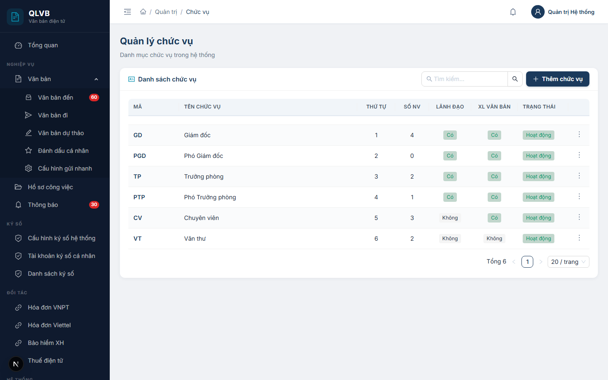
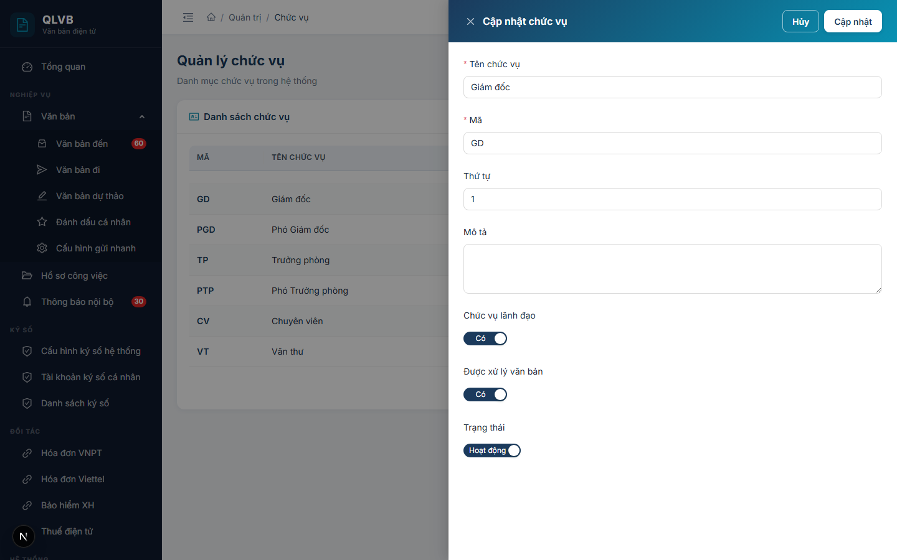

# Quản trị chức vụ

## Giới thiệu

Module Quản trị chức vụ giúp quản trị viên duy trì danh mục chức vụ trong hệ thống, ví dụ: Giám đốc, Phó giám đốc, Trưởng phòng, Phó trưởng phòng, Chuyên viên, Văn thư. Chức vụ được gán cho từng nhân viên để phân biệt vai trò trong luồng xử lý văn bản.

Truy cập: menu **Quản trị → Chức vụ**.

Đối tượng sử dụng: quản trị viên hệ thống.

## Quy trình thao tác và ràng buộc nghiệp vụ

Quy trình chuẩn:

1. Tạo các chức vụ cơ bản theo cơ cấu nhân sự (Giám đốc, Phó giám đốc, Trưởng phòng, Chuyên viên, Văn thư...).
2. Đánh dấu **Chức vụ lãnh đạo** với các chức vụ có thẩm quyền duyệt, ký, phân công xử lý văn bản.
3. Đánh dấu **Được xử lý văn bản** để chức vụ đó được xuất hiện trong các Select khi giao việc, gán xử lý.
4. Khi không còn sử dụng, chuyển **Trạng thái** sang Ngừng (thay vì xóa) để giữ lịch sử nhân sự cũ.

Ràng buộc nghiệp vụ:

- **Tên chức vụ** là trường bắt buộc.
- **Mã chức vụ** phải duy nhất trong toàn hệ thống.
- Không thể xóa chức vụ nếu còn nhân viên đang sử dụng — phải đổi chức vụ của các nhân viên đó hoặc xóa nhân viên trước.
- **Chức vụ lãnh đạo** được hệ thống dùng để xác định ai có quyền duyệt, phân công, ký số văn bản đi.
- **Được xử lý văn bản** quyết định chức vụ có xuất hiện trong danh sách người xử lý khi văn thư phân công văn bản đến.

## Các màn hình chức năng

### Màn hình danh sách chức vụ

#### Bố cục màn hình

Toàn màn hình là một bảng danh sách chức vụ trong card chính. Trên cùng là tiêu đề trang **Quản lý chức vụ** kèm dòng mô tả ngắn.

Header card gồm tiêu đề **Danh sách chức vụ** ở bên trái và hai thành phần ở bên phải: ô tìm kiếm và nút Thêm chức vụ.

Cuối bảng có thanh phân trang với tổng số bản ghi và bộ chọn số dòng/trang.

#### Các nút chức năng

| Nút | Vị trí | Khi nào hiển thị | Tác dụng |
|---|---|---|---|
| Tìm kiếm | Header card, bên trái nút Thêm | Luôn hiển thị | Lọc danh sách theo từ khóa, gõ Enter để tìm |
| Thêm chức vụ | Header card, góc phải | Luôn hiển thị | Mở Drawer nhập thông tin chức vụ mới |
| Sửa thông tin | Trong menu ba chấm cuối mỗi dòng | Mọi dòng | Mở Drawer chỉnh sửa thông tin chức vụ |
| Xóa | Trong menu ba chấm cuối mỗi dòng | Mọi dòng | Mở hộp xác nhận xóa |

#### Các cột / trường dữ liệu

| Cột | Ý nghĩa |
|---|---|
| Mã | Mã chức vụ, in đậm màu xanh navy |
| Tên chức vụ | Tên đầy đủ của chức vụ |
| Thứ tự | Số nguyên dùng để sắp xếp danh sách |
| Số NV | Số nhân viên đang giữ chức vụ này |
| Lãnh đạo | Có (xanh) / Không (xám) — đánh dấu chức vụ lãnh đạo |
| XL Văn bản | Có (xanh) / Không (xám) — đánh dấu chức vụ được xử lý văn bản |
| Trạng thái | Hoạt động (xanh) / Ngừng (đỏ) |

#### Thông báo của hệ thống

| Tình huống | Thông báo |
|---|---|
| Tải bảng không thành công | Lỗi tải dữ liệu |
| Xóa thành công | Xóa thành công |
| Xóa khi còn nhân viên | Không thể xóa: còn N nhân viên đang sử dụng chức vụ này |

### Màn hình Thêm chức vụ mới

Mở khi nhấn nút **Thêm chức vụ** ở header card. Drawer trượt từ phải vào, tiêu đề **Thêm chức vụ mới**, nền gradient xanh navy.

#### Bố cục màn hình

Drawer rộng 720px, các trường xếp dọc:

1. Tên chức vụ (Input).
2. Mã (Input).
3. Thứ tự (InputNumber).
4. Mô tả (TextArea 3 dòng).
5. Chức vụ lãnh đạo (Switch Có/Không).
6. Được xử lý văn bản (Switch Có/Không).
7. Trạng thái (Switch Hoạt động/Ngừng).

#### Các nút chức năng

| Nút | Vị trí | Khi nào hiển thị | Tác dụng |
|---|---|---|---|
| Hủy | Header drawer (góc phải trên) | Luôn hiển thị | Đóng drawer, không lưu thay đổi |
| Thêm mới | Header drawer (góc phải trên) | Luôn hiển thị | Lưu chức vụ mới, đóng drawer khi thành công |

#### Các cột / trường dữ liệu

| Trường | Bắt buộc | Ý nghĩa |
|---|---|---|
| Tên chức vụ | Có | Tối đa 100 ký tự, ví dụ Giám đốc |
| Mã | Có | Tối đa 20 ký tự, ví dụ GD. Duy nhất trong hệ thống |
| Thứ tự | Không | Số nguyên không âm, mặc định 0. Dùng sắp xếp danh sách |
| Mô tả | Không | Ghi chú vai trò chức vụ, tối đa 500 ký tự |
| Chức vụ lãnh đạo | Không | Mặc định Không. Bật nếu chức vụ có thẩm quyền duyệt, ký |
| Được xử lý văn bản | Không | Mặc định Có. Bật để xuất hiện trong Select gán xử lý |
| Trạng thái | Không | Mặc định Hoạt động. Khi chuyển sang Ngừng, chức vụ không xuất hiện trong các Select |

#### Thông báo của hệ thống

| Tình huống | Thông báo |
|---|---|
| Bỏ trống Tên chức vụ | Nhập tên chức vụ |
| Bỏ trống Mã | Nhập mã |
| Mã đã tồn tại | Mã chức vụ đã tồn tại (hiển thị inline ở trường Mã) |
| Tên rỗng (gửi lên server) | Tên chức vụ là bắt buộc |
| Lưu thành công | Thêm thành công |

### Màn hình Cập nhật chức vụ

Mở khi chọn **Sửa thông tin** trong menu ba chấm. Drawer giống Drawer Thêm về bố cục và các trường, chỉ khác hai điểm:

- Tiêu đề là **Cập nhật chức vụ**.
- Nút lưu là **Cập nhật**.

Toàn bộ trường được tải sẵn dữ liệu hiện tại của chức vụ. Người dùng sửa các trường cần thay đổi và bấm **Cập nhật** để lưu.

#### Thông báo của hệ thống

| Tình huống | Thông báo |
|---|---|
| Cập nhật thành công | Cập nhật thành công |
| Mã đã tồn tại ở chức vụ khác | Mã chức vụ đã tồn tại |

Các thông báo còn lại giống Drawer Thêm.

### Hộp xác nhận xóa chức vụ

Hiển thị khi chọn **Xóa** trong menu ba chấm cuối mỗi dòng.

#### Bố cục màn hình

Modal nhỏ nằm giữa màn hình, gồm:

- Tiêu đề: **Xác nhận xóa**.
- Nội dung: dòng văn bản hỏi xác nhận.
- Hai nút ở chân: **Hủy** và **Xóa** (nút Xóa màu đỏ).

#### Các nút chức năng

| Nút | Vị trí | Khi nào hiển thị | Tác dụng |
|---|---|---|---|
| Hủy | Chân modal, bên trái | Luôn hiển thị | Đóng modal, không xóa |
| Xóa | Chân modal, bên phải | Luôn hiển thị | Gọi API xóa chức vụ |

#### Thông báo của hệ thống

| Tình huống | Thông báo |
|---|---|
| Nội dung modal | Bạn có chắc chắn muốn xóa chức vụ này? |
| Xóa thành công | Xóa thành công |
| Còn nhân viên đang dùng | Không thể xóa: còn N nhân viên đang sử dụng chức vụ này |
