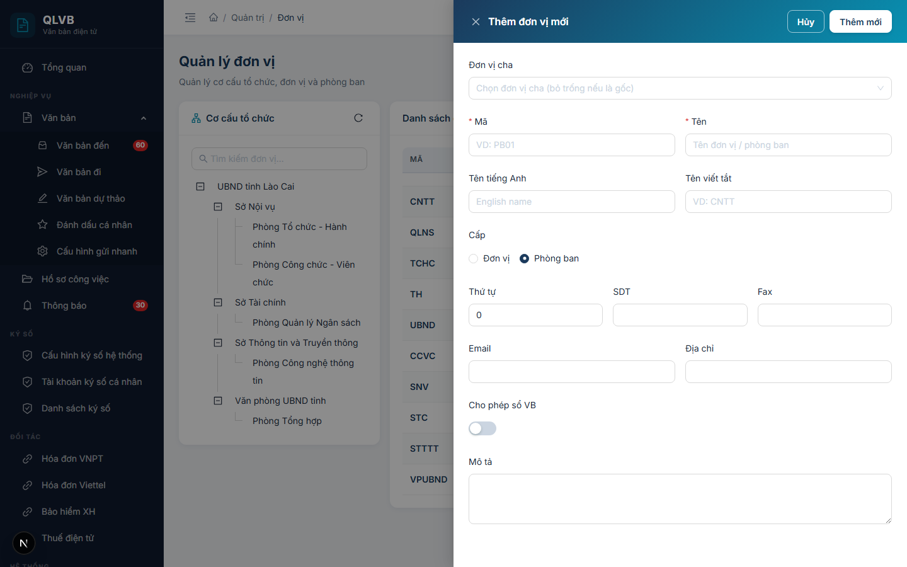
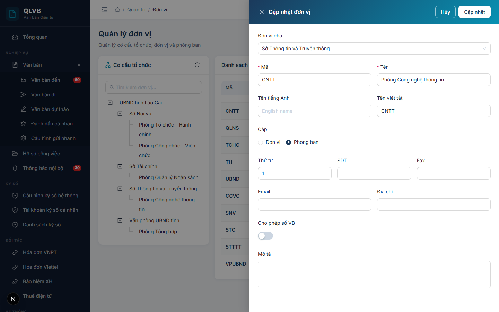
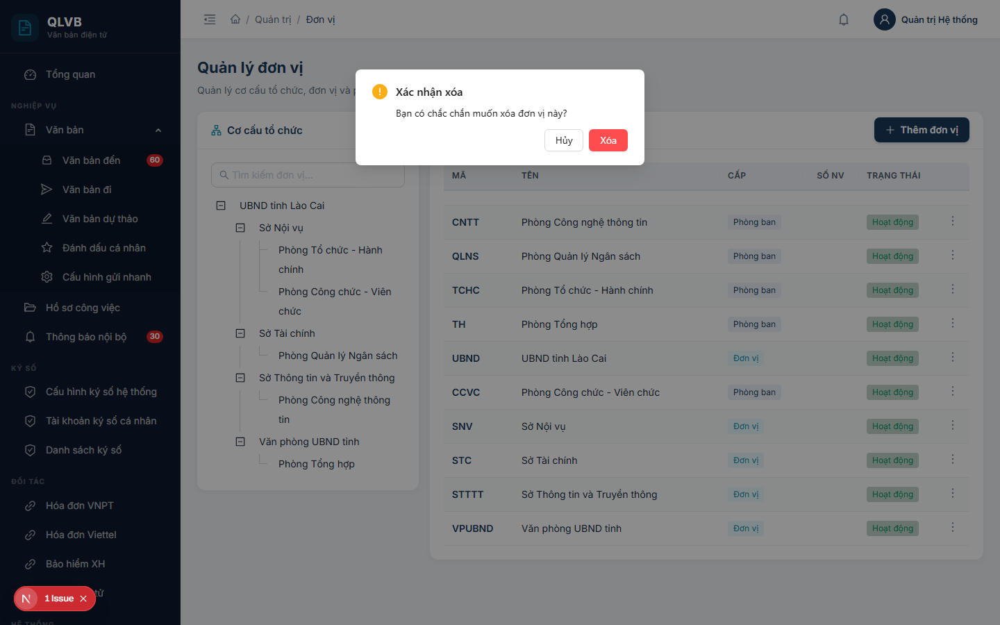

# Quản trị đơn vị

## Giới thiệu

Module Quản trị đơn vị giúp quản trị viên thiết lập và duy trì cơ cấu tổ chức của hệ thống, gồm các đơn vị cấp cao (sở, ban, ngành) và phòng ban trực thuộc. Đây là dữ liệu nền tảng cho toàn bộ luồng nghiệp vụ — văn bản đến, văn bản đi, hồ sơ công việc và phân quyền đều dựa trên cây đơn vị này.

Truy cập: menu **Quản trị → Đơn vị**.

Đối tượng sử dụng: quản trị viên hệ thống, văn thư cấp đơn vị có quyền quản lý cơ cấu.

## Quy trình thao tác và ràng buộc nghiệp vụ

Quy trình chuẩn khi xây dựng cơ cấu tổ chức:

1. Tạo đơn vị cấp cao nhất (cấp đơn vị) trước, ví dụ: Sở Nội vụ, Sở Tài chính.
2. Trong từng đơn vị, thêm các phòng ban trực thuộc (cấp phòng ban).
3. Có thể tạo nhiều cấp lồng nhau (đơn vị → phòng → tổ) bằng cách chọn đơn vị cha tương ứng.
4. Đánh dấu **Cho phép sổ văn bản** với các đơn vị/phòng ban được phép tự cấu hình sổ văn bản đến, đi.
5. Khi đơn vị tạm dừng hoạt động, dùng **Khóa** để vô hiệu hóa thay vì xóa (giữ lịch sử văn bản).

Ràng buộc nghiệp vụ:

- **Mã đơn vị** phải duy nhất trong toàn hệ thống (không phân biệt chữ hoa/thường).
- **Tên đơn vị** là trường bắt buộc.
- Không thể xóa đơn vị nếu còn phòng ban con trực thuộc — phải xóa hoặc di chuyển các phòng ban con trước.
- Không thể xóa đơn vị nếu còn nhân viên đang thuộc về đơn vị/phòng ban đó — phải chuyển nhân viên sang đơn vị khác hoặc xóa nhân viên trước.
- **Cấp** (Đơn vị / Phòng ban) phân biệt mục đích sử dụng: Đơn vị là cấp gán sổ văn bản và phân vùng dữ liệu, Phòng ban là cấp dùng để gán nhân viên xử lý.
- Khi đơn vị bị **Khóa**, các tài khoản trong đơn vị vẫn có thể đăng nhập nhưng đơn vị không xuất hiện trong các Select chọn đơn vị mới.

## Các màn hình chức năng

### Màn hình danh sách đơn vị

#### Bố cục màn hình

Màn hình chia thành hai phần:

- **Bên trái** — Cây cơ cấu tổ chức: hiển thị toàn bộ cây đơn vị/phòng ban dưới dạng phân cấp. Có ô tìm kiếm theo tên và nút Tải lại.
- **Bên phải** — Bảng danh sách đơn vị: hiển thị các đơn vị/phòng ban thuộc nút đang chọn ở cây trái. Khi chưa chọn nút nào, bảng hiển thị toàn bộ.

Trên cùng là tiêu đề trang **Quản lý đơn vị** kèm dòng mô tả ngắn.

#### Các nút chức năng

| Nút | Vị trí | Khi nào hiển thị | Tác dụng |
|---|---|---|---|
| Tải lại | Góc phải card cây trái | Luôn hiển thị | Tải lại cây cơ cấu tổ chức từ máy chủ |
| Thêm đơn vị | Góc phải card bảng phải | Luôn hiển thị | Mở Drawer nhập thông tin đơn vị mới |
| Sửa thông tin | Trong menu ba chấm cuối mỗi dòng | Mọi dòng | Mở Drawer chỉnh sửa thông tin đơn vị |
| Khóa | Trong menu ba chấm cuối mỗi dòng | Khi đơn vị đang Hoạt động | Khóa đơn vị, đổi trạng thái sang Đã khóa |
| Mở khóa | Trong menu ba chấm cuối mỗi dòng | Khi đơn vị Đã khóa | Mở khóa, đổi trạng thái sang Hoạt động |
| Xóa | Trong menu ba chấm cuối mỗi dòng | Mọi dòng | Mở hộp xác nhận xóa |

#### Các cột / trường dữ liệu

| Cột | Ý nghĩa |
|---|---|
| Mã | Mã đơn vị, in đậm màu xanh navy |
| Tên | Tên đầy đủ của đơn vị/phòng ban |
| Cấp | Đơn vị (thẻ xanh teal) hoặc Phòng ban (thẻ xanh navy) |
| Số NV | Số nhân viên đang thuộc về đơn vị/phòng ban |
| Trạng thái | Hoạt động (xanh) hoặc Đã khóa (đỏ) |

Khi click chọn một nút trong cây trái, bảng phải tự động lọc danh sách phòng ban con cấp 1 và cấp 2 của nút đó.

#### Thông báo của hệ thống

| Tình huống | Thông báo |
|---|---|
| Tải cây không thành công | Lỗi tải dữ liệu đơn vị |
| Tải bảng không thành công | Lỗi tải danh sách |
| Khóa đơn vị thành công | Đã khóa |
| Mở khóa đơn vị thành công | Đã mở khóa |
| Xóa thành công | Xóa thành công |
| Xóa khi còn phòng ban con | Không thể xóa: còn N phòng ban con |
| Xóa khi còn nhân viên | Không thể xóa: còn N nhân viên thuộc phòng ban này |

### Màn hình Thêm đơn vị mới

Mở khi nhấn nút **Thêm đơn vị** ở góc phải bảng. Drawer trượt từ phải vào, tiêu đề **Thêm đơn vị mới**, có nền gradient xanh navy.

#### Bố cục màn hình

Drawer rộng 720px, bố cục dọc:

- Trên cùng — Trường **Đơn vị cha** chiếm toàn bộ chiều ngang.
- Hai cột — Cặp Mã / Tên, Tên tiếng Anh / Tên viết tắt.
- Một dòng đơn — Cấp (Đơn vị / Phòng ban) dạng Radio.
- Ba cột — Thứ tự / SDT / Fax.
- Hai cột — Email / Địa chỉ.
- Một dòng đơn — Cho phép sổ văn bản (Switch).
- Cuối — Mô tả (TextArea).

#### Các nút chức năng

| Nút | Vị trí | Khi nào hiển thị | Tác dụng |
|---|---|---|---|
| Hủy | Header drawer (góc phải trên) | Luôn hiển thị | Đóng drawer, không lưu thay đổi |
| Thêm mới | Header drawer (góc phải trên) | Luôn hiển thị | Lưu đơn vị mới, đóng drawer khi thành công |

#### Các cột / trường dữ liệu

| Trường | Bắt buộc | Ý nghĩa |
|---|---|---|
| Đơn vị cha | Không | Chọn đơn vị cấp trên trong cây. Bỏ trống nếu là đơn vị gốc. Nếu trước khi mở Drawer đã chọn 1 nút trong cây trái, hệ thống tự gán đơn vị cha = nút đó |
| Mã | Có | Tối đa 50 ký tự, ví dụ PB01. Phải duy nhất trong hệ thống |
| Tên | Có | Tên đơn vị/phòng ban, tối đa 200 ký tự |
| Tên tiếng Anh | Không | Tên hiển thị tiếng Anh, tối đa 200 ký tự |
| Tên viết tắt | Không | Viết tắt dùng nội bộ, tối đa 50 ký tự |
| Cấp | Có | Đơn vị / Phòng ban (mặc định Phòng ban). Đơn vị là cấp gán sổ văn bản |
| Thứ tự | Không | Số dương, mặc định 0. Quyết định thứ tự hiển thị trong cây |
| SDT | Không | Số điện thoại cố định, chỉ chấp nhận số, dấu cộng/trừ, dấu cách, ngoặc đơn |
| Fax | Không | Tương tự SDT |
| Email | Không | Phải đúng định dạng email nếu có nhập |
| Địa chỉ | Không | Tối đa 500 ký tự |
| Cho phép sổ văn bản | Không | Bật để đơn vị này được phép cấu hình sổ văn bản đến/đi |
| Mô tả | Không | Ghi chú thêm về đơn vị, tối đa 500 ký tự |

#### Thông báo của hệ thống

| Tình huống | Thông báo |
|---|---|
| Bỏ trống Mã | Nhập mã |
| Bỏ trống Tên | Nhập tên |
| Mã đã tồn tại | Mã đơn vị đã tồn tại (hiển thị inline ở trường Mã) |
| Email không đúng định dạng | Email không hợp lệ |
| SDT không đúng định dạng | Số điện thoại không hợp lệ |
| Fax không đúng định dạng | Số fax không hợp lệ |
| Tên rỗng (gửi lên server) | Tên đơn vị là bắt buộc |
| Lưu thành công | Thêm thành công |

### Màn hình Cập nhật đơn vị

Mở khi chọn **Sửa thông tin** trong menu ba chấm. Drawer giống Drawer Thêm về bố cục và các trường, chỉ khác hai điểm:

- Tiêu đề là **Cập nhật đơn vị**.
- Nút lưu là **Cập nhật**.

Toàn bộ trường được tải sẵn dữ liệu hiện tại của đơn vị. Người dùng sửa các trường cần thay đổi và bấm **Cập nhật** để lưu.

#### Thông báo của hệ thống

| Tình huống | Thông báo |
|---|---|
| Cập nhật thành công | Cập nhật thành công |
| Mã đã tồn tại ở đơn vị khác | Mã đơn vị đã tồn tại |

Các thông báo còn lại giống Drawer Thêm.

### Hộp xác nhận xóa đơn vị

Hiển thị khi chọn **Xóa** trong menu ba chấm cuối mỗi dòng.

#### Bố cục màn hình

Modal nhỏ nằm giữa màn hình, gồm:

- Tiêu đề: **Xác nhận xóa**.
- Nội dung: dòng văn bản hỏi xác nhận.
- Hai nút ở chân: **Hủy** và **Xóa** (nút Xóa màu đỏ).

#### Các nút chức năng

| Nút | Vị trí | Khi nào hiển thị | Tác dụng |
|---|---|---|---|
| Hủy | Chân modal, bên trái | Luôn hiển thị | Đóng modal, không xóa |
| Xóa | Chân modal, bên phải | Luôn hiển thị | Gọi API xóa đơn vị |

#### Thông báo của hệ thống

| Tình huống | Thông báo |
|---|---|
| Nội dung modal | Bạn có chắc chắn muốn xóa đơn vị này? |
| Xóa thành công | Xóa thành công |
| Còn phòng ban con | Không thể xóa: còn N phòng ban con |
| Còn nhân viên | Không thể xóa: còn N nhân viên thuộc phòng ban này |
