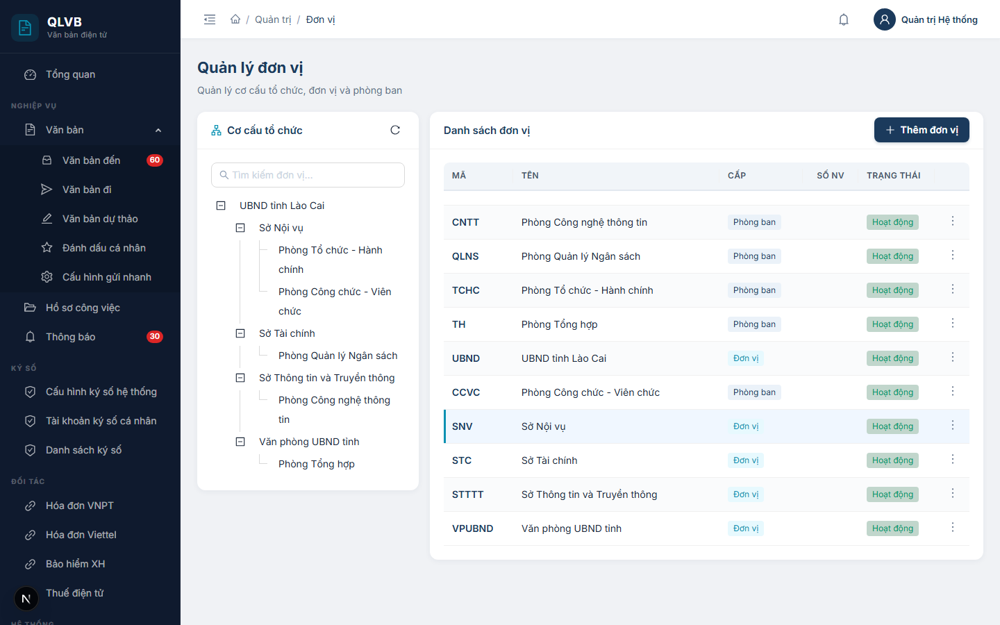
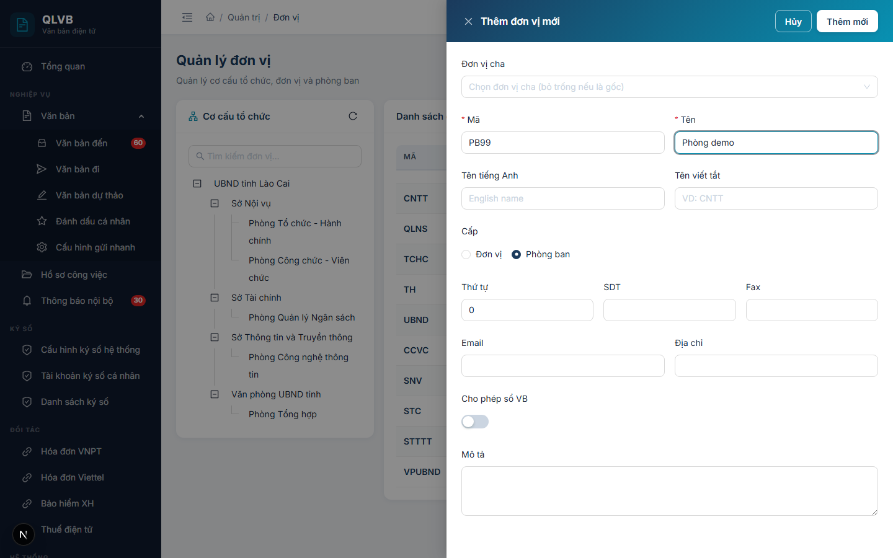

# Hướng dẫn sử dụng: Màn hình Quản trị > Đơn vị

Tài liệu này mô tả đầy đủ các chức năng có trong màn hình **Quản trị > Đơn vị** của hệ thống Quản lý văn bản điện tử (e-Office), giúp người dùng hiểu rõ cách sử dụng và quy trình nghiệp vụ.

---

## 1. Giới thiệu

Màn hình **Quản trị > Đơn vị** dùng để quản lý cơ cấu tổ chức của cơ quan, bao gồm các **đơn vị** (cấp lớn — ví dụ: Sở, Ban, Ngành) và các **phòng ban** trực thuộc. Đây là dữ liệu nền tảng của toàn bộ hệ thống e-Office: dùng để phân quyền cho cán bộ, gán đơn vị làm việc, định tuyến gửi/nhận văn bản, lập sổ văn bản và phân công xử lý hồ sơ công việc.

Vì là dữ liệu gốc nên màn hình này **chỉ dành cho tài khoản Quản trị hệ thống**. Người dùng thông thường không truy cập được vào đây.

Một thay đổi nhỏ trên màn hình này (ví dụ: khóa một đơn vị, đổi tên một phòng ban) sẽ ảnh hưởng đến nhiều màn hình khác, do đó cần thao tác cẩn thận và đúng quy trình.

---

## 2. Bố cục màn hình

Màn hình được chia thành 2 cột chính cùng phần đầu trang:

- **Phần đầu trang**: Hiển thị tiêu đề "Quản lý đơn vị" và dòng mô tả ngắn "Quản lý cơ cấu tổ chức, đơn vị và phòng ban".
- **Cột trái — Cơ cấu tổ chức (cây phân cấp)**:
  - Ô tìm kiếm nhanh ở phía trên cây.
  - Cây phân cấp đơn vị / phòng ban (mặc định mở rộng tất cả các nhánh).
  - Nút **Tải lại** (biểu tượng mũi tên xoay tròn) ở góc trên bên phải để tải lại cây sau khi có thay đổi.
  - Bấm vào một nhánh trên cây sẽ lọc bảng bên phải chỉ hiển thị các phòng ban trực thuộc nhánh đó.
- **Cột phải — Danh sách đơn vị**:
  - Bảng dữ liệu hiển thị các đơn vị / phòng ban tương ứng với nhánh đã chọn (mặc định hiển thị toàn bộ).
  - Nút **Thêm đơn vị** (biểu tượng dấu cộng, màu xanh) ở góc trên bên phải bảng để mở cửa sổ thêm mới.
  - Mỗi dòng có nút thao tác hình **ba chấm dọc** ở cột cuối cùng, chứa các lệnh: Sửa thông tin, Khóa / Mở khóa, Xóa.
- **Cửa sổ phụ (Drawer / Modal)**:
  - **Drawer Thêm đơn vị / Cập nhật đơn vị** — mở ra từ bên phải khi bấm nút Thêm hoặc Sửa.
  - **Hộp xác nhận xóa** — mở khi bấm Xóa, yêu cầu xác nhận trước khi thực hiện.

---

## 3. Các cột trong Bảng danh sách đơn vị

| Tên cột | Mô tả |
|---|---|
| **Mã** | Mã của đơn vị / phòng ban — hiển thị in đậm, màu xanh navy. Dùng để tham chiếu nội bộ. |
| **Tên** | Tên đầy đủ của đơn vị / phòng ban. Nếu tên dài sẽ tự động cắt bớt và hiện tooltip khi rê chuột. |
| **Cấp** | Phân loại: **Đơn vị** (nhãn xanh teal) hoặc **Phòng ban** (nhãn xanh navy). Thông tin này quyết định cách phân cấp tổ chức. |
| **Số NV** | Số lượng nhân viên hiện đang thuộc đơn vị / phòng ban đó. |
| **Trạng thái** | **Hoạt động** (nhãn xanh lá) hoặc **Đã khóa** (nhãn đỏ). Đơn vị bị khóa sẽ không cho phép thao tác nghiệp vụ liên quan. |
| (cột thao tác) | Nút ba chấm dọc, mở menu các lệnh: Sửa thông tin, Khóa / Mở khóa, Xóa. |

---

## 4. Các trường nhập liệu trong cửa sổ Thêm / Cập nhật đơn vị

Khi bấm **Thêm đơn vị** hoặc **Sửa thông tin**, hệ thống mở cửa sổ phía bên phải màn hình với các trường sau:

| Tên trường | Bắt buộc | Mô tả & ràng buộc |
|---|---|---|
| **Đơn vị cha** | Không | Chọn đơn vị cấp trên trực tiếp. Nếu để trống, đơn vị này sẽ là đơn vị gốc (cấp cao nhất). Ô chọn dạng cây phân cấp, có nút xóa để bỏ chọn. Khi đang chọn một nhánh trên cây bên trái rồi mới bấm Thêm, ô này sẽ được điền sẵn nhánh đang chọn. |
| **Mã** | Có | Mã ngắn dùng để tham chiếu (ví dụ: `PB01`, `STC`). Tối đa 50 ký tự. **Mã phải duy nhất trong toàn hệ thống** — nếu trùng, hệ thống sẽ báo lỗi "Mã đơn vị đã tồn tại". |
| **Tên** | Có | Tên đầy đủ của đơn vị / phòng ban. Tối đa 200 ký tự. Nếu để trống hệ thống báo lỗi "Tên đơn vị là bắt buộc". |
| **Tên tiếng Anh** | Không | Tên tiếng Anh tương ứng (dùng khi cần xuất báo cáo song ngữ). Tối đa 200 ký tự. |
| **Tên viết tắt** | Không | Tên viết tắt ngắn gọn (ví dụ: `CNTT`, `TC-KH`). Tối đa 50 ký tự. |
| **Cấp** | Có | Chọn một trong hai: **Đơn vị** (cấp tổ chức lớn — Sở, Ban, Ngành) hoặc **Phòng ban** (cấp trực thuộc đơn vị). Mặc định là **Phòng ban**. |
| **Thứ tự** | Không | Số nguyên không âm, dùng để sắp xếp thứ tự hiển thị trong cây và trong bảng. Số nhỏ hiển thị trước. Mặc định là 0. |
| **SDT** | Không | Số điện thoại liên hệ. Tối đa 20 ký tự. Chỉ chấp nhận chữ số, dấu cộng `+`, dấu trừ `-`, khoảng trắng, dấu ngoặc tròn `(`, `)`. Nếu sai định dạng hệ thống báo "Số điện thoại không hợp lệ". |
| **Fax** | Không | Số fax liên hệ. Tối đa 20 ký tự. Quy tắc định dạng giống SDT. Nếu sai báo "Số fax không hợp lệ". |
| **Email** | Không | Email liên hệ chung của đơn vị. Tối đa 100 ký tự. Phải đúng định dạng email (có ký tự `@` và phần đuôi tên miền). Nếu sai báo "Email không hợp lệ". |
| **Địa chỉ** | Không | Địa chỉ trụ sở của đơn vị. Tối đa 500 ký tự. |
| **Cho phép sổ VB** | Không | Công tắc bật/tắt — quy định đơn vị này có được phép có **sổ văn bản riêng** hay không (ảnh hưởng đến chức năng cấp số văn bản trong các nghiệp vụ Văn bản đến / Văn bản đi). Mặc định: tắt. |
| **Mô tả** | Không | Mô tả thêm về chức năng, nhiệm vụ của đơn vị. Tối đa 500 ký tự, dạng vùng văn bản nhiều dòng. |

> **Lưu ý**: Sau khi điền xong, bấm **Thêm mới** (khi tạo) hoặc **Cập nhật** (khi sửa) ở góc trên bên phải cửa sổ. Các thông báo sai định dạng sẽ hiển thị ngay dưới ô nhập tương ứng để người dùng dễ phát hiện và sửa.

---

## 5. Các nút chức năng

| Nút | Vị trí | Khi nào hiển thị | Tác dụng |
|---|---|---|---|
| **Thêm đơn vị** | Góc trên bên phải bảng danh sách | Luôn hiển thị | Mở cửa sổ Thêm mới đơn vị. Nếu đang chọn một nhánh trên cây, đơn vị mới sẽ được tạo dưới nhánh đó (đặt sẵn ở ô "Đơn vị cha"). |
| **Tải lại** (biểu tượng mũi tên xoay tròn) | Góc trên bên phải khung "Cơ cấu tổ chức" | Luôn hiển thị | Tải lại toàn bộ cây phân cấp từ máy chủ. Dùng khi nghi ngờ dữ liệu không đồng bộ. |
| **Ô tìm kiếm "Tìm kiếm đơn vị..."** | Phía trên cây phân cấp | Luôn hiển thị | Lọc các nhánh trên cây theo từ khóa nhập. Có nút xóa nhanh để xóa từ khóa. |
| **Sửa thông tin** | Trong menu ba chấm trên mỗi dòng | Luôn hiển thị | Mở cửa sổ Cập nhật đơn vị với dữ liệu hiện có để chỉnh sửa. |
| **Khóa** | Trong menu ba chấm trên mỗi dòng | Khi đơn vị đang ở trạng thái **Hoạt động** | Khóa đơn vị / phòng ban — không cho phép tham gia các luồng nghiệp vụ tới khi mở khóa lại. |
| **Mở khóa** | Trong menu ba chấm trên mỗi dòng | Khi đơn vị đang ở trạng thái **Đã khóa** | Mở khóa đơn vị / phòng ban, đưa về trạng thái **Hoạt động**. |
| **Xóa** | Trong menu ba chấm trên mỗi dòng (mục cuối, màu đỏ) | Luôn hiển thị | Mở hộp xác nhận, sau đó xóa đơn vị. **Chỉ xóa được khi đơn vị không còn phòng ban con và không còn nhân viên** (xem mục 7). |
| **Thêm mới** / **Cập nhật** | Góc trên bên phải cửa sổ Thêm/Sửa | Trong cửa sổ Thêm/Sửa | Lưu dữ liệu vừa nhập. Nhãn nút thay đổi tùy theo đang Thêm mới hay Cập nhật. |
| **Hủy** | Góc trên bên phải cửa sổ Thêm/Sửa | Trong cửa sổ Thêm/Sửa | Đóng cửa sổ, không lưu thay đổi. |
| **Xóa** / **Hủy** trong hộp xác nhận | Trong hộp xác nhận xóa | Khi mở hộp xác nhận | **Xóa** (màu đỏ) — thực hiện xóa. **Hủy** — đóng hộp, không xóa. |

---

## 6. Quy trình thao tác chính

### 6.1. Thêm mới một đơn vị / phòng ban

1. (Tùy chọn) Trên cây bên trái, bấm chọn nhánh muốn đặt đơn vị mới vào — khi đó "Đơn vị cha" trong cửa sổ thêm sẽ được điền sẵn.
2. Bấm nút **Thêm đơn vị** ở góc trên bên phải bảng.
3. Trong cửa sổ Thêm đơn vị, điền:
   - **Mã** (bắt buộc): mã ngắn không trùng đơn vị nào khác.
   - **Tên** (bắt buộc): tên đầy đủ.
   - **Cấp**: chọn **Đơn vị** hoặc **Phòng ban** (xem ý nghĩa ở mục 7).
   - Các thông tin còn lại điền tùy nhu cầu.
4. Bấm **Thêm mới**.
5. Hệ thống thông báo **"Thêm thành công"** và đóng cửa sổ. Cây bên trái và bảng bên phải tự động cập nhật.

### 6.2. Chỉnh sửa thông tin một đơn vị

1. Tìm đơn vị cần sửa trên bảng (có thể bấm chọn nhánh trên cây để thu hẹp danh sách).
2. Trên dòng tương ứng, bấm biểu tượng **ba chấm dọc** ở cột cuối → chọn **Sửa thông tin**.
3. Cửa sổ **Cập nhật đơn vị** mở ra với dữ liệu sẵn có. Sửa các thông tin cần thiết.
4. Bấm **Cập nhật**.
5. Hệ thống thông báo **"Cập nhật thành công"** và đóng cửa sổ.

> Khi đổi **Đơn vị cha**, đơn vị này sẽ được di chuyển sang nhánh mới trên cây. Cần cân nhắc kỹ vì việc di chuyển ảnh hưởng đến phân quyền của nhân viên thuộc đơn vị đó.

### 6.3. Khóa / Mở khóa đơn vị

1. Tìm đơn vị cần khóa hoặc mở khóa.
2. Bấm biểu tượng **ba chấm dọc** ở cột cuối.
3. Bấm **Khóa** (nếu đang Hoạt động) hoặc **Mở khóa** (nếu đang Đã khóa).
4. Hệ thống thông báo **"Đã khóa"** hoặc **"Đã mở khóa"** tương ứng. Cột **Trạng thái** trên bảng cập nhật ngay.

> **Khi nào nên khóa?** Khi một phòng ban tạm dừng hoạt động (chia tách, sát nhập, chưa kiện toàn), khóa giúp ngăn việc gán nhân sự / gửi văn bản nhầm tới phòng ban đó, đồng thời vẫn giữ nguyên dữ liệu lịch sử.

### 6.4. Xóa đơn vị

1. Tìm đơn vị cần xóa.
2. Bấm biểu tượng **ba chấm dọc** ở cột cuối → chọn **Xóa** (mục cuối cùng, màu đỏ).
3. Hộp xác nhận hiện ra với câu hỏi *"Bạn có chắc chắn muốn xóa đơn vị này?"*.

   
4. Bấm **Xóa** (màu đỏ) để xác nhận, hoặc **Hủy** để bỏ qua.
5. Nếu xóa được, hệ thống thông báo **"Xóa thành công"**.
6. Nếu không xóa được, hệ thống báo lỗi rõ lý do (xem mục 7).

> **Quan trọng**: Hệ thống thực hiện **xóa mềm** — dữ liệu không bị xóa hẳn khỏi cơ sở dữ liệu mà chỉ ẩn khỏi danh sách. Tuy vậy, từ góc nhìn nghiệp vụ, đơn vị đã xóa coi như không còn tồn tại.

### 6.5. Tìm kiếm trên cây cơ cấu tổ chức

1. Trên ô **Tìm kiếm đơn vị...** ở phía trên cây bên trái, gõ một phần tên đơn vị / phòng ban (có thể không cần dấu).
2. Cây sẽ tự động lọc, chỉ hiển thị các nhánh chứa từ khóa kèm các nhánh cha của chúng.
3. Bấm biểu tượng **dấu nhân** trong ô tìm kiếm để xóa từ khóa và hiển thị lại toàn bộ cây.
4. Bấm vào một nhánh trên cây để lọc bảng bên phải chỉ còn các phòng ban thuộc nhánh đó.

---

## 7. Lưu ý / Ràng buộc nghiệp vụ

### 7.1. "Đơn vị" và "Phòng ban" — phân biệt thế nào?

Hệ thống chia tổ chức thành 2 cấp khái niệm:

- **Đơn vị**: cấp tổ chức lớn — ví dụ Sở, Ban, Ngành, Tổng công ty. Đơn vị thường là chủ thể có sổ văn bản, có lãnh đạo ký, có con dấu riêng.
- **Phòng ban**: cấp tổ chức trực thuộc bên trong một đơn vị — ví dụ Phòng Kế hoạch, Phòng Tổ chức cán bộ, Văn phòng.

Phân biệt này được lưu trên trường **Cấp** của mỗi bản ghi, ảnh hưởng đến cách nhân viên được gán đơn vị làm việc và cách định tuyến văn bản trong toàn hệ thống.

### 7.2. Mã đơn vị phải duy nhất

Trong toàn hệ thống, **mỗi mã đơn vị chỉ tồn tại một lần** (không phân biệt chữ hoa / chữ thường). Khi nhập trùng, hệ thống báo:

> *"Mã đơn vị đã tồn tại"*

Lỗi này hiển thị ngay tại ô **Mã** trong cửa sổ nhập để người dùng dễ phát hiện.

### 7.3. Không xóa được đơn vị còn dữ liệu liên quan

Hệ thống ngăn xóa nếu:

- **Còn phòng ban con trực thuộc**:
  > *"Không thể xóa: còn N phòng ban con"*

  Cần xóa hoặc chuyển các phòng ban con đi trước.

- **Còn nhân viên thuộc đơn vị**:
  > *"Không thể xóa: còn N nhân viên thuộc phòng ban này"*

  Cần chuyển toàn bộ nhân viên sang đơn vị khác trước (thực hiện ở màn hình **Quản trị > Nhân viên**).

Nếu không xóa được nhưng đơn vị thực sự đã ngừng hoạt động, có thể chuyển sang dùng chức năng **Khóa** (mục 6.3).

### 7.4. Thứ tự sắp xếp (sort_order)

Số ở trường **Thứ tự** quyết định vị trí hiển thị của đơn vị trong cây và trong bảng. Số nhỏ đứng trước số lớn. Khi nhiều đơn vị cùng số thứ tự, hệ thống tiếp tục sắp xếp theo tên (theo bảng chữ cái).

### 7.5. "Cho phép sổ VB" — ý nghĩa nghiệp vụ

Bật công tắc này khi đơn vị có **sổ văn bản riêng** — tức là được phép cấp số văn bản đi / văn bản đến mang đầu sổ của đơn vị. Tắt khi đơn vị không phải là chủ thể quản lý sổ (ví dụ: phòng ban nội bộ chỉ dùng sổ chung của đơn vị cấp trên).

Cấu hình chi tiết của các sổ văn bản được thực hiện ở màn hình **Quản trị > Sổ văn bản**, nhưng việc đơn vị có được tạo sổ hay không phụ thuộc vào công tắc này.

### 7.6. Định dạng SDT, Fax, Email

- **SDT** và **Fax**: chỉ chấp nhận chữ số, dấu `+`, `-`, khoảng trắng và ngoặc tròn `(`, `)`. Không chấp nhận chữ cái.
- **Email**: phải đúng định dạng chuẩn (có `@` và phần đuôi tên miền).

Sai định dạng sẽ thấy thông báo đỏ ngay dưới ô nhập.

### 7.7. Bảng tổng hợp các thông báo của hệ thống

| Tình huống | Thông báo |
|---|---|
| Thêm đơn vị thành công | Thêm thành công |
| Cập nhật đơn vị thành công | Cập nhật thành công |
| Xóa đơn vị thành công | Xóa thành công |
| Khóa đơn vị | Đã khóa |
| Mở khóa đơn vị | Đã mở khóa |
| Để trống Tên | Tên đơn vị là bắt buộc |
| Mã trùng | Mã đơn vị đã tồn tại |
| Email sai định dạng | Email không hợp lệ |
| SDT sai định dạng | Số điện thoại không hợp lệ |
| Fax sai định dạng | Số fax không hợp lệ |
| Xóa đơn vị còn phòng ban con | Không thể xóa: còn N phòng ban con |
| Xóa đơn vị còn nhân viên | Không thể xóa: còn N nhân viên thuộc phòng ban này |
| Lỗi tải dữ liệu | Lỗi tải dữ liệu đơn vị / Lỗi tải danh sách |

---

*Tài liệu được biên soạn dựa trên hệ thống thực tế đang triển khai. Mọi thắc mắc vui lòng liên hệ với đội phát triển để được hỗ trợ.*
