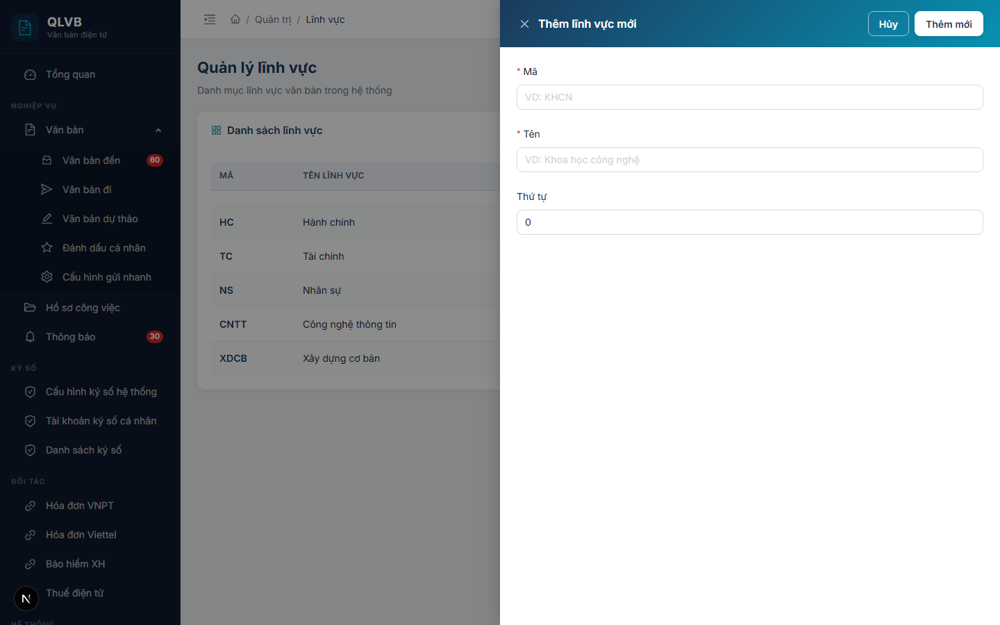

# Quản lý lĩnh vực

## 1. Giới thiệu

Lĩnh vực là danh mục phân loại văn bản theo chủ đề chuyên môn (ví dụ: Khoa học công nghệ, Tài chính, Nhân sự...). Khi tạo văn bản đến, văn bản đi hoặc văn bản dự thảo, người dùng có thể gán một hoặc nhiều lĩnh vực để thuận tiện cho việc tìm kiếm và phân loại sau này.

Người quản trị đơn vị sử dụng chức năng này để thêm, chỉnh sửa, xóa lĩnh vực và bật / tắt trạng thái hoạt động.

## 2. Quy trình thao tác và ràng buộc nghiệp vụ

- Lĩnh vực được tạo và quản lý theo từng đơn vị. Người dùng chỉ thấy lĩnh vực thuộc đơn vị mình đang đăng nhập.
- Mã lĩnh vực là bắt buộc, tối đa 20 ký tự, không được trùng lặp trong cùng đơn vị.
- Tên lĩnh vực là bắt buộc, tối đa 200 ký tự.
- Trường thứ tự nhận giá trị nguyên không âm, dùng để sắp xếp khi hiển thị trong các form chọn lĩnh vực.
- Khi thêm mới, lĩnh vực được tự động đặt ở trạng thái "Hoạt động". Trạng thái chỉ có thể bật / tắt khi chỉnh sửa.
- Lĩnh vực ở trạng thái "Ngừng" sẽ không xuất hiện trong các form chọn lĩnh vực ở văn bản đến / đi / dự thảo nhưng vẫn hiển thị trên màn hình quản trị.
- Tìm kiếm theo từ khóa: nhập từ khóa vào ô tìm kiếm và nhấn Enter để áp dụng (không cần bấm biểu tượng kính lúp).

## 3. Các màn hình chức năng

### 3.1. Màn hình danh sách

#### Bố cục màn hình

- Khu vực trên cùng: tiêu đề "Quản lý lĩnh vực" và mô tả ngắn.
- Thẻ "Danh sách lĩnh vực" gồm:
  - Bảng danh sách các lĩnh vực thuộc đơn vị hiện tại.
  - Ô tìm kiếm và nút "Thêm lĩnh vực" ở góc phải tiêu đề thẻ.

#### Các nút chức năng

| Nút | Vị trí | Khi nào hiển thị | Tác dụng |
|---|---|---|---|
| Thêm lĩnh vực | Góc phải tiêu đề thẻ | Luôn hiển thị | Mở hộp thoại Thêm lĩnh vực mới |
| Ô tìm kiếm | Góc phải tiêu đề thẻ | Luôn hiển thị | Lọc danh sách theo từ khóa, áp dụng khi nhấn Enter |
| Biểu tượng ba chấm dọc | Cuối mỗi dòng | Luôn hiển thị | Mở menu chứa: Sửa, Xóa |
| Sửa | Trong menu ba chấm | Luôn hiển thị | Mở hộp thoại Cập nhật lĩnh vực |
| Xóa | Trong menu ba chấm | Luôn hiển thị | Mở hộp xác nhận xóa |

#### Các cột / trường dữ liệu

| Cột | Ý nghĩa |
|---|---|
| Mã | Mã viết tắt của lĩnh vực, hiển thị in đậm màu xanh đậm |
| Tên lĩnh vực | Tên đầy đủ của lĩnh vực |
| Thứ tự | Số thứ tự dùng để sắp xếp khi hiển thị |
| Trạng thái | Nhãn "Hoạt động" (xanh) hoặc "Ngừng" (đỏ) |

#### Thông báo của hệ thống

| Tình huống | Thông báo |
|---|---|
| Lỗi khi tải danh sách | Lỗi tải dữ liệu |

### 3.2. Hộp thoại Thêm / Cập nhật lĩnh vực

#### Bố cục màn hình

- Hộp thoại trượt từ phải sang, tiêu đề "Thêm lĩnh vực mới" (khi thêm) hoặc "Cập nhật lĩnh vực" (khi sửa).
- Thân hộp thoại chứa các trường nhập theo chiều dọc: Mã, Tên, Thứ tự. Khi đang sửa, hiện thêm trường Trạng thái.
- Phần đầu hộp thoại có hai nút Hủy và Thêm mới / Cập nhật.

#### Các nút chức năng

| Nút | Vị trí | Khi nào hiển thị | Tác dụng |
|---|---|---|---|
| Hủy | Góc phải đầu hộp thoại | Luôn hiển thị | Đóng hộp thoại, không lưu thay đổi |
| Thêm mới | Góc phải đầu hộp thoại | Khi đang thêm | Lưu lĩnh vực mới và đóng hộp thoại |
| Cập nhật | Góc phải đầu hộp thoại | Khi đang sửa | Lưu thay đổi và đóng hộp thoại |

#### Các trường nhập

| Trường | Bắt buộc | Mô tả |
|---|---|---|
| Mã | Có | Tối đa 20 ký tự, gợi ý "VD: KHCN" |
| Tên | Có | Tối đa 200 ký tự, gợi ý "VD: Khoa học công nghệ" |
| Thứ tự | Không | Số nguyên không âm, mặc định 0 |
| Trạng thái | Không | Công tắc Hoạt động / Ngừng, chỉ hiển thị khi chỉnh sửa |

#### Thông báo của hệ thống

| Tình huống | Thông báo |
|---|---|
| Bỏ trống mã | Nhập mã lĩnh vực |
| Bỏ trống tên | Nhập tên lĩnh vực |
| Mã vượt quá độ dài cho phép | Mã lĩnh vực không được vượt quá 20 ký tự |
| Tên vượt quá độ dài cho phép | Tên lĩnh vực không được vượt quá 200 ký tự |
| Mã đã tồn tại trong đơn vị | Mã lĩnh vực đã tồn tại trong đơn vị |
| Thêm thành công | Thêm thành công |
| Cập nhật thành công | Cập nhật thành công |

### 3.3. Hộp xác nhận xóa

#### Bố cục màn hình

- Hộp thoại nổi giữa màn hình, tiêu đề "Xác nhận xóa".
- Nội dung: "Bạn có chắc chắn muốn xóa lĩnh vực này?".
- Hai nút: Hủy và Xóa (màu đỏ).

#### Các nút chức năng

| Nút | Vị trí | Khi nào hiển thị | Tác dụng |
|---|---|---|---|
| Hủy | Góc phải dưới | Luôn hiển thị | Đóng hộp thoại, không xóa |
| Xóa | Góc phải dưới, màu đỏ | Luôn hiển thị | Thực hiện xóa lĩnh vực và đóng hộp thoại |

#### Thông báo của hệ thống

| Tình huống | Thông báo |
|---|---|
| Xóa thành công | Xóa thành công |
| Xóa thất bại | Lỗi khi xóa |
