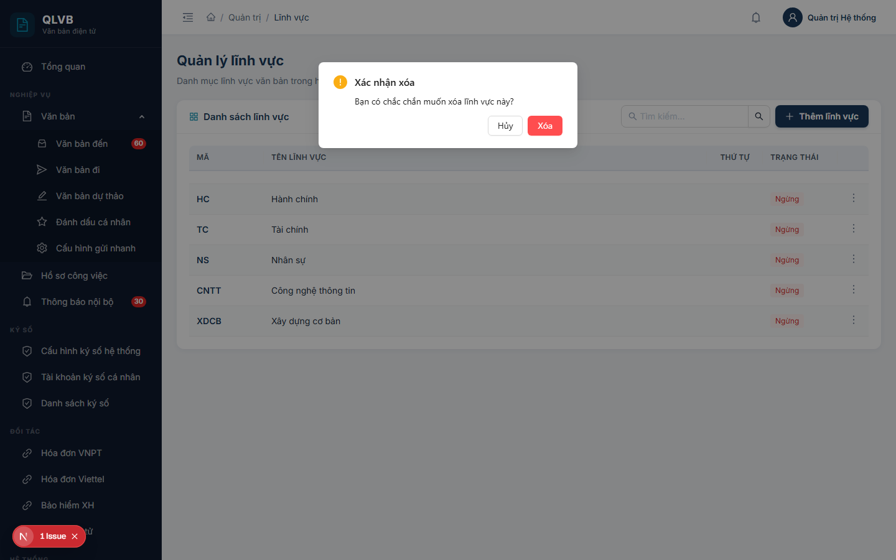

# Hướng dẫn sử dụng: Màn hình Quản trị > Lĩnh vực

Tài liệu này mô tả đầy đủ các chức năng có trong màn hình **Quản trị > Lĩnh vực** của hệ thống Quản lý văn bản điện tử (e-Office), giúp người dùng hiểu rõ cách sử dụng và quy trình nghiệp vụ.

---

## 1. Giới thiệu

Màn hình **Quản trị > Lĩnh vực** dùng để quản lý danh mục **lĩnh vực nghiệp vụ** của cơ quan — ví dụ: Tài chính, Tổ chức cán bộ, Kế hoạch đầu tư, Thanh tra, Văn hóa - Xã hội, Khoa học công nghệ... Mỗi văn bản đến, văn bản đi, dự thảo và hồ sơ công việc đều có thể được gán một lĩnh vực để thuận tiện cho việc lọc, tra cứu, thống kê và phân công xử lý.

Đây là dữ liệu danh mục dùng chung trong **phạm vi đơn vị** (mỗi đơn vị quản lý danh sách lĩnh vực riêng của mình). Mã lĩnh vực không trùng nhau trong cùng một đơn vị, nhưng có thể trùng giữa các đơn vị khác nhau.

Vì là dữ liệu nền tảng, ảnh hưởng đến cách tổ chức và thống kê văn bản, màn hình này **chỉ dành cho tài khoản Quản trị hệ thống** hoặc người được phân quyền quản trị danh mục.

---

## 2. Bố cục màn hình

Màn hình bố cục đơn giản, gồm các phần chính:

- **Phần đầu trang**: Hiển thị tiêu đề "Quản lý lĩnh vực" và dòng mô tả ngắn "Danh mục lĩnh vực văn bản trong hệ thống".
- **Khung danh sách lĩnh vực**:
  - Tiêu đề khung "Danh sách lĩnh vực" với biểu tượng ô vuông màu xanh teal.
  - **Ô tìm kiếm** (placeholder "Tìm kiếm...") ở góc trên bên phải khung — có nút xóa nhanh.
  - Nút **Thêm lĩnh vực** (biểu tượng dấu cộng, màu xanh navy) ở góc trên bên phải khung.
  - Bảng dữ liệu liệt kê các lĩnh vực hiện có — không phân trang (hiển thị toàn bộ trên 1 trang).
  - Mỗi dòng có nút thao tác hình **ba chấm dọc** ở cột cuối cùng, chứa các lệnh: Sửa, Xóa.
- **Cửa sổ phụ (Drawer / Modal)**:
  - **Drawer Thêm lĩnh vực mới / Cập nhật lĩnh vực** — mở từ bên phải khi bấm nút Thêm hoặc Sửa.
  - **Hộp xác nhận xóa** — mở khi bấm Xóa, yêu cầu xác nhận trước khi thực hiện.

---

## 3. Các cột trong Bảng danh sách lĩnh vực

| Tên cột | Mô tả |
|---|---|
| **Mã** | Mã ngắn của lĩnh vực — hiển thị in đậm, màu xanh navy. Dùng để tham chiếu nội bộ và lọc nhanh. |
| **Tên lĩnh vực** | Tên đầy đủ của lĩnh vực. Nếu tên dài sẽ tự động cắt bớt và hiện tooltip khi rê chuột. |
| **Thứ tự** | Số nguyên không âm, quyết định thứ tự hiển thị của lĩnh vực trong bảng và trong các ô chọn lĩnh vực ở các màn hình khác. Số nhỏ hiển thị trước. |
| **Trạng thái** | **Hoạt động** (nhãn xanh lá) hoặc **Ngừng** (nhãn đỏ). Lĩnh vực **Ngừng** vẫn còn trong danh sách quản trị nhưng không xuất hiện trong các ô chọn lĩnh vực ở nghiệp vụ văn bản. |
| (cột thao tác) | Nút ba chấm dọc, mở menu các lệnh: Sửa, Xóa. |

---

## 4. Các trường nhập liệu trong cửa sổ Thêm / Cập nhật lĩnh vực

Khi bấm **Thêm lĩnh vực** hoặc **Sửa**, hệ thống mở cửa sổ phía bên phải màn hình với các trường sau:

| Tên trường | Bắt buộc | Mô tả & ràng buộc |
|---|---|---|
| **Mã** | Có | Mã ngắn dùng để tham chiếu (ví dụ: `KHCN`, `TCKH`, `TT`). Tối đa 20 ký tự. **Mã phải duy nhất trong phạm vi đơn vị** — không phân biệt chữ hoa / chữ thường. Nếu trùng, hệ thống báo lỗi "Mã lĩnh vực đã tồn tại trong đơn vị". Nếu để trống, báo "Mã lĩnh vực là bắt buộc". |
| **Tên** | Có | Tên đầy đủ của lĩnh vực (ví dụ: "Khoa học công nghệ", "Tài chính - Kế hoạch"). Tối đa 200 ký tự. Nếu để trống, hệ thống báo "Tên lĩnh vực là bắt buộc". |
| **Thứ tự** | Không | Số nguyên không âm, dùng để sắp xếp thứ tự hiển thị trong bảng và trong các ô chọn lĩnh vực. Số nhỏ hiển thị trước. Mặc định là 0. |
| **Trạng thái** | Không | Công tắc bật/tắt — chỉ hiển thị khi đang **Cập nhật**, không hiển thị khi **Thêm mới** (lĩnh vực mới mặc định là **Hoạt động**). Bật = Hoạt động, Tắt = Ngừng. Khi để **Ngừng**, lĩnh vực vẫn còn trong danh sách quản trị nhưng người dùng không chọn được khi soạn văn bản. |

> **Lưu ý**: Sau khi điền xong, bấm **Thêm mới** (khi tạo) hoặc **Cập nhật** (khi sửa) ở góc trên bên phải cửa sổ. Các lỗi sai (mã trùng, vượt độ dài, để trống bắt buộc) sẽ hiển thị ngay tại ô tương ứng để người dùng dễ phát hiện và sửa.

---

## 5. Các nút chức năng

| Nút | Vị trí | Khi nào hiển thị | Tác dụng |
|---|---|---|---|
| **Thêm lĩnh vực** | Góc trên bên phải khung "Danh sách lĩnh vực" | Luôn hiển thị | Mở cửa sổ Thêm lĩnh vực mới. |
| **Ô tìm kiếm "Tìm kiếm..."** | Góc trên bên phải khung, bên trái nút Thêm | Luôn hiển thị | Lọc danh sách theo từ khóa nhập (so khớp trong **Mã** hoặc **Tên**). Có nút xóa nhanh để bỏ từ khóa và hiển thị lại toàn bộ. Bấm Enter hoặc bấm biểu tượng kính lúp để áp dụng. |
| **Sửa** | Trong menu ba chấm trên mỗi dòng | Luôn hiển thị | Mở cửa sổ Cập nhật lĩnh vực với dữ liệu hiện có để chỉnh sửa. |
| **Xóa** | Trong menu ba chấm trên mỗi dòng (mục cuối, màu đỏ) | Luôn hiển thị | Mở hộp xác nhận, sau đó xóa lĩnh vực. |
| **Thêm mới** / **Cập nhật** | Góc trên bên phải cửa sổ Thêm/Sửa | Trong cửa sổ Thêm/Sửa | Lưu dữ liệu vừa nhập. Nhãn nút thay đổi tùy theo đang Thêm mới hay Cập nhật. |
| **Hủy** | Góc trên bên phải cửa sổ Thêm/Sửa | Trong cửa sổ Thêm/Sửa | Đóng cửa sổ, không lưu thay đổi. |
| **Xóa** / **Hủy** trong hộp xác nhận | Trong hộp xác nhận xóa | Khi mở hộp xác nhận | **Xóa** (màu đỏ) — thực hiện xóa. **Hủy** — đóng hộp, không xóa. |

---

## 6. Quy trình thao tác chính

### 6.1. Thêm mới một lĩnh vực

1. Bấm nút **Thêm lĩnh vực** ở góc trên bên phải khung danh sách.
2. Trong cửa sổ **Thêm lĩnh vực mới**, điền:
   - **Mã** (bắt buộc): tối đa 20 ký tự, không trùng với lĩnh vực nào đã có trong cùng đơn vị (ví dụ: `KHCN`).
   - **Tên** (bắt buộc): tên đầy đủ, tối đa 200 ký tự (ví dụ: "Khoa học công nghệ").
   - **Thứ tự** (tùy chọn): số nguyên không âm, mặc định 0.
3. Bấm **Thêm mới**.
4. Hệ thống thông báo **"Thêm thành công"** và đóng cửa sổ. Bảng tự động cập nhật, hiển thị lĩnh vực vừa tạo ở vị trí phù hợp theo thứ tự.

### 6.2. Chỉnh sửa thông tin một lĩnh vực

1. Tìm lĩnh vực cần sửa trên bảng (có thể dùng ô tìm kiếm để thu hẹp danh sách).
2. Trên dòng tương ứng, bấm biểu tượng **ba chấm dọc** ở cột cuối → chọn **Sửa**.
3. Cửa sổ **Cập nhật lĩnh vực** mở ra với dữ liệu sẵn có. Sửa các thông tin cần thiết (Mã, Tên, Thứ tự, Trạng thái).
4. Bấm **Cập nhật**.
5. Hệ thống thông báo **"Cập nhật thành công"** và đóng cửa sổ. Bảng cập nhật ngay.

> Khi đổi **Trạng thái** từ Hoạt động sang Ngừng, lĩnh vực sẽ không còn xuất hiện trong các ô chọn lĩnh vực ở các màn hình nghiệp vụ (Văn bản đến, Văn bản đi, Hồ sơ công việc), nhưng các văn bản cũ đã gán lĩnh vực này vẫn giữ nguyên — không bị mất dữ liệu.

### 6.3. Xóa lĩnh vực

1. Tìm lĩnh vực cần xóa trên bảng.
2. Bấm biểu tượng **ba chấm dọc** ở cột cuối → chọn **Xóa** (mục cuối cùng, màu đỏ).
3. Hộp xác nhận hiện ra với câu hỏi *"Bạn có chắc chắn muốn xóa lĩnh vực này?"*.

   
4. Bấm **Xóa** (màu đỏ) để xác nhận, hoặc **Hủy** để bỏ qua.
5. Nếu xóa được, hệ thống thông báo **"Xóa thành công"**. Bảng cập nhật ngay.
6. Nếu lĩnh vực đang được tham chiếu bởi văn bản hoặc hồ sơ, hệ thống sẽ báo lỗi và không xóa được — khi đó hãy chuyển sang **đặt Trạng thái = Ngừng** thay vì xóa (xem mục 7.3).

### 6.4. Tìm kiếm lĩnh vực

1. Trên ô **Tìm kiếm...** ở góc trên bên phải khung, gõ từ khóa (một phần Mã hoặc một phần Tên).
2. Bấm Enter hoặc bấm biểu tượng **kính lúp** để áp dụng.
3. Bảng sẽ chỉ hiển thị các lĩnh vực có Mã hoặc Tên chứa từ khóa.
4. Bấm biểu tượng **dấu nhân** trong ô tìm kiếm để xóa từ khóa và hiển thị lại toàn bộ.

---

## 7. Lưu ý / Ràng buộc nghiệp vụ

### 7.1. Mã lĩnh vực — duy nhất trong đơn vị

Mỗi đơn vị quản lý danh mục lĩnh vực riêng. Trong **cùng một đơn vị**, mỗi mã lĩnh vực **chỉ tồn tại một lần** (không phân biệt chữ hoa / chữ thường, đã loại khoảng trắng đầu/cuối). Hai đơn vị khác nhau có thể cùng có mã `KHCN` mà không xung đột.

Khi nhập trùng mã trong cùng đơn vị, hệ thống báo:

> *"Mã lĩnh vực đã tồn tại trong đơn vị"*

Lỗi này hiển thị ngay tại ô **Mã** trong cửa sổ nhập.

### 7.2. Giới hạn độ dài

- **Mã**: tối đa **20 ký tự**. Vượt quá → "Mã lĩnh vực không được vượt quá 20 ký tự".
- **Tên**: tối đa **200 ký tự**. Vượt quá → "Tên lĩnh vực không được vượt quá 200 ký tự".

Hệ thống tự động cắt giới hạn ký tự ngay khi nhập, nhưng người dùng nên cân nhắc đặt mã ngắn gọn (3-6 ký tự) và tên đầy đủ rõ nghĩa để dễ tra cứu.

### 7.3. "Ngừng" hay "Xóa" — nên chọn cách nào?

Nguyên tắc khuyến nghị:

- **Đặt Trạng thái = Ngừng** khi lĩnh vực không còn dùng nữa nhưng đã có văn bản / hồ sơ tham chiếu — đây là cách an toàn nhất, giữ nguyên lịch sử.
- **Xóa hẳn** chỉ áp dụng khi lĩnh vực **chưa từng được sử dụng** (mới tạo nhầm, gõ sai mã, trùng nội dung với lĩnh vực khác).

Khi xóa một lĩnh vực đang còn được tham chiếu, hệ thống sẽ chặn để bảo toàn dữ liệu — thông báo trả về tùy theo ràng buộc cơ sở dữ liệu (xem bảng thông báo ở mục 7.6).

### 7.4. Thứ tự sắp xếp (sort_order)

Số ở trường **Thứ tự** quyết định vị trí hiển thị của lĩnh vực trong bảng quản trị **và** trong các ô chọn lĩnh vực ở các màn hình nghiệp vụ. Số nhỏ đứng trước số lớn. Khi nhiều lĩnh vực cùng số thứ tự, hệ thống tiếp tục sắp xếp theo tên (theo bảng chữ cái).

Mẹo: dùng các bước nhảy 10 (10, 20, 30...) thay vì 1, 2, 3 — sau này muốn chèn thêm lĩnh vực vào giữa sẽ không phải đánh số lại toàn bộ.

### 7.5. Phạm vi dữ liệu theo đơn vị

Khi mở màn hình, hệ thống mặc định chỉ hiển thị danh sách lĩnh vực thuộc **đơn vị của người đăng nhập** (xác định theo phòng ban gán cho tài khoản, truy ngược lên đơn vị cha cao nhất). Người dùng không nhìn thấy danh sách lĩnh vực của đơn vị khác.

Khi tạo mới, lĩnh vực sẽ tự động được gán cho đơn vị của người đăng nhập — không cần chọn đơn vị thủ công.

### 7.6. Bảng tổng hợp các thông báo của hệ thống

| Tình huống | Thông báo |
|---|---|
| Thêm lĩnh vực thành công | Thêm thành công |
| Cập nhật lĩnh vực thành công | Cập nhật thành công |
| Xóa lĩnh vực thành công | Xóa thành công |
| Để trống Mã (frontend) | Nhập mã lĩnh vực |
| Để trống Mã (backend) | Mã lĩnh vực là bắt buộc |
| Mã rỗng (kiểm tra ở SP) | Mã lĩnh vực không được để trống |
| Mã vượt 20 ký tự | Mã lĩnh vực không được vượt quá 20 ký tự |
| Mã trùng trong cùng đơn vị | Mã lĩnh vực đã tồn tại trong đơn vị |
| Để trống Tên (frontend) | Nhập tên lĩnh vực |
| Để trống Tên (backend) | Tên lĩnh vực là bắt buộc |
| Tên rỗng (kiểm tra ở SP) | Tên lĩnh vực không được để trống |
| Tên vượt 200 ký tự | Tên lĩnh vực không được vượt quá 200 ký tự |
| Không tìm thấy bản ghi khi sửa / xóa | Không tìm thấy lĩnh vực |
| Lỗi tải dữ liệu | Lỗi tải dữ liệu |
| Lỗi khi xóa (chung) | Lỗi khi xóa |

---

*Tài liệu được biên soạn dựa trên hệ thống thực tế đang triển khai. Mọi thắc mắc vui lòng liên hệ với đội phát triển để được hỗ trợ.*
