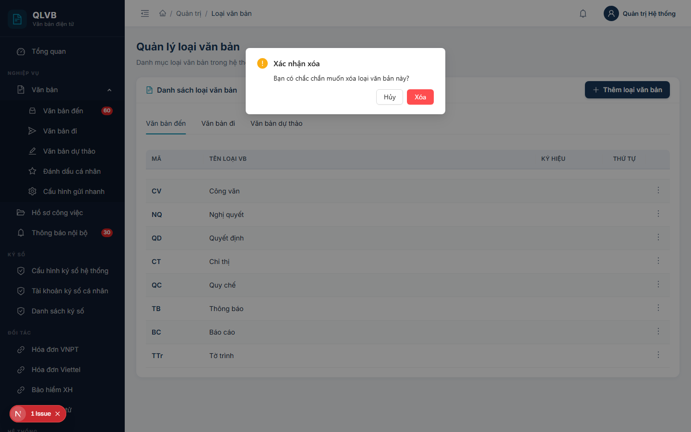

# Quản lý loại văn bản

## 1. Giới thiệu

Loại văn bản là danh mục phân loại các loại tài liệu hành chính theo nhóm văn bản đến, đi và dự thảo. Mỗi loại văn bản có một mã viết tắt (ví dụ: NQ cho Nghị quyết, QĐ cho Quyết định) và có thể được tổ chức theo cấu trúc cha - con để phục vụ phân loại nhiều cấp.

Người quản trị đơn vị sử dụng chức năng này để thêm, chỉnh sửa, xóa loại văn bản và cấu hình kiểu ký hiệu hiển thị trên số văn bản.

## 2. Quy trình thao tác và ràng buộc nghiệp vụ

- Có ba nhóm loại văn bản tương ứng ba tab: Văn bản đến, Văn bản đi, Văn bản dự thảo. Khi thêm loại mới, hệ thống tự gán nhóm theo tab đang chọn.
- Loại văn bản hỗ trợ phân cấp nhiều tầng thông qua trường "Loại cha". Loại không có cha sẽ là loại gốc; loại có cha sẽ trở thành loại con của loại cha tương ứng.
- Mã loại văn bản là bắt buộc, tối đa 20 ký tự, không được trùng lặp.
- Tên loại văn bản là bắt buộc, tối đa 200 ký tự.
- Khi cập nhật, không được chọn chính loại đang sửa làm loại cha của nó.
- Trường "Kiểu ký hiệu" có ba lựa chọn:
  - Không có (mặc định, chỉ hiển thị số văn bản).
  - Số/Ký hiệu (ví dụ: 12/NQ-UBND).
  - Số-Ký hiệu (ví dụ: 12-NQ-UBND).
- Trường thứ tự nhận giá trị nguyên không âm, dùng để sắp xếp khi hiển thị.

## 3. Các màn hình chức năng

### 3.1. Màn hình danh sách

#### Bố cục màn hình

- Khu vực trên cùng: tiêu đề "Quản lý loại văn bản" và mô tả ngắn.
- Thẻ "Danh sách loại văn bản" gồm:
  - Hàng tab phân nhóm: Văn bản đến / Văn bản đi / Văn bản dự thảo.
  - Bảng danh sách loại văn bản hiển thị dạng cây có thể mở rộng / thu gọn để xem các loại con.
  - Nút "Thêm loại văn bản" ở góc phải tiêu đề thẻ.

#### Các nút chức năng

| Nút | Vị trí | Khi nào hiển thị | Tác dụng |
|---|---|---|---|
| Thêm loại văn bản | Góc phải tiêu đề thẻ | Luôn hiển thị | Mở hộp thoại Thêm loại văn bản mới |
| Tab Văn bản đến / đi / dự thảo | Phía trên bảng | Luôn hiển thị | Lọc danh sách theo nhóm văn bản |
| Biểu tượng mũi tên mở rộng | Đầu mỗi dòng có loại con | Khi loại đó có loại con | Mở rộng / thu gọn để xem loại con |
| Biểu tượng ba chấm dọc | Cuối mỗi dòng | Luôn hiển thị | Mở menu chứa: Sửa, Xóa |
| Sửa | Trong menu ba chấm | Luôn hiển thị | Mở hộp thoại Cập nhật loại văn bản |
| Xóa | Trong menu ba chấm | Luôn hiển thị | Mở hộp xác nhận xóa |

#### Các cột / trường dữ liệu

| Cột | Ý nghĩa |
|---|---|
| Mã | Mã viết tắt của loại văn bản, hiển thị in đậm màu xanh đậm |
| Tên loại VB | Tên đầy đủ của loại văn bản |
| Ký hiệu | Hiển thị "Số/Ký hiệu" hoặc "Số-Ký hiệu" tương ứng cấu hình; nếu không cấu hình hiển thị dấu gạch ngang |
| Thứ tự | Số thứ tự dùng để sắp xếp khi hiển thị |

#### Thông báo của hệ thống

| Tình huống | Thông báo |
|---|---|
| Lỗi khi tải danh sách | Lỗi tải dữ liệu |

### 3.2. Hộp thoại Thêm / Cập nhật loại văn bản

#### Bố cục màn hình

- Hộp thoại trượt từ phải sang, tiêu đề "Thêm loại văn bản mới" (khi thêm) hoặc "Cập nhật loại văn bản" (khi sửa).
- Thân hộp thoại chứa các trường nhập theo chiều dọc: Loại cha, Mã, Tên, Kiểu ký hiệu, Thứ tự.
- Phần đầu hộp thoại có hai nút Hủy và Thêm mới / Cập nhật.

#### Các nút chức năng

| Nút | Vị trí | Khi nào hiển thị | Tác dụng |
|---|---|---|---|
| Hủy | Góc phải đầu hộp thoại | Luôn hiển thị | Đóng hộp thoại, không lưu thay đổi |
| Thêm mới | Góc phải đầu hộp thoại | Khi đang thêm | Lưu loại mới và đóng hộp thoại |
| Cập nhật | Góc phải đầu hộp thoại | Khi đang sửa | Lưu thay đổi và đóng hộp thoại |

#### Các trường nhập

| Trường | Bắt buộc | Mô tả |
|---|---|---|
| Loại cha | Không | Chọn từ danh sách các loại đang có; hỗ trợ tìm kiếm theo tên; có thể bỏ trống nếu là loại gốc |
| Mã | Có | Tối đa 20 ký tự, gợi ý "VD: NQ" |
| Tên | Có | Tối đa 200 ký tự, gợi ý "VD: Nghị quyết" |
| Kiểu ký hiệu | Không | Chọn một trong: Không có, Số/Ký hiệu, Số-Ký hiệu |
| Thứ tự | Không | Số nguyên không âm, mặc định 0 |

#### Thông báo của hệ thống

| Tình huống | Thông báo |
|---|---|
| Bỏ trống mã | Nhập mã loại văn bản |
| Bỏ trống tên | Nhập tên loại văn bản |
| Mã vượt quá độ dài cho phép | Mã loại văn bản không được vượt quá 20 ký tự |
| Tên vượt quá độ dài cho phép | Tên loại văn bản không được vượt quá 200 ký tự |
| Mã đã tồn tại | Mã loại văn bản đã tồn tại |
| Loại cha không tồn tại | Loại văn bản cha không tồn tại |
| Chọn chính mình làm cha | Không thể chọn chính mình làm cha |
| Thêm thành công | Thêm thành công |
| Cập nhật thành công | Cập nhật thành công |

### 3.3. Hộp xác nhận xóa

#### Bố cục màn hình

- Hộp thoại nổi giữa màn hình, tiêu đề "Xác nhận xóa".
- Nội dung: "Bạn có chắc chắn muốn xóa loại văn bản này?".
- Hai nút: Hủy và Xóa (màu đỏ).

#### Các nút chức năng

| Nút | Vị trí | Khi nào hiển thị | Tác dụng |
|---|---|---|---|
| Hủy | Góc phải dưới | Luôn hiển thị | Đóng hộp thoại, không xóa |
| Xóa | Góc phải dưới, màu đỏ | Luôn hiển thị | Thực hiện xóa loại văn bản và đóng hộp thoại |

#### Thông báo của hệ thống

| Tình huống | Thông báo |
|---|---|
| Xóa thành công | Xóa thành công |
| Xóa thất bại | Lỗi khi xóa |
