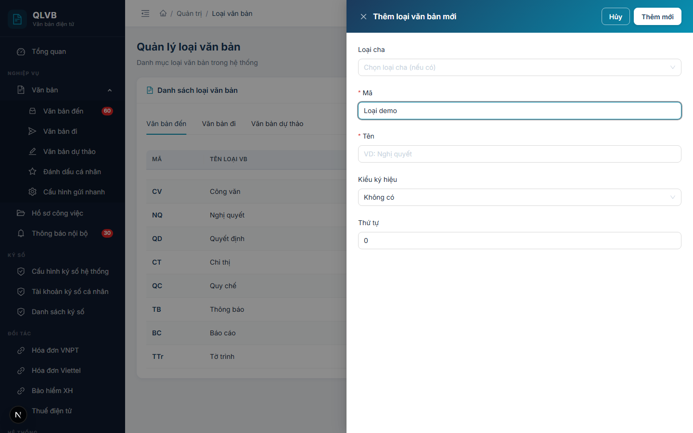

# Hướng dẫn sử dụng: Màn hình Quản trị > Loại văn bản

Tài liệu này mô tả đầy đủ các chức năng có trong màn hình **Quản trị > Loại văn bản** của hệ thống Quản lý văn bản điện tử (e-Office), giúp người dùng hiểu rõ cách sử dụng và quy trình nghiệp vụ.

---

## 1. Giới thiệu

Màn hình **Quản trị > Loại văn bản** dùng để quản lý danh mục các loại văn bản hành chính theo Nghị định 30/2020/NĐ-CP — ví dụ: Quyết định, Công văn, Thông báo, Tờ trình, Báo cáo, Kế hoạch, Hướng dẫn, Nghị quyết... Đây là dữ liệu nền tảng dùng cho:

- Phân loại văn bản khi đăng ký Văn bản đến / Văn bản đi / Văn bản dự thảo.
- Cấp số văn bản (mã loại được ghép vào số ký hiệu, ví dụ: "12/2026/QĐ-UBND").
- Lập báo cáo thống kê (số lượng văn bản theo từng loại trong một kỳ).
- Quy định mẫu trình bày văn bản theo đúng thể thức của từng loại.

Danh mục được tổ chức theo **3 nhóm** tương ứng với 3 phân hệ nghiệp vụ:

- **Văn bản đến** — các loại văn bản cơ quan tiếp nhận từ bên ngoài.
- **Văn bản đi** — các loại văn bản cơ quan ban hành.
- **Văn bản dự thảo** — các loại văn bản đang trong quá trình soạn thảo nội bộ.

Trong mỗi nhóm, các loại văn bản có thể được tổ chức **phân cấp cha — con** (ví dụ: "Quyết định" là cha, "Quyết định cá biệt" và "Quyết định quy phạm" là con).

Vì là dữ liệu gốc nên màn hình này **chỉ dành cho tài khoản Quản trị hệ thống**. Người dùng thông thường chỉ thấy danh mục này dưới dạng ô chọn (dropdown) khi đăng ký văn bản.

---

## 2. Bố cục màn hình

Màn hình được chia thành các phần sau:

- **Phần đầu trang**: Hiển thị tiêu đề "Quản lý loại văn bản" và dòng mô tả ngắn "Danh mục loại văn bản trong hệ thống".
- **Khung danh sách**: Là một thẻ (card) lớn ở giữa màn hình, gồm:
  - Tiêu đề "Danh sách loại văn bản" (kèm biểu tượng tài liệu màu xanh teal) ở góc trên bên trái.
  - Nút **Thêm loại văn bản** (biểu tượng dấu cộng, màu xanh) ở góc trên bên phải.
  - **Thanh tab** ngay dưới tiêu đề, gồm 3 mục: **Văn bản đến / Văn bản đi / Văn bản dự thảo**. Khi bấm chuyển tab, danh sách bên dưới được lọc theo nhóm tương ứng.
  - **Bảng dữ liệu** dạng cây phân cấp — các loại con được lùi vào bên trong loại cha, có biểu tượng mở/thu nhánh.
  - Mỗi dòng có nút **ba chấm dọc** ở cột cuối, mở menu các lệnh: Sửa, Xóa.
- **Cửa sổ phụ (Drawer)**:
  - **Drawer Thêm loại văn bản mới / Cập nhật loại văn bản** — mở từ bên phải khi bấm Thêm hoặc Sửa.
  - **Hộp xác nhận xóa** — mở khi bấm Xóa, yêu cầu xác nhận trước khi thực hiện.

---

## 3. Các cột trong bảng danh sách loại văn bản

| Tên cột | Mô tả |
|---|---|
| **Mã** | Mã ngắn của loại văn bản — hiển thị in đậm, màu xanh navy (ví dụ: `QĐ`, `CV`, `TB`, `BC`). Dùng để ghép vào số ký hiệu văn bản. |
| **Tên loại VB** | Tên đầy đủ của loại văn bản (ví dụ: "Quyết định", "Công văn", "Thông báo"). Nếu tên dài sẽ tự động cắt bớt và hiện tooltip khi rê chuột. |
| **Ký hiệu** | Kiểu ký hiệu áp dụng khi cấp số văn bản — `Số/Ký hiệu`, `Số-Ký hiệu`, hoặc để trống. Quy định cách ghép số văn bản với mã loại trong số ký hiệu cuối cùng. |
| **Thứ tự** | Số nguyên dùng để sắp xếp thứ tự hiển thị trong bảng và trong các ô chọn ở các phân hệ. Số nhỏ hiển thị trước. |
| (cột thao tác) | Nút ba chấm dọc, mở menu các lệnh: Sửa, Xóa. |

> **Lưu ý**: Bảng hiển thị dạng cây — các loại con nằm bên trong loại cha. Bấm vào biểu tượng mũi tên/dấu cộng đầu dòng để mở rộng hoặc thu gọn nhánh con. Bảng KHÔNG có phân trang — toàn bộ danh mục hiện trong một trang.

---

## 4. Các trường nhập liệu trong cửa sổ Thêm / Cập nhật loại văn bản

Khi bấm **Thêm loại văn bản** hoặc **Sửa**, hệ thống mở cửa sổ phía bên phải màn hình với các trường sau:

| Tên trường | Bắt buộc | Mô tả & ràng buộc |
|---|---|---|
| **Loại cha** | Không | Chọn loại văn bản cấp trên trực tiếp (nếu loại đang tạo là một dạng con của loại lớn hơn). Ô chọn dạng tìm kiếm, hiển thị danh sách phẳng các loại trong cùng nhóm tab đang chọn (Văn bản đến / đi / dự thảo), có thụt đầu dòng để thể hiện cấp. Để trống nếu đây là loại gốc. Có nút **Xóa nhanh** (dấu nhân) để bỏ chọn. |
| **Mã** | Có | Mã ngắn của loại văn bản (ví dụ: `QĐ`, `CV`, `TB`). Tối đa 20 ký tự. **Mã phải duy nhất trong toàn hệ thống**, không phân biệt chữ hoa / chữ thường. Nếu trùng, hệ thống báo "Mã loại văn bản đã tồn tại". Nếu để trống báo "Nhập mã loại văn bản" (kiểm tra tại ô nhập) hoặc "Mã loại văn bản không được để trống" (kiểm tra trên máy chủ). |
| **Tên** | Có | Tên đầy đủ của loại văn bản (ví dụ: "Nghị quyết", "Công văn"). Tối đa 200 ký tự. Nếu để trống báo "Nhập tên loại văn bản" hoặc "Tên loại văn bản không được để trống". |
| **Kiểu ký hiệu** | Không | Quy định cách hệ thống ghép số văn bản với mã loại khi cấp số. Có 3 lựa chọn: **Không có** (chỉ dùng số), **Số/Ký hiệu** (ví dụ: `12/QĐ-UBND`), **Số-Ký hiệu** (ví dụ: `12-QĐ-UBND`). Mặc định: Không có. |
| **Thứ tự** | Không | Số nguyên không âm, dùng để sắp xếp thứ tự hiển thị. Số nhỏ hiển thị trước. Mặc định: 0. |

> **Lưu ý**: Trường **Nhóm văn bản** (Văn bản đến / đi / dự thảo) KHÔNG xuất hiện trong cửa sổ Thêm / Cập nhật. Nhóm được xác định **tự động theo tab đang chọn** ở thời điểm bấm Thêm. Vì vậy, nếu muốn thêm một loại cho nhóm "Văn bản đi", phải bấm sang tab "Văn bản đi" trước khi bấm Thêm.

> Sau khi điền xong, bấm **Thêm mới** (khi tạo) hoặc **Cập nhật** (khi sửa) ở góc trên bên phải cửa sổ. Các thông báo sai dữ liệu sẽ hiển thị ngay dưới ô nhập tương ứng để người dùng dễ phát hiện và sửa.

---

## 5. Các nút chức năng

| Nút | Vị trí | Khi nào hiển thị | Tác dụng |
|---|---|---|---|
| **Thêm loại văn bản** | Góc trên bên phải khung danh sách | Luôn hiển thị | Mở cửa sổ Thêm mới. Loại văn bản mới sẽ thuộc về **nhóm tab đang chọn** (Văn bản đến / đi / dự thảo). |
| **Tab "Văn bản đến" / "Văn bản đi" / "Văn bản dự thảo"** | Trên cùng của khung danh sách, ngay dưới tiêu đề | Luôn hiển thị | Lọc bảng để chỉ hiển thị các loại văn bản thuộc nhóm tương ứng. |
| **Sửa** | Trong menu ba chấm trên mỗi dòng | Luôn hiển thị | Mở cửa sổ Cập nhật với dữ liệu hiện có để chỉnh sửa. |
| **Xóa** | Trong menu ba chấm trên mỗi dòng (mục cuối, màu đỏ) | Luôn hiển thị | Mở hộp xác nhận, sau đó xóa loại văn bản. **Chỉ xóa được khi loại không còn loại con** (xem mục 7). |
| **Mở rộng / Thu gọn nhánh** | Biểu tượng mũi tên (hoặc dấu cộng/trừ) ở đầu mỗi dòng có loại con | Khi loại văn bản có ít nhất một loại con | Hiển thị hoặc ẩn các loại con bên trong. |
| **Thêm mới** / **Cập nhật** | Góc trên bên phải cửa sổ Thêm/Sửa | Trong cửa sổ Thêm/Sửa | Lưu dữ liệu vừa nhập. Nhãn nút thay đổi tùy theo đang Thêm mới hay Cập nhật. |
| **Hủy** | Góc trên bên phải cửa sổ Thêm/Sửa | Trong cửa sổ Thêm/Sửa | Đóng cửa sổ, không lưu thay đổi. |
| **Xóa** / **Hủy** trong hộp xác nhận | Trong hộp xác nhận xóa | Khi mở hộp xác nhận | **Xóa** (màu đỏ) — thực hiện xóa. **Hủy** — đóng hộp, không xóa. |

---

## 6. Quy trình thao tác chính

### 6.1. Thêm mới một loại văn bản

1. Trên khung danh sách, bấm chọn **tab nhóm** phù hợp: **Văn bản đến**, **Văn bản đi** hoặc **Văn bản dự thảo**.
2. Bấm nút **Thêm loại văn bản** ở góc trên bên phải.
3. Trong cửa sổ Thêm:
   - **Loại cha** (tùy chọn): chọn nếu loại đang tạo là một dạng con của một loại lớn hơn (ví dụ: thêm "Quyết định cá biệt" là con của "Quyết định").
   - **Mã** (bắt buộc): nhập mã ngắn, tối đa 20 ký tự, không trùng với mã đã có.
   - **Tên** (bắt buộc): nhập tên đầy đủ, tối đa 200 ký tự.
   - **Kiểu ký hiệu**: chọn kiểu ghép số ký hiệu phù hợp với thể thức của loại (xem mục 7.3).
   - **Thứ tự**: nhập số nguyên không âm để điều chỉnh thứ tự hiển thị (tùy chọn).
4. Bấm **Thêm mới**.
5. Hệ thống thông báo **"Thêm thành công"** và đóng cửa sổ. Bảng tự động cập nhật.

### 6.2. Chỉnh sửa thông tin một loại văn bản

1. Trên thanh tab, chọn nhóm chứa loại văn bản cần sửa.
2. Tìm loại văn bản trên bảng (mở rộng nhánh cha nếu cần).
3. Trên dòng tương ứng, bấm biểu tượng **ba chấm dọc** ở cột cuối → chọn **Sửa**.
4. Cửa sổ **Cập nhật loại văn bản** mở ra với dữ liệu sẵn có. Sửa các thông tin cần thiết.
5. Bấm **Cập nhật**.
6. Hệ thống thông báo **"Cập nhật thành công"** và đóng cửa sổ.

> Khi đổi **Loại cha**, loại văn bản đang sửa sẽ được di chuyển sang nhánh mới trong cây. Lưu ý: hệ thống KHÔNG cho phép chọn chính loại đang sửa làm cha của chính nó (hệ thống báo "Không thể chọn chính mình làm cha").

### 6.3. Xóa loại văn bản

1. Tìm loại văn bản cần xóa trên bảng (đúng tab nhóm).
2. Bấm biểu tượng **ba chấm dọc** ở cột cuối → chọn **Xóa** (mục cuối cùng, màu đỏ).
3. Hộp xác nhận hiện ra với câu hỏi *"Bạn có chắc chắn muốn xóa loại văn bản này?"*.

   
4. Bấm **Xóa** (màu đỏ) để xác nhận, hoặc **Hủy** để bỏ qua.
5. Nếu xóa được, hệ thống thông báo **"Xóa thành công"**.
6. Nếu không xóa được, hệ thống báo lỗi rõ lý do (xem mục 7).

> **Quan trọng**: Hệ thống thực hiện **xóa mềm** — dữ liệu không bị xóa hẳn khỏi cơ sở dữ liệu mà chỉ ẩn khỏi danh sách và các ô chọn ở các phân hệ. Tuy vậy, từ góc nhìn nghiệp vụ, loại đã xóa coi như không còn dùng được nữa.

### 6.4. Chuyển nhóm văn bản (Đến / Đi / Dự thảo)

Trên thanh tab phía trên bảng, bấm vào tên nhóm tương ứng để xem danh sách loại văn bản thuộc nhóm đó. Khi chuyển tab, hệ thống tự động tải lại dữ liệu cho nhóm mới.

> **Lưu ý**: Một loại văn bản chỉ thuộc về **một nhóm duy nhất** tại thời điểm tạo, được xác định bởi tab đang chọn lúc bấm Thêm. Nếu muốn dùng cùng một tên loại cho nhiều nhóm (ví dụ: "Báo cáo" cho cả Văn bản đến và Văn bản đi), phải tạo riêng cho từng nhóm — và mã (code) giữa các bản ghi vẫn phải duy nhất, do vậy có thể đặt mã hơi khác nhau (ví dụ: `BC-DEN`, `BC-DI`).

---

## 7. Lưu ý / Ràng buộc nghiệp vụ

### 7.1. Mã loại văn bản phải duy nhất

Trong toàn hệ thống, **mỗi mã loại văn bản chỉ tồn tại một lần** (không phân biệt chữ hoa / chữ thường, không phân biệt nhóm). Khi nhập trùng, hệ thống báo:

> *"Mã loại văn bản đã tồn tại"*

Lỗi này hiển thị ngay tại ô **Mã** trong cửa sổ nhập để người dùng dễ phát hiện.

### 7.2. Không xóa được loại văn bản còn loại con

Nếu loại văn bản đang xóa **còn loại con trực thuộc**, hệ thống ngăn xóa và báo:

> *"Không thể xóa: còn N loại văn bản con"*

(N là số lượng loại con thực tế.)

Trong trường hợp này, cần xóa hết các loại con bên trong trước, hoặc đổi loại cha của các loại con sang một loại khác trước khi xóa.

> **Lưu ý**: Hệ thống hiện chỉ kiểm tra **loại con trực thuộc**. Việc loại văn bản đã được dùng trong văn bản đến/đi/dự thảo cụ thể chưa được kiểm tra ở bước xóa — do đó cần cân nhắc kỹ và **ưu tiên giữ nguyên** các loại đã dùng, chỉ xóa các loại được tạo nhầm hoặc chưa từng dùng.

### 7.3. "Kiểu ký hiệu" — ý nghĩa nghiệp vụ

Trường **Kiểu ký hiệu** quyết định cách hệ thống tự động sinh số ký hiệu văn bản khi cấp số:

- **Không có**: Chỉ hiển thị số văn bản đơn thuần. Phù hợp với các loại văn bản không có quy định ký hiệu chính thức.
- **Số/Ký hiệu**: Ký hiệu được ghép theo dạng `<số>/<năm>/<mã loại>-<đơn vị>` (ví dụ: `12/2026/QĐ-UBND`). Đây là dạng phổ biến cho văn bản quy phạm và văn bản hành chính có ký hiệu rõ ràng.
- **Số-Ký hiệu**: Ký hiệu được ghép theo dạng `<số>-<mã loại>-<đơn vị>` (ví dụ: `12-QĐ-UBND`). Dạng này dùng cho một số loại văn bản nội bộ.

Việc cấp số ký hiệu thực tế được cấu hình chi tiết ở màn hình **Quản trị > Sổ văn bản**. Trường này chỉ thiết lập kiểu ghép cho riêng loại văn bản này.

### 7.4. Phân cấp cha — con

Hệ thống hỗ trợ tổ chức loại văn bản theo nhiều cấp (cây phân cấp). Một số quy tắc cần lưu ý:

- Loại con luôn nằm cùng nhóm với loại cha (Đến / Đi / Dự thảo).
- Khi chọn **Loại cha**, danh sách chỉ hiển thị các loại trong cùng nhóm tab đang xem.
- KHÔNG được chọn chính mình làm cha (hệ thống báo "Không thể chọn chính mình làm cha").
- Nếu chọn loại cha đã bị xóa hoặc không tồn tại, hệ thống báo "Loại văn bản cha không tồn tại".

### 7.5. Thứ tự sắp xếp

Số ở trường **Thứ tự** quyết định vị trí hiển thị của loại văn bản trong bảng và trong các ô chọn ở phân hệ Văn bản đến / đi / dự thảo. Số nhỏ đứng trước số lớn. Khi nhiều loại cùng số thứ tự, hệ thống tiếp tục sắp xếp theo tên (theo bảng chữ cái, có hỗ trợ tiếng Việt).

### 7.6. Bảng tổng hợp các thông báo của hệ thống

| Tình huống | Thông báo |
|---|---|
| Thêm loại văn bản thành công | Thêm thành công |
| Cập nhật loại văn bản thành công | Cập nhật thành công |
| Xóa loại văn bản thành công | Xóa thành công |
| Để trống Mã (ngay tại ô) | Nhập mã loại văn bản |
| Để trống Tên (ngay tại ô) | Nhập tên loại văn bản |
| Để trống Tên (kiểm tra máy chủ) | Tên loại văn bản là bắt buộc |
| Tên trống (kiểm tra ở quy trình lưu) | Tên loại văn bản không được để trống |
| Tên dài quá 200 ký tự | Tên loại văn bản không được vượt quá 200 ký tự |
| Để trống Mã (kiểm tra máy chủ) | Mã loại văn bản là bắt buộc |
| Mã trống (kiểm tra ở quy trình lưu) | Mã loại văn bản không được để trống |
| Mã dài quá 20 ký tự | Mã loại văn bản không được vượt quá 20 ký tự |
| Mã trùng | Mã loại văn bản đã tồn tại |
| Chọn loại cha không tồn tại | Loại văn bản cha không tồn tại |
| Chọn chính mình làm cha (khi sửa) | Không thể chọn chính mình làm cha |
| Xóa loại còn loại con bên trong | Không thể xóa: còn N loại văn bản con |
| Sửa/xóa nhưng loại không tồn tại | Không tìm thấy loại văn bản |
| Lỗi tải dữ liệu | Lỗi tải dữ liệu |
| Lỗi khi xóa (lỗi hệ thống) | Lỗi khi xóa |

---

*Tài liệu được biên soạn dựa trên hệ thống thực tế đang triển khai. Mọi thắc mắc vui lòng liên hệ với đội phát triển để được hỗ trợ.*
