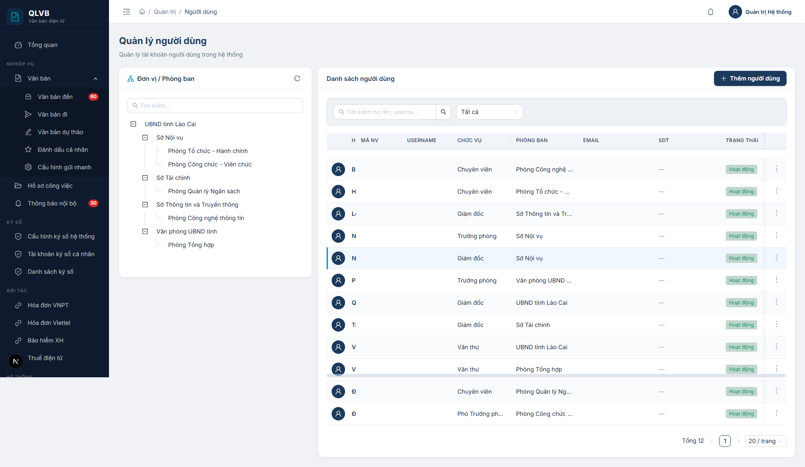
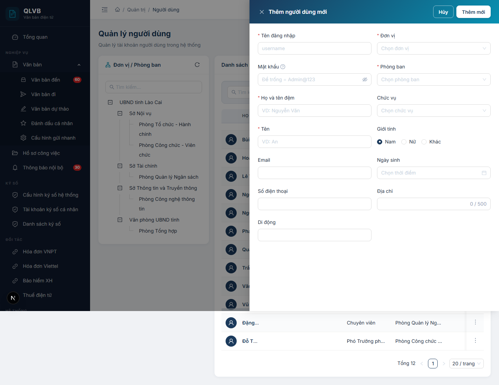
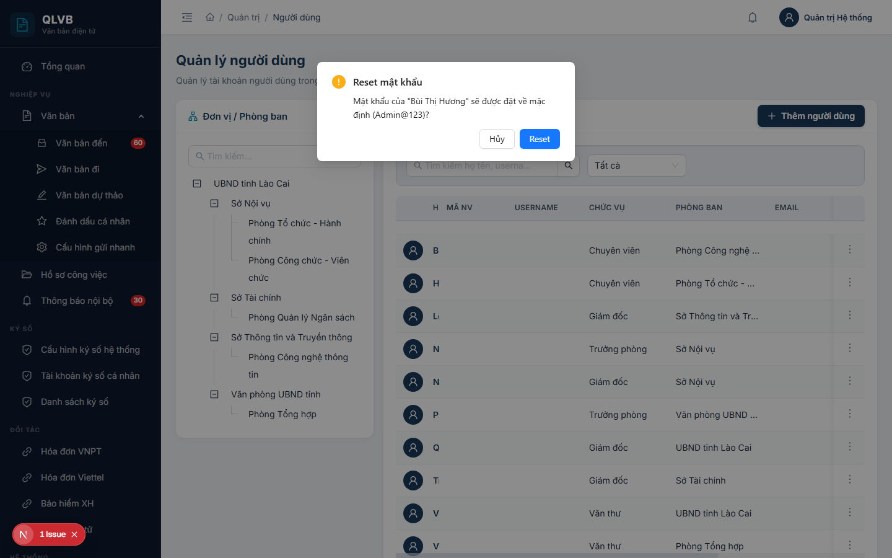

# Quản trị người dùng

## Giới thiệu

Module Quản trị người dùng là nơi quản trị viên tạo và quản lý toàn bộ tài khoản đăng nhập hệ thống — từ chuyên viên xử lý văn bản, văn thư, lãnh đạo đến quản trị viên. Mỗi người dùng được gán: đơn vị, phòng ban, chức vụ, nhóm quyền và trạng thái hoạt động.

Truy cập: menu **Quản trị → Người dùng**.

Đối tượng sử dụng: quản trị viên hệ thống.

## Quy trình thao tác và ràng buộc nghiệp vụ

Quy trình chuẩn khi tạo người dùng mới:

1. Đảm bảo đơn vị, phòng ban, chức vụ và nhóm quyền cần thiết đã có trong hệ thống.
2. Vào màn hình Quản trị → Người dùng, chọn đơn vị/phòng ban từ cây trái (giúp hệ thống tự gán đơn vị, phòng ban cho người dùng mới).
3. Bấm **Thêm người dùng**, điền thông tin tài khoản (username, mật khẩu, họ tên, email, SDT, đơn vị, phòng ban, chức vụ).
4. Sau khi tạo xong, vào menu ba chấm chọn **Phân quyền** để gán nhóm quyền cho người dùng.
5. Khi tài khoản nghỉ việc tạm thời: dùng **Khóa tài khoản**. Khi mất mật khẩu: dùng **Reset mật khẩu** đưa về mặc định.

Ràng buộc nghiệp vụ:

- **Tên đăng nhập** phải duy nhất, từ 3 ký tự trở lên, chỉ chứa chữ cái, số, dấu chấm, gạch ngang. Sau khi tạo không thể đổi.
- **Mật khẩu** tối thiểu 6 ký tự, phải chứa chữ hoa, chữ thường và số. Nếu để trống khi tạo mới, hệ thống đặt mặc định **Admin@123**.
- **Email** phải đúng định dạng và duy nhất trong hệ thống.
- **Số điện thoại** và **Số di động** phải có 8–15 ký tự (số, dấu cộng/trừ, ngoặc đơn).
- **Đơn vị** và **Phòng ban** là bắt buộc — phòng ban được lọc theo đơn vị đã chọn.
- **Họ và tên đệm** + **Tên** là bắt buộc.
- Khi tài khoản bị **Khóa**, người dùng không thể đăng nhập nhưng vẫn còn dữ liệu lịch sử.
- **Reset mật khẩu** đưa mật khẩu về **Admin@123** (theo cấu hình hệ thống).
- Quản trị viên không nên xóa tài khoản đã từng xử lý văn bản — nên Khóa thay vì Xóa để giữ lịch sử.

## Các màn hình chức năng

### Màn hình danh sách người dùng

#### Bố cục màn hình

Màn hình chia hai phần:

- **Bên trái** — Cây Đơn vị / Phòng ban: hiển thị toàn bộ cây cơ cấu, có ô tìm kiếm theo tên và nút Tải lại. Click vào nút bất kỳ sẽ lọc danh sách bên phải.
- **Bên phải** — Bảng danh sách người dùng: gồm thanh lọc (tìm kiếm + chọn trạng thái) và bảng dữ liệu có phân trang.

Trên cùng là tiêu đề trang **Quản lý người dùng** kèm dòng mô tả ngắn.

#### Các nút chức năng

| Nút | Vị trí | Khi nào hiển thị | Tác dụng |
|---|---|---|---|
| Tải lại | Góc phải card cây trái | Luôn hiển thị | Tải lại cây đơn vị/phòng ban |
| Tìm kiếm | Thanh lọc trong card phải | Luôn hiển thị | Lọc theo họ tên, username, gõ Enter để tìm |
| Lọc theo trạng thái | Thanh lọc, bên phải ô tìm kiếm | Luôn hiển thị | Tất cả / Hoạt động / Đã khóa |
| Thêm người dùng | Header card phải, góc phải | Luôn hiển thị | Mở Drawer thêm người dùng mới |
| Sửa thông tin | Trong menu ba chấm cuối mỗi dòng | Mọi dòng | Mở Drawer chỉnh sửa thông tin người dùng |
| Phân quyền | Trong menu ba chấm cuối mỗi dòng | Mọi dòng | Mở Drawer chọn nhóm quyền cho người dùng |
| Khóa tài khoản | Trong menu ba chấm cuối mỗi dòng | Khi tài khoản đang Hoạt động | Khóa tài khoản |
| Mở khóa tài khoản | Trong menu ba chấm cuối mỗi dòng | Khi tài khoản Đã khóa | Mở khóa tài khoản |
| Reset mật khẩu | Trong menu ba chấm cuối mỗi dòng | Mọi dòng | Mở hộp xác nhận đặt lại mật khẩu về mặc định |
| Xóa người dùng | Trong menu ba chấm cuối mỗi dòng | Mọi dòng | Mở hộp xác nhận xóa người dùng |

#### Các cột / trường dữ liệu

| Cột | Ý nghĩa |
|---|---|
| Ảnh | Avatar người dùng (icon mặc định nếu chưa có ảnh) |
| Họ tên | Họ và tên đầy đủ, in đậm màu xanh navy |
| Mã NV | Mã nhân viên do hệ thống tự sinh |
| Username | Tên đăng nhập |
| Chức vụ | Tên chức vụ hiện tại |
| Phòng ban | Tên phòng ban đang thuộc về |
| Email | Email liên hệ |
| SDT | Hiển thị 2 dòng — số điện thoại bàn ở dòng trên (đậm), số di động ở dòng dưới (xám nhỏ). Nếu cả hai trống, hiển thị dấu gạch — |
| Trạng thái | Hoạt động (xanh) / Đã khóa (đỏ) |

#### Thông báo của hệ thống

| Tình huống | Thông báo |
|---|---|
| Tải cây không thành công | Lỗi tải cây đơn vị |
| Tải bảng không thành công | Lỗi tải dữ liệu |
| Khóa thành công | Đã khóa |
| Mở khóa thành công | Đã mở khóa |

### Màn hình Thêm người dùng mới

Mở khi nhấn nút **Thêm người dùng**. Drawer trượt từ phải vào, tiêu đề **Thêm người dùng mới**, nền gradient xanh navy.

#### Bố cục màn hình

Drawer rộng 720px, chia làm 2 cột:

**Cột trái** (7 trường, hiển thị thông tin tài khoản và liên hệ):

1. Tên đăng nhập.
2. Mật khẩu (chỉ có khi thêm mới).
3. Họ và tên đệm.
4. Tên.
5. Email.
6. Số điện thoại.
7. Di động.

**Cột phải** (6 trường, hiển thị thông tin tổ chức và cá nhân):

1. Đơn vị.
2. Phòng ban.
3. Chức vụ.
4. Giới tính (Radio: Nam / Nữ / Khác).
5. Ngày sinh.
6. Địa chỉ.

Nếu trước khi mở Drawer đã chọn 1 phòng ban trong cây trái, hệ thống tự gán Đơn vị + Phòng ban tương ứng.

#### Các nút chức năng

| Nút | Vị trí | Khi nào hiển thị | Tác dụng |
|---|---|---|---|
| Hủy | Header drawer (góc phải trên) | Luôn hiển thị | Đóng drawer, không lưu thay đổi |
| Thêm mới | Header drawer (góc phải trên) | Luôn hiển thị | Lưu người dùng mới, đóng drawer khi thành công |

#### Các cột / trường dữ liệu

| Trường | Bắt buộc | Ý nghĩa |
|---|---|---|
| Tên đăng nhập | Có | Tối thiểu 3, tối đa 50 ký tự. Chỉ chứa chữ cái, số, dấu chấm, gạch ngang. Phải duy nhất |
| Mật khẩu | Không | Tối thiểu 6 ký tự, phải có chữ hoa, chữ thường, số. Để trống = Admin@123 |
| Họ và tên đệm | Có | Tối đa 50 ký tự, ví dụ "Nguyễn Văn" |
| Tên | Có | Tối đa 50 ký tự, ví dụ "An" |
| Email | Không | Phải đúng định dạng. Nếu nhập, không được trùng với người dùng khác |
| Số điện thoại | Không | 8–15 ký tự gồm số, dấu +, -, khoảng trắng, ngoặc đơn |
| Di động | Không | Tương tự Số điện thoại |
| Đơn vị | Có | Chọn từ cây đơn vị (TreeSelect) |
| Phòng ban | Có | Chọn từ Select. Danh sách lọc theo Đơn vị đã chọn — đổi Đơn vị sẽ xóa giá trị Phòng ban |
| Chức vụ | Không | Chọn từ Select danh sách chức vụ đang hoạt động |
| Giới tính | Không | Mặc định Nam |
| Ngày sinh | Không | Định dạng ngày/tháng/năm |
| Địa chỉ | Không | Tối đa 500 ký tự, hiển thị bộ đếm ký tự |

#### Thông báo của hệ thống

| Tình huống | Thông báo |
|---|---|
| Bỏ trống Tên đăng nhập | Nhập tên đăng nhập |
| Tên đăng nhập dưới 3 ký tự | Tối thiểu 3 ký tự |
| Tên đăng nhập sai định dạng (frontend) | Chỉ chứa chữ cái, số, dấu chấm, gạch ngang |
| Tên đăng nhập sai định dạng (server) | Tên đăng nhập chỉ chứa chữ cái, số, dấu chấm, gạch ngang |
| Tên đăng nhập dưới 3 ký tự (server) | Tên đăng nhập phải có ít nhất 3 ký tự |
| Tên đăng nhập đã tồn tại | Tên đăng nhập đã tồn tại (inline ở trường) |
| Mật khẩu dưới 6 ký tự | Tối thiểu 6 ký tự |
| Mật khẩu thiếu hoa/thường/số | Phải chứa chữ hoa, chữ thường và số |
| Mật khẩu sai (server) | Mật khẩu phải có ít nhất 6 ký tự, chứa chữ hoa, chữ thường và số |
| Bỏ trống Họ và tên đệm | Nhập họ và tên đệm |
| Bỏ trống Tên | Nhập tên |
| Họ tên rỗng (server) | Họ và tên là bắt buộc |
| Email sai định dạng (frontend) | Email không hợp lệ |
| Email sai định dạng (server) | Email không đúng định dạng |
| Email trùng | Email đã được sử dụng (inline ở trường Email) |
| SDT sai định dạng (frontend) | Số điện thoại không đúng định dạng |
| SDT sai định dạng (server) | Số điện thoại không đúng định dạng |
| Di động sai định dạng | Số di động không đúng định dạng |
| Bỏ trống Đơn vị | Chọn đơn vị |
| Bỏ trống Phòng ban | Chọn phòng ban |
| Đơn vị/Phòng ban rỗng (server) | Đơn vị và phòng ban là bắt buộc |
| Lưu thành công | Thêm thành công |

### Màn hình Sửa người dùng

Mở khi chọn **Sửa thông tin** trong menu ba chấm. Tiêu đề **Sửa người dùng — <Mã NV>**.

#### Bố cục màn hình

Bố cục giống Drawer Thêm với hai khác biệt:

- Trường **Tên đăng nhập** bị khóa, không cho chỉnh sửa.
- Không có trường **Mật khẩu** (mật khẩu được đổi qua chức năng Reset mật khẩu hoặc người dùng tự đổi).

Toàn bộ trường còn lại được tải sẵn dữ liệu hiện tại — hệ thống gọi API chi tiết để lấy đủ thông tin (username, họ tên, email, SDT, di động, giới tính, ngày sinh, địa chỉ, đơn vị, phòng ban, chức vụ).

#### Các nút chức năng

| Nút | Vị trí | Khi nào hiển thị | Tác dụng |
|---|---|---|---|
| Hủy | Header drawer (góc phải trên) | Luôn hiển thị | Đóng drawer, không lưu thay đổi |
| Cập nhật | Header drawer (góc phải trên) | Luôn hiển thị | Lưu thay đổi, đóng drawer khi thành công |

#### Thông báo của hệ thống

| Tình huống | Thông báo |
|---|---|
| Tải chi tiết không thành công | Lỗi tải chi tiết người dùng |
| Cập nhật thành công | Cập nhật thành công |
| Email trùng người khác | Email đã được sử dụng |

Các thông báo còn lại giống Drawer Thêm.

### Màn hình Phân quyền cho người dùng

Mở khi chọn **Phân quyền** trong menu ba chấm. Tiêu đề **Phân quyền: <Họ tên>**.

#### Bố cục màn hình

Drawer rộng 480px, gồm:

- Dòng mô tả ngắn cho biết đang phân quyền cho ai (họ tên + username).
- Danh sách các nhóm quyền hiển thị dưới dạng card — mỗi card có 1 ô checkbox + tên nhóm + mô tả ngắn.
- Khi click vào card hoặc vào checkbox, nhóm quyền được chọn/bỏ chọn — card đổi màu nền và viền sang xanh teal khi được chọn.

#### Các nút chức năng

| Nút | Vị trí | Khi nào hiển thị | Tác dụng |
|---|---|---|---|
| Lưu | Header drawer (góc phải trên) | Luôn hiển thị | Lưu danh sách nhóm quyền đã chọn |

#### Các cột / trường dữ liệu

| Trường | Ý nghĩa |
|---|---|
| Tên nhóm quyền | Tên nhóm, in đậm màu xanh navy |
| Mô tả | Dòng giải thích ngắn về nhóm quyền (nếu có) |
| Trạng thái chọn | Card được chọn có nền xanh nhạt, viền xanh teal |

Hệ thống tự lưu lại danh sách nhóm quyền hiện tại của người dùng khi mở Drawer, người dùng chỉ cần tích/bỏ tích và nhấn Lưu.

#### Thông báo của hệ thống

| Tình huống | Thông báo |
|---|---|
| Tải dữ liệu không thành công | Lỗi tải nhóm quyền |
| Lưu thành công | Lưu phân quyền thành công |
| Lưu không thành công | Lỗi lưu phân quyền |

### Hộp xác nhận Reset mật khẩu

Hiển thị khi chọn **Reset mật khẩu** trong menu ba chấm.

#### Bố cục màn hình

Modal nhỏ nằm giữa màn hình:

- Tiêu đề: **Reset mật khẩu**.
- Nội dung: dòng văn bản hỏi xác nhận, có nêu rõ tên người dùng và mật khẩu mặc định sau khi reset.
- Hai nút ở chân: **Hủy** và **Reset**.

#### Các nút chức năng

| Nút | Vị trí | Khi nào hiển thị | Tác dụng |
|---|---|---|---|
| Hủy | Chân modal, bên trái | Luôn hiển thị | Đóng modal, không reset |
| Reset | Chân modal, bên phải | Luôn hiển thị | Đặt lại mật khẩu về mặc định Admin@123 |

#### Thông báo của hệ thống

| Tình huống | Thông báo |
|---|---|
| Nội dung modal | Mật khẩu của "<Họ tên>" sẽ được đặt về mặc định (Admin@123)? |
| Reset thành công | Đã reset mật khẩu |
| Reset không thành công | Lỗi reset mật khẩu |

### Hộp xác nhận xóa người dùng

Hiển thị khi chọn **Xóa người dùng** trong menu ba chấm.

#### Bố cục màn hình

Modal nhỏ nằm giữa màn hình:

- Tiêu đề: **Xác nhận xóa**.
- Nội dung: dòng văn bản hỏi xác nhận có nêu rõ họ tên người dùng.
- Hai nút ở chân: **Hủy** và **Xóa** (nút Xóa màu đỏ).

#### Các nút chức năng

| Nút | Vị trí | Khi nào hiển thị | Tác dụng |
|---|---|---|---|
| Hủy | Chân modal, bên trái | Luôn hiển thị | Đóng modal, không xóa |
| Xóa | Chân modal, bên phải | Luôn hiển thị | Gọi API xóa người dùng |

#### Thông báo của hệ thống

| Tình huống | Thông báo |
|---|---|
| Nội dung modal | Bạn có chắc chắn muốn xóa "<Họ tên>"? |
| Xóa thành công | Xóa thành công |
| Xóa không thành công | Lỗi khi xóa |
