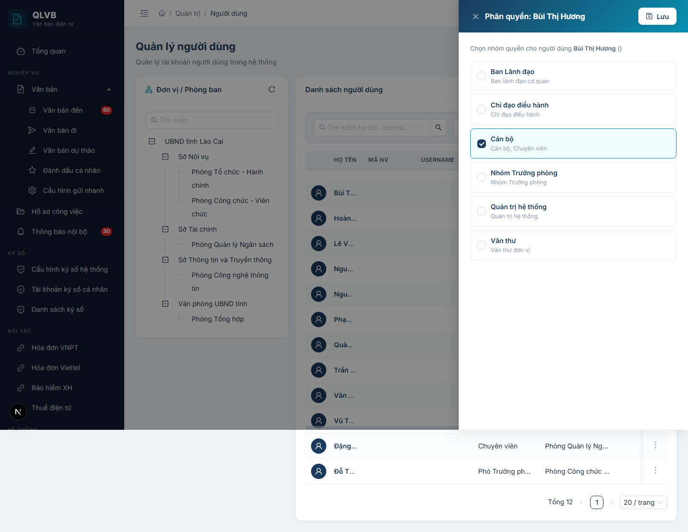
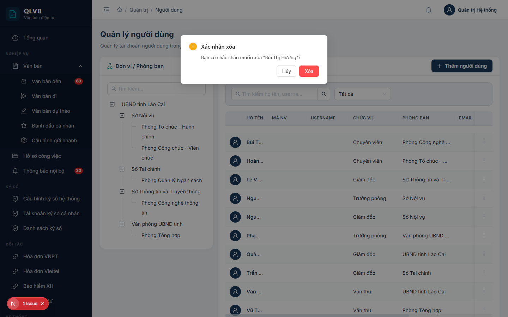

# Hướng dẫn sử dụng: Màn hình Quản trị > Người dùng

Tài liệu này mô tả đầy đủ các chức năng có trong màn hình **Quản trị > Người dùng** của hệ thống Quản lý văn bản điện tử (e-Office), giúp người dùng hiểu rõ cách sử dụng và quy trình nghiệp vụ.

---

## 1. Giới thiệu

Màn hình **Quản trị > Người dùng** dùng để quản lý toàn bộ tài khoản truy cập hệ thống e-Office: cán bộ, công chức, viên chức của các đơn vị / phòng ban. Đây là màn hình **quan trọng nhất phần Quản trị** vì nó quyết định **ai được vào hệ thống**, **vào với danh nghĩa nào**, **làm việc trong đơn vị nào** và **được phép làm gì** thông qua các nhóm quyền đã gán.

Vì là dữ liệu nhạy cảm liên quan tới tài khoản và mật khẩu nên màn hình này **chỉ dành cho tài khoản Quản trị hệ thống**. Người dùng thông thường không truy cập được vào đây.

Mỗi thay đổi trên màn hình này đều ảnh hưởng đến phiên đăng nhập, phân quyền, định tuyến văn bản và các luồng nghiệp vụ liên quan tới người dùng đó. Cần thao tác cẩn thận, đặc biệt ở các chức năng **Khóa tài khoản**, **Reset mật khẩu**, **Phân quyền** và **Xóa người dùng**.

---

## 2. Bố cục màn hình

Màn hình được chia thành 2 cột chính cùng phần đầu trang:

- **Phần đầu trang**: Hiển thị tiêu đề "Quản lý người dùng" và dòng mô tả ngắn "Quản lý tài khoản người dùng trong hệ thống".
- **Cột trái — Đơn vị / Phòng ban (cây phân cấp)**:
  - Ô tìm kiếm nhanh ở phía trên cây.
  - Cây phân cấp đơn vị / phòng ban (mặc định mở rộng tất cả các nhánh).
  - Nút **Tải lại** (biểu tượng mũi tên xoay tròn) ở góc trên bên phải để tải lại cây sau khi có thay đổi.
  - Bấm vào một nhánh trên cây sẽ lọc bảng bên phải chỉ hiển thị các người dùng thuộc nhánh đó.
- **Cột phải — Danh sách người dùng**:
  - Thanh lọc nhanh: ô tìm kiếm theo họ tên / username + bộ lọc trạng thái (Tất cả / Hoạt động / Đã khóa).
  - Bảng dữ liệu hiển thị các người dùng tương ứng với nhánh đã chọn (mặc định hiển thị toàn bộ).
  - Nút **Thêm người dùng** (biểu tượng dấu cộng, màu xanh) ở góc trên bên phải bảng để mở cửa sổ thêm mới.
  - Mỗi dòng có nút thao tác hình **ba chấm dọc** ở cột cuối cùng, chứa các lệnh: Sửa thông tin, Phân quyền, Khóa / Mở khóa tài khoản, Reset mật khẩu, Xóa người dùng.
  - Phía dưới bảng có thanh phân trang (mặc định 20 bản ghi / trang).
- **Cửa sổ phụ (Drawer / Modal)**:
  - **Drawer Thêm người dùng / Sửa người dùng** — mở ra từ bên phải khi bấm Thêm hoặc Sửa.
  - **Drawer Phân quyền** — mở ra từ bên phải khi bấm Phân quyền, hiển thị danh sách nhóm quyền có thể gán.
  - **Hộp xác nhận Reset mật khẩu** và **Hộp xác nhận xóa** — mở khi bấm chức năng tương ứng, yêu cầu xác nhận trước khi thực hiện.

---

## 3. Các cột trong Bảng danh sách người dùng

| Tên cột | Mô tả |
|---|---|
| **Ảnh đại diện** | Hiển thị ảnh đại diện (avatar) của người dùng. Nếu chưa có ảnh, hệ thống hiển thị biểu tượng người trên nền xanh navy. |
| **Họ tên** | Họ và tên đầy đủ của người dùng (hệ thống tự ghép từ "Họ và tên đệm" + "Tên"), in đậm, màu xanh navy. |
| **Mã NV** | Mã nhân viên do hệ thống tự sinh khi tạo mới (định dạng `NVxxxxxx`). In đậm, màu xanh navy. |
| **Username** | Tên đăng nhập dùng để vào hệ thống. Luôn ở dạng chữ thường, không có khoảng trắng. |
| **Chức vụ** | Tên chức vụ hiện tại của người dùng (lấy từ danh mục Chức vụ). Có thể trống nếu chưa gán. |
| **Phòng ban** | Tên phòng ban (hoặc đơn vị) trực tiếp của người dùng. |
| **Email** | Địa chỉ email công vụ. Nếu dài sẽ tự động cắt và hiện tooltip khi rê chuột. |
| **SDT** | Số điện thoại liên hệ. Nếu để trống số bàn, hệ thống tự lấy số di động hiển thị. |
| **Trạng thái** | **Hoạt động** (nhãn xanh lá) hoặc **Đã khóa** (nhãn đỏ). Tài khoản bị khóa sẽ không thể đăng nhập hệ thống. |
| (cột thao tác) | Nút ba chấm dọc, mở menu các lệnh: Sửa thông tin, Phân quyền, Khóa / Mở khóa tài khoản, Reset mật khẩu, Xóa người dùng. |

---

## 4. Các trường nhập liệu trong cửa sổ Thêm / Sửa người dùng

Khi bấm **Thêm người dùng** hoặc **Sửa thông tin**, hệ thống mở cửa sổ phía bên phải màn hình, được chia thành 2 cột thông tin.

### 4.1. Cột trái — Thông tin tài khoản và cá nhân

| Tên trường | Bắt buộc | Mô tả & ràng buộc |
|---|---|---|
| **Tên đăng nhập** | Có | Tên dùng để đăng nhập vào hệ thống. Tối thiểu 3 ký tự, tối đa 50 ký tự. **Chỉ chấp nhận chữ cái, số, dấu chấm `.`, gạch dưới `_`, gạch ngang `-`** — không có khoảng trắng, không có dấu tiếng Việt. Hệ thống sẽ tự chuyển về chữ thường. **Phải duy nhất trong toàn hệ thống** — nếu trùng báo "Tên đăng nhập đã tồn tại". Trường này **không sửa được sau khi đã tạo** (bị mờ đi khi sửa). |
| **Mật khẩu** | Không (chỉ hiện khi tạo mới) | Mật khẩu khởi tạo cho tài khoản. Tối thiểu 6 ký tự, **phải chứa cả chữ hoa, chữ thường và số**. Tối đa 50 ký tự. Nếu để trống, hệ thống dùng mật khẩu mặc định **`Admin@123`**. Người dùng sẽ được yêu cầu đổi mật khẩu trong lần đăng nhập đầu tiên. Trường này **không hiển thị trong cửa sổ Sửa** — muốn đặt lại mật khẩu phải dùng chức năng "Reset mật khẩu" ở menu ba chấm. |
| **Họ và tên đệm** | Có | Phần Họ và Tên đệm (ví dụ: `Nguyễn Văn`). Tối đa 50 ký tự. Để trống sẽ báo "Họ và tên là bắt buộc". |
| **Tên** | Có | Phần Tên (ví dụ: `An`). Tối đa 50 ký tự. Hệ thống tự ghép thành "Họ tên đầy đủ" để hiển thị trên bảng. Để trống sẽ báo "Họ và tên là bắt buộc". |
| **Email** | Không | Email công vụ. Tối đa 100 ký tự. Phải đúng định dạng email (có `@` và phần đuôi tên miền). Sai định dạng báo "Email không đúng định dạng". **Phải duy nhất trong toàn hệ thống** — nếu trùng (kể cả khác chữ hoa / chữ thường) sẽ báo "Email đã được sử dụng". |
| **Số điện thoại** | Không | Số điện thoại bàn / cơ quan. Tối đa 20 ký tự. Chấp nhận chữ số, dấu cộng `+`, dấu trừ `-`, khoảng trắng và ngoặc tròn `(`, `)`. Độ dài hợp lệ từ 8 đến 15 ký tự. Sai định dạng báo "Số điện thoại không đúng định dạng". |
| **Di động** | Không | Số điện thoại di động. Tối đa 20 ký tự. Quy tắc định dạng giống Số điện thoại. Sai định dạng báo "Số di động không đúng định dạng". |

### 4.2. Cột phải — Tổ chức và thông tin cá nhân

| Tên trường | Bắt buộc | Mô tả & ràng buộc |
|---|---|---|
| **Đơn vị** | Có | Đơn vị (cấp Sở / Ban / Ngành) mà người dùng trực thuộc. Ô chọn dạng cây phân cấp, có nút xóa nhanh. Khi chọn đơn vị, danh sách "Phòng ban" bên dưới sẽ tự động cập nhật. Khi đang chọn một nhánh trên cây bên trái rồi mới bấm Thêm, ô này sẽ được điền sẵn nhánh đang chọn. Để trống báo "Đơn vị và phòng ban là bắt buộc". |
| **Phòng ban** | Có | Phòng ban trực tiếp trong đơn vị đã chọn. Chỉ có thể chọn sau khi đã chọn Đơn vị. Khi đổi Đơn vị, ô này sẽ tự xóa giá trị cũ. Để trống báo "Đơn vị và phòng ban là bắt buộc". |
| **Chức vụ** | Không | Chức vụ chính thức của người dùng (lấy từ danh mục Chức vụ). |
| **Giới tính** | Không (mặc định: Nam) | Chọn một trong ba: **Nam** / **Nữ** / **Khác**. |
| **Ngày sinh** | Không | Ngày sinh của người dùng, định dạng `DD/MM/YYYY`. |
| **Địa chỉ** | Không | Địa chỉ liên hệ. Không giới hạn cứng nhưng khuyến nghị tối đa 500 ký tự (có hiển thị bộ đếm ký tự). |

> **Lưu ý**: Sau khi điền xong, bấm **Thêm mới** (khi tạo) hoặc **Cập nhật** (khi sửa) ở góc trên bên phải cửa sổ. Các thông báo sai định dạng sẽ hiển thị ngay dưới ô nhập tương ứng để dễ phát hiện và sửa.

### 4.3. Cửa sổ Phân quyền

Cửa sổ này không có trường nhập tự do mà gồm danh sách thẻ chọn (checkbox card):

| Mục | Mô tả |
|---|---|
| **Tiêu đề** | "Phân quyền: <Họ tên người dùng>". |
| **Dòng mô tả** | "Chọn nhóm quyền cho người dùng <Họ tên> (<username>)". |
| **Danh sách nhóm quyền** | Mỗi nhóm quyền hiển thị thành 1 thẻ vuông gồm tên nhóm (in đậm) và mô tả (chữ xám). Bấm vào thẻ hoặc tích vào ô vuông để chọn / bỏ chọn. Thẻ được chọn có viền và nền xanh teal nhạt. Một người dùng có thể được gán **nhiều nhóm quyền cùng lúc**. |

---

## 5. Các nút chức năng

| Nút | Vị trí | Khi nào hiển thị | Tác dụng |
|---|---|---|---|
| **Thêm người dùng** | Góc trên bên phải bảng danh sách | Luôn hiển thị | Mở cửa sổ Thêm người dùng. Nếu đang chọn một nhánh trên cây, đơn vị / phòng ban tương ứng sẽ được điền sẵn vào form. |
| **Tải lại** (biểu tượng mũi tên xoay tròn) | Góc trên bên phải khung "Đơn vị / Phòng ban" | Luôn hiển thị | Tải lại toàn bộ cây đơn vị từ máy chủ. Dùng khi nghi ngờ dữ liệu không đồng bộ. |
| **Ô tìm kiếm "Tìm kiếm..."** trong cây | Phía trên cây phân cấp | Luôn hiển thị | Lọc các nhánh trên cây theo từ khóa nhập. Có nút xóa nhanh. |
| **Ô tìm kiếm "Tìm kiếm họ tên, username..."** | Phía trên bảng | Luôn hiển thị | Tìm theo họ tên đầy đủ, tên đăng nhập, email hoặc mã nhân viên. Bấm Enter hoặc biểu tượng kính lúp để tìm. |
| **Bộ lọc trạng thái** | Cạnh ô tìm kiếm | Luôn hiển thị | Lọc theo trạng thái tài khoản: Tất cả / Hoạt động / Đã khóa. |
| **Sửa thông tin** | Trong menu ba chấm trên mỗi dòng | Luôn hiển thị | Mở cửa sổ Sửa người dùng với dữ liệu sẵn có. Tên đăng nhập và Mật khẩu **không sửa được** ở đây. |
| **Phân quyền** | Trong menu ba chấm trên mỗi dòng | Luôn hiển thị | Mở cửa sổ Phân quyền để gán / bỏ gán các nhóm quyền cho người dùng. |
| **Khóa tài khoản** | Trong menu ba chấm trên mỗi dòng | Khi tài khoản đang ở trạng thái **Hoạt động** | Khóa tài khoản — người dùng không thể đăng nhập cho tới khi mở khóa lại. |
| **Mở khóa tài khoản** | Trong menu ba chấm trên mỗi dòng | Khi tài khoản đang ở trạng thái **Đã khóa** | Mở khóa tài khoản, đưa về trạng thái **Hoạt động**. |
| **Reset mật khẩu** | Trong menu ba chấm trên mỗi dòng | Luôn hiển thị | Mở hộp xác nhận, sau đó đặt lại mật khẩu của người dùng về **`Admin@123`**. Người dùng phải đổi mật khẩu trong lần đăng nhập tiếp theo. |
| **Xóa người dùng** | Trong menu ba chấm trên mỗi dòng (mục cuối, màu đỏ) | Luôn hiển thị | Mở hộp xác nhận, sau đó xóa người dùng (xóa mềm — xem mục 7). |
| **Thêm mới** / **Cập nhật** | Góc trên bên phải cửa sổ Thêm/Sửa | Trong cửa sổ Thêm/Sửa | Lưu dữ liệu vừa nhập. Nhãn nút thay đổi tùy theo đang Thêm mới hay Cập nhật. |
| **Hủy** | Góc trên bên phải cửa sổ Thêm/Sửa | Trong cửa sổ Thêm/Sửa | Đóng cửa sổ, không lưu thay đổi. |
| **Lưu** | Góc trên bên phải cửa sổ Phân quyền | Trong cửa sổ Phân quyền | Lưu danh sách nhóm quyền đã chọn cho người dùng. |
| **Reset** / **Hủy** trong hộp Reset mật khẩu | Trong hộp xác nhận | Khi mở hộp xác nhận | **Reset** — xác nhận đặt lại mật khẩu. **Hủy** — đóng hộp, không thực hiện. |
| **Xóa** / **Hủy** trong hộp Xác nhận xóa | Trong hộp xác nhận | Khi mở hộp xác nhận | **Xóa** (màu đỏ) — thực hiện xóa. **Hủy** — đóng hộp, không xóa. |

---

## 6. Quy trình thao tác chính

### 6.1. Thêm mới một người dùng

1. (Tùy chọn) Trên cây bên trái, bấm chọn nhánh đơn vị / phòng ban muốn thêm người dùng vào — khi đó ô "Đơn vị" và "Phòng ban" trong cửa sổ thêm sẽ được điền sẵn.
2. Bấm nút **Thêm người dùng** ở góc trên bên phải bảng.
3. Trong cửa sổ Thêm người dùng, điền đầy đủ thông tin **Tên đăng nhập**, **Họ và tên đệm**, **Tên**, **Đơn vị** và **Phòng ban** (các trường bắt buộc).
4. (Tùy chọn) Nhập **Mật khẩu** khởi tạo. Nếu để trống, hệ thống sẽ dùng mặc định `Admin@123`.
5. Điền các thông tin còn lại (Email, SDT, Chức vụ, Giới tính, Ngày sinh, Địa chỉ) tùy nhu cầu.
6. Bấm **Thêm mới**.
7. Hệ thống thông báo **"Thêm thành công"** và đóng cửa sổ. Bảng bên phải tự động cập nhật.

> Sau khi tạo xong, để gán quyền cho người dùng, vào menu ba chấm → **Phân quyền** (xem mục 6.5).

### 6.2. Chỉnh sửa thông tin một người dùng

1. Tìm người dùng cần sửa trên bảng (có thể chọn nhánh trên cây hoặc dùng ô tìm kiếm).
2. Trên dòng tương ứng, bấm biểu tượng **ba chấm dọc** ở cột cuối → chọn **Sửa thông tin**.
3. Cửa sổ **Sửa người dùng** mở ra với dữ liệu sẵn có. Tiêu đề có dạng "Sửa người dùng — <Mã NV>".
4. Sửa các thông tin cần thiết. Lưu ý: **Tên đăng nhập** không sửa được, **Mật khẩu** không hiện ở cửa sổ này.
5. Bấm **Cập nhật**.
6. Hệ thống thông báo **"Cập nhật thành công"** và đóng cửa sổ.

> Đổi **Đơn vị** sẽ làm rỗng ô **Phòng ban** — phải chọn lại Phòng ban mới trước khi lưu.

### 6.3. Khóa / Mở khóa tài khoản

1. Tìm người dùng cần khóa hoặc mở khóa.
2. Bấm biểu tượng **ba chấm dọc** ở cột cuối.
3. Bấm **Khóa tài khoản** (nếu đang Hoạt động) hoặc **Mở khóa tài khoản** (nếu đang Đã khóa).
4. Hệ thống thông báo **"Đã khóa"** hoặc **"Đã mở khóa"** tương ứng. Cột **Trạng thái** trên bảng cập nhật ngay.

> **Khóa tài khoản** ngăn người dùng đăng nhập nhưng giữ nguyên toàn bộ dữ liệu lịch sử (văn bản đã xử lý, hồ sơ đã ký...). Dùng khi cán bộ nghỉ việc, nghỉ thai sản, đi học dài hạn — hoặc khi nghi ngờ tài khoản bị lộ thông tin đăng nhập.

### 6.4. Đặt lại (Reset) mật khẩu

1. Tìm người dùng cần đặt lại mật khẩu.
2. Bấm biểu tượng **ba chấm dọc** ở cột cuối → chọn **Reset mật khẩu**.
3. Hộp xác nhận hiện ra với câu hỏi *"Mật khẩu của "<Họ tên>" sẽ được đặt về mặc định (Admin@123)?"*.
4. Bấm **Reset** để xác nhận, hoặc **Hủy** để bỏ qua.
5. Hệ thống thông báo **"Đã reset mật khẩu"**. Người dùng phải dùng mật khẩu **`Admin@123`** để đăng nhập và sẽ được yêu cầu đổi mật khẩu mới ngay sau đó.

> Chức năng này dùng khi người dùng quên mật khẩu hoặc tài khoản nghi ngờ bị xâm nhập. **Quản trị viên không xem được mật khẩu cũ** — hệ thống chỉ cho phép đặt lại về giá trị mặc định.

### 6.5. Phân quyền cho người dùng

1. Tìm người dùng cần phân quyền.
2. Bấm biểu tượng **ba chấm dọc** ở cột cuối → chọn **Phân quyền**.
3. Cửa sổ **Phân quyền** mở ra hiển thị tất cả các nhóm quyền có trong hệ thống.
4. Tích chọn các nhóm quyền muốn gán cho người dùng (có thể chọn nhiều nhóm cùng lúc). Bấm vào thẻ hoặc ô vuông trong thẻ.
5. Bấm nút **Lưu** ở góc trên bên phải.
6. Hệ thống thông báo **"Lưu phân quyền thành công"** và đóng cửa sổ.

> Việc gán nhóm quyền quyết định người dùng được vào những menu nào, làm được những thao tác nghiệp vụ gì (gửi văn bản đến, ký số, lập sổ, duyệt ngân sách...). Cần làm theo đúng quy chế phân quyền của cơ quan.

### 6.6. Xóa người dùng

1. Tìm người dùng cần xóa.
2. Bấm biểu tượng **ba chấm dọc** ở cột cuối → chọn **Xóa người dùng** (mục cuối, màu đỏ).
3. Hộp xác nhận hiện ra với câu hỏi *"Bạn có chắc chắn muốn xóa "<Họ tên>"?"*.

   
4. Bấm **Xóa** (màu đỏ) để xác nhận, hoặc **Hủy** để bỏ qua.
5. Nếu xóa được, hệ thống thông báo **"Xóa thành công"**.

> **Quan trọng**: Hệ thống thực hiện **xóa mềm** — tài khoản không bị xóa hẳn khỏi cơ sở dữ liệu mà được đánh dấu là đã xóa. Người dùng không còn truy cập được hệ thống và không hiển thị trong các danh sách nghiệp vụ. Tuy nhiên, dữ liệu lịch sử (văn bản đã ký, đã xử lý) vẫn được giữ nguyên để tra cứu / kiểm toán.

---

## 7. Lưu ý / Ràng buộc nghiệp vụ

### 7.1. Tên đăng nhập là khóa duy nhất, không sửa được sau khi tạo

Mỗi tên đăng nhập chỉ tồn tại đúng **một lần** trong toàn hệ thống (so sánh **không phân biệt chữ hoa / chữ thường**). Khi tạo trùng, hệ thống báo:

> *"Tên đăng nhập đã tồn tại"*

Sau khi đã tạo, ô **Tên đăng nhập** trong cửa sổ Sửa sẽ bị mờ đi — không thể sửa lại được. Lý do: tên đăng nhập gắn với toàn bộ phiên đăng nhập, lịch sử thao tác và các bản ghi liên quan, nếu đổi sẽ phá vỡ tính toàn vẹn dữ liệu. Nếu cần đổi, phải tạo tài khoản mới và xóa tài khoản cũ.

### 7.2. Quy tắc đặt mật khẩu

Mật khẩu (cả khi tạo mới và khi đổi mật khẩu) phải:

- **Tối thiểu 6 ký tự**.
- **Chứa cả chữ hoa, chữ thường và số**.

Nếu vi phạm, hệ thống báo: *"Mật khẩu phải có ít nhất 6 ký tự, chứa chữ hoa, chữ thường và số"*.

Mật khẩu mặc định cho tài khoản mới và sau khi reset là **`Admin@123`**. Người dùng sẽ được hệ thống nhắc đổi mật khẩu trong lần đăng nhập đầu tiên (cờ "đã đổi mật khẩu" được đặt thành chưa).

### 7.3. Email phải duy nhất nếu có

Nếu có nhập email, mỗi email chỉ tồn tại đúng một lần trong toàn hệ thống (không phân biệt chữ hoa / chữ thường). Trùng email sẽ báo:

> *"Email đã được sử dụng"*

Email không bắt buộc nhưng nên có để hệ thống gửi thông báo, nhắc lịch họp và các email tự động khác.

### 7.4. Đơn vị và Phòng ban phải đi đôi

Một người dùng **luôn phải thuộc cả Đơn vị (cấp lớn) và Phòng ban (cấp trực thuộc)**. Hệ thống tự lấy Đơn vị từ vị trí của Phòng ban trong cây tổ chức, nhưng vẫn yêu cầu nhập rõ ràng cả 2. Để trống một trong hai sẽ báo:

> *"Đơn vị và phòng ban là bắt buộc"*

Khi đổi Đơn vị, danh sách Phòng ban sẽ được làm mới — phải chọn lại Phòng ban tương ứng trước khi lưu.

### 7.5. Định dạng Tên đăng nhập

- **Chỉ chấp nhận**: chữ cái Latin (a-z, A-Z), số (0-9), dấu chấm `.`, dấu gạch dưới `_`, dấu gạch ngang `-`.
- **Không chấp nhận**: dấu tiếng Việt, khoảng trắng, ký tự đặc biệt (`@`, `#`, `!`, `*`, ...).
- **Tối thiểu 3 ký tự**, tối đa 50 ký tự.

Hệ thống tự chuyển về **chữ thường** khi lưu (`Nguyen.A` → `nguyen.a`).

### 7.6. Định dạng SDT, Di động, Email

- **SDT** và **Di động**: chỉ chấp nhận chữ số, dấu `+`, `-`, khoảng trắng và ngoặc tròn `(`, `)`. Độ dài hợp lệ từ 8 đến 15 ký tự.
- **Email**: phải đúng định dạng chuẩn (có `@` và phần đuôi tên miền).

Sai định dạng sẽ thấy thông báo đỏ ngay dưới ô nhập.

### 7.7. Mã nhân viên do hệ thống tự sinh

Trường **Mã NV** (mã nhân viên) **không nhập tay** — hệ thống tự sinh khi tạo mới theo định dạng **`NV` + 6 chữ số** (ví dụ: `NV000123`). Mã này dùng để tham chiếu nội bộ và in trên các báo cáo.

### 7.8. Tách biệt rõ "Sửa thông tin" và các thao tác bảo mật

Để bảo đảm an toàn, các thao tác liên quan tới mật khẩu / phân quyền **không nằm trong cửa sổ Sửa** mà tách thành các chức năng riêng:

- **Đổi mật khẩu của người khác** → chỉ qua "Reset mật khẩu" (về `Admin@123`).
- **Đổi mật khẩu của chính mình** → qua menu cá nhân, yêu cầu nhập mật khẩu hiện tại.
- **Đổi nhóm quyền** → qua "Phân quyền".
- **Khóa / Mở khóa** → qua "Khóa tài khoản" / "Mở khóa tài khoản".

Quản trị viên **không thể xem mật khẩu** của bất kỳ người dùng nào — kể cả của chính mình. Hệ thống chỉ lưu giá trị đã được biến đổi một chiều.

### 7.9. Bảng tổng hợp các thông báo của hệ thống

| Tình huống | Thông báo |
|---|---|
| Thêm người dùng thành công | Thêm thành công |
| Cập nhật thông tin thành công | Cập nhật thành công |
| Xóa người dùng thành công | Xóa thành công |
| Khóa tài khoản | Đã khóa |
| Mở khóa tài khoản | Đã mở khóa |
| Reset mật khẩu thành công | Đã reset mật khẩu |
| Phản hồi đầy đủ từ máy chủ khi reset | Đã reset mật khẩu về mặc định (Admin@123) |
| Lưu phân quyền thành công | Lưu phân quyền thành công |
| Để trống Họ và Tên | Họ và tên là bắt buộc |
| Để trống Đơn vị hoặc Phòng ban | Đơn vị và phòng ban là bắt buộc |
| Tên đăng nhập trùng | Tên đăng nhập đã tồn tại |
| Tên đăng nhập dưới 3 ký tự | Tên đăng nhập phải có ít nhất 3 ký tự |
| Tên đăng nhập có ký tự cấm | Tên đăng nhập chỉ chứa chữ cái, số, dấu chấm, gạch ngang |
| Email trùng (khi sửa) | Email đã được sử dụng |
| Email sai định dạng | Email không đúng định dạng |
| SDT sai định dạng | Số điện thoại không đúng định dạng |
| Số di động sai định dạng | Số di động không đúng định dạng |
| Mật khẩu yếu (khi tạo) | Mật khẩu phải có ít nhất 6 ký tự / Mật khẩu phải chứa chữ hoa, chữ thường và số |
| Mật khẩu mới yếu (khi đổi) | Mật khẩu mới phải có ít nhất 6 ký tự, chứa chữ hoa, chữ thường và số |
| Đổi mật khẩu — thiếu mật khẩu cũ / mới | Mật khẩu cũ và mật khẩu mới là bắt buộc |
| Đổi mật khẩu — trùng mật khẩu cũ | Mật khẩu mới không được trùng với mật khẩu hiện tại |
| Đổi mật khẩu — sai mật khẩu hiện tại | Mật khẩu hiện tại không đúng |
| Không tìm thấy người dùng (đã xóa) | Không tìm thấy người dùng |
| Tạo người dùng thất bại | Không thể tạo người dùng |
| Lỗi tải dữ liệu | Lỗi tải dữ liệu / Lỗi tải cây đơn vị / Lỗi tải chi tiết người dùng / Lỗi tải nhóm quyền |
| Lỗi lưu phân quyền | Lỗi lưu phân quyền |
| Lỗi reset mật khẩu | Lỗi reset mật khẩu |
| Lỗi khi xóa | Lỗi khi xóa |

---

*Tài liệu được biên soạn dựa trên hệ thống thực tế đang triển khai. Mọi thắc mắc vui lòng liên hệ với đội phát triển để được hỗ trợ.*
