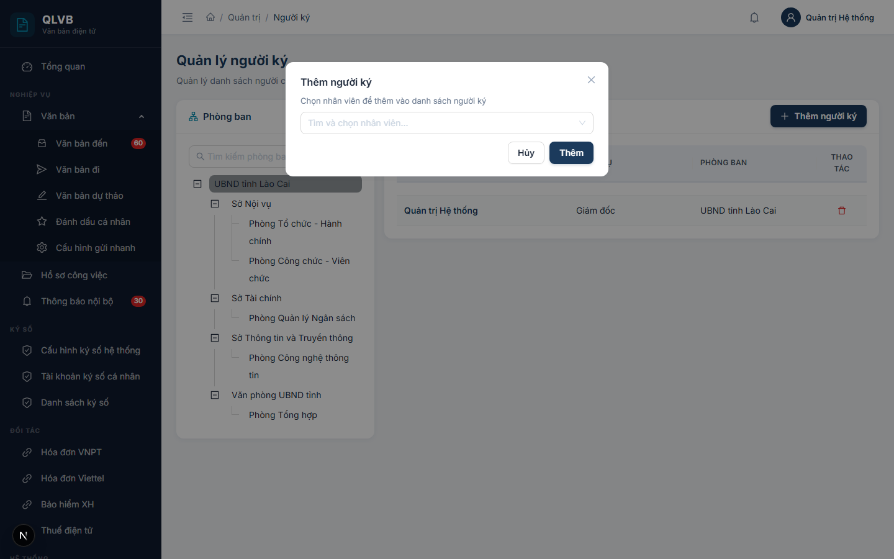
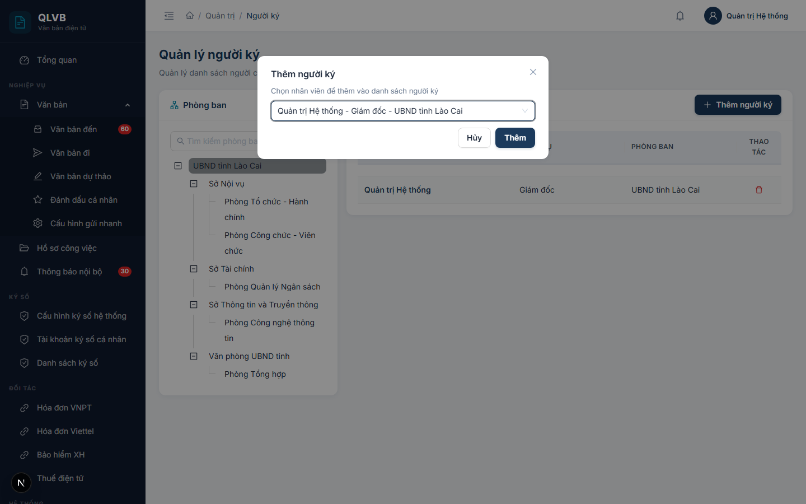
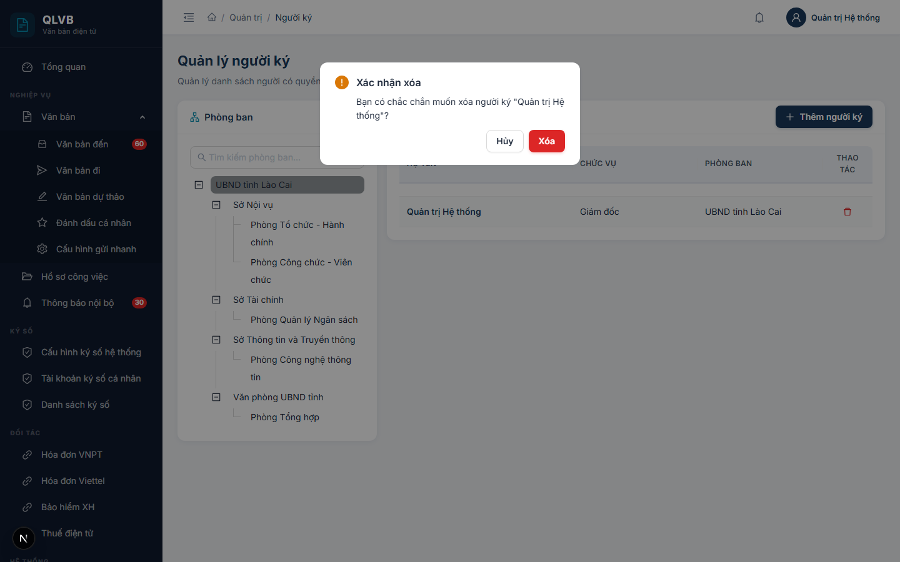

# Hướng dẫn sử dụng: Màn hình Quản trị > Người ký

Tài liệu này mô tả đầy đủ các chức năng có trong màn hình **Quản trị > Người ký** của hệ thống Quản lý văn bản điện tử (e-Office), giúp người dùng hiểu rõ cách sử dụng và quy trình nghiệp vụ.

---

## 1. Giới thiệu

Màn hình **Quản trị > Người ký** dùng để quản lý danh mục **những người có thẩm quyền ký văn bản** của cơ quan — thường là lãnh đạo đơn vị, lãnh đạo phòng ban, người được ủy quyền ký thay (KT.), ký thừa lệnh (TL.), ký quyền (Q.) theo Nghị định 30/2020/NĐ-CP.

Khi soạn **văn bản đi** hoặc **dự thảo văn bản**, người soạn sẽ chọn người ký từ chính danh mục này — họ tên và chức vụ được lấy từ đây sẽ in lên cuối văn bản. Vì vậy, chỉ những nhân viên có tên trong danh sách này mới xuất hiện trong ô chọn người ký ở các màn hình nghiệp vụ. Nếu một lãnh đạo nghỉ hưu / chuyển công tác, cần xóa khỏi danh sách này để không còn được chọn ký văn bản mới.

Đây là dữ liệu danh mục dùng chung trong **phạm vi đơn vị** — mỗi đơn vị quản lý danh sách người ký của riêng mình. Người dùng đăng nhập bằng tài khoản thuộc đơn vị nào sẽ chỉ thấy và quản lý danh sách người ký của đơn vị đó.

Vì là dữ liệu nền tảng, ảnh hưởng đến tính pháp lý của văn bản phát hành, màn hình này **chỉ dành cho tài khoản Quản trị hệ thống** hoặc người được phân quyền quản trị danh mục.

---

## 2. Bố cục màn hình

Màn hình được chia thành 2 cột chính cùng phần đầu trang:

- **Phần đầu trang**: Hiển thị tiêu đề "Quản lý người ký" và dòng mô tả ngắn "Quản lý danh sách người có quyền ký văn bản".
- **Cột trái — Phòng ban (cây phân cấp)**:
  - Tiêu đề khung "Phòng ban" với biểu tượng sơ đồ tổ chức màu xanh teal.
  - Nút **Tải lại** (biểu tượng mũi tên xoay tròn) ở góc trên bên phải khung — dùng để làm mới cây phòng ban.
  - **Ô tìm kiếm** (placeholder "Tìm kiếm phòng ban...") ở phía trên cây — có nút xóa nhanh.
  - Cây phân cấp đơn vị / phòng ban (mặc định mở rộng tất cả các nhánh).
  - Bấm vào một nhánh trên cây sẽ lọc bảng bên phải chỉ hiển thị người ký thuộc phòng ban đó.
- **Cột phải — Danh sách người ký**:
  - Tiêu đề khung "Danh sách người ký" với biểu tượng cây bút màu xanh teal.
  - Nút **Thêm người ký** (biểu tượng dấu cộng, màu xanh navy) ở góc trên bên phải khung — mở hộp thoại thêm mới.
  - Bảng dữ liệu liệt kê những người ký đã được thêm — không phân trang (hiển thị toàn bộ trên 1 trang).
  - Mỗi dòng có một nút **Xóa** hình thùng rác màu đỏ ở cột thao tác.
- **Hộp thoại phụ (Modal)**:
  - **Hộp thoại Thêm người ký** — mở giữa màn hình khi bấm nút Thêm.
  - **Hộp xác nhận xóa** — mở khi bấm nút thùng rác, yêu cầu xác nhận trước khi thực hiện.

---

## 3. Các cột trong Bảng danh sách người ký

| Tên cột | Mô tả |
|---|---|
| **Họ tên** | Họ và tên đầy đủ của người ký — hiển thị in đậm, màu xanh navy. Lấy tự động từ thông tin nhân viên đã chọn. Nếu tên dài sẽ tự động cắt bớt và hiện tooltip khi rê chuột. |
| **Chức vụ** | Chức vụ của người ký (ví dụ: "Giám đốc", "Phó Giám đốc", "Trưởng phòng"). Lấy từ chức vụ đang gán cho nhân viên trong hồ sơ nhân sự. Khi ký văn bản, chức vụ này sẽ được in dưới phần "Người ký". |
| **Phòng ban** | Phòng ban / đơn vị mà người ký được gán vào trong danh mục này (theo nhánh đã chọn ở cây bên trái khi thêm). |
| **Thao tác** | Nút **thùng rác đỏ** — bấm để xóa người ký khỏi danh sách. |

> **Lưu ý**: Ba cột Họ tên, Chức vụ, Phòng ban đều được lấy tự động khi thêm người ký — không có ô nhập tay. Nếu sau này cần đổi chức vụ của một người ký, hãy sửa thông tin nhân viên ở màn hình **Quản trị > Nhân viên** (chức vụ hiển thị ở đây sẽ tự cập nhật theo).

---

## 4. Các trường trong hộp thoại Thêm người ký

Khi bấm **Thêm người ký**, hệ thống mở hộp thoại giữa màn hình với các trường sau:

| Tên trường | Bắt buộc | Mô tả & ràng buộc |
|---|---|---|
| **Phòng ban / đơn vị (chọn từ cây bên trái)** | Có | **Phải chọn nhánh trên cây bên trái TRƯỚC khi bấm Thêm người ký**. Người ký mới sẽ được gán vào nhánh đang chọn. Nếu chưa chọn, hệ thống cảnh báo "Vui lòng chọn phòng ban / đơn vị từ cây bên trái trước". |
| **Nhân viên** | Có | Ô chọn (combobox) có hỗ trợ tìm kiếm — gõ một phần họ tên để lọc nhanh. Mỗi mục hiển thị theo định dạng `<Họ tên> - <Chức vụ> - <Phòng ban>`. Danh sách nhân viên được lấy theo phòng ban / đơn vị đã chọn ở cây bên trái — chỉ hiển thị nhân viên thuộc phạm vi đó. Nếu không chọn nhân viên mà bấm **Thêm**, hệ thống cảnh báo "Vui lòng chọn nhân viên". |

> **Lưu ý**: Hộp thoại chỉ có duy nhất một ô **chọn nhân viên**. Toàn bộ thông tin chức vụ và phòng ban được hiển thị tự động theo hồ sơ nhân viên — màn hình **không có** trường nhập "Loại ký" tách riêng cho các trường hợp ký thay (KT.), thừa lệnh (TL.), quyền (Q.) theo Nghị định 30/2020. Bảng người ký cũng chỉ lưu liên kết tới nhân viên, không có cột nào khác để ghi loại ký. Nếu muốn người này ký với một danh xưng khác (ví dụ "Phó Giám đốc" thay vì "Trưởng phòng"), cần cập nhật trường **Chức vụ** của nhân viên đó ở **Quản trị > Nhân viên** trước khi thêm vào danh sách người ký. Khi cần ghi nhãn "KT." / "TL." / "Q." trên văn bản chính thức, đặt sẵn vào chính tên chức vụ của nhân viên đó (ví dụ "KT. Giám đốc — Phó Giám đốc").

---

## 5. Các nút chức năng

| Nút | Vị trí | Khi nào hiển thị | Tác dụng |
|---|---|---|---|
| **Thêm người ký** | Góc trên bên phải khung "Danh sách người ký" | Luôn hiển thị | Mở hộp thoại Thêm người ký. **Trước khi bấm, phải chọn một nhánh trên cây bên trái** để xác định người ký được gán vào phòng ban / đơn vị nào. |
| **Tải lại** (biểu tượng mũi tên xoay tròn) | Góc trên bên phải khung "Phòng ban" | Luôn hiển thị | Tải lại toàn bộ cây phòng ban từ máy chủ. Dùng khi nghi ngờ dữ liệu không đồng bộ (ví dụ: vừa thêm phòng ban mới ở màn hình khác). |
| **Ô tìm kiếm "Tìm kiếm phòng ban..."** | Phía trên cây phân cấp bên trái | Luôn hiển thị | Lọc các nhánh trên cây theo từ khóa nhập. Có nút xóa nhanh để bỏ từ khóa và hiển thị lại toàn bộ cây. |
| **(Nhánh trên cây)** | Cây phòng ban bên trái | Luôn hiển thị | Bấm vào một nhánh sẽ lọc bảng bên phải chỉ còn người ký thuộc phòng ban đó. Bấm lại nhánh đó (hoặc bấm nhánh khác) để đổi bộ lọc. |
| **Xóa** (biểu tượng thùng rác đỏ) | Cột thao tác trên mỗi dòng của bảng | Luôn hiển thị | Mở hộp xác nhận, sau đó xóa người ký khỏi danh sách. |
| **Thêm** | Góc dưới bên phải hộp thoại Thêm người ký | Trong hộp thoại Thêm | Lưu người ký mới. Có biểu tượng đợi (loading) khi đang xử lý. |
| **Hủy** | Góc dưới bên phải hộp thoại Thêm người ký | Trong hộp thoại Thêm | Đóng hộp thoại, không thêm. |
| **Xóa** / **Hủy** trong hộp xác nhận | Trong hộp xác nhận xóa | Khi mở hộp xác nhận | **Xóa** (màu đỏ) — thực hiện xóa. **Hủy** — đóng hộp, không xóa. |

---

## 6. Quy trình thao tác chính

### 6.1. Thêm mới một người ký

1. Trên cây bên trái, **bấm chọn nhánh phòng ban / đơn vị** mà người ký sẽ được gán vào (ví dụ: bấm "Văn phòng UBND" nếu đang muốn thêm Chánh Văn phòng).
   - Nếu chưa biết tên phòng ban, có thể gõ vào ô **Tìm kiếm phòng ban...** để lọc nhanh.
2. Bấm nút **Thêm người ký** ở góc trên bên phải bảng.
3. Hộp thoại **Thêm người ký** mở ra. Trong ô chọn nhân viên:
   - Gõ một phần họ tên để hệ thống lọc nhanh, hoặc cuộn để tìm.
   - Mỗi mục hiển thị `<Họ tên> - <Chức vụ> - <Phòng ban>` để dễ phân biệt khi có người trùng tên.
   - Bấm chọn nhân viên cần thêm.
4. Bấm **Thêm**.
5. Hệ thống thông báo **"Thêm người ký thành công"**, đóng hộp thoại và bảng tự động cập nhật, hiển thị người vừa thêm.

> **Nếu chưa chọn nhánh trên cây**: bấm **Thêm** sẽ thấy cảnh báo "Vui lòng chọn phòng ban / đơn vị từ cây bên trái trước". Đóng cảnh báo, bấm chọn nhánh trên cây rồi bấm lại **Thêm người ký**.

### 6.2. Xóa một người ký

1. Tìm người ký cần xóa trên bảng (có thể bấm nhánh trên cây bên trái để thu hẹp danh sách).
2. Trên dòng tương ứng, bấm biểu tượng **thùng rác đỏ** ở cột Thao tác.
3. Hộp xác nhận hiện ra với câu hỏi *"Bạn có chắc chắn muốn xóa người ký '<Họ tên>'?"*.

   
4. Bấm **Xóa** (màu đỏ) để xác nhận, hoặc **Hủy** để bỏ qua.
5. Hệ thống thông báo **"Xóa người ký thành công"** và bảng cập nhật ngay.

> **Lưu ý**: Xóa khỏi danh sách người ký **không** xóa nhân viên khỏi hệ thống — chỉ là gỡ quyền ký văn bản. Nhân viên vẫn còn nguyên trong **Quản trị > Nhân viên**, có thể đăng nhập, nhận giao việc bình thường. Nếu sau này muốn cấp lại quyền ký, chỉ cần thêm lại vào danh sách.

### 6.3. Lọc danh sách theo phòng ban

1. Trên cây **Phòng ban** ở bên trái, bấm chọn nhánh cần xem.
2. Bảng bên phải tự động cập nhật, chỉ hiển thị những người ký thuộc nhánh đó.
3. Để xem **toàn bộ** người ký của đơn vị, bấm vào nhánh hiện đang chọn lần nữa để bỏ chọn (hoặc tải lại trang).

### 6.4. Tìm kiếm phòng ban trên cây

1. Trên ô **Tìm kiếm phòng ban...** ở phía trên cây bên trái, gõ một phần tên phòng ban (có thể không cần dấu).
2. Cây sẽ tự động lọc, chỉ hiển thị các nhánh chứa từ khóa kèm các nhánh cha của chúng.
3. Bấm biểu tượng **dấu nhân** trong ô tìm kiếm để xóa từ khóa và hiển thị lại toàn bộ cây.

---

## 7. Lưu ý / Ràng buộc nghiệp vụ

### 7.1. Một nhân viên chỉ được thêm một lần trong cùng đơn vị

Trong **cùng một đơn vị**, mỗi nhân viên **chỉ được thêm vào danh sách người ký một lần duy nhất**. Khi cố thêm trùng, hệ thống báo:

> *"Nhân viên đã có trong danh sách người ký"*

Khi nhân viên là người ký được chuyển sang phòng ban khác trong **Quản trị > Nhân viên**, hệ thống **tự động đồng bộ** phòng ban của bản ghi người ký theo phòng ban mới — danh sách người ký luôn hiển thị đúng phòng ban hiện tại của nhân viên mà không cần thao tác thủ công. Nếu nhân viên chuyển sang đơn vị khác hoàn toàn, đơn vị sở hữu của bản ghi người ký cũng được cập nhật theo.

### 7.2. Nhân viên đã xóa không thể chọn làm người ký

Hệ thống chỉ cho phép thêm người ký từ những nhân viên **đang còn hoạt động** (chưa bị xóa khỏi hệ thống). Nếu cố thêm một nhân viên đã bị xóa, hệ thống báo:

> *"Nhân viên không tồn tại"*

Trường hợp này thường gặp khi danh sách trên client còn cache cũ — hãy bấm **Tải lại** trên cây phòng ban hoặc tải lại trang.

### 7.3. Phải chọn phòng ban / đơn vị trước khi thêm

Hệ thống yêu cầu **bấm chọn một nhánh trên cây bên trái trước khi thêm người ký**. Lý do:

- Người ký phải gắn với một phòng ban / đơn vị cụ thể để đúng phạm vi nghiệp vụ.
- Danh sách nhân viên trong ô chọn sẽ được lọc theo nhánh đã chọn — giúp người dùng dễ tìm.

Nếu chưa chọn nhánh:

> *"Vui lòng chọn phòng ban / đơn vị từ cây bên trái trước"*

### 7.4. Phải chọn nhân viên trong hộp thoại

Sau khi mở hộp thoại Thêm người ký, nếu bấm **Thêm** mà chưa chọn nhân viên trong ô chọn:

> *"Vui lòng chọn nhân viên"*

### 7.5. Phạm vi dữ liệu theo đơn vị

Khi mở màn hình, hệ thống mặc định chỉ hiển thị danh sách người ký thuộc **đơn vị của người đăng nhập**. Người dùng không nhìn thấy danh sách người ký của đơn vị khác.

Khi tạo mới, người ký sẽ tự động được gán cho đơn vị của người đăng nhập (hệ thống tự xác định đơn vị cha cao nhất từ phòng ban được chọn) — không cần chọn đơn vị thủ công.

### 7.6. Liên hệ với chức năng "Soạn văn bản đi" / "Dự thảo"

Danh sách người ký quản lý ở màn hình này được dùng trực tiếp cho:

- **Văn bản đi** → ô chọn **Người ký** khi soạn văn bản.
- **Dự thảo văn bản** → ô chọn **Người ký** khi tạo dự thảo.
- **Trình ký số (ký số văn bản)** → người ký trong yêu cầu ký số được lấy từ danh sách này.

Vì vậy, cần đảm bảo **luôn cập nhật danh sách kịp thời**:

- Có lãnh đạo mới được bổ nhiệm → thêm vào.
- Lãnh đạo nghỉ hưu / chuyển công tác → xóa khỏi danh sách (nhưng giữ nguyên nhân viên trong hệ thống).
- Đổi chức vụ → cập nhật chức vụ ở **Quản trị > Nhân viên** (chức vụ hiển thị tại đây sẽ tự cập nhật).

### 7.7. Không có chức năng sửa

Bảng người ký không có nút **Sửa**. Nếu cần thay đổi chức vụ / phòng ban hiển thị, hãy thực hiện ở màn hình **Quản trị > Nhân viên**. Nếu cần đổi sang một nhân viên khác, hãy **xóa** và **thêm mới** lại với nhân viên đúng.

### 7.8. Bảng tổng hợp các thông báo của hệ thống

| Tình huống | Thông báo |
|---|---|
| Thêm người ký thành công (frontend) | Thêm người ký thành công |
| Thêm người ký thành công (backend) | Them nguoi ky thanh cong |
| Xóa người ký thành công (frontend) | Xóa người ký thành công |
| Xóa người ký thành công (backend) | Xoa nguoi ky thanh cong |
| Chưa chọn nhân viên trong hộp thoại | Vui lòng chọn nhân viên |
| Chưa chọn phòng ban / đơn vị trên cây | Vui lòng chọn phòng ban / đơn vị từ cây bên trái trước |
| Thêm trùng nhân viên trong cùng đơn vị | Nhân viên đã có trong danh sách người ký |
| Nhân viên đã xóa / không tồn tại | Nhân viên không tồn tại |
| Không tìm thấy người ký khi xóa | Không tìm thấy người ký |
| Đơn vị bắt buộc (chưa xác định được đơn vị) | Đơn vị là bắt buộc |
| Lỗi tải dữ liệu cây phòng ban | Lỗi tải dữ liệu đơn vị |
| Lỗi tải danh sách người ký | Lỗi tải danh sách người ký |
| Lỗi tải danh sách nhân viên (trong hộp thoại) | Lỗi tải danh sách nhân viên |
| Lỗi khi thêm người ký (chung) | Lỗi khi thêm người ký |
| Lỗi khi xóa (chung) | Lỗi khi xóa |

---

*Tài liệu được biên soạn dựa trên hệ thống thực tế đang triển khai. Mọi thắc mắc vui lòng liên hệ với đội phát triển để được hỗ trợ.*
