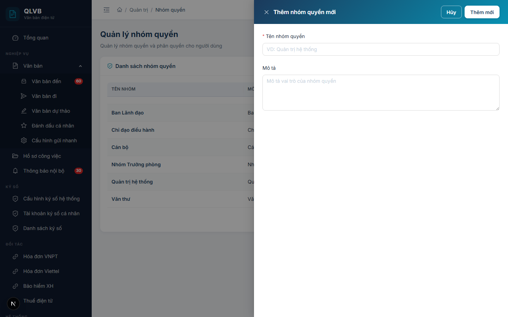
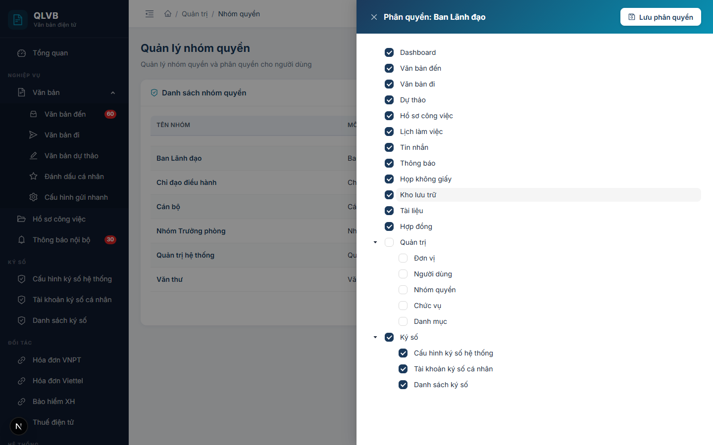
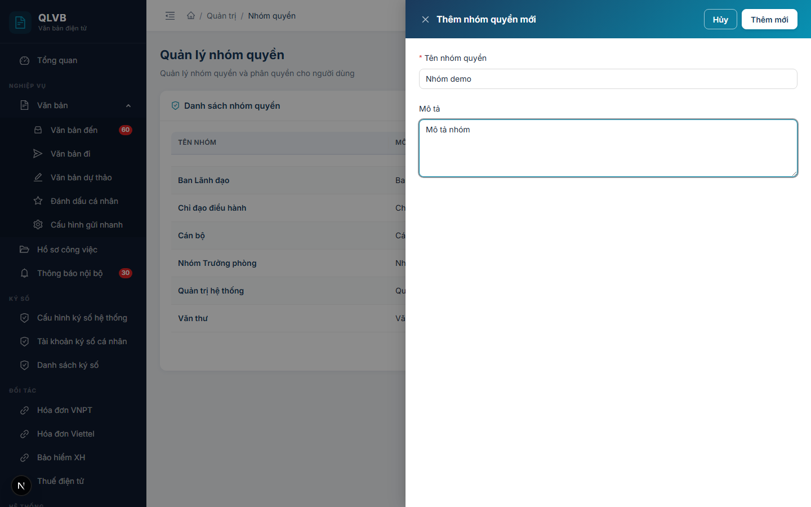
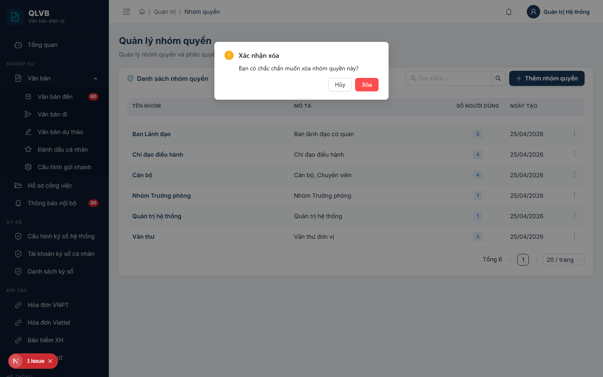

# Hướng dẫn sử dụng: Màn hình Quản trị > Nhóm quyền

Tài liệu này mô tả đầy đủ các chức năng có trong màn hình **Quản trị > Nhóm quyền** của hệ thống Quản lý văn bản điện tử (e-Office), giúp người dùng hiểu rõ cách sử dụng và quy trình nghiệp vụ.

---

## 1. Giới thiệu

Trong hệ thống e-Office, **nhóm quyền** (còn gọi là vai trò) là một tập hợp các quyền hạn được đặt tên — ví dụ: *Quản trị hệ thống*, *Văn thư*, *Lãnh đạo đơn vị*, *Cán bộ thường*. Mỗi nhóm quyền sẽ được gán một danh sách các **chức năng** mà nó được phép thao tác (xem danh sách văn bản, tạo văn bản đi, cấp số, ký số, quản trị hệ thống...).

Mỗi nhân viên có thể được gán **một hoặc nhiều nhóm quyền** cùng lúc. Khi nhân viên đăng nhập, hệ thống sẽ **cộng dồn** quyền hạn từ tất cả các nhóm quyền mà nhân viên đó thuộc về để xác định các thao tác được phép thực hiện. Ví dụ: một cán bộ vừa thuộc nhóm *Văn thư*, vừa thuộc nhóm *Lãnh đạo đơn vị* sẽ có quyền của cả hai nhóm.

Màn hình **Quản trị > Nhóm quyền** dùng để:

- Tạo mới, chỉnh sửa, xóa các nhóm quyền của cơ quan.
- **Phân quyền** cho từng nhóm — tức là chọn các chức năng mà nhóm quyền đó được phép sử dụng (qua cây chức năng có ô tích chọn).
- Theo dõi số lượng người dùng hiện đang được gán mỗi nhóm quyền.

Vì là dữ liệu nền tảng, ảnh hưởng tới quyền truy cập của toàn bộ cán bộ trong cơ quan, **màn hình này chỉ dành cho tài khoản Quản trị hệ thống**. Mỗi thay đổi (thêm chức năng cho nhóm, bỏ chức năng, xóa nhóm) sẽ tác động ngay lập tức đến những nhân viên thuộc nhóm đó.

Việc gán nhóm quyền cho từng nhân viên cụ thể được thực hiện ở màn hình **Quản trị > Người dùng** (nhân viên).

---

## 2. Bố cục màn hình

Màn hình gồm phần đầu trang và một khung nội dung chính:

- **Phần đầu trang**: Hiển thị tiêu đề "Quản lý nhóm quyền" và dòng mô tả ngắn "Quản lý nhóm quyền và phân quyền cho người dùng".
- **Khung "Danh sách nhóm quyền"**:
  - Tiêu đề khung kèm biểu tượng tấm khiên màu xanh teal.
  - Ở góc trên bên phải có **ô tìm kiếm** (theo tên nhóm quyền) và nút **Thêm nhóm quyền** (biểu tượng dấu cộng, màu xanh).
  - Bên dưới là **bảng dữ liệu** liệt kê các nhóm quyền hiện có, kèm phân trang ở cuối bảng.
  - Mỗi dòng có nút thao tác hình **ba chấm dọc** ở cột cuối cùng, chứa các lệnh: Sửa thông tin, Phân quyền, Xóa.
- **Cửa sổ phụ (Drawer / Modal)**:
  - **Drawer Thêm nhóm quyền mới / Cập nhật nhóm quyền** — mở ra từ bên phải khi bấm nút Thêm hoặc Sửa.
  - **Drawer Phân quyền** — mở ra từ bên phải khi bấm Phân quyền, hiển thị cây chức năng có ô tích chọn.
  - **Hộp xác nhận xóa** — mở khi bấm Xóa, yêu cầu xác nhận trước khi thực hiện.

---

## 3. Các cột trong Bảng danh sách nhóm quyền

| Tên cột | Mô tả |
|---|---|
| **Tên nhóm** | Tên của nhóm quyền — hiển thị in đậm, màu xanh navy. Ví dụ: *Quản trị hệ thống*, *Văn thư*, *Lãnh đạo đơn vị*. |
| **Mô tả** | Mô tả ngắn về vai trò của nhóm quyền. Nếu mô tả dài sẽ tự động cắt bớt và hiện tooltip khi rê chuột. |
| **Số người dùng** | Số lượng nhân viên hiện đang được gán nhóm quyền này. Hiển thị dạng nhãn nền xanh ở giữa ô. Số 0 nghĩa là chưa có ai dùng nhóm này. |
| **Ngày tạo** | Ngày nhóm quyền được tạo, định dạng `DD/MM/YYYY`. Nếu chưa có sẽ hiển thị dấu `-`. |
| (cột thao tác) | Nút ba chấm dọc ở cuối dòng, mở menu các lệnh: Sửa thông tin, Phân quyền, Xóa. |

Cuối bảng là thanh phân trang (chuyển trang, đổi số dòng / trang, hiển thị tổng số bản ghi dưới dạng *"Tổng N"*).

---

## 4. Các trường nhập liệu trong cửa sổ Thêm / Cập nhật nhóm quyền

Khi bấm **Thêm nhóm quyền** hoặc **Sửa thông tin**, hệ thống mở cửa sổ phía bên phải màn hình với các trường sau:

| Tên trường | Bắt buộc | Mô tả & ràng buộc |
|---|---|---|
| **Tên nhóm quyền** | Có | Tên của nhóm quyền. Tối đa 100 ký tự. Ví dụ: *Quản trị hệ thống*, *Văn thư đi*. **Không phân biệt chữ hoa / chữ thường** — nếu trùng tên với một nhóm quyền khác (kể cả khác hoa thường), hệ thống báo *"Tên nhóm quyền đã tồn tại"*. Nếu để trống, hệ thống báo *"Tên nhóm quyền là bắt buộc"*. |
| **Mô tả** | Không | Mô tả vai trò, phạm vi sử dụng của nhóm quyền. Tối đa 500 ký tự, dạng vùng văn bản nhiều dòng. |

> **Lưu ý**: Cửa sổ Thêm/Sửa **chỉ chứa hai trường** trên. Việc chọn các chức năng cụ thể mà nhóm quyền này được phép sử dụng được thực hiện ở **một cửa sổ riêng** — *Phân quyền* (xem mục 4.1 dưới đây).

### 4.1. Cửa sổ Phân quyền

Khi bấm **Phân quyền** trong menu ba chấm của một dòng, hệ thống mở một cửa sổ riêng phía bên phải màn hình với:

- Tiêu đề dạng *"Phân quyền: **\<tên nhóm quyền\>**"*.
- Một **cây chức năng có ô tích chọn** (checkbox tree) — liệt kê toàn bộ các chức năng (menu) của hệ thống theo cấu trúc cha - con. Cha tích thì các con được tích theo; bỏ tích cha sẽ bỏ tích các con. Có thể tự tích / bỏ tích từng nút riêng lẻ.
- Mặc định cây mở rộng tất cả các nhánh để dễ rà soát.
- Các ô đã được tích sẵn tương ứng với các chức năng nhóm quyền hiện đang sở hữu.
- Nút **Lưu phân quyền** ở góc trên bên phải để ghi lại thay đổi.

Khi bấm **Lưu phân quyền**, hệ thống ghi đè toàn bộ danh sách chức năng của nhóm quyền theo các ô đang được tích — *các chức năng bị bỏ tích sẽ bị gỡ khỏi nhóm*. Sau khi lưu thành công, hệ thống thông báo *"Lưu phân quyền thành công"* và đóng cửa sổ.

---

## 5. Các nút chức năng

| Nút | Vị trí | Khi nào hiển thị | Tác dụng |
|---|---|---|---|
| **Thêm nhóm quyền** | Góc trên bên phải khung "Danh sách nhóm quyền" | Luôn hiển thị | Mở cửa sổ Thêm nhóm quyền mới. |
| **Ô tìm kiếm "Tìm kiếm..."** | Góc trên bên phải khung, cạnh nút Thêm | Luôn hiển thị | Lọc bảng theo từ khóa trên trường **Tên nhóm**. Có nút xóa nhanh từ khóa. |
| **Sửa thông tin** | Trong menu ba chấm trên mỗi dòng | Luôn hiển thị | Mở cửa sổ Cập nhật nhóm quyền với dữ liệu hiện có để chỉnh sửa Tên nhóm và Mô tả. |
| **Phân quyền** | Trong menu ba chấm trên mỗi dòng | Luôn hiển thị | Mở cửa sổ Phân quyền — cây chức năng có ô tích chọn — để chọn các chức năng nhóm quyền được phép sử dụng. |
| **Xóa** | Trong menu ba chấm trên mỗi dòng (mục cuối, màu đỏ) | Luôn hiển thị | Mở hộp xác nhận, sau đó xóa nhóm quyền. **Chỉ xóa được khi không còn nhân viên nào thuộc nhóm này** (xem mục 7). |
| **Thêm mới** / **Cập nhật** | Góc trên bên phải cửa sổ Thêm / Sửa | Trong cửa sổ Thêm / Sửa | Lưu dữ liệu vừa nhập. Nhãn nút thay đổi tùy đang Thêm mới hay Cập nhật. |
| **Hủy** | Góc trên bên phải cửa sổ Thêm / Sửa | Trong cửa sổ Thêm / Sửa | Đóng cửa sổ, không lưu thay đổi. |
| **Lưu phân quyền** | Góc trên bên phải cửa sổ Phân quyền | Trong cửa sổ Phân quyền | Ghi đè danh sách chức năng của nhóm quyền theo các ô đang tích trên cây. |
| **Xóa** / **Hủy** trong hộp xác nhận | Trong hộp xác nhận xóa | Khi mở hộp xác nhận | **Xóa** (màu đỏ) — thực hiện xóa. **Hủy** — đóng hộp, không xóa. |
| **Phân trang** | Cuối bảng | Luôn hiển thị | Chuyển trang, đổi số dòng mỗi trang. Hiển thị tổng số bản ghi dạng *"Tổng N"*. |

---

## 6. Quy trình thao tác chính

### 6.1. Thêm mới một nhóm quyền

1. Bấm nút **Thêm nhóm quyền** ở góc trên bên phải khung danh sách.
2. Trong cửa sổ **Thêm nhóm quyền mới**, điền:
   - **Tên nhóm quyền** (bắt buộc): tên không trùng với nhóm quyền nào khác.
   - **Mô tả** (tùy chọn): mô tả ngắn vai trò, phạm vi sử dụng của nhóm.
3. Bấm **Thêm mới**.
4. Hệ thống thông báo **"Thêm thành công"** và đóng cửa sổ. Bảng danh sách tự động cập nhật.
5. Sau khi tạo xong, **bước tiếp theo** là vào menu ba chấm của nhóm vừa tạo → **Phân quyền** để chọn các chức năng cho nhóm (xem mục 6.3). Nếu bỏ qua bước này, nhóm quyền sẽ không có quyền hạn nào và việc gán nhóm cho nhân viên sẽ không có ý nghĩa.

### 6.2. Chỉnh sửa thông tin một nhóm quyền

1. Tìm nhóm quyền cần sửa trên bảng (có thể dùng ô tìm kiếm theo tên nhóm để thu hẹp danh sách).
2. Trên dòng tương ứng, bấm biểu tượng **ba chấm dọc** ở cột cuối → chọn **Sửa thông tin**.
3. Cửa sổ **Cập nhật nhóm quyền** mở ra với dữ liệu sẵn có. Sửa **Tên nhóm quyền** và/hoặc **Mô tả**.
4. Bấm **Cập nhật**.
5. Hệ thống thông báo **"Cập nhật thành công"** và đóng cửa sổ.

> Việc sửa **Tên nhóm quyền** không làm thay đổi danh sách chức năng đã gán hay danh sách nhân viên thuộc nhóm — đây chỉ là đổi tên hiển thị.

### 6.3. Phân quyền cho một nhóm quyền

1. Tìm nhóm quyền cần phân quyền trên bảng.
2. Bấm biểu tượng **ba chấm dọc** ở cột cuối → chọn **Phân quyền**.
3. Cửa sổ **Phân quyền: \<tên nhóm\>** mở ra. Chờ cây chức năng tải xong (có biểu tượng quay vòng nếu còn đang tải).
4. Trên cây chức năng:
   - **Tích vào ô** trước tên một chức năng để cấp quyền chức năng đó cho nhóm.
   - **Bỏ tích** để gỡ chức năng đó khỏi nhóm.
   - Tích vào nút cha sẽ tự động tích tất cả các nút con bên dưới; bỏ tích cha sẽ bỏ tích các con.
   - Có thể tự tích từng nút con riêng lẻ mà không cần tích cha.
5. Bấm **Lưu phân quyền** ở góc trên bên phải cửa sổ.
6. Hệ thống thông báo **"Lưu phân quyền thành công"** và đóng cửa sổ.

> **Quan trọng**: Phân quyền hoạt động theo nguyên tắc **ghi đè toàn bộ**. Mỗi lần bấm Lưu, hệ thống sẽ thay thế danh sách chức năng cũ bằng danh sách các ô đang được tích. Vì vậy phải tích đủ tất cả các chức năng muốn cấp cho nhóm — kể cả những chức năng đã được cấp trước đó nhưng vẫn muốn giữ lại.

### 6.4. Xóa nhóm quyền

1. Tìm nhóm quyền cần xóa.
2. Bấm biểu tượng **ba chấm dọc** ở cột cuối → chọn **Xóa** (mục cuối cùng, màu đỏ).
3. Hộp xác nhận hiện ra với câu hỏi *"Bạn có chắc chắn muốn xóa nhóm quyền này?"*.

   
4. Bấm **Xóa** (màu đỏ) để xác nhận, hoặc **Hủy** để bỏ qua.
5. Nếu xóa được, hệ thống thông báo **"Xóa thành công"**. Toàn bộ phân quyền (danh sách chức năng đã tích) của nhóm cũng được gỡ theo.
6. Nếu nhóm còn nhân viên đang được gán, hệ thống không cho xóa và báo lỗi rõ số lượng (xem mục 7).

### 6.5. Tìm kiếm nhóm quyền

1. Trên ô **Tìm kiếm...** ở góc trên bên phải khung danh sách, gõ một phần tên nhóm quyền cần tìm.
2. Bấm Enter (hoặc đợi vài giây) — bảng tự động lọc các dòng có **Tên nhóm** chứa từ khóa.
3. Bấm biểu tượng **dấu nhân** trong ô tìm kiếm để xóa từ khóa và hiển thị lại toàn bộ danh sách.

---

## 7. Lưu ý / Ràng buộc nghiệp vụ

### 7.1. Cộng dồn quyền từ nhiều nhóm

Một nhân viên có thể thuộc nhiều nhóm quyền cùng lúc. Khi đó, quyền hạn của nhân viên là **hợp** của các chức năng có trong tất cả các nhóm. Không có khái niệm "trừ quyền" hay "ưu tiên giữa các nhóm" — chỉ cần **một** nhóm có chức năng đó là nhân viên có thể dùng.

Khi muốn thu hẹp quyền của một nhân viên, có hai cách:
- **Gỡ nhân viên khỏi nhóm có quyền đó** (làm ở màn hình *Quản trị > Người dùng*).
- **Bỏ tích chức năng khỏi nhóm quyền** (làm ở cửa sổ Phân quyền) — *cách này ảnh hưởng đến TẤT CẢ nhân viên thuộc nhóm*, cần cân nhắc.

### 7.2. Tên nhóm quyền phải duy nhất

Trong toàn hệ thống, **mỗi tên nhóm quyền chỉ tồn tại một lần** (không phân biệt chữ hoa / chữ thường — *"Văn thư"* và *"VĂN THƯ"* được coi là trùng). Khi nhập trùng, hệ thống báo:

> *"Tên nhóm quyền đã tồn tại"*

Lỗi này hiển thị ngay tại ô **Tên nhóm quyền** trong cửa sổ nhập để người dùng dễ phát hiện.

### 7.3. Không xóa được nhóm quyền còn nhân viên thuộc về

Hệ thống ngăn xóa nếu nhóm quyền còn ít nhất một nhân viên đang được gán:

> *"Không thể xóa: còn N nhân viên trong nhóm quyền này"*

(với *N* là số lượng nhân viên thực tế).

Cách xử lý:
- Vào màn hình **Quản trị > Người dùng**, gỡ nhóm quyền này khỏi từng nhân viên có liên quan.
- Sau khi *N* về 0, quay lại màn hình này để xóa.

### 7.4. Phân quyền là ghi đè toàn bộ

Khi bấm **Lưu phân quyền**, hệ thống **xóa toàn bộ** danh sách chức năng cũ của nhóm và ghi lại theo các ô đang được tích trên cây. Nếu vô tình bỏ tích một số chức năng quan trọng trước khi lưu, các chức năng đó sẽ bị gỡ khỏi nhóm và toàn bộ nhân viên thuộc nhóm sẽ mất quyền tương ứng.

Khuyến nghị: trước khi mở cửa sổ Phân quyền để thay đổi, ghi nhớ (hoặc chụp màn hình) trạng thái tích hiện tại để có thể khôi phục nếu cần.

### 7.5. Xóa nhóm sẽ gỡ luôn các chức năng đã phân quyền

Khi xóa thành công một nhóm quyền (sau khi đã gỡ hết nhân viên), toàn bộ danh sách các chức năng đã tích cho nhóm cũng bị xóa theo. Không có thao tác hoàn tác — nếu cần dùng lại, phải tạo nhóm mới và phân quyền lại từ đầu.

### 7.6. Phạm vi đơn vị

Mỗi nhóm quyền được tạo dưới phạm vi đơn vị của người tạo (do hệ thống tự xác định theo phòng ban của tài khoản đang đăng nhập). Trong phiên bản hiện tại, danh sách hiển thị bao gồm các nhóm quyền của đơn vị hiện tại và các nhóm quyền dùng chung (không gắn đơn vị cụ thể). Người dùng quản trị thông thường không cần quan tâm đến chi tiết này.

### 7.7. Bảng tổng hợp các thông báo của hệ thống

| Tình huống | Thông báo |
|---|---|
| Thêm nhóm quyền thành công | Thêm thành công |
| Cập nhật nhóm quyền thành công | Cập nhật thành công |
| Xóa nhóm quyền thành công | Xóa thành công |
| Lưu phân quyền thành công | Lưu phân quyền thành công |
| Để trống Tên nhóm quyền (cửa sổ nhập) | Nhập tên nhóm quyền |
| Để trống Tên nhóm quyền (lưu lên máy chủ) | Tên nhóm quyền là bắt buộc |
| Tên nhóm quyền trùng | Tên nhóm quyền đã tồn tại |
| Xóa nhóm còn nhân viên | Không thể xóa: còn N nhân viên trong nhóm quyền này |
| Không tạo được nhóm quyền (lỗi máy chủ) | Không thể tạo nhóm quyền |
| Không tìm thấy nhóm quyền khi cập nhật | Không tìm thấy nhóm quyền |
| Lỗi khi tải danh sách nhóm quyền | Lỗi tải dữ liệu |
| Lỗi khi tải cây chức năng / quyền hiện có | Lỗi tải quyền |
| Lỗi khi lưu phân quyền | Lỗi lưu phân quyền |
| Lỗi khi xóa | Lỗi khi xóa |

---

*Tài liệu được biên soạn dựa trên hệ thống thực tế đang triển khai. Mọi thắc mắc vui lòng liên hệ với đội phát triển để được hỗ trợ.*
