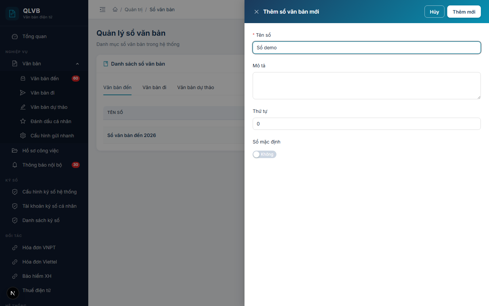

# Hướng dẫn sử dụng: Màn hình Quản trị > Sổ văn bản

Tài liệu này mô tả đầy đủ các chức năng có trong màn hình **Quản trị > Sổ văn bản** của hệ thống Quản lý văn bản điện tử (e-Office), giúp người dùng hiểu rõ cách sử dụng và quy trình nghiệp vụ.

---

## 1. Giới thiệu

Màn hình **Quản trị > Sổ văn bản** dùng để quản lý các **sổ văn bản** của đơn vị — đây là dữ liệu nền cốt lõi để cấp số cho **văn bản đến**, **văn bản đi** và **văn bản dự thảo**. Mỗi văn bản phát sinh trong hệ thống đều phải được vào một sổ tương ứng để theo dõi, lưu trữ và tra cứu sau này.

Sổ văn bản trong hệ thống được phân thành 3 nhóm theo loại nghiệp vụ:

- **Sổ văn bản đến** — dùng cho các văn bản gửi từ ngoài vào đơn vị.
- **Sổ văn bản đi** — dùng cho các văn bản đơn vị phát hành ra bên ngoài.
- **Sổ văn bản dự thảo** — dùng để theo dõi các bản thảo trong nội bộ trước khi phát hành.

Mỗi sổ thuộc về **một đơn vị** (đơn vị cấp Sở / Ban / Ngành — không thuộc phòng ban). Trong cùng một đơn vị và cùng một loại sổ, **mỗi sổ có thể được đánh dấu là "Sổ mặc định"** để hệ thống tự động đề xuất khi cán bộ vào sổ một văn bản mới. Trong mỗi nhóm chỉ có duy nhất một sổ mặc định tại một thời điểm.

Vì là dữ liệu gốc phục vụ toàn đơn vị nên màn hình này **chỉ dành cho tài khoản Quản trị hệ thống của đơn vị**. Người dùng thông thường không truy cập được vào đây.

> **Phạm vi xem dữ liệu**: Hệ thống tự động lọc các sổ thuộc đơn vị của tài khoản đang đăng nhập. Người dùng chỉ thấy sổ của đơn vị mình, không thấy sổ của đơn vị khác.

---

## 2. Bố cục màn hình

Màn hình được tổ chức theo cấu trúc một khu vực chính kèm phần đầu trang:

- **Phần đầu trang**: Hiển thị tiêu đề "Quản lý sổ văn bản" và dòng mô tả ngắn "Danh mục sổ văn bản trong hệ thống".
- **Khung "Danh sách sổ văn bản"**:
  - Tiêu đề khung có biểu tượng cuốn sổ (màu xanh teal) và chữ **Danh sách sổ văn bản**.
  - Nút **Thêm sổ văn bản** (biểu tượng dấu cộng, màu xanh) ở góc trên bên phải khung.
  - **Thanh chuyển nhóm sổ (tab)** ngay phía trên bảng, gồm 3 tab: **Văn bản đến**, **Văn bản đi**, **Văn bản dự thảo**. Bấm tab nào, bảng sẽ hiển thị các sổ thuộc nhóm đó.
  - Bảng dữ liệu hiển thị các sổ thuộc nhóm đang chọn của đơn vị đang đăng nhập.
  - Mỗi dòng có nút thao tác hình **ba chấm dọc** ở cột cuối cùng, chứa các lệnh: Sửa, Đặt mặc định, Xóa.
- **Cửa sổ phụ (Drawer / Modal)**:
  - **Drawer Thêm sổ văn bản mới / Cập nhật sổ văn bản** — mở ra từ bên phải khi bấm nút Thêm hoặc Sửa.
  - **Hộp xác nhận xóa** — mở khi bấm Xóa, yêu cầu xác nhận trước khi thực hiện.

---

## 3. Các cột trong Bảng danh sách sổ văn bản

| Tên cột | Mô tả |
|---|---|
| **Tên sổ** | Tên đầy đủ của sổ văn bản — hiển thị in đậm, màu xanh navy. Ví dụ: "Sổ văn bản đến năm 2026", "Sổ công văn đi". Nếu tên dài sẽ tự động cắt bớt và hiện đầy đủ khi rê chuột. |
| **Mô tả** | Mô tả thêm về phạm vi sử dụng của sổ. Nếu mô tả dài sẽ tự động cắt bớt. |
| **Thứ tự** | Số nguyên không âm dùng để sắp xếp thứ tự hiển thị của các sổ trong cùng một nhóm. Số nhỏ đứng trước. |
| **Mặc định** | Nhãn **Mặc định** (xanh lá) hoặc **Không**. Sổ mặc định là sổ được hệ thống tự động đề xuất khi cán bộ vào sổ một văn bản mới thuộc nhóm tương ứng. |
| (cột thao tác) | Nút ba chấm dọc, mở menu các lệnh: Sửa, Đặt mặc định, Xóa. |

> Bảng được sắp xếp theo **Thứ tự** tăng dần, sau đó theo **Tên sổ** theo bảng chữ cái.

---

## 4. Các trường nhập liệu trong cửa sổ Thêm / Cập nhật sổ văn bản

Khi bấm **Thêm sổ văn bản** hoặc **Sửa**, hệ thống mở cửa sổ phía bên phải màn hình với các trường sau:

| Tên trường | Bắt buộc | Mô tả & ràng buộc |
|---|---|---|
| **Tên sổ** | Có | Tên đầy đủ của sổ văn bản. Tối đa 200 ký tự. Ví dụ: "Sổ văn bản đến", "Sổ công văn đi năm 2026". **Tên sổ phải duy nhất trong cùng một đơn vị và cùng một nhóm sổ** — nếu trùng (không phân biệt chữ hoa / chữ thường), hệ thống sẽ báo lỗi "Tên sổ văn bản đã tồn tại trong đơn vị". Nếu để trống hệ thống báo "Nhập tên sổ văn bản". |
| **Mô tả** | Không | Mô tả thêm về phạm vi, mục đích sử dụng của sổ. Tối đa 500 ký tự, dạng vùng văn bản nhiều dòng. |
| **Thứ tự** | Không | Số nguyên không âm, dùng để sắp xếp thứ tự hiển thị các sổ trong cùng một nhóm. Số nhỏ hiển thị trước số lớn. Mặc định là 0. |
| **Sổ mặc định** | Không | Công tắc bật/tắt — quy định sổ này có phải là **sổ mặc định** của đơn vị cho nhóm sổ tương ứng hay không. Mặc định: tắt. **Trong cùng một đơn vị + cùng một nhóm chỉ có một sổ mặc định.** Khi bật công tắc này, sổ mặc định cũ (nếu có) sẽ tự động bị tắt. |

> **Lưu ý**: Sau khi điền xong, bấm **Thêm mới** (khi tạo) hoặc **Cập nhật** (khi sửa) ở góc trên bên phải cửa sổ. Các thông báo sai định dạng sẽ hiển thị ngay dưới ô nhập tương ứng để người dùng dễ phát hiện và sửa.

> **Lưu ý quan trọng**: **Nhóm sổ** (Văn bản đến / Văn bản đi / Văn bản dự thảo) và **Đơn vị sở hữu sổ** không xuất hiện trong cửa sổ nhập — hệ thống tự gán theo tab đang chọn và đơn vị của tài khoản đang đăng nhập. Vì vậy khi muốn thêm sổ cho nhóm nào, hãy chọn đúng tab tương ứng **trước khi** bấm Thêm sổ văn bản.

---

## 5. Các nút chức năng

| Nút | Vị trí | Khi nào hiển thị | Tác dụng |
|---|---|---|---|
| **Thêm sổ văn bản** | Góc trên bên phải khung danh sách | Luôn hiển thị | Mở cửa sổ Thêm sổ văn bản mới. Sổ mới sẽ thuộc nhóm tương ứng với **tab đang chọn** và thuộc đơn vị của tài khoản đang đăng nhập. |
| **Tab Văn bản đến / Văn bản đi / Văn bản dự thảo** | Phía trên bảng danh sách | Luôn hiển thị | Chuyển nhóm sổ đang xem. Bảng tự động tải lại danh sách sổ thuộc nhóm vừa chọn. |
| **Sửa** | Trong menu ba chấm trên mỗi dòng | Luôn hiển thị | Mở cửa sổ Cập nhật sổ văn bản với dữ liệu hiện có để chỉnh sửa. |
| **Đặt mặc định** | Trong menu ba chấm trên mỗi dòng | Luôn hiển thị | Đặt sổ này làm sổ mặc định trong nhóm đang xem của đơn vị. Đồng thời tự động tắt cờ mặc định ở sổ mặc định cũ (nếu có). |
| **Xóa** | Trong menu ba chấm trên mỗi dòng (mục cuối, màu đỏ) | Luôn hiển thị | Mở hộp xác nhận, sau đó xóa sổ văn bản. |
| **Thêm mới** / **Cập nhật** | Góc trên bên phải cửa sổ Thêm/Sửa | Trong cửa sổ Thêm/Sửa | Lưu dữ liệu vừa nhập. Nhãn nút thay đổi tùy theo đang Thêm mới hay Cập nhật. |
| **Hủy** | Góc trên bên phải cửa sổ Thêm/Sửa | Trong cửa sổ Thêm/Sửa | Đóng cửa sổ, không lưu thay đổi. |
| **Xóa** / **Hủy** trong hộp xác nhận | Trong hộp xác nhận xóa | Khi mở hộp xác nhận | **Xóa** (màu đỏ) — thực hiện xóa. **Hủy** — đóng hộp, không xóa. |

---

## 6. Quy trình thao tác chính

### 6.1. Thêm mới một sổ văn bản

1. Trên thanh tab phía trên bảng, **chọn đúng nhóm sổ** cần thêm: **Văn bản đến**, **Văn bản đi** hoặc **Văn bản dự thảo**.
2. Bấm nút **Thêm sổ văn bản** ở góc trên bên phải khung danh sách.
3. Trong cửa sổ Thêm sổ văn bản mới, điền:
   - **Tên sổ** (bắt buộc): tên đầy đủ, không trùng với sổ khác cùng nhóm trong đơn vị. Tối đa 200 ký tự.
   - **Mô tả** (tùy chọn): mô tả ngắn về phạm vi sử dụng của sổ. Tối đa 500 ký tự.
   - **Thứ tự**: thường để mặc định là 0 khi thêm mới.
   - **Sổ mặc định**: bật nếu muốn dùng sổ này làm sổ mặc định cho nhóm.
4. Bấm **Thêm mới**.
5. Hệ thống thông báo **"Thêm thành công"** và đóng cửa sổ. Bảng danh sách tự động cập nhật.

> Nếu khi thêm mới đã bật **Sổ mặc định**, hệ thống tự động bỏ cờ mặc định ở sổ trước đó (nếu có) trong cùng nhóm + cùng đơn vị.

### 6.2. Chỉnh sửa thông tin một sổ văn bản

1. Chuyển sang tab tương ứng (Văn bản đến / Văn bản đi / Văn bản dự thảo) để hiển thị sổ cần sửa.
2. Trên dòng tương ứng, bấm biểu tượng **ba chấm dọc** ở cột cuối → chọn **Sửa**.
3. Cửa sổ **Cập nhật sổ văn bản** mở ra với dữ liệu sẵn có. Sửa các thông tin cần thiết (Tên sổ, Mô tả, Thứ tự, Sổ mặc định).
4. Bấm **Cập nhật**.
5. Hệ thống thông báo **"Cập nhật thành công"** và đóng cửa sổ.

> Khi sửa, **không thể đổi nhóm sổ và không thể chuyển sổ sang đơn vị khác** — đây là các thuộc tính cố định khi sổ được tạo ra. Nếu cần đổi nhóm, hãy xóa sổ cũ và tạo sổ mới ở nhóm đúng.

### 6.3. Đặt một sổ làm sổ mặc định

1. Chuyển sang tab tương ứng.
2. Trên dòng sổ muốn đặt làm mặc định, bấm biểu tượng **ba chấm dọc** ở cột cuối.
3. Chọn **Đặt mặc định**.
4. Hệ thống thông báo **"Đặt mặc định thành công"**. Cột **Mặc định** trên bảng cập nhật ngay: dòng vừa chọn chuyển sang nhãn **Mặc định** (xanh lá), sổ mặc định cũ (nếu có) chuyển sang **Không**.

> **Khi nào nên đổi sổ mặc định?** Thường khi đầu năm mới chuyển sang dùng sổ năm mới, hoặc khi tách / gộp sổ theo nhu cầu nghiệp vụ của đơn vị. Trong cùng một nhóm sổ + cùng một đơn vị **chỉ có duy nhất một sổ mặc định tại một thời điểm**.

### 6.4. Xóa sổ văn bản

1. Chuyển sang tab tương ứng để tìm sổ cần xóa.
2. Bấm biểu tượng **ba chấm dọc** ở cột cuối → chọn **Xóa** (mục cuối cùng, màu đỏ).
3. Hộp xác nhận hiện ra với câu hỏi *"Bạn có chắc chắn muốn xóa sổ văn bản này?"*.

   
4. Bấm **Xóa** (màu đỏ) để xác nhận, hoặc **Hủy** để bỏ qua.
5. Nếu xóa thành công, hệ thống thông báo **"Xóa thành công"** và bảng tự động cập nhật.

> **Quan trọng**: Hệ thống thực hiện **xóa mềm** — sổ và toàn bộ dữ liệu liên quan vẫn được lưu trong cơ sở dữ liệu nhưng không còn xuất hiện trong danh sách. Các văn bản đã được vào sổ trước đó vẫn giữ nguyên thông tin tham chiếu sổ — đảm bảo dữ liệu lịch sử không bị phá vỡ.

> **Khuyến nghị**: Hạn chế xóa sổ đã có văn bản phát sinh. Thay vào đó, có thể đổi tên sổ (ví dụ thêm hậu tố "(không dùng)") hoặc tạo sổ mới và đặt làm sổ mặc định, để các văn bản mới không vào nhầm sổ cũ.

### 6.5. Chuyển giữa các nhóm sổ

1. Trên thanh tab phía trên bảng, bấm tên nhóm muốn xem: **Văn bản đến**, **Văn bản đi**, hoặc **Văn bản dự thảo**.
2. Bảng tự động tải lại, chỉ hiển thị các sổ thuộc nhóm vừa chọn (và thuộc đơn vị của tài khoản đang đăng nhập).
3. Mọi thao tác Thêm / Sửa / Xóa / Đặt mặc định sau đó đều áp dụng cho **nhóm đang chọn**.

---

## 7. Lưu ý / Ràng buộc nghiệp vụ

### 7.1. Phạm vi sổ — Đơn vị, không phải Phòng ban

Sổ văn bản luôn thuộc về **một đơn vị** (cấp Sở / Ban / Ngành), không thuộc phòng ban. Khi tài khoản đăng nhập là người của một phòng ban, hệ thống tự động xác định **đơn vị cấp trên** (đơn vị gốc theo cây tổ chức) làm chủ sở hữu sổ.

Điều này có nghĩa: dù một cán bộ thuộc phòng ban nào trong Sở A, các sổ mà cán bộ đó nhìn thấy ở màn hình này luôn là sổ của **toàn Sở A**, không phải của phòng ban riêng.

### 7.2. Phân nhóm sổ — Cố định khi tạo

Mỗi sổ văn bản thuộc về duy nhất một trong ba nhóm:

- **Văn bản đến** — phục vụ vào sổ các văn bản gửi đến đơn vị.
- **Văn bản đi** — phục vụ vào sổ các văn bản đơn vị phát hành.
- **Văn bản dự thảo** — phục vụ theo dõi các bản thảo nội bộ.

**Nhóm sổ được gán cố định khi tạo và không thể đổi sau đó**. Nhóm sổ tương ứng với tab đang chọn tại thời điểm bấm "Thêm sổ văn bản". Đây là lý do cần chọn đúng tab trước khi bấm Thêm.

### 7.3. Sổ mặc định — Quy tắc duy nhất

Trong cùng một **đơn vị + nhóm sổ**, **chỉ có duy nhất một sổ mặc định tại một thời điểm**. Khi đặt một sổ khác làm mặc định:

- Sổ mặc định cũ (nếu có) tự động bị tắt cờ mặc định.
- Sổ vừa chọn được bật cờ mặc định.

Cơ chế này áp dụng cả khi **bật công tắc Sổ mặc định trong cửa sổ Thêm/Sửa**, lẫn khi dùng lệnh **Đặt mặc định** trong menu ba chấm.

Sổ mặc định là sổ được hệ thống tự động đề xuất khi cán bộ vào sổ một văn bản mới ở các màn hình **Văn bản đến / Văn bản đi / Văn bản dự thảo**, giúp giảm thao tác nhập liệu thường ngày.

### 7.4. Tên sổ phải duy nhất trong phạm vi (đơn vị + nhóm)

Trong cùng một **đơn vị + nhóm sổ**, **mỗi tên sổ chỉ tồn tại một lần** (không phân biệt chữ hoa / chữ thường, không phân biệt khoảng trắng đầu/cuối). Khi nhập trùng, hệ thống báo:

> *"Tên sổ văn bản đã tồn tại trong đơn vị"*

Lỗi này hiển thị ngay tại ô **Tên sổ** trong cửa sổ nhập để người dùng dễ phát hiện.

Lưu ý: Hai sổ ở **hai nhóm khác nhau** (ví dụ một sổ ở Văn bản đến, một sổ ở Văn bản đi) có thể trùng tên — quy tắc duy nhất chỉ áp dụng trong cùng nhóm.

### 7.5. Xóa mềm — Bảo toàn dữ liệu lịch sử

Khi xóa, hệ thống chỉ ẩn sổ khỏi danh sách (xóa mềm). Các văn bản đã được vào sổ trước đó:

- Vẫn giữ nguyên tham chiếu tới sổ cũ.
- Vẫn tra cứu được trong các báo cáo và sổ thống kê.
- Vẫn truy xuất được khi xem chi tiết văn bản.

Nhờ vậy, việc xóa một sổ không phá vỡ dữ liệu lịch sử của các văn bản đã phát sinh.

### 7.6. Thứ tự sắp xếp

Số ở trường **Thứ tự** quyết định vị trí hiển thị của sổ trong bảng. Số nhỏ đứng trước số lớn. Khi nhiều sổ cùng số thứ tự, hệ thống tiếp tục sắp xếp theo **Tên sổ** theo bảng chữ cái.

Cùng quy tắc sắp xếp này được áp dụng ở **các ô chọn sổ** tại màn hình Văn bản đến / Văn bản đi — sổ có thứ tự nhỏ sẽ hiện trước trong danh sách thả xuống.

### 7.7. Bảng tổng hợp các thông báo của hệ thống

| Tình huống | Thông báo |
|---|---|
| Thêm sổ thành công | Thêm thành công |
| Cập nhật sổ thành công | Cập nhật thành công |
| Xóa sổ thành công | Xóa thành công |
| Đặt mặc định thành công | Đặt mặc định thành công |
| Để trống Tên sổ (nhập từ form) | Nhập tên sổ văn bản |
| Để trống Tên sổ (kiểm tra ở máy chủ) | Tên sổ văn bản là bắt buộc |
| Tên sổ chỉ có khoảng trắng / rỗng | Tên sổ văn bản không được để trống |
| Tên sổ vượt quá 200 ký tự | Tên sổ văn bản không được vượt quá 200 ký tự |
| Tên sổ trùng trong cùng đơn vị + nhóm | Tên sổ văn bản đã tồn tại trong đơn vị |
| Thiếu nhóm sổ khi tạo | Loại văn bản là bắt buộc |
| Sửa / Xóa sổ không tồn tại | Không tìm thấy sổ văn bản |
| Lỗi khi xóa | Lỗi khi xóa |
| Lỗi khi đặt mặc định | Lỗi khi đặt mặc định |
| Lỗi tải dữ liệu | Lỗi tải dữ liệu |

---

*Tài liệu được biên soạn dựa trên hệ thống thực tế đang triển khai. Mọi thắc mắc vui lòng liên hệ với đội phát triển để được hỗ trợ.*
