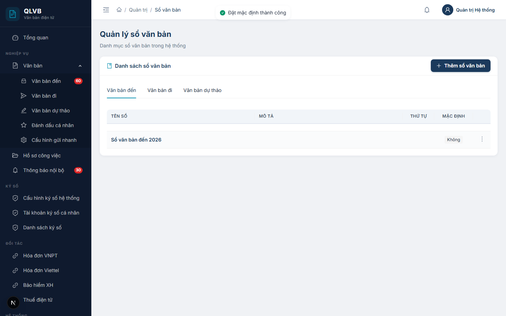
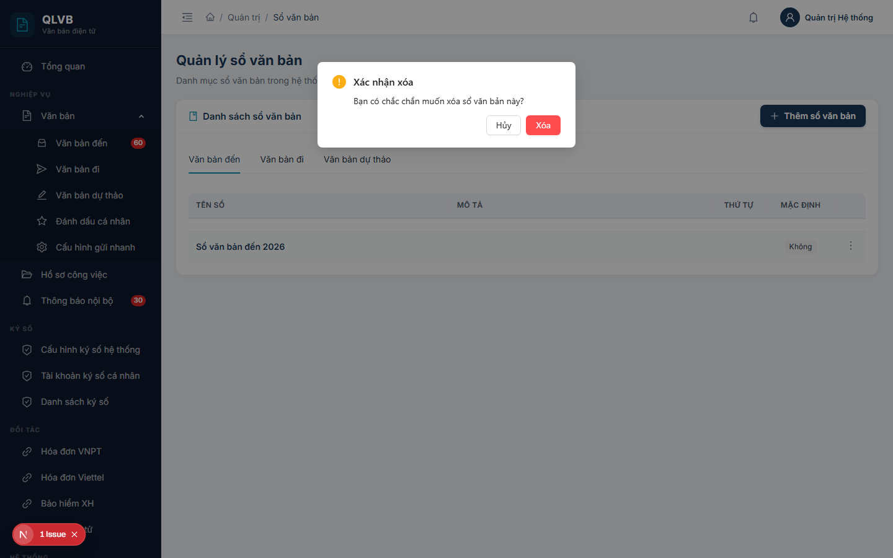

# Quản lý sổ văn bản

## 1. Giới thiệu

Sổ văn bản là danh mục dùng để phân loại và đánh số các loại văn bản đến, đi, dự thảo trong đơn vị. Mỗi nhóm văn bản (đến / đi / dự thảo) có thể có nhiều sổ khác nhau, trong đó mỗi nhóm chỉ có duy nhất một sổ được đặt làm mặc định. Sổ mặc định sẽ được hệ thống chọn sẵn khi người dùng tạo mới văn bản.

Người quản trị đơn vị sử dụng chức năng này để thêm, chỉnh sửa, xóa sổ và đặt sổ mặc định cho từng nhóm văn bản.

## 2. Quy trình thao tác và ràng buộc nghiệp vụ

- Sổ văn bản được tạo và quản lý theo từng đơn vị. Người dùng chỉ thấy danh sách sổ thuộc đơn vị mình đang đăng nhập.
- Có ba nhóm sổ tương ứng ba tab: Văn bản đến, Văn bản đi, Văn bản dự thảo. Khi thêm sổ mới, hệ thống sẽ tự gán nhóm theo tab đang chọn.
- Tên sổ là bắt buộc và không được trùng lặp trong cùng đơn vị, cùng nhóm.
- Tên sổ tối đa 200 ký tự, mô tả tối đa 500 ký tự.
- Trường thứ tự nhận giá trị nguyên không âm, dùng để sắp xếp khi hiển thị trong các form chọn sổ.
- Mỗi nhóm chỉ có duy nhất một sổ mặc định. Khi đặt một sổ làm mặc định, sổ mặc định cũ trong cùng nhóm sẽ tự động bỏ đánh dấu.
- Khi tạo văn bản mới, hệ thống sẽ chọn sẵn sổ mặc định, người dùng vẫn có thể đổi sang sổ khác trước khi lưu.

## 3. Các màn hình chức năng

### 3.1. Màn hình danh sách

#### Bố cục màn hình

- Khu vực trên cùng: tiêu đề "Quản lý sổ văn bản" và mô tả ngắn.
- Thẻ "Danh sách sổ văn bản" gồm:
  - Hàng tab phân nhóm: Văn bản đến / Văn bản đi / Văn bản dự thảo.
  - Bảng danh sách các sổ thuộc nhóm đang chọn.
  - Nút "Thêm sổ văn bản" ở góc phải tiêu đề thẻ.

#### Các nút chức năng

| Nút | Vị trí | Khi nào hiển thị | Tác dụng |
|---|---|---|---|
| Thêm sổ văn bản | Góc phải tiêu đề thẻ | Luôn hiển thị | Mở hộp thoại Thêm sổ văn bản |
| Tab Văn bản đến / đi / dự thảo | Phía trên bảng | Luôn hiển thị | Lọc danh sách theo nhóm văn bản tương ứng |
| Biểu tượng ba chấm dọc | Cuối mỗi dòng | Luôn hiển thị | Mở menu chứa: Sửa, Đặt mặc định, Xóa |
| Sửa | Trong menu ba chấm | Luôn hiển thị | Mở hộp thoại Cập nhật sổ văn bản |
| Đặt mặc định | Trong menu ba chấm | Luôn hiển thị | Đặt sổ này làm sổ mặc định của nhóm hiện tại |
| Xóa | Trong menu ba chấm | Luôn hiển thị | Mở hộp xác nhận xóa |

#### Các cột / trường dữ liệu

| Cột | Ý nghĩa |
|---|---|
| Tên sổ | Tên sổ văn bản, hiển thị in đậm màu xanh đậm |
| Mô tả | Mô tả chi tiết của sổ |
| Thứ tự | Số thứ tự dùng để sắp xếp khi hiển thị |
| Mặc định | Nhãn "Mặc định" (xanh) nếu là sổ mặc định, ngược lại hiển thị "Không" |

#### Thông báo của hệ thống

| Tình huống | Thông báo |
|---|---|
| Đặt mặc định thành công | Đặt mặc định thành công |
| Lỗi khi đặt mặc định | Lỗi khi đặt mặc định |
| Lỗi khi tải danh sách | Lỗi tải dữ liệu |

### 3.2. Hộp thoại Thêm / Cập nhật sổ văn bản

#### Bố cục màn hình

- Hộp thoại trượt từ phải sang, tiêu đề "Thêm sổ văn bản mới" (khi thêm) hoặc "Cập nhật sổ văn bản" (khi sửa).
- Thân hộp thoại chứa các trường nhập theo chiều dọc: Tên sổ, Mô tả, Thứ tự, Sổ mặc định.
- Phần đầu hộp thoại có hai nút Hủy và Thêm mới / Cập nhật.

#### Các nút chức năng

| Nút | Vị trí | Khi nào hiển thị | Tác dụng |
|---|---|---|---|
| Hủy | Góc phải đầu hộp thoại | Luôn hiển thị | Đóng hộp thoại, không lưu thay đổi |
| Thêm mới | Góc phải đầu hộp thoại | Khi đang thêm | Lưu sổ mới và đóng hộp thoại |
| Cập nhật | Góc phải đầu hộp thoại | Khi đang sửa | Lưu thay đổi và đóng hộp thoại |

#### Các trường nhập

| Trường | Bắt buộc | Mô tả |
|---|---|---|
| Tên sổ | Có | Tối đa 200 ký tự, gợi ý "VD: Sổ văn bản đến" |
| Mô tả | Không | Tối đa 500 ký tự, dạng văn bản nhiều dòng |
| Thứ tự | Không | Số nguyên không âm, mặc định 0 |
| Sổ mặc định | Không | Công tắc Có / Không, mặc định Không |

#### Thông báo của hệ thống

| Tình huống | Thông báo |
|---|---|
| Bỏ trống tên sổ | Nhập tên sổ văn bản |
| Tên sổ vượt quá độ dài cho phép | Tên sổ văn bản không được vượt quá 200 ký tự |
| Tên sổ đã tồn tại trong đơn vị | Tên sổ văn bản đã tồn tại trong đơn vị |
| Thiếu nhóm văn bản | Loại văn bản là bắt buộc |
| Thêm thành công | Thêm thành công |
| Cập nhật thành công | Cập nhật thành công |

### 3.3. Hộp xác nhận đặt mặc định

#### Bố cục màn hình

Khi người dùng chọn "Đặt mặc định" trong menu ba chấm, hệ thống thực hiện thao tác trực tiếp và hiển thị thông báo. Sổ mặc định cũ trong cùng nhóm tự động chuyển về trạng thái "Không".

#### Thông báo của hệ thống

| Tình huống | Thông báo |
|---|---|
| Đặt mặc định thành công | Đặt mặc định thành công |
| Đặt mặc định thất bại | Lỗi khi đặt mặc định |

### 3.4. Hộp xác nhận xóa

#### Bố cục màn hình

- Hộp thoại nổi giữa màn hình, tiêu đề "Xác nhận xóa".
- Nội dung: "Bạn có chắc chắn muốn xóa sổ văn bản này?".
- Hai nút: Hủy và Xóa (màu đỏ).

#### Các nút chức năng

| Nút | Vị trí | Khi nào hiển thị | Tác dụng |
|---|---|---|---|
| Hủy | Góc phải dưới | Luôn hiển thị | Đóng hộp thoại, không xóa |
| Xóa | Góc phải dưới, màu đỏ | Luôn hiển thị | Thực hiện xóa sổ và đóng hộp thoại |

#### Thông báo của hệ thống

| Tình huống | Thông báo |
|---|---|
| Xóa thành công | Xóa thành công |
| Xóa thất bại | Lỗi khi xóa |
