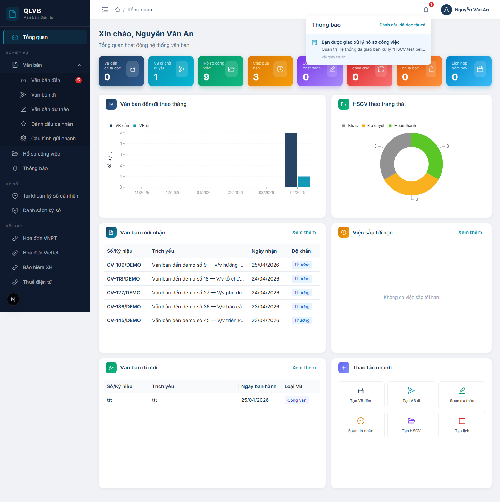
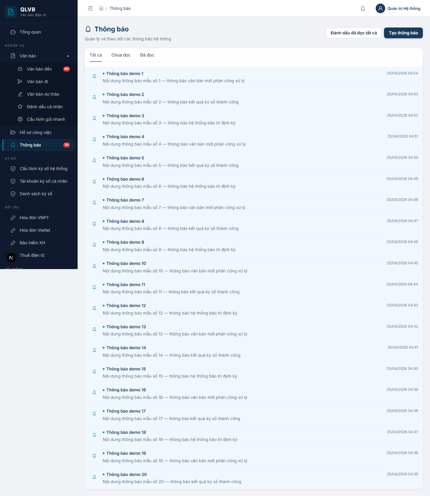

# Thông báo nội bộ

## 1. Giới thiệu

Hệ thống có hai vùng thông báo độc lập, phục vụ hai mục đích khác nhau:

- **Chuông thông báo cá nhân (Bell)** — biểu tượng chuông ở góc trên bên phải của thanh tiêu đề (header). Đây là kênh **thông báo cá nhân tự động** do hệ thống sinh ra cho từng người dùng (ví dụ: ký số thành công, ký số thất bại, được giao xử lý văn bản đến, được giao việc, lãnh đạo có ý kiến chỉ đạo). Mỗi người dùng chỉ thấy thông báo của riêng mình.
- **Trang Thông báo nội bộ** (`/thong-bao`) — danh sách các **thông báo do người (Quản trị viên) tự soạn** cho toàn đơn vị: thông báo họp, thông báo bảo trì hệ thống, thông báo nghỉ lễ, hướng dẫn... Mọi cán bộ trong cùng đơn vị đều thấy chung một danh sách này.

Nhân sự sử dụng:
- **Mọi cán bộ** đều có chuông thông báo cá nhân và đều có thể đọc danh sách Thông báo nội bộ.
- **Quản trị viên** có thêm quyền soạn thông báo mới ở trang Thông báo nội bộ.

Khi có thông báo mới gửi tới (qua kết nối thời gian thực với máy chủ), chuông sẽ hiện chấm đỏ kèm số đếm và một ô **toast** nhỏ trượt từ góc phải màn hình trong khoảng 3 giây.

## 2. Quy trình thao tác và ràng buộc nghiệp vụ

**Quy trình theo dõi thông báo cá nhân (chuông):**

1. Quan sát chấm đỏ trên biểu tượng chuông ở header — số trên chấm đỏ là số thông báo chưa đọc (hiển thị tối đa 99+).
2. Bấm vào biểu tượng chuông để mở dropdown hiển thị 10 thông báo gần nhất.
3. Bấm vào một dòng thông báo — hệ thống tự đánh dấu là đã đọc và chuyển đến trang liên quan (nếu có liên kết).
4. Bấm **Đánh dấu đã đọc tất cả** ở góc trên bên phải dropdown để xóa toàn bộ chấm đỏ.

**Quy trình theo dõi Thông báo nội bộ:**

1. Vào menu **Thông báo nội bộ** (hoặc bấm thẻ "Thông báo chưa đọc" trên Tổng quan).
2. Lọc theo tab **Tất cả / Chưa đọc / Đã đọc** để xem nhóm tương ứng.
3. Bấm vào một dòng thông báo chưa đọc — hệ thống tự đánh dấu là đã đọc.
4. Bấm **Đánh dấu đã đọc tất cả** để đánh dấu toàn bộ thông báo của đơn vị mình là đã đọc.

**Quy trình tạo Thông báo nội bộ (chỉ Quản trị viên):**

1. Ở trang Thông báo nội bộ, bấm **Tạo thông báo** ở góc phải đầu trang. Drawer "Tạo thông báo mới" mở ra.
2. Nhập **Tiêu đề** (tối đa 300 ký tự) và **Nội dung** (tối đa 5000 ký tự).
3. Bấm **Tạo thông báo** trong drawer để gửi.
4. Sau khi tạo, danh sách tự cập nhật. Toàn bộ cán bộ trong đơn vị sẽ thấy thông báo mới ở dòng đầu danh sách.

**Ràng buộc nghiệp vụ:**

- **Quyền tạo Thông báo nội bộ**: chỉ tài khoản có quyền **Quản trị viên** thấy nút **Tạo thông báo**.
- **Phạm vi nhìn thấy**: Thông báo nội bộ được phát hành cho **đơn vị cấp gốc** chứa phòng ban của người tạo. Người dùng thuộc cùng đơn vị (kể cả các phòng ban con) đều thấy chung. Người dùng đơn vị khác **không thấy**.
- **Đánh dấu đã đọc**: thực hiện trên từng người dùng — mỗi cán bộ có trạng thái đọc/chưa đọc riêng cho từng thông báo của đơn vị.
- **Người tạo lấy từ phiên đăng nhập**: hệ thống tự ghi nhận người tạo từ tài khoản đang đăng nhập, không cho phép giả mạo người tạo.
- **Toast thời gian thực**: khi đang online, có thông báo mới sẽ hiện ô toast trượt 3 giây ở góc phải. Thông báo cá nhân (chuông) cũng đồng thời tăng số đếm chấm đỏ.

## 3. Các màn hình chức năng

### 3.1. Chuông thông báo cá nhân ở header

#### Bố cục màn hình

- **Biểu tượng chuông**: nằm ở góc trên bên phải của thanh tiêu đề chính. Khi có thông báo chưa đọc, một chấm đỏ nhỏ chứa số đếm xuất hiện ở góc trên phải biểu tượng (tối đa hiển thị `99+`).
- **Dropdown khi bấm chuông**: khung trắng bo góc, đổ bóng nhẹ, chiều rộng cố định, mở từ phía dưới biểu tượng chuông. Có 3 phần:
  - Phần đầu: dòng tiêu đề **"Thông báo"** ở trái và liên kết **Đánh dấu đã đọc tất cả** ở phải.
  - Phần thân: tối đa 10 dòng thông báo gần nhất, mỗi dòng gồm biểu tượng theo loại + tiêu đề + nội dung tóm tắt + thời gian tương đối (ví dụ: *"5 phút trước"*).
  - Khi đang tải: con quay loading ở giữa.
  - Khi không có thông báo: biểu tượng rỗng và dòng *"Không có thông báo"*.

#### Các nút chức năng

| Nút | Vị trí | Khi nào hiển thị | Tác dụng |
|---|---|---|---|
| **Biểu tượng chuông** | Header (góc trên phải) | Luôn (sau khi đăng nhập) | Mở/đóng dropdown thông báo cá nhân. |
| **Đánh dấu đã đọc tất cả** | Góc phải đầu dropdown | Luôn (vô hiệu khi không có thông báo chưa đọc) | Đánh dấu toàn bộ thông báo cá nhân là đã đọc, đặt số chấm đỏ về 0. |
| **Một dòng thông báo** | Trong dropdown | Khi danh sách có dữ liệu | Đánh dấu thông báo đó là đã đọc và chuyển đến trang liên quan (nếu có liên kết kèm theo). Đóng dropdown. |

#### Các trường dữ liệu (mỗi dòng thông báo)

| Tên trường | Mô tả |
|---|---|
| Biểu tượng loại | Mỗi loại có một biểu tượng riêng: dấu tích xanh (ký số thành công), dấu chéo đỏ (ký số thất bại), tài liệu xanh navy (được giao VB đến), giấy tờ teal (được giao việc), bút chì cam (lãnh đạo có ý kiến). Loại khác: chuông xanh teal mặc định. |
| Tiêu đề | Tiêu đề thông báo, in đậm nếu chưa đọc. Cắt một dòng nếu dài. |
| Nội dung tóm tắt | Mô tả ngắn dưới tiêu đề. Cắt một dòng. |
| Thời gian tương đối | Hiển thị dạng "vừa xong", "5 phút trước", "2 giờ trước"... theo tiếng Việt. |

#### Thông báo của hệ thống

| Tình huống | Thông báo |
|---|---|
| Dropdown không có dữ liệu | Không có thông báo |
| Toast khi nhận sự kiện ký số thành công | Ký số thành công — Giao dịch #[mã] đã hoàn tất |
| Toast khi giao dịch ký số bị hết hạn | Ký số hết hạn |
| Toast khi giao dịch ký số bị hủy | Đã hủy ký số |
| Toast khi ký số gặp lỗi khác | Ký số thất bại |
| Toast khi nhận thông báo mới (giao việc, ý kiến chỉ đạo...) | Tiêu đề + mô tả của thông báo |

### 3.2. Trang danh sách Thông báo nội bộ

#### Bố cục màn hình

- **Phần đầu trang**: tiêu đề **"Thông báo nội bộ"** kèm biểu tượng chuông và dòng mô tả *"Quản lý và theo dõi các thông báo nội bộ của đơn vị"*. Bên phải có hai nút thao tác **Đánh dấu đã đọc tất cả** và **Tạo thông báo** (chỉ Quản trị viên).
- **Thẻ danh sách**: thẻ trắng bo góc, có hai phần:
  - Hàng tab lọc trên cùng: **Tất cả / Chưa đọc / Đã đọc**.
  - Phần thân: danh sách thông báo dạng dòng, mỗi dòng có biểu tượng chuông tròn, tiêu đề, nội dung tóm tắt 2 dòng và thời gian tạo bên phải. Thông báo chưa đọc có chấm xanh và tiêu đề in đậm; thông báo đã đọc hiển thị nhạt hơn.
  - Phân trang ở cuối nếu tổng số thông báo vượt 20 dòng.
- **Trạng thái rỗng**: khi không có thông báo, hiển thị biểu tượng chuông xám lớn ở giữa cùng dòng *"Chưa có thông báo"* và *"Hệ thống sẽ thông báo khi có văn bản mới hoặc việc được giao."*

#### Các nút chức năng

| Nút | Vị trí | Khi nào hiển thị | Tác dụng |
|---|---|---|---|
| **Đánh dấu đã đọc tất cả** | Góc phải đầu trang | Luôn | Đánh dấu mọi thông báo nội bộ trong phạm vi đơn vị mình là đã đọc. Trong khi xử lý, nút chuyển sang loading. |
| **Tạo thông báo** | Góc phải đầu trang | Chỉ khi tài khoản có quyền **Quản trị viên** | Mở drawer "Tạo thông báo mới". |
| **Tab Tất cả / Chưa đọc / Đã đọc** | Đầu thẻ danh sách | Luôn | Lọc danh sách theo trạng thái đọc. Khi đổi tab, danh sách tải lại từ trang 1. |
| **Một dòng thông báo (chưa đọc)** | Trong danh sách | Khi tab cho phép | Đánh dấu thông báo đó là đã đọc — chấm xanh và đậm chữ biến mất, không chuyển trang. |
| **Phân trang** | Cuối thẻ | Khi tổng số > 20 | Chuyển trang. Mỗi trang 20 dòng. |

#### Các cột / trường dữ liệu

| Tên trường | Mô tả |
|---|---|
| Biểu tượng | Hình tròn nhạt với biểu tượng chuông teal — đánh dấu đây là một thông báo nội bộ. |
| Tiêu đề | Tiêu đề thông báo. In đậm nếu chưa đọc, có thêm chấm xanh phía trước. |
| Nội dung tóm tắt | Hai dòng đầu của nội dung, bị cắt với dấu `...` nếu dài. |
| Thời gian tạo | Bên phải dòng. Hiển thị định dạng `DD/MM/YYYY HH:mm`. |

#### Thông báo của hệ thống

| Tình huống | Thông báo |
|---|---|
| Đánh dấu đã đọc tất cả thành công | Đã đánh dấu tất cả là đã đọc |
| Đánh dấu đã đọc tất cả thất bại | Thao tác thất bại. Vui lòng thử lại. |
| Danh sách trống | Chưa có thông báo + dòng phụ "Hệ thống sẽ thông báo khi có văn bản mới hoặc việc được giao." |

### 3.3. Drawer Tạo thông báo (Quản trị viên)

#### Bố cục màn hình

- Drawer trượt từ phải, rộng 720px, có dải gradient xanh navy ở phần đầu. Tiêu đề **"Tạo thông báo mới"** ở góc trái đầu drawer.
- Phần đầu drawer (extra) có hai nút **Hủy** (viền trắng trên nền gradient) và **Tạo thông báo** (nút đặc, màu sáng).
- Phần thân: form 2 trường dọc — Tiêu đề (input một dòng kèm bộ đếm ký tự), Nội dung (vùng nhập 6 dòng kèm bộ đếm ký tự).
- Drawer chỉ mở được nếu tài khoản có quyền Quản trị viên (vì nút **Tạo thông báo** chỉ hiển thị với nhóm này).

#### Các nút chức năng

| Nút | Vị trí | Khi nào hiển thị | Tác dụng |
|---|---|---|---|
| **Tạo thông báo** | Góc phải đầu drawer | Luôn (khi drawer mở) | Kiểm tra ràng buộc → gửi yêu cầu tạo thông báo. Trong khi xử lý, nút chuyển sang loading. Thành công → đóng drawer, xóa form, tải lại danh sách. |
| **Hủy** | Góc phải đầu drawer (cạnh Tạo) | Luôn (khi drawer mở) | Đóng drawer mà không tạo gì. |
| **Đóng (X)** | Góc trên trái drawer | Luôn | Đóng drawer mà không tạo gì. |

#### Các trường nhập

| Tên trường | Bắt buộc | Mô tả & ràng buộc |
|---|---|---|
| **Tiêu đề** | Có | Tối đa 300 ký tự. Bộ đếm ký tự hiển thị ở góc phải ô nhập. Bỏ trống → *"Vui lòng nhập tiêu đề"*. Vượt 300 ký tự sẽ bị từ chối ở máy chủ. |
| **Nội dung** | Có | Vùng nhập 6 dòng. Tối đa 5000 ký tự, có bộ đếm. Bỏ trống → *"Vui lòng nhập nội dung"*. |

#### Thông báo của hệ thống

| Tình huống | Thông báo |
|---|---|
| Bỏ trống ô Tiêu đề | Vui lòng nhập tiêu đề |
| Bỏ trống ô Nội dung | Vui lòng nhập nội dung |
| Tiêu đề rỗng (sau khi xóa khoảng trắng) ở máy chủ | Tiêu đề thông báo là bắt buộc |
| Tiêu đề vượt quá 300 ký tự | Tiêu đề không được vượt quá 300 ký tự |
| Nội dung rỗng (sau khi xóa khoảng trắng) ở máy chủ | Nội dung thông báo là bắt buộc |
| Tạo thông báo thành công | Tạo thông báo thành công |
| Tạo thông báo thất bại do lỗi không xác định | Tạo thông báo thất bại. Vui lòng thử lại. |
