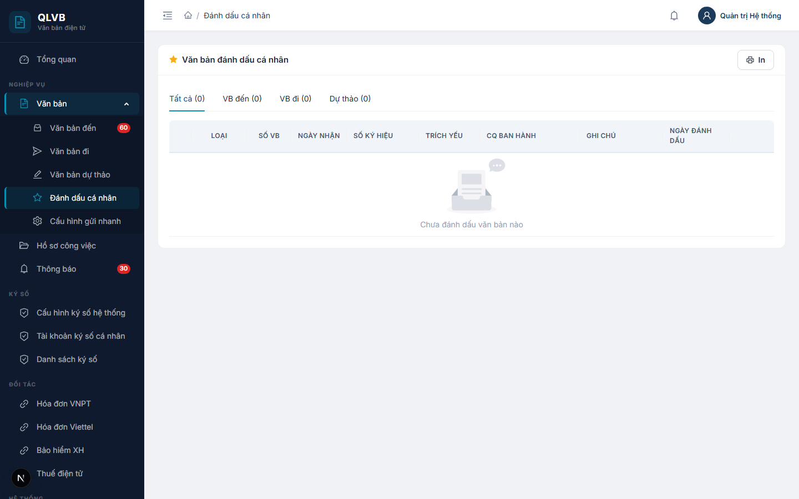

# Hướng dẫn sử dụng: Màn hình Văn bản đánh dấu cá nhân

Tài liệu này mô tả đầy đủ các chức năng có trong màn hình **Văn bản đánh dấu cá nhân** (đường dẫn `/van-ban-danh-dau`) của hệ thống Quản lý văn bản điện tử (e-Office), giúp người dùng hiểu rõ cách sử dụng và quy trình nghiệp vụ.

---

## 1. Giới thiệu

Trong quá trình xử lý công việc hằng ngày, mỗi cán bộ thường có một số văn bản cần theo dõi sát hoặc thường xuyên tra cứu lại — ví dụ: văn bản chỉ đạo của lãnh đạo, văn bản liên quan đến việc đang xử lý, văn bản cần đối chiếu khi soạn thảo. Màn hình **Văn bản đánh dấu cá nhân** giúp mỗi người **tự gom các văn bản quan trọng của mình vào một danh sách riêng**, giống như “đánh dấu sao” trong hộp thư điện tử, để truy cập nhanh thay vì phải tìm lại trong các sổ văn bản.

Đây là **danh sách cá nhân** — chỉ chính người dùng đăng nhập mới nhìn thấy các văn bản mình đã đánh dấu. Việc đánh dấu hay bỏ đánh dấu của người này **không** ảnh hưởng đến danh sách của người khác và **không** thay đổi nội dung văn bản gốc.

Màn hình này gom chung 3 loại văn bản: **văn bản đến**, **văn bản đi** và **văn bản dự thảo**. Việc đánh dấu một văn bản được thực hiện ngay tại màn hình chi tiết của văn bản đó (xem mục 6), còn màn hình này chỉ là nơi **tra cứu, sắp xếp và bỏ đánh dấu**.

---

## 2. Bố cục màn hình

Màn hình gồm các khu vực chính sau:

- **Phần đầu trang**: Tiêu đề **“Văn bản đánh dấu cá nhân”** kèm biểu tượng ngôi sao vàng. Góc trên bên phải có nút **In** (biểu tượng máy in) để in danh sách hiện tại ra giấy.
- **Thanh phân loại (tab)**: Ngay dưới tiêu đề, gồm 4 tab — **Tất cả**, **VB đến**, **VB đi**, **Dự thảo**. Mỗi tab kèm số đếm trong ngoặc, ví dụ *“VB đến (12)”* để biết nhanh số lượng văn bản đã đánh dấu theo từng loại.
- **Bảng danh sách**: Hiển thị các văn bản đã đánh dấu, **sắp xếp ưu tiên các văn bản gắn cờ Quan trọng lên trên, sau đó đến các văn bản có ngày đánh dấu mới nhất**.
- **Khi chưa đánh dấu văn bản nào**: Bảng hiển thị thông báo *“Chưa đánh dấu văn bản nào”*.

Bảng có phân trang **20 dòng / trang**, dưới chân bảng hiển thị tổng số văn bản (ví dụ *“Tổng 35 văn bản”*).

---

## 3. Các cột trong bảng danh sách

| Tên cột | Mô tả |
|---|---|
| (cột đầu — biểu tượng ngôi sao) | Ngôi sao vàng (đặc) nếu văn bản được đánh dấu là **Quan trọng**, ngôi sao xám (rỗng) nếu chỉ đánh dấu thường. Bấm vào để bật / tắt cờ Quan trọng. Tooltip hiển thị **“Đánh dấu quan trọng”** hoặc **“Bỏ quan trọng”** tùy trạng thái. |
| **Loại** | Nhãn màu phân biệt loại văn bản: **VB đến** (xanh dương), **VB đi** (xanh lá), **VB dự thảo** (cam). |
| **Số VB** | Số văn bản (số thứ tự trong sổ — ví dụ 125). |
| **Ngày nhận** | Ngày nhận / ngày văn bản, định dạng `DD/MM/YYYY`. |
| **Số ký hiệu** | Số ký hiệu của văn bản (ví dụ `123/QĐ-UBND`). |
| **Trích yếu** | Trích yếu nội dung văn bản. **Bấm vào trích yếu để mở thẳng màn hình chi tiết của văn bản tương ứng.** Nếu trích yếu dài sẽ tự động cắt bớt và hiện đầy đủ khi rê chuột. |
| **CQ ban hành** | Tên cơ quan ban hành (với VB đến) hoặc đơn vị soạn thảo (với VB đi / dự thảo). Nếu dài sẽ tự động cắt bớt. |
| **Ghi chú** | Ghi chú cá nhân của người dùng khi đánh dấu (nếu có). Để trống nếu khi đánh dấu không nhập ghi chú. Nếu dài sẽ tự động cắt bớt. |
| **Ngày đánh dấu** | Ngày người dùng đánh dấu văn bản này, định dạng `DD/MM/YYYY`. |
| (cột cuối — thao tác) | Hai nút: **Xem** (biểu tượng con mắt) và **Bỏ đánh dấu** (biểu tượng thùng rác, màu đỏ). Xem mục 5. |

> **Lưu ý**: Hệ thống hiện chưa có ô **tìm kiếm tự do** trên màn hình này. Để thu hẹp danh sách, sử dụng các tab phân loại ở phần trên (mục 4).

---

## 4. Phân loại theo tab

Phía trên bảng có 4 tab để lọc danh sách theo loại văn bản:

| Tab | Tác dụng |
|---|---|
| **Tất cả** | Hiển thị toàn bộ văn bản đã đánh dấu, không phân biệt loại. Số trong ngoặc là tổng số. |
| **VB đến** | Chỉ hiển thị các văn bản đến đã đánh dấu. |
| **VB đi** | Chỉ hiển thị các văn bản đi đã đánh dấu. |
| **Dự thảo** | Chỉ hiển thị các văn bản dự thảo đã đánh dấu. |

Bấm vào tab nào, bảng bên dưới chỉ hiển thị các văn bản loại đó. Số đếm trên mỗi tab được cập nhật ngay sau khi đánh dấu mới hoặc bỏ đánh dấu.

---

## 5. Các nút chức năng

| Nút | Vị trí | Tác dụng |
|---|---|---|
| **In** (biểu tượng máy in) | Góc trên bên phải khung | Mở hộp thoại in của trình duyệt với danh sách văn bản đang hiển thị (theo tab đang chọn). Bản in có tiêu đề **“VĂN BẢN ĐÁNH DẤU CÁ NHÂN”**, ngày in, các cột chính (STT, Loại, Số VB, Ngày, Số ký hiệu, Trích yếu, CQ ban hành, Ghi chú) và dòng tổng kết *“Tổng: N văn bản”*. |
| **Ngôi sao** (đặc / rỗng) | Cột đầu mỗi dòng | Bật / tắt cờ **Quan trọng** cho văn bản. Khi bật, văn bản đó được đẩy lên đầu danh sách. |
| **Trích yếu** (dạng đường dẫn) | Cột Trích yếu | Mở màn hình chi tiết của văn bản tương ứng (VB đến / VB đi / Dự thảo). |
| **Xem** (biểu tượng con mắt) | Cột cuối mỗi dòng | Mở màn hình chi tiết của văn bản — tương đương bấm vào trích yếu. |
| **Bỏ đánh dấu** (biểu tượng thùng rác đỏ) | Cột cuối mỗi dòng | Gỡ văn bản ra khỏi danh sách đánh dấu cá nhân. Hệ thống thông báo **“Đã bỏ đánh dấu”**, dòng đó biến mất khỏi bảng. |

> **Lưu ý**: Trên màn hình này **không có** nút Thêm mới. Việc đánh dấu một văn bản bắt buộc phải thực hiện từ màn hình chi tiết của văn bản đó (xem mục 6).

---

## 6. Cách đánh dấu một văn bản

Việc đánh dấu được thực hiện **ngay trên màn hình chi tiết của văn bản**, không phải trên màn hình này. Quy trình như sau:

### 6.1. Mở màn hình chi tiết văn bản

- Vào menu **Văn bản đến** (`/van-ban-den`), **Văn bản đi** (`/van-ban-di`) hoặc **Văn bản dự thảo** (`/van-ban-du-thao`).
- Bấm vào trích yếu của văn bản cần đánh dấu để mở màn hình chi tiết.

### 6.2. Bấm biểu tượng ngôi sao

Trên màn hình chi tiết văn bản, ở phần đầu trang có **biểu tượng ngôi sao**:

- **Ngôi sao rỗng (xám)**: Văn bản chưa được đánh dấu. Bấm để **đánh dấu**.
- **Ngôi sao đặc (vàng)**: Văn bản đã được đánh dấu. Bấm để **bỏ đánh dấu**.

Sau khi bấm, hệ thống hiển thị thông báo **“Đã đánh dấu”** hoặc **“Đã bỏ đánh dấu”** tương ứng, và biểu tượng ngôi sao đổi trạng thái ngay.

### 6.3. Kiểm tra lại trên màn hình Văn bản đánh dấu cá nhân

Quay về menu **Văn bản đánh dấu cá nhân** — văn bản vừa đánh dấu sẽ xuất hiện trong danh sách. Nếu chưa thấy, có thể tải lại trang (F5).

> **Lưu ý**:
> - Việc đánh dấu là **của riêng từng tài khoản**. Người khác mở cùng văn bản đó sẽ không thấy đánh dấu của bạn.
> - Khi đánh dấu lần đầu, văn bản được đưa vào danh sách ở chế độ **thường** (ngôi sao xám). Để chuyển sang **Quan trọng** (đẩy lên đầu danh sách), bấm vào ngôi sao ở cột đầu trên màn hình **Văn bản đánh dấu cá nhân**.

---

## 7. Lưu ý / Ràng buộc nghiệp vụ

### 7.1. Phạm vi cá nhân — không chia sẻ

Danh sách đánh dấu chỉ thuộc về tài khoản đăng nhập hiện tại. Hệ thống lưu mỗi đánh dấu gắn với người dùng cụ thể, nên hai người dùng khác nhau sẽ có hai danh sách hoàn toàn riêng biệt, dù cùng truy cập một văn bản.

### 7.2. Đánh dấu không thay thế chức năng tìm kiếm

Đây là công cụ **tra nhanh** dành cho các văn bản người dùng tự chọn — không phải tính năng thay thế cho việc tìm kiếm trong các sổ văn bản chính. Khi cần tra cứu theo điều kiện (số ký hiệu, ngày, cơ quan ban hành...) vẫn nên dùng các bộ lọc tại các màn hình **Văn bản đến / Văn bản đi / Văn bản dự thảo**.

### 7.3. Hai mức đánh dấu: Thường và Quan trọng

- **Đánh dấu thường** (ngôi sao xám trong cột đầu): chỉ là “bookmark” đơn thuần, văn bản nằm trong danh sách theo thứ tự **ngày đánh dấu mới nhất**.
- **Đánh dấu quan trọng** (ngôi sao vàng trong cột đầu): văn bản được **đẩy lên đầu danh sách**, hiển thị trước tất cả các văn bản đánh dấu thường.

Có thể chuyển qua lại giữa hai mức bằng cách bấm trực tiếp vào ngôi sao ở cột đầu mỗi dòng.

### 7.4. Bỏ đánh dấu không xóa văn bản gốc

Thao tác **Bỏ đánh dấu** (biểu tượng thùng rác đỏ) chỉ gỡ văn bản ra khỏi danh sách cá nhân — văn bản gốc vẫn còn nguyên trong sổ và vẫn truy cập được như bình thường ở các màn hình **Văn bản đến / Văn bản đi / Văn bản dự thảo**. Có thể đánh dấu lại bất kỳ lúc nào.

### 7.5. Ghi chú đi kèm đánh dấu

Khi bấm ngôi sao trên màn hình chi tiết **Văn bản đến / Văn bản đi / Văn bản dự thảo**, hệ thống chỉ thực hiện thao tác bật/tắt đánh dấu — **không có ô để người dùng nhập ghi chú** đi kèm. Vì vậy, cột **Ghi chú** trên bảng tại màn hình này sẽ luôn để trống đối với các đánh dấu được tạo từ nút ngôi sao. Trường ghi chú vẫn được giữ trong cấu trúc dữ liệu để dự phòng cho các tính năng mở rộng sau (ví dụ: cho phép cán bộ ghi nhanh lý do đánh dấu) — khi đó cột này mới có nội dung.

### 7.6. Sắp xếp danh sách

Mặc định, danh sách được sắp xếp theo hai tiêu chí, theo thứ tự ưu tiên:

1. Văn bản có cờ **Quan trọng** lên trước.
2. Trong cùng nhóm, văn bản có **ngày đánh dấu mới hơn** lên trước.

---

*Tài liệu được biên soạn dựa trên hệ thống thực tế đang triển khai. Mọi thắc mắc vui lòng liên hệ với đội phát triển để được hỗ trợ.*
