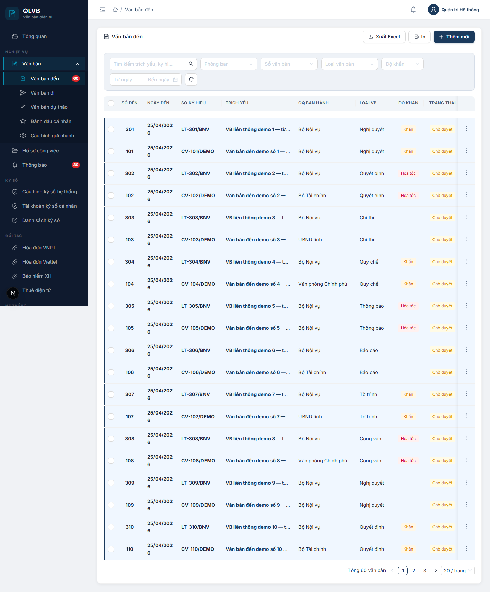
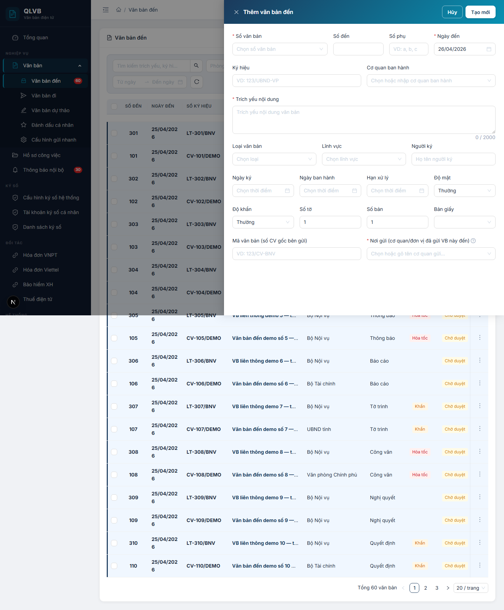
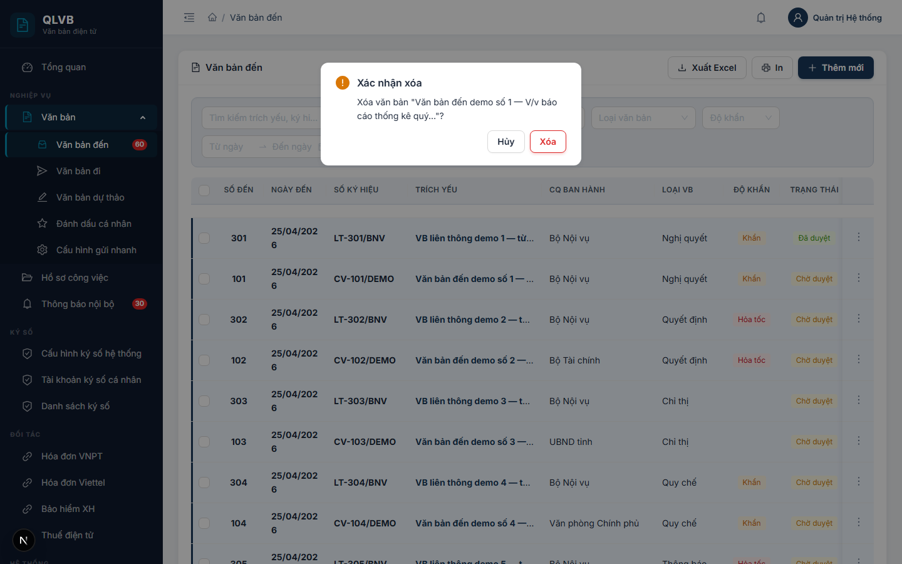
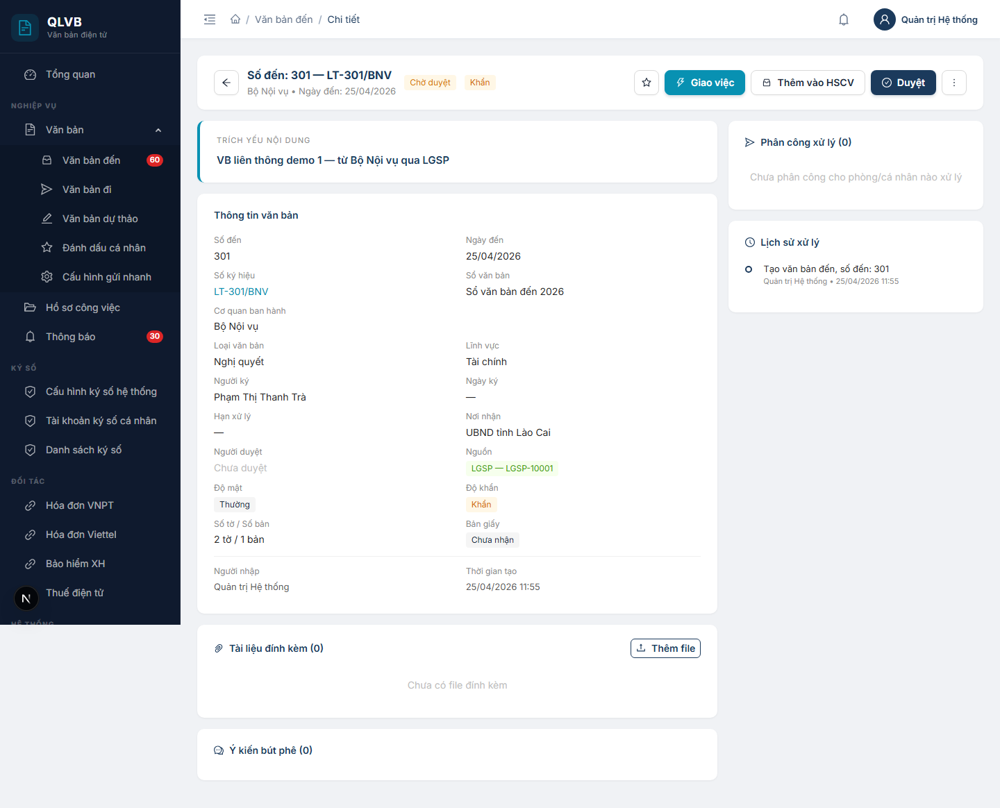
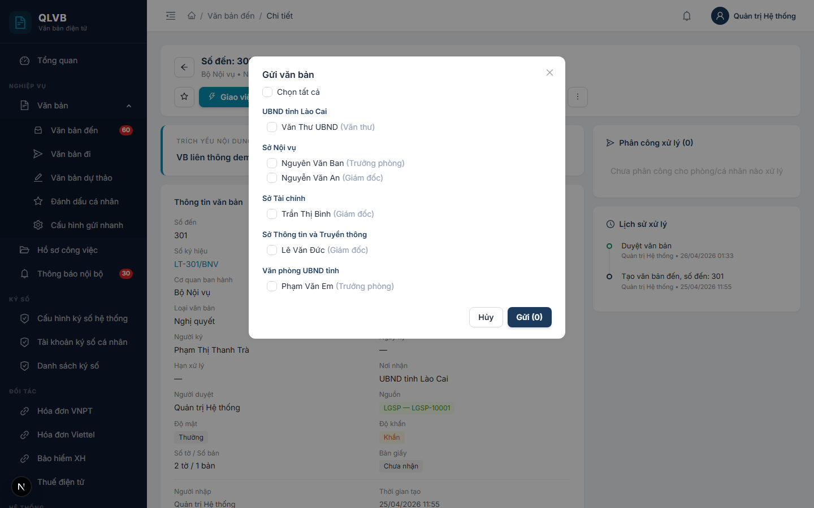
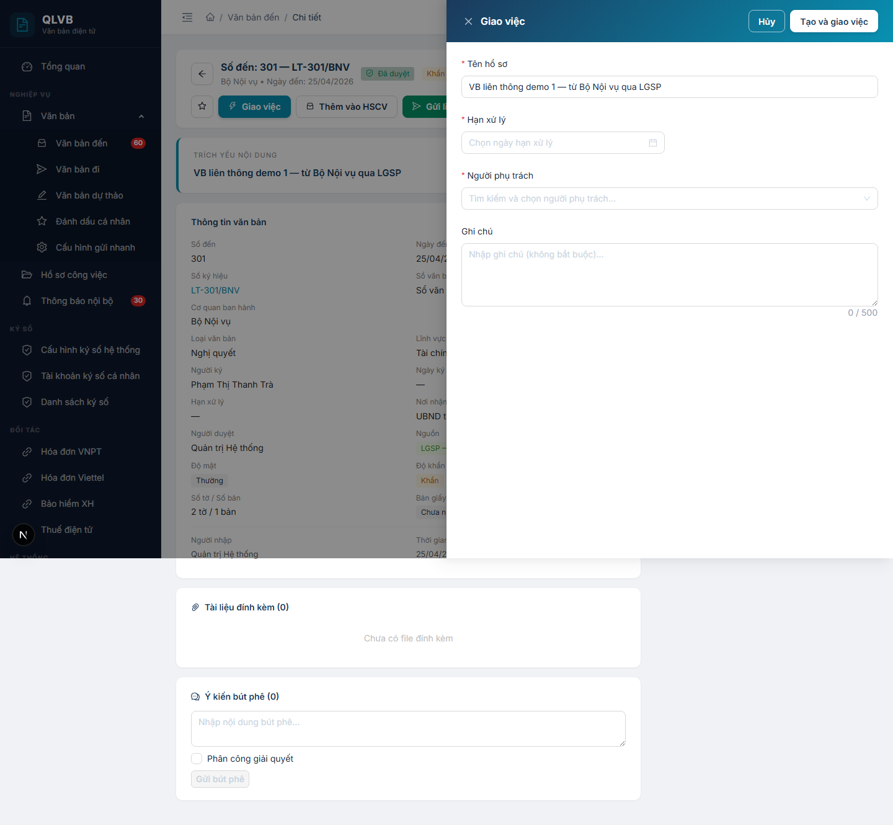
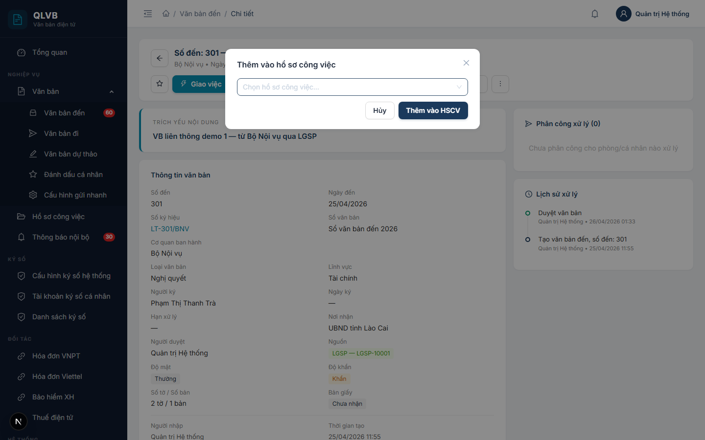

# Văn bản đến

## 1. Giới thiệu

Văn bản đến là phân hệ quản lý mọi văn bản cơ quan tiếp nhận từ bên ngoài hoặc từ đơn vị nội bộ khác. Văn thư đăng ký vào sổ, lãnh đạo duyệt và phân công xử lý, chuyên viên tiếp nhận và xử lý theo bút phê. Phân hệ phục vụ vòng đời từ lúc nhận văn bản tới khi đưa vào hồ sơ công việc giải quyết.

Phân hệ phục vụ ba vai chính:
- Văn thư: đăng ký, sửa, xóa, gửi và phân phối văn bản đến cán bộ liên quan.
- Lãnh đạo: duyệt, hủy duyệt, thu hồi, bút phê và giao việc thành hồ sơ công việc.
- Chuyên viên: nhận và xử lý văn bản, có thể chuyển lại nếu nhận nhầm.

Một văn bản đến có thể đến từ ba nguồn:
- Nhập tay: do văn thư tự đăng ký từ bản giấy hoặc file scan.
- Nội bộ: tự sinh khi đơn vị khác trong tỉnh ban hành văn bản đi và chọn đơn vị nhận là cơ quan của bạn.
- LGSP: tự sinh từ Trục liên thông Lào Cai gửi xuống.

Hai trường hợp Nội bộ và LGSP không cho sửa nội dung gốc — chỉ có thể tiếp nhận, phân công xử lý hoặc chuyển lại.

## 2. Quy trình thao tác và ràng buộc nghiệp vụ

Quy trình chuẩn của một văn bản đến:

1. Văn thư đăng ký văn bản (Thêm mới) → trạng thái Chờ duyệt.
2. Lãnh đạo mở chi tiết, kiểm tra, bấm Duyệt → trạng thái Đã duyệt.
3. Lãnh đạo bấm Gửi để chọn cán bộ tiếp nhận, hoặc viết Bút phê kèm phân công.
4. Cán bộ nhận văn bản, đọc và xử lý. Có thể bấm Chuyển lại nếu không đúng việc của mình.
5. Lãnh đạo bấm Giao việc để tạo hồ sơ công việc xử lý chính thức, hoặc Thêm vào hồ sơ công việc đã có.

Ràng buộc nghiệp vụ:

- Trích yếu nội dung, Sổ văn bản và Ngày đến là bắt buộc khi tạo mới.
- Số đến tự cấp theo Sổ văn bản: hệ thống lấy số tiếp theo của sổ trong cùng đơn vị.
- Khi tạo mới, người dùng phải chọn Nơi gửi (cơ quan/đơn vị đã gửi văn bản này đến) — bắt buộc.
- Văn bản nguồn nội bộ hoặc LGSP không cho sửa hoặc xóa — chỉ tiếp nhận, phân công, chuyển lại.
- Đã duyệt mới được phép Gửi, Bút phê, Nhận bản giấy, Gửi liên thông.
- Khi đã có người nhận trong danh sách Phân công xử lý mà cần đăng ký lại — phải Thu hồi để xóa danh sách người nhận và đặt lại trạng thái Chờ duyệt.
- Lý do Chuyển lại phải có ít nhất 10 ký tự.
- Quyền hiển thị nút Sửa, Duyệt, Gửi, Thu hồi, Xóa được hệ thống tính theo vai trò người dùng và đơn vị tạo văn bản — nếu không có quyền, các nút này tự động bị ẩn.

## 3. Các màn hình chức năng

### 3.1. Màn hình danh sách văn bản đến

#### Bố cục màn hình

Trên cùng là tiêu đề "Văn bản đến" cùng với nhóm nút Đánh dấu đã đọc, Xuất Excel, In, Thêm mới ở góc phải. Dưới là thanh bộ lọc một hàng gồm ô tìm kiếm, lựa chọn phòng ban (chỉ admin), Sổ văn bản, Loại văn bản, Độ khẩn, khoảng ngày đến và nút xóa bộ lọc. Phần thân là bảng danh sách văn bản đến phân trang.

#### Các nút chức năng

| Nút | Vị trí | Khi nào hiển thị | Tác dụng |
|---|---|---|---|
| Thêm mới | Góc phải tiêu đề | Luôn hiển thị | Mở Drawer thêm văn bản đến |
| Xuất Excel | Góc phải tiêu đề | Luôn hiển thị | Tải file Excel danh sách hiện tại theo bộ lọc |
| In | Góc phải tiêu đề | Luôn hiển thị | In danh sách hiện tại ra giấy |
| Đánh dấu đã đọc (N) | Góc phải tiêu đề | Khi đã chọn ít nhất 1 dòng | Đánh dấu các văn bản đã chọn là đã đọc |
| Xóa bộ lọc | Cuối hàng bộ lọc | Luôn hiển thị | Xóa toàn bộ điều kiện lọc, quay về trang 1 |
| Tìm kiếm | Đầu hàng bộ lọc | Luôn hiển thị | Lọc theo trích yếu hoặc số ký hiệu |
| Dropdown thao tác | Cột cuối mỗi dòng | Luôn hiển thị | Mở danh sách thao tác cho dòng đó |

Các mục trong Dropdown thao tác tùy theo trạng thái và quyền:

| Mục | Khi nào hiển thị | Tác dụng |
|---|---|---|
| Xem chi tiết | Luôn có | Mở trang chi tiết văn bản đến |
| Sửa | Văn bản chưa duyệt + nguồn nhập tay + có quyền sửa | Mở Drawer sửa |
| Duyệt | Văn bản chưa duyệt + có quyền duyệt | Duyệt văn bản |
| Hủy duyệt | Văn bản đã duyệt + có quyền duyệt | Mở hộp xác nhận hủy duyệt |
| Thu hồi | Văn bản đã duyệt + có quyền thu hồi | Mở hộp xác nhận thu hồi |
| Xóa | Văn bản chưa duyệt + có quyền sửa | Mở hộp xác nhận xóa |

#### Các cột hiển thị

| Tên cột | Mô tả |
|---|---|
| Số đến | Số thứ tự đăng ký trong sổ. Văn bản chưa đọc in đậm |
| Ngày đến | Ngày văn thư tiếp nhận, định dạng DD/MM/YYYY |
| Số ký hiệu | Ký hiệu văn bản gốc (vd: 123/UBND-VP) |
| Trích yếu | Tóm tắt nội dung, click mở chi tiết. Có thẻ "Gửi cho tôi" nếu là người nhận |
| CQ ban hành | Cơ quan/đơn vị ban hành văn bản gốc |
| Loại VB | Loại văn bản (Công văn, Quyết định, Thông báo...) |
| Độ khẩn | Hiển thị thẻ Khẩn (cam) hoặc Hỏa tốc (đỏ); Thường để trống |
| Trạng thái | Chờ duyệt (vàng) / Đã duyệt (xanh) / Từ chối (đỏ) |

#### Thông báo của hệ thống

| Tình huống | Thông báo |
|---|---|
| Lỗi tải danh sách | Lỗi tải danh sách văn bản đến |
| Đánh dấu đã đọc thành công | Đã đánh dấu đọc |

### 3.2. Drawer thêm/sửa văn bản đến

#### Bố cục màn hình

Drawer mở từ phải, rộng 800px, đầu Drawer có dải gradient xanh thẫm. Tiêu đề là "Thêm văn bản đến" hoặc "Sửa văn bản đến". Phần thân là form nhiều hàng. Dưới đầu Drawer có hai nút Hủy và Tạo mới/Cập nhật.

#### Các nút chức năng

| Nút | Vị trí | Khi nào hiển thị | Tác dụng |
|---|---|---|---|
| Tạo mới / Cập nhật | Góc phải đầu Drawer | Luôn có | Lưu văn bản, đóng Drawer, tải lại danh sách |
| Hủy | Góc phải đầu Drawer | Luôn có | Đóng Drawer, không lưu |

#### Các trường dữ liệu

| Tên trường | Bắt buộc | Mô tả & ràng buộc |
|---|---|---|
| Sổ văn bản | Có | Chọn từ danh sách Sổ văn bản loại Đến. Khi chọn xong, hệ thống tự điền Số đến tiếp theo |
| Số đến | Không | Số nguyên >= 1, hệ thống đề xuất tự động |
| Số phụ | Không | Tối đa 20 ký tự, ví dụ: a, b, c |
| Ngày đến | Có | Mặc định ngày hiện tại |
| Ký hiệu | Không | Tối đa 100 ký tự, ví dụ 123/UBND-VP |
| Cơ quan ban hành | Không | Chọn từ cây đơn vị nội bộ hoặc tự gõ tên |
| Trích yếu nội dung | Có | Tối đa 2000 ký tự |
| Loại văn bản | Không | Chọn từ danh mục Loại VB |
| Lĩnh vực | Không | Chọn từ danh mục Lĩnh vực |
| Người ký | Không | Tối đa 200 ký tự |
| Ngày ký | Không | DD/MM/YYYY |
| Ngày ban hành | Không | DD/MM/YYYY |
| Hạn xử lý | Không | DD/MM/YYYY |
| Độ mật | Không | Thường / Mật / Tối mật / Tuyệt mật. Mặc định Thường |
| Độ khẩn | Không | Thường / Khẩn / Hỏa tốc. Mặc định Thường |
| Số tờ | Không | Số nguyên >= 0, mặc định 1 |
| Số bản | Không | Số nguyên >= 0, mặc định 1 |
| Bản giấy | Không | Đã nhận / Chưa nhận |
| Mã văn bản | Không | Số CV gốc bên gửi, tối đa 100 ký tự |
| Nơi gửi | Có | Cơ quan/đơn vị đã gửi văn bản này. Chọn từ đơn vị nội bộ hoặc cơ quan ngoài LGSP, hoặc tự gõ tên mới |

#### Thông báo của hệ thống

| Tình huống | Thông báo |
|---|---|
| Trích yếu rỗng | Trích yếu nội dung là bắt buộc |
| Sổ văn bản chưa chọn | Sổ văn bản là bắt buộc |
| Ngày đến rỗng | Ngày đến là bắt buộc |
| Nơi gửi rỗng | Bắt buộc khi tự nhập VB đến |
| Tạo thành công | Tạo văn bản đến thành công |
| Cập nhật thành công | Cập nhật thành công |
| Sửa văn bản nguồn nội bộ | Văn bản đến từ đơn vị nội bộ không được sửa nội dung gốc. Chỉ có thể tiếp nhận / phân công xử lý / từ chối. |
| Sửa văn bản nguồn LGSP | Văn bản đến từ LGSP không được sửa nội dung gốc. Chỉ có thể tiếp nhận / phân công xử lý / từ chối. |
| Không có quyền sửa | Không có quyền sửa văn bản đến này |

### 3.3. Hộp thoại xác nhận xóa văn bản

#### Bố cục màn hình

Hộp thoại nhỏ giữa màn hình. Tiêu đề "Xác nhận xóa". Nội dung "Xóa văn bản &lt;trích yếu&gt;...?". Hai nút Xóa (đỏ) và Hủy.

#### Các nút chức năng

| Nút | Vị trí | Khi nào hiển thị | Tác dụng |
|---|---|---|---|
| Xóa | Góc phải hộp thoại | Luôn có | Xóa văn bản, đóng hộp thoại, tải lại danh sách |
| Hủy | Góc phải hộp thoại | Luôn có | Đóng hộp thoại, không xóa |

#### Thông báo của hệ thống

| Tình huống | Thông báo |
|---|---|
| Xóa thành công | Đã xóa |
| Không có quyền | Không có quyền xóa văn bản đến này |
| Văn bản đã duyệt | Không thể xóa văn bản đã duyệt (cần Hủy duyệt trước) |

### 3.4. Trang chi tiết văn bản đến

#### Bố cục màn hình

Trang chi tiết hai cột. Trên cùng là thanh tiêu đề có nút quay lại, số đến và ký hiệu, đơn vị ban hành, ngày đến, các thẻ trạng thái và nhóm nút thao tác bên phải.

Cột trái (rộng): Trích yếu nội dung, Thông tin văn bản (số đến, ngày đến, ký hiệu, sổ văn bản, cơ quan ban hành, loại, lĩnh vực, người ký, ngày ký, hạn xử lý, nơi nhận, người duyệt, nguồn, độ mật, độ khẩn, số tờ và số bản, bản giấy, người nhập, thời gian tạo), Tài liệu đính kèm, Ý kiến bút phê.

Cột phải: Phân công xử lý (danh sách cán bộ được gửi văn bản kèm trạng thái đọc và chưa đọc), Lịch sử xử lý dạng timeline.

Nếu văn bản bị từ chối, dưới thanh tiêu đề có dải đỏ "Lý do từ chối".

#### Các nút chức năng

| Nút | Vị trí | Khi nào hiển thị | Tác dụng |
|---|---|---|---|
| Quay lại | Trái thanh tiêu đề | Luôn có | Quay về danh sách văn bản đến |
| Đánh dấu (sao) | Phải thanh tiêu đề | Luôn có | Bật/tắt đánh dấu cá nhân |
| Giao việc | Phải thanh tiêu đề | Luôn có | Mở Drawer Giao việc tạo hồ sơ công việc |
| Thêm vào HSCV | Phải thanh tiêu đề | Luôn có | Mở Modal chọn hồ sơ công việc đã có |
| Gửi liên thông | Phải thanh tiêu đề | Văn bản đã duyệt | Mở Modal Gửi liên thông LGSP |
| Sửa | Phải thanh tiêu đề | Chưa duyệt + nguồn nhập tay + có quyền | Quay về danh sách và mở Drawer sửa |
| Duyệt | Phải thanh tiêu đề | Chưa duyệt + có quyền duyệt | Duyệt văn bản |
| Gửi | Phải thanh tiêu đề | Đã duyệt + có quyền gửi | Mở Modal Gửi văn bản |
| Bút phê | Phải thanh tiêu đề | Đã duyệt | Cuộn xuống ô nhập bút phê |
| Dropdown thao tác phụ | Phải thanh tiêu đề | Tùy trạng thái | Mở danh sách thao tác phụ |
| Nhận bàn giao | Phải thanh tiêu đề | Văn bản liên thông + cán bộ là người nhận | Mở Popconfirm nhận bàn giao |
| Chuyển lại | Phải thanh tiêu đề | Văn bản liên thông + có quyền | Mở Modal nhập lý do chuyển lại |
| Thêm file | Khu vực Đính kèm | Văn bản chưa duyệt | Mở hộp chọn file để upload |
| Tải | Mỗi dòng đính kèm | Luôn có | Tải file về máy |
| Ký số | Mỗi dòng đính kèm | File chưa ký số | Ký số mock cho file |
| Xác thực | Mỗi dòng đính kèm | File đã ký số | Xác thực chữ ký số |
| Xóa file | Mỗi dòng đính kèm | Văn bản chưa duyệt | Mở Popconfirm xóa file |
| Phân công giải quyết (checkbox) | Khu vực Bút phê | Văn bản đã duyệt | Mở khung chọn cán bộ và hạn giải quyết kèm bút phê |
| Gửi bút phê / Bút phê & Phân công | Khu vực Bút phê | Văn bản đã duyệt | Lưu bút phê |

Mục trong Dropdown thao tác phụ:

| Mục | Khi nào hiển thị | Tác dụng |
|---|---|---|
| Thu hồi | Đã có người nhận + có quyền thu hồi | Mở Popconfirm thu hồi |
| Xóa văn bản | Chưa duyệt + có quyền xóa | Mở Popconfirm xóa |
| Nhận bản giấy | Đã duyệt + chưa nhận bản giấy + có quyền | Đánh dấu đã nhận bản giấy |
| Hủy duyệt | Đã duyệt + có quyền duyệt | Mở Popconfirm hủy duyệt |

#### Thông báo của hệ thống

| Tình huống | Thông báo |
|---|---|
| Duyệt thành công | Duyệt thành công |
| Hủy duyệt thành công | Hủy duyệt thành công |
| Thu hồi thành công | Thu hồi thành công |
| Đã xác nhận nhận bản giấy | Đã xác nhận nhận bản giấy |
| Tải file lên thành công | Tải lên thành công |
| Xóa file đính kèm | Đã xóa |
| Ký số thành công | Ký số thành công |
| Chữ ký hợp lệ (Modal) | Chữ ký hợp lệ — &lt;Tên người ký&gt; • &lt;ngày giờ ký&gt; |
| Chưa ký số (Modal) | Chưa ký số — File chưa được ký số |
| Lỗi xác thực | Lỗi xác thực |
| Nhận bàn giao thành công | Nhận bàn giao thành công |

### 3.5. Modal gửi văn bản

#### Bố cục màn hình

Modal giữa màn hình rộng 560px. Tiêu đề "Gửi văn bản". Trên cùng có ô Chọn tất cả. Phần thân là danh sách cán bộ gom theo phòng ban — mỗi cán bộ là một hàng có ô chọn. Dưới có hai nút Gửi và Hủy.

#### Các nút chức năng

| Nút | Vị trí | Khi nào hiển thị | Tác dụng |
|---|---|---|---|
| Gửi (N) | Góc phải Modal | Luôn có | Gửi văn bản tới N cán bộ đã chọn |
| Hủy | Góc phải Modal | Luôn có | Đóng Modal |
| Chọn tất cả | Trên đầu danh sách | Luôn có | Tick chọn toàn bộ cán bộ |

#### Các cột hiển thị

| Tên cột | Mô tả |
|---|---|
| Phòng ban | Tiêu đề nhóm cán bộ |
| Họ tên + Chức vụ | Mỗi cán bộ là 1 dòng có ô chọn |

#### Thông báo của hệ thống

| Tình huống | Thông báo |
|---|---|
| Chưa chọn người nhận | Chọn ít nhất một người nhận |
| Gửi thành công | Đã gửi |
| Không có quyền | Không có quyền gửi văn bản đến này |

### 3.6. Drawer giao việc

#### Bố cục màn hình

Drawer rộng 720px, có gradient xanh thẫm. Tiêu đề "Giao việc". Form nhập Tên hồ sơ, Hạn xử lý, Người phụ trách, Ghi chú. Dưới đầu Drawer có nút Tạo và giao việc, Hủy.

#### Các nút chức năng

| Nút | Vị trí | Khi nào hiển thị | Tác dụng |
|---|---|---|---|
| Tạo và giao việc | Góc phải đầu Drawer | Luôn có | Tạo hồ sơ công việc, gửi thông báo cho người phụ trách, đóng Drawer |
| Hủy | Góc phải đầu Drawer | Luôn có | Đóng Drawer |

#### Các trường dữ liệu

| Tên trường | Bắt buộc | Mô tả & ràng buộc |
|---|---|---|
| Tên hồ sơ | Có | Tối đa 200 ký tự. Mặc định lấy từ trích yếu văn bản |
| Hạn xử lý | Có | DD/MM/YYYY. Mặc định lấy từ Hạn xử lý của văn bản |
| Người phụ trách | Có | Chọn nhiều cán bộ, có tìm kiếm theo tên |
| Ghi chú | Không | Tối đa 500 ký tự |

#### Thông báo của hệ thống

| Tình huống | Thông báo |
|---|---|
| Tên hồ sơ rỗng | Vui lòng nhập tên hồ sơ |
| Hạn xử lý rỗng | Vui lòng chọn hạn xử lý |
| Người phụ trách rỗng | Vui lòng chọn ít nhất một người phụ trách |
| Tạo thành công | Giao việc thành công |
| Không có quyền | Không có quyền giao xử lý văn bản đến này |

### 3.7. Modal chuyển lại văn bản

#### Bố cục màn hình

Modal rộng 480px. Tiêu đề "Lý do chuyển lại". Trong thân là ô nhập lý do nhiều dòng kèm đếm ký tự. Dưới có hai nút Chuyển lại và Hủy.

#### Các nút chức năng

| Nút | Vị trí | Khi nào hiển thị | Tác dụng |
|---|---|---|---|
| Chuyển lại | Góc phải Modal | Luôn có | Chuyển văn bản về người gửi kèm lý do |
| Hủy | Góc phải Modal | Luôn có | Đóng Modal |

#### Các trường dữ liệu

| Tên trường | Bắt buộc | Mô tả & ràng buộc |
|---|---|---|
| Lý do chuyển lại | Có | Tối thiểu 10 ký tự, tối đa 500 ký tự |

#### Thông báo của hệ thống

| Tình huống | Thông báo |
|---|---|
| Lý do rỗng | Vui lòng nhập lý do chuyển lại |
| Lý do dưới 10 ký tự | Lý do chuyển lại phải có ít nhất 10 ký tự |
| Chuyển lại thành công | Chuyển lại văn bản thành công |
| Không có quyền | Không có quyền chuyển lại văn bản đến này |

### 3.8. Modal thêm văn bản vào hồ sơ công việc

#### Bố cục màn hình

Modal cỡ trung bình. Tiêu đề "Thêm vào hồ sơ công việc". Phần thân là ô tìm kiếm và chọn hồ sơ công việc đã có. Dưới có hai nút Thêm vào HSCV và Hủy.

#### Các nút chức năng

| Nút | Vị trí | Khi nào hiển thị | Tác dụng |
|---|---|---|---|
| Thêm vào HSCV | Góc phải Modal | Luôn có | Liên kết văn bản vào hồ sơ công việc đã chọn |
| Hủy | Góc phải Modal | Luôn có | Đóng Modal |

#### Các trường dữ liệu

| Tên trường | Bắt buộc | Mô tả & ràng buộc |
|---|---|---|
| Hồ sơ công việc | Có | Chọn từ danh sách hồ sơ công việc đang có. Hiển thị "Tên (Trạng thái)" — Mới / Đang xử lý / Trình duyệt |

#### Thông báo của hệ thống

| Tình huống | Thông báo |
|---|---|
| Chưa chọn HSCV | Vui lòng chọn hồ sơ công việc |
| Thêm thành công | Đã thêm vào hồ sơ công việc |
| Không có quyền | Không có quyền thêm vào hồ sơ công việc |

### 3.9. Modal gửi liên thông LGSP

#### Bố cục màn hình

Modal cỡ trung bình. Tiêu đề "Gửi liên thông LGSP". Trong thân có ô chọn nhiều đơn vị nhận. Dưới có hai nút Gửi liên thông và Hủy.

#### Các nút chức năng

| Nút | Vị trí | Khi nào hiển thị | Tác dụng |
|---|---|---|---|
| Gửi liên thông | Góc phải Modal | Luôn có | Gửi văn bản đến qua Trục liên thông tới các đơn vị đã chọn |
| Hủy | Góc phải Modal | Luôn có | Đóng Modal |

#### Các trường dữ liệu

| Tên trường | Bắt buộc | Mô tả & ràng buộc |
|---|---|---|
| Đơn vị nhận | Có | Chọn nhiều đơn vị từ danh sách cơ quan LGSP |

#### Thông báo của hệ thống

| Tình huống | Thông báo |
|---|---|
| Chưa chọn đơn vị | Vui lòng chọn ít nhất một đơn vị |
| Gửi thành công | Đã gửi liên thông cho N đơn vị |
| Không có quyền | Không có quyền gửi liên thông văn bản đến này |
