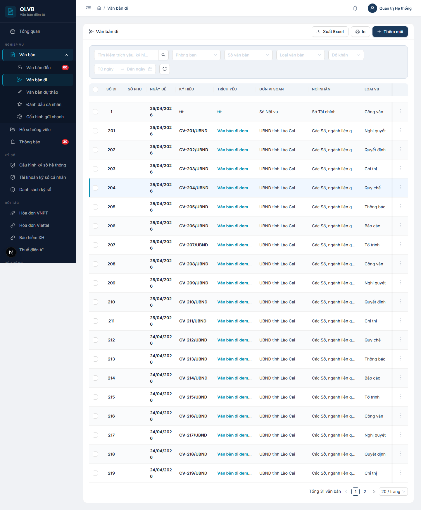
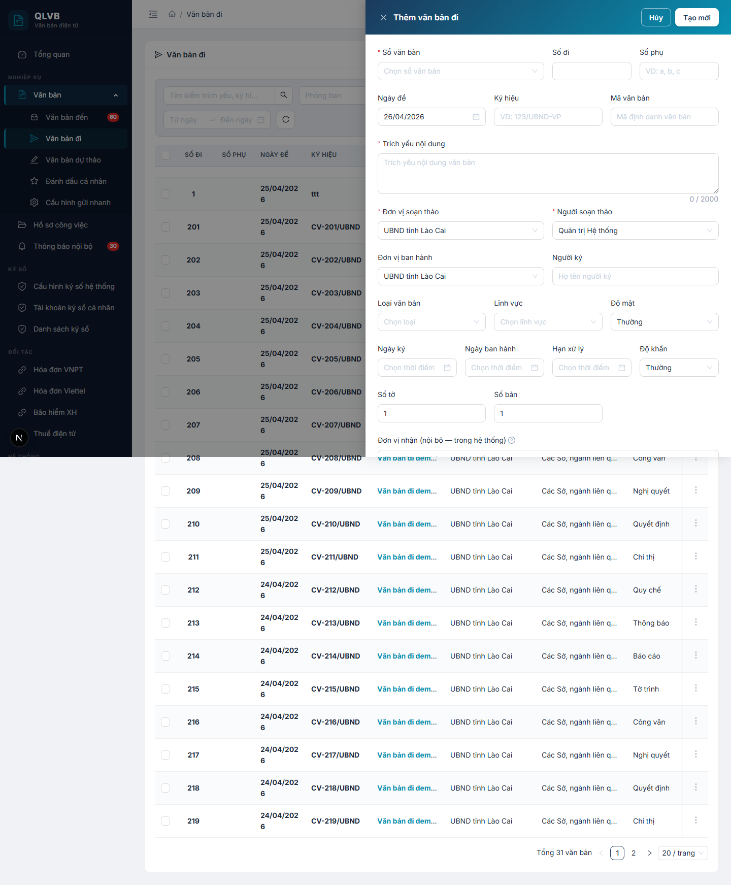
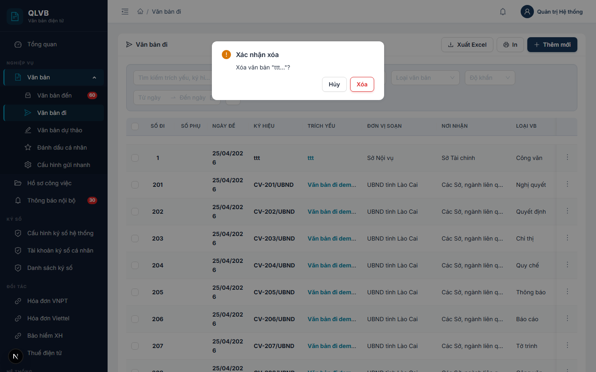
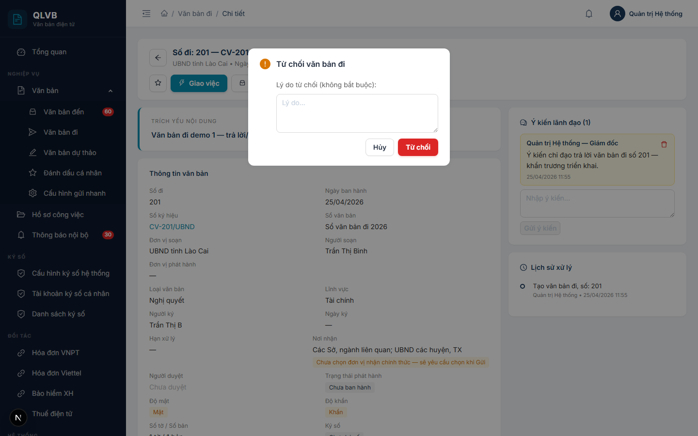
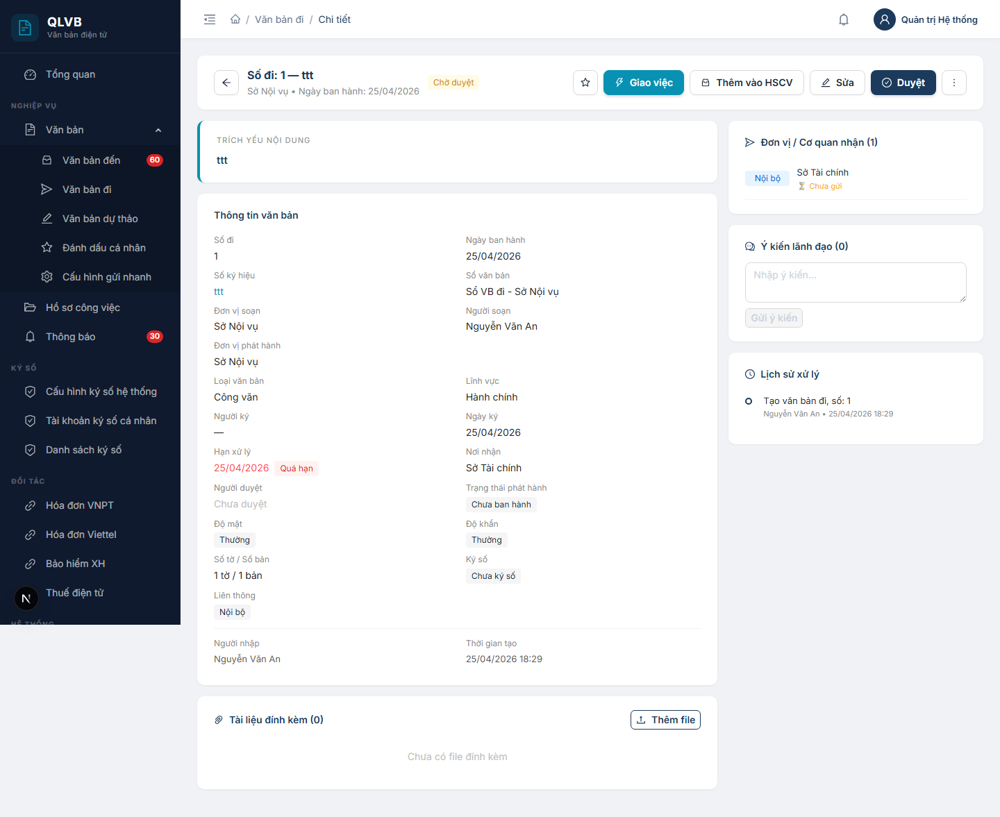
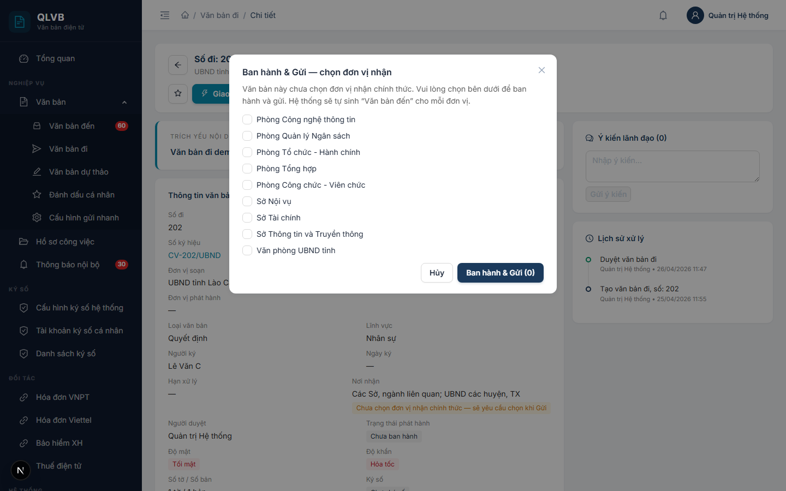
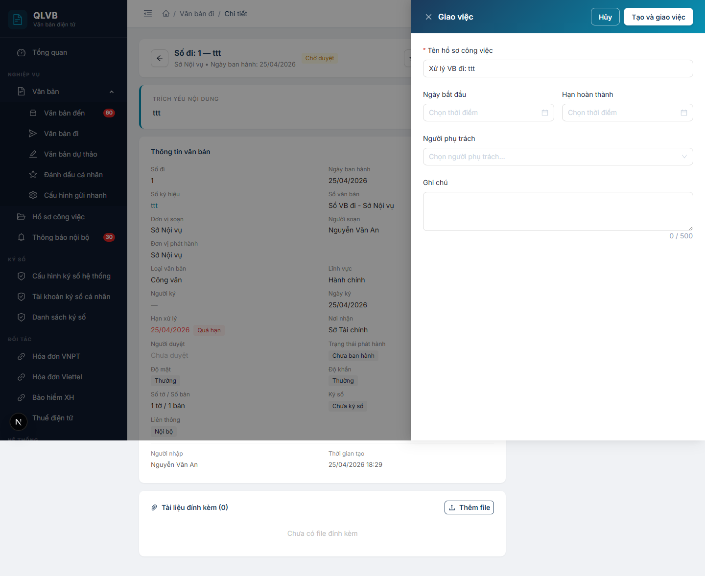
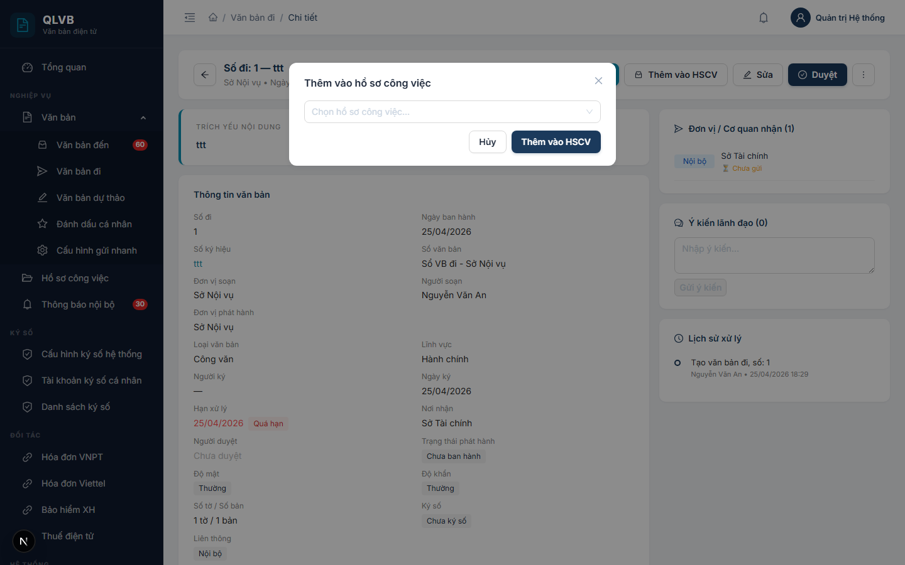

# Văn bản đi

## 1. Giới thiệu

Văn bản đi là phân hệ quản lý các văn bản do cơ quan ban hành ra bên ngoài hoặc tới đơn vị nội bộ khác. Phân hệ phục vụ toàn bộ chu trình từ soạn thảo, trình lãnh đạo duyệt, ký số, ban hành cấp số, đến gửi nội bộ và liên thông qua LGSP.

Phân hệ phục vụ ba vai chính:
- Chuyên viên soạn thảo: nhập nội dung, chọn đơn vị nhận, đính kèm file.
- Lãnh đạo: duyệt hoặc từ chối văn bản, ký số file, ban hành.
- Văn thư: ban hành cấp số, gửi tới đơn vị nhận, theo dõi tracking liên thông.

Văn bản đi có thể được tạo bằng hai cách:
- Tạo trực tiếp tại danh sách văn bản đi.
- Tự sinh từ Phát hành một văn bản dự thảo đã duyệt.

## 2. Quy trình thao tác và ràng buộc nghiệp vụ

Quy trình chuẩn của một văn bản đi:

1. Chuyên viên Thêm mới văn bản đi (chọn đơn vị nhận nội bộ và cơ quan ngoài LGSP) → trạng thái Chờ duyệt.
2. Lãnh đạo bấm Duyệt (hoặc Từ chối kèm lý do) → trạng thái Đã duyệt.
3. Lãnh đạo ký số file đính kèm trên trang chi tiết.
4. Văn thư bấm Ban hành (cấp số chính thức) hoặc Ban hành & Gửi (kết hợp 2 bước).
5. Khi Gửi, hệ thống tự sinh Văn bản đến cho các đơn vị nội bộ và đẩy lên LGSP cho cơ quan ngoài. Người dùng theo dõi tracking ở khung Đơn vị/Cơ quan nhận trên trang chi tiết.

Ràng buộc nghiệp vụ:

- Trích yếu nội dung, Sổ văn bản, Đơn vị soạn thảo, Người soạn thảo là bắt buộc.
- Số đi tự cấp theo Sổ văn bản — hệ thống đề xuất số tiếp theo khi chọn sổ.
- Văn bản đã duyệt không cho sửa hay xóa nữa, cũng không cho thay đổi danh sách đính kèm. Muốn sửa lại phải Hủy duyệt trước.
- Đã ban hành mới được phép Gửi nội bộ và Gửi liên thông LGSP.
- Khi Gửi mà chưa chọn đơn vị nhận trong danh sách Nội bộ, hệ thống mở Modal chọn đơn vị nhận trước.
- Văn bản đã có người nhận muốn sửa lại — phải Thu hồi để xóa danh sách người nhận và đặt lại trạng thái Chờ duyệt.
- Lý do từ chối không bắt buộc, nhưng nên ghi rõ để chuyên viên biết cách sửa lại.
- Nút Sửa, Duyệt, Ban hành, Gửi, Thu hồi, Xóa hiển thị có điều kiện theo trạng thái và quyền của người dùng.

## 3. Các màn hình chức năng

### 3.1. Màn hình danh sách văn bản đi

#### Bố cục màn hình

Trên cùng là tiêu đề "Văn bản đi" với nhóm nút Đánh dấu đã đọc, Xuất Excel, In, Thêm mới ở góc phải. Dưới là thanh bộ lọc gồm ô tìm kiếm, lựa chọn phòng ban (chỉ admin), Sổ văn bản, Loại văn bản, Độ khẩn, khoảng ngày và nút xóa bộ lọc. Phần thân là bảng danh sách văn bản đi phân trang.

#### Các nút chức năng

| Nút | Vị trí | Khi nào hiển thị | Tác dụng |
|---|---|---|---|
| Thêm mới | Góc phải tiêu đề | Luôn hiển thị | Mở Drawer thêm văn bản đi |
| Xuất Excel | Góc phải tiêu đề | Luôn hiển thị | Tải file Excel danh sách hiện tại theo bộ lọc |
| In | Góc phải tiêu đề | Luôn hiển thị | In danh sách hiện tại ra giấy |
| Đánh dấu đã đọc (N) | Góc phải tiêu đề | Khi đã chọn ít nhất 1 dòng | Đánh dấu các văn bản đã chọn là đã đọc |
| Xóa bộ lọc | Cuối hàng bộ lọc | Luôn hiển thị | Xóa toàn bộ điều kiện lọc, quay về trang 1 |
| Tìm kiếm | Đầu hàng bộ lọc | Luôn hiển thị | Lọc theo trích yếu hoặc số ký hiệu |
| Dropdown thao tác | Cột cuối mỗi dòng | Luôn hiển thị | Mở danh sách thao tác cho dòng đó |

Các mục trong Dropdown thao tác:

| Mục | Khi nào hiển thị | Tác dụng |
|---|---|---|
| Xem chi tiết | Luôn có | Mở trang chi tiết văn bản đi |
| Sửa | Chưa duyệt + có quyền sửa | Mở Drawer sửa |
| Duyệt | Chưa duyệt + có quyền duyệt | Duyệt văn bản |
| Từ chối | Chưa duyệt + chưa từ chối + có quyền duyệt | Mở Modal nhập lý do từ chối |
| Hủy duyệt | Đã duyệt + có quyền duyệt | Mở hộp xác nhận hủy duyệt |
| Thu hồi | Đã duyệt + có quyền thu hồi | Mở hộp xác nhận thu hồi |
| Xóa | Chưa duyệt + có quyền sửa | Mở hộp xác nhận xóa |

#### Các cột hiển thị

| Tên cột | Mô tả |
|---|---|
| Số đi | Số thứ tự cấp khi ban hành |
| Số phụ | Phần phụ của số đi (a, b, c) |
| Ngày đề | Ngày soạn văn bản |
| Ký hiệu | Ký hiệu chính thức (vd: 123/UBND-VP) |
| Trích yếu | Tóm tắt nội dung, click mở chi tiết. Có thẻ "Gửi cho tôi" nếu là người nhận |
| Đơn vị soạn | Đơn vị tạo văn bản |
| Nơi nhận | Tóm tắt các đơn vị nhận |
| Loại VB | Loại văn bản |
| Trạng thái | Chờ duyệt (vàng) / Đã duyệt (xanh) / Từ chối (đỏ) |

#### Thông báo của hệ thống

| Tình huống | Thông báo |
|---|---|
| Lỗi tải danh sách | Lỗi tải danh sách văn bản đi |
| Đánh dấu đã đọc thành công | Đã đánh dấu đọc |
| Lỗi xuất Excel | Lỗi xuất Excel |

### 3.2. Drawer thêm/sửa văn bản đi

#### Bố cục màn hình

Drawer mở từ phải, rộng 720px, đầu Drawer có dải gradient xanh thẫm. Tiêu đề "Thêm văn bản đi" hoặc "Sửa văn bản đi". Phần thân là form nhiều hàng. Dưới đầu Drawer có hai nút Hủy và Tạo mới/Cập nhật.

#### Các nút chức năng

| Nút | Vị trí | Khi nào hiển thị | Tác dụng |
|---|---|---|---|
| Tạo mới / Cập nhật | Góc phải đầu Drawer | Luôn có | Lưu văn bản, đóng Drawer, tải lại danh sách |
| Hủy | Góc phải đầu Drawer | Luôn có | Đóng Drawer, không lưu |

#### Các trường dữ liệu

| Tên trường | Bắt buộc | Mô tả & ràng buộc |
|---|---|---|
| Sổ văn bản | Có | Chọn từ Sổ văn bản loại Đi. Khi chọn xong tự điền Số đi tiếp theo |
| Số đi | Không | Số nguyên >= 1 |
| Số phụ | Không | Tối đa 20 ký tự |
| Ngày đề | Không | DD/MM/YYYY |
| Ký hiệu | Không | Tối đa 100 ký tự |
| Mã văn bản | Không | Mã định danh, tối đa 100 ký tự |
| Trích yếu nội dung | Có | Tối đa 2000 ký tự |
| Đơn vị soạn thảo | Có | Chọn từ cây đơn vị, mặc định là phòng của người dùng |
| Người soạn thảo | Có | Phụ thuộc Đơn vị soạn — chọn từ danh sách cán bộ trong đơn vị đó |
| Đơn vị ban hành | Không | Chọn từ cây đơn vị |
| Người ký | Không | Tối đa 200 ký tự |
| Loại văn bản | Không | Chọn từ danh mục Loại VB |
| Lĩnh vực | Không | Chọn từ danh mục Lĩnh vực |
| Độ mật | Không | Thường / Mật / Tối mật / Tuyệt mật. Mặc định Thường |
| Ngày ký | Không | DD/MM/YYYY |
| Ngày ban hành | Không | DD/MM/YYYY |
| Hạn xử lý | Không | DD/MM/YYYY |
| Độ khẩn | Không | Thường / Khẩn / Hỏa tốc. Mặc định Thường |
| Số tờ | Không | Số nguyên >= 0, mặc định 1 |
| Số bản | Không | Số nguyên >= 0, mặc định 1 |
| Đơn vị nhận (nội bộ) | Không | Chọn nhiều đơn vị trong hệ thống. Khi Gửi, hệ thống tự sinh Văn bản đến cho từng đơn vị |
| Cơ quan nhận (ngoài LGSP) | Không | Chọn nhiều cơ quan ngoài tỉnh. Khi Gửi, hệ thống đẩy lên LGSP |

#### Thông báo của hệ thống

| Tình huống | Thông báo |
|---|---|
| Trích yếu rỗng | Trích yếu nội dung là bắt buộc |
| Sổ văn bản chưa chọn | Sổ văn bản là bắt buộc |
| Đơn vị soạn rỗng | Đơn vị soạn là bắt buộc |
| Người soạn rỗng | Người soạn là bắt buộc |
| Tạo thành công | Tạo văn bản đi thành công |
| Cập nhật thành công | Cập nhật thành công |
| Không có quyền | Không có quyền sửa văn bản đi này |

### 3.3. Hộp thoại xác nhận xóa văn bản

#### Bố cục màn hình

Hộp thoại nhỏ giữa màn hình. Tiêu đề "Xác nhận xóa". Nội dung "Xóa văn bản &lt;trích yếu&gt;...?". Hai nút Xóa (đỏ) và Hủy.

#### Các nút chức năng

| Nút | Vị trí | Khi nào hiển thị | Tác dụng |
|---|---|---|---|
| Xóa | Góc phải hộp thoại | Luôn có | Xóa văn bản, tải lại danh sách |
| Hủy | Góc phải hộp thoại | Luôn có | Đóng hộp thoại |

#### Thông báo của hệ thống

| Tình huống | Thông báo |
|---|---|
| Xóa thành công | Đã xóa |
| Không có quyền | Không có quyền xóa văn bản đi này |
| Văn bản đã duyệt | Không thể xóa văn bản đã duyệt |

### 3.4. Modal từ chối văn bản

#### Bố cục màn hình

Hộp thoại giữa màn hình. Tiêu đề "Từ chối văn bản đi". Trong thân có ô nhập lý do nhiều dòng (không bắt buộc). Hai nút Từ chối (đỏ) và Hủy.

#### Các nút chức năng

| Nút | Vị trí | Khi nào hiển thị | Tác dụng |
|---|---|---|---|
| Từ chối | Góc phải hộp thoại | Luôn có | Đặt văn bản về trạng thái Từ chối kèm lý do |
| Hủy | Góc phải hộp thoại | Luôn có | Đóng hộp thoại |

#### Các trường dữ liệu

| Tên trường | Bắt buộc | Mô tả & ràng buộc |
|---|---|---|
| Lý do từ chối | Không | Nội dung tự do |

#### Thông báo của hệ thống

| Tình huống | Thông báo |
|---|---|
| Từ chối thành công | Đã từ chối văn bản đi |
| Không có quyền | Không có quyền từ chối văn bản đi này |

### 3.5. Trang chi tiết văn bản đi

#### Bố cục màn hình

Trang chi tiết hai cột. Trên cùng là thanh tiêu đề có nút quay lại, số đi và ký hiệu, đơn vị soạn, ngày ban hành, các thẻ trạng thái và nhóm nút thao tác bên phải.

Cột trái: Trích yếu nội dung, Thông tin văn bản (số đi, ngày ban hành, ký hiệu, sổ văn bản, đơn vị soạn, người soạn, đơn vị phát hành, loại, lĩnh vực, người ký, ngày ký, hạn xử lý, nơi nhận, người duyệt, trạng thái phát hành, độ mật, độ khẩn, số tờ và số bản, ký số, liên thông, người nhập, thời gian tạo), Tài liệu đính kèm (kèm nút Ký số trên mỗi file).

Cột phải: Đơn vị/Cơ quan nhận (kèm tracking nội bộ và LGSP), Người nhận nội bộ (nếu có), Ý kiến lãnh đạo, Lịch sử xử lý dạng timeline.

#### Các nút chức năng

| Nút | Vị trí | Khi nào hiển thị | Tác dụng |
|---|---|---|---|
| Quay lại | Trái thanh tiêu đề | Luôn có | Quay về danh sách văn bản đi |
| Đánh dấu (sao) | Phải thanh tiêu đề | Luôn có | Bật/tắt đánh dấu cá nhân |
| Giao việc | Phải thanh tiêu đề | Có quyền duyệt | Mở Drawer Giao việc |
| Thêm vào HSCV | Phải thanh tiêu đề | Có quyền duyệt | Mở Modal chọn hồ sơ công việc |
| Sửa | Phải thanh tiêu đề | Chưa duyệt + có quyền sửa | Quay về danh sách và mở Drawer sửa |
| Duyệt | Phải thanh tiêu đề | Chưa duyệt + có quyền duyệt | Duyệt văn bản |
| Ban hành | Phải thanh tiêu đề | Đã duyệt + chưa ban hành + có quyền ban hành | Cấp số chính thức cho văn bản |
| Ban hành & Gửi | Phải thanh tiêu đề | Đã duyệt + chưa ban hành + có quyền ban hành & gửi | Cấp số và gửi đi luôn trong 1 thao tác |
| Gửi | Phải thanh tiêu đề | Đã ban hành + chưa gửi + có quyền gửi | Gửi tới đơn vị nhận đã chọn |
| Dropdown thao tác phụ | Phải thanh tiêu đề | Tùy trạng thái | Mở danh sách thao tác phụ |
| Thêm file | Khu vực Đính kèm | Văn bản chưa duyệt | Mở hộp chọn file để upload |
| Ký số | Mỗi dòng đính kèm | File chưa ký số | Mở Modal ký số file |
| Tải | Mỗi dòng đính kèm | Luôn có | Tải file về máy |
| Xóa file | Mỗi dòng đính kèm | Văn bản chưa duyệt | Mở Popconfirm xóa file |
| Gửi ý kiến | Khu vực Ý kiến lãnh đạo | Luôn có | Lưu ý kiến |

Mục trong Dropdown thao tác phụ:

| Mục | Khi nào hiển thị | Tác dụng |
|---|---|---|
| Từ chối | Chưa duyệt + chưa từ chối + có quyền duyệt | Mở Modal nhập lý do từ chối |
| Xóa văn bản | Chưa duyệt + có quyền sửa | Mở Popconfirm xóa |
| Hủy duyệt | Đã duyệt chưa ban hành + có quyền duyệt | Hủy duyệt |
| Thu hồi | Đã có người nhận + có quyền thu hồi | Mở Popconfirm thu hồi |

#### Thông báo của hệ thống

| Tình huống | Thông báo |
|---|---|
| Duyệt thành công | Duyệt thành công |
| Hủy duyệt thành công | Hủy duyệt thành công |
| Thu hồi thành công | Thu hồi thành công |
| Từ chối thành công | Đã từ chối |
| Ban hành thành công | Ban hành thành công, số &lt;số đi&gt; |
| Tải file lên | Tải lên thành công |
| Xóa file | Đã xóa |

### 3.6. Modal gửi văn bản tới cán bộ

#### Bố cục màn hình

Modal giữa màn hình rộng 560px. Tiêu đề "Gửi văn bản". Trên cùng có Chọn tất cả. Phần thân là danh sách cán bộ gom theo phòng ban có ô chọn. Dưới có hai nút Gửi và Hủy.

#### Các nút chức năng

| Nút | Vị trí | Khi nào hiển thị | Tác dụng |
|---|---|---|---|
| Gửi (N) | Góc phải Modal | Luôn có | Gửi văn bản tới N cán bộ đã chọn |
| Hủy | Góc phải Modal | Luôn có | Đóng Modal |
| Chọn tất cả | Trên đầu danh sách | Luôn có | Tick chọn toàn bộ cán bộ |

#### Các cột hiển thị

| Tên cột | Mô tả |
|---|---|
| Phòng ban | Tiêu đề nhóm cán bộ |
| Họ tên + Chức vụ | Mỗi cán bộ là 1 dòng có ô chọn |

#### Thông báo của hệ thống

| Tình huống | Thông báo |
|---|---|
| Chưa chọn người nhận | Chọn ít nhất một người nhận |
| Gửi thành công | Đã gửi |
| Không có quyền | Không có quyền gửi văn bản đi này |

### 3.7. Modal gửi nội bộ (chọn đơn vị nhận)

#### Bố cục màn hình

Modal rộng 600px. Tiêu đề "Gửi nội bộ — chọn đơn vị nhận" hoặc "Ban hành & Gửi — chọn đơn vị nhận" tùy thao tác đang thực hiện. Ngay dưới tiêu đề là dòng hướng dẫn. Phần thân là nhóm ô chọn nhiều với toàn bộ đơn vị trong hệ thống (loại trừ chính đơn vị phát hành). Dưới có hai nút Gửi (N đơn vị) và Hủy.

#### Các nút chức năng

| Nút | Vị trí | Khi nào hiển thị | Tác dụng |
|---|---|---|---|
| Gửi / Ban hành & Gửi (N) | Góc phải Modal | Luôn có | Lưu danh sách đơn vị nhận, ban hành (nếu cần) và gửi |
| Hủy | Góc phải Modal | Luôn có | Đóng Modal |

#### Các trường dữ liệu

| Tên trường | Bắt buộc | Mô tả & ràng buộc |
|---|---|---|
| Đơn vị nhận | Có | Chọn nhiều đơn vị trong tỉnh |

#### Thông báo của hệ thống

| Tình huống | Thông báo |
|---|---|
| Chưa chọn đơn vị | Chọn ít nhất 1 đơn vị nhận |
| Gửi thành công | Đã gửi: N đơn vị nội bộ |
| Ban hành & Gửi thành công | Đã ban hành và gửi: N đơn vị nội bộ |

### 3.8. Drawer giao việc

#### Bố cục màn hình

Drawer rộng 600px, có gradient xanh thẫm. Tiêu đề "Giao việc". Form gồm Tên hồ sơ công việc, Ngày bắt đầu, Hạn hoàn thành, Người phụ trách, Ghi chú. Dưới đầu Drawer có nút Tạo và giao việc, Hủy.

#### Các nút chức năng

| Nút | Vị trí | Khi nào hiển thị | Tác dụng |
|---|---|---|---|
| Tạo và giao việc | Góc phải đầu Drawer | Luôn có | Tạo hồ sơ công việc từ văn bản đi |
| Hủy | Góc phải đầu Drawer | Luôn có | Đóng Drawer |

#### Các trường dữ liệu

| Tên trường | Bắt buộc | Mô tả & ràng buộc |
|---|---|---|
| Tên hồ sơ công việc | Có | Tối đa 500 ký tự. Mặc định "Xử lý VB đi: &lt;ký hiệu hoặc trích yếu&gt;" |
| Ngày bắt đầu | Không | DD/MM/YYYY |
| Hạn hoàn thành | Không | DD/MM/YYYY |
| Người phụ trách | Không | Chọn nhiều cán bộ |
| Ghi chú | Không | Tối đa 500 ký tự |

#### Thông báo của hệ thống

| Tình huống | Thông báo |
|---|---|
| Tên hồ sơ rỗng | Tên hồ sơ công việc là bắt buộc |
| Tạo thành công | Giao việc thành công |
| Không có quyền | Không có quyền giao xử lý văn bản đi này |

### 3.9. Modal thêm văn bản vào hồ sơ công việc

#### Bố cục màn hình

Modal cỡ trung bình. Tiêu đề "Thêm vào hồ sơ công việc". Phần thân là ô tìm kiếm và chọn hồ sơ công việc đã có. Dưới có hai nút Thêm vào HSCV và Hủy.

#### Các nút chức năng

| Nút | Vị trí | Khi nào hiển thị | Tác dụng |
|---|---|---|---|
| Thêm vào HSCV | Góc phải Modal | Luôn có | Liên kết văn bản vào hồ sơ công việc đã chọn |
| Hủy | Góc phải Modal | Luôn có | Đóng Modal |

#### Các trường dữ liệu

| Tên trường | Bắt buộc | Mô tả & ràng buộc |
|---|---|---|
| Hồ sơ công việc | Có | Hiển thị "Tên (Mới / Đang xử lý / Trình duyệt)" |

#### Thông báo của hệ thống

| Tình huống | Thông báo |
|---|---|
| Chưa chọn HSCV | Vui lòng chọn HSCV |
| Thêm thành công | Đã thêm vào HSCV |
| Không có quyền | Không có quyền thêm vào hồ sơ công việc |
