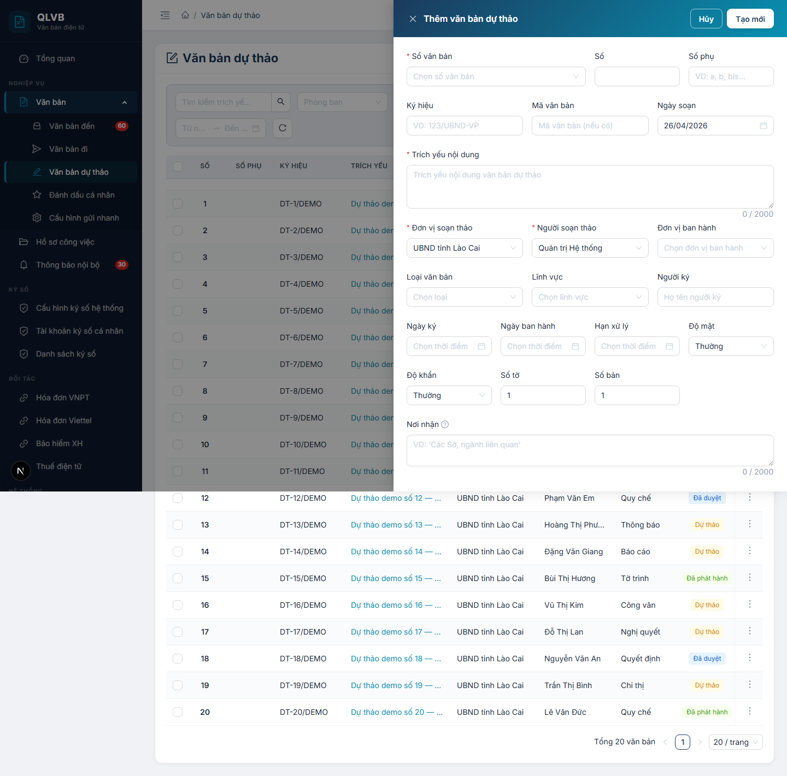
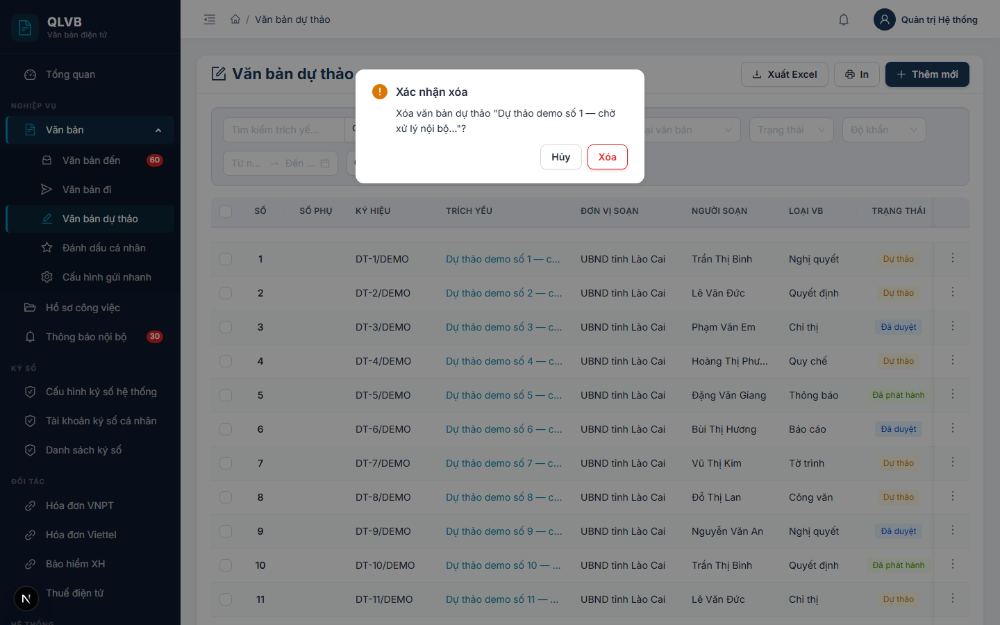
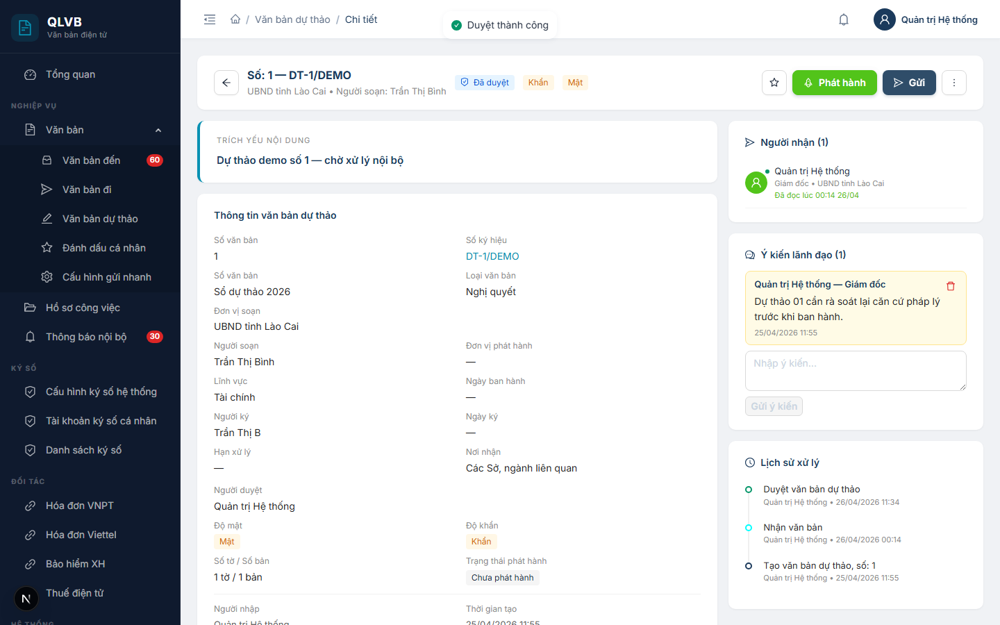
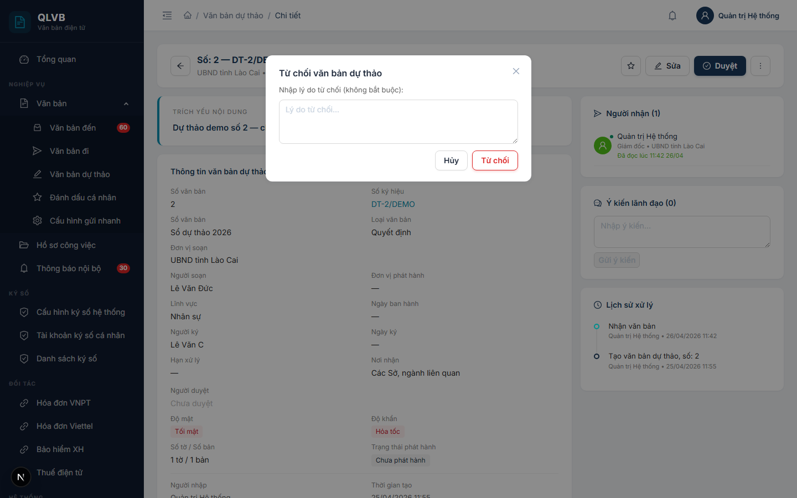
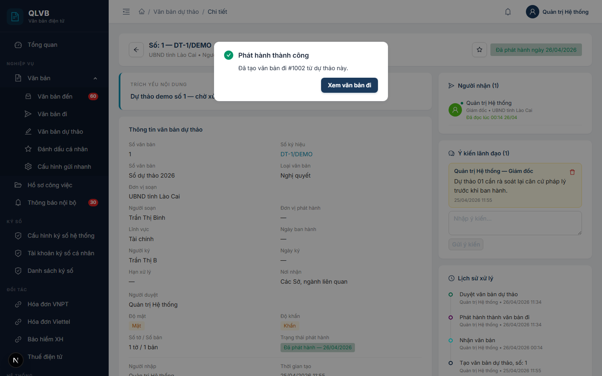
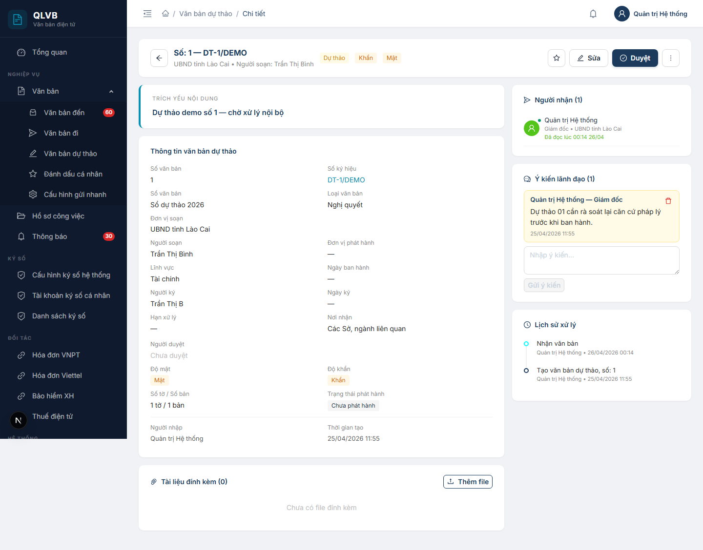
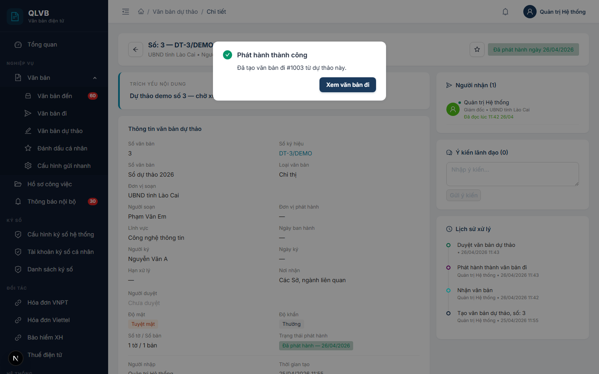

# Văn bản dự thảo

## 1. Giới thiệu

Văn bản dự thảo là phân hệ quản lý các bản thảo nội bộ trước khi trở thành văn bản đi chính thức. Chuyên viên soạn dự thảo, gửi xin ý kiến lãnh đạo, lãnh đạo duyệt hoặc từ chối, sau khi duyệt thì bấm Phát hành để hệ thống tự sinh một văn bản đi mới.

Phân hệ phục vụ ba vai chính:
- Chuyên viên soạn thảo: tạo dự thảo, sửa, gửi xin ý kiến.
- Lãnh đạo: duyệt, từ chối, ghi ý kiến trên dự thảo.
- Văn thư hoặc lãnh đạo có quyền phát hành: bấm Phát hành để biến dự thảo thành văn bản đi.

## 2. Quy trình thao tác và ràng buộc nghiệp vụ

Quy trình chuẩn:

1. Chuyên viên Thêm mới văn bản dự thảo → trạng thái Dự thảo.
2. Chuyên viên đính kèm file, chọn người ký, ghi chú nơi nhận. Nếu cần xin ý kiến cán bộ khác thì bấm Gửi.
3. Lãnh đạo mở chi tiết, đọc, có thể bấm Duyệt, Từ chối kèm lý do, hoặc ghi Ý kiến.
4. Sau khi Duyệt → trạng thái Đã duyệt. Lãnh đạo bấm Phát hành.
5. Hệ thống tạo Văn bản đi mới gắn với dự thảo. Trạng thái dự thảo chuyển sang Đã phát hành (chỉ còn xem, không sửa).

Ràng buộc nghiệp vụ:

- Trích yếu nội dung, Sổ văn bản, Đơn vị soạn thảo, Người soạn thảo là bắt buộc.
- Số tự cấp theo Sổ văn bản — hệ thống lấy số tiếp theo của sổ trong cùng đơn vị.
- Văn bản đã duyệt không sửa, không xóa được. Phải Hủy duyệt trước khi sửa lại.
- Văn bản đã phát hành chỉ xem, không thao tác gì thêm trên dự thảo.
- Khi đã có người nhận trong danh sách Phân công xử lý mà cần đăng ký lại — phải Thu hồi.
- Trường Nơi nhận trong dự thảo chỉ là mô tả tự do. Việc chọn đơn vị nhận chính thức được làm trên Văn bản đi sau khi phát hành.
- Nút Sửa, Duyệt, Phát hành, Gửi, Thu hồi, Xóa hiển thị có điều kiện theo trạng thái và quyền người dùng.

## 3. Các màn hình chức năng

### 3.1. Màn hình danh sách văn bản dự thảo

#### Bố cục màn hình

Trên cùng là tiêu đề "Văn bản dự thảo" với nhóm nút Xuất Excel, In, Thêm mới ở góc phải. Dưới là thanh bộ lọc gồm ô tìm kiếm, lựa chọn phòng ban (chỉ admin), Sổ văn bản, Loại văn bản, Trạng thái, Độ khẩn, khoảng ngày và nút xóa bộ lọc. Phần thân là bảng phân trang.

#### Các nút chức năng

| Nút | Vị trí | Khi nào hiển thị | Tác dụng |
|---|---|---|---|
| Thêm mới | Góc phải tiêu đề | Luôn hiển thị | Mở Drawer thêm văn bản dự thảo |
| Xuất Excel | Góc phải tiêu đề | Luôn hiển thị | Tải file Excel theo bộ lọc |
| In | Góc phải tiêu đề | Luôn hiển thị | In danh sách hiện tại |
| Xóa bộ lọc | Cuối hàng bộ lọc | Luôn hiển thị | Xóa toàn bộ điều kiện lọc |
| Tìm kiếm | Đầu hàng bộ lọc | Luôn hiển thị | Lọc theo trích yếu hoặc số ký hiệu |
| Dropdown thao tác | Cột cuối mỗi dòng | Luôn hiển thị | Mở danh sách thao tác cho dòng đó |

Các mục trong Dropdown thao tác:

| Mục | Khi nào hiển thị | Tác dụng |
|---|---|---|
| Xem chi tiết | Luôn có | Mở trang chi tiết văn bản dự thảo |
| Sửa | Chưa duyệt + chưa phát hành + có quyền sửa | Mở Drawer sửa |
| Duyệt | Chưa duyệt + chưa phát hành + có quyền duyệt | Mở hộp xác nhận duyệt |
| Từ chối | Chưa duyệt + chưa phát hành + chưa từ chối + có quyền duyệt | Mở Modal nhập lý do từ chối |
| Phát hành | Đã duyệt + chưa phát hành + có quyền ban hành | Mở hộp xác nhận phát hành |
| Hủy duyệt | Đã duyệt + chưa phát hành + có quyền duyệt | Mở hộp xác nhận hủy duyệt |
| Thu hồi | Đã duyệt + chưa phát hành + có quyền thu hồi | Mở hộp xác nhận thu hồi |
| Xóa | Chưa duyệt + chưa phát hành + có quyền sửa | Mở hộp xác nhận xóa |

#### Các cột hiển thị

| Tên cột | Mô tả |
|---|---|
| Số | Số thứ tự dự thảo, in đậm |
| Số phụ | Phần phụ của số (a, b, bis...) |
| Ký hiệu | Ký hiệu dự kiến |
| Trích yếu | Tóm tắt nội dung, click mở chi tiết. Có thẻ "Gửi cho tôi" nếu là người nhận |
| Đơn vị soạn | Đơn vị tạo dự thảo |
| Người soạn | Cán bộ soạn thảo |
| Loại VB | Loại văn bản |
| Trạng thái | Dự thảo (vàng) / Đã duyệt (xanh dương) / Đã phát hành (xanh lá) / Từ chối (đỏ) |

#### Thông báo của hệ thống

| Tình huống | Thông báo |
|---|---|
| Lỗi tải danh sách | Lỗi tải danh sách văn bản dự thảo |
| Lỗi xuất Excel | Lỗi xuất Excel |

### 3.2. Drawer thêm/sửa văn bản dự thảo

#### Bố cục màn hình

Drawer mở từ phải, rộng 720px, có gradient xanh thẫm. Tiêu đề "Thêm văn bản dự thảo" hoặc "Sửa văn bản dự thảo". Phần thân là form nhiều hàng. Dưới đầu Drawer có hai nút Hủy và Tạo mới/Cập nhật.

#### Các nút chức năng

| Nút | Vị trí | Khi nào hiển thị | Tác dụng |
|---|---|---|---|
| Tạo mới / Cập nhật | Góc phải đầu Drawer | Luôn có | Lưu, đóng Drawer, tải lại danh sách |
| Hủy | Góc phải đầu Drawer | Luôn có | Đóng Drawer, không lưu |

#### Các trường dữ liệu

| Tên trường | Bắt buộc | Mô tả & ràng buộc |
|---|---|---|
| Sổ văn bản | Có | Chọn từ Sổ văn bản loại Dự thảo. Khi chọn xong tự điền số tiếp theo |
| Số | Không | Số nguyên >= 1 |
| Số phụ | Không | Tối đa 20 ký tự |
| Ký hiệu | Không | Tối đa 100 ký tự |
| Mã văn bản | Không | Tối đa 100 ký tự |
| Ngày soạn | Không | DD/MM/YYYY |
| Trích yếu nội dung | Có | Tối đa 2000 ký tự |
| Đơn vị soạn thảo | Có | Chọn từ cây đơn vị, mặc định là phòng người dùng |
| Người soạn thảo | Có | Phụ thuộc Đơn vị soạn — chọn từ danh sách cán bộ trong đơn vị đó |
| Đơn vị ban hành | Không | Chọn từ cây đơn vị |
| Loại văn bản | Không | Chọn từ danh mục |
| Lĩnh vực | Không | Chọn từ danh mục |
| Người ký | Không | Tối đa 200 ký tự |
| Ngày ký | Không | DD/MM/YYYY |
| Ngày ban hành | Không | DD/MM/YYYY |
| Hạn xử lý | Không | DD/MM/YYYY |
| Độ mật | Không | Thường / Mật / Tối mật / Tuyệt mật |
| Độ khẩn | Không | Thường / Khẩn / Hỏa tốc |
| Số tờ | Không | Số nguyên >= 0, mặc định 1 |
| Số bản | Không | Số nguyên >= 0, mặc định 1 |
| Nơi nhận | Không | Mô tả tự do, tối đa 2000 ký tự. Việc chọn đơn vị nhận chính thức làm trên VB đi sau phát hành |

#### Thông báo của hệ thống

| Tình huống | Thông báo |
|---|---|
| Sổ văn bản chưa chọn | Bắt buộc chọn sổ văn bản |
| Trích yếu rỗng | Bắt buộc nhập trích yếu |
| Đơn vị soạn rỗng | Bắt buộc chọn đơn vị soạn |
| Người soạn rỗng | Bắt buộc chọn người soạn |
| Tạo thành công | Tạo văn bản dự thảo thành công |
| Cập nhật thành công | Cập nhật thành công |
| Không có quyền | Không có quyền sửa văn bản này |

### 3.3. Hộp thoại xác nhận xóa

#### Bố cục màn hình

Hộp thoại nhỏ. Tiêu đề "Xác nhận xóa". Nội dung "Xóa văn bản dự thảo &lt;trích yếu&gt;...?". Hai nút Xóa (đỏ) và Hủy.

#### Các nút chức năng

| Nút | Vị trí | Khi nào hiển thị | Tác dụng |
|---|---|---|---|
| Xóa | Góc phải hộp thoại | Luôn có | Xóa, tải lại danh sách |
| Hủy | Góc phải hộp thoại | Luôn có | Đóng hộp thoại |

#### Thông báo của hệ thống

| Tình huống | Thông báo |
|---|---|
| Xóa thành công | Đã xóa |
| Không có quyền | Không có quyền xóa văn bản này |
| Văn bản đã duyệt | Không thể xóa văn bản đã duyệt |

### 3.4. Hộp thoại xác nhận duyệt

#### Bố cục màn hình

Hộp thoại nhỏ. Tiêu đề "Xác nhận duyệt". Nội dung "Duyệt văn bản dự thảo &lt;trích yếu&gt;...?". Hai nút Duyệt và Hủy.

#### Các nút chức năng

| Nút | Vị trí | Khi nào hiển thị | Tác dụng |
|---|---|---|---|
| Duyệt | Góc phải hộp thoại | Luôn có | Duyệt văn bản, đặt trạng thái Đã duyệt |
| Hủy | Góc phải hộp thoại | Luôn có | Đóng hộp thoại |

#### Thông báo của hệ thống

| Tình huống | Thông báo |
|---|---|
| Duyệt thành công | Duyệt thành công |
| Không có quyền | Không có quyền duyệt văn bản này |

### 3.5. Modal từ chối văn bản dự thảo

#### Bố cục màn hình

Hộp thoại giữa màn hình. Tiêu đề "Từ chối văn bản dự thảo". Trong thân có ô nhập lý do nhiều dòng (không bắt buộc). Hai nút Từ chối (đỏ) và Hủy.

#### Các nút chức năng

| Nút | Vị trí | Khi nào hiển thị | Tác dụng |
|---|---|---|---|
| Từ chối | Góc phải hộp thoại | Luôn có | Đặt văn bản về trạng thái Từ chối kèm lý do |
| Hủy | Góc phải hộp thoại | Luôn có | Đóng hộp thoại |

#### Các trường dữ liệu

| Tên trường | Bắt buộc | Mô tả & ràng buộc |
|---|---|---|
| Lý do từ chối | Không | Nội dung tự do |

#### Thông báo của hệ thống

| Tình huống | Thông báo |
|---|---|
| Từ chối thành công | Đã từ chối văn bản dự thảo |
| Không có quyền | Không có quyền từ chối văn bản này |

### 3.6. Hộp thoại xác nhận phát hành

#### Bố cục màn hình

Hộp thoại nhỏ. Tiêu đề "Xác nhận phát hành". Nội dung cảnh báo "Phát hành văn bản &lt;trích yếu&gt;...? Sau khi phát hành sẽ không thể sửa hoặc xóa." Hai nút Phát hành và Hủy.

Sau khi phát hành thành công, hệ thống mở thêm 1 hộp thoại "Phát hành thành công — Đã tạo văn bản đi #&lt;ID&gt;." với hai nút Xem văn bản đi (chuyển sang trang chi tiết VB đi) và Ở lại.

#### Các nút chức năng

| Nút | Vị trí | Khi nào hiển thị | Tác dụng |
|---|---|---|---|
| Phát hành | Góc phải hộp thoại | Luôn có | Tạo Văn bản đi từ dự thảo, đặt dự thảo về trạng thái Đã phát hành |
| Hủy | Góc phải hộp thoại | Luôn có | Đóng hộp thoại |
| Xem văn bản đi | Hộp thoại thông báo thành công | Sau phát hành thành công | Mở trang chi tiết Văn bản đi mới |
| Ở lại | Hộp thoại thông báo thành công | Sau phát hành thành công | Đóng hộp thoại, ở lại trang dự thảo |

#### Thông báo của hệ thống

| Tình huống | Thông báo |
|---|---|
| Phát hành thành công | Phát hành thành công — Đã tạo văn bản đi #&lt;ID&gt; |
| Không có quyền | Không có quyền phát hành văn bản này |

### 3.7. Trang chi tiết văn bản dự thảo

#### Bố cục màn hình

Trang chi tiết hai cột. Trên cùng là thanh tiêu đề có nút quay lại, số và ký hiệu, đơn vị soạn, người soạn, các thẻ trạng thái và nhóm nút thao tác bên phải. Nếu văn bản từ chối có dải đỏ "Lý do từ chối" dưới thanh tiêu đề.

Cột trái: Trích yếu nội dung, Thông tin văn bản, Tài liệu đính kèm (kèm nút Ký số trên mỗi file).

Cột phải: Người nhận (cán bộ được gửi xin ý kiến), Ý kiến lãnh đạo, Lịch sử xử lý dạng timeline.

#### Các nút chức năng

| Nút | Vị trí | Khi nào hiển thị | Tác dụng |
|---|---|---|---|
| Quay lại | Trái thanh tiêu đề | Luôn có | Quay về danh sách |
| Đánh dấu (sao) | Phải thanh tiêu đề | Luôn có | Bật/tắt đánh dấu cá nhân |
| Sửa | Phải thanh tiêu đề | Chưa duyệt + chưa phát hành + có quyền sửa | Quay về danh sách và mở Drawer sửa |
| Duyệt | Phải thanh tiêu đề | Chưa duyệt + chưa phát hành + có quyền duyệt | Duyệt văn bản |
| Phát hành | Phải thanh tiêu đề | Đã duyệt + chưa phát hành + có quyền ban hành | Mở Modal phát hành |
| Gửi | Phải thanh tiêu đề | Đã duyệt + chưa phát hành + có quyền gửi | Mở Modal Gửi xin ý kiến |
| Dropdown thao tác phụ | Phải thanh tiêu đề | Tùy trạng thái | Mở danh sách thao tác phụ |
| Thẻ Đã phát hành | Phải thanh tiêu đề | Đã phát hành | Hiển thị "Đã phát hành ngày &lt;...&gt;" |
| Thêm file | Khu vực Đính kèm | Chưa duyệt | Mở hộp chọn file để upload |
| Ký số | Mỗi dòng đính kèm | File chưa ký số | Mở Modal ký số file |
| Tải | Mỗi dòng đính kèm | Luôn có | Tải file về máy |
| Xóa file | Mỗi dòng đính kèm | Văn bản chưa duyệt | Mở Popconfirm xóa file |
| Gửi ý kiến | Khu vực Ý kiến lãnh đạo | Luôn có | Lưu ý kiến |

Mục trong Dropdown thao tác phụ:

| Mục | Khi nào hiển thị | Tác dụng |
|---|---|---|
| Từ chối | Chưa duyệt + chưa từ chối + có quyền duyệt | Mở Modal nhập lý do từ chối |
| Xóa văn bản | Chưa duyệt + có quyền sửa | Mở Popconfirm xóa |
| Hủy duyệt | Đã duyệt + chưa phát hành + có quyền duyệt | Hủy duyệt |
| Thu hồi | Đã có người nhận + có quyền thu hồi | Mở Popconfirm thu hồi |

#### Thông báo của hệ thống

| Tình huống | Thông báo |
|---|---|
| Duyệt thành công | Duyệt thành công |
| Hủy duyệt thành công | Hủy duyệt thành công |
| Thu hồi thành công | Thu hồi thành công |
| Tải file lên | Tải lên thành công |
| Xóa file | Đã xóa |
| Thêm ý kiến | Thêm ý kiến thành công |

### 3.8. Modal gửi xin ý kiến

#### Bố cục màn hình

Modal giữa màn hình rộng 560px. Tiêu đề "Gửi văn bản". Trên cùng có Chọn tất cả. Phần thân là danh sách cán bộ gom theo phòng ban có ô chọn. Dưới có hai nút Gửi và Hủy.

#### Các nút chức năng

| Nút | Vị trí | Khi nào hiển thị | Tác dụng |
|---|---|---|---|
| Gửi (N) | Góc phải Modal | Luôn có | Gửi xin ý kiến tới N cán bộ đã chọn |
| Hủy | Góc phải Modal | Luôn có | Đóng Modal |
| Chọn tất cả | Trên đầu danh sách | Luôn có | Tick chọn toàn bộ cán bộ |

#### Các cột hiển thị

| Tên cột | Mô tả |
|---|---|
| Phòng ban | Tiêu đề nhóm cán bộ |
| Họ tên + Chức vụ | Mỗi cán bộ là 1 dòng có ô chọn |

#### Thông báo của hệ thống

| Tình huống | Thông báo |
|---|---|
| Chưa chọn người nhận | Chọn ít nhất một người nhận |
| Gửi thành công | Đã gửi |
| Không có quyền | Không có quyền gửi văn bản này |
